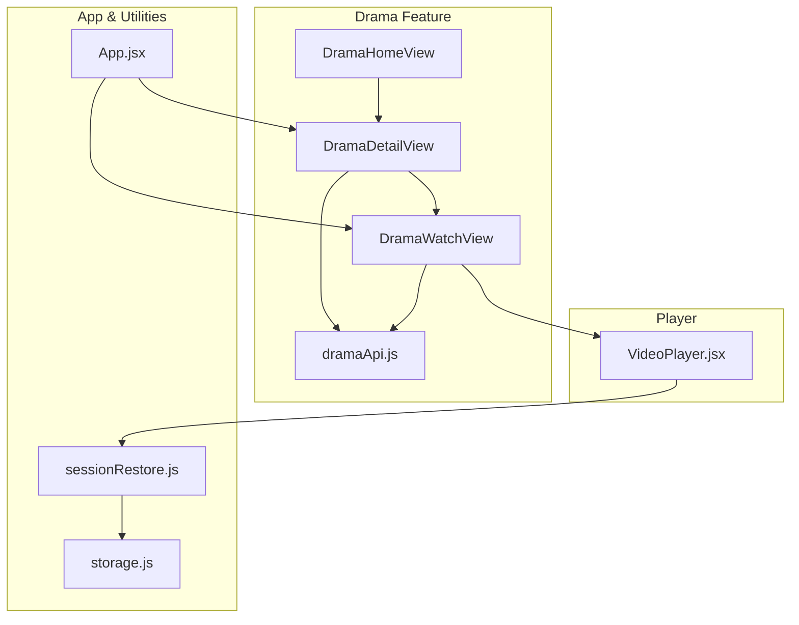
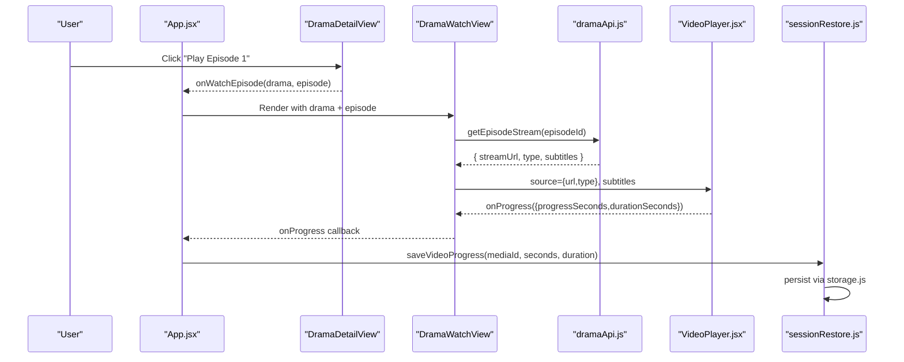
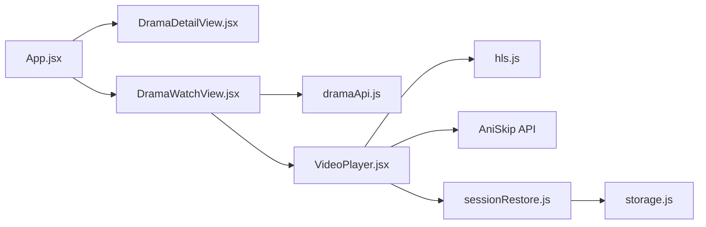

# Drama Detail View

<cite>
**Referenced Files in This Document**
- [DramaDetailView.jsx](file://src/features/drama/components/DramaDetailView.jsx)
- [DramaWatchView.jsx](file://src/features/drama/components/DramaWatchView.jsx)
- [VideoPlayer.jsx](file://src/components/VideoPlayer.jsx)
- [dramaApi.js](file://src/features/drama/api/dramaApi.js)
- [App.jsx](file://src/App.jsx)
- [sessionRestore.js](file://src/utils/sessionRestore.js)
- [storage.js](file://src/utils/storage.js)
- [index.css](file://src/index.css)
</cite>

## Table of Contents
1. [Introduction](#introduction)
2. [Project Structure](#project-structure)
3. [Core Components](#core-components)
4. [Architecture Overview](#architecture-overview)
5. [Detailed Component Analysis](#detailed-component-analysis)
6. [Dependency Analysis](#dependency-analysis)
7. [Performance Considerations](#performance-considerations)
8. [Troubleshooting Guide](#troubleshooting-guide)
9. [Conclusion](#conclusion)
10. [Appendices](#appendices)

## Introduction
This document explains the Drama Detail View component and its surrounding ecosystem for displaying comprehensive information about individual drama series, navigating seasons and episodes, streaming playback with quality and subtitle controls, and integrating progress tracking. It also provides guidance on extending metadata fields, adding review systems, and implementing episode-specific features such as bookmarks or notes.

## Project Structure
The drama feature is organized under a dedicated folder with API and UI components:
- Feature components: Drama home, detail, watch views, cards, and rows
- API layer: Endpoints to fetch catalog, drama info, stream URLs, and search results
- Player integration: A shared VideoPlayer component that handles HLS, subtitles, quality selection, and more
- State and persistence: App-level state management and session/progress utilities

**Diagram sources**
- [DramaDetailView.jsx:1-74](file://src/features/drama/components/DramaDetailView.jsx#L1-L74)
- [DramaWatchView.jsx:1-103](file://src/features/drama/components/DramaWatchView.jsx#L1-L103)
- [VideoPlayer.jsx:1-800](file://src/components/VideoPlayer.jsx#L1-L800)
- [dramaApi.js:1-33](file://src/features/drama/api/dramaApi.js#L1-L33)
- [App.jsx:165-176](file://src/App.jsx#L165-L176)
- [sessionRestore.js:57-95](file://src/utils/sessionRestore.js#L57-L95)
- [storage.js:29-70](file://src/utils/storage.js#L29-L70)

**Section sources**
- [DramaDetailView.jsx:1-74](file://src/features/drama/components/DramaDetailView.jsx#L1-L74)
- [DramaWatchView.jsx:1-103](file://src/features/drama/components/DramaWatchView.jsx#L1-L103)
- [dramaApi.js:1-33](file://src/features/drama/api/dramaApi.js#L1-L33)
- [App.jsx:165-176](file://src/App.jsx#L165-L176)
- [sessionRestore.js:57-95](file://src/utils/sessionRestore.js#L57-L95)
- [storage.js:29-70](file://src/utils/storage.js#L29-L70)

## Core Components
- DramaDetailView: Displays drama metadata (title, synopsis, release year, country, status), hero image, and an episode grid with pagination toggle.
- DramaWatchView: Hosts the player, subtitle selector, and episode list; manages active subtitle track and loading/error states.
- VideoPlayer: Handles HLS playback, quality levels, audio tracks, CC/subtitles, keyboard shortcuts, fullscreen/PiP, skip intro/outro, and progress reporting.
- dramaApi: Provides endpoints for fetching drama catalog, drama info, episode streams, and search results.
- App.jsx: Orchestrates navigation between drama views, holds selected drama and episode state, and integrates session/progress persistence.
- sessionRestore.js and storage.js: Persist video progress and app session state across reloads and device restarts.

**Section sources**
- [DramaDetailView.jsx:1-74](file://src/features/drama/components/DramaDetailView.jsx#L1-L74)
- [DramaWatchView.jsx:1-103](file://src/features/drama/components/DramaWatchView.jsx#L1-L103)
- [VideoPlayer.jsx:1-800](file://src/components/VideoPlayer.jsx#L1-L800)
- [dramaApi.js:1-33](file://src/features/drama/api/dramaApi.js#L1-L33)
- [App.jsx:165-176](file://src/App.jsx#L165-L176)
- [sessionRestore.js:57-95](file://src/utils/sessionRestore.js#L57-L95)
- [storage.js:29-70](file://src/utils/storage.js#L29-L70)

## Architecture Overview
The Drama Detail View follows a unidirectional data flow:
- App.jsx maintains selected drama and current episode, renders DramaDetailView or DramaWatchView based on navigation.
- DramaDetailView shows metadata and triggers navigation to DramaWatchView via callbacks.
- DramaWatchView requests stream data from dramaApi, then passes source and subtitles to VideoPlayer.
- VideoPlayer reports playback progress back to App.jsx, which persists it using sessionRestore.js and storage.js.

**Diagram sources**
- [DramaDetailView.jsx:23-30](file://src/features/drama/components/DramaDetailView.jsx#L23-L30)
- [DramaWatchView.jsx:1-103](file://src/features/drama/components/DramaWatchView.jsx#L1-L103)
- [dramaApi.js:18-22](file://src/features/drama/api/dramaApi.js#L18-L22)
- [VideoPlayer.jsx:321-332](file://src/components/VideoPlayer.jsx#L321-L332)
- [sessionRestore.js:63-72](file://src/utils/sessionRestore.js#L63-L72)

## Detailed Component Analysis

### DramaDetailView
Responsibilities:
- Hero section with background image, title, and metadata (release year, country, status).
- Synopsis display if available.
- Episode grid showing up to 24 episodes by default with a “Show All” toggle.
- Episode buttons include a SUB badge when subtitles are available.
- Triggers navigation to watch mode via onWatchEpisode callback.

Key behaviors:
- Safely handles missing or non-array episodes.
- Uses a local showAll state to expand/collapse the episode list.
- Renders a loader while episodes are being fetched by parent.

Extensibility ideas:
- Add cast, genres, ratings, or custom fields by rendering additional metadata blocks below the synopsis.
- Integrate a review system by adding a collapsible section with rating stars and user reviews.
- Add episode-specific bookmarks/notes by storing per-episode entries keyed by episode id.

**Section sources**
- [DramaDetailView.jsx:5-74](file://src/features/drama/components/DramaDetailView.jsx#L5-L74)
- [index.css:4892-4970](file://src/index.css#L4892-L4970)

### DramaWatchView
Responsibilities:
- Display the selected episode number and return button.
- Manage subtitle selection and auto-select default English track when stream loads.
- Render error/loading states and pass stream source to VideoPlayer.
- Provide an episode list for quick switching within the same drama.

Subtitle handling:
- Maintains activeSub state representing the currently selected subtitle file URL.
- Builds a single-element subtitle array for VideoPlayer to avoid multiple track mounts.
- Exposes a subtitle selector UI with Off and per-track labels.

Episode list:
- Shows first 50 episodes with an active indicator for the current episode.
- Delegates episode selection to onEpisodeSelect callback.

Integration points:
- Receives drama, episode, stream, loading, and callbacks from App.jsx.
- Uses VideoPlayer props: source.url, source.isM3U8/type, poster, and subtitles.

**Section sources**
- [DramaWatchView.jsx:1-103](file://src/features/drama/components/DramaWatchView.jsx#L1-L103)

### VideoPlayer
Capabilities relevant to drama playback:
- HLS support via hls.js with automatic quality level detection and manual switching.
- Native HLS path for iOS Safari.
- Subtitle tracks via <track> elements; CC toggle supported.
- Audio track selection and preferred language auto-selection.
- Progress reporting through onProgress callback at intervals and near completion.
- Skip Intro/Outro integration using AniSkip API when malId and episodeNumber are provided.
- Keyboard shortcuts, fullscreen, picture-in-picture, timeline scrubbing with preview tooltip.
- Error handling with retry attempts for network/media errors and fallback messages.

Quality options:
- Quality menu populated from HLS manifest levels; Auto mode by default.
- Manual quality selection updates currentLevel on HLS instance.

Subtitle support:
- Accepts subtitles prop as an array of track objects with url, lang, label, default.
- Toggles CC visibility across textTracks.

Progress tracking:
- Emits onProgress with progressSeconds and durationSeconds periodically and when nearing the end.

**Section sources**
- [VideoPlayer.jsx:1-800](file://src/components/VideoPlayer.jsx#L1-L800)

### API Layer (dramaApi.js)
Endpoints:
- Home catalog: GET /api/drama/home
- Drama info: GET /api/drama/info/:id
- Episode stream: GET /api/drama/stream/:episodeId
- Search: GET /api/drama/search?q=:query

Error handling:
- Throws descriptive errors on non-ok responses for catalog and info calls.
- Returns empty arrays for search failures to keep UI resilient.

Usage:
- DramaDetailView and DramaWatchView rely on these endpoints to populate metadata and stream data.

**Section sources**
- [dramaApi.js:1-33](file://src/features/drama/api/dramaApi.js#L1-L33)

### App.jsx Integration
State and navigation:
- Holds dramaHomeData, selectedDrama, dramaEpisode, dramaStream, and related loading flags.
- Renders DramaDetailView and DramaWatchView based on view routing.
- Integrates session restoration to resume last viewed drama and episode.

Progress persistence:
- Uses sessionRestore.js to save and restore video progress per media item.
- Persists minimal session snapshots including drama and episode identifiers.

**Section sources**
- [App.jsx:165-176](file://src/App.jsx#L165-L176)
- [sessionRestore.js:101-158](file://src/utils/sessionRestore.js#L101-L158)

## Dependency Analysis
Component relationships and coupling:
- DramaDetailView depends on App.jsx for navigation and data.
- DramaWatchView depends on dramaApi for stream data and on VideoPlayer for playback.
- VideoPlayer depends on HLS library and optional external APIs (AniSkip).
- Session and progress utilities depend on storage.js for cross-platform persistence.

Potential circular dependencies:
- None detected; data flows downward from App.jsx to feature components and player.

External integrations:
- HLS.js for adaptive streaming.
- AniSkip API for intro/outro skipping.
- Capacitor Preferences for native storage fallback.

**Diagram sources**
- [App.jsx:165-176](file://src/App.jsx#L165-L176)
- [DramaWatchView.jsx:1-103](file://src/features/drama/components/DramaWatchView.jsx#L1-L103)
- [dramaApi.js:1-33](file://src/features/drama/api/dramaApi.js#L1-L33)
- [VideoPlayer.jsx:1-800](file://src/components/VideoPlayer.jsx#L1-L800)
- [sessionRestore.js:57-95](file://src/utils/sessionRestore.js#L57-L95)
- [storage.js:29-70](file://src/utils/storage.js#L29-L70)

**Section sources**
- [App.jsx:165-176](file://src/App.jsx#L165-L176)
- [DramaWatchView.jsx:1-103](file://src/features/drama/components/DramaWatchView.jsx#L1-L103)
- [dramaApi.js:1-33](file://src/features/drama/api/dramaApi.js#L1-L33)
- [VideoPlayer.jsx:1-800](file://src/components/VideoPlayer.jsx#L1-L800)
- [sessionRestore.js:57-95](file://src/utils/sessionRestore.js#L57-L95)
- [storage.js:29-70](file://src/utils/storage.js#L29-L70)

## Performance Considerations
- Episode list pagination: DramaDetailView limits initial render to 24 episodes to reduce DOM size; “Show All” expands lazily.
- Single subtitle track: DramaWatchView constructs a one-element subtitle array to avoid redundant track mounts.
- HLS buffering: VideoPlayer configures buffer lengths and retries to improve resilience; native HLS path used on iOS.
- Progress throttling: VideoPlayer emits progress updates only when time changes significantly or near completion to minimize overhead.
- Storage efficiency: sessionRestore stores minimal metadata and expires old sessions/progress to prevent bloat.

[No sources needed since this section provides general guidance]

## Troubleshooting Guide
Common issues and resolutions:
- Stream fails to load:
  - Check dramaApi.getEpisodeStream response for error field.
  - VideoPlayer sets an error message and stops buffering; verify network and CORS settings.
- No subtitles available:
  - Ensure stream includes subtitles array; DramaWatchView will hide selector if none present.
- Quality not changing:
  - Confirm HLS manifest contains multiple levels; VideoPlayer populates quality menu only when levels exist.
- Progress not saved:
  - Verify onProgress callback is wired and mediaId is valid; sessionRestore ignores tiny progress (<5s) and expired entries (>30 days).

**Section sources**
- [dramaApi.js:18-22](file://src/features/drama/api/dramaApi.js#L18-L22)
- [VideoPlayer.jsx:244-261](file://src/components/VideoPlayer.jsx#L244-L261)
- [VideoPlayer.jsx:321-332](file://src/components/VideoPlayer.jsx#L321-L332)
- [sessionRestore.js:63-95](file://src/utils/sessionRestore.js#L63-L95)

## Conclusion
The Drama Detail View provides a robust foundation for displaying drama metadata, managing episodes, and streaming content with high-quality playback, subtitle support, and progress persistence. Its modular design allows easy extension for custom metadata, reviews, and episode-specific features like bookmarks or notes. The integration with App.jsx and utility modules ensures seamless navigation and reliable state recovery across sessions.

[No sources needed since this section summarizes without analyzing specific files]

## Appendices

### Extending Metadata Fields
- Add new fields (e.g., cast, genres, ratings) by updating the drama object shape and rendering them in DramaDetailView beneath the synopsis.
- Fetch additional details via dramaApi by extending endpoints or enriching drama info responses.

**Section sources**
- [DramaDetailView.jsx:35-40](file://src/features/drama/components/DramaDetailView.jsx#L35-L40)
- [dramaApi.js:12-16](file://src/features/drama/api/dramaApi.js#L12-L16)

### Adding a Review System
- Create a collapsible section in DramaDetailView to display average rating and user reviews.
- Store reviews locally or via backend; integrate with App.jsx state for persistence and sync.

[No sources needed since this section proposes conceptual enhancements]

### Managing Episode-Specific Features (Bookmarks/Notes)
- Use episode.id as a key to store bookmarks or notes in localStorage or cloud storage.
- Surface these features in DramaDetailView’s episode grid or DramaWatchView’s episode list.

[No sources needed since this section proposes conceptual enhancements]

### Streaming Quality Options
- Quality levels are derived from HLS manifests; users can switch via the quality menu in VideoPlayer.
- Auto mode selects optimal quality; manual selection overrides for consistent bitrate.

**Section sources**
- [VideoPlayer.jsx:199-210](file://src/components/VideoPlayer.jsx#L199-L210)
- [VideoPlayer.jsx:507-513](file://src/components/VideoPlayer.jsx#L507-L513)

### Subtitle Support
- Subtitles are passed as a single track array to VideoPlayer; DramaWatchView manages active selection and defaults.
- Toggle CC via keyboard shortcut or player controls; multiple tracks can be mounted if needed.

**Section sources**
- [DramaWatchView.jsx:20-27](file://src/features/drama/components/DramaWatchView.jsx#L20-L27)
- [VideoPlayer.jsx:734-743](file://src/components/VideoPlayer.jsx#L734-L743)

### Player Integration and Progress Tracking
- Wire onProgress in VideoPlayer to update App.jsx state and persist via sessionRestore.js.
- Resume playback from saved position using getVideoProgress when loading a new episode.

**Section sources**
- [VideoPlayer.jsx:321-332](file://src/components/VideoPlayer.jsx#L321-L332)
- [sessionRestore.js:63-95](file://src/utils/sessionRestore.js#L63-L95)