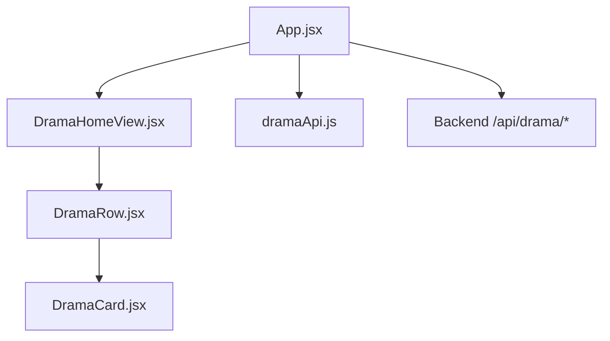
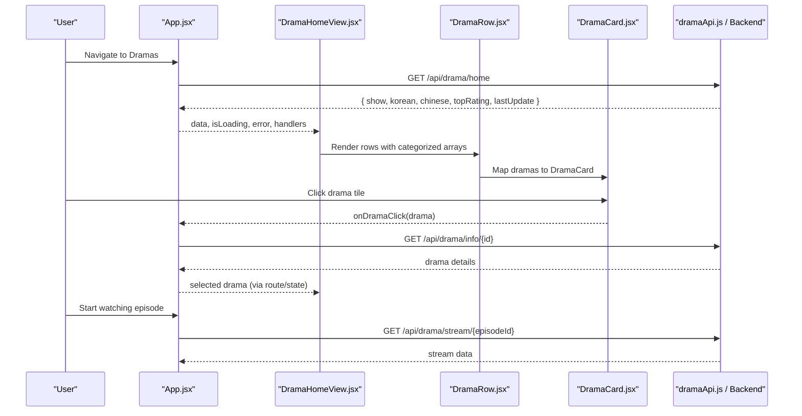
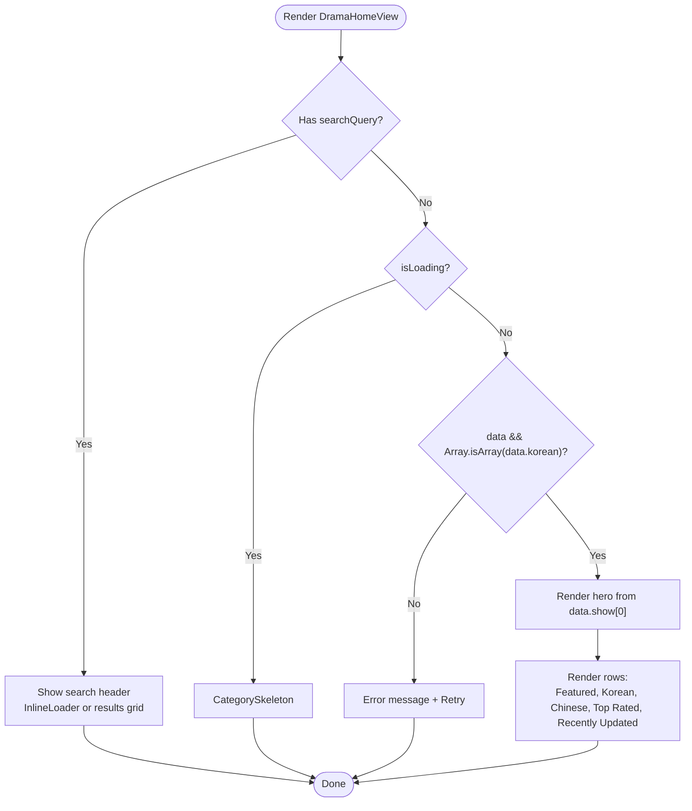
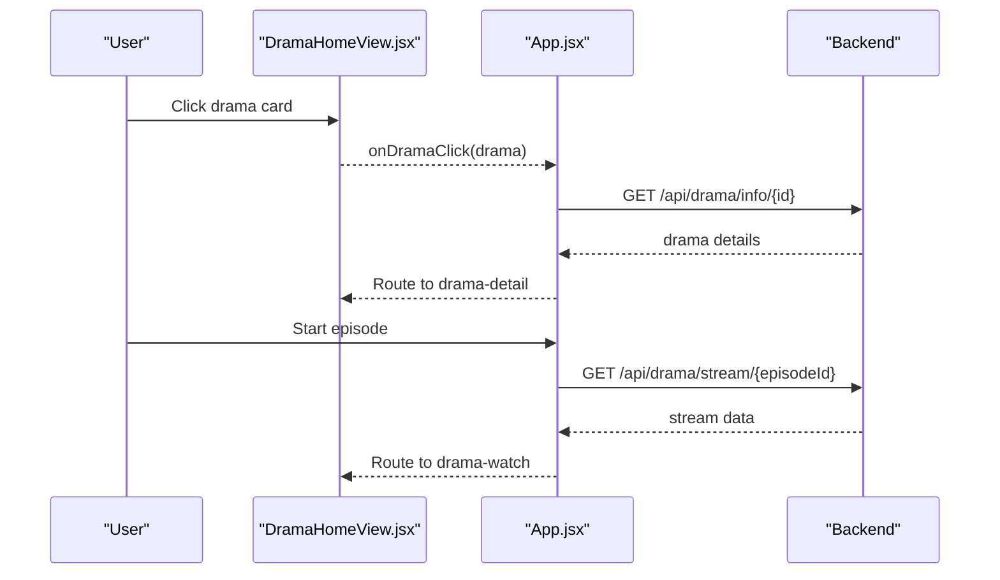
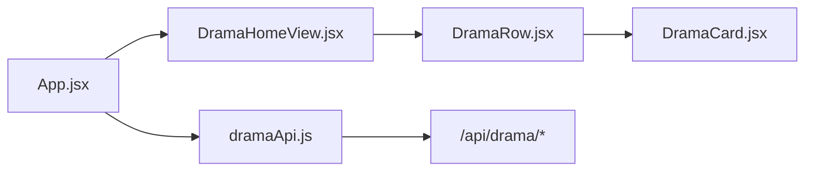

# Drama Home View

<cite>
**Referenced Files in This Document**
- [DramaHomeView.jsx](file://src/features/drama/components/DramaHomeView.jsx)
- [DramaCard.jsx](file://src/features/drama/components/DramaCard.jsx)
- [DramaRow.jsx](file://src/features/drama/components/DramaRow.jsx)
- [dramaApi.js](file://src/features/drama/api/dramaApi.js)
- [App.jsx](file://src/App.jsx)
</cite>

## Table of Contents
1. [Introduction](#introduction)
2. [Project Structure](#project-structure)
3. [Core Components](#core-components)
4. [Architecture Overview](#architecture-overview)
5. [Detailed Component Analysis](#detailed-component-analysis)
6. [Dependency Analysis](#dependency-analysis)
7. [Performance Considerations](#performance-considerations)
8. [Troubleshooting Guide](#troubleshooting-guide)
9. [Conclusion](#conclusion)
10. [Appendices](#appendices)

## Introduction
This document explains the Drama Home View component, which is the main entry point for discovering drama content. It covers the home page layout, featured hero section, genre-based rows (Korean, Chinese, Top Rated, Recently Updated), trending display, search integration, navigation to detail and watch views, loading/error states, and responsive grid behavior. It also provides guidance on customizing layouts, adding categories, and optimizing performance for large catalogs.

## Project Structure
The Drama feature is organized under a dedicated folder with components and an API module:
- Components:
  - DramaHomeView: orchestrates the home layout and sections
  - DramaRow: renders a horizontal row with a title and cards
  - DramaCard: displays individual drama tiles with image fallbacks and metadata
- API:
  - dramaApi: encapsulates backend endpoints for catalog, info, stream, and search

**Diagram sources**
- [App.jsx:1142-1177](file://src/App.jsx#L1142-L1177)
- [DramaHomeView.jsx:1-131](file://src/features/drama/components/DramaHomeView.jsx#L1-L131)
- [DramaRow.jsx:1-23](file://src/features/drama/components/DramaRow.jsx#L1-L23)
- [DramaCard.jsx:1-41](file://src/features/drama/components/DramaCard.jsx#L1-L41)
- [dramaApi.js:1-33](file://src/features/drama/api/dramaApi.js#L1-L33)

**Section sources**
- [DramaHomeView.jsx:1-131](file://src/features/drama/components/DramaHomeView.jsx#L1-L131)
- [DramaRow.jsx:1-23](file://src/features/drama/components/DramaRow.jsx#L1-L23)
- [DramaCard.jsx:1-41](file://src/features/drama/components/DramaCard.jsx#L1-L41)
- [dramaApi.js:1-33](file://src/features/drama/api/dramaApi.js#L1-L33)
- [App.jsx:1142-1177](file://src/App.jsx#L1142-L1177)

## Core Components
- DramaHomeView
  - Renders a cinematic hero using the first item from data.show
  - Displays multiple categorized rows: Featured, Most Popular Korean, Most Popular Chinese, Top Rated, Recently Updated
  - Handles search mode with a responsive grid and inline loader
  - Shows skeletons while loading and error state with retry when data is invalid
- DramaRow
  - Accepts a title, optional icon, array of dramas, and click handler
  - Renders a section header and a slider container that maps items to DramaCard
- DramaCard
  - Displays thumbnail with lazy loading and error fallback to a placeholder
  - Shows episode count badge and hover overlay with play icon
  - Emits onClick to navigate to drama details

**Section sources**
- [DramaHomeView.jsx:17-125](file://src/features/drama/components/DramaHomeView.jsx#L17-L125)
- [DramaRow.jsx:4-20](file://src/features/drama/components/DramaRow.jsx#L4-L20)
- [DramaCard.jsx:4-38](file://src/features/drama/components/DramaCard.jsx#L4-L38)

## Architecture Overview
The app coordinates data fetching and routing at the top level, then passes props down to DramaHomeView. The flow includes:
- On entering the dramas view, App fetches the drama home catalog once per session
- DramaHomeView renders either search results or categorized rows based on props
- Clicking a card navigates via handleDramaClick to drama-detail, then optionally to drama-watch for streaming

**Diagram sources**
- [App.jsx:1142-1177](file://src/App.jsx#L1142-L1177)
- [App.jsx:1835-1902](file://src/App.jsx#L1835-L1902)
- [DramaHomeView.jsx:17-125](file://src/features/drama/components/DramaHomeView.jsx#L17-L125)
- [DramaRow.jsx:4-20](file://src/features/drama/components/DramaRow.jsx#L4-L20)
- [DramaCard.jsx:4-38](file://src/features/drama/components/DramaCard.jsx#L4-L38)
- [dramaApi.js:5-29](file://src/features/drama/api/dramaApi.js#L5-L29)

## Detailed Component Analysis

### DramaHomeView
- Layout
  - Hero banner uses the first item from data.show; shows title, badges, and a Play button
  - Rows section composes multiple DramaRow instances with distinct titles and icons
  - Search mode switches to a responsive grid of DramaCard items with inline loader
- Data binding
  - Featured: data.show[0]
  - Rows: data.korean, data.chinese, data.topRating, data.lastUpdate
- States
  - Loading: CategorySkeleton
  - Error: message and Retry button
  - Search: InlineLoader and empty-state messaging

**Diagram sources**
- [DramaHomeView.jsx:17-125](file://src/features/drama/components/DramaHomeView.jsx#L17-L125)

**Section sources**
- [DramaHomeView.jsx:17-125](file://src/features/drama/components/DramaHomeView.jsx#L17-L125)

### DramaRow
- Purpose: Section wrapper with header and horizontal list
- Behavior: Skips rendering if no dramas provided; maps each drama to DramaCard with click handler

**Section sources**
- [DramaRow.jsx:4-20](file://src/features/drama/components/DramaRow.jsx#L4-L20)

### DramaCard
- Purpose: Tile for a single drama
- Features:
  - Lazy-loaded images with onError fallback to a text placeholder
  - Episode count badge when available
  - Hover overlay with play icon
  - Emits onClick to trigger navigation

**Section sources**
- [DramaCard.jsx:4-38](file://src/features/drama/components/DramaCard.jsx#L4-L38)

### API Integration
- Endpoints used by the app and/or API module:
  - Catalog: GET /api/drama/home
  - Info: GET /api/drama/info/{id}
  - Stream: GET /api/drama/stream/{episodeId}
  - Search: GET /api/drama/search?q={query}
- Error handling:
  - Non-ok responses throw descriptive errors or return empty arrays for search
  - App-level error state surfaces user-friendly messages and retry option

**Section sources**
- [dramaApi.js:5-29](file://src/features/drama/api/dramaApi.js#L5-L29)
- [App.jsx:1142-1177](file://src/App.jsx#L1142-L1177)
- [App.jsx:1835-1902](file://src/App.jsx#L1835-L1902)

### Navigation and Interaction Handlers
- handleDramaClick
  - Navigates to drama-detail and loads full info via /api/drama/info/{id}
  - Includes smart routing to redirect anime-like titles back to the anime player
- startWatchingDrama
  - Navigates to drama-watch and fetches stream via /api/drama/stream/{episodeId}
- handleDramaSearch
  - Debounced search against /api/drama/search?q=...
  - Normalizes response formats and updates search results

**Diagram sources**
- [App.jsx:1835-1902](file://src/App.jsx#L1835-L1902)
- [DramaHomeView.jsx:17-125](file://src/features/drama/components/DramaHomeView.jsx#L17-L125)

**Section sources**
- [App.jsx:1835-1902](file://src/App.jsx#L1835-L1902)

## Dependency Analysis
- DramaHomeView depends on:
  - DramaRow and DramaCard for rendering lists
  - App-provided props: data, error, isLoading, searchQuery, searchResults, searchLoading, onSearch, onDramaClick
- App manages:
  - Fetching drama home catalog once per session when view === 'dramas'
  - Routing and state for drama detail/watch
  - Search orchestration and debouncing
- dramaApi centralizes endpoint calls and error handling

**Diagram sources**
- [App.jsx:1142-1177](file://src/App.jsx#L1142-L1177)
- [DramaHomeView.jsx:1-131](file://src/features/drama/components/DramaHomeView.jsx#L1-L131)
- [DramaRow.jsx:1-23](file://src/features/drama/components/DramaRow.jsx#L1-L23)
- [DramaCard.jsx:1-41](file://src/features/drama/components/DramaCard.jsx#L1-L41)
- [dramaApi.js:1-33](file://src/features/drama/api/dramaApi.js#L1-L33)

**Section sources**
- [App.jsx:1142-1177](file://src/App.jsx#L1142-L1177)
- [dramaApi.js:1-33](file://src/features/drama/api/dramaApi.js#L1-L33)

## Performance Considerations
- Image optimization
  - Use lazy loading on thumbnails to reduce initial payload
  - Provide fallback placeholders on image errors to avoid layout shifts
- Rendering efficiency
  - Avoid re-rendering entire rows by keeping stable keys and minimizing prop churn
  - Keep row data shallow; pass only necessary fields to DramaCard
- Network requests
  - Fetch drama home catalog once per session and cache in App state
  - Debounce search inputs to limit network calls
- Large catalogs
  - Consider virtualization or pagination for very long rows
  - Preload next batch of items in background when scrolling near end
- Streaming
  - Load stream only when user initiates playback
  - Handle errors gracefully and provide retry UI

[No sources needed since this section provides general guidance]

## Troubleshooting Guide
- No data or unexpected response
  - Symptom: Error message with Retry button
  - Cause: Backend returned non-OK status or missing expected arrays
  - Action: Verify backend availability and response shape; use Retry to reload
- Search returns empty
  - Symptom: “No dramas found.”
  - Cause: Query did not match any items or provider returned empty
  - Action: Adjust query; check network tab for response format
- Images not loading
  - Symptom: Placeholder shown instead of poster
  - Cause: Broken URL or CORS issue
  - Action: Inspect network logs; ensure correct thumbnail URLs
- Navigation issues
  - Symptom: Clicking a card does not open detail
  - Cause: Missing onDramaClick handler or incorrect route state
  - Action: Ensure App passes onDramaClick and routes are set correctly

**Section sources**
- [DramaHomeView.jsx:41-54](file://src/features/drama/components/DramaHomeView.jsx#L41-L54)
- [App.jsx:1142-1177](file://src/App.jsx#L1142-L1177)
- [App.jsx:1835-1902](file://src/App.jsx#L1835-L1902)

## Conclusion
The Drama Home View provides a polished, Netflix-style discovery experience with a prominent hero, categorized rows, and integrated search. It relies on a clean separation between presentation (components) and data access (API), with robust error handling and clear navigation flows to detail and watch views. Following the customization and performance recommendations will help scale the experience for larger catalogs and improve responsiveness.

[No sources needed since this section summarizes without analyzing specific files]

## Appendices

### Customizing the Home Layout
- Add a new category row
  - Extend DramaHomeView to include a new DramaRow with a title, icon, and data source
  - Ensure backend exposes the corresponding array in the home catalog response
- Change hero behavior
  - Modify how featured is derived from data (e.g., pick by popularity or randomize)
- Adjust search grid
  - Update CSS classes or grid template columns to change card sizing and spacing

**Section sources**
- [DramaHomeView.jsx:94-125](file://src/features/drama/components/DramaHomeView.jsx#L94-L125)

### Optimizing for Large Catalogs
- Implement infinite scroll or pagination within rows
- Virtualize long lists to reduce DOM nodes
- Cache fetched catalogs locally to minimize repeated requests
- Defer heavy operations (like stream resolution) until user interaction

[No sources needed since this section provides general guidance]