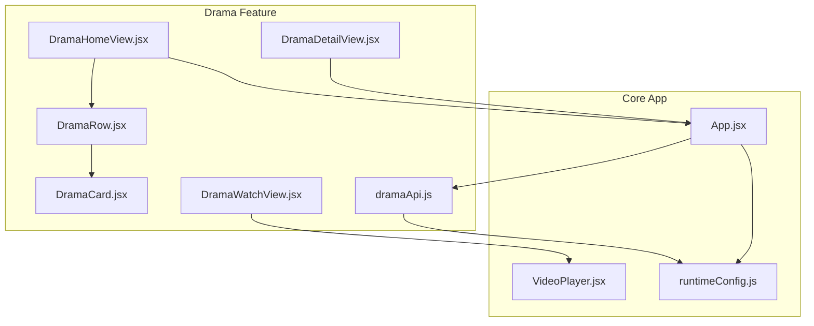
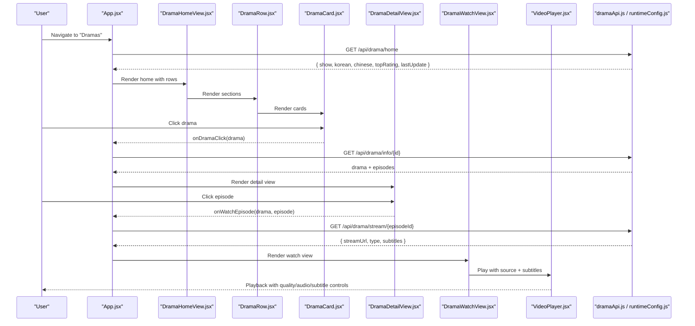
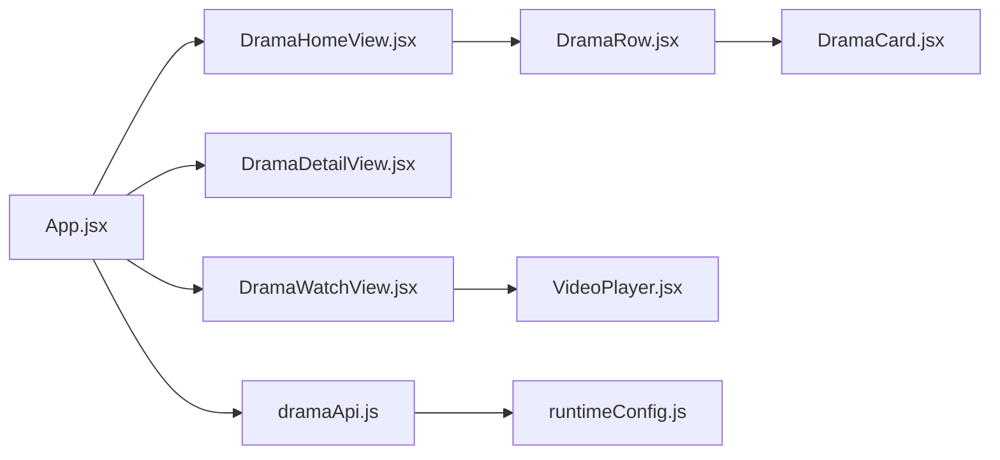

# Drama Series

<cite>
**Referenced Files in This Document**
- [App.jsx](file://src/App.jsx)
- [dramaApi.js](file://src/features/drama/api/dramaApi.js)
- [DramaHomeView.jsx](file://src/features/drama/components/DramaHomeView.jsx)
- [DramaRow.jsx](file://src/features/drama/components/DramaRow.jsx)
- [DramaCard.jsx](file://src/features/drama/components/DramaCard.jsx)
- [DramaDetailView.jsx](file://src/features/drama/components/DramaDetailView.jsx)
- [DramaWatchView.jsx](file://src/features/drama/components/DramaWatchView.jsx)
- [VideoPlayer.jsx](file://src/components/VideoPlayer.jsx)
- [runtimeConfig.js](file://src/runtimeConfig.js)
</cite>

## Table of Contents
1. Introduction
2. Project Structure
3. Core Components
4. Architecture Overview
5. Detailed Component Analysis
6. Dependency Analysis
7. Performance Considerations
8. Troubleshooting Guide
9. Conclusion
10. Appendices

## Introduction
This document explains the Drama Series system within Project Anime. It covers international drama content management (Korean, Japanese, and other regional dramas), season and episode navigation with progress tracking and resume, drama detail views, watch view with episode selection, quality options, and subtitle support, and the drama row component for organizing series by genre or popularity. It also provides guidance on adding new drama sources, implementing custom categories, and managing series metadata, including cross-cultural handling and localization considerations.

## Project Structure
The Drama feature is implemented as a set of React components under src/features/drama with an API layer and integration into the main application routing and state.

**Diagram sources**
- [DramaHomeView.jsx:1-131](file://src/features/drama/components/DramaHomeView.jsx#L1-L131)
- [DramaRow.jsx:1-23](file://src/features/drama/components/DramaRow.jsx#L1-L23)
- [DramaCard.jsx:1-41](file://src/features/drama/components/DramaCard.jsx#L1-L41)
- [DramaDetailView.jsx:1-74](file://src/features/drama/components/DramaDetailView.jsx#L1-L74)
- [DramaWatchView.jsx:1-103](file://src/features/drama/components/DramaWatchView.jsx#L1-L103)
- [dramaApi.js:1-33](file://src/features/drama/api/dramaApi.js#L1-L33)
- [App.jsx:1141-1177](file://src/App.jsx#L1141-L1177)
- [runtimeConfig.js:1-163](file://src/runtimeConfig.js#L1-L163)

**Section sources**
- [DramaHomeView.jsx:1-131](file://src/features/drama/components/DramaHomeView.jsx#L1-L131)
- [DramaRow.jsx:1-23](file://src/features/drama/components/DramaRow.jsx#L1-L23)
- [DramaCard.jsx:1-41](file://src/features/drama/components/DramaCard.jsx#L1-L41)
- [DramaDetailView.jsx:1-74](file://src/features/drama/components/DramaDetailView.jsx#L1-L74)
- [DramaWatchView.jsx:1-103](file://src/features/drama/components/DramaWatchView.jsx#L1-L103)
- [dramaApi.js:1-33](file://src/features/drama/api/dramaApi.js#L1-L33)
- [App.jsx:1141-1177](file://src/App.jsx#L1141-L1177)
- [runtimeConfig.js:1-163](file://src/runtimeConfig.js#L1-L163)

## Core Components
- Drama Home View: Displays featured hero, search results, and categorized rows (Featured, Korean, Chinese, Top Rated, Recently Updated).
- Drama Row: Renders a horizontal section with a title and icon, mapping to DramaCard tiles.
- Drama Card: Tile showing thumbnail, title, country/status, and episode count; supports image error fallback.
- Drama Detail View: Hero banner, synopsis, and paginated episode list with “Show All” toggle.
- Drama Watch View: Episode player with subtitles selector and episode grid; auto-selects default subtitle when available.
- Video Player: HLS/MP4 playback, quality selection, audio track selection, CC/subtitles, skip intro/end, fullscreen/PiP, and progress reporting.
- API Layer: Endpoints for home catalog, drama info, stream resolution, and search.
- Runtime Config: Centralized base URL resolution for backend calls.

**Section sources**
- [DramaHomeView.jsx:1-131](file://src/features/drama/components/DramaHomeView.jsx#L1-L131)
- [DramaRow.jsx:1-23](file://src/features/drama/components/DramaRow.jsx#L1-L23)
- [DramaCard.jsx:1-41](file://src/features/drama/components/DramaCard.jsx#L1-L41)
- [DramaDetailView.jsx:1-74](file://src/features/drama/components/DramaDetailView.jsx#L1-L74)
- [DramaWatchView.jsx:1-103](file://src/features/drama/components/DramaWatchView.jsx#L1-L103)
- [VideoPlayer.jsx:1-800](file://src/components/VideoPlayer.jsx#L1-L800)
- [dramaApi.js:1-33](file://src/features/drama/api/dramaApi.js#L1-L33)
- [runtimeConfig.js:1-163](file://src/runtimeConfig.js#L1-L163)

## Architecture Overview
The Drama flow integrates with the main app’s routing and state. When navigating to the Dramas section, the app fetches the drama home catalog and renders rows. Clicking a drama navigates to the detail view, then to the watch view where episodes are streamed via the video player. Subtitles and quality settings are managed at the player level.

**Diagram sources**
- [App.jsx:1141-1177](file://src/App.jsx#L1141-L1177)
- [App.jsx:1835-1887](file://src/App.jsx#L1835-L1887)
- [DramaHomeView.jsx:1-131](file://src/features/drama/components/DramaHomeView.jsx#L1-L131)
- [DramaRow.jsx:1-23](file://src/features/drama/components/DramaRow.jsx#L1-L23)
- [DramaCard.jsx:1-41](file://src/features/drama/components/DramaCard.jsx#L1-L41)
- [DramaDetailView.jsx:1-74](file://src/features/drama/components/DramaDetailView.jsx#L1-L74)
- [DramaWatchView.jsx:1-103](file://src/features/drama/components/DramaWatchView.jsx#L1-L103)
- [dramaApi.js:1-33](file://src/features/drama/api/dramaApi.js#L1-L33)
- [runtimeConfig.js:1-163](file://src/runtimeConfig.js#L1-L163)

## Detailed Component Analysis

### Drama Home View
- Loads and displays a cinematic hero from the first item in the show array.
- Renders multiple rows: Featured, Most Popular Korean, Most Popular Chinese, Top Rated, Recently Updated.
- Supports search mode that shows results in a grid layout.
- Uses shared skeleton and inline loader utilities for loading states.

**Section sources**
- [DramaHomeView.jsx:1-131](file://src/features/drama/components/DramaHomeView.jsx#L1-L131)
- [App.jsx:1141-1177](file://src/App.jsx#L1141-L1177)

### Drama Row and Card
- DramaRow presents a titled section with an optional icon and maps items to DramaCard tiles.
- DramaCard handles thumbnail display, lazy loading, error fallback, hover overlay, and episode count badge.

**Section sources**
- [DramaRow.jsx:1-23](file://src/features/drama/components/DramaRow.jsx#L1-L23)
- [DramaCard.jsx:1-41](file://src/features/drama/components/DramaCard.jsx#L1-L41)

### Drama Detail View
- Shows a hero banner with title, release year, country, and status.
- Provides a synopsis section if available.
- Lists episodes with pagination (“Show All”) and marks episodes with subtitle availability.
- Triggers watch flow for the selected episode.

**Section sources**
- [DramaDetailView.jsx:1-74](file://src/features/drama/components/DramaDetailView.jsx#L1-L74)

### Drama Watch View
- Displays the current episode number and back navigation.
- Integrates with VideoPlayer using stream data (URL, type, subtitles).
- Auto-selects default subtitle when available; allows toggling off or switching tracks.
- Presents an episode grid to switch episodes.

**Section sources**
- [DramaWatchView.jsx:1-103](file://src/features/drama/components/DramaWatchView.jsx#L1-L103)

### Video Player
- Handles HLS and direct MP4 playback with robust error recovery.
- Exposes quality levels, audio track selection, and CC/subtitles.
- Supports skip intro/end detection via external service.
- Reports playback progress for history/resume features.
- Provides fullscreen and picture-in-picture modes.

**Section sources**
- [VideoPlayer.jsx:1-800](file://src/components/VideoPlayer.jsx#L1-L800)

### API Layer and Runtime Configuration
- dramaApi.js centralizes endpoints for home catalog, drama info, stream resolution, and search.
- runtimeConfig.js resolves the API base URL across environments (query override, serverless config, static config, build-time env, local dev).

**Section sources**
- [dramaApi.js:1-33](file://src/features/drama/api/dramaApi.js#L1-L33)
- [runtimeConfig.js:1-163](file://src/runtimeConfig.js#L1-L163)

## Dependency Analysis
- App.jsx orchestrates routes and state for the Drama feature, fetching home data and driving navigation between detail and watch views.
- Drama components depend on props passed from App.jsx and share UI primitives.
- VideoPlayer depends on stream metadata and subtitles provided by DramaWatchView.
- API calls go through runtimeConfig to ensure correct base URL resolution.

**Diagram sources**
- [App.jsx:1141-1177](file://src/App.jsx#L1141-L1177)
- [App.jsx:1835-1887](file://src/App.jsx#L1835-L1887)
- [DramaHomeView.jsx:1-131](file://src/features/drama/components/DramaHomeView.jsx#L1-L131)
- [DramaRow.jsx:1-23](file://src/features/drama/components/DramaRow.jsx#L1-L23)
- [DramaCard.jsx:1-41](file://src/features/drama/components/DramaCard.jsx#L1-L41)
- [DramaDetailView.jsx:1-74](file://src/features/drama/components/DramaDetailView.jsx#L1-L74)
- [DramaWatchView.jsx:1-103](file://src/features/drama/components/DramaWatchView.jsx#L1-L103)
- [dramaApi.js:1-33](file://src/features/drama/api/dramaApi.js#L1-L33)
- [runtimeConfig.js:1-163](file://src/runtimeConfig.js#L1-L163)

**Section sources**
- [App.jsx:1141-1177](file://src/App.jsx#L1141-L1177)
- [App.jsx:1835-1887](file://src/App.jsx#L1835-L1887)
- [dramaApi.js:1-33](file://src/features/drama/api/dramaApi.js#L1-L33)
- [runtimeConfig.js:1-163](file://src/runtimeConfig.js#L1-L163)

## Performance Considerations
- Lazy load images in DramaCard to reduce initial payload.
- Paginate episode lists in DramaDetailView to avoid rendering large grids.
- Use memoization in DramaWatchView to minimize subtitle track re-mounts.
- Leverage HLS.js optimizations and retry policies in VideoPlayer for resilient streaming.
- Debounce search queries to limit network requests.

[No sources needed since this section provides general guidance]

## Troubleshooting Guide
- Backend connectivity: If drama home fails to load, check runtime configuration and network reachability. The app surfaces errors in the home view and logs warnings.
- Stream errors: VideoPlayer reports errors when streams fail to load or encounter fatal HLS errors; users can retry or switch sources if available.
- Subtitles not showing: Ensure subtitles are present in stream metadata and that a valid file URL is selected.
- Navigation issues: Verify route handlers for /drama and /watch/drama paths and ensure state is correctly updated before rendering.

**Section sources**
- [App.jsx:1141-1177](file://src/App.jsx#L1141-L1177)
- [VideoPlayer.jsx:1-800](file://src/components/VideoPlayer.jsx#L1-L800)
- [DramaWatchView.jsx:1-103](file://src/features/drama/components/DramaWatchView.jsx#L1-L103)

## Conclusion
The Drama Series system provides a comprehensive experience for browsing and watching international dramas. It combines a Netflix-style home with categorized rows, detailed episode listings, and a robust player supporting HLS, quality selection, audio tracks, and subtitles. The architecture cleanly separates concerns across components, API, and runtime configuration, enabling extensibility for new sources and categories while maintaining performance and usability.

[No sources needed since this section summarizes without analyzing specific files]

## Appendices

### Adding a New Drama Source
- Extend the backend endpoints exposed via dramaApi.js to include your source-specific routes (e.g., info, stream, search).
- Update App.jsx to call the new endpoint when loading drama details or streams.
- Ensure response shapes match expected fields (thumbnail, episodes, streamUrl, type, subtitles).

**Section sources**
- [dramaApi.js:1-33](file://src/features/drama/api/dramaApi.js#L1-L33)
- [App.jsx:1835-1887](file://src/App.jsx#L1835-L1887)

### Implementing Custom Drama Categories
- Add a new category key in the home catalog response (e.g., japanese, thai).
- Render a corresponding DramaRow in DramaHomeView with appropriate title and icon.
- Optionally add filtering or sorting logic in App.jsx to populate the category.

**Section sources**
- [DramaHomeView.jsx:1-131](file://src/features/drama/components/DramaHomeView.jsx#L1-L131)

### Managing Series Metadata
- Ensure each drama object includes consistent fields: id, title, thumbnail, description, releaseDate, country, status, episodes[].
- For episodes, include number, id, and sub indicator for subtitle availability.
- Keep thumbnails optimized and use lazy loading to improve performance.

**Section sources**
- [DramaDetailView.jsx:1-74](file://src/features/drama/components/DramaDetailView.jsx#L1-L74)
- [DramaCard.jsx:1-41](file://src/features/drama/components/DramaCard.jsx#L1-L41)

### Cross-Cultural Content Handling and Localization
- Display country and status metadata to inform users about origin and airing status.
- Support multiple subtitle tracks and allow users to select preferred language.
- Provide clear labels and icons for region-specific categories (Korean, Chinese, etc.).

**Section sources**
- [DramaDetailView.jsx:1-74](file://src/features/drama/components/DramaDetailView.jsx#L1-L74)
- [DramaWatchView.jsx:1-103](file://src/features/drama/components/DramaWatchView.jsx#L1-L103)

### Region-Specific Features
- Use runtimeConfig to resolve backend URLs appropriate for regions or deployment environments.
- Handle CORS and proxying if necessary via the configured base URL.
- Test playback across devices and browsers to ensure HLS compatibility and subtitle rendering.

**Section sources**
- [runtimeConfig.js:1-163](file://src/runtimeConfig.js#L1-L163)
- [VideoPlayer.jsx:1-800](file://src/components/VideoPlayer.jsx#L1-L800)