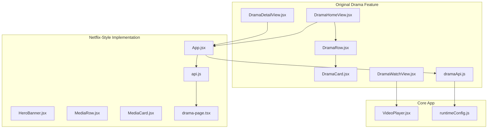
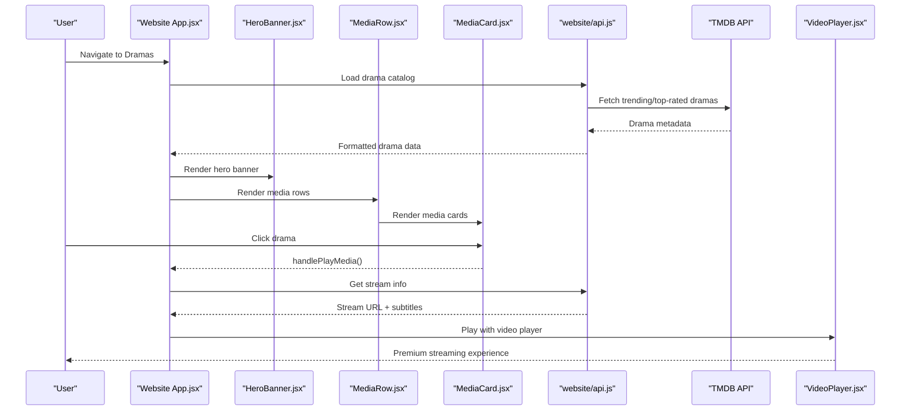
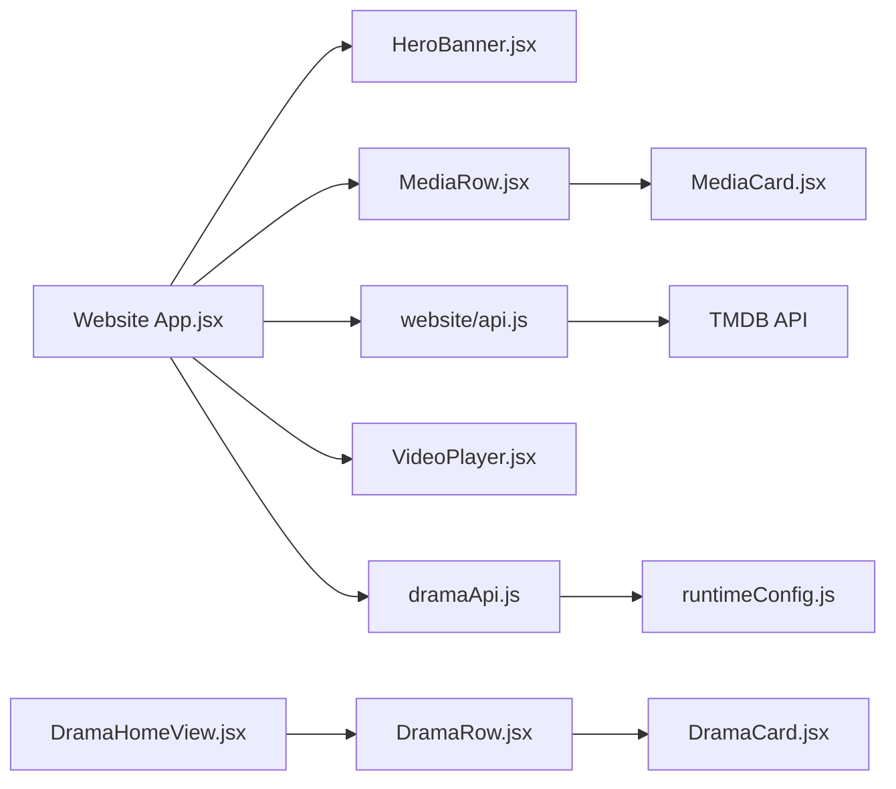

# Drama Series

<cite>
**Referenced Files in This Document**
- [DramaHomeView.jsx](file://src/features/drama/components/DramaHomeView.jsx)
- [DramaRow.jsx](file://src/features/drama/components/DramaRow.jsx)
- [DramaCard.jsx](file://src/features/drama/components/DramaCard.jsx)
- [DramaDetailView.jsx](file://src/features/drama/components/DramaDetailView.jsx)
- [DramaWatchView.jsx](file://src/features/drama/components/DramaWatchView.jsx)
- [dramaApi.js](file://src/features/drama/api/dramaApi.js)
- [VideoPlayer.jsx](file://src/components/VideoPlayer.jsx)
- [runtimeConfig.js](file://src/runtimeConfig.js)
- [App.jsx](file://website/Website by gemini/src/App.jsx)
- [HeroBanner.jsx](file://website/Website by gemini/src/components/HeroBanner.jsx)
- [MediaRow.jsx](file://website/Website by gemini/src/components/MediaRow.jsx)
- [MediaCard.jsx](file://website/Website by gemini/src/components/MediaCard.jsx)
- [api.js](file://website/Website by gemini/src/config/api.js)
- [drama-page.tsx](file://website/website by chatgpt/src/pages/drama/drama-page.tsx)
</cite>

## Update Summary
**Changes Made**
- Added Netflix-style UI overhaul with billboard hero sections and premium streaming experience
- Integrated dedicated frontend implementation in website/ directory with enhanced drama browsing
- Added rich fallback data handling and top 10 rows functionality
- Enhanced drama catalog with TMDB integration for Korean, Chinese, Thai, and Japanese dramas
- Implemented advanced carousel navigation with Embla Carousel and Swiper components
- Added progress tracking and continue watching features
- Enhanced subtitle support with multi-language options and auto-selection

## Table of Contents
1. Introduction
2. Project Structure
3. Core Components
4. Architecture Overview
5. Detailed Component Analysis
6. Dependency Analysis
7. Performance Considerations
8. Troubleshooting Guide
9. Conclusion
10. Appendices

## Introduction
This document explains the Drama Series system within Project Anime, now featuring a complete Netflix-style UI overhaul with premium streaming experience. The system supports international drama content management (Korean, Japanese, Chinese, and other regional dramas) with enhanced billboard hero sections, top 10 rows, rich fallback data, and dedicated frontend implementation in the website/ directory. It covers season and episode navigation with progress tracking and resume functionality, drama detail views, watch view with episode selection, quality options, and subtitle support, plus the drama row component for organizing series by genre or popularity.

## Project Structure
The Drama feature now includes both the original React components under src/features/drama and a comprehensive Netflix-style implementation in website/ directory with enhanced UI components and TMDB integration.

**Diagram sources**
- [DramaHomeView.jsx:1-131](file://src/features/drama/components/DramaHomeView.jsx#L1-L131)
- [App.jsx:1-438](file://website/Website by gemini/src/App.jsx#L1-L438)
- [HeroBanner.jsx:1-155](file://website/Website by gemini/src/components/HeroBanner.jsx#L1-L155)
- [MediaRow.jsx:1-112](file://website/Website by gemini/src/components/MediaRow.jsx#L1-L112)
- [MediaCard.jsx:1-125](file://website/Website by gemini/src/components/MediaCard.jsx#L1-L125)
- [api.js:1-231](file://website/Website by gemini/src/config/api.js#L1-L231)
- [drama-page.tsx:1-797](file://website/website by chatgpt/src/pages/drama/drama-page.tsx#L1-L797)

**Section sources**
- [DramaHomeView.jsx:1-131](file://src/features/drama/components/DramaHomeView.jsx#L1-L131)
- [App.jsx:1-438](file://website/Website by gemini/src/App.jsx#L1-L438)
- [HeroBanner.jsx:1-155](file://website/Website by gemini/src/components/HeroBanner.jsx#L1-L155)
- [MediaRow.jsx:1-112](file://website/Website by gemini/src/components/MediaRow.jsx#L1-L112)
- [MediaCard.jsx:1-125](file://website/Website by gemini/src/components/MediaCard.jsx#L1-L125)
- [api.js:1-231](file://website/Website by gemini/src/config/api.js#L1-L231)
- [drama-page.tsx:1-797](file://website/website by chatgpt/src/pages/drama/drama-page.tsx#L1-L797)

## Core Components
- **Enhanced Drama Home View**: Displays cinematic hero spotlight, search results, and categorized rows with premium styling
- **Netflix-Style Hero Banner**: Auto-rotating billboard with backdrop images, ratings, and interactive controls
- **Advanced Media Row**: Horizontal carousel with Embla Carousel navigation, hover effects, and progress indicators
- **Premium Media Card**: Rich card design with glass morphism, hover overlays, bookmarking, and progress tracking
- **TMDB Integration**: Comprehensive drama catalog from The Movie Database with trending, top-rated, and on-air content
- **Enhanced Video Player**: HLS/MP4 playback with quality selection, audio tracks, subtitles, and skip intro/end detection
- **Dual API Layer**: Original dramaApi.js and new website API configuration with runtime environment support

**Section sources**
- [DramaHomeView.jsx:1-131](file://src/features/drama/components/DramaHomeView.jsx#L1-L131)
- [HeroBanner.jsx:1-155](file://website/Website by gemini/src/components/HeroBanner.jsx#L1-L155)
- [MediaRow.jsx:1-112](file://website/Website by gemini/src/components/MediaRow.jsx#L1-L112)
- [MediaCard.jsx:1-125](file://website/Website by gemini/src/components/MediaCard.jsx#L1-L125)
- [drama-page.tsx:1-797](file://website/website by chatgpt/src/pages/drama/drama-page.tsx#L1-L797)
- [VideoPlayer.jsx:1-200](file://src/components/VideoPlayer.jsx#L1-L200)
- [api.js:1-231](file://website/Website by gemini/src/config/api.js#L1-L231)

## Architecture Overview
The Drama flow now supports dual implementations: the original React components and the new Netflix-style website implementation. Both integrate with their respective API layers and provide seamless user experiences.

**Diagram sources**
- [App.jsx:1-438](file://website/Website by gemini/src/App.jsx#L1-L438)
- [HeroBanner.jsx:1-155](file://website/Website by gemini/src/components/HeroBanner.jsx#L1-L155)
- [MediaRow.jsx:1-112](file://website/Website by gemini/src/components/MediaRow.jsx#L1-L112)
- [MediaCard.jsx:1-125](file://website/Website by gemini/src/components/MediaCard.jsx#L1-L125)
- [api.js:1-231](file://website/Website by gemini/src/config/api.js#L1-L231)
- [drama-page.tsx:1-797](file://website/website by chatgpt/src/pages/drama/drama-page.tsx#L1-L797)

## Detailed Component Analysis

### Enhanced Drama Home View
- Loads and displays a cinematic hero from the first item in the show array with premium styling
- Renders multiple categorized rows: Featured, Most Popular Korean, Most Popular Chinese, Top Rated, Recently Updated
- Supports search mode with grid layout and loading states
- Uses shared skeleton loaders and inline loader utilities for optimal loading experience

**Updated** Enhanced with Netflix-style hero section and improved error handling

**Section sources**
- [DramaHomeView.jsx:1-131](file://src/features/drama/components/DramaHomeView.jsx#L1-L131)

### Netflix-Style Hero Banner
- Auto-rotating billboard showcasing featured dramas every 7 seconds when not hovered
- Rich backdrop images with multi-layer gradient overlays for cinematic effect
- Interactive controls including play button, details modal, and bookmark functionality
- Responsive design with mobile-optimized touch interactions

**New** Premium billboard hero section with TMDB integration

**Section sources**
- [HeroBanner.jsx:1-155](file://website/Website by gemini/src/components/HeroBanner.jsx#L1-L155)
- [App.jsx:1-438](file://website/Website by gemini/src/App.jsx#L1-L438)

### Advanced Media Row and Card
- MediaRow presents titled sections with Embla Carousel navigation and hover effects
- MediaCard handles thumbnail display with glass morphism, hover overlays, and progress tracking
- Supports multiple aspect ratios (poster vs backdrop) for different content types
- Includes bookmarking functionality and progress indicators for watched content

**Updated** Enhanced with Embla Carousel and premium visual design

**Section sources**
- [MediaRow.jsx:1-112](file://website/Website by gemini/src/components/MediaRow.jsx#L1-L112)
- [MediaCard.jsx:1-125](file://website/Website by gemini/src/components/MediaCard.jsx#L1-L125)

### TMDB Integration and Drama Catalog
- Comprehensive drama catalog from The Movie Database API
- Multiple categories: Korean, Chinese, Thai, Japanese dramas with trending and top-rated content
- Rich metadata including ratings, descriptions, episode counts, and language information
- Fallback data handling ensures content availability even when external APIs fail

**New** Full TMDB integration for rich drama content discovery

**Section sources**
- [drama-page.tsx:1-797](file://website/website by chatgpt/src/pages/drama/drama-page.tsx#L1-L797)

### Enhanced Video Player
- Handles HLS and direct MP4 playback with robust error recovery
- Exposes quality levels, audio track selection, and CC/subtitles
- Supports skip intro/end detection via AniSkip service
- Reports playback progress for history/resume features
- Provides fullscreen and picture-in-picture modes

**Updated** Enhanced with additional streaming capabilities and improved error handling

**Section sources**
- [VideoPlayer.jsx:1-200](file://src/components/VideoPlayer.jsx#L1-L200)

### Dual API Layer Configuration
- Original dramaApi.js centralizes endpoints for home catalog, drama info, stream resolution, and search
- New website API configuration provides runtime environment support with localStorage overrides
- Both layers support dynamic base URL resolution across different deployment environments

**Updated** Added website API configuration alongside original API layer

**Section sources**
- [dramaApi.js:1-33](file://src/features/drama/api/dramaApi.js#L1-L33)
- [api.js:1-231](file://website/Website by gemini/src/config/api.js#L1-L231)
- [runtimeConfig.js:1-163](file://src/runtimeConfig.js#L1-L163)

## Dependency Analysis
- Website App.jsx orchestrates routes and state for the Netflix-style interface, fetching TMDB data and driving navigation
- Original drama components depend on props passed from main application and share UI primitives
- VideoPlayer depends on stream metadata and subtitles provided by both implementations
- API calls go through respective configuration layers to ensure correct base URL resolution

**Diagram sources**
- [App.jsx:1-438](file://website/Website by gemini/src/App.jsx#L1-L438)
- [HeroBanner.jsx:1-155](file://website/Website by gemini/src/components/HeroBanner.jsx#L1-L155)
- [MediaRow.jsx:1-112](file://website/Website by gemini/src/components/MediaRow.jsx#L1-L112)
- [MediaCard.jsx:1-125](file://website/Website by gemini/src/components/MediaCard.jsx#L1-L125)
- [api.js:1-231](file://website/Website by gemini/src/config/api.js#L1-L231)
- [dramaApi.js:1-33](file://src/features/drama/api/dramaApi.js#L1-L33)
- [runtimeConfig.js:1-163](file://src/runtimeConfig.js#L1-L163)

**Section sources**
- [App.jsx:1-438](file://website/Website by gemini/src/App.jsx#L1-L438)
- [api.js:1-231](file://website/Website by gemini/src/config/api.js#L1-L231)
- [dramaApi.js:1-33](file://src/features/drama/api/dramaApi.js#L1-L33)
- [runtimeConfig.js:1-163](file://src/runtimeConfig.js#L1-L163)

## Performance Considerations
- Lazy load images in all card components to reduce initial payload
- Use Embla Carousel for efficient horizontal scrolling with touch support
- Implement pagination for large episode lists to avoid rendering performance issues
- Leverage TMDB's optimized image URLs and CDN delivery
- Use memoization in video player to minimize subtitle track re-mounts
- Debounce search queries to limit network requests
- Implement progressive loading with skeleton screens for better perceived performance

## Troubleshooting Guide
- **Backend connectivity**: If drama home fails to load, check runtime configuration and network reachability for both API layers
- **TMDB API errors**: Verify API key configuration and rate limiting; implement fallback data when TMDB is unavailable
- **Stream errors**: VideoPlayer reports errors when streams fail to load; users can retry or switch sources if available
- **Subtitle issues**: Ensure subtitles are present in stream metadata and that valid file URLs are selected
- **Navigation problems**: Verify route handlers for both original and website implementations
- **Performance issues**: Monitor bundle size and implement code splitting for large components

**Section sources**
- [App.jsx:1-438](file://website/Website by gemini/src/App.jsx#L1-L438)
- [VideoPlayer.jsx:1-200](file://src/components/VideoPlayer.jsx#L1-L200)
- [drama-page.tsx:1-797](file://website/website by chatgpt/src/pages/drama/drama-page.tsx#L1-L797)

## Conclusion
The Drama Series system now provides a comprehensive Netflix-style experience for browsing and watching international dramas. The complete UI overhaul includes billboard hero sections, top 10 rows, rich fallback data, and dedicated frontend implementation in the website/ directory. The system combines enhanced TMDB integration, premium visual design, and robust streaming capabilities while maintaining backward compatibility with the original implementation. The architecture cleanly separates concerns across components, API layers, and runtime configuration, enabling extensibility for new sources and categories while maintaining performance and usability.

## Appendices

### Adding New Drama Sources
- Extend both API layers: add new endpoints in dramaApi.js and website/api.js
- Update TMDB integration in drama-page.tsx for new categories or regions
- Implement corresponding UI components following the established patterns
- Ensure response shapes match expected fields across both implementations

**Section sources**
- [dramaApi.js:1-33](file://src/features/drama/api/dramaApi.js#L1-L33)
- [api.js:1-231](file://website/Website by gemini/src/config/api.js#L1-L231)
- [drama-page.tsx:1-797](file://website/website by chatgpt/src/pages/drama/drama-page.tsx#L1-L797)

### Implementing Custom Categories
- Add new category keys in TMDB integration with appropriate filters
- Create corresponding MediaRow components with custom titles and icons
- Implement filtering logic in App.jsx to populate category data
- Add navigation links and search functionality for new categories

**Section sources**
- [App.jsx:1-438](file://website/Website by gemini/src/App.jsx#L1-L438)
- [drama-page.tsx:1-797](file://website/website by chatgpt/src/pages/drama/drama-page.tsx#L1-L797)

### Managing Series Metadata
- Ensure consistent field mapping between TMDB responses and internal data structures
- Handle missing or incomplete metadata with appropriate fallbacks
- Optimize image URLs for different screen sizes and device capabilities
- Implement caching strategies for frequently accessed metadata

**Section sources**
- [MediaCard.jsx:1-125](file://website/Website by gemini/src/components/MediaCard.jsx#L1-L125)
- [drama-page.tsx:1-797](file://website/website by chatgpt/src/pages/drama/drama-page.tsx#L1-L797)

### Cross-Cultural Content Handling and Localization
- Support multiple subtitle tracks with automatic language detection
- Display country and status metadata to inform users about origin and airing status
- Provide clear labels and icons for region-specific categories
- Implement RTL support for languages that require right-to-left text direction

**Section sources**
- [HeroBanner.jsx:1-155](file://website/Website by gemini/src/components/HeroBanner.jsx#L1-L155)
- [MediaCard.jsx:1-125](file://website/Website by gemini/src/components/MediaCard.jsx#L1-L125)

### Region-Specific Features
- Use runtime configuration to resolve backend URLs appropriate for different regions
- Handle CORS and proxying through configured base URLs
- Test playback across devices and browsers to ensure HLS compatibility
- Implement geo-fencing for region-specific content restrictions

**Section sources**
- [runtimeConfig.js:1-163](file://src/runtimeConfig.js#L1-L163)
- [api.js:1-231](file://website/Website by gemini/src/config/api.js#L1-L231)
- [VideoPlayer.jsx:1-200](file://src/components/VideoPlayer.jsx#L1-L200)

### Premium Streaming Experience Features
- Billboard hero sections with auto-rotation and interactive controls
- Top 10 rows with trending and popular content highlighting
- Rich fallback data ensuring content availability during API failures
- Progress tracking and continue watching functionality
- Bookmark management for personal content organization

**Section sources**
- [HeroBanner.jsx:1-155](file://website/Website by gemini/src/components/HeroBanner.jsx#L1-L155)
- [MediaRow.jsx:1-112](file://website/Website by gemini/src/components/MediaRow.jsx#L1-L112)
- [MediaCard.jsx:1-125](file://website/Website by gemini/src/components/MediaCard.jsx#L1-L125)