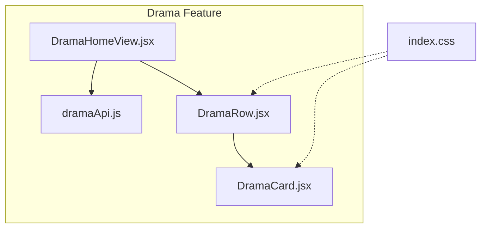
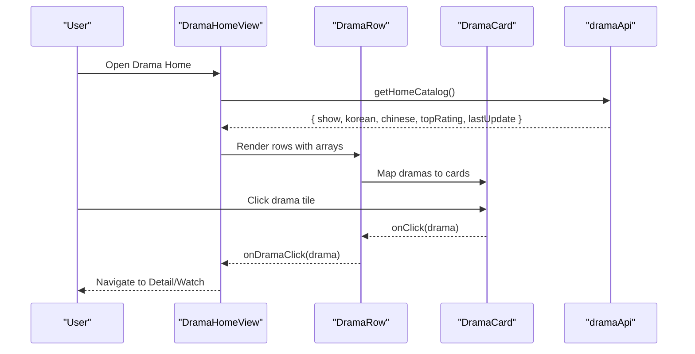
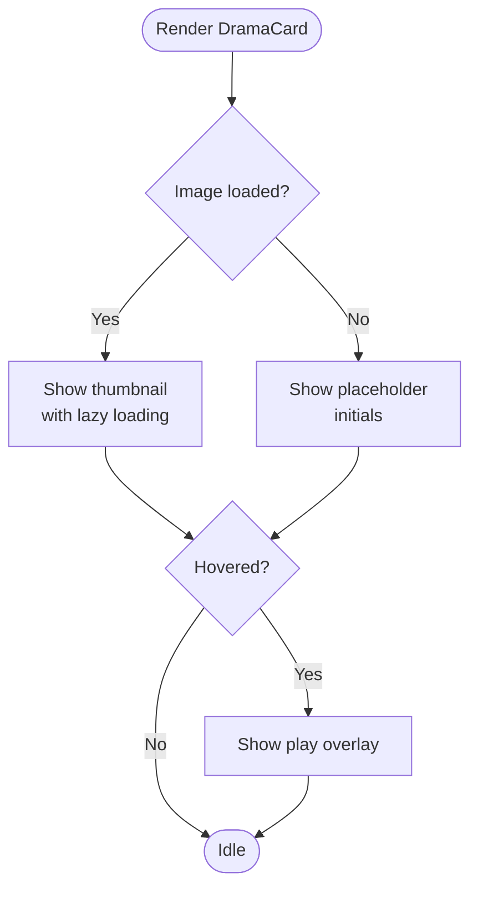
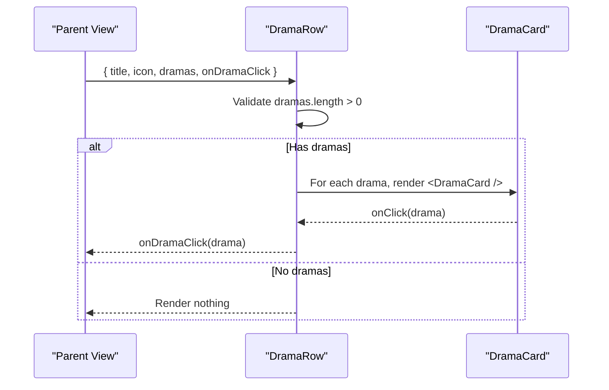
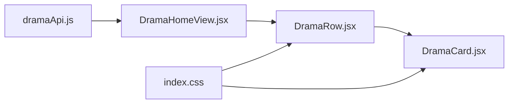

# Drama UI Components

<cite>
**Referenced Files in This Document**
- [DramaCard.jsx](file://src/features/drama/components/DramaCard.jsx)
- [DramaRow.jsx](file://src/features/drama/components/DramaRow.jsx)
- [DramaHomeView.jsx](file://src/features/drama/components/DramaHomeView.jsx)
- [dramaApi.js](file://src/features/drama/api/dramaApi.js)
- [index.css](file://src/index.css)
</cite>

## Table of Contents
1. [Introduction](#introduction)
2. [Project Structure](#project-structure)
3. [Core Components](#core-components)
4. [Architecture Overview](#architecture-overview)
5. [Detailed Component Analysis](#detailed-component-analysis)
6. [Dependency Analysis](#dependency-analysis)
7. [Performance Considerations](#performance-considerations)
8. [Troubleshooting Guide](#troubleshooting-guide)
9. [Conclusion](#conclusion)
10. [Appendices](#appendices)

## Introduction
This document provides detailed, reusable documentation for drama-specific UI components: DramaCard and DramaRow. It explains how to display individual drama items with poster images, titles, ratings/episode counts, and hover effects, and how to organize multiple cards into horizontal scrolling rows. It also covers props interfaces, styling customization options, event handling patterns, and practical guidance for extending these components, implementing lazy loading for images, and optimizing performance for large lists.

## Project Structure
The drama feature is organized under src/features/drama with a clear separation between presentation (components) and data access (api). The home view composes rows and cards, while the API module encapsulates network calls. Global styles for tiles and rows live in the main stylesheet.

**Diagram sources**
- [DramaHomeView.jsx:1-131](file://src/features/drama/components/DramaHomeView.jsx#L1-L131)
- [DramaRow.jsx:1-23](file://src/features/drama/components/DramaRow.jsx#L1-L23)
- [DramaCard.jsx:1-41](file://src/features/drama/components/DramaCard.jsx#L1-L41)
- [dramaApi.js:1-33](file://src/features/drama/api/dramaApi.js#L1-L33)
- [index.css:1995-2189](file://src/index.css#L1995-L2189)

**Section sources**
- [DramaHomeView.jsx:1-131](file://src/features/drama/components/DramaHomeView.jsx#L1-L131)
- [DramaRow.jsx:1-23](file://src/features/drama/components/DramaRow.jsx#L1-L23)
- [DramaCard.jsx:1-41](file://src/features/drama/components/DramaCard.jsx#L1-L41)
- [dramaApi.js:1-33](file://src/features/drama/api/dramaApi.js#L1-L33)
- [index.css:1665-1702](file://src/index.css#L1665-L1702)
- [index.css:1973-1994](file://src/index.css#L1973-L1994)
- [index.css:1995-2189](file://src/index.css#L1995-L2189)

## Core Components
- DramaCard: Displays a single drama item with a thumbnail image, title, country/status metadata, optional episode count badge, and hover overlay with a play icon. It handles image load errors by showing a placeholder.
- DramaRow: Renders a titled section header and a horizontal row of DramaCard instances. It gates rendering when there are no dramas and forwards click events to a parent handler.

Key responsibilities:
- DramaCard: Presentation of one drama tile with accessible alt text, lazy loading, error fallback, and hover affordance.
- DramaRow: Section composition, list mapping, and event delegation to the parent via onDramaClick.

Props interface summary:
- DramaCard
  - drama: object containing at least id, title, thumbnail; optionally episodesCount, country, status.
  - onClick: function invoked when the card is clicked; receives the drama object.
- DramaRow
  - title: string for the section heading.
  - icon: optional React node used as an accent before the title.
  - dramas: array of drama objects to render.
  - onDramaClick: callback invoked with the selected drama object.

Styling hooks:
- DramaCard uses classes netflix-tile, drama-tile, tile-art, tile-info, tile-rating-badge, tile-hover-overlay, tile-hover-play.
- DramaRow uses hv-section, hv-section-header, hv-section-title, hv-section-line, netflix-row, netflix-slider.

Event handling:
- Clicking a card triggers onClick(drama), enabling navigation or detail opening.
- Row delegates clicks to its parent through onDramaClick.

**Section sources**
- [DramaCard.jsx:1-41](file://src/features/drama/components/DramaCard.jsx#L1-L41)
- [DramaRow.jsx:1-23](file://src/features/drama/components/DramaRow.jsx#L1-L23)
- [index.css:1995-2189](file://src/index.css#L1995-L2189)
- [index.css:1665-1702](file://src/index.css#L1665-L1702)
- [index.css:1973-1994](file://src/index.css#L1973-L1994)

## Architecture Overview
The drama home page composes multiple rows, each backed by curated lists from the backend. Cards within rows respond to user interactions by invoking callbacks that typically navigate to a detail or watch view.

**Diagram sources**
- [DramaHomeView.jsx:1-131](file://src/features/drama/components/DramaHomeView.jsx#L1-L131)
- [DramaRow.jsx:1-23](file://src/features/drama/components/DramaRow.jsx#L1-L23)
- [DramaCard.jsx:1-41](file://src/features/drama/components/DramaCard.jsx#L1-L41)
- [dramaApi.js:1-33](file://src/features/drama/api/dramaApi.js#L1-L33)

## Detailed Component Analysis

### DramaCard
Purpose:
- Display a drama tile with thumbnail, title, country/status, optional episode count badge, and hover play overlay.
- Provide graceful fallback when images fail to load.

Props:
- drama: object
  - Required: id, title, thumbnail
  - Optional: episodesCount, country, status
- onClick: (drama) => void

Behavior:
- Uses native lazy loading for images to improve initial load performance.
- Tracks image load errors and shows a simple placeholder with the first letter of the title.
- Renders a language/region mark and a hover overlay with a play icon for affordance.
- Shows an episode count badge when available.

Accessibility:
- Button element for keyboard accessibility.
- Alt text set to the drama title for screen readers.

Styling:
- Relies on global classes for layout, hover scaling, gradient overlays, and badges.

Extensibility:
- Add custom overlays (e.g., “New”, “Trending”) by inserting additional spans inside tile-art.
- Replace the default play icon with a custom component via props if needed.

**Diagram sources**
- [DramaCard.jsx:1-41](file://src/features/drama/components/DramaCard.jsx#L1-L41)
- [index.css:1995-2189](file://src/index.css#L1995-L2189)

**Section sources**
- [DramaCard.jsx:1-41](file://src/features/drama/components/DramaCard.jsx#L1-L41)
- [index.css:1995-2189](file://src/index.css#L1995-L2189)

### DramaRow
Purpose:
- Present a titled section with a horizontal list of DramaCard components.
- Handle empty states by returning null when no dramas are provided.

Props:
- title: string
- icon: optional React node
- dramas: array of drama objects
- onDramaClick: (drama) => void

Behavior:
- Renders a section header with optional icon and underline.
- Maps dramas to DramaCard and forwards click events upward.

Styling:
- Uses section header classes and a slider container class for consistent layout across rows.

Responsive behavior:
- Rows rely on global CSS for horizontal scrolling and snap behavior; responsive adjustments are applied at breakpoints.

**Diagram sources**
- [DramaRow.jsx:1-23](file://src/features/drama/components/DramaRow.jsx#L1-L23)
- [DramaCard.jsx:1-41](file://src/features/drama/components/DramaCard.jsx#L1-L41)

**Section sources**
- [DramaRow.jsx:1-23](file://src/features/drama/components/DramaRow.jsx#L1-L23)
- [index.css:1665-1702](file://src/index.css#L1665-L1702)
- [index.css:1973-1994](file://src/index.css#L1973-L1994)

### DramaHomeView (Composition Context)
Purpose:
- Compose multiple DramaRow sections with curated lists (featured, popular Korean, popular Chinese, top rated, recently updated).
- Provide search results grid using DramaCard when a query is active.
- Manage loading and error states for the drama catalog.

Integration points:
- Calls dramaApi.getHomeCatalog to fetch data.
- Passes onDramaClick to both rows and search results to handle navigation.

**Section sources**
- [DramaHomeView.jsx:1-131](file://src/features/drama/components/DramaHomeView.jsx#L1-L131)
- [dramaApi.js:1-33](file://src/features/drama/api/dramaApi.js#L1-L33)

## Dependency Analysis
- DramaRow depends on DramaCard for rendering each tile.
- DramaHomeView composes DramaRow and DramaCard and consumes dramaApi for data fetching.
- All three components rely on global CSS classes for consistent visual design and interaction feedback.

**Diagram sources**
- [dramaApi.js:1-33](file://src/features/drama/api/dramaApi.js#L1-L33)
- [DramaHomeView.jsx:1-131](file://src/features/drama/components/DramaHomeView.jsx#L1-L131)
- [DramaRow.jsx:1-23](file://src/features/drama/components/DramaRow.jsx#L1-L23)
- [DramaCard.jsx:1-41](file://src/features/drama/components/DramaCard.jsx#L1-L41)
- [index.css:1665-1702](file://src/index.css#L1665-L1702)
- [index.css:1973-1994](file://src/index.css#L1973-L1994)
- [index.css:1995-2189](file://src/index.css#L1995-L2189)

**Section sources**
- [dramaApi.js:1-33](file://src/features/drama/api/dramaApi.js#L1-L33)
- [DramaHomeView.jsx:1-131](file://src/features/drama/components/DramaHomeView.jsx#L1-L131)
- [DramaRow.jsx:1-23](file://src/features/drama/components/DramaRow.jsx#L1-L23)
- [DramaCard.jsx:1-41](file://src/features/drama/components/DramaCard.jsx#L1-L41)
- [index.css:1665-1702](file://src/index.css#L1665-L1702)
- [index.css:1973-1994](file://src/index.css#L1973-L1994)
- [index.css:1995-2189](file://src/index.css#L1995-L2189)

## Performance Considerations
- Lazy loading: DramaCard uses native lazy loading for images to reduce initial payload and improve perceived performance.
- Error fallback: Image errors are handled gracefully with a lightweight placeholder to avoid layout shifts and broken visuals.
- Rendering efficiency: DramaRow renders only when dramas exist, avoiding unnecessary DOM nodes.
- Large lists:
  - Consider virtualization or windowing for very long rows to limit rendered nodes.
  - Use memoization around cards if you add expensive computations per card.
  - Batch image requests where possible and ensure thumbnails are appropriately sized.
- Styling performance: Hover transforms and gradients are GPU-accelerated; keep animations minimal and prefer transform/opacity changes.

[No sources needed since this section provides general guidance]

## Troubleshooting Guide
Common issues and resolutions:
- Images not loading:
  - Verify drama.thumbnail URLs are valid and accessible.
  - Confirm onError handler sets the error state to show the placeholder.
- Empty rows:
  - Ensure dramas array is non-empty before rendering; DramaRow returns null when empty.
- Navigation not triggered:
  - Confirm onDramaClick is passed down from DramaHomeView to DramaRow and invoked with the correct drama object.
- Styling anomalies:
  - Check that global classes (netflix-tile, tile-art, etc.) are present and not overridden by local styles.
  - Review responsive breakpoints in the global stylesheet for unexpected layout changes.

**Section sources**
- [DramaCard.jsx:1-41](file://src/features/drama/components/DramaCard.jsx#L1-L41)
- [DramaRow.jsx:1-23](file://src/features/drama/components/DramaRow.jsx#L1-L23)
- [index.css:1995-2189](file://src/index.css#L1995-L2189)

## Conclusion
DramaCard and DramaRow provide a robust, reusable foundation for displaying drama content in a Netflix-style interface. They offer clear props contracts, accessible interactions, and resilient image handling. Combined with global styles, they support responsive layouts and smooth hover effects. For large catalogs, consider virtualization and batching strategies to maintain performance.

[No sources needed since this section summarizes without analyzing specific files]

## Appendices

### Props Interface Reference
- DramaCard
  - drama: object
    - id: string | number
    - title: string
    - thumbnail: string
    - episodesCount?: number
    - country?: string
    - status?: string
  - onClick: (drama) => void
- DramaRow
  - title: string
  - icon?: ReactNode
  - dramas: Array<object>
  - onDramaClick: (drama) => void

**Section sources**
- [DramaCard.jsx:1-41](file://src/features/drama/components/DramaCard.jsx#L1-L41)
- [DramaRow.jsx:1-23](file://src/features/drama/components/DramaRow.jsx#L1-L23)

### Styling Customization Options
- Tile appearance: Modify .netflix-tile and .tile-art for sizing, aspect ratio, shadows, and hover transforms.
- Hover overlay: Adjust .tile-hover-overlay and .tile-hover-play for background, opacity, and transition timing.
- Badges: Style .tile-rating-badge for episode count or rating indicators.
- Section headers: Customize .hv-section-title and .hv-section-line for typography and spacing.
- Responsive behavior: Review media queries affecting .netflix-rows and .netflix-row for mobile/tablet layouts.

**Section sources**
- [index.css:1665-1702](file://src/index.css#L1665-L1702)
- [index.css:1973-1994](file://src/index.css#L1973-L1994)
- [index.css:1995-2189](file://src/index.css#L1995-L2189)

### Event Handling Patterns
- Card click: onClick(drama) enables navigation to detail or watch views.
- Row delegation: onDramaClick(drama) centralizes routing logic in the parent view.
- Search integration: DramaHomeView maps search results to cards and invokes the same click pattern.

**Section sources**
- [DramaHomeView.jsx:1-131](file://src/features/drama/components/DramaHomeView.jsx#L1-L131)
- [DramaRow.jsx:1-23](file://src/features/drama/components/DramaRow.jsx#L1-L23)
- [DramaCard.jsx:1-41](file://src/features/drama/components/DramaCard.jsx#L1-L41)

### Extending Components
- Add badges or tags: Insert additional spans within tile-art to highlight new or trending items.
- Replace icons: Swap the play icon with a custom component via props or inline replacement.
- Implement advanced lazy loading: Use IntersectionObserver to defer image loads until near viewport entry for very large lists.
- Optimize large lists: Integrate virtualized lists (e.g., react-window) to render only visible cards.

[No sources needed since this section provides general guidance]