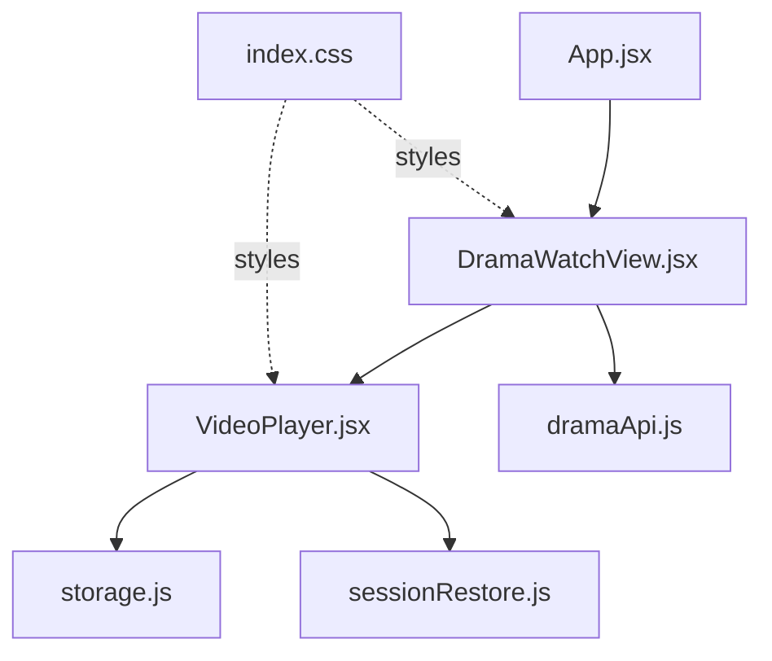
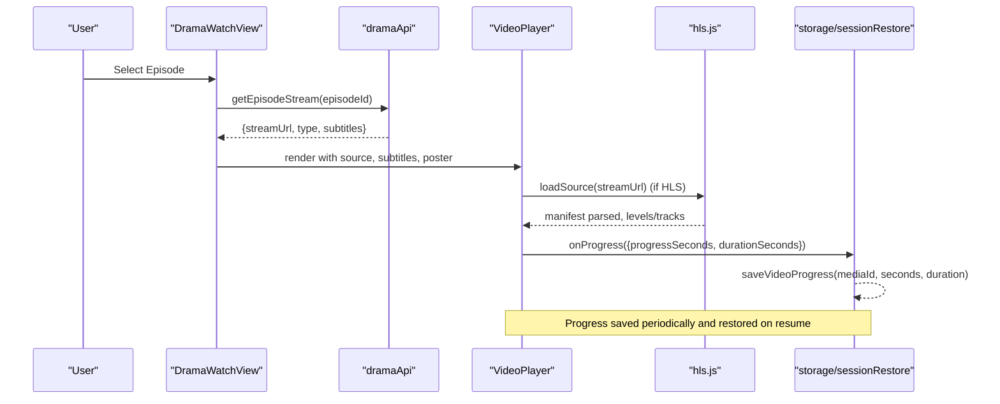
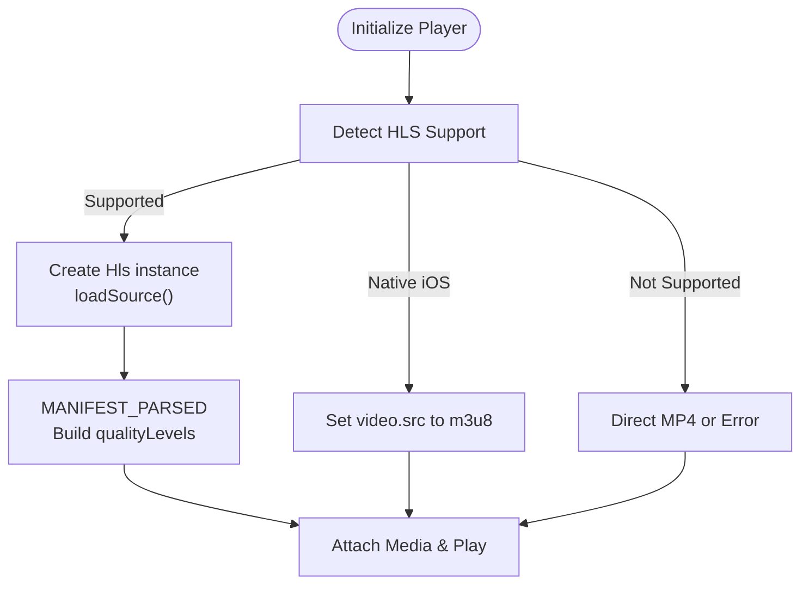
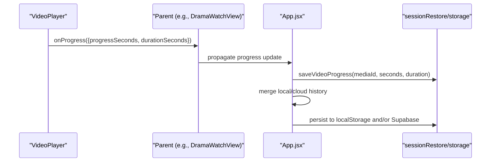
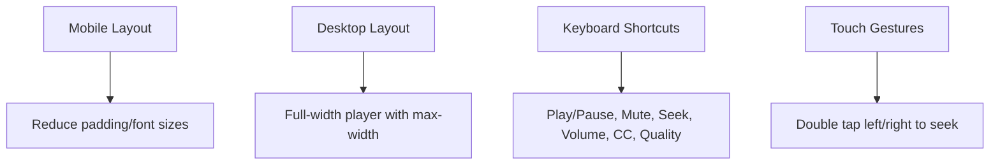
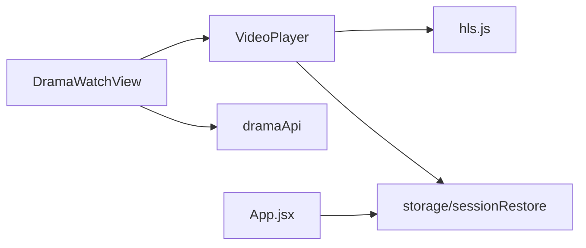

# Drama Watch View

<cite>
**Referenced Files in This Document**
- [DramaWatchView.jsx](file://src/features/drama/components/DramaWatchView.jsx)
- [VideoPlayer.jsx](file://src/components/VideoPlayer.jsx)
- [dramaApi.js](file://src/features/drama/api/dramaApi.js)
- [storage.js](file://src/utils/storage.js)
- [sessionRestore.js](file://src/utils/sessionRestore.js)
- [index.css](file://src/index.css)
- [App.jsx](file://src/App.jsx)
</cite>

## Table of Contents
1. [Introduction](#introduction)
2. [Project Structure](#project-structure)
3. [Core Components](#core-components)
4. [Architecture Overview](#architecture-overview)
5. [Detailed Component Analysis](#detailed-component-analysis)
6. [Dependency Analysis](#dependency-analysis)
7. [Performance Considerations](#performance-considerations)
8. [Troubleshooting Guide](#troubleshooting-guide)
9. [Conclusion](#conclusion)
10. [Appendices](#appendices)

## Introduction
This document explains the Drama Watch View component that powers the drama episode streaming interface. It covers HLS video player integration, episode navigation controls, quality selection, subtitle track switching, progress tracking and watch history synchronization, responsive design, keyboard shortcuts, accessibility features, and guidance for customizing player controls, adding chapter markers, and integrating external media players.

## Project Structure
The Drama Watch View is composed of:
- A view component that orchestrates stream loading, subtitle selection, and episode list rendering
- A reusable VideoPlayer component that handles playback, HLS, quality/audio tracks, subtitles, progress reporting, and UI controls
- An API module to fetch drama info and episode streams
- Utilities for persistent storage and session restoration
- CSS styles for layout and responsiveness

**Diagram sources**
- [DramaWatchView.jsx:1-103](file://src/features/drama/components/DramaWatchView.jsx#L1-L103)
- [VideoPlayer.jsx:1-120](file://src/components/VideoPlayer.jsx#L1-L120)
- [dramaApi.js:1-33](file://src/features/drama/api/dramaApi.js#L1-L33)
- [storage.js:1-71](file://src/utils/storage.js#L1-L71)
- [sessionRestore.js:1-158](file://src/utils/sessionRestore.js#L1-L158)
- [index.css:5072-5166](file://src/index.css#L5072-L5166)
- [App.jsx:1328-1380](file://src/App.jsx#L1328-L1380)

**Section sources**
- [DramaWatchView.jsx:1-103](file://src/features/drama/components/DramaWatchView.jsx#L1-L103)
- [VideoPlayer.jsx:1-120](file://src/components/VideoPlayer.jsx#L1-L120)
- [dramaApi.js:1-33](file://src/features/drama/api/dramaApi.js#L1-L33)
- [storage.js:1-71](file://src/utils/storage.js#L1-L71)
- [sessionRestore.js:1-158](file://src/utils/sessionRestore.js#L1-L158)
- [index.css:5072-5166](file://src/index.css#L5072-L5166)
- [App.jsx:1328-1380](file://src/App.jsx#L1328-L1380)

## Core Components
- DramaWatchView: Loads episode stream data, manages active subtitle, renders player and episode grid, and delegates playback to VideoPlayer.
- VideoPlayer: Implements HLS playback via hls.js, quality and audio track selection, CC/subtitle management, timeline scrubbing with preview thumbnails, keyboard shortcuts, fullscreen/PiP, skip intro/end detection, and progress reporting.
- dramaApi: Provides endpoints to fetch drama catalog, drama info, and episode stream URLs.
- storage and sessionRestore: Persist user preferences, video progress, and app session state across sessions.

**Section sources**
- [DramaWatchView.jsx:1-103](file://src/features/drama/components/DramaWatchView.jsx#L1-L103)
- [VideoPlayer.jsx:1-120](file://src/components/VideoPlayer.jsx#L1-L120)
- [dramaApi.js:1-33](file://src/features/drama/api/dramaApi.js#L1-L33)
- [storage.js:1-71](file://src/utils/storage.js#L1-L71)
- [sessionRestore.js:1-158](file://src/utils/sessionRestore.js#L1-L158)

## Architecture Overview
The Drama Watch View composes a high-level view with a robust video player. The flow from selecting an episode to playing it involves fetching stream metadata, initializing HLS or native playback, managing subtitles and quality, and persisting progress.

**Diagram sources**
- [dramaApi.js:18-22](file://src/features/drama/api/dramaApi.js#L18-L22)
- [DramaWatchView.jsx:52-61](file://src/features/drama/components/DramaWatchView.jsx#L52-L61)
- [VideoPlayer.jsx:180-282](file://src/components/VideoPlayer.jsx#L180-L282)
- [VideoPlayer.jsx:321-332](file://src/components/VideoPlayer.jsx#L321-L332)
- [sessionRestore.js:63-95](file://src/utils/sessionRestore.js#L63-L95)

## Detailed Component Analysis

### DramaWatchView
Responsibilities:
- Subtitle selection: auto-selects default or first subtitle when stream loads; exposes Off and per-subtitle buttons
- Player integration: passes stream URL, HLS flag, error state, and poster to VideoPlayer
- Episode navigation: renders episode grid and triggers parent callback to switch episodes

Key behaviors:
- Active subtitle is tracked by file URL; only one subtitle track is mounted at a time to avoid conflicts
- Error/loading states are displayed within the player wrapper
- Episode list limits to a subset for performance and marks episodes with SUB badge

**Section sources**
- [DramaWatchView.jsx:1-103](file://src/features/drama/components/DramaWatchView.jsx#L1-L103)

### VideoPlayer
Responsibilities:
- HLS playback using hls.js with fallback to native HLS (iOS Safari) and direct MP4
- Quality selection: reads available levels from HLS manifest and allows manual selection
- Audio track selection: detects and switches audio tracks, optionally preferring a language
- Subtitles/CC: mounts textTracks from props and toggles visibility
- Timeline scrubbing with hover preview thumbnails
- Keyboard shortcuts and touch gestures
- Fullscreen and Picture-in-Picture
- Skip Intro/End detection via AniSkip API
- Progress reporting to parent via onProgress callback

Important implementation details:
- HLS initialization sets buffering/retry options and maps levels to quality labels
- Audio tracks updated event auto-selects preferred language if available
- Error handling attempts recovery for network/media errors before surfacing fatal errors
- Progress events throttle reporting to reduce overhead while ensuring accurate updates
- Iframe fallback supports embedded players with sandbox attributes

**Section sources**
- [VideoPlayer.jsx:1-120](file://src/components/VideoPlayer.jsx#L1-L120)
- [VideoPlayer.jsx:180-282](file://src/components/VideoPlayer.jsx#L180-L282)
- [VideoPlayer.jsx:284-292](file://src/components/VideoPlayer.jsx#L284-L292)
- [VideoPlayer.jsx:321-332](file://src/components/VideoPlayer.jsx#L321-L332)
- [VideoPlayer.jsx:506-521](file://src/components/VideoPlayer.jsx#L506-L521)
- [VideoPlayer.jsx:544-585](file://src/components/VideoPlayer.jsx#L544-L585)
- [VideoPlayer.jsx:671-693](file://src/components/VideoPlayer.jsx#L671-L693)

### HLS Integration and Quality Selection
- Detects HLS via flags or URL suffix and uses hls.js when supported
- Parses manifest to build quality levels sorted by resolution
- Allows setting currentLevel to switch quality; UI shows Auto vs specific level
- Handles HLS errors with retry logic and surfaces final error state

**Diagram sources**
- [VideoPlayer.jsx:180-282](file://src/components/VideoPlayer.jsx#L180-L282)

**Section sources**
- [VideoPlayer.jsx:180-282](file://src/components/VideoPlayer.jsx#L180-L282)

### Subtitle Track Switching
- DramaWatchView builds a single-element subtitle array based on activeSub
- VideoPlayer mounts <track> elements for each subtitle and toggles CC visibility
- Users can toggle Off or select a labeled subtitle; changes remount the track

**Section sources**
- [DramaWatchView.jsx:10-27](file://src/features/drama/components/DramaWatchView.jsx#L10-L27)
- [VideoPlayer.jsx:284-292](file://src/components/VideoPlayer.jsx#L284-L292)
- [VideoPlayer.jsx:734-744](file://src/components/VideoPlayer.jsx#L734-L744)

### Episode Navigation Controls
- Episode grid displays up to a capped number of episodes for performance
- Clicking an episode triggers onEpisodeSelect to change the active episode in the parent
- Active episode is visually highlighted

**Section sources**
- [DramaWatchView.jsx:82-99](file://src/features/drama/components/DramaWatchView.jsx#L82-L99)

### Progress Tracking and Watch History Synchronization
- VideoPlayer emits onProgress with progressSeconds and durationSeconds
- App.jsx merges local and cloud watch history, persists to localStorage and Supabase
- sessionRestore provides saveVideoProgress/getVideoProgress with expiration policies
- storage abstracts persistence across web and native environments

**Diagram sources**
- [VideoPlayer.jsx:321-332](file://src/components/VideoPlayer.jsx#L321-L332)
- [App.jsx:1328-1380](file://src/App.jsx#L1328-L1380)
- [sessionRestore.js:63-95](file://src/utils/sessionRestore.js#L63-L95)
- [storage.js:29-71](file://src/utils/storage.js#L29-L71)

**Section sources**
- [VideoPlayer.jsx:321-332](file://src/components/VideoPlayer.jsx#L321-L332)
- [App.jsx:1328-1380](file://src/App.jsx#L1328-L1380)
- [sessionRestore.js:63-95](file://src/utils/sessionRestore.js#L63-L95)
- [storage.js:29-71](file://src/utils/storage.js#L29-L71)

### Automatic Next Episode Functionality
- The current codebase does not implement automatic next episode play within DramaWatchView
- To add this feature, integrate a timer after video ends or near-end threshold and call onEpisodeSelect with the next episode ID from the episodes list

[No sources needed since this section proposes an extension not present in the referenced files]

### Responsive Design and Accessibility
- CSS defines a 16:9 player container with mobile-specific adjustments for padding, font sizes, and button layouts
- Keyboard shortcuts include play/pause, mute, fullscreen, seek, volume, CC toggle, and quality menu
- Touch double-tap gestures support quick seek on mobile
- Fullscreen entry includes orientation lock attempt on supported devices
- PiP is supported where available

**Diagram sources**
- [index.css:5072-5166](file://src/index.css#L5072-L5166)
- [VideoPlayer.jsx:544-585](file://src/components/VideoPlayer.jsx#L544-L585)
- [VideoPlayer.jsx:452-504](file://src/components/VideoPlayer.jsx#L452-L504)

**Section sources**
- [index.css:5072-5166](file://src/index.css#L5072-L5166)
- [VideoPlayer.jsx:544-585](file://src/components/VideoPlayer.jsx#L544-L585)
- [VideoPlayer.jsx:452-504](file://src/components/VideoPlayer.jsx#L452-L504)

### Custom Player Controls, Chapter Markers, and External Players
- Custom controls: Extend VideoPlayer’s UI layer and bind actions to existing methods like togglePlay, skipTime, handleQualityChange, handleAudioTrackChange
- Chapter markers: Integrate cue points into the timeline by listening to timeupdate and rendering markers at specified timestamps; optionally use WebVTT chapters or overlay cues
- External players: Use the iframe fallback path to embed external players; set source.iframeSrc and optional sandbox attributes

Implementation pointers:
- Add custom buttons around the player wrapper and invoke VideoPlayer methods via refs or callbacks
- For chapters, compute marker positions relative to duration and render them above the timeline
- For external players, pass appropriate source configuration to enable iframe mode

**Section sources**
- [VideoPlayer.jsx:671-693](file://src/components/VideoPlayer.jsx#L671-L693)

## Dependency Analysis
- DramaWatchView depends on VideoPlayer for playback and on dramaApi for stream data
- VideoPlayer depends on hls.js for HLS playback and integrates with storage/sessionRestore for progress
- App.jsx coordinates watch history merging and persistence

**Diagram sources**
- [DramaWatchView.jsx:1-103](file://src/features/drama/components/DramaWatchView.jsx#L1-L103)
- [VideoPlayer.jsx:1-120](file://src/components/VideoPlayer.jsx#L1-L120)
- [dramaApi.js:1-33](file://src/features/drama/api/dramaApi.js#L1-L33)
- [sessionRestore.js:1-158](file://src/utils/sessionRestore.js#L1-L158)
- [storage.js:1-71](file://src/utils/storage.js#L1-L71)
- [App.jsx:1328-1380](file://src/App.jsx#L1328-L1380)

**Section sources**
- [DramaWatchView.jsx:1-103](file://src/features/drama/components/DramaWatchView.jsx#L1-L103)
- [VideoPlayer.jsx:1-120](file://src/components/VideoPlayer.jsx#L1-L120)
- [dramaApi.js:1-33](file://src/features/drama/api/dramaApi.js#L1-L33)
- [sessionRestore.js:1-158](file://src/utils/sessionRestore.js#L1-L158)
- [storage.js:1-71](file://src/utils/storage.js#L1-L71)
- [App.jsx:1328-1380](file://src/App.jsx#L1328-L1380)

## Performance Considerations
- Limit episode list rendering to a subset to reduce DOM size
- Throttle progress reporting to minimize frequent state updates
- Use hls.js retry settings to balance resilience and resource usage
- Avoid mounting multiple subtitle tracks simultaneously to prevent conflicts
- Prefer native HLS on iOS to reduce overhead

[No sources needed since this section provides general guidance]

## Troubleshooting Guide
Common issues and resolutions:
- Stream fails to load: Check HLS support and network errors; VideoPlayer attempts recovery before surfacing fatal errors
- No subtitles visible: Ensure subtitles prop contains valid track URLs and CC is enabled
- Quality menu not updating: Verify HLS manifest parsing and currentLevel assignment
- Progress not saving: Confirm onProgress is called and mediaId is provided; check storage availability and expiration policies

**Section sources**
- [VideoPlayer.jsx:244-261](file://src/components/VideoPlayer.jsx#L244-L261)
- [VideoPlayer.jsx:284-292](file://src/components/VideoPlayer.jsx#L284-L292)
- [VideoPlayer.jsx:506-521](file://src/components/VideoPlayer.jsx#L506-L521)
- [sessionRestore.js:63-95](file://src/utils/sessionRestore.js#L63-L95)

## Conclusion
The Drama Watch View delivers a polished streaming experience with robust HLS playback, flexible subtitle and quality controls, and reliable progress tracking integrated with both local and cloud storage. Its modular design allows easy customization of controls, addition of chapter markers, and integration with external players while maintaining responsive and accessible interactions across devices.

[No sources needed since this section summarizes without analyzing specific files]

## Appendices

### Key Implementation References
- HLS initialization and quality mapping: [VideoPlayer.jsx:180-282](file://src/components/VideoPlayer.jsx#L180-L282)
- Subtitle track mounting and CC toggle: [VideoPlayer.jsx:284-292](file://src/components/VideoPlayer.jsx#L284-L292), [VideoPlayer.jsx:734-744](file://src/components/VideoPlayer.jsx#L734-L744)
- Progress reporting: [VideoPlayer.jsx:321-332](file://src/components/VideoPlayer.jsx#L321-L332)
- Watch history sync: [App.jsx:1328-1380](file://src/App.jsx#L1328-L1380)
- Storage abstraction: [storage.js:29-71](file://src/utils/storage.js#L29-L71)
- Session restore utilities: [sessionRestore.js:63-95](file://src/utils/sessionRestore.js#L63-L95)
- Episode navigation UI: [DramaWatchView.jsx:82-99](file://src/features/drama/components/DramaWatchView.jsx#L82-L99)
- Responsive styles: [index.css:5072-5166](file://src/index.css#L5072-L5166)