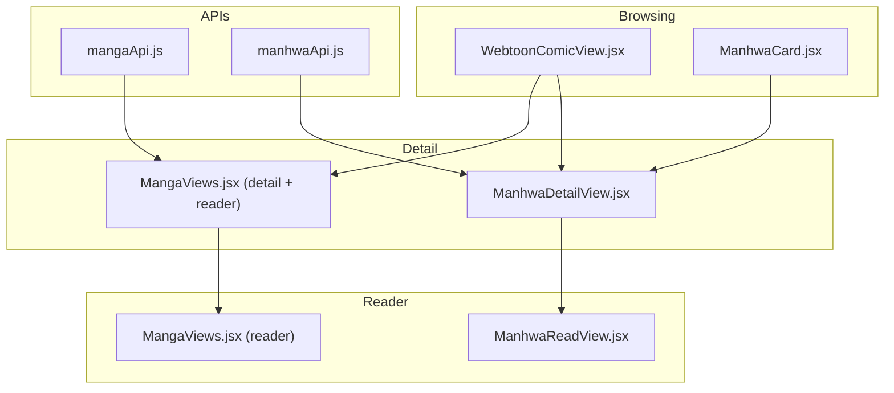
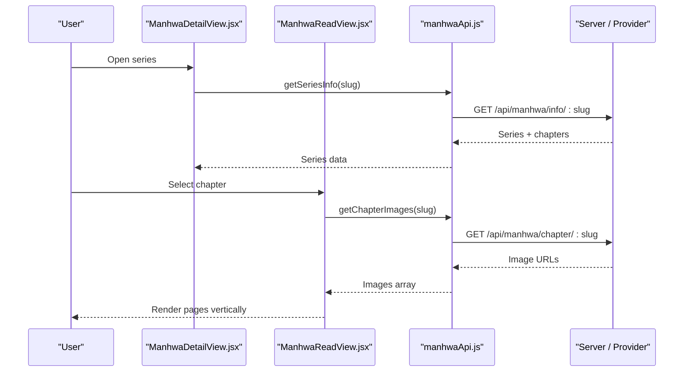
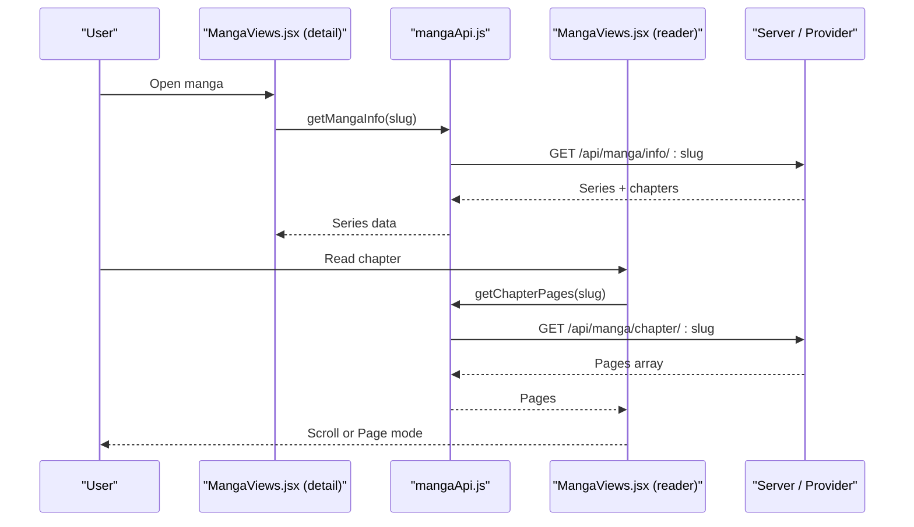
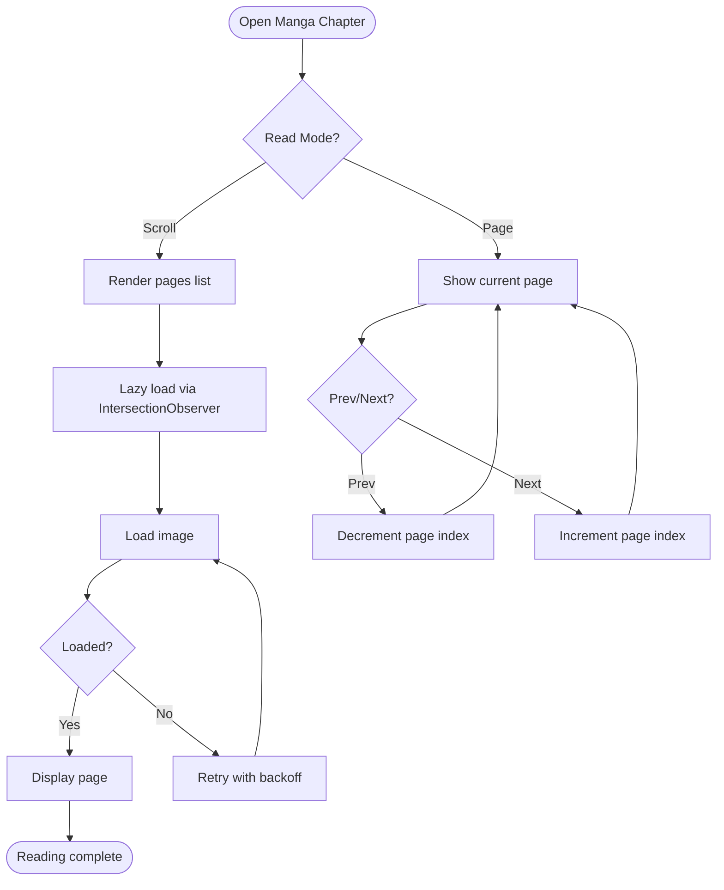
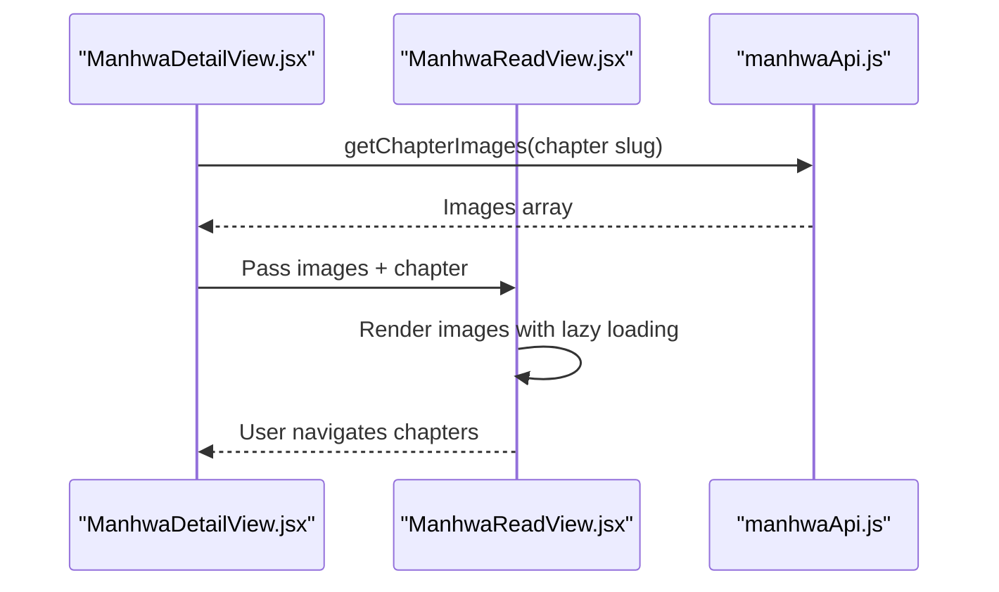
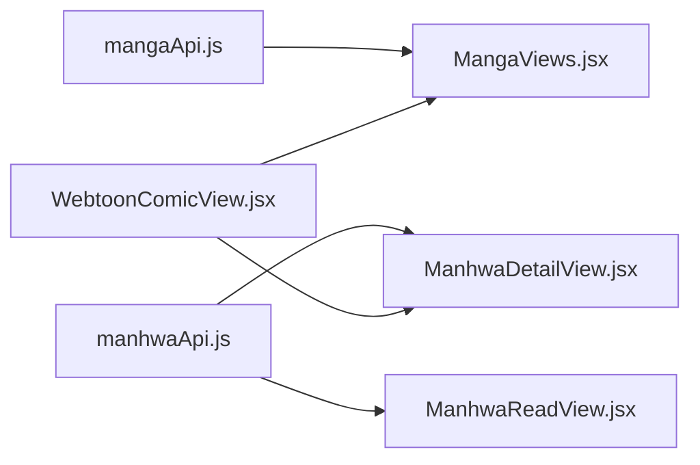

# Manga & Manhwa Reader

<cite>
**Referenced Files in This Document**
- [mangaApi.js](file://src/features/manga/api/mangaApi.js)
- [manhwaApi.js](file://src/features/manhwa/api/manhwaApi.js)
- [MangaViews.jsx](file://src/features/manga/components/MangaViews.jsx)
- [ManhwaDetailView.jsx](file://src/features/manhwa/components/ManhwaDetailView.jsx)
- [ManhwaReadView.jsx](file://src/features/manhwa/components/ManhwaReadView.jsx)
- [ManhwaCard.jsx](file://src/features/manhwa/components/ManhwaCard.jsx)
- [WebtoonComicView.jsx](file://src/components/WebtoonComicView.jsx)
- [cbf.js](file://src/utils/cbf.js)
</cite>

## Table of Contents
1. Introduction
2. Project Structure
3. Core Components
4. Architecture Overview
5. Detailed Component Analysis
6. Dependency Analysis
7. Performance Considerations
8. Troubleshooting Guide
9. Conclusion
10. Appendices

## Introduction
This document explains the Manga and Manhwa reading system in Project Anime. It covers the digital comic reader implementation, chapter navigation, page management, API integrations for manga and manhwa providers, the reading interface (scroll vs page mode), chapter management flows, browsing components, and guidance for extending providers and optimizing image loading. It also addresses touch-friendly interactions and accessibility considerations present in the codebase.

## Project Structure
The reading system is organized by feature:
- APIs: Provider-specific fetchers for manga and manhwa data and chapters.
- UI Components: Browsing cards, detail views, and readers for both manga and manhwa.
- Shared utilities: Content-based filtering and recommendation helpers used elsewhere in the app.

**Diagram sources**
- [mangaApi.js:1-29](file://src/features/manga/api/mangaApi.js#L1-L29)
- [manhwaApi.js:1-29](file://src/features/manhwa/api/manhwaApi.js#L1-L29)
- [WebtoonComicView.jsx:27-80](file://src/components/WebtoonComicView.jsx#L27-L80)
- [ManhwaDetailView.jsx:1-111](file://src/features/manhwa/components/ManhwaDetailView.jsx#L1-L111)
- [ManhwaReadView.jsx:1-94](file://src/features/manhwa/components/ManhwaReadView.jsx#L1-L94)
- [MangaViews.jsx:721-1038](file://src/features/manga/components/MangaViews.jsx#L721-L1038)

**Section sources**
- [mangaApi.js:1-29](file://src/features/manga/api/mangaApi.js#L1-L29)
- [manhwaApi.js:1-29](file://src/features/manhwa/api/manhwaApi.js#L1-L29)
- [WebtoonComicView.jsx:27-80](file://src/components/WebtoonComicView.jsx#L27-L80)
- [ManhwaDetailView.jsx:1-111](file://src/features/manhwa/components/ManhwaDetailView.jsx#L1-L111)
- [ManhwaReadView.jsx:1-94](file://src/features/manhwa/components/ManhwaReadView.jsx#L1-L94)
- [MangaViews.jsx:721-1038](file://src/features/manga/components/MangaViews.jsx#L721-L1038)

## Core Components
- Manga API client: Provides endpoints to fetch catalog, series info, chapter pages, and search results.
- Manhwa API client: Provides endpoints to fetch home catalog, series info, chapter images, and search.
- Manga UI: Home hub, category hubs, genre browse with infinite scroll, detail view with chapter list, and a reader supporting scroll and page modes with robust image loading.
- Manhwa UI: Card, detail view with chapter list, and a simple vertical reader with chapter navigation.
- Webtoon discovery: Hero slider, trending/popular lists, weekly schedule, and category chips for browsing comics.

Key responsibilities:
- Data fetching via provider APIs.
- Chapter selection and navigation.
- Page rendering with lazy loading and retry strategies.
- Browsing and discovery through curated rows and grids.

**Section sources**
- [mangaApi.js:1-29](file://src/features/manga/api/mangaApi.js#L1-L29)
- [manhwaApi.js:1-29](file://src/features/manhwa/api/manhwaApi.js#L1-L29)
- [MangaViews.jsx:449-546](file://src/features/manga/components/MangaViews.jsx#L449-L546)
- [MangaViews.jsx:721-822](file://src/features/manga/components/MangaViews.jsx#L721-L822)
- [MangaViews.jsx:824-1038](file://src/features/manga/components/MangaViews.jsx#L824-L1038)
- [ManhwaDetailView.jsx:1-111](file://src/features/manhwa/components/ManhwaDetailView.jsx#L1-L111)
- [ManhwaReadView.jsx:1-94](file://src/features/manhwa/components/ManhwaReadView.jsx#L1-L94)
- [WebtoonComicView.jsx:27-261](file://src/components/WebtoonComicView.jsx#L27-L261)

## Architecture Overview
The system separates concerns into API clients and React components. The manga flow uses a richer reader with two modes; the manhwa flow provides a simpler vertical reader. Both rely on their respective API modules to retrieve series metadata and chapter assets.

**Diagram sources**
- [manhwaApi.js:5-25](file://src/features/manhwa/api/manhwaApi.js#L5-L25)
- [ManhwaDetailView.jsx:1-111](file://src/features/manhwa/components/ManhwaDetailView.jsx#L1-L111)
- [ManhwaReadView.jsx:1-94](file://src/features/manhwa/components/ManhwaReadView.jsx#L1-L94)

**Diagram sources**
- [mangaApi.js:5-25](file://src/features/manga/api/mangaApi.js#L5-L25)
- [MangaViews.jsx:721-822](file://src/features/manga/components/MangaViews.jsx#L721-L822)
- [MangaViews.jsx:897-1038](file://src/features/manga/components/MangaViews.jsx#L897-L1038)

## Detailed Component Analysis

### Manga Reader (Scroll and Page Modes)
- Reader controls: Toggle between scroll and page modes; chapter navigation; top/bottom toolbars that can be toggled.
- Page rendering: Each page uses an IntersectionObserver to start loading only when near viewport; background retries with backoff on errors.
- Page mode: Single-page display with prev/next buttons and a counter; per-page retry logic with key invalidation.

**Diagram sources**
- [MangaViews.jsx:824-895](file://src/features/manga/components/MangaViews.jsx#L824-L895)
- [MangaViews.jsx:897-1038](file://src/features/manga/components/MangaViews.jsx#L897-L1038)

**Section sources**
- [MangaViews.jsx:824-895](file://src/features/manga/components/MangaViews.jsx#L824-L895)
- [MangaViews.jsx:897-1038](file://src/features/manga/components/MangaViews.jsx#L897-L1038)

### Manhwa Reader (Vertical Scroll)
- Displays all chapter images in a vertical stack with lazy loading.
- Provides previous/next chapter navigation and a chapter picker grid at the bottom.
- Shows loading state and empty states appropriately.

**Diagram sources**
- [ManhwaReadView.jsx:1-94](file://src/features/manhwa/components/ManhwaReadView.jsx#L1-L94)
- [manhwaApi.js:15-20](file://src/features/manhwa/api/manhwaApi.js#L15-L20)

**Section sources**
- [ManhwaReadView.jsx:1-94](file://src/features/manhwa/components/ManhwaReadView.jsx#L1-L94)

### Manhwa Detail View and Chapter List
- Presents series hero, synopsis, genres, and a chapter list.
- Supports “show more” for large chapter lists and thumbnail previews where available.
- Triggers reading flow by passing series and selected chapter to the reader.

**Section sources**
- [ManhwaDetailView.jsx:1-111](file://src/features/manhwa/components/ManhwaDetailView.jsx#L1-L111)

### Manga Detail View and Chapter Management
- Displays series banner, cover, status, rating, genres, description, and chapter list.
- Includes chapter search and sort toggle (newest/oldest).
- On chapter click, initiates reading flow.

**Section sources**
- [MangaViews.jsx:721-822](file://src/features/manga/components/MangaViews.jsx#L721-L822)

### Browsing and Discovery
- WebtoonComicView: Hero slider, trending/popular tabs, weekly schedule, and category chips to filter content. Uses lazy loading and error fallbacks for images.
- Manga category hubs: Bento grids, rows, and genre-based infinite scrolling with deduplication and sentinel-based load-more.

**Section sources**
- [WebtoonComicView.jsx:27-261](file://src/components/WebtoonComicView.jsx#L27-L261)
- [MangaViews.jsx:449-546](file://src/features/manga/components/MangaViews.jsx#L449-L546)
- [MangaViews.jsx:548-633](file://src/features/manga/components/MangaViews.jsx#L548-L633)

### Comic Cards
- ManhwaCard: Displays cover with lazy loading, error placeholder, and overlay indicating “Read”.
- Manga card variants: Used across rows and grids with status badges and ratings.

**Section sources**
- [ManhwaCard.jsx:1-33](file://src/features/manhwa/components/ManhwaCard.jsx#L1-L33)
- [MangaViews.jsx:6-36](file://src/features/manga/components/MangaViews.jsx#L6-L36)

## Dependency Analysis
- API layer:
  - mangaApi.js exposes methods for catalog, info, chapter pages, and search.
  - manhwaApi.js exposes methods for home catalog, info, chapter images, and search.
- UI layer:
  - MangaViews.jsx contains multiple views including detail and reader; depends on mangaApi indirectly via higher-level data flow.
  - ManhwaDetailView.jsx and ManhwaReadView.jsx depend on manhwaApi for data retrieval.
  - WebtoonComicView.jsx orchestrates discovery and delegates to shared APIs for categories and schedules.

**Diagram sources**
- [mangaApi.js:1-29](file://src/features/manga/api/mangaApi.js#L1-L29)
- [manhwaApi.js:1-29](file://src/features/manhwa/api/manhwaApi.js#L1-L29)
- [MangaViews.jsx:721-1038](file://src/features/manga/components/MangaViews.jsx#L721-L1038)
- [ManhwaDetailView.jsx:1-111](file://src/features/manhwa/components/ManhwaDetailView.jsx#L1-L111)
- [ManhwaReadView.jsx:1-94](file://src/features/manhwa/components/ManhwaReadView.jsx#L1-L94)
- [WebtoonComicView.jsx:27-261](file://src/components/WebtoonComicView.jsx#L27-L261)

**Section sources**
- [mangaApi.js:1-29](file://src/features/manga/api/mangaApi.js#L1-L29)
- [manhwaApi.js:1-29](file://src/features/manhwa/api/manhwaApi.js#L1-L29)
- [MangaViews.jsx:721-1038](file://src/features/manga/components/MangaViews.jsx#L721-L1038)
- [ManhwaDetailView.jsx:1-111](file://src/features/manhwa/components/ManhwaDetailView.jsx#L1-L111)
- [ManhwaReadView.jsx:1-94](file://src/features/manhwa/components/ManhwaReadView.jsx#L1-L94)
- [WebtoonComicView.jsx:27-261](file://src/components/WebtoonComicView.jsx#L27-L261)

## Performance Considerations
- Lazy loading:
  - Manhwa reader uses native lazy loading for images to reduce initial payload.
  - Manga reader uses IntersectionObserver with generous root margins to prefetch images before they enter the viewport.
- Error resilience:
  - Manga reader implements background retries with exponential backoff for individual pages and a per-page retry mechanism in page mode.
  - Browsing components handle image errors gracefully with placeholders or fallback classes.
- Infinite scroll:
  - Genre browse uses sentinel-based intersection observer to load more items efficiently and deduplicates incoming items.
- Memory and reflows:
  - Page mode resets image keys on chapter/page changes to force reload without stale references.
  - Large chapter lists are paginated or truncated in detail views to avoid heavy DOM.

[No sources needed since this section provides general guidance]

## Troubleshooting Guide
- No pages found:
  - If a chapter returns no images/pages, the UI shows an empty state prompting users to try another chapter.
- Image load failures:
  - Manga reader auto-retries with backoff; page mode offers manual retry after repeated failures.
  - Browsing components hide broken images and show skeletons or placeholders.
- Network errors:
  - API calls throw descriptive errors; consumers should surface user-friendly messages and offer retry actions.

**Section sources**
- [ManhwaReadView.jsx:30-50](file://src/features/manhwa/components/ManhwaReadView.jsx#L30-L50)
- [MangaViews.jsx:856-868](file://src/features/manga/components/MangaViews.jsx#L856-L868)
- [MangaViews.jsx:932-938](file://src/features/manga/components/MangaViews.jsx#L932-L938)
- [WebtoonComicView.jsx:93-98](file://src/components/WebtoonComicView.jsx#L93-L98)

## Conclusion
Project Anime’s Manga and Manhwa reading system provides a robust, mobile-friendly experience with flexible reading modes, efficient image loading, and clear chapter navigation. The separation of API clients from UI components enables easy extension to new providers. The manga reader includes advanced features like scroll/page modes and resilient image loading, while the manhwa reader offers a streamlined vertical reading experience. Browsing components support discovery through curated sections, schedules, and genre filters.

[No sources needed since this section summarizes without analyzing specific files]

## Appendices

### Adding a New Comic Provider
- Create a new API module similar to mangaApi.js or manhwaApi.js:
  - Define functions for catalog, series info, and chapter assets.
  - Use a consistent path helper to build URLs.
  - Handle errors and return normalized data shapes.
- Wire up UI:
  - Add a category entry in the manga category hubs if applicable.
  - Implement a detail view and reader or reuse existing ones if data shape matches.
  - Ensure browsing components can render cards and rows using the new data.

**Section sources**
- [mangaApi.js:1-29](file://src/features/manga/api/mangaApi.js#L1-L29)
- [manhwaApi.js:1-29](file://src/features/manhwa/api/manhwaApi.js#L1-L29)
- [MangaViews.jsx:123-167](file://src/features/manga/components/MangaViews.jsx#L123-L167)

### Implementing Custom Reading Modes
- Extend the reader component to support additional modes:
  - Introduce a mode selector and conditional rendering.
  - For example, implement a “diagonal” or “grid” mode by changing layout and navigation behavior.
- Reuse existing patterns:
  - Follow the scroll vs page mode pattern for state management and navigation.
  - Apply lazy loading and retry strategies consistently.

**Section sources**
- [MangaViews.jsx:897-1038](file://src/features/manga/components/MangaViews.jsx#L897-L1038)

### Optimizing Image Loading for Large Comics
- Use lazy loading:
  - Native lazy for simple stacks; IntersectionObserver for precise control.
- Implement retries:
  - Background retries with backoff for transient failures.
- Reduce memory pressure:
  - Unobserve off-screen images; reset keys on navigation.
- Provide fallbacks:
  - Show placeholders or skeletons during load and error states.

**Section sources**
- [MangaViews.jsx:824-895](file://src/features/manga/components/MangaViews.jsx#L824-L895)
- [ManhwaReadView.jsx:30-50](file://src/features/manhwa/components/ManhwaReadView.jsx#L30-L50)

### Touch Gestures and Accessibility
- Touch-friendly interactions:
  - Readers expose large tap targets for chapter navigation and mode switching.
  - Toolbars can be toggled to maximize reading area.
- Accessibility:
  - Images include alt text for screen readers.
  - Lists use semantic elements and aria-live regions where appropriate.
  - Keyboard-accessible buttons and selects enable full operation without touch.

**Section sources**
- [ManhwaReadView.jsx:10-28](file://src/features/manhwa/components/ManhwaReadView.jsx#L10-L28)
- [MangaViews.jsx:940-974](file://src/features/manga/components/MangaViews.jsx#L940-L974)
- [MangaViews.jsx:517-545](file://src/features/manga/components/MangaViews.jsx#L517-L545)

### Mobile-Optimized Reading Experience
- Vertical stacking for manhwa ensures natural scrolling on narrow screens.
- Manga reader supports page mode for discrete navigation and scroll mode for continuous reading.
- Browsing components use responsive grids and skeleton loaders to maintain perceived performance.

**Section sources**
- [ManhwaReadView.jsx:30-70](file://src/features/manhwa/components/ManhwaReadView.jsx#L30-L70)
- [MangaViews.jsx:897-1038](file://src/features/manga/components/MangaViews.jsx#L897-L1038)
- [WebtoonComicView.jsx:100-261](file://src/components/WebtoonComicView.jsx#L100-L261)