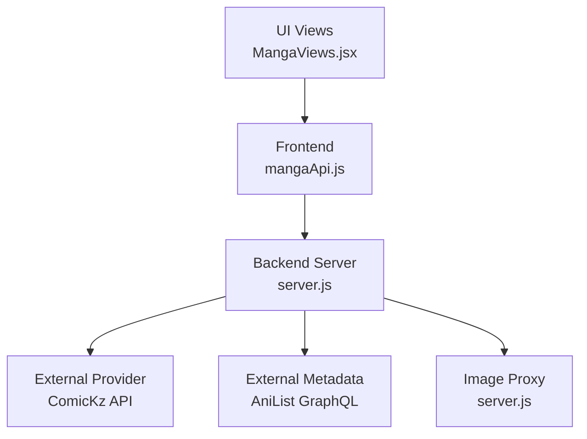
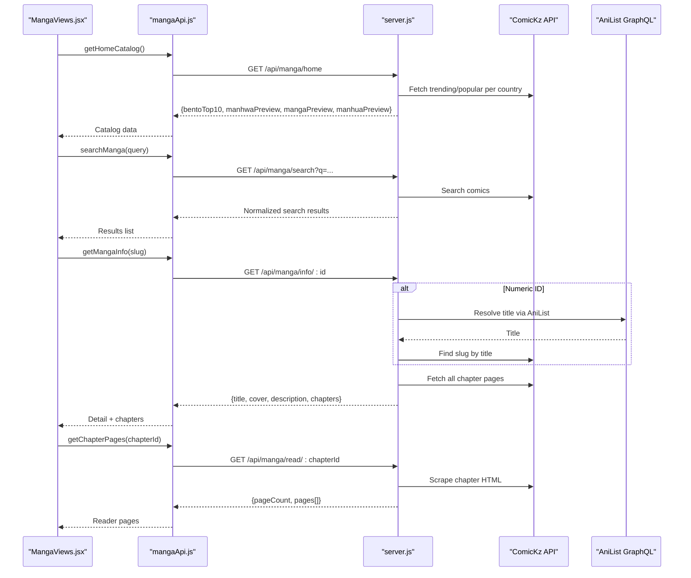
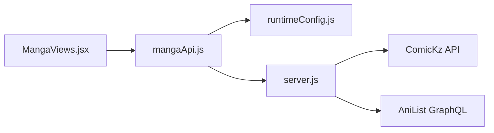

# Manga API Integration

<cite>
**Referenced Files in This Document**
- [mangaApi.js](file://src/features/manga/api/mangaApi.js)
- [MangaViews.jsx](file://src/features/manga/components/MangaViews.jsx)
- [runtimeConfig.js](file://src/runtimeConfig.js)
- [server.js](file://server.js)
- [mockData.js](file://src/mockData.js)
</cite>

## Table of Contents
1. [Introduction](#introduction)
2. [Project Structure](#project-structure)
3. [Core Components](#core-components)
4. [Architecture Overview](#architecture-overview)
5. [Detailed Component Analysis](#detailed-component-analysis)
6. [Dependency Analysis](#dependency-analysis)
7. [Performance Considerations](#performance-considerations)
8. [Troubleshooting Guide](#troubleshooting-guide)
9. [Conclusion](#conclusion)
10. [Appendices](#appendices)

## Introduction
This document explains the Manga API integration layer in Project Anime. It covers how the frontend module calls backend endpoints, how the server aggregates and transforms data from external manga providers (primarily ComicKz and AniList), and how the UI consumes unified responses for discovery, search, browsing by genre, and reading chapters. It also provides guidance on adding new providers, handling errors and fallbacks, caching strategies, rate limiting, pagination, and error recovery.

## Project Structure
The manga integration spans three layers:
- Frontend API client: a small module that builds URLs using runtime configuration and calls backend endpoints.
- Backend server: Node/Express routes that aggregate data from external sources, transform it into a unified schema, cache results, and serve consistent JSON to the frontend.
- UI components: React views that render home catalog, category hubs, genre browsing with infinite scroll, search results, detail pages, and chapter readers.

**Diagram sources**
- [mangaApi.js:1-28](file://src/features/manga/api/mangaApi.js#L1-L28)
- [server.js:2320-2465](file://server.js#L2320-L2465)
- [server.js:2654-2876](file://server.js#L2654-L2876)
- [server.js:2878-2900](file://server.js#L2878-L2900)
- [MangaViews.jsx:283-355](file://src/features/manga/components/MangaViews.jsx#L283-L355)

**Section sources**
- [mangaApi.js:1-28](file://src/features/manga/api/mangaApi.js#L1-L28)
- [runtimeConfig.js:149-153](file://src/runtimeConfig.js#L149-L153)
- [server.js:2320-2465](file://server.js#L2320-L2465)
- [server.js:2654-2876](file://server.js#L2654-L2876)
- [MangaViews.jsx:283-355](file://src/features/manga/components/MangaViews.jsx#L283-L355)

## Core Components
- Frontend API client:
  - Provides methods to fetch home catalog, manga info, chapter pages, and search results via backend endpoints.
  - Uses runtime configuration to build absolute or relative URLs depending on environment.
- Backend server:
  - Implements endpoints for home catalog, category browsing, search, details, reading chapters, and image proxying.
  - Aggregates data from ComicKz and AniList, normalizes fields, and returns a consistent response shape.
  - Includes caching for genre catalogs and robust retry/backoff for image fetching.
- UI views:
  - Render home landing, category hubs, genre browse with infinite scrolling, search results, detail view, and chapter reader.

Key responsibilities:
- Discovery: Home catalog and category hubs expose trending, popular, top picks, and recent updates.
- Search: Query-based search across providers with normalized results.
- Browsing: Genre-based filtering with pagination and infinite scroll.
- Reading: Chapter page retrieval through a secure image proxy.

**Section sources**
- [mangaApi.js:5-25](file://src/features/manga/api/mangaApi.js#L5-L25)
- [server.js:2320-2465](file://server.js#L2320-L2465)
- [server.js:2654-2876](file://server.js#L2654-L2876)
- [MangaViews.jsx:449-546](file://src/features/manga/components/MangaViews.jsx#L449-L546)

## Architecture Overview
The system uses a layered architecture:
- The frontend calls backend endpoints exposed under /api/manga/* using a simple client module.
- The backend orchestrates requests to external providers (ComicKz for content and chapters; AniList for metadata and curated lists).
- Responses are transformed into a unified schema with fields like id, title, cover, banner, description, rating, status, genres, type, and chapters.
- Images are served via a proxy endpoint to handle CORS and referer requirements.

**Diagram sources**
- [mangaApi.js:6-25](file://src/features/manga/api/mangaApi.js#L6-L25)
- [server.js:2320-2465](file://server.js#L2320-L2465)
- [server.js:2654-2876](file://server.js#L2654-L2876)

## Detailed Component Analysis

### Frontend API Client (mangaApi.js)
- Purpose: Provide a minimal, typed interface to backend endpoints for manga features.
- Methods:
  - getHomeCatalog: Fetches home catalog data.
  - getMangaInfo: Retrieves detailed info and chapters for a manga by slug.
  - getChapterPages: Loads chapter pages for reading.
  - searchManga: Performs search queries against backend.
- URL building: Uses runtimeConfig.apiUrl to resolve base URL dynamically based on environment and query overrides.

Error handling:
- Non-ok responses throw errors for catalog/info/chapter reads.
- Search returns an empty array on failure to keep UI responsive.

Caching strategy:
- No client-side caching here; relies on backend caching and browser HTTP caching where applicable.

**Section sources**
- [mangaApi.js:1-28](file://src/features/manga/api/mangaApi.js#L1-L28)
- [runtimeConfig.js:149-153](file://src/runtimeConfig.js#L149-L153)

### Backend Endpoints (server.js)
- Home catalog (/api/manga/home):
  - Aggregates trending and previews by country (manga/manhwa/manhua) from ComicKz.
  - Returns bentoTop10, previews, trending, popular, topRated, and featured items.
- Category browsing (/api/manga/category/:type?genre=<genre>&page=&perPage=):
  - Supports genre-specific catalog with pagination and hasMore flag.
  - For non-all genres, uses cached genre catalog when available; otherwise fetches from provider.
  - Returns structured sections: trending, popular, topPick, recent, plus paginated items.
- Search (/api/manga/search?q=...):
  - Queries ComicKz search and returns normalized results.
- Details (/api/manga/info/:id):
  - If numeric ID, resolves title via AniList then finds ComicKz slug.
  - Fetches all chapter pages with pagination and deduplicates entries.
  - Scrapes comic page for cover and description.
  - Returns unified detail object with chapters.
- Reading (/api/manga/read/:chapterId):
  - Parses chapterId to extract slug and chapter path.
  - Scrapes chapter HTML to extract images and returns proxied URLs.
- Image proxy (/api/manga/image-proxy?url=...):
  - Proxies images with correct Referer headers.
  - Implements exponential backoff retries on 429 responses.

Provider integration:
- ComicKz: Primary source for content, chapters, and search.
- AniList: Used for metadata enrichment and curated webtoon lists.

Normalization:
- All provider responses are mapped to a common schema including id, title, cover, banner, description, rating, status, genres, type, and chapters.

**Section sources**
- [server.js:2320-2465](file://server.js#L2320-L2465)
- [server.js:2654-2876](file://server.js#L2654-L2876)
- [server.js:2878-2900](file://server.js#L2878-L2900)

### UI Components (MangaViews.jsx)
- Home view:
  - Renders bento grid, category cards, and previews.
  - Handles search state and displays results.
- Category hub:
  - Displays genre pills and loads category data.
  - Shows trending, popular, top picks, and recent rows.
- Genre browse:
  - Implements infinite scroll with IntersectionObserver.
  - Deduplicates incoming items and tracks hasMore.
- Detail view:
  - Shows meta, genres, description, and searchable/sortable chapter list.
- Reader:
  - Consumes chapter pages returned by backend and renders images.

Pagination and loading states:
- Uses isLoading, isLoadingMore, hasMore flags to manage UX during data fetching.
- Error messages displayed when load fails.

**Section sources**
- [MangaViews.jsx:283-355](file://src/features/manga/components/MangaViews.jsx#L283-L355)
- [MangaViews.jsx:449-546](file://src/features/manga/components/MangaViews.jsx#L449-L546)
- [MangaViews.jsx:548-633](file://src/features/manga/components/MangaViews.jsx#L548-L633)
- [MangaViews.jsx:721-800](file://src/features/manga/components/MangaViews.jsx#L721-L800)

### Data Transformation Pipeline
- Provider responses are mapped to a unified format:
  - id/comickSlug/hid for unique identification.
  - title, cover/banner, description, rating, status, genres, type for display.
  - chapters array with id, chapter number, title, volume, publishAt.
- Cover/banners are proxied via image proxy to avoid CORS issues.
- Ratings and statuses are normalized to consistent values.

Complexity considerations:
- Chapter aggregation involves multiple paginated requests; deduplication ensures uniqueness.
- Caching reduces repeated network calls for genre catalogs.

**Section sources**
- [server.js:2222-2240](file://server.js#L2222-L2240)
- [server.js:2717-2794](file://server.js#L2717-L2794)

## Dependency Analysis
- Frontend depends on runtimeConfig for URL resolution and calls backend endpoints.
- Backend depends on external providers (ComicKz, AniList) and implements internal caching and image proxying.
- UI depends on backend responses being in a stable, unified schema.

**Diagram sources**
- [mangaApi.js:1-28](file://src/features/manga/api/mangaApi.js#L1-L28)
- [runtimeConfig.js:149-153](file://src/runtimeConfig.js#L149-L153)
- [server.js:2320-2465](file://server.js#L2320-L2465)
- [server.js:2654-2876](file://server.js#L2654-L2876)
- [MangaViews.jsx:283-355](file://src/features/manga/components/MangaViews.jsx#L283-L355)

**Section sources**
- [mangaApi.js:1-28](file://src/features/manga/api/mangaApi.js#L1-L28)
- [runtimeConfig.js:149-153](file://src/runtimeConfig.js#L149-L153)
- [server.js:2320-2465](file://server.js#L2320-L2465)
- [server.js:2654-2876](file://server.js#L2654-L2876)
- [MangaViews.jsx:283-355](file://src/features/manga/components/MangaViews.jsx#L283-L355)

## Performance Considerations
- Caching:
  - Genre catalogs are cached in-memory with TTL and max item limits to reduce repeated provider calls.
  - Slug resolution is cached to avoid redundant searches.
- Pagination:
  - Backend supports page and perPage parameters; UI uses infinite scroll to load more efficiently.
- Rate limiting and retries:
  - Image proxy includes exponential backoff on 429 responses to respect provider rate limits.
- Network timeouts:
  - Requests include timeouts to prevent hanging connections.
- Image optimization:
  - Covers are proxied to ensure reliable loading and avoid CORS blocks.

[No sources needed since this section provides general guidance]

## Troubleshooting Guide
Common issues and resolutions:
- Backend offline or unreachable:
  - Frontend search/info methods return empty arrays or fallback data to keep UI functional.
  - Check runtime config and environment variables for correct API base.
- Provider rate limiting (429):
  - Image proxy retries with backoff; if persistent, reduce request frequency or adjust limits.
- Missing chapters or detail info:
  - Verify slug resolution and provider availability; check logs for scraping errors.
- CORS or image loading failures:
  - Ensure image proxy is used; verify Referer headers and CDN domains.

**Section sources**
- [mockData.js:959-1029](file://src/mockData.js#L959-L1029)
- [server.js:2878-2900](file://server.js#L2878-L2900)

## Conclusion
The Manga API integration layer provides a robust, unified interface for discovering and reading manga content. It abstracts provider complexity behind clean backend endpoints, normalizes data for consistent UI consumption, and includes caching, pagination, and error recovery mechanisms. Extending to new providers involves implementing mapping functions and integrating them into the relevant endpoints while maintaining the unified schema.

[No sources needed since this section summarizes without analyzing specific files]

## Appendices

### API Methods Summary
- Home catalog:
  - Endpoint: GET /api/manga/home
  - Response: bentoTop10, manhwaPreview, mangaPreview, manhuaPreview, trending, popular, topRated, featured
- Category browsing:
  - Endpoint: GET /api/manga/category/:type?genre=<genre>&page=&perPage=
  - Response: type, country, genre, page, perPage, total, hasMore, items, trending, popular, topPick, recent
- Search:
  - Endpoint: GET /api/manga/search?q=<query>
  - Response: Array of normalized manga items
- Details:
  - Endpoint: GET /api/manga/info/:id
  - Response: id, comickSlug, title, cover, banner, description, status, rating, genres, chapters
- Reading:
  - Endpoint: GET /api/manga/read/:chapterId
  - Response: chapterId, pageCount, pages[]
- Image proxy:
  - Endpoint: GET /api/manga/image-proxy?url=<url>
  - Behavior: Proxies images with proper headers and retry logic

**Section sources**
- [server.js:2320-2465](file://server.js#L2320-L2465)
- [server.js:2654-2876](file://server.js#L2654-L2876)
- [server.js:2878-2900](file://server.js#L2878-L2900)

### Implementing New Manga Providers
Steps:
- Add provider configuration constants (e.g., base URL).
- Implement fetchers for discovery, search, details, and chapters.
- Map provider responses to the unified schema using mapping functions.
- Integrate mapping into existing endpoints or create new ones.
- Update caching and retry logic as needed.
- Test with UI components to ensure compatibility.

Best practices:
- Maintain consistent field names and types.
- Handle missing or malformed data gracefully.
- Use proxies for images to avoid CORS issues.
- Respect provider rate limits with backoff and caching.

[No sources needed since this section provides general guidance]

### Error Handling and Fallbacks
- Frontend:
  - Search returns empty arrays on failure; other methods throw errors for immediate feedback.
  - Mock data includes client-side fallbacks to AniList when backend is unavailable.
- Backend:
  - Graceful degradation: returns empty or partial data on provider errors.
  - Redirects between endpoints to maintain functionality when one provider fails.

**Section sources**
- [mangaApi.js:21-25](file://src/features/manga/api/mangaApi.js#L21-L25)
- [mockData.js:959-1029](file://src/mockData.js#L959-L1029)
- [server.js:2610-2652](file://server.js#L2610-L2652)

### Caching Strategies
- In-memory caches:
  - Genre catalogs cached with TTL and max items to reduce provider load.
  - Slug resolution cached to avoid repeated searches.
- Browser caching:
  - Runtime config uses cache-busting for fresh configuration.
  - Image proxy can leverage browser caching for repeated images.

**Section sources**
- [server.js:2218-2318](file://server.js#L2218-L2318)
- [runtimeConfig.js:54-71](file://src/runtimeConfig.js#L54-L71)

### Rate Limiting and Retry Logic
- Image proxy:
  - Exponential backoff on 429 responses to comply with provider limits.
- Request timeouts:
  - Configured per endpoint to prevent long hangs.
- UI throttling:
  - Infinite scroll prevents excessive requests by checking hasMore and loading states.

**Section sources**
- [server.js:2878-2900](file://server.js#L2878-L2900)
- [MangaViews.jsx:449-546](file://src/features/manga/components/MangaViews.jsx#L449-L546)