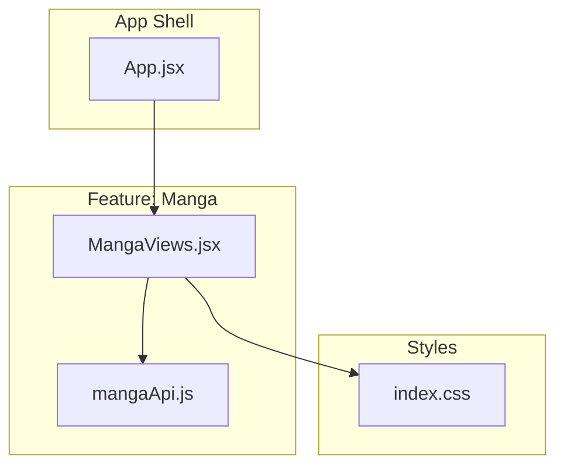
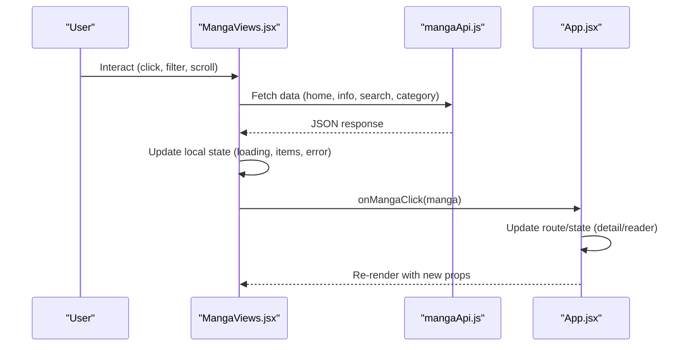
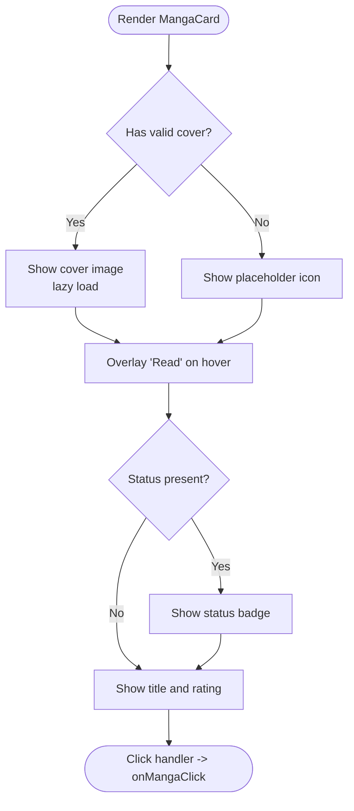
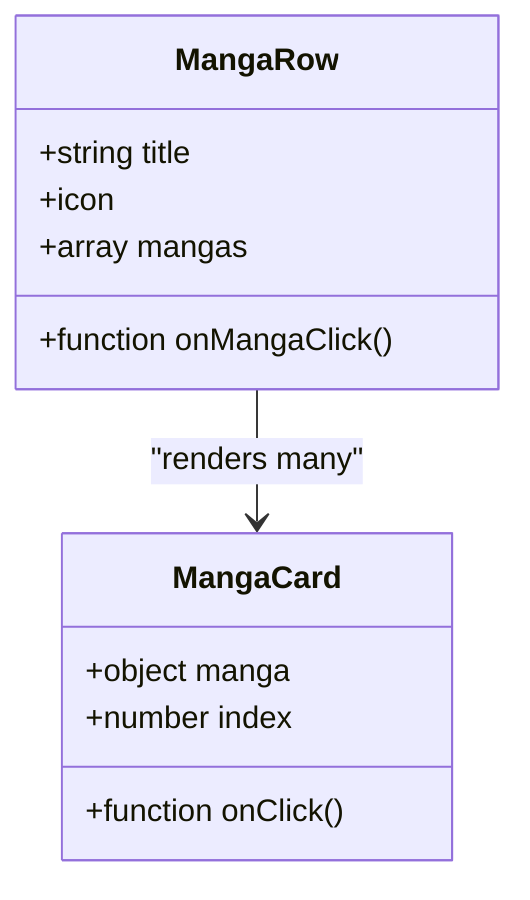
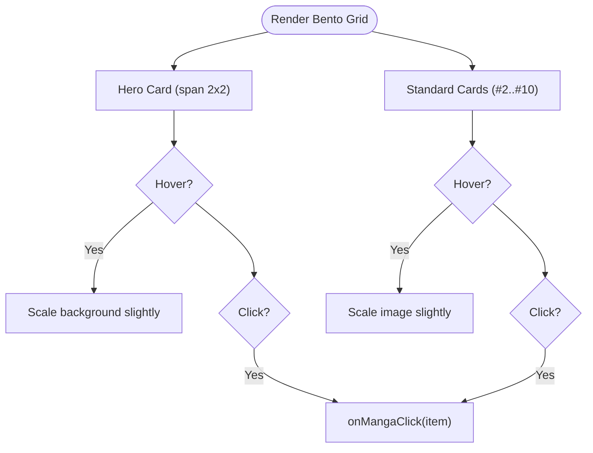
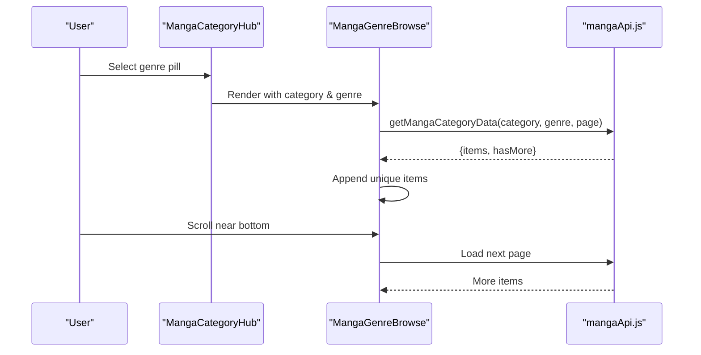
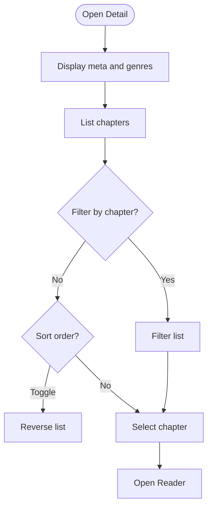
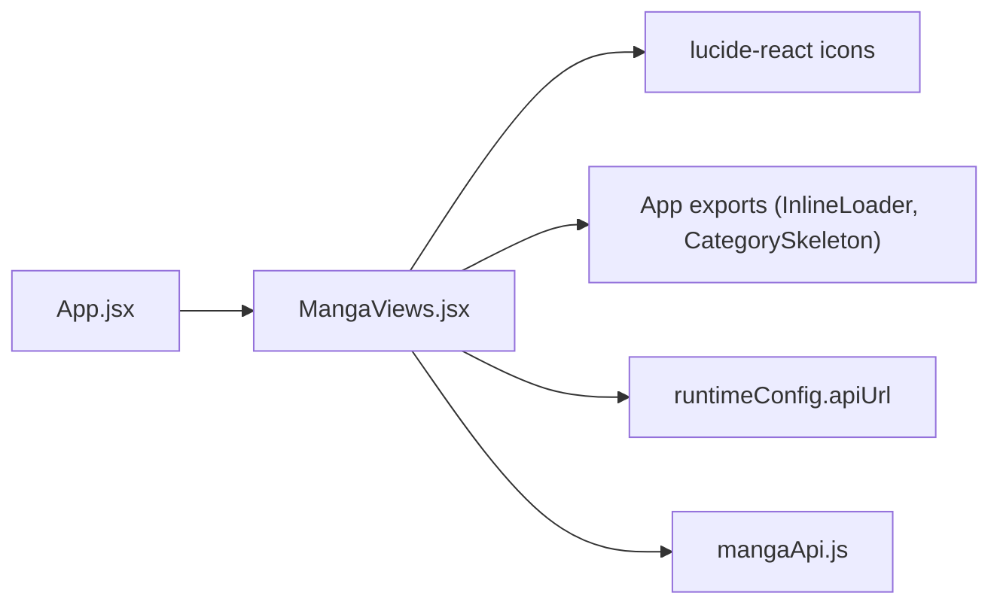

# Manga UI Components

<cite>
**Referenced Files in This Document**
- [MangaViews.jsx](file://src/features/manga/components/MangaViews.jsx)
- [mangaApi.js](file://src/features/manga/api/mangaApi.js)
- [index.css](file://src/index.css)
- [App.jsx](file://src/App.jsx)
</cite>

## Table of Contents
1. Introduction
2. Project Structure
3. Core Components
4. Architecture Overview
5. Detailed Component Analysis
6. Dependency Analysis
7. Performance Considerations
8. Troubleshooting Guide
9. Conclusion
10. Appendices

## Introduction
This document explains the Manga UI components system used to browse and read manga, manhwa, and manhua content. It covers component architecture (MangaCard, MangaRow, MangaBentoGrid, category navigation), responsive design patterns, interactive behaviors (hover effects, click handlers, navigation flows), infinite scroll implementation for genre browsing, accessibility considerations, styling via CSS classes and theme variables, and state management for loading, errors, and user interactions.

## Project Structure
The manga feature is implemented as a React feature module with:
- A single components file that exports multiple views and shared components
- An API helper for fetching catalog data
- Global styles in the project’s main stylesheet
- Integration into the application shell via imports in the root App

**Diagram sources**
- [MangaViews.jsx:1-42](file://src/features/manga/components/MangaViews.jsx#L1-L42)
- [mangaApi.js:1-29](file://src/features/manga/api/mangaApi.js#L1-L29)
- [App.jsx:37-42](file://src/App.jsx#L37-L42)
- [index.css:8300-9799](file://src/index.css#L8300-L9799)

**Section sources**
- [MangaViews.jsx:1-42](file://src/features/manga/components/MangaViews.jsx#L1-L42)
- [mangaApi.js:1-29](file://src/features/manga/api/mangaApi.js#L1-L29)
- [App.jsx:37-42](file://src/App.jsx#L37-L42)
- [index.css:8300-9799](file://src/index.css#L8300-L9799)

## Core Components
- MangaCard: Displays a single title with cover image, status badge, rating, and hover overlay. Clicking triggers an onMangaClick callback.
- MangaRow: Horizontal row of MangaCard items with a section header and count.
- MangaBentoGrid: Top-10 grid layout with a hero card and ranked standard cards.
- Category navigation:
  - MangaCategoryCards / MangaCategoryCardsV2: Entry points to choose Manga, Manhwa, or Manhua shelves.
  - MangaCategoryHub / MangaCategoryHubV2: Genre-filtered hub pages with rows and spotlights.
  - MangaGenreBrowse: Infinite-scrollable genre results with pagination sentinel.
- Additional views:
  - MangaHomeView / MangaHomeViewV2: Home landing with search, bento grid, and category selection.
  - MangaDetailView: Title detail with chapter list, search, and sort controls.
  - MangaReaderView: Fullscreen reader with toolbar, page modes, and navigation.

Key props and responsibilities are passed down from parent views (e.g., App.jsx) which manage global state such as selected titles and routing.

**Section sources**
- [MangaViews.jsx:6-121](file://src/features/manga/components/MangaViews.jsx#L6-L121)
- [MangaViews.jsx:123-167](file://src/features/manga/components/MangaViews.jsx#L123-L167)
- [MangaViews.jsx:169-281](file://src/features/manga/components/MangaViews.jsx#L169-L281)
- [MangaViews.jsx:283-355](file://src/features/manga/components/MangaViews.jsx#L283-L355)
- [MangaViews.jsx:357-402](file://src/features/manga/components/MangaViews.jsx#L357-L402)
- [MangaViews.jsx:404-419](file://src/features/manga/components/MangaViews.jsx#L404-L419)
- [MangaViews.jsx:421-447](file://src/features/manga/components/MangaViews.jsx#L421-L447)
- [MangaViews.jsx:449-546](file://src/features/manga/components/MangaViews.jsx#L449-L546)
- [MangaViews.jsx:548-633](file://src/features/manga/components/MangaViews.jsx#L548-L633)
- [MangaViews.jsx:635-692](file://src/features/manga/components/MangaViews.jsx#L635-L692)
- [MangaViews.jsx:694-719](file://src/features/manga/components/MangaViews.jsx#L694-L719)
- [MangaViews.jsx:721-800](file://src/features/manga/components/MangaViews.jsx#L721-L800)

## Architecture Overview
The manga UI follows a layered approach:
- Views (in MangaViews.jsx) render UI and handle local state like loading, filters, and pagination.
- Data fetching is delegated to the API layer (mangaApi.js).
- The App orchestrates routing, view selection, and passes callbacks to update global state (selected manga, chapters, etc.).
- Styling is centralized in index.css using BEM-like class names and CSS custom properties for theming.

**Diagram sources**
- [MangaViews.jsx:169-281](file://src/features/manga/components/MangaViews.jsx#L169-L281)
- [MangaViews.jsx:449-546](file://src/features/manga/components/MangaViews.jsx#L449-L546)
- [mangaApi.js:5-25](file://src/features/manga/api/mangaApi.js#L5-L25)
- [App.jsx:51-445](file://src/App.jsx#L51-L445)

## Detailed Component Analysis

### MangaCard
- Purpose: Display a single manga entry with cover, status, rating, and “Read” overlay.
- Interactions: Button element with onClick(manga) to navigate to detail or reader.
- Accessibility: Uses button semantics; alt text on images; keyboard focusable by default.
- Styling: Responsive width, hover scale, gradient overlay, status badges.

**Diagram sources**
- [MangaViews.jsx:6-36](file://src/features/manga/components/MangaViews.jsx#L6-L36)
- [index.css:8382-8465](file://src/index.css#L8382-L8465)

**Section sources**
- [MangaViews.jsx:6-36](file://src/features/manga/components/MangaViews.jsx#L6-L36)
- [index.css:8382-8465](file://src/index.css#L8382-L8465)

### MangaRow
- Purpose: Horizontal slider of MangaCard items with a section header and count.
- Interactions: Renders children with onMangaClick passed through.
- Styling: Scrollable row with thin scrollbar and spacing.

**Diagram sources**
- [MangaViews.jsx:38-55](file://src/features/manga/components/MangaViews.jsx#L38-L55)
- [index.css:8367-8379](file://src/index.css#L8367-L8379)

**Section sources**
- [MangaViews.jsx:38-55](file://src/features/manga/components/MangaViews.jsx#L38-L55)
- [index.css:8367-8379](file://src/index.css#L8367-L8379)

### MangaBentoGrid
- Purpose: Top-10 showcase with a large hero card and ranked smaller cards.
- Interactions: Clicking any card triggers onMangaClick.
- Styling: Grid layout with responsive columns, hover transforms, rank badges, overlays.

**Diagram sources**
- [MangaViews.jsx:57-121](file://src/features/manga/components/MangaViews.jsx#L57-L121)
- [index.css:8832-9014](file://src/index.css#L8832-L9014)

**Section sources**
- [MangaViews.jsx:57-121](file://src/features/manga/components/MangaViews.jsx#L57-L121)
- [index.css:8832-9014](file://src/index.css#L8832-L9014)

### Category Navigation (MangaCategoryCards, MangaCategoryHub, MangaGenreBrowse)
- MangaCategoryCards / V2: Present three format options (Manga, Manhwa, Manhua) with distinct visual themes. Selecting navigates to a category hub.
- MangaCategoryHub / V2: Shows shelf spotlight and genre pills; when a specific genre is selected, delegates to MangaGenreBrowse.
- MangaGenreBrowse: Implements infinite scroll via IntersectionObserver sentinel, deduplication by id, and hasMore flag.

**Diagram sources**
- [MangaViews.jsx:169-281](file://src/features/manga/components/MangaViews.jsx#L169-L281)
- [MangaViews.jsx:449-546](file://src/features/manga/components/MangaViews.jsx#L449-L546)
- [mangaApi.js:5-25](file://src/features/manga/api/mangaApi.js#L5-L25)

**Section sources**
- [MangaViews.jsx:123-167](file://src/features/manga/components/MangaViews.jsx#L123-L167)
- [MangaViews.jsx:169-281](file://src/features/manga/components/MangaViews.jsx#L169-L281)
- [MangaViews.jsx:449-546](file://src/features/manga/components/MangaViews.jsx#L449-L546)

### MangaDetailView and Reader
- Detail view: Shows banner, cover, metadata, genres, description, and a searchable/sortable chapter list.
- Reader view: Fullscreen overlay with toolbar, page modes (scroll vs single page), and navigation between pages/chapters.

**Diagram sources**
- [MangaViews.jsx:721-800](file://src/features/manga/components/MangaViews.jsx#L721-L800)
- [index.css:8482-8827](file://src/index.css#L8482-L8827)

**Section sources**
- [MangaViews.jsx:721-800](file://src/features/manga/components/MangaViews.jsx#L721-L800)
- [index.css:8482-8827](file://src/index.css#L8482-L8827)

## Dependency Analysis
- Components depend on:
  - Icons from lucide-react
  - Shared loaders and skeletons from App-level exports
  - Runtime config for API base URL
- API layer abstracts fetch calls to backend endpoints for home catalog, info, chapters, and search.
- App.jsx integrates manga routes and manages global state transitions (view, selected item, current chapter).

**Diagram sources**
- [MangaViews.jsx:1-5](file://src/features/manga/components/MangaViews.jsx#L1-L5)
- [mangaApi.js:1-29](file://src/features/manga/api/mangaApi.js#L1-L29)
- [App.jsx:37-42](file://src/App.jsx#L37-L42)

**Section sources**
- [MangaViews.jsx:1-5](file://src/features/manga/components/MangaViews.jsx#L1-L5)
- [mangaApi.js:1-29](file://src/features/manga/api/mangaApi.js#L1-L29)
- [App.jsx:37-42](file://src/App.jsx#L37-L42)

## Performance Considerations
- Images use lazy loading to reduce initial payload.
- Horizontal rows use native scrolling with hidden scrollbars for smooth UX.
- Infinite scroll uses IntersectionObserver with a generous rootMargin to prefetch before the user reaches the end.
- Duplicate entries are filtered using a Set keyed by id or slug/title to avoid redundant renders.
- Grid layouts adapt via CSS media queries to minimize reflows and maintain performance across devices.

[No sources needed since this section provides general guidance]

## Troubleshooting Guide
Common issues and resolutions:
- Image not showing:
  - Ensure cover URLs are valid; fallback placeholder is shown on error.
  - Verify network requests and CORS if images are cross-origin.
- No titles found:
  - Check API responses for empty arrays; ensure correct category and genre parameters.
  - Confirm backend endpoints return expected structure.
- Infinite scroll not loading more:
  - Verify hasMore flag and that the sentinel ref is attached.
  - Ensure no blocking isLoading states prevent further loads.
- Error handling:
  - API methods throw on non-ok responses; wrap calls in try/catch where appropriate.
  - UI displays inline loader and error messages; provide retry actions where applicable.

**Section sources**
- [MangaViews.jsx:192-202](file://src/features/manga/components/MangaViews.jsx#L192-L202)
- [MangaViews.jsx:460-492](file://src/features/manga/components/MangaViews.jsx#L460-L492)
- [mangaApi.js:5-25](file://src/features/manga/api/mangaApi.js#L5-L25)

## Conclusion
The Manga UI components provide a cohesive, responsive, and accessible browsing experience across manga, manhwa, and manhua formats. The modular component design separates concerns between presentation (views), data access (API), and application orchestration (App). Styling leverages CSS variables and responsive utilities to deliver consistent visuals and smooth interactions. State management balances local component state for immediate feedback with global app state for navigation and persistence.

[No sources needed since this section summarizes without analyzing specific files]

## Appendices

### Responsive Design Patterns
- Grid-based layouts adjust column counts at breakpoints for optimal density.
- Horizontal sliders hide scrollbars but remain fully scrollable via touch and mouse.
- Typography scales using clamp() for fluid headings and readable body text.

**Section sources**
- [index.css:8468-8473](file://src/index.css#L8468-L8473)
- [index.css:8854-8874](file://src/index.css#L8854-L8874)
- [index.css:9021-9032](file://src/index.css#L9021-L9032)
- [index.css:9541-9554](file://src/index.css#L9541-L9554)

### Interactive Features
- Hover effects:
  - Cards scale up slightly and reveal overlays or accent borders.
  - Genre pills highlight active state with gradients and shadows.
- Click handlers:
  - All interactive elements are buttons to ensure keyboard accessibility.
  - onMangaClick propagates to App for routing and state updates.
- Navigation flows:
  - Category hubs transition to genre-specific views with breadcrumbs.
  - Detail and reader views integrate with browser history for back/forward support.

**Section sources**
- [MangaViews.jsx:6-36](file://src/features/manga/components/MangaViews.jsx#L6-L36)
- [MangaViews.jsx:169-281](file://src/features/manga/components/MangaViews.jsx#L169-L281)
- [index.css:8382-8465](file://src/index.css#L8382-L8465)
- [index.css:9140-9177](file://src/index.css#L9140-L9177)
- [App.jsx:280-445](file://src/App.jsx#L280-L445)

### Customization Examples
- Customize card layouts:
  - Adjust .manga-card width and aspect-ratio for different densities.
  - Modify overlay and badge styles to match brand colors.
- Implement infinite scroll:
  - Use MangaGenreBrowse pattern with IntersectionObserver sentinel and hasMore gating.
  - Deduplicate incoming items by id or slug to prevent duplicates.
- Create genre-based browsing:
  - Extend genre lists in category hubs and pass selected genre to genre browse view.
  - Style active genre pills with accent variables for thematic consistency.

**Section sources**
- [MangaViews.jsx:449-546](file://src/features/manga/components/MangaViews.jsx#L449-L546)
- [index.css:8382-8465](file://src/index.css#L8382-L8465)
- [index.css:9140-9177](file://src/index.css#L9140-L9177)

### Accessibility Considerations
- Keyboard navigation:
  - All interactive elements are native buttons, ensuring focusability and activation via Enter/Space.
- Screen reader support:
  - Images include descriptive alt attributes; aria-live regions announce dynamic content changes where appropriate.
- Focus management:
  - Readers and modals should trap focus within their containers and restore focus on close.

**Section sources**
- [MangaViews.jsx:6-36](file://src/features/manga/components/MangaViews.jsx#L6-L36)
- [MangaViews.jsx:517-546](file://src/features/manga/components/MangaViews.jsx#L517-L546)

### Styling System and Theme Customization
- CSS custom properties define colors, typography, and transitions for consistent theming.
- BEM-like class names organize styles per component area (e.g., .manga-card, .manga-row-slider).
- Media queries control responsive behavior across breakpoints.

**Section sources**
- [index.css:3-51](file://src/index.css#L3-L51)
- [index.css:8300-9799](file://src/index.css#L8300-L9799)

### State Management Patterns
- Local state:
  - Loading flags, error messages, and UI toggles (e.g., chapter search, sort order) are managed within components.
- Global state:
  - App.jsx maintains selected manga, chapters, and routing state, passing callbacks to child components.
- Data fetching:
  - API helpers encapsulate fetch logic and error handling; components handle success and failure states.

**Section sources**
- [MangaViews.jsx:169-281](file://src/features/manga/components/MangaViews.jsx#L169-L281)
- [MangaViews.jsx:449-546](file://src/features/manga/components/MangaViews.jsx#L449-L546)
- [App.jsx:201-214](file://src/App.jsx#L201-L214)
- [mangaApi.js:5-25](file://src/features/manga/api/mangaApi.js#L5-L25)