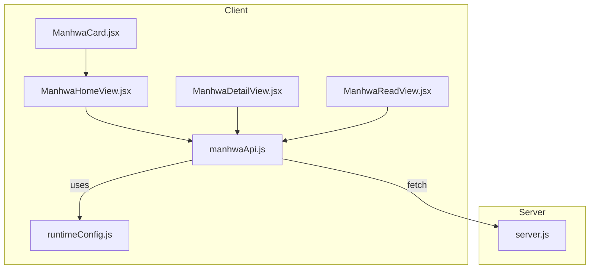
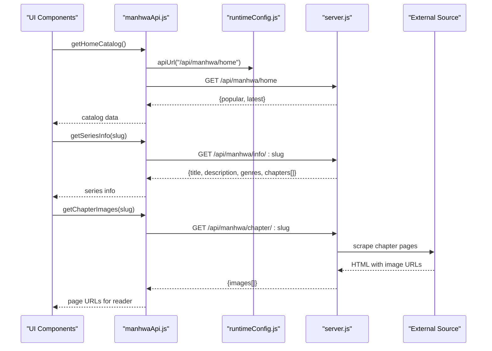
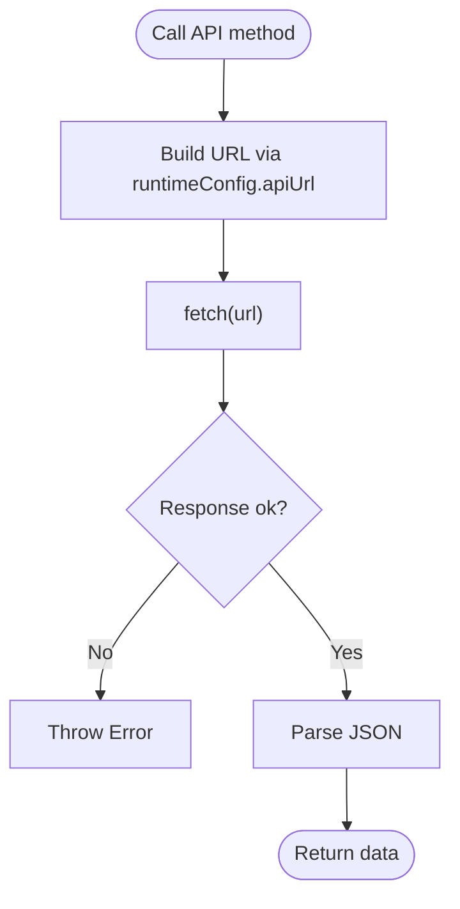
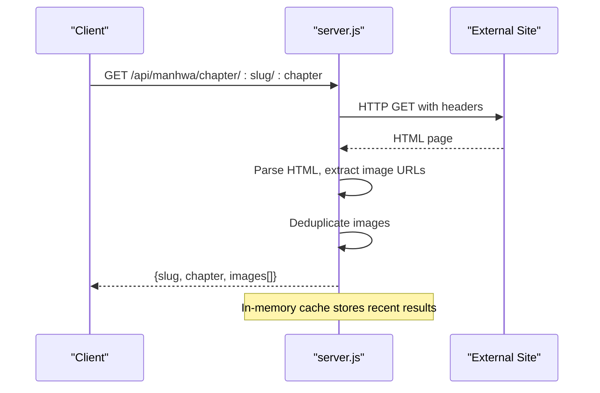
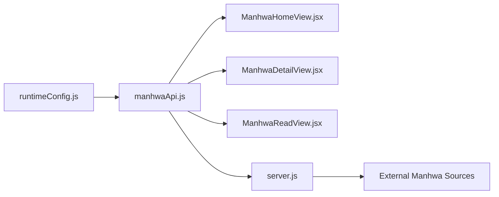

# Manhwa API Integration

<cite>
**Referenced Files in This Document**
- [manhwaApi.js](file://src/features/manhwa/api/manhwaApi.js)
- [runtimeConfig.js](file://src/runtimeConfig.js)
- [server.js](file://server.js)
- [ManhwaHomeView.jsx](file://src/features/manhwa/components/ManhwaHomeView.jsx)
- [ManhwaDetailView.jsx](file://src/features/manhwa/components/ManhwaDetailView.jsx)
- [ManhwaReadView.jsx](file://src/features/manhwa/components/ManhwaReadView.jsx)
- [ManhwaCard.jsx](file://src/features/manhwa/components/ManhwaCard.jsx)
</cite>

## Table of Contents
1. [Introduction](#introduction)
2. [Project Structure](#project-structure)
3. [Core Components](#core-components)
4. [Architecture Overview](#architecture-overview)
5. [Detailed Component Analysis](#detailed-component-analysis)
6. [Dependency Analysis](#dependency-analysis)
7. [Performance Considerations](#performance-considerations)
8. [Troubleshooting Guide](#troubleshooting-guide)
9. [Conclusion](#conclusion)
10. [Appendices](#appendices)

## Introduction
This document explains the Manhwa API integration system that powers Korean webtoon discovery, chapter retrieval, and image loading. It covers how the client-side API module communicates with backend endpoints, how UI components render catalogs, series details, and reading views, and how the server scrapes and serves manhwa content. It also provides guidance for adding new sources, handling different formats, optimizing mobile reading performance, caching chapters offline, and delivering images efficiently.

## Project Structure
The manhwa feature is organized into a thin API client layer and React components for browsing and reading:
- API client: defines methods to call backend routes for catalog, series info, chapter images, and search.
- UI components: home view (catalog), detail view (series metadata and chapters), read view (chapter pages), and card component for listing items.
- Runtime configuration: resolves the base URL for API calls across environments.
- Server: exposes endpoints that scrape external manhwa sources and return structured data to the client.

**Diagram sources**
- [manhwaApi.js:1-28](file://src/features/manhwa/api/manhwaApi.js#L1-L28)
- [runtimeConfig.js:82-153](file://src/runtimeConfig.js#L82-L153)
- [server.js:1657-1687](file://server.js#L1657-L1687)
- [ManhwaHomeView.jsx:1-65](file://src/features/manhwa/components/ManhwaHomeView.jsx#L1-L65)
- [ManhwaDetailView.jsx:1-111](file://src/features/manhwa/components/ManhwaDetailView.jsx#L1-L111)
- [ManhwaReadView.jsx:1-94](file://src/features/manhwa/components/ManhwaReadView.jsx#L1-L94)
- [ManhwaCard.jsx:1-33](file://src/features/manhwa/components/ManhwaCard.jsx#L1-L33)

**Section sources**
- [manhwaApi.js:1-28](file://src/features/manhwa/api/manhwaApi.js#L1-L28)
- [runtimeConfig.js:82-153](file://src/runtimeConfig.js#L82-L153)
- [server.js:1657-1687](file://server.js#L1657-L1687)
- [ManhwaHomeView.jsx:1-65](file://src/features/manhwa/components/ManhwaHomeView.jsx#L1-L65)
- [ManhwaDetailView.jsx:1-111](file://src/features/manhwa/components/ManhwaDetailView.jsx#L1-L111)
- [ManhwaReadView.jsx:1-94](file://src/features/manhwa/components/ManhwaReadView.jsx#L1-L94)
- [ManhwaCard.jsx:1-33](file://src/features/manhwa/components/ManhwaCard.jsx#L1-L33)

## Core Components
- API client (manhwaApi.js):
  - getHomeCatalog: fetches curated manhwa catalog from /api/manhwa/home.
  - getSeriesInfo: retrieves series metadata by slug via /api/manhwa/info/:slug.
  - getChapterImages: loads chapter page URLs via /api/manhwa/chapter/:slug.
  - searchManhwa: searches titles via /api/manhwa/search?q=...
- UI components:
  - ManhwaHomeView: renders hero banner, popular/latest rows, and search results.
  - ManhwaDetailView: shows synopsis, genres, and a paginated chapter list; supports lazy thumbnails.
  - ManhwaReadView: displays vertical chapter pages with navigation and chapter picker.
  - ManhwaCard: displays cover with fallback placeholder on error.
- Runtime config (runtimeConfig.js):
  - Resolves API base URL from query override, runtime endpoint, static config, or environment.
  - Provides apiUrl helper used by the API client.

**Section sources**
- [manhwaApi.js:5-25](file://src/features/manhwa/api/manhwaApi.js#L5-L25)
- [ManhwaHomeView.jsx:6-59](file://src/features/manhwa/components/ManhwaHomeView.jsx#L6-L59)
- [ManhwaDetailView.jsx:4-107](file://src/features/manhwa/components/ManhwaDetailView.jsx#L4-L107)
- [ManhwaReadView.jsx:4-89](file://src/features/manhwa/components/ManhwaReadView.jsx#L4-L89)
- [ManhwaCard.jsx:4-29](file://src/features/manhwa/components/ManhwaCard.jsx#L4-L29)
- [runtimeConfig.js:82-153](file://src/runtimeConfig.js#L82-L153)

## Architecture Overview
The client uses the API client to call backend endpoints. The server scrapes external manhwa sources and returns JSON payloads. Images are served directly from source CDNs; the server may proxy images when needed.

**Diagram sources**
- [manhwaApi.js:6-24](file://src/features/manhwa/api/manhwaApi.js#L6-L24)
- [runtimeConfig.js:149-153](file://src/runtimeConfig.js#L149-L153)
- [server.js:1657-1687](file://server.js#L1657-L1687)

## Detailed Component Analysis

### API Client: manhwaApi.js
- Responsibilities:
  - Build absolute URLs using runtimeConfig.apiUrl.
  - Perform fetch calls for catalog, series info, chapter images, and search.
  - Throw errors on non-OK responses for critical flows; gracefully handle search failures.
- Endpoints:
  - GET /api/manhwa/home
  - GET /api/manhwa/info/:slug
  - GET /api/manhwa/chapter/:slug
  - GET /api/manhwa/search?q=...

**Diagram sources**
- [manhwaApi.js:1-28](file://src/features/manhwa/api/manhwaApi.js#L1-L28)
- [runtimeConfig.js:149-153](file://src/runtimeConfig.js#L149-L153)

**Section sources**
- [manhwaApi.js:1-28](file://src/features/manhwa/api/manhwaApi.js#L1-L28)

### Server: manhwa chapter scraping
- Endpoint:
  - GET /api/manhwa/chapter/:slug/:chapter
- Behavior:
  - Scrapes the target site for chapter pages.
  - Extracts image URLs and deduplicates them.
  - Caches results in-memory for repeated requests.
  - Returns JSON with slug, chapter, and images array.
- Error handling:
  - On failure, returns 502 with an error object.

**Diagram sources**
- [server.js:1657-1687](file://server.js#L1657-L1687)

**Section sources**
- [server.js:1657-1687](file://server.js#L1657-L1687)

### UI: Home View (ManhwaHomeView.jsx)
- Displays:
  - Hero banner from the first popular item.
  - Rows for “Popular Now” and “Latest Updates”.
  - Search results with skeleton loaders while fetching.
- Interactions:
  - Clicking a card navigates to the series detail view.

**Section sources**
- [ManhwaHomeView.jsx:6-59](file://src/features/manhwa/components/ManhwaHomeView.jsx#L6-L59)

### UI: Detail View (ManhwaDetailView.jsx)
- Displays:
  - Series cover, title, genres, synopsis.
  - Chapter list with thumbnails and dates; supports “show all” for large lists.
- Interactions:
  - Opens the reader with the selected chapter.

**Section sources**
- [ManhwaDetailView.jsx:4-107](file://src/features/manhwa/components/ManhwaDetailView.jsx#L4-L107)

### UI: Read View (ManhwaReadView.jsx)
- Displays:
  - Vertical stack of chapter pages with lazy loading.
  - Navigation buttons for previous/next chapters.
  - Chapter picker grid for quick jumps.
- Interactions:
  - Scrolls to top on chapter change.

**Section sources**
- [ManhwaReadView.jsx:4-89](file://src/features/manhwa/components/ManhwaReadView.jsx#L4-L89)

### UI: Card (ManhwaCard.jsx)
- Displays:
  - Cover image with lazy loading.
  - Fallback placeholder if image fails to load.
- Interactions:
  - Triggers series selection.

**Section sources**
- [ManhwaCard.jsx:4-29](file://src/features/manhwa/components/ManhwaCard.jsx#L4-L29)

## Dependency Analysis
- Client dependencies:
  - manhwaApi.js depends on runtimeConfig.apiUrl for base URL resolution.
  - UI components depend on manhwaApi.js for data fetching.
- Server dependencies:
  - server.js scrapes external sites using HTTP clients and HTML parsing.
  - Uses in-memory caches for chapter data.

**Diagram sources**
- [runtimeConfig.js:149-153](file://src/runtimeConfig.js#L149-L153)
- [manhwaApi.js:1-28](file://src/features/manhwa/api/manhwaApi.js#L1-L28)
- [server.js:1657-1687](file://server.js#L1657-L1687)

**Section sources**
- [runtimeConfig.js:82-153](file://src/runtimeConfig.js#L82-L153)
- [manhwaApi.js:1-28](file://src/features/manhwa/api/manhwaApi.js#L1-L28)
- [server.js:1657-1687](file://server.js#L1657-L1687)

## Performance Considerations
- Image loading:
  - Use lazy loading for images in cards and chapter thumbnails to reduce initial payload and improve scroll performance.
  - Prefer serving images through a proxy with appropriate cache headers when hotlink protection is present.
- Network efficiency:
  - Cache chapter image lists server-side to avoid repeated scraping for the same chapter.
  - Use query parameters to bust stale configs only where necessary; avoid unnecessary cache invalidation for images.
- Mobile reading experience:
  - Render long vertical lists with virtualization or pagination to keep memory usage low.
  - Defer heavy operations until user interaction (e.g., open chapter).
- Offline support:
  - Store chapter image lists and last-read positions in local storage or IndexedDB.
  - For fully offline reading, cache page images per chapter with a size limit and eviction policy.

[No sources needed since this section provides general guidance]

## Troubleshooting Guide
- Common issues:
  - Non-OK responses from API: ensure runtimeConfig.base URL is correct and CORS is allowed.
  - Missing images: verify external source availability and consider using the image proxy route.
  - Empty chapter pages: check server logs for scraping errors and confirm the chapter path exists.
- Diagnostics:
  - Inspect network tab for failed requests and response bodies.
  - Verify server-side scraping by testing the endpoint directly.
- Recovery:
  - Retry failed catalog loads with a retry button.
  - Clear cached chapter data if corrupted and reload.

**Section sources**
- [manhwaApi.js:6-24](file://src/features/manhwa/api/manhwaApi.js#L6-L24)
- [server.js:1657-1687](file://server.js#L1657-L1687)

## Conclusion
The manhwa integration combines a lightweight client API with a server that scrapes external sources to deliver structured data and chapter images. The UI provides a smooth reading experience with lazy loading and efficient navigation. By implementing caching, image proxies, and offline strategies, the system can scale to support large catalogs and high-traffic reading sessions.

[No sources needed since this section summarizes without analyzing specific files]

## Appendices

### API Endpoints Reference
- Catalog and Discovery
  - GET /api/manhwa/home
  - GET /api/manhwa/search?q=<query>
- Series Details
  - GET /api/manhwa/info/<slug>
- Chapter Reading
  - GET /api/manhwa/chapter/<slug>/<chapter>

**Section sources**
- [manhwaApi.js:6-24](file://src/features/manhwa/api/manhwaApi.js#L6-L24)
- [server.js:1657-1687](file://server.js#L1657-L1687)

### Adding a New Manhwa Source
Steps:
- Implement a scraper function similar to the existing one: fetch the page, parse HTML, extract image URLs, deduplicate, and cache results.
- Add a new endpoint under /api/manhwa/* that delegates to the scraper.
- Update the client API module to call the new endpoint if needed.
- Test with sample slugs and chapters; verify image rendering and error paths.

**Section sources**
- [server.js:1657-1687](file://server.js#L1657-L1687)
- [manhwaApi.js:16-24](file://src/features/manhwa/api/manhwaApi.js#L16-L24)

### Handling Different Webtoon Formats
- Vertical scrolling:
  - Ensure images are full-height and stacked vertically; use lazy loading to optimize performance.
- Horizontal scrolling:
  - If supporting horizontal panels, implement swipe gestures and snap scrolling.
- Mixed formats:
  - Detect format from metadata or heuristics and switch rendering mode accordingly.

[No sources needed since this section provides general guidance]

### Managing Large Image Assets
- Use a proxy to bypass hotlink restrictions and set cache headers for repeat access.
- Implement image resizing or thumbnail generation for previews.
- Apply compression and modern formats (WebP/AVIF) where supported.

**Section sources**
- [server.js:152-199](file://server.js#L152-L199)

### Offline Chapter Caching Strategy
- Cache chapter metadata and image lists locally.
- Optionally cache page images with a maximum size and LRU eviction.
- Persist last-read position and progress per chapter.

[No sources needed since this section provides general guidance]

### Bandwidth-Efficient Image Delivery
- Serve images via a proxy with appropriate Content-Type and cache control.
- Use conditional requests and ETags where possible.
- Limit concurrent image loads and prioritize visible pages.

**Section sources**
- [server.js:152-199](file://server.js#L152-L199)

### Metadata Services and Ratings
- Integrate with external metadata services to enrich series information (e.g., genres, ratings).
- Map provider IDs to internal identifiers for consistent lookups.
- Display ratings and related series in the detail view.

[No sources needed since this section provides general guidance]