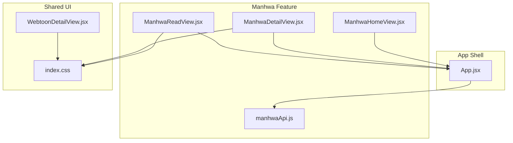
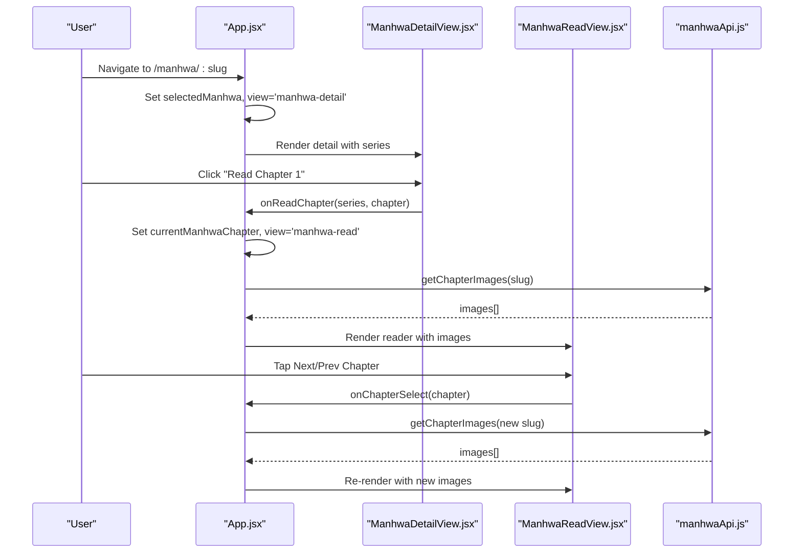
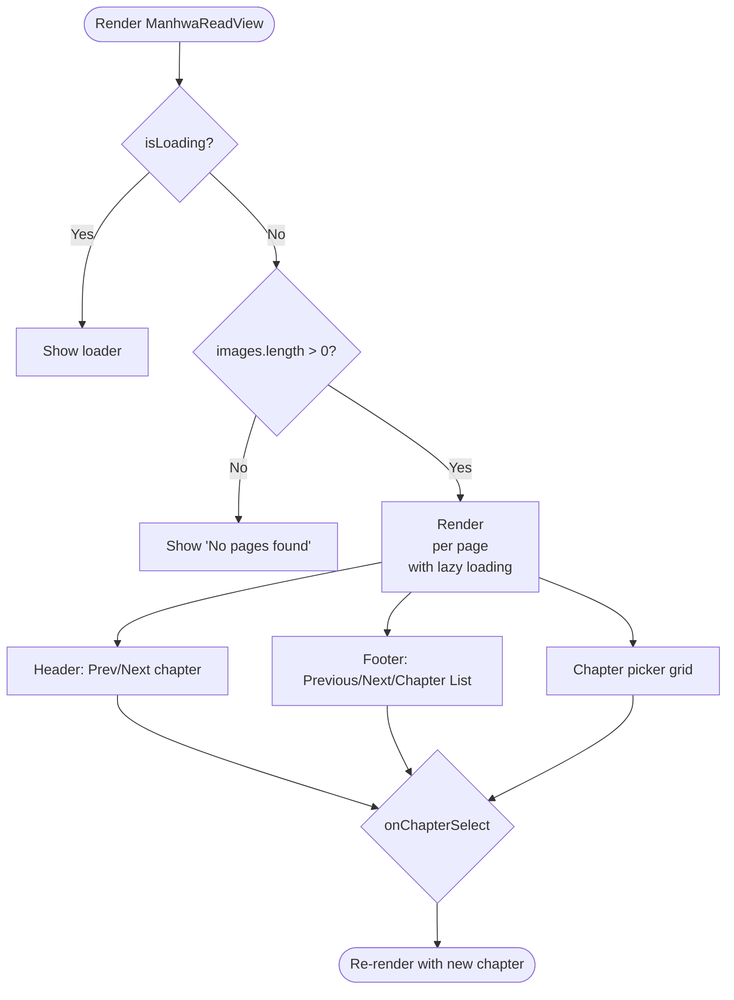
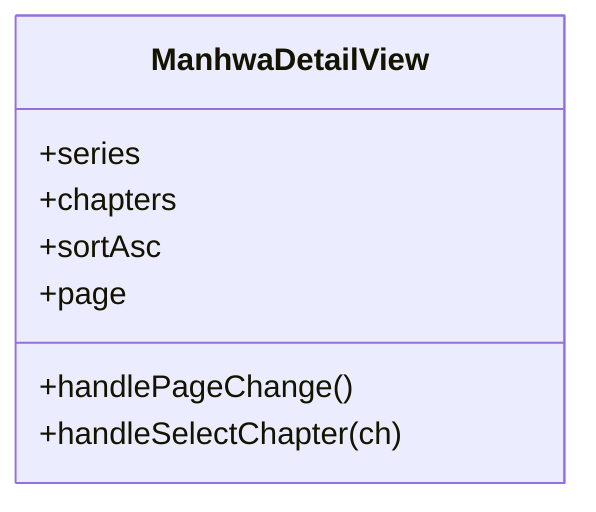
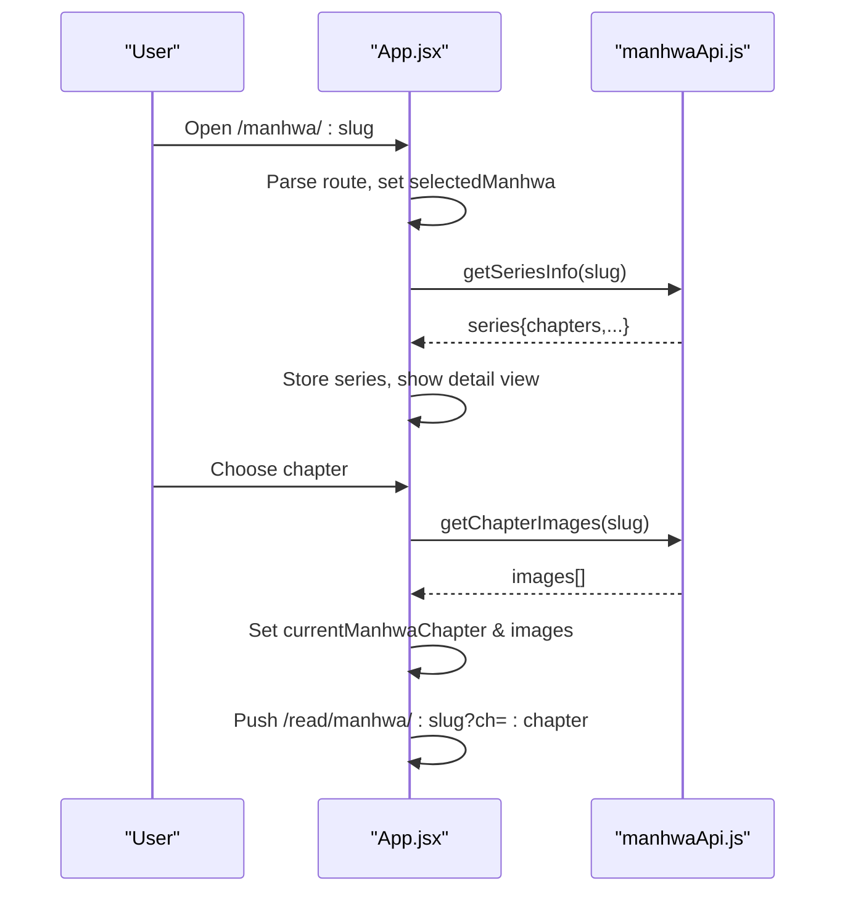
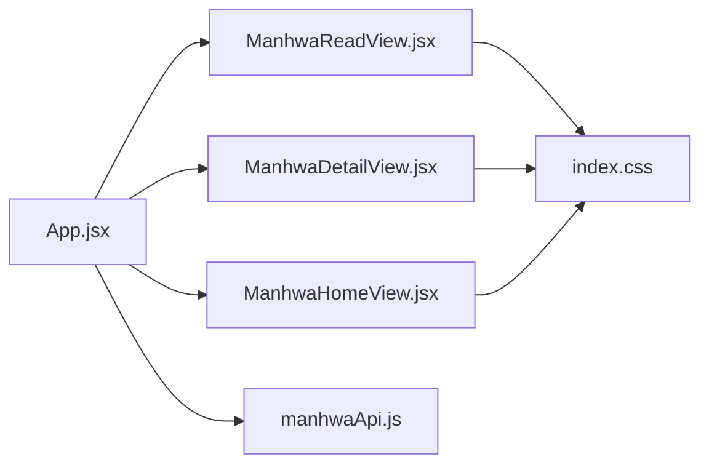

# Manhwa Reader Interface

<cite>
**Referenced Files in This Document**
- [App.jsx](file://src/App.jsx)
- [ManhwaReadView.jsx](file://src/features/manhwa/components/ManhwaReadView.jsx)
- [ManhwaDetailView.jsx](file://src/features/manhwa/components/ManhwaDetailView.jsx)
- [ManhwaHomeView.jsx](file://src/features/manhwa/components/ManhwaHomeView.jsx)
- [manhwaApi.js](file://src/features/manhwa/api/manhwaApi.js)
- [WebtoonDetailView.jsx](file://src/components/WebtoonDetailView.jsx)
- [index.css](file://src/index.css)
</cite>

## Table of Contents
1. Introduction
2. Project Structure
3. Core Components
4. Architecture Overview
5. Detailed Component Analysis
6. Dependency Analysis
7. Performance Considerations
8. Troubleshooting Guide
9. Conclusion
10. Appendices

## Introduction
This document explains the Manhwa Reader Interface implementation for a digital comic reader optimized for vertical scrolling (webtoon format). It covers page management, image loading and caching strategies, memory optimization, touch gesture controls, reading direction settings, bookmarking chapters, tracking reading progress, performance optimizations for smooth scrolling and battery efficiency on mobile devices, accessibility features, device orientation handling, and fullscreen reading modes.

## Project Structure
The manhwa feature is implemented as a set of React components under src/features/manhwa with a dedicated API module and integration into the main application shell. The reader view renders a vertical list of chapter images with navigation between chapters and a chapter picker.

**Diagram sources**
- [App.jsx:177-188](file://src/App.jsx#L177-L188)
- [ManhwaHomeView.jsx:1-65](file://src/features/manhwa/components/ManhwaHomeView.jsx#L1-L65)
- [ManhwaDetailView.jsx:1-111](file://src/features/manhwa/components/ManhwaDetailView.jsx#L1-L111)
- [ManhwaReadView.jsx:1-94](file://src/features/manhwa/components/ManhwaReadView.jsx#L1-L94)
- [manhwaApi.js:1-29](file://src/features/manhwa/api/manhwaApi.js#L1-L29)
- [WebtoonDetailView.jsx:1-335](file://src/components/WebtoonDetailView.jsx#L1-L335)
- [index.css:5532-5630](file://src/index.css#L5532-L5630)

**Section sources**
- [App.jsx:177-188](file://src/App.jsx#L177-L188)
- [ManhwaHomeView.jsx:1-65](file://src/features/manhwa/components/ManhwaHomeView.jsx#L1-L65)
- [ManhwaDetailView.jsx:1-111](file://src/features/manhwa/components/ManhwaDetailView.jsx#L1-L111)
- [ManhwaReadView.jsx:1-94](file://src/features/manhwa/components/ManhwaReadView.jsx#L1-L94)
- [manhwaApi.js:1-29](file://src/features/manhwa/api/manhwaApi.js#L1-L29)
- [WebtoonDetailView.jsx:1-335](file://src/components/WebtoonDetailView.jsx#L1-L335)
- [index.css:5532-5630](file://src/index.css#L5532-L5630)

## Core Components
- ManhwaHomeView: Displays popular/latest rows and hero banner; navigates to detail or read views.
- ManhwaDetailView: Shows series metadata, synopsis, and a paginated chapter list; supports sorting and “Read Chapter 1”.
- ManhwaReadView: Renders chapter pages vertically with top/bottom navigation and a chapter picker grid.
- App.jsx: Orchestrates state for selected manhwa, current chapter, chapter images, loading flags, and URL routing for manhwa-detail and manhwa-read.
- manhwaApi.js: Provides functions to fetch home catalog, series info, chapter images, and search results.

Key responsibilities:
- Data fetching and error handling are centralized in App.jsx effects and the API module.
- Navigation uses browser history push/replace for clean URLs and back/forward support.
- Image rendering uses lazy loading attributes to defer offscreen images.

**Section sources**
- [ManhwaHomeView.jsx:1-65](file://src/features/manhwa/components/ManhwaHomeView.jsx#L1-L65)
- [ManhwaDetailView.jsx:1-111](file://src/features/manhwa/components/ManhwaDetailView.jsx#L1-L111)
- [ManhwaReadView.jsx:1-94](file://src/features/manhwa/components/ManhwaReadView.jsx#L1-L94)
- [manhwaApi.js:1-29](file://src/features/manhwa/api/manhwaApi.js#L1-L29)
- [App.jsx:177-188](file://src/App.jsx#L177-L188)

## Architecture Overview
The reader follows a unidirectional data flow:
- User navigates from Home to Detail to Read via App.jsx state and URL routing.
- App.jsx manages selected series, current chapter, and chapter images fetched through manhwaApi.
- ManhwaReadView renders images and provides chapter navigation; it relies on props passed from App.jsx.

**Diagram sources**
- [App.jsx:398-404](file://src/App.jsx#L398-L404)
- [App.jsx:578-582](file://src/App.jsx#L578-L582)
- [ManhwaDetailView.jsx:30-38](file://src/features/manhwa/components/ManhwaDetailView.jsx#L30-L38)
- [ManhwaReadView.jsx:10-70](file://src/features/manhwa/components/ManhwaReadView.jsx#L10-L70)
- [manhwaApi.js:16-19](file://src/features/manhwa/api/manhwaApi.js#L16-L19)

## Detailed Component Analysis

### ManhwaReadView
- Vertical scroll layout for webtoon pages using a container that stacks images.
- Top header shows chapter number and prev/next buttons; bottom footer provides quick navigation and chapter list access.
- Images use native lazy loading to reduce initial bandwidth and memory pressure.
- Chapter picker allows jumping to any chapter; selection scrolls to top.

**Diagram sources**
- [ManhwaReadView.jsx:10-70](file://src/features/manhwa/components/ManhwaReadView.jsx#L10-L70)

**Section sources**
- [ManhwaReadView.jsx:10-70](file://src/features/manhwa/components/ManhwaReadView.jsx#L10-L70)

### ManhwaDetailView
- Presents series cover, genres, synopsis, and a chapter list with pagination and sort toggle (oldest/newest first).
- Supports “Read Chapter 1” CTA and row-level click to start reading.
- Uses skeleton placeholders during loading to avoid layout shifts.

**Diagram sources**
- [ManhwaDetailView.jsx:1-111](file://src/features/manhwa/components/ManhwaDetailView.jsx#L1-L111)

**Section sources**
- [ManhwaDetailView.jsx:1-111](file://src/features/manhwa/components/ManhwaDetailView.jsx#L1-L111)

### App.jsx Integration and State Management
- Maintains selectedManhwa, currentManhwaChapter, manhwaChapterImages, and loading flags.
- Routes to /manhwa/:slug and /read/manhwa/:slug?ch=:chapter with push/replace based on context.
- Loads manhwa home data when entering the manhwa section and handles errors gracefully.

**Diagram sources**
- [App.jsx:578-582](file://src/App.jsx#L578-L582)
- [App.jsx:398-404](file://src/App.jsx#L398-L404)
- [manhwaApi.js:11-19](file://src/features/manhwa/api/manhwaApi.js#L11-L19)

**Section sources**
- [App.jsx:177-188](file://src/App.jsx#L177-L188)
- [App.jsx:398-404](file://src/App.jsx#L398-L404)
- [App.jsx:578-582](file://src/App.jsx#L578-L582)

### WebtoonDetailView (Related Reference)
- Demonstrates robust pagination, sorting, and skeleton UI patterns applicable to manhwa detail experiences.
- Includes image error fallbacks and responsive layout considerations.

**Section sources**
- [WebtoonDetailView.jsx:1-335](file://src/components/WebtoonDetailView.jsx#L1-L335)

## Dependency Analysis
- ManhwaReadView depends on props provided by App.jsx (series, chapter, images, isLoading, callbacks).
- App.jsx depends on manhwaApi for data retrieval and on index.css for styling.
- ManhwaDetailView and ManhwaHomeView depend on App.jsx for navigation and data.

**Diagram sources**
- [App.jsx:177-188](file://src/App.jsx#L177-L188)
- [ManhwaReadView.jsx:1-94](file://src/features/manhwa/components/ManhwaReadView.jsx#L1-L94)
- [ManhwaDetailView.jsx:1-111](file://src/features/manhwa/components/ManhwaDetailView.jsx#L1-L111)
- [ManhwaHomeView.jsx:1-65](file://src/features/manhwa/components/ManhwaHomeView.jsx#L1-L65)
- [manhwaApi.js:1-29](file://src/features/manhwa/api/manhwaApi.js#L1-L29)
- [index.css:5532-5630](file://src/index.css#L5532-L5630)

**Section sources**
- [App.jsx:177-188](file://src/App.jsx#L177-L188)
- [manhwaApi.js:1-29](file://src/features/manhwa/api/manhwaApi.js#L1-L29)
- [index.css:5532-5630](file://src/index.css#L5532-L5630)

## Performance Considerations
- Lazy Loading: Images in the reader use native lazy loading to defer offscreen image requests, reducing initial load time and memory usage.
- Minimal DOM: The reader renders only visible images plus those near viewport due to lazy loading behavior.
- Pagination in Detail View: Chapter lists are paginated to limit DOM size and improve responsiveness.
- Skeleton UI: Placeholders prevent layout shifts while content loads, improving perceived performance.
- Network Efficiency: API calls are triggered on demand (when navigating to detail/read), avoiding unnecessary requests.

Recommendations for further optimization:
- Implement an in-memory image cache keyed by chapter and page index to avoid re-downloading images when navigating back/forth within the same chapter.
- Use IntersectionObserver to preload adjacent pages just before they enter the viewport for smoother scrolling.
- Debounce rapid chapter switches to prevent redundant network requests.
- Compress images server-side and serve appropriate resolutions based on device pixel ratio.

[No sources needed since this section provides general guidance]

## Troubleshooting Guide
Common issues and mitigations:
- No pages found: Reader displays an empty state when images array is empty; verify API response and chapter slug mapping.
- Image load failures: Ensure proper error handling at the image level; consider retry logic or fallback placeholders.
- Navigation not updating URL: Confirm that App.jsx pushes/replaces correct routes for manhwa-detail and manhwa-read.
- Slow initial load: Validate lazy loading attributes and ensure large images are not forced into initial render.

**Section sources**
- [ManhwaReadView.jsx:31-50](file://src/features/manhwa/components/ManhwaReadView.jsx#L31-L50)
- [App.jsx:398-404](file://src/App.jsx#L398-L404)

## Conclusion
The Manhwa Reader Interface provides a vertical-scrolling webtoon experience with clear navigation, chapter selection, and basic performance optimizations like lazy loading and pagination. App.jsx centralizes state and routing, while the API layer encapsulates data fetching. To enhance the reader further, consider implementing an image cache, preloading strategies, advanced gesture controls, and expanded accessibility features.

[No sources needed since this section summarizes without analyzing specific files]

## Appendices

### Touch Gesture Controls and Reading Direction
- Current implementation: Chapter navigation via buttons; no built-in swipe gestures or zoom.
- Suggested enhancements:
  - Swipe left/right to navigate chapters; long press to open chapter picker.
  - Pinch-to-zoom with a constrained scale range for readability.
  - Toggle reading direction (LTR/RTL) to accommodate different content layouts.

[No sources needed since this section proposes enhancements not present in code]

### Bookmarking Chapters and Tracking Reading Progress
- Current implementation: No explicit bookmarking or progress persistence for manhwa chapters.
- Suggested approach:
  - Persist last-read chapter per series in localStorage or cloud storage.
  - Provide a “Bookmark” action to mark favorite chapters.
  - Display a progress indicator in the chapter list.

[No sources needed since this section proposes enhancements not present in code]

### Accessibility Features
- Keyboard navigation: Add focusable elements for chapter buttons and images; implement keyboard shortcuts (e.g., arrow keys for next/previous chapter).
- Screen reader support: Ensure alt text for images and descriptive labels for navigation controls.
- High contrast mode: Leverage CSS variables and media queries to support system high contrast preferences.

[No sources needed since this section proposes enhancements not present in code]

### Device Orientation and Fullscreen Reading
- Current implementation: No explicit fullscreen mode or orientation change handlers for the reader.
- Suggested enhancements:
  - Detect orientation changes to adjust layout (e.g., single-column vs. two-column).
  - Provide a fullscreen toggle to maximize reading area and hide chrome.

[No sources needed since this section proposes enhancements not present in code]