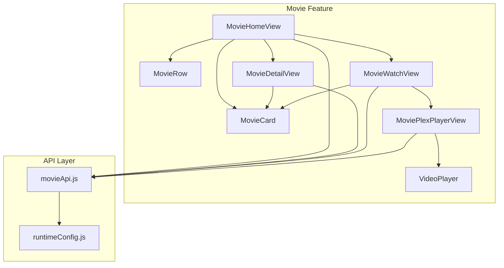
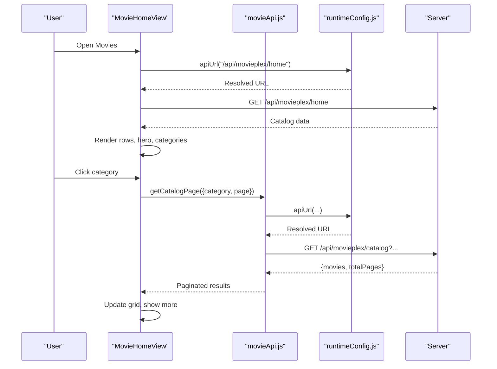
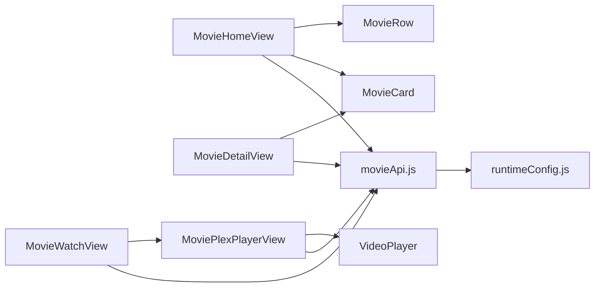

# Movie Collection

<cite>
**Referenced Files in This Document**
- [movieApi.js](file://src/features/movie/api/movieApi.js)
- [MovieHomeView.jsx](file://src/features/movie/components/MovieHomeView.jsx)
- [MovieDetailView.jsx](file://src/features/movie/components/MovieDetailView.jsx)
- [MovieWatchView.jsx](file://src/features/movie/components/MovieWatchView.jsx)
- [MoviePlexPlayerView.jsx](file://src/features/movie/components/MoviePlexPlayerView.jsx)
- [VideoPlayer.jsx](file://src/components/VideoPlayer.jsx)
- [MovieRow.jsx](file://src/features/movie/components/MovieRow.jsx)
- [MovieCard.jsx](file://src/features/movie/components/MovieCard.jsx)
- [runtimeConfig.js](file://src/runtimeConfig.js)
- [App.jsx](file://src/App.jsx)
</cite>

## Table of Contents
1. Introduction
2. Project Structure
3. Core Components
4. Architecture Overview
5. Detailed Component Analysis
6. Dependency Analysis
7. Performance Considerations
8. Troubleshooting Guide
9. Conclusion
10. Appendices

## Introduction
This document explains the Movie Collection system within Project Anime. It covers movie metadata management, categorization and browsing, streaming integration with quality selection and playback controls, the movie detail view (synopsis, genres, recommendations), watch view with progress tracking and resume capabilities, and the horizontal row component for scrolling displays. It also provides guidance on adding new sources, implementing custom categories, extending metadata fields, optimizing images, lazy loading strategies, and responsive design for posters and banners.

## Project Structure
The Movie feature is organized under src/features/movie with a clear separation between API access and UI components:
- API layer: centralized endpoints for catalog, search, and post info
- Views: home, detail, watch, and Plex player views
- Shared components: card and row for consistent presentation
- Runtime configuration: dynamic API base resolution for different environments

**Diagram sources**
- [MovieHomeView.jsx:1-608](file://src/features/movie/components/MovieHomeView.jsx#L1-L608)
- [MovieDetailView.jsx:1-213](file://src/features/movie/components/MovieDetailView.jsx#L1-L213)
- [MovieWatchView.jsx:1-250](file://src/features/movie/components/MovieWatchView.jsx#L1-L250)
- [MoviePlexPlayerView.jsx:1-247](file://src/features/movie/components/MoviePlexPlayerView.jsx#L1-L247)
- [VideoPlayer.jsx:1-800](file://src/components/VideoPlayer.jsx#L1-L800)
- [movieApi.js:1-32](file://src/features/movie/api/movieApi.js#L1-L32)
- [runtimeConfig.js:1-163](file://src/runtimeConfig.js#L1-L163)

**Section sources**
- [MovieHomeView.jsx:1-608](file://src/features/movie/components/MovieHomeView.jsx#L1-L608)
- [movieApi.js:1-32](file://src/features/movie/api/movieApi.js#L1-L32)
- [runtimeConfig.js:1-163](file://src/runtimeConfig.js#L1-L163)

## Core Components
- MovieHomeView: Home page with hero carousel, category pills, horizontal rows, and paginated category grid. Supports search and admin-driven Random Picks via Supabase.
- MovieDetailView: Detail page with cleaned title display, synopsis, metadata sidebar, and “More Like This” recommendations.
- MovieWatchView: Watch page that either delegates to MoviePlexPlayerView or renders an embedded server selector with progress callbacks.
- MoviePlexPlayerView: HLS-based player with fallback iframe, server switching, and recommendation grid below the player.
- VideoPlayer: Full-featured player with HLS support, quality/audio track selection, CC, fullscreen/PiP, keyboard shortcuts, scrubbing preview, and AniSkip integration.
- MovieRow: Horizontal scrollable row with chevron navigation and limited item rendering for performance.
- MovieCard: Poster tile with lazy loading, gradient placeholder, hover overlay, rating badge, and on-demand poster fetch fallback.
- movieApi.js: Centralized fetch wrappers for catalog, search, and post-info endpoints.
- runtimeConfig.js: Dynamic API base resolution across environments and Capacitor builds.

**Section sources**
- [MovieHomeView.jsx:1-608](file://src/features/movie/components/MovieHomeView.jsx#L1-L608)
- [MovieDetailView.jsx:1-213](file://src/features/movie/components/MovieDetailView.jsx#L1-L213)
- [MovieWatchView.jsx:1-250](file://src/features/movie/components/MovieWatchView.jsx#L1-L250)
- [MoviePlexPlayerView.jsx:1-247](file://src/features/movie/components/MoviePlexPlayerView.jsx#L1-L247)
- [VideoPlayer.jsx:1-800](file://src/components/VideoPlayer.jsx#L1-L800)
- [MovieRow.jsx:1-73](file://src/features/movie/components/MovieRow.jsx#L1-L73)
- [MovieCard.jsx:1-166](file://src/features/movie/components/MovieCard.jsx#L1-L166)
- [movieApi.js:1-32](file://src/features/movie/api/movieApi.js#L1-L32)
- [runtimeConfig.js:1-163](file://src/runtimeConfig.js#L1-L163)

## Architecture Overview
The Movie Collection uses a layered approach:
- UI layer: React components render catalogs, details, and players
- API layer: movieApi.js encapsulates HTTP calls using runtime-configured base URLs
- Player layer: VideoPlayer handles HLS streams; MoviePlexPlayerView orchestrates stream resolution and fallbacks
- Data persistence: Supabase used for Random Picks and app-wide session restoration

**Diagram sources**
- [MovieHomeView.jsx:1-608](file://src/features/movie/components/MovieHomeView.jsx#L1-L608)
- [movieApi.js:1-32](file://src/features/movie/api/movieApi.js#L1-L32)
- [runtimeConfig.js:1-163](file://src/runtimeConfig.js#L1-L163)

## Detailed Component Analysis

### MovieHomeView
Responsibilities:
- Hero carousel auto-rotation from trending/web series/bollywood pools
- Category pills mapping to backend category IDs and 18+ flag
- Horizontal rows for curated lists
- Paginated category grid with load-more behavior
- Admin-only developer mode to select movies and push to Random Picks stored in Supabase
- Search results grid and skeleton loaders

Key behaviors:
- Uses runtimeConfig.apiUrl to call catalog endpoints
- Filters out pushed picks from 18+ view
- Realtime updates for Random Picks via Supabase channel

**Section sources**
- [MovieHomeView.jsx:1-608](file://src/features/movie/components/MovieHomeView.jsx#L1-L608)

### MovieDetailView
Responsibilities:
- Cleaned display title by stripping noise words and tags
- Synopsis and metadata sidebar (audio/dubbing, genres, quality/format)
- Action buttons (Play, Add to My List)
- Fetches “More Like This” recommendations and renders them as cards

Key behaviors:
- Uses runtimeConfig.apiUrl to fetch recommendations
- Renders MovieCard for related items

**Section sources**
- [MovieDetailView.jsx:1-213](file://src/features/movie/components/MovieDetailView.jsx#L1-L213)

### MovieWatchView
Responsibilities:
- Delegates to MoviePlexPlayerView when source indicates MoviePlex
- For non-MoviePlex items, resolves TMDB/IMDb identifiers and renders multiple embedded servers
- Progress callback interval to simulate progress reporting

Key behaviors:
- Server selector UI with pill-style buttons
- Displays movie info block and currently watching tag

**Section sources**
- [MovieWatchView.jsx:1-250](file://src/features/movie/components/MovieWatchView.jsx#L1-L250)

### MoviePlexPlayerView
Responsibilities:
- Fetches post-info and stream data by slug
- Renders HLS player via VideoPlayer when available; otherwise falls back to external iframe
- Provides server/source switcher and error states
- Shows “More Movies to Watch” recommendations

Key behaviors:
- Detects HLS streams and sets useFallback based on source type
- Handles extraction failures gracefully

**Section sources**
- [MoviePlexPlayerView.jsx:1-247](file://src/features/movie/components/MoviePlexPlayerView.jsx#L1-L247)

### VideoPlayer
Responsibilities:
- HLS initialization with hls.js, native HLS fallback, and direct MP4 support
- Quality levels discovery and switching
- Audio track detection and preferred language selection
- Subtitles (CC) toggle
- Fullscreen and Picture-in-Picture
- Keyboard shortcuts and touch gestures (double-tap seek)
- Timeline scrubbing with preview tooltip
- AniSkip integration for intro/end skipping
- Progress reporting via onProgress callback

Key behaviors:
- Robust error recovery for network/media errors
- Auto-select audio track based on preference
- Persistent seek step setting in localStorage

**Section sources**
- [VideoPlayer.jsx:1-800](file://src/components/VideoPlayer.jsx#L1-L800)

### MovieRow
Responsibilities:
- Horizontal scrolling container with left/right chevrons
- Limits rendered items to improve performance
- Hover-triggered navigation controls

**Section sources**
- [MovieRow.jsx:1-73](file://src/features/movie/components/MovieRow.jsx#L1-L73)

### MovieCard
Responsibilities:
- Lazy image loading with aspect ratio preservation
- Gradient placeholder with initial letter and title
- On-demand poster fetch fallback if primary image fails
- Rating badge and hover overlay

**Section sources**
- [MovieCard.jsx:1-166](file://src/features/movie/components/MovieCard.jsx#L1-L166)

### API and Configuration
- movieApi.js: Wraps fetch calls for home catalog, paginated catalog, post-info, and search
- runtimeConfig.js: Resolves API base from query param, runtime endpoint, static config, build-time env, and local dev defaults; supports Capacitor fallback tunnel

**Section sources**
- [movieApi.js:1-32](file://src/features/movie/api/movieApi.js#L1-L32)
- [runtimeConfig.js:1-163](file://src/runtimeConfig.js#L1-L163)

## Dependency Analysis
High-level dependencies:
- MovieHomeView depends on MovieRow, MovieCard, movieApi, runtimeConfig
- MovieDetailView depends on MovieCard and runtimeConfig
- MovieWatchView depends on MoviePlexPlayerView and runtimeConfig
- MoviePlexPlayerView depends on VideoPlayer and runtimeConfig
- VideoPlayer depends on hls.js and browser APIs
- All components rely on runtimeConfig.apiUrl for consistent endpoint resolution

**Diagram sources**
- [MovieHomeView.jsx:1-608](file://src/features/movie/components/MovieHomeView.jsx#L1-L608)
- [MovieDetailView.jsx:1-213](file://src/features/movie/components/MovieDetailView.jsx#L1-L213)
- [MovieWatchView.jsx:1-250](file://src/features/movie/components/MovieWatchView.jsx#L1-L250)
- [MoviePlexPlayerView.jsx:1-247](file://src/features/movie/components/MoviePlexPlayerView.jsx#L1-L247)
- [VideoPlayer.jsx:1-800](file://src/components/VideoPlayer.jsx#L1-L800)
- [movieApi.js:1-32](file://src/features/movie/api/movieApi.js#L1-L32)
- [runtimeConfig.js:1-163](file://src/runtimeConfig.js#L1-L163)

**Section sources**
- [App.jsx:1-800](file://src/App.jsx#L1-L800)

## Performance Considerations
- Image optimization and lazy loading:
  - Use loading="lazy" on poster images
  - Provide gradient placeholders to avoid layout shifts
  - On-demand poster fetch fallback when primary image fails
- Pagination and virtualization:
  - Paginate category grids with load-more to handle large catalogs
  - Limit row rendering to a fixed number of items for smooth scrolling
- Streaming performance:
  - Prefer HLS for adaptive bitrate streaming
  - Enable hls.js worker and retry policies for resilience
  - Provide fallback iframe when HLS extraction fails
- Responsive design:
  - Use clamp() and aspect-ratio for fluid layouts
  - Ensure touch-friendly controls and double-tap gestures on mobile
  - Fullscreen and PiP support for immersive viewing

[No sources needed since this section provides general guidance]

## Troubleshooting Guide
Common issues and resolutions:
- Stream unavailable:
  - Check extraction status and switch to external player if HLS fails
  - Verify CORS and network connectivity for HLS manifests
- No playable source:
  - Validate that streamUrl is provided and supported by the browser
  - Confirm HLS support or provide alternative formats
- Images not loading:
  - Ensure fallback poster fetch is triggered on error
  - Verify correct slug and post-info endpoint availability
- Category pagination not working:
  - Confirm category ID mapping and is18 flag usage
  - Validate server response structure for movies and totalPages

**Section sources**
- [MoviePlexPlayerView.jsx:1-247](file://src/features/movie/components/MoviePlexPlayerView.jsx#L1-L247)
- [VideoPlayer.jsx:1-800](file://src/components/VideoPlayer.jsx#L1-L800)
- [MovieHomeView.jsx:1-608](file://src/features/movie/components/MovieHomeView.jsx#L1-L608)

## Conclusion
The Movie Collection system provides a robust, scalable foundation for browsing, detailing, and streaming movies. It integrates HLS-based playback with quality and audio track selection, offers rich metadata and recommendations, and supports both embedded and external players. The modular architecture enables easy extension for new sources, categories, and metadata fields while maintaining performance and responsiveness.

[No sources needed since this section summarizes without analyzing specific files]

## Appendices

### Adding New Movie Sources
Steps:
- Extend MovieWatchView to detect new source types and route accordingly
- If integrating HLS, ensure streamUrl and isM3U8 flags are set for VideoPlayer
- For embedded players, add a new server entry with getUrl logic
- Test fallback behavior and error handling paths

**Section sources**
- [MovieWatchView.jsx:1-250](file://src/features/movie/components/MovieWatchView.jsx#L1-L250)
- [VideoPlayer.jsx:1-800](file://src/components/VideoPlayer.jsx#L1-L800)

### Implementing Custom Categories
Steps:
- Define category mapping in MovieHomeView’s CAT_MAP with id and optional is18 flag
- Ensure backend supports the category parameter and returns appropriate movies
- Add UI pill and routing logic to trigger paginated catalog fetch

**Section sources**
- [MovieHomeView.jsx:1-608](file://src/features/movie/components/MovieHomeView.jsx#L1-L608)
- [movieApi.js:1-32](file://src/features/movie/api/movieApi.js#L1-L32)

### Extending Movie Metadata Fields
Guidance:
- Update MovieDetailView to display new fields in the metadata sidebar
- Adjust cleanMovieDisplayTitle if necessary to preserve meaningful parts
- Ensure backend includes extended fields in catalog and post-info responses

**Section sources**
- [MovieDetailView.jsx:1-213](file://src/features/movie/components/MovieDetailView.jsx#L1-L213)

### Image Optimization and Lazy Loading Strategies
Recommendations:
- Use lazy loading for posters and banners
- Provide high-quality fallbacks and gradient placeholders
- Implement on-demand poster fetch on error to reduce initial payload
- Optimize banner images for hero sections with appropriate sizing and compression

**Section sources**
- [MovieCard.jsx:1-166](file://src/features/movie/components/MovieCard.jsx#L1-L166)
- [MovieHomeView.jsx:1-608](file://src/features/movie/components/MovieHomeView.jsx#L1-L608)

### Responsive Design Considerations
Best practices:
- Use fluid typography and spacing with clamp()
- Maintain aspect ratios for media containers
- Ensure touch interactions are intuitive (double-tap seek, swipe gestures)
- Support fullscreen and PiP for better immersion on mobile devices

**Section sources**
- [VideoPlayer.jsx:1-800](file://src/components/VideoPlayer.jsx#L1-L800)
- [MovieHomeView.jsx:1-608](file://src/features/movie/components/MovieHomeView.jsx#L1-L608)