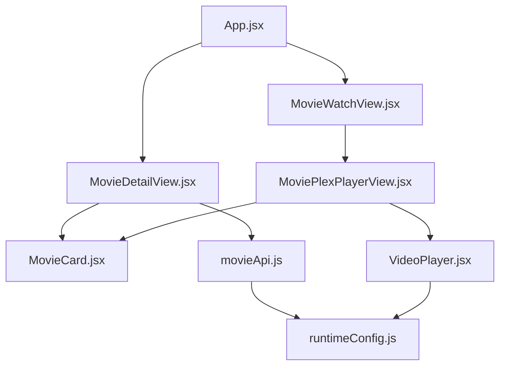
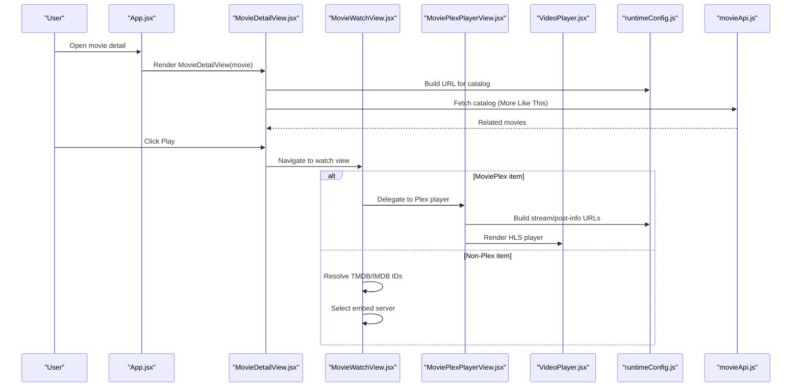
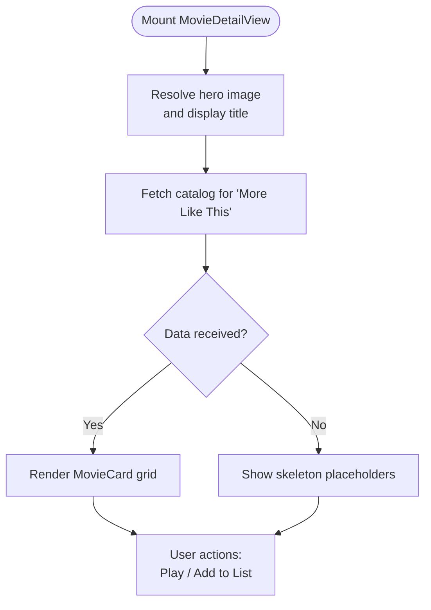
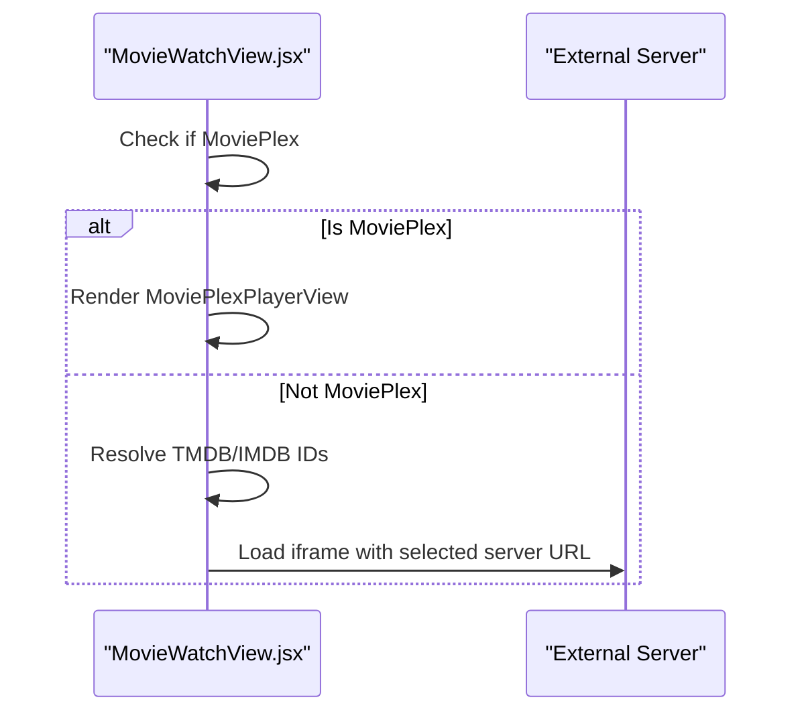
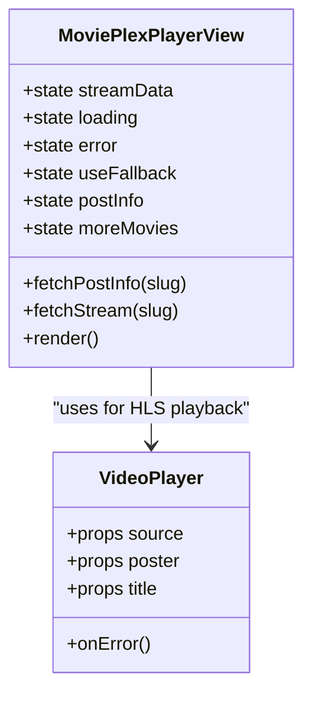
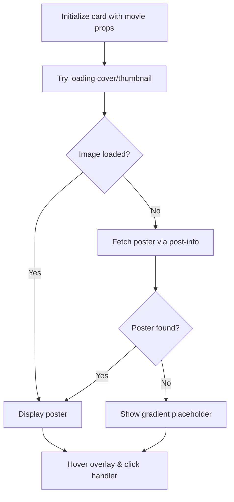
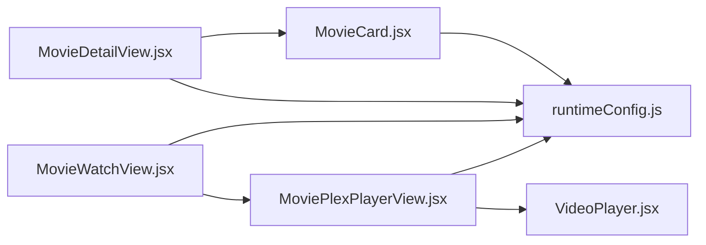

# Movie Detail View

<cite>
**Referenced Files in This Document**
- [MovieDetailView.jsx](file://src/features/movie/components/MovieDetailView.jsx)
- [MovieWatchView.jsx](file://src/features/movie/components/MovieWatchView.jsx)
- [MoviePlexPlayerView.jsx](file://src/features/movie/components/MoviePlexPlayerView.jsx)
- [MovieCard.jsx](file://src/features/movie/components/MovieCard.jsx)
- [movieApi.js](file://src/features/movie/api/movieApi.js)
- [VideoPlayer.jsx](file://src/components/VideoPlayer.jsx)
- [runtimeConfig.js](file://src/runtimeConfig.js)
- [App.jsx](file://src/App.jsx)
</cite>

## Table of Contents
1. [Introduction](#introduction)
2. [Project Structure](#project-structure)
3. [Core Components](#core-components)
4. [Architecture Overview](#architecture-overview)
5. [Detailed Component Analysis](#detailed-component-analysis)
6. [Dependency Analysis](#dependency-analysis)
7. [Performance Considerations](#performance-considerations)
8. [Troubleshooting Guide](#troubleshooting-guide)
9. [Conclusion](#conclusion)
10. [Appendices](#appendices)

## Introduction
This document explains the Movie Detail View component and its surrounding ecosystem for displaying comprehensive movie information, enabling streaming quality selection, handling series navigation patterns, recommending related movies, and supporting user interactions such as adding to a watchlist or sharing. It also covers image optimization for posters and banners, responsive design considerations, and performance strategies for loading detailed movie data efficiently.

## Project Structure
The movie detail experience is implemented across several components and utilities:
- MovieDetailView: Displays hero banner, synopsis, metadata, ratings, and “More Like This” recommendations.
- MovieWatchView: Handles playback via external embed servers or delegates to MoviePlexPlayerView for native HLS streams.
- MoviePlexPlayerView: Renders HLS player with server switching and fallbacks, plus below-player recommendations.
- MovieCard: Reusable tile used in recommendation grids and home rows.
- movieApi: Centralized API helpers for fetching catalogs and movie info.
- VideoPlayer: Custom HLS-capable player with quality controls and error handling.
- runtimeConfig: Resolves API base URLs for all backend calls.
- App.jsx: Orchestrates routing and view state for movies (including detail and watch views).

**Diagram sources**
- [App.jsx:31-36](file://src/App.jsx#L31-L36)
- [MovieDetailView.jsx:1-6](file://src/features/movie/components/MovieDetailView.jsx#L1-L6)
- [MovieWatchView.jsx:1-5](file://src/features/movie/components/MovieWatchView.jsx#L1-L5)
- [MoviePlexPlayerView.jsx:1-5](file://src/features/movie/components/MoviePlexPlayerView.jsx#L1-L5)
- [MovieCard.jsx:1-3](file://src/features/movie/components/MovieCard.jsx#L1-L3)
- [movieApi.js:1-3](file://src/features/movie/api/movieApi.js#L1-L3)
- [VideoPlayer.jsx:1-3](file://src/components/VideoPlayer.jsx#L1-L3)
- [runtimeConfig.js:149-153](file://src/runtimeConfig.js#L149-L153)

**Section sources**
- [App.jsx:31-36](file://src/App.jsx#L31-L36)
- [MovieDetailView.jsx:1-6](file://src/features/movie/components/MovieDetailView.jsx#L1-L6)
- [MovieWatchView.jsx:1-5](file://src/features/movie/components/MovieWatchView.jsx#L1-L5)
- [MoviePlexPlayerView.jsx:1-5](file://src/features/movie/components/MoviePlexPlayerView.jsx#L1-L5)
- [MovieCard.jsx:1-3](file://src/features/movie/components/MovieCard.jsx#L1-L3)
- [movieApi.js:1-3](file://src/features/movie/api/movieApi.js#L1-L3)
- [VideoPlayer.jsx:1-3](file://src/components/VideoPlayer.jsx#L1-L3)
- [runtimeConfig.js:149-153](file://src/runtimeConfig.js#L149-L153)

## Core Components
- MovieDetailView: Presents a full-bleed hero with title, badges (quality, rating), synopsis, metadata sidebar (audio/dubbing, genres, format), and a “More Like This” grid fetched from the catalog endpoint. Includes a watchlist toggle and a Play action that navigates to the watch view.
- MovieWatchView: For non-MoviePlex items, resolves TMDB IDs and renders multiple external embed servers; for MoviePlex items, delegates to MoviePlexPlayerView.
- MoviePlexPlayerView: Loads stream data and post info by slug, supports HLS playback with a custom player, provides server/source switching, and shows recommendations below the player.
- MovieCard: Displays poster/thumbnail with lazy loading, error fallback to fetch poster on demand, gradient placeholder, hover overlay, and rating badge.
- movieApi: Provides methods to fetch home catalog, paginated catalog pages, movie info by slug, and search results.
- VideoPlayer: HLS-capable player with quality levels, audio tracks, skip intro/outro, and robust error states.
- runtimeConfig: Supplies apiUrl() to build correct endpoints based on environment configuration.

**Section sources**
- [MovieDetailView.jsx:31-213](file://src/features/movie/components/MovieDetailView.jsx#L31-L213)
- [MovieWatchView.jsx:30-250](file://src/features/movie/components/MovieWatchView.jsx#L30-L250)
- [MoviePlexPlayerView.jsx:30-247](file://src/features/movie/components/MoviePlexPlayerView.jsx#L30-L247)
- [MovieCard.jsx:4-166](file://src/features/movie/components/MovieCard.jsx#L4-L166)
- [movieApi.js:5-29](file://src/features/movie/api/movieApi.js#L5-L29)
- [VideoPlayer.jsx:5-200](file://src/components/VideoPlayer.jsx#L5-L200)
- [runtimeConfig.js:149-153](file://src/runtimeConfig.js#L149-L153)

## Architecture Overview
The flow begins in App.jsx where movie-related views are mounted. When a user opens a movie detail page, MovieDetailView renders the hero and metadata, then triggers related content fetches. Clicking Play transitions to MovieWatchView, which either uses external embed servers or delegates to MoviePlexPlayerView for HLS playback. Recommendations are loaded via catalog endpoints and rendered using MovieCard. All network requests use runtimeConfig.apiUrl() to ensure correct base URLs.

**Diagram sources**
- [App.jsx:31-36](file://src/App.jsx#L31-L36)
- [MovieDetailView.jsx:41-52](file://src/features/movie/components/MovieDetailView.jsx#L41-L52)
- [MovieWatchView.jsx:30-42](file://src/features/movie/components/MovieWatchView.jsx#L30-L42)
- [MoviePlexPlayerView.jsx:41-70](file://src/features/movie/components/MoviePlexPlayerView.jsx#L41-L70)
- [VideoPlayer.jsx:148-200](file://src/components/VideoPlayer.jsx#L148-L200)
- [runtimeConfig.js:149-153](file://src/runtimeConfig.js#L149-L153)
- [movieApi.js:5-29](file://src/features/movie/api/movieApi.js#L5-L29)

## Detailed Component Analysis

### MovieDetailView
- Hero Banner: Uses bannerImage/coverImage/thumbnail with a triple-gradient scrim for readability. Title is cleaned via a helper to remove extraneous text like “Watch Online,” years, and platform tags.
- Metadata Badges: Displays type (“Movie”), match percentage, release year, age rating, quality label, language tag, and star rating if available.
- Synopsis and Sidebar: Shows storyline text and a metadata panel for audio/dubbing, genres, and quality/format.
- Watchlist Interaction: Toggles local state to indicate “In My List.”
- Recommendations: Fetches a catalog page and filters out the current movie, rendering up to 10 related items using MovieCard.

**Diagram sources**
- [MovieDetailView.jsx:31-52](file://src/features/movie/components/MovieDetailView.jsx#L31-L52)
- [MovieDetailView.jsx:54-213](file://src/features/movie/components/MovieDetailView.jsx#L54-L213)

**Section sources**
- [MovieDetailView.jsx:7-29](file://src/features/movie/components/MovieDetailView.jsx#L7-L29)
- [MovieDetailView.jsx:31-213](file://src/features/movie/components/MovieDetailView.jsx#L31-L213)

### MovieWatchView
- Routing Logic: If the item is a MoviePlex entry (has movieplexSlug or source === 'movieplex'), it delegates to MoviePlexPlayerView. Otherwise, it resolves TMDB/IMDB identifiers and presents multiple embed servers.
- Embed Servers: Supports multiple external players via iframe URLs constructed from TMDB/IMDB IDs.
- Progress Tracking: Periodically reports progress to parent via onProgress callback.

**Diagram sources**
- [MovieWatchView.jsx:30-81](file://src/features/movie/components/MovieWatchView.jsx#L30-L81)
- [MovieWatchView.jsx:91-149](file://src/features/movie/components/MovieWatchView.jsx#L91-L149)

**Section sources**
- [MovieWatchView.jsx:30-250](file://src/features/movie/components/MovieWatchView.jsx#L30-L250)

### MoviePlexPlayerView
- Stream Resolution: Fetches post info and stream data by slug, handles loading/error states, and detects HLS vs fallback iframe.
- Player Switching: Offers toggles between internal HLS player and external player when available.
- Recommendations: Loads additional movies below the player for continued browsing.

**Diagram sources**
- [MoviePlexPlayerView.jsx:30-70](file://src/features/movie/components/MoviePlexPlayerView.jsx#L30-L70)
- [MoviePlexPlayerView.jsx:107-189](file://src/features/movie/components/MoviePlexPlayerView.jsx#L107-L189)
- [VideoPlayer.jsx:5-200](file://src/components/VideoPlayer.jsx#L5-L200)

**Section sources**
- [MoviePlexPlayerView.jsx:30-247](file://src/features/movie/components/MoviePlexPlayerView.jsx#L30-L247)

### MovieCard
- Image Handling: Lazy loads images, falls back to fetching poster from backend if initial load fails, and displays a vibrant gradient placeholder with first-letter branding.
- Interactions: Hover effects with scale and shadow, play overlay, and rating badge.

**Diagram sources**
- [MovieCard.jsx:4-28](file://src/features/movie/components/MovieCard.jsx#L4-L28)
- [MovieCard.jsx:44-166](file://src/features/movie/components/MovieCard.jsx#L44-L166)

**Section sources**
- [MovieCard.jsx:4-166](file://src/features/movie/components/MovieCard.jsx#L4-L166)

### API Layer (movieApi)
- Endpoints: Home catalog, paginated catalog with category and 18+ flags, movie info by slug, and search.
- Error Handling: Throws errors on non-ok responses for critical endpoints; returns empty arrays for search failures.

**Section sources**
- [movieApi.js:5-29](file://src/features/movie/api/movieApi.js#L5-L29)

### VideoPlayer
- HLS Support: Initializes HLS.js when needed, manages quality levels and audio tracks, and handles errors gracefully.
- Features: Skip intro/outro detection via AniSkip, seek step control, fullscreen, and progress callbacks.

**Section sources**
- [VideoPlayer.jsx:5-200](file://src/components/VideoPlayer.jsx#L5-L200)

## Dependency Analysis
- MovieDetailView depends on runtimeConfig.apiUrl for catalog requests and renders MovieCard for recommendations.
- MovieWatchView conditionally delegates to MoviePlexPlayerView for HLS-based playback.
- MoviePlexPlayerView relies on runtimeConfig.apiUrl for post-info and stream endpoints and integrates VideoPlayer for HLS playback.
- All components use consistent styling and layout patterns for responsive behavior.

**Diagram sources**
- [MovieDetailView.jsx:1-6](file://src/features/movie/components/MovieDetailView.jsx#L1-L6)
- [MovieWatchView.jsx:1-5](file://src/features/movie/components/MovieWatchView.jsx#L1-L5)
- [MoviePlexPlayerView.jsx:1-5](file://src/features/movie/components/MoviePlexPlayerView.jsx#L1-L5)
- [MovieCard.jsx:1-3](file://src/features/movie/components/MovieCard.jsx#L1-L3)
- [VideoPlayer.jsx:1-3](file://src/components/VideoPlayer.jsx#L1-L3)
- [runtimeConfig.js:149-153](file://src/runtimeConfig.js#L149-L153)

**Section sources**
- [MovieDetailView.jsx:1-6](file://src/features/movie/components/MovieDetailView.jsx#L1-L6)
- [MovieWatchView.jsx:1-5](file://src/features/movie/components/MovieWatchView.jsx#L1-L5)
- [MoviePlexPlayerView.jsx:1-5](file://src/features/movie/components/MoviePlexPlayerView.jsx#L1-L5)
- [MovieCard.jsx:1-3](file://src/features/movie/components/MovieCard.jsx#L1-L3)
- [VideoPlayer.jsx:1-3](file://src/components/VideoPlayer.jsx#L1-L3)
- [runtimeConfig.js:149-153](file://src/runtimeConfig.js#L149-L153)

## Performance Considerations
- Image Optimization:
  - Use lazy loading for thumbnails and posters to reduce initial payload.
  - Implement error fallbacks to fetch high-quality posters only when needed.
  - Prefer appropriate image sizes and formats; consider CDN caching headers for static assets.
- Streaming Performance:
  - Use HLS for adaptive bitrate streaming; leverage built-in quality selection in VideoPlayer.
  - Provide fallback external players when HLS extraction fails to maintain playback continuity.
- Data Loading:
  - Fetch “More Like This” recommendations asynchronously and show skeletons while loading.
  - Paginate catalog endpoints to avoid large payloads; limit recommended items to a reasonable number.
- Responsive Design:
  - Use fluid typography and spacing with clamp() and viewport units for consistent layouts across devices.
  - Grid layouts adapt via auto-fill and minmax to accommodate various screen widths.
- State Management:
  - Keep lightweight local state for UI toggles (e.g., watchlist, active server) to minimize re-renders.
  - Debounce or throttle expensive operations if added later (e.g., search input).

[No sources needed since this section provides general guidance]

## Troubleshooting Guide
- No Stream Available:
  - In MoviePlexPlayerView, if extraction fails, switch to external player via provided button or fallback logic.
- Image Load Failures:
  - MovieCard attempts to fetch poster from backend when initial image fails; verify slug availability and endpoint reachability.
- Catalog Fetch Errors:
  - Ensure runtimeConfig.apiUrl resolves correctly; check environment variables and network connectivity.
- Playback Errors:
  - VideoPlayer exposes onError callbacks; inspect console logs and network requests for CORS or manifest issues.

**Section sources**
- [MoviePlexPlayerView.jsx:151-189](file://src/features/movie/components/MoviePlexPlayerView.jsx#L151-L189)
- [MovieCard.jsx:15-28](file://src/features/movie/components/MovieCard.jsx#L15-L28)
- [runtimeConfig.js:149-153](file://src/runtimeConfig.js#L149-L153)
- [VideoPlayer.jsx:148-200](file://src/components/VideoPlayer.jsx#L148-L200)

## Conclusion
The Movie Detail View delivers a polished, responsive interface for exploring movie details, ratings, and metadata, while seamlessly transitioning to playback through either embedded servers or an HLS-capable player. The system emphasizes performance via lazy loading, adaptive streaming, and efficient data fetching, and offers extensibility points for adding new metadata fields, customizing layouts, and integrating external databases.

[No sources needed since this section summarizes without analyzing specific files]

## Appendices

### Extending Movie Metadata Display
- Add new fields to the metadata sidebar in MovieDetailView by mapping additional properties from the movie object.
- Update the cleanMovieDisplayTitle helper if new tokens need removal from titles.

**Section sources**
- [MovieDetailView.jsx:153-179](file://src/features/movie/components/MovieDetailView.jsx#L153-L179)
- [MovieDetailView.jsx:7-29](file://src/features/movie/components/MovieDetailView.jsx#L7-L29)

### Implementing Custom Detail Layouts
- Replace inline styles with CSS modules or styled components for better maintainability.
- Introduce conditional rendering based on device type using existing hooks or utilities.

**Section sources**
- [MovieDetailView.jsx:54-213](file://src/features/movie/components/MovieDetailView.jsx#L54-L213)

### Integrating with External Movie Databases
- Use movieApi.getMovieInfo to fetch enriched details by slug.
- Leverage TMDB resolution in MovieWatchView to construct embed URLs for external players.

**Section sources**
- [movieApi.js:19-23](file://src/features/movie/api/movieApi.js#L19-L23)
- [MovieWatchView.jsx:46-68](file://src/features/movie/components/MovieWatchView.jsx#L46-L68)

### Streaming Quality Selection Interface
- For HLS streams, VideoPlayer automatically detects quality levels and exposes a quality menu.
- For non-HLS content, provide server selection buttons as demonstrated in MovieWatchView.

**Section sources**
- [VideoPlayer.jsx:72-82](file://src/components/VideoPlayer.jsx#L72-L82)
- [MovieWatchView.jsx:74-81](file://src/features/movie/components/MovieWatchView.jsx#L74-L81)

### Episode/Season Navigation for Series Content
- While focused on movies, the same patterns can be adapted for series by extending MovieWatchView to resolve season/episode IDs and render episode lists.
- Use similar catalog endpoints to fetch episodes and navigate via onWatch handlers.

[No sources needed since this section provides conceptual guidance]

### User Interaction Patterns
- Watchlist Toggle: Local state indicates inclusion; persist to storage or backend as needed.
- Share Action: Add a share button invoking Web Share API or copying links.

**Section sources**
- [MovieDetailView.jsx:124-135](file://src/features/movie/components/MovieDetailView.jsx#L124-L135)