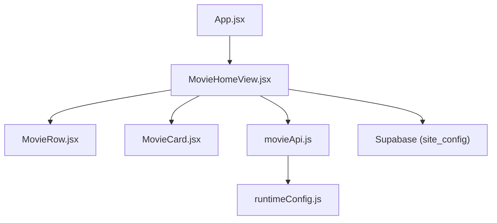
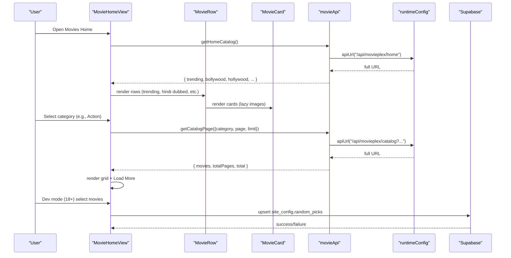
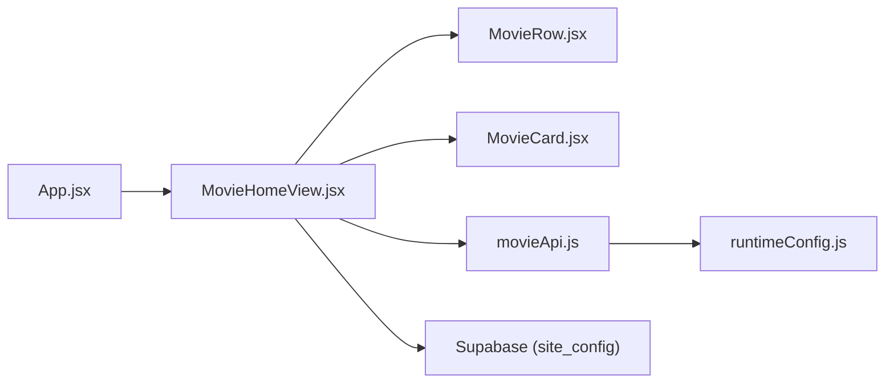

# Movie Home View

<cite>
**Referenced Files in This Document**
- [MovieHomeView.jsx](file://src/features/movie/components/MovieHomeView.jsx)
- [MovieRow.jsx](file://src/features/movie/components/MovieRow.jsx)
- [MovieCard.jsx](file://src/features/movie/components/MovieCard.jsx)
- [movieApi.js](file://src/features/movie/api/movieApi.js)
- [runtimeConfig.js](file://src/runtimeConfig.js)
- [App.jsx](file://src/App.jsx)
</cite>

## Table of Contents
1. [Introduction](#introduction)
2. [Project Structure](#project-structure)
3. [Core Components](#core-components)
4. [Architecture Overview](#architecture-overview)
5. [Detailed Component Analysis](#detailed-component-analysis)
6. [Dependency Analysis](#dependency-analysis)
7. [Performance Considerations](#performance-considerations)
8. [Troubleshooting Guide](#troubleshooting-guide)
9. [Conclusion](#conclusion)
10. [Appendices](#appendices)

## Introduction
This document explains the Movie Home View component and its supporting pieces: how it displays featured movies, trending content, and categorized collections; how horizontal scrolling rows are implemented with responsive design; how it integrates with the movie API to fetch home catalog data and handle categories; and how to customize rows, implement infinite scrolling, optimize performance for large catalogs, and handle errors, loading states, and accessibility.

## Project Structure
The movie feature is organized under a dedicated feature folder with components and an API module. The home view composes reusable row and card components and orchestrates data fetching and UI state.

**Diagram sources**
- [App.jsx:190-200](file://src/App.jsx#L190-L200)
- [MovieHomeView.jsx:1-21](file://src/features/movie/components/MovieHomeView.jsx#L1-L21)
- [MovieRow.jsx:1-10](file://src/features/movie/components/MovieRow.jsx#L1-L10)
- [MovieCard.jsx:1-10](file://src/features/movie/components/MovieCard.jsx#L1-L10)
- [movieApi.js:1-10](file://src/features/movie/api/movieApi.js#L1-L10)
- [runtimeConfig.js:149-153](file://src/runtimeConfig.js#L149-L153)

**Section sources**
- [App.jsx:190-200](file://src/App.jsx#L190-L200)
- [MovieHomeView.jsx:1-21](file://src/features/movie/components/MovieHomeView.jsx#L1-L21)

## Core Components
- MovieHomeView: Orchestrates the home experience, including hero carousel, category navigation, horizontal rows for curated lists, and a paginated grid for category browsing. It also manages developer-driven “Random Picks” persisted via Supabase.
- MovieRow: Renders a titled horizontal list with left/right chevron controls and lazy rendering of cards.
- MovieCard: Displays a poster with fallback gradient placeholder, hover overlay, rating badge, and title metadata. Supports on-demand poster fetch on image error.
- movieApi: Provides typed methods to fetch home catalog, paginated catalog by category, movie info, and search results.
- runtimeConfig: Centralizes API base URL resolution and path building.

Key responsibilities:
- Display featured hero with auto-rotation from trending or curated pools.
- Show multiple horizontal rows for different categories when viewing “All”.
- Provide a dedicated category grid view with pagination and “Load More”.
- Integrate with backend APIs using runtime-configured endpoints.
- Handle loading skeletons, errors, and empty states.

**Section sources**
- [MovieHomeView.jsx:22-63](file://src/features/movie/components/MovieHomeView.jsx#L22-L63)
- [MovieRow.jsx:5-15](file://src/features/movie/components/MovieRow.jsx#L5-L15)
- [MovieCard.jsx:4-28](file://src/features/movie/components/MovieCard.jsx#L4-L28)
- [movieApi.js:5-28](file://src/features/movie/api/movieApi.js#L5-L28)
- [runtimeConfig.js:149-153](file://src/runtimeConfig.js#L149-L153)

## Architecture Overview
The home view composes UI from smaller components and fetches data through a small API layer that uses runtime configuration to build URLs. Category selection drives either horizontal rows (for “All”) or a paginated grid (for specific categories). Developer tools allow pushing selected movies into a curated “Random Picks” section stored in Supabase.

**Diagram sources**
- [MovieHomeView.jsx:177-229](file://src/features/movie/components/MovieHomeView.jsx#L177-L229)
- [MovieHomeView.jsx:74-115](file://src/features/movie/components/MovieHomeView.jsx#L74-L115)
- [movieApi.js:5-18](file://src/features/movie/api/movieApi.js#L5-L18)
- [runtimeConfig.js:149-153](file://src/runtimeConfig.js#L149-L153)

## Detailed Component Analysis

### MovieHomeView
Responsibilities:
- Curate featured hero from trending or other pools and auto-rotate every 8 seconds.
- Render category pills and switch between “All” (horizontal rows) and dedicated category grids.
- Fetch and display paginated category movies with “Load More”.
- Manage developer-only “Random Picks” flow with Supabase persistence and realtime updates.
- Provide search results view and skeleton/error/empty states.

Data flows:
- Hero pool selection and rotation via local state and effect.
- Category grid fetches use URLSearchParams to pass category, page, limit, and optional is18 flag.
- Random picks load on mount and subscribe to realtime changes; admin can push selections back to Supabase.

Accessibility considerations:
- Buttons have aria-labels where appropriate (e.g., scroll chevrons in MovieRow).
- Loading indicators use role="status" and aria-live regions for screen readers.

Error handling:
- Network failures during category fetch clear state and stop loading.
- Supabase write errors surface user-facing alerts and console logs.

Performance:
- Uses useMemo for derived lists (featured pool, filtered category movies).
- Limits initial row items to a fixed slice to avoid heavy renders.
- Paginates category grids to reduce payload size.

Customization hooks:
- Categories array and CAT_MAP can be extended to add new rows or filters.
- Row titles/icons are configurable per category.

Example paths:
- Featured hero logic and rotation: [MovieHomeView.jsx:33-48](file://src/features/movie/components/MovieHomeView.jsx#L33-L48)
- Category mapping and query params: [MovieHomeView.jsx:52-63](file://src/features/movie/components/MovieHomeView.jsx#L52-L63), [MovieHomeView.jsx:191-196](file://src/features/movie/components/MovieHomeView.jsx#L191-L196)
- Paginated category fetch and load more: [MovieHomeView.jsx:177-229](file://src/features/movie/components/MovieHomeView.jsx#L177-L229)
- Random picks load/save and realtime: [MovieHomeView.jsx:74-115](file://src/features/movie/components/MovieHomeView.jsx#L74-L115)

**Section sources**
- [MovieHomeView.jsx:33-48](file://src/features/movie/components/MovieHomeView.jsx#L33-L48)
- [MovieHomeView.jsx:52-63](file://src/features/movie/components/MovieHomeView.jsx#L52-L63)
- [MovieHomeView.jsx:177-229](file://src/features/movie/components/MovieHomeView.jsx#L177-L229)
- [MovieHomeView.jsx:74-115](file://src/features/movie/components/MovieHomeView.jsx#L74-L115)

### MovieRow
Responsibilities:
- Render a titled section with optional icon.
- Provide left/right chevron buttons that smoothly scroll the container by a fixed amount.
- Render a limited number of cards to keep initial render light.

Behavior:
- Chevron visibility toggles on hover.
- Horizontal scrolling via native scrollBy with smooth behavior.

Accessibility:
- Chevron buttons include aria-label for screen reader context.

Performance:
- Caps displayed items to a fixed slice to prevent over-rendering.

Customization:
- Title and icon are props; can be themed or localized.

Example paths:
- Scroll implementation and chevron controls: [MovieRow.jsx:11-15](file://src/features/movie/components/MovieRow.jsx#L11-L15), [MovieRow.jsx:33-57](file://src/features/movie/components/MovieRow.jsx#L33-L57)
- Card rendering limit: [MovieRow.jsx:60-66](file://src/features/movie/components/MovieRow.jsx#L60-L66)

**Section sources**
- [MovieRow.jsx:11-15](file://src/features/movie/components/MovieRow.jsx#L11-L15)
- [MovieRow.jsx:33-57](file://src/features/movie/components/MovieRow.jsx#L33-L57)
- [MovieRow.jsx:60-66](file://src/features/movie/components/MovieRow.jsx#L60-L66)

### MovieCard
Responsibilities:
- Display poster image with graceful fallback to a vibrant gradient placeholder.
- On image error, attempt to fetch a fresh poster via backend using movie identifier.
- Show rating badge and title/year metadata.
- Provide hover overlay indicating play action.

Performance:
- Uses lazy loading for images.
- Derives a stable gradient based on title character code to avoid layout shifts.

Accessibility:
- Images have alt text set to movie title.
- Button wrapper makes the tile keyboard accessible.

Customization:
- Hover effects and badges can be adjusted via inline styles.

Example paths:
- Image fallback and on-demand fetch: [MovieCard.jsx:15-28](file://src/features/movie/components/MovieCard.jsx#L15-L28)
- Placeholder gradient and title: [MovieCard.jsx:30-42](file://src/features/movie/components/MovieCard.jsx#L30-L42)
- Rating badge and title: [MovieCard.jsx:139-158](file://src/features/movie/components/MovieCard.jsx#L139-L158)

**Section sources**
- [MovieCard.jsx:15-28](file://src/features/movie/components/MovieCard.jsx#L15-L28)
- [MovieCard.jsx:30-42](file://src/features/movie/components/MovieCard.jsx#L30-L42)
- [MovieCard.jsx:139-158](file://src/features/movie/components/MovieCard.jsx#L139-L158)

### API Integration (movieApi and runtimeConfig)
Responsibilities:
- Build consistent API URLs using runtimeConfig.apiUrl.
- Provide methods for home catalog, paginated catalog, movie info, and search.
- Throw descriptive errors on non-ok responses.

Integration points:
- Home catalog endpoint returns arrays for various categories used by MovieHomeView.
- Catalog endpoint supports category, page, limit, and is18 flags for filtering.

Example paths:
- Home catalog fetch: [movieApi.js:5-10](file://src/features/movie/api/movieApi.js#L5-L10)
- Paginated catalog fetch: [movieApi.js:11-18](file://src/features/movie/api/movieApi.js#L11-L18)
- URL builder: [runtimeConfig.js:149-153](file://src/runtimeConfig.js#L149-L153)

**Section sources**
- [movieApi.js:5-18](file://src/features/movie/api/movieApi.js#L5-L18)
- [runtimeConfig.js:149-153](file://src/runtimeConfig.js#L149-L153)

## Dependency Analysis
High-level dependencies:
- App mounts MovieHomeView and passes data/state.
- MovieHomeView depends on MovieRow and MovieCard for rendering.
- MovieHomeView calls movieApi methods which rely on runtimeConfig for URL construction.
- MovieHomeView interacts with Supabase for Random Picks persistence and realtime updates.

**Diagram sources**
- [App.jsx:190-200](file://src/App.jsx#L190-L200)
- [MovieHomeView.jsx:1-21](file://src/features/movie/components/MovieHomeView.jsx#L1-L21)
- [movieApi.js:1-10](file://src/features/movie/api/movieApi.js#L1-L10)
- [runtimeConfig.js:149-153](file://src/runtimeConfig.js#L149-L153)

**Section sources**
- [App.jsx:190-200](file://src/App.jsx#L190-L200)
- [MovieHomeView.jsx:1-21](file://src/features/movie/components/MovieHomeView.jsx#L1-L21)
- [movieApi.js:1-10](file://src/features/movie/api/movieApi.js#L1-L10)
- [runtimeConfig.js:149-153](file://src/runtimeConfig.js#L149-L153)

## Performance Considerations
- Limit initial row items: Rows cap displayed cards to a fixed number to reduce DOM size and improve initial paint.
- Pagination: Category grids fetch a limited page size and append more on demand to manage large catalogs.
- Lazy images: Cards use lazy loading to defer offscreen image requests.
- Memoization: Derived lists like featured pool and filtered category movies are memoized to avoid unnecessary recalculations.
- Skeleton loaders: Provide perceived performance during network requests.

Recommendations:
- Consider virtualization for very large category grids if needed.
- Debounce or throttle “Load More” triggers to avoid rapid repeated requests.
- Cache API responses at the app level if appropriate to reduce network usage.

[No sources needed since this section provides general guidance]

## Troubleshooting Guide
Common issues and resolutions:
- No movies shown: Check that home catalog response contains expected arrays; verify API base URL resolution.
- Category grid empty: Ensure category ID mapping is correct and server supports requested filters; check network tab for errors.
- Image not loading: Cards attempt on-demand fetch on error; verify backend post-info endpoint returns thumbnail.
- Supabase write blocked: Admin push to Random Picks may fail due to Row Level Security; inspect alert message and SQL policies.

Loading states:
- Skeleton placeholders appear while initial data loads and during category fetches.
- Inline loader indicates search or background operations.

Accessibility:
- Use aria labels on interactive controls (scroll chevrons).
- Ensure status messages are announced via aria-live regions.

Error handling:
- Non-ok API responses throw descriptive errors; callers should catch and present user-friendly messages.
- Supabase errors log details and show user alerts.

**Section sources**
- [MovieHomeView.jsx:191-206](file://src/features/movie/components/MovieHomeView.jsx#L191-L206)
- [MovieHomeView.jsx:102-115](file://src/features/movie/components/MovieHomeView.jsx#L102-L115)
- [MovieCard.jsx:15-28](file://src/features/movie/components/MovieCard.jsx#L15-L28)
- [App.jsx:2512-2521](file://src/App.jsx#L2512-L2521)

## Conclusion
The Movie Home View delivers a rich, Netflix-style browsing experience with a rotating hero, horizontal rows for curated categories, and a paginated grid for deep exploration. It integrates cleanly with a small API layer and runtime configuration, supports developer curation via Supabase, and includes robust loading, error, and accessibility patterns. With careful pagination, lazy loading, and memoization, it scales well to large catalogs.

[No sources needed since this section summarizes without analyzing specific files]

## Appendices

### Customizing Movie Rows
- Add a new category row by extending the categories list and CAT_MAP in the home view, then conditionally render a MovieRow with the corresponding data array.
- Adjust row titles and icons via props passed to MovieRow.

Implementation references:
- Category list and mapping: [MovieHomeView.jsx:50-63](file://src/features/movie/components/MovieHomeView.jsx#L50-L63)
- Row rendering blocks: [MovieHomeView.jsx:392-418](file://src/features/movie/components/MovieHomeView.jsx#L392-L418)

**Section sources**
- [MovieHomeView.jsx:50-63](file://src/features/movie/components/MovieHomeView.jsx#L50-L63)
- [MovieHomeView.jsx:392-418](file://src/features/movie/components/MovieHomeView.jsx#L392-L418)

### Implementing Infinite Scrolling
Current approach:
- Dedicated category views use pagination with a “Load More” button to fetch additional pages until totalPages is reached.

To implement true infinite scrolling:
- Observe scroll position near the bottom of the grid and trigger loadMoreCategoryMovies automatically.
- Guard against duplicate loads with a loading flag and ensure page increments correctly.

References:
- Load more function and pagination state: [MovieHomeView.jsx:209-229](file://src/features/movie/components/MovieHomeView.jsx#L209-L229)

**Section sources**
- [MovieHomeView.jsx:209-229](file://src/features/movie/components/MovieHomeView.jsx#L209-L229)

### Optimizing Performance for Large Catalogs
- Keep row slices limited and consider virtualization for long lists.
- Use pagination and incremental loading for category grids.
- Leverage lazy image loading and on-demand poster fetch on error.
- Memoize derived data to minimize re-renders.

References:
- Row item limiting: [MovieRow.jsx:60-66](file://src/features/movie/components/MovieRow.jsx#L60-L66)
- Lazy images and fallback: [MovieCard.jsx:75-82](file://src/features/movie/components/MovieCard.jsx#L75-L82), [MovieCard.jsx:15-28](file://src/features/movie/components/MovieCard.jsx#L15-L28)
- Memoization in home view: [MovieHomeView.jsx:33-37](file://src/features/movie/components/MovieHomeView.jsx#L33-L37), [MovieHomeView.jsx:156-175](file://src/features/movie/components/MovieHomeView.jsx#L156-L175)

**Section sources**
- [MovieRow.jsx:60-66](file://src/features/movie/components/MovieRow.jsx#L60-L66)
- [MovieCard.jsx:75-82](file://src/features/movie/components/MovieCard.jsx#L75-L82)
- [MovieCard.jsx:15-28](file://src/features/movie/components/MovieCard.jsx#L15-L28)
- [MovieHomeView.jsx:33-37](file://src/features/movie/components/MovieHomeView.jsx#L33-L37)
- [MovieHomeView.jsx:156-175](file://src/features/movie/components/MovieHomeView.jsx#L156-L175)