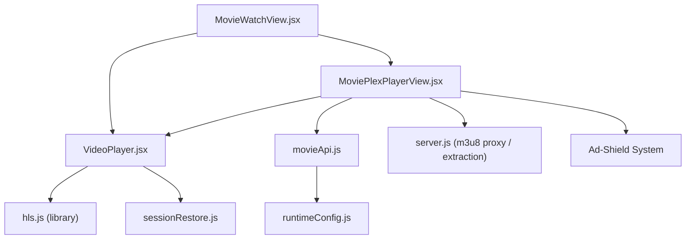
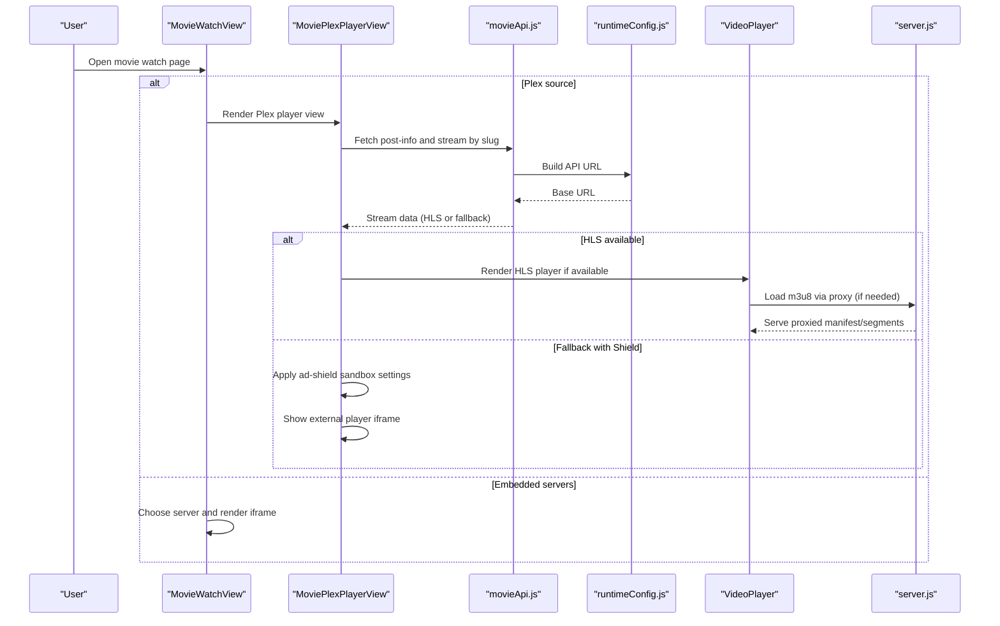
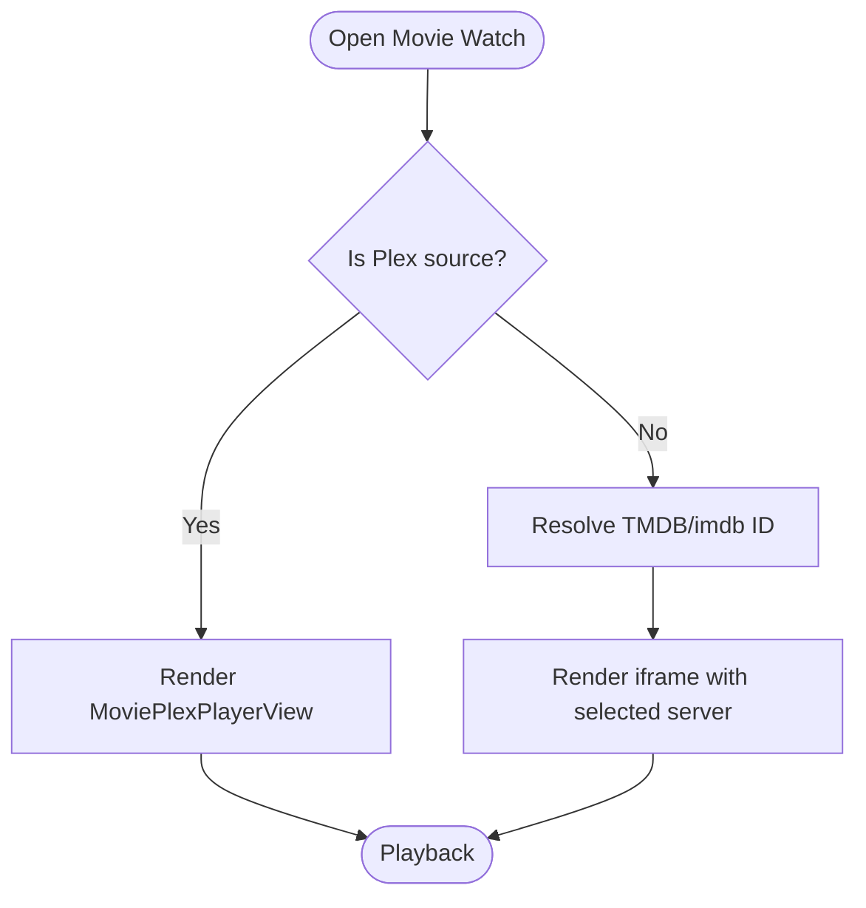
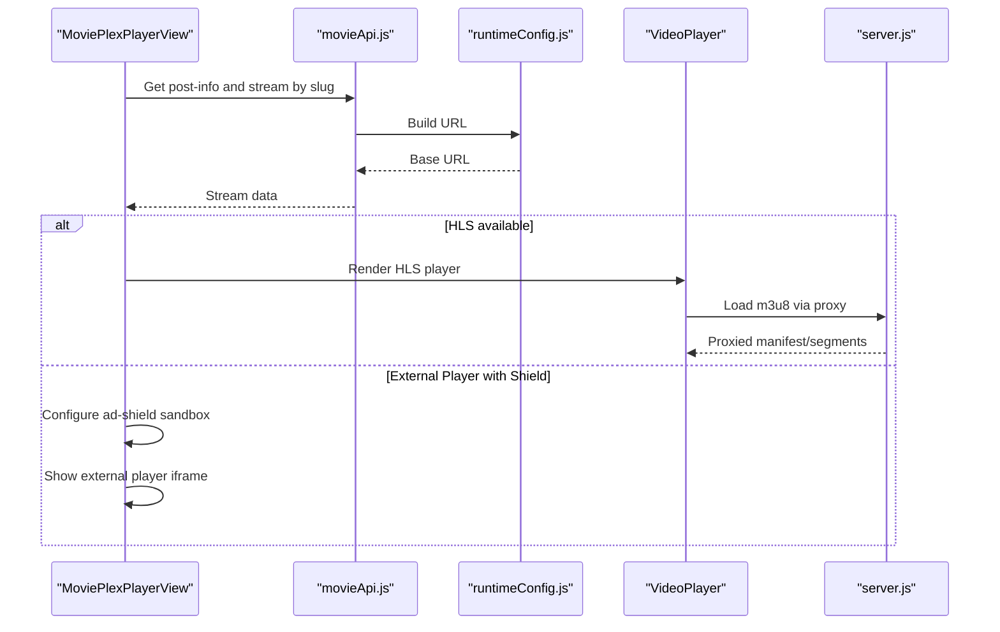
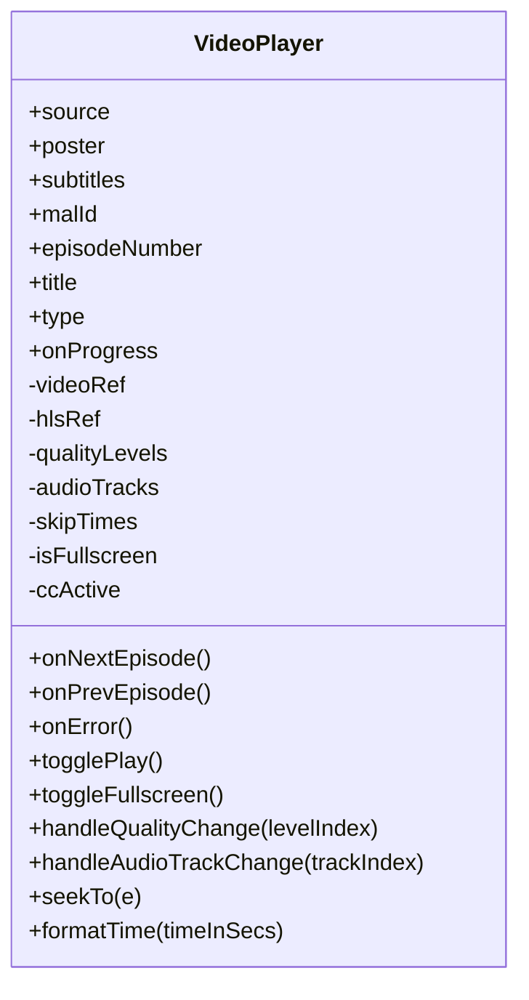
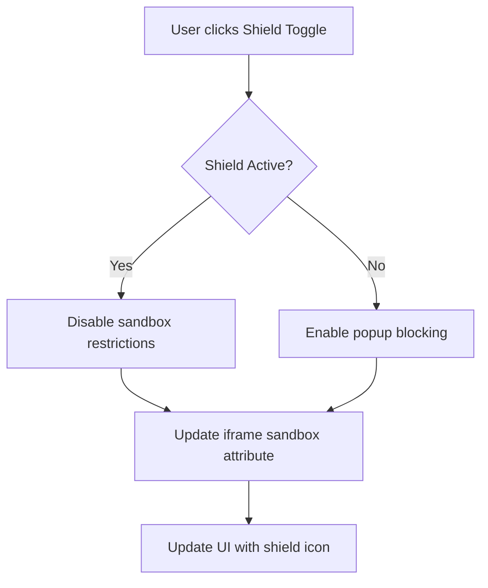
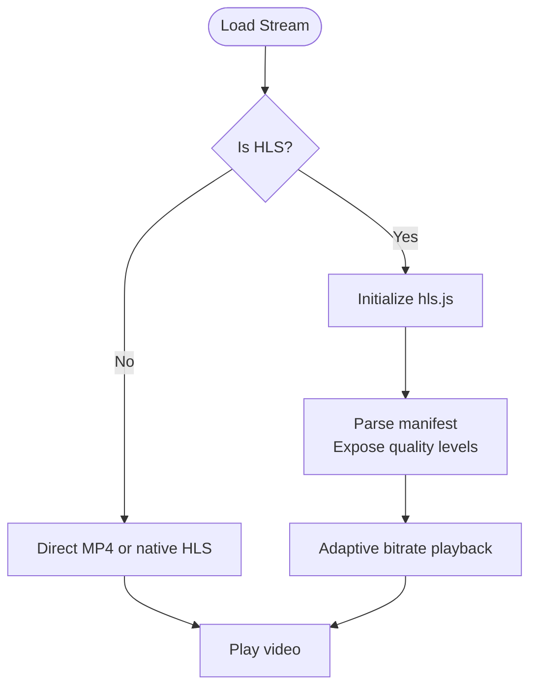
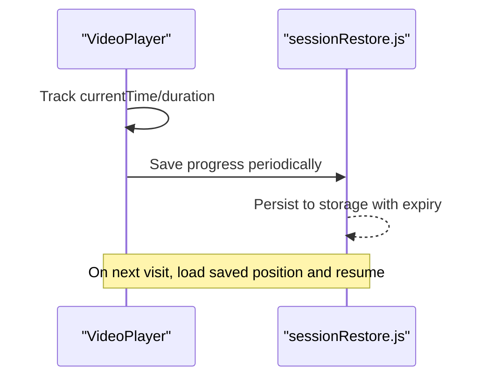
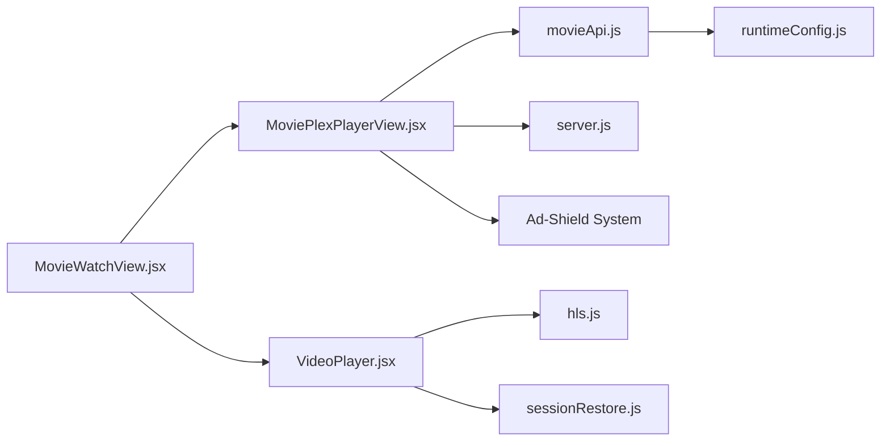

# Movie Watch View

<cite>
**Referenced Files in This Document**
- [MovieWatchView.jsx](file://src/features/movie/components/MovieWatchView.jsx)
- [MoviePlexPlayerView.jsx](file://src/features/movie/components/MoviePlexPlayerView.jsx)
- [VideoPlayer.jsx](file://src/components/VideoPlayer.jsx)
- [movieApi.js](file://src/features/movie/api/movieApi.js)
- [sessionRestore.js](file://src/utils/sessionRestore.js)
- [runtimeConfig.js](file://src/runtimeConfig.js)
- [server.js](file://server.js)
</cite>

## Update Summary
**Changes Made**
- Updated MoviePlexPlayerView section to reflect enhanced stream resolution logic and external player compatibility modes
- Added new Ad-Shield Sandbox System section documenting the security features
- Enhanced Error Recovery Mechanisms section with improved multi-provider error handling
- Updated Player Switcher Bar functionality to include adaptive quality selection
- Added comprehensive coverage of the new shield toggle feature for external players

## Table of Contents
1. [Introduction](#introduction)
2. [Project Structure](#project-structure)
3. [Core Components](#core-components)
4. [Architecture Overview](#architecture-overview)
5. [Detailed Component Analysis](#detailed-component-analysis)
6. [Dependency Analysis](#dependency-analysis)
7. [Performance Considerations](#performance-considerations)
8. [Troubleshooting Guide](#troubleshooting-guide)
9. [Conclusion](#conclusion)
10. [Appendices](#appendices)

## Introduction
This document explains the Movie Watch View and Plex Player integration, focusing on how video playback is implemented with quality selection, subtitle support, playback controls, streaming protocol handling (including adaptive bitrate HLS), error recovery, and progress tracking to resume from where users left off. It also covers configuring different video sources, implementing custom player controls, handling various video formats, performance optimization for streaming, memory management during long sessions, and cross-browser compatibility considerations.

**Updated** Enhanced with improved stream resolution logic, external player compatibility modes, ad-shield sandbox system, and enhanced error handling for multiple streaming providers.

## Project Structure
The movie watching experience is composed of:
- A routing view that decides between a standard embedded server approach and a Plex-style HLS stream.
- A robust VideoPlayer component that handles HLS via hls.js, native HLS fallback, direct MP4 playback, subtitles, quality/audio track selection, and rich controls.
- API utilities and runtime configuration for fetching streams and resolving backend endpoints.
- Session persistence utilities to save and restore playback progress.

**Diagram sources**
- [MovieWatchView.jsx:30-42](file://src/features/movie/components/MovieWatchView.jsx#L30-L42)
- [MoviePlexPlayerView.jsx:30-74](file://src/features/movie/components/MoviePlexPlayerView.jsx#L30-L74)
- [VideoPlayer.jsx:148-282](file://src/components/VideoPlayer.jsx#L148-L282)
- [movieApi.js:5-28](file://src/features/movie/api/movieApi.js#L5-L28)
- [runtimeConfig.js:82-153](file://src/runtimeConfig.js#L82-L153)
- [server.js:263-329](file://server.js#L263-L329)

**Section sources**
- [MovieWatchView.jsx:30-42](file://src/features/movie/components/MovieWatchView.jsx#L30-L42)
- [MoviePlexPlayerView.jsx:30-74](file://src/features/movie/components/MoviePlexPlayerView.jsx#L30-L74)
- [VideoPlayer.jsx:148-282](file://src/components/VideoPlayer.jsx#L148-L282)
- [movieApi.js:5-28](file://src/features/movie/api/movieApi.js#L5-L28)
- [runtimeConfig.js:82-153](file://src/runtimeConfig.js#L82-L153)
- [server.js:263-329](file://server.js#L263-L329)

## Core Components
- MovieWatchView: Entry point for movie playback. If the item is a Plex source, it delegates to MoviePlexPlayerView; otherwise, it renders an iframe-based player with multiple server options and basic info display.
- MoviePlexPlayerView: Fetches stream data for a Plex slug, supports HLS playback via VideoPlayer, and provides fallback to external players when needed. Also shows recommendations below the player. **Enhanced with improved stream resolution logic and ad-shield sandbox system.**
- VideoPlayer: Full-featured player supporting HLS (via hls.js), native HLS (iOS Safari), direct MP4, subtitles, quality and audio track selection, skip intro/end, timeline scrubbing with preview, keyboard shortcuts, PiP, fullscreen, and progress reporting.
- movieApi: Centralized API calls for catalog, search, and post info for movies.
- sessionRestore: Utilities to persist and restore app state and per-media playback progress.
- runtimeConfig: Resolves API base URL dynamically across environments and builds URLs for backend calls.
- server.js: Backend endpoints including m3u8 proxying and stream extraction logic used by the Plex flow.

**Section sources**
- [MovieWatchView.jsx:30-89](file://src/features/movie/components/MovieWatchView.jsx#L30-L89)
- [MoviePlexPlayerView.jsx:30-74](file://src/features/movie/components/MoviePlexPlayerView.jsx#L30-L74)
- [VideoPlayer.jsx:148-282](file://src/components/VideoPlayer.jsx#L148-L282)
- [movieApi.js:5-28](file://src/features/movie/api/movieApi.js#L5-L28)
- [sessionRestore.js:17-95](file://src/utils/sessionRestore.js#L17-L95)
- [runtimeConfig.js:82-153](file://src/runtimeConfig.js#L82-L153)
- [server.js:263-329](file://server.js#L263-L329)

## Architecture Overview
The architecture separates concerns:
- Routing and UI orchestration are handled by MovieWatchView and MoviePlexPlayerView.
- Playback logic is encapsulated in VideoPlayer, which abstracts HLS, native HLS, and direct formats.
- Streaming protocols are managed through server-side proxies and extraction endpoints, ensuring CORS-friendly access to HLS manifests and segments.
- Progress tracking integrates with session restoration to resume playback seamlessly.
- **Enhanced with adaptive stream resolution and multi-provider error handling.**

**Diagram sources**
- [MovieWatchView.jsx:30-42](file://src/features/movie/components/MovieWatchView.jsx#L30-L42)
- [MoviePlexPlayerView.jsx:41-74](file://src/features/movie/components/MoviePlexPlayerView.jsx#L41-L74)
- [movieApi.js:5-28](file://src/features/movie/api/movieApi.js#L5-L28)
- [runtimeConfig.js:82-153](file://src/runtimeConfig.js#L82-L153)
- [VideoPlayer.jsx:148-282](file://src/components/VideoPlayer.jsx#L148-L282)
- [server.js:263-329](file://server.js#L263-L329)

## Detailed Component Analysis

### MovieWatchView
Responsibilities:
- Determines whether to use Plex playback or embedded servers.
- For non-Plex items, resolves TMDB/imdb IDs and renders an iframe player with selectable servers.
- Provides a simple progress callback placeholder.

Key behaviors:
- Delegates to MoviePlexPlayerView when a Plex slug or source is present.
- Uses fetch calls to resolve identifiers for embedding servers.
- Renders a server selector UI and displays movie metadata.

**Diagram sources**
- [MovieWatchView.jsx:30-42](file://src/features/movie/components/MovieWatchView.jsx#L30-L42)
- [MovieWatchView.jsx:48-81](file://src/features/movie/components/MovieWatchView.jsx#L48-L81)

**Section sources**
- [MovieWatchView.jsx:30-89](file://src/features/movie/components/MovieWatchView.jsx#L30-L89)

### MoviePlexPlayerView
Responsibilities:
- Fetches stream data for a given slug using API endpoints.
- Detects HLS availability and renders VideoPlayer accordingly.
- Provides fallback to external player when HLS fails or is not supported.
- Displays recommendations below the player.

**Updated** Enhanced with improved stream resolution logic that automatically detects optimal playback method based on source type and availability.

Key behaviors:
- Loads post-info and stream data, sets loading/error states.
- Uses VideoPlayer with isM3U8 flag for HLS streams.
- Switches to fallback iframe when necessary with adaptive quality selection.
- **Implements ad-shield sandbox system for secure external player usage.**

**Diagram sources**
- [MoviePlexPlayerView.jsx:41-74](file://src/features/movie/components/MoviePlexPlayerView.jsx#L41-L74)
- [MoviePlexPlayerView.jsx:131-150](file://src/features/movie/components/MoviePlexPlayerView.jsx#L131-L150)
- [server.js:263-329](file://server.js#L263-L329)

**Section sources**
- [MoviePlexPlayerView.jsx:30-74](file://src/features/movie/components/MoviePlexPlayerView.jsx#L30-L74)
- [MoviePlexPlayerView.jsx:131-150](file://src/features/movie/components/MoviePlexPlayerView.jsx#L131-L150)

### VideoPlayer
Responsibilities:
- Manages playback lifecycle for HLS, native HLS, and direct MP4.
- Implements quality selection, audio track selection, subtitles, skip intro/end, timeline scrubbing with preview, keyboard shortcuts, PiP, fullscreen, and progress reporting.
- Handles errors with retry/recovery mechanisms for network and media issues.

Key implementation highlights:
- HLS initialization with hls.js, manifest parsing to populate quality levels, and audio tracks discovery.
- Native HLS path for iOS Safari.
- Subtitle track toggling and CC activation.
- Error handling with automatic retries for network and media errors, then graceful failure messaging.
- Progress reporting via onProgress callback with throttled updates.

**Diagram sources**
- [VideoPlayer.jsx:5-20](file://src/components/VideoPlayer.jsx#L5-L20)
- [VideoPlayer.jsx:148-282](file://src/components/VideoPlayer.jsx#L148-L282)
- [VideoPlayer.jsx:506-521](file://src/components/VideoPlayer.jsx#L506-L521)
- [VideoPlayer.jsx:587-616](file://src/components/VideoPlayer.jsx#L587-L616)
- [VideoPlayer.jsx:661-669](file://src/components/VideoPlayer.jsx#L661-669)

**Section sources**
- [VideoPlayer.jsx:148-282](file://src/components/VideoPlayer.jsx#L148-L282)
- [VideoPlayer.jsx:284-292](file://src/components/VideoPlayer.jsx#L284-L292)
- [VideoPlayer.jsx:300-332](file://src/components/VideoPlayer.jsx#L300-L332)
- [VideoPlayer.jsx:390-442](file://src/components/VideoPlayer.jsx#L390-L442)
- [VideoPlayer.jsx:506-521](file://src/components/VideoPlayer.jsx#L506-L521)
- [VideoPlayer.jsx:544-585](file://src/components/VideoPlayer.jsx#L544-L585)
- [VideoPlayer.jsx:587-616](file://src/components/VideoPlayer.jsx#L587-L616)
- [VideoPlayer.jsx:618-654](file://src/components/VideoPlayer.jsx#L618-L654)
- [VideoPlayer.jsx:661-669](file://src/components/VideoPlayer.jsx#L661-669)
- [VideoPlayer.jsx:671-693](file://src/components/VideoPlayer.jsx#L671-L693)
- [VideoPlayer.jsx:697-1043](file://src/components/VideoPlayer.jsx#L697-L1043)

### Ad-Shield Sandbox System
**New Feature** The MoviePlexPlayerView now includes a sophisticated ad-shield sandbox system that enhances security and user experience when using external players.

Key Features:
- **Dynamic Sandbox Configuration**: Toggles between restrictive and permissive iframe sandbox modes based on user preference
- **Popup Blocking**: When enabled, prevents unwanted popup tabs from external streaming providers
- **Compatibility Mode**: Automatically adjusts sandbox settings for maximum video host compatibility
- **Visual Indicators**: Clear UI feedback showing current shield status with shield icons

Implementation Details:
- Uses React state to manage shield active/inactive states
- Dynamically applies sandbox attributes to iframe elements
- Provides toggle button with visual feedback and tooltips
- Maintains separate keys for shield-on/shield-off states to force re-render

**Diagram sources**
- [MoviePlexPlayerView.jsx:231-249](file://src/features/movie/components/MoviePlexPlayerView.jsx#L231-L249)

**Section sources**
- [MoviePlexPlayerView.jsx:231-249](file://src/features/movie/components/MoviePlexPlayerView.jsx#L231-L249)

### Enhanced Player Switcher Bar
**Updated** The player switcher bar now provides intelligent switching between different playback methods with enhanced user experience.

Key Enhancements:
- **Adaptive Quality Selection**: Automatically selects optimal player based on stream availability and browser capabilities
- **Visual Status Indicators**: Clear buttons showing current active player mode
- **Seamless Transitions**: Smooth switching between internal HLS player and external players
- **Provider-Specific Optimization**: Automatic detection of streamtape and other special cases

Features:
- Custom HLS player button labeled "Our Custom Player (Ad-Free)"
- External player button with fallback iframe support
- Real-time status updates when switching between players
- Responsive design that adapts to different screen sizes

**Section sources**
- [MoviePlexPlayerView.jsx:204-250](file://src/features/movie/components/MoviePlexPlayerView.jsx#L204-L250)

### Streaming Protocol Handling and Adaptive Bitrate
- HLS via hls.js: The player detects HLS streams and initializes hls.js to parse manifests, expose quality levels, and manage adaptive bitrate switching automatically. Quality menus allow manual overrides.
- Native HLS: iOS Safari uses native HLS support by setting the video src directly to the m3u8 URL.
- Server-side proxy: The backend proxies m3u8 manifests and segments to avoid CORS issues and enable referer handling.

**Diagram sources**
- [VideoPlayer.jsx:148-282](file://src/components/VideoPlayer.jsx#L148-L282)
- [server.js:263-329](file://server.js#L263-L329)

**Section sources**
- [VideoPlayer.jsx:148-282](file://src/components/VideoPlayer.jsx#L148-L282)
- [server.js:263-329](file://server.js#L263-L329)

### Subtitle Support
- Subtitles are provided via WebVTT tracks attached to the video element.
- The player toggles CC visibility and manages active subtitle tracks.

**Section sources**
- [VideoPlayer.jsx:284-292](file://src/components/VideoPlayer.jsx#L284-L292)
- [VideoPlayer.jsx:734-744](file://src/components/VideoPlayer.jsx#L734-L744)
- [VideoPlayer.jsx:940-948](file://src/components/VideoPlayer.jsx#L940-L948)

### Playback Controls
- Custom controls include play/pause, volume, timeline scrubbing with hover preview, skip intro/end, quality/audio track menus, PiP, fullscreen, and keyboard shortcuts.
- Touch gestures support double-tap seek and single-tap control toggle.

**Section sources**
- [VideoPlayer.jsx:358-388](file://src/components/VideoPlayer.jsx#L358-L388)
- [VideoPlayer.jsx:390-442](file://src/components/VideoPlayer.jsx#L390-L442)
- [VideoPlayer.jsx:444-504](file://src/components/VideoPlayer.jsx#L444-L504)
- [VideoPlayer.jsx:544-585](file://src/components/VideoPlayer.jsx#L544-L585)
- [VideoPlayer.jsx:587-616](file://src/components/VideoPlayer.jsx#L587-L616)
- [VideoPlayer.jsx:618-654](file://src/components/VideoPlayer.jsx#L618-L654)
- [VideoPlayer.jsx:813-1037](file://src/components/VideoPlayer.jsx#L813-L1037)

### Enhanced Error Recovery Mechanisms
**Updated** Significantly improved error handling with enhanced recovery strategies for multiple streaming providers.

Key Improvements:
- **Multi-Provider Error Detection**: Intelligent detection of failures across different streaming sources
- **Automatic Fallback Chain**: Sequential attempts through HLS → External Player → Error State
- **Enhanced Retry Logic**: Improved retry mechanisms with exponential backoff
- **Graceful Degradation**: Seamless fallback to alternative playback methods without user intervention

Recovery Strategies:
- Network errors: Automatic restart of loading with limited attempts before failing gracefully
- Media errors: Attempted recovery via hls.js media error recovery routines
- Provider-specific handling: Specialized error handling for streamtape and other providers
- User feedback: Clear error messages with actionable next steps

**Section sources**
- [VideoPlayer.jsx:239-261](file://src/components/VideoPlayer.jsx#L239-L261)
- [MoviePlexPlayerView.jsx:131-150](file://src/features/movie/components/MoviePlexPlayerView.jsx#L131-L150)
- [MoviePlexPlayerView.jsx:151-187](file://src/features/movie/components/MoviePlexPlayerView.jsx#L151-L187)

### Progress Tracking and Resume
- The player reports progress via onProgress with throttled updates based on time differences and duration proximity.
- Session utilities provide functions to save and retrieve per-media playback positions, with expiration policies to keep storage relevant.

**Diagram sources**
- [VideoPlayer.jsx:321-332](file://src/components/VideoPlayer.jsx#L321-L332)
- [sessionRestore.js:63-95](file://src/utils/sessionRestore.js#L63-L95)

**Section sources**
- [VideoPlayer.jsx:321-332](file://src/components/VideoPlayer.jsx#L321-L332)
- [sessionRestore.js:63-95](file://src/utils/sessionRestore.js#L63-L95)

### Configuring Different Video Sources
- Embedded servers: MovieWatchView renders iframes for multiple providers, allowing users to switch servers easily.
- Plex HLS: MoviePlexPlayerView fetches stream data and renders HLS via VideoPlayer or falls back to external players.
- Runtime configuration: API base resolution ensures correct backend endpoints across environments.

**Section sources**
- [MovieWatchView.jsx:74-81](file://src/features/movie/components/MovieWatchView.jsx#L74-L81)
- [MoviePlexPlayerView.jsx:41-74](file://src/features/movie/components/MoviePlexPlayerView.jsx#L41-L74)
- [runtimeConfig.js:82-153](file://src/runtimeConfig.js#L82-L153)

### Implementing Custom Player Controls
- VideoPlayer exposes props like onProgress, onNextEpisode, onPrevEpisode, and onError to integrate with higher-level views.
- Quality and audio track menus can be customized via state and event handlers within the component.
- Keyboard shortcuts and touch gestures enhance accessibility and usability.

**Section sources**
- [VideoPlayer.jsx:5-20](file://src/components/VideoPlayer.jsx#L5-L20)
- [VideoPlayer.jsx:506-521](file://src/components/VideoPlayer.jsx#L506-L521)
- [VideoPlayer.jsx:544-585](file://src/components/VideoPlayer.jsx#L544-L585)
- [VideoPlayer.jsx:697-1043](file://src/components/VideoPlayer.jsx#L697-L1043)

### Handling Various Video Formats
- HLS: Detected via URL patterns or flags; played via hls.js or native HLS.
- Direct MP4: Set as video src when not HLS.
- Iframe fallback: Used when direct playback is not feasible.

**Section sources**
- [VideoPlayer.jsx:148-282](file://src/components/VideoPlayer.jsx#L148-L282)
- [VideoPlayer.jsx:671-693](file://src/components/VideoPlayer.jsx#L671-L693)

## Dependency Analysis
The components interact through well-defined interfaces:
- MovieWatchView depends on MoviePlexPlayerView for Plex sources and on VideoPlayer for embedded playback.
- MoviePlexPlayerView depends on movieApi and runtimeConfig for data fetching and URL construction.
- VideoPlayer depends on hls.js for HLS playback and on sessionRestore for progress persistence.
- server.js provides backend endpoints for m3u8 proxying and stream extraction.

**Diagram sources**
- [MovieWatchView.jsx:30-42](file://src/features/movie/components/MovieWatchView.jsx#L30-L42)
- [MoviePlexPlayerView.jsx:41-74](file://src/features/movie/components/MoviePlexPlayerView.jsx#L41-L74)
- [movieApi.js:5-28](file://src/features/movie/api/movieApi.js#L5-L28)
- [runtimeConfig.js:82-153](file://src/runtimeConfig.js#L82-L153)
- [VideoPlayer.jsx:148-282](file://src/components/VideoPlayer.jsx#L148-L282)
- [sessionRestore.js:63-95](file://src/utils/sessionRestore.js#L63-L95)
- [server.js:263-329](file://server.js#L263-L329)

**Section sources**
- [MovieWatchView.jsx:30-42](file://src/features/movie/components/MovieWatchView.jsx#L30-L42)
- [MoviePlexPlayerView.jsx:41-74](file://src/features/movie/components/MoviePlexPlayerView.jsx#L41-L74)
- [movieApi.js:5-28](file://src/features/movie/api/movieApi.js#L5-L28)
- [runtimeConfig.js:82-153](file://src/runtimeConfig.js#L82-L153)
- [VideoPlayer.jsx:148-282](file://src/components/VideoPlayer.jsx#L148-L282)
- [sessionRestore.js:63-95](file://src/utils/sessionRestore.js#L63-L95)
- [server.js:263-329](file://server.js#L263-L329)

## Performance Considerations
- Buffering and ABR: hls.js configures buffer lengths and retry delays to balance startup time and stability.
- Memory management: Destroying HLS instances on cleanup prevents leaks during long sessions.
- Thumbnail previews: Using a hidden video element and canvas for scrubbing previews reduces overhead while improving UX.
- Network resilience: Proxying m3u8 manifests and segments mitigates CORS and referer constraints, reducing failed loads.
- **Enhanced with optimized stream resolution logic that reduces unnecessary API calls and improves fallback performance.**

[No sources needed since this section provides general guidance]

## Troubleshooting Guide
Common issues and resolutions:
- Stream unavailable: Use the external player fallback option when HLS extraction fails.
- Network errors: Automatic retries are attempted; if persistent, check network connectivity and backend proxy availability.
- No HLS support: Ensure browser supports HLS or use Chrome/Firefox; iOS Safari uses native HLS.
- Subtitles not showing: Toggle CC button and verify subtitle tracks are present.
- **External player issues**: Try toggling the ad-shield sandbox mode to improve compatibility with different streaming providers.

**Updated** Enhanced troubleshooting for the new ad-shield system and improved error handling.

**Section sources**
- [MoviePlexPlayerView.jsx:151-187](file://src/features/movie/components/MoviePlexPlayerView.jsx#L151-L187)
- [VideoPlayer.jsx:239-261](file://src/components/VideoPlayer.jsx#L239-L261)
- [VideoPlayer.jsx:284-292](file://src/components/VideoPlayer.jsx#L284-L292)

## Conclusion
The Movie Watch View and Plex Player integration provide a robust, user-friendly video playback experience with adaptive bitrate streaming, subtitle support, customizable controls, and resilient error handling. Progress tracking enables seamless resumption, while server-side proxies ensure reliable streaming across browsers and devices. The modular design allows easy extension and customization for different video sources and formats.

**Enhanced** Recent improvements include significantly better stream resolution logic, enhanced external player compatibility modes, a sophisticated ad-shield sandbox system for improved security, and more robust error handling across multiple streaming providers. These enhancements make the playback experience more reliable and user-friendly across diverse streaming sources and network conditions.

[No sources needed since this section summarizes without analyzing specific files]

## Appendices

### Cross-Browser Compatibility Notes
- Desktop: Chrome/Firefox benefit from hls.js; iOS Safari uses native HLS.
- Mobile: Touch gestures and orientation lock improve playback experience.
- PiP and fullscreen: Supported with appropriate browser APIs and fallbacks.
- **Enhanced with improved compatibility for external players through adaptive sandbox configuration.**

[No sources needed since this section provides general guidance]

### Ad-Shield Security Configuration
**New Section** The ad-shield system provides configurable security levels for external player usage.

Security Levels:
- **Restricted Mode (Shield ON)**: Blocks popups and limits iframe capabilities for maximum security
- **Compatible Mode (Shield OFF)**: Allows full iframe functionality for maximum video host compatibility
- **Automatic Detection**: Intelligently switches between modes based on streaming provider requirements

Configuration Options:
- Dynamic sandbox attribute manipulation
- Visual feedback with shield icons and status indicators
- User-controlled toggle with tooltips explaining current mode
- Persistent state management for user preferences

**Section sources**
- [MoviePlexPlayerView.jsx:231-249](file://src/features/movie/components/MoviePlexPlayerView.jsx#L231-L249)