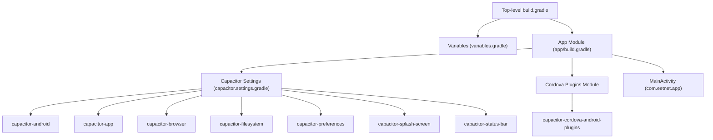
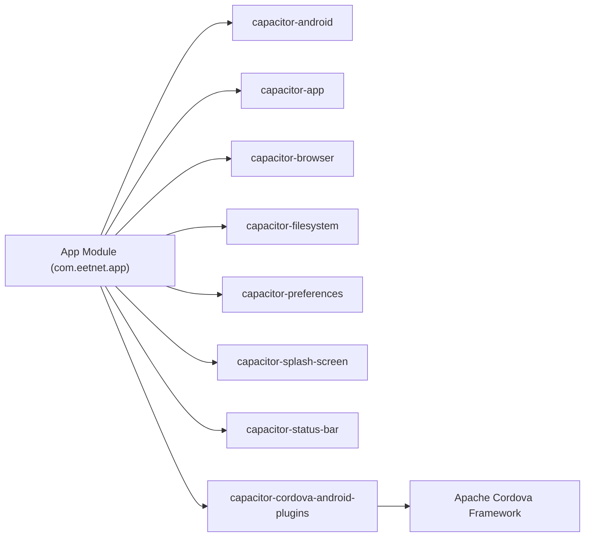
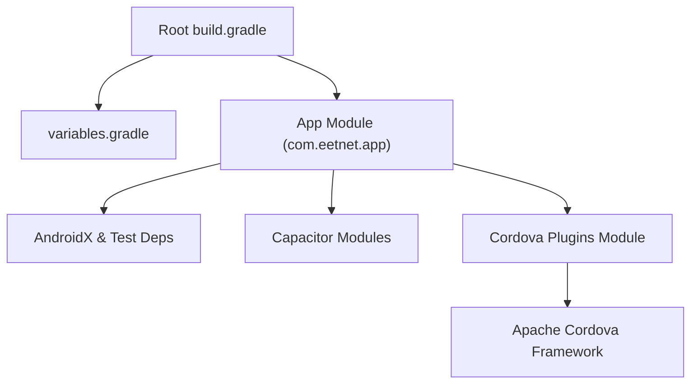

# Android Build Pipeline

<cite>
**Referenced Files in This Document**
- [android/app/build.gradle](file://android/app/build.gradle)
- [android/build.gradle](file://android/build.gradle)
- [android/gradle.properties](file://android/gradle.properties)
- [android/variables.gradle](file://android/variables.gradle)
- [android/settings.gradle](file://android/settings.gradle)
- [android/capacitor.settings.gradle](file://android/capacitor.settings.gradle)
- [android/app/capacitor.build.gradle](file://android/app/capacitor.build.gradle)
- [android/app/proguard-rules.pro](file://android/app/proguard-rules.pro)
- [android/capacitor-cordova-android-plugins/build.gradle](file://android/capacitor-cordova-android-plugins/build.gradle)
- [android/capacitor-cordova-android-plugins/cordova.variables.gradle](file://android/capacitor-cordova-android-plugins/cordova.variables.gradle)
- [capacitor.config.json](file://capacitor.config.json)
- [android/app/src/main/AndroidManifest.xml](file://android/app/src/main/AndroidManifest.xml)
- [android/app/src/main/java/com/eetnet/app/MainActivity.java](file://android/app/src/main/java/com/eetnet/app/MainActivity.java)
- [android/app/src/androidTest/java/com/getcapacitor/myapp/ExampleInstrumentedTest.java](file://android/app/src/androidTest/java/com/getcapacitor/myapp/ExampleInstrumentedTest.java)
- [android/app/src/test/java/com/getcapacitor/myapp/ExampleUnitTest.java](file://android/app/src/test/java/com/getcapacitor/myapp/ExampleUnitTest.java)
</cite>

## Update Summary
**Changes Made**
- Updated namespace configuration to use `com.eetnet.app` instead of generic Capacitor package
- Enhanced minimum SDK version support with proper SDK version management
- Added complete Gradle configuration files for Capacitor-based Android project structure
- Integrated ProGuard rules and test configurations
- Updated build pipeline to reflect modern Capacitor integration patterns

## Table of Contents
1. [Introduction](#introduction)
2. [Project Structure](#project-structure)
3. [Core Components](#core-components)
4. [Architecture Overview](#architecture-overview)
5. [Detailed Component Analysis](#detailed-component-analysis)
6. [Dependency Analysis](#dependency-analysis)
7. [Performance Considerations](#performance-considerations)
8. [Troubleshooting Guide](#troubleshooting-guide)
9. [Conclusion](#conclusion)

## Introduction
This document explains the enhanced Android build pipeline for a Capacitor-based app using Gradle with proper namespace configuration (`com.eetnet.app`). It covers build configuration, signing and release packaging (APK/AAB), code shrinking and obfuscation with ProGuard, multi-architecture support, Capacitor integration, native plugin compilation, resource optimization, differences between development and production builds, debug vs release configurations, testing variants, and troubleshooting common issues.

## Project Structure
The Android module is configured as a standard Android application with proper namespace setup (`com.eetnet.app`) and additional Capacitor modules included via settings files. The top-level Gradle script centralizes repositories and classpaths, while variables are shared across modules. Capacitor plugins are resolved from node_modules and included as subprojects.

**Diagram sources**
- [android/build.gradle:1-30](file://android/build.gradle#L1-L30)
- [android/variables.gradle:1-16](file://android/variables.gradle#L1-L16)
- [android/app/build.gradle:1-55](file://android/app/build.gradle#L1-L55)
- [android/settings.gradle:1-5](file://android/settings.gradle#L1-L5)
- [android/capacitor.settings.gradle:1-22](file://android/capacitor.settings.gradle#L1-L22)
- [android/capacitor-cordova-android-plugins/build.gradle:1-59](file://android/capacitor-cordova-android-plugins/build.gradle#L1-L59)
- [android/app/src/main/java/com/eetnet/app/MainActivity.java:1-6](file://android/app/src/main/java/com/eetnet/app/MainActivity.java#L1-L6)

**Section sources**
- [android/build.gradle:1-30](file://android/build.gradle#L1-L30)
- [android/variables.gradle:1-16](file://android/variables.gradle#L1-L16)
- [android/settings.gradle:1-5](file://android/settings.gradle#L1-L5)
- [android/capacitor.settings.gradle:1-22](file://android/capacitor.settings.gradle#L1-L22)

## Core Components
- Application module: Defines compile/target SDKs, default config, build types, dependencies, and applies Capacitor-specific configuration with proper namespace `com.eetnet.app`.
- Top-level Gradle: Declares Android Gradle Plugin version and Google Services plugin; applies shared variables.
- Variables: Centralizes SDK versions (minSdkVersion 24, compileSdkVersion 36, targetSdkVersion 36) and dependency versions used by all modules.
- Capacitor integration: Includes core Capacitor runtime and feature modules; resolves from node_modules.
- Cordova plugins bridge: A library module that hosts any Cordova-based plugins and their dependencies.
- Manifest and assets: Declares main activity, permissions, FileProvider, and includes web assets packaged under assets/public.

Key responsibilities:
- Build types: Debug (default) and Release with optional minification.
- Dependencies: AndroidX libraries, Capacitor modules, and test frameworks.
- Resource handling: AAPT ignore patterns to reduce asset size.
- Optional Google Services integration when google-services.json is present.

**Section sources**
- [android/app/build.gradle:1-55](file://android/app/build.gradle#L1-L55)
- [android/build.gradle:1-30](file://android/build.gradle#L1-L30)
- [android/variables.gradle:1-16](file://android/variables.gradle#L1-L16)
- [android/app/capacitor.build.gradle:1-25](file://android/app/capacitor.build.gradle#L1-L25)
- [android/capacitor-cordova-android-plugins/build.gradle:1-59](file://android/capacitor-cordova-android-plugins/build.gradle#L1-L59)
- [android/app/src/main/AndroidManifest.xml:1-42](file://android/app/src/main/AndroidManifest.xml#L1-L42)

## Architecture Overview
The build system composes multiple Gradle modules with proper namespace configuration:
- App module depends on Capacitor core and feature modules with namespace `com.eetnet.app`.
- Capacitor modules are pulled from node_modules and included via capacitor.settings.gradle.
- Cordova plugins are compiled into a separate library module and included by the app.
- Shared variables ensure consistent SDK and dependency versions across modules.

**Diagram sources**
- [android/app/build.gradle:33-43](file://android/app/build.gradle#L33-L43)
- [android/capacitor.settings.gradle:1-22](file://android/capacitor.settings.gradle#L1-L22)
- [android/capacitor-cordova-android-plugins/build.gradle:44-51](file://android/capacitor-cordova-android-plugins/build.gradle#L44-L51)

## Detailed Component Analysis

### Build Types and Signing
- Build types:
  - Debug: Default type with no minification enabled.
  - Release: Configured with minifyEnabled false and ProGuard rules applied.
- Signing:
  - No explicit signingConfigs defined in the app module. To produce signed APK/AAB for release, add a signingConfig block referencing a keystore and credentials, then enable signing in the release buildType.
- Output formats:
  - By default, Gradle produces both APK and AAB when building release. To restrict outputs, configure android.applicationVariants or use Gradle tasks like assembleRelease or bundleRelease.

Recommendations:
- Add signing configuration for release builds.
- Enable minification and generate mapping files for release.
- Use Gradle tasks to control output artifacts.

**Section sources**
- [android/app/build.gradle:19-24](file://android/app/build.gradle#L19-L24)

### ProGuard Rules and Code Obfuscation
- ProGuard file path is referenced in the release build type.
- The current proguard-rules.pro contains comments and guidance for WebView JS bridges and line number preservation.
- For WebView JS bridges, keep necessary classes if you expose JavaScript interfaces.
- Optionally preserve line numbers for stack traces in release builds.

Best practices:
- Start with defaults and add only required keep rules.
- Test thoroughly after enabling minification.
- Keep mapping files for crash analysis.

**Section sources**
- [android/app/build.gradle:19-24](file://android/app/build.gradle#L19-L24)
- [android/app/proguard-rules.pro:1-22](file://android/app/proguard-rules.pro#L1-L22)

### Multi-Architecture Support
- No explicit ABI filters are set in the app module.
- By default, Gradle packages all supported ABIs unless filtered.
- To optimize APK size, consider filtering ABIs per variant or using Android App Bundles (AAB).

Recommended approach:
- Use AAB to let Play Store split APKs per ABI.
- If distributing standalone APKs, filter ABIs to target devices.

**Section sources**
- [android/app/build.gradle:1-55](file://android/app/build.gradle#L1-L55)

### Capacitor Integration and Native Plugin Compilation
- Capacitor modules are included via capacitor.settings.gradle and depend on Capacitor core.
- The app module applies capacitor.build.gradle which sets Java compatibility (VERSION_21) and adds Capacitor feature modules.
- Cordova plugins are compiled into a library module and included by the app.

Build flow highlights:
- Settings include Capacitor modules from node_modules.
- App depends on Capacitor core and feature modules.
- Cordova plugins module compiles Apache Cordova framework and any bundled plugins.

**Section sources**
- [android/capacitor.settings.gradle:1-22](file://android/capacitor.settings.gradle#L1-L22)
- [android/app/capacitor.build.gradle:1-25](file://android/app/capacitor.build.gradle#L1-L25)
- [android/capacitor-cordova-android-plugins/build.gradle:1-59](file://android/capacitor-cordova-android-plugins/build.gradle#L1-L59)

### Resource Optimization
- AAPT ignore pattern excludes unnecessary files from assets to reduce package size.
- Web assets are placed under assets/public and served by Capacitor at runtime.
- Splash screen and status bar behavior are configured via Capacitor config.

Optimization tips:
- Keep assets minimal and remove unused resources.
- Leverage AAPT ignore patterns for generated or temporary files.
- Configure splash screen and status bar to avoid heavy drawables.

**Section sources**
- [android/app/build.gradle:13-17](file://android/app/build.gradle#L13-L17)
- [capacitor.config.json:1-32](file://capacitor.config.json#L1-L32)

### Development vs Production Builds
- Debug build: No minification; suitable for development and testing.
- Release build: Minification disabled by default; ProGuard rules applied; intended for distribution.
- Testing variants: Unit tests and instrumented tests are declared in dependencies.

Differences:
- Debug: Faster iteration, verbose logs, no code shrinking.
- Release: Optimized, smaller footprint, requires thorough testing.

Testing:
- Unit tests: JUnit.
- Instrumented tests: AndroidX Test and Espresso.

**Section sources**
- [android/app/build.gradle:19-24](file://android/app/build.gradle#L19-L24)
- [android/app/build.gradle:33-43](file://android/app/build.gradle#L33-L43)

### Manifest and Runtime Permissions
- Main activity is exported and handles launch intent with proper namespace `com.eetnet.app`.
- FileProvider is configured for secure file sharing.
- Internet permission is declared for network access.

Considerations:
- Ensure FileProvider paths are correctly configured for your use case.
- Add runtime permissions as needed for features beyond internet.

**Section sources**
- [android/app/src/main/AndroidManifest.xml:1-42](file://android/app/src/main/AndroidManifest.xml#L1-L42)

### Namespace Configuration and MainActivity
- Proper namespace `com.eetnet.app` is configured in the app module.
- MainActivity extends BridgeActivity from Capacitor framework.
- Application ID matches the namespace for consistency.

Benefits:
- Clear package organization following Android best practices.
- Consistent naming across all components.
- Better separation from Capacitor's default package structure.

**Section sources**
- [android/app/build.gradle:3-12](file://android/app/build.gradle#L3-L12)
- [android/app/src/main/java/com/eetnet/app/MainActivity.java:1-6](file://android/app/src/main/java/com/eetnet/app/MainActivity.java#L1-L6)

## Dependency Analysis
Centralized dependency management ensures consistency:
- Top-level build.gradle declares Android Gradle Plugin and Google Services plugin.
- variables.gradle defines SDK and dependency versions with modern SDK levels (compileSdkVersion 36, targetSdkVersion 36).
- App module uses these versions for AndroidX components and test libraries.
- Capacitor modules are included as projects from node_modules.
- Cordova plugins module depends on Apache Cordova framework.

**Diagram sources**
- [android/build.gradle:1-30](file://android/build.gradle#L1-L30)
- [android/variables.gradle:1-16](file://android/variables.gradle#L1-L16)
- [android/app/build.gradle:33-43](file://android/app/build.gradle#L33-L43)
- [android/capacitor-cordova-android-plugins/build.gradle:44-51](file://android/capacitor-cordova-android-plugins/build.gradle#L44-L51)

**Section sources**
- [android/build.gradle:1-30](file://android/build.gradle#L1-L30)
- [android/variables.gradle:1-16](file://android/variables.gradle#L1-L16)
- [android/app/build.gradle:33-43](file://android/app/build.gradle#L33-L43)
- [android/capacitor-cordova-android-plugins/build.gradle:44-51](file://android/capacitor-cordova-android-plugins/build.gradle#L44-L51)

## Performance Considerations
- JVM arguments: Configure Gradle daemon memory to avoid OOM during large builds.
- Parallel builds: Enable parallel execution for faster multi-module builds.
- Minification: Enable ProGuard/R8 in release builds to reduce size and improve startup time.
- ABI filtering: Use AAB or filter ABIs to reduce APK size.
- Asset trimming: Remove unused resources and leverage AAPT ignore patterns.
- Dependency alignment: Keep AndroidX and Capacitor versions aligned to avoid conflicts.
- Java compatibility: Modern Java version (VERSION_21) ensures optimal performance.

## Troubleshooting Guide

Common issues and resolutions:
- Missing signing configuration for release:
  - Symptom: Build fails or cannot sign release artifacts.
  - Resolution: Add signingConfig to release buildType and reference a valid keystore.
- ProGuard crashes after minification:
  - Symptom: Runtime exceptions due to missing classes.
  - Resolution: Add keep rules for affected classes; start with defaults and iterate.
- Capacitor module not found:
  - Symptom: Include errors for capacitor-android or feature modules.
  - Resolution: Run capacitor update to regenerate settings and ensure node_modules exist.
- Cordova plugin build failures:
  - Symptom: Errors in capacitor-cordova-android-plugins.
  - Resolution: Check cordova.variables.gradle and plugin versions; clean and rebuild.
- Version conflicts:
  - Symptom: Duplicate class or incompatible dependency errors.
  - Resolution: Align versions in variables.gradle and enforce consistent AndroidX/Capacitor versions.
- Large APK size:
  - Symptom: Excessive package size.
  - Resolution: Enable minification, filter ABIs, and trim assets/resources.
- Build performance:
  - Symptom: Slow builds.
  - Resolution: Increase Gradle JVM heap, enable parallel builds, and cache dependencies.
- Namespace conflicts:
  - Symptom: Package name conflicts or MainActivity not found.
  - Resolution: Ensure namespace `com.eetnet.app` is consistently used across all configuration files.

**Section sources**
- [android/app/build.gradle:19-24](file://android/app/build.gradle#L19-L24)
- [android/capacitor.settings.gradle:1-22](file://android/capacitor.settings.gradle#L1-L22)
- [android/capacitor-cordova-android-plugins/build.gradle:1-59](file://android/capacitor-cordova-android-plugins/build.gradle#L1-L59)
- [android/gradle.properties:1-23](file://android/gradle.properties#L1-L23)

## Conclusion
The enhanced Android build pipeline leverages Gradle and Capacitor with proper namespace configuration (`com.eetnet.app`) to integrate web assets with native capabilities. The configuration centralizes versions, includes Capacitor modules, supports Cordova plugins, and provides modern SDK support (compileSdkVersion 36, targetSdkVersion 36). For production readiness, add signing configuration, enable minification, and optimize resources. Use AAB for distribution and follow the troubleshooting steps to resolve common build issues efficiently. The updated structure ensures better maintainability and follows Android development best practices.