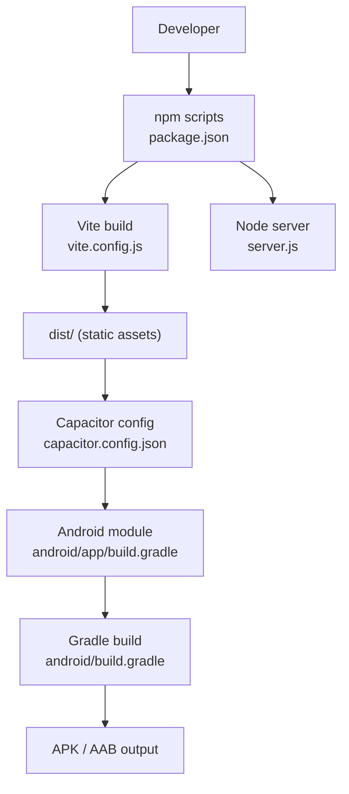
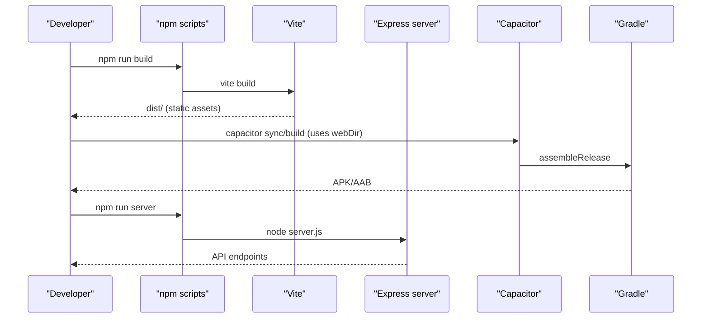
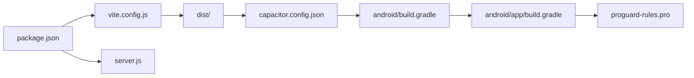

# Build Processes

<cite>
**Referenced Files in This Document**
- [vite.config.js](file://vite.config.js)
- [package.json](file://package.json)
- [server.js](file://server.js)
- [android/build.gradle](file://android/build.gradle)
- [android/app/build.gradle](file://android/app/build.gradle)
- [android/gradle.properties](file://android/gradle.properties)
- [android/variables.gradle](file://android/variables.gradle)
- [android/app/proguard-rules.pro](file://android/app/proguard-rules.pro)
- [capacitor.config.json](file://capacitor.config.json)
</cite>

## Table of Contents
1. [Introduction](#introduction)
2. [Project Structure](#project-structure)
3. [Core Components](#core-components)
4. [Architecture Overview](#architecture-overview)
5. [Detailed Component Analysis](#detailed-component-analysis)
6. [Dependency Analysis](#dependency-analysis)
7. [Performance Considerations](#performance-considerations)
8. [Troubleshooting Guide](#troubleshooting-guide)
9. [Conclusion](#conclusion)

## Introduction
This document explains the end-to-end build processes for Project Anime across three targets:
- React frontend built with Vite
- Node.js Express server
- Android app via Capacitor and Gradle

It covers configuration, optimization, asset processing, bundle analysis guidance, signing and ProGuard setup, multi-platform strategies, dependency management, caching, and troubleshooting.

## Project Structure
The project is a hybrid web/mobile application:
- Frontend: React + Vite (development server with proxying)
- Backend: Express server handling API, proxies, and streaming helpers
- Mobile: Capacitor-based Android app that packages the Vite-built assets into an APK/AAB

**Diagram sources**
- [package.json:6-12](file://package.json#L6-L12)
- [vite.config.js:1-22](file://vite.config.js#L1-L22)
- [capacitor.config.json:1-32](file://capacitor.config.json#L1-L32)
- [android/app/build.gradle:1-55](file://android/app/build.gradle#L1-L55)
- [android/build.gradle:1-30](file://android/build.gradle#L1-L30)

**Section sources**
- [package.json:6-12](file://package.json#L6-L12)
- [vite.config.js:1-22](file://vite.config.js#L1-L22)
- [capacitor.config.json:1-32](file://capacitor.config.json#L1-L32)
- [android/app/build.gradle:1-55](file://android/app/build.gradle#L1-L55)
- [android/build.gradle:1-30](file://android/build.gradle#L1-L30)

## Core Components
- Vite frontend build: development server with proxy rules; production build outputs static assets to dist/.
- Node.js server: Express app serving APIs, image/subtitle/HLS proxies, and streaming helpers.
- Android build: Gradle builds the Capacitor Android app using compiled assets from dist/.

Key entry points:
- Frontend dev/build: npm run dev / npm run build
- Server: npm run server or npm start
- Android: Gradle tasks via android/gradlew

**Section sources**
- [package.json:6-12](file://package.json#L6-L12)
- [server.js:1-20](file://server.js#L1-L20)
- [android/app/build.gradle:1-25](file://android/app/build.gradle#L1-L25)

## Architecture Overview
The build pipeline integrates three layers:
- Web layer: Vite compiles React code, applies plugins, and serves a dev server with proxy rules for backend and third-party APIs.
- API layer: Express provides endpoints for content discovery, streaming proxies, and metadata retrieval.
- Mobile layer: Capacitor wraps the built web assets into an Android app; Gradle compiles native code and produces installable artifacts.

**Diagram sources**
- [package.json:6-12](file://package.json#L6-L12)
- [vite.config.js:1-22](file://vite.config.js#L1-L22)
- [capacitor.config.json:1-32](file://capacitor.config.json#L1-L32)
- [android/app/build.gradle:1-55](file://android/app/build.gradle#L1-L55)
- [android/build.gradle:1-30](file://android/build.gradle#L1-L30)

## Detailed Component Analysis

### Vite Build Configuration (React Frontend)
- Plugin: React plugin is enabled for JSX support.
- Development server:
  - Proxy /anilist-proxy to GraphQL endpoint with origin rewriting.
  - Proxy /api to local backend on port 8080 so mobile/LAN clients can reach the server without extra env vars.
- Production build:
  - Outputs optimized static assets to dist/ (default behavior).
  - Asset processing handled by Vite’s defaults (JS/CSS/images are bundled and hashed).

Optimization notes:
- The current Vite config does not explicitly enable minification toggles or chunk splitting options; default production optimizations apply.
- To analyze bundles, add a dedicated analyzer script/plugin to your toolchain and run it during build.

Asset processing:
- Images and fonts are processed by Vite’s asset pipeline and emitted under dist/assets with content hashes.
- Public files under public/ are copied as-is into dist/.

Development workflow:
- Use npm run dev to start the Vite dev server with proxy rules.
- Use npm run preview to serve the built dist/ locally for testing.

**Section sources**
- [vite.config.js:1-22](file://vite.config.js#L1-L22)
- [package.json:6-12](file://package.json#L6-L12)

### Node.js Server Build and Runtime (Express)
- Entry point: server.js initializes Express, middleware (CORS, JSON parsing), and routes.
- Key responsibilities:
  - Image proxy endpoints to bypass CORS/hotlink restrictions.
  - Subtitle proxy for VTT files.
  - HLS/M3U8 manifest proxy that rewrites URLs to route through backend for referer and CDN compatibility.
  - TS segment proxy that forwards Range headers for efficient streaming.
  - Health check endpoint exposing service status and configuration.
- Environment-driven behavior:
  - PORT, CORS_ORIGIN, provider base URLs, and fallback endpoints are read from environment variables.

Build process:
- No transpilation step is configured; server runs directly with Node using ES modules (type: module in package.json).
- Dependencies are resolved at runtime from node_modules.

Runtime considerations:
- Streaming proxies rely on correct Referer/Origin headers and handle retries for protected streams.
- In-memory caches reduce repeated external calls for episode lists and stream data.

**Section sources**
- [server.js:1-20](file://server.js#L1-L20)
- [server.js:152-199](file://server.js#L152-L199)
- [server.js:235-345](file://server.js#L235-L345)
- [server.js:354-393](file://server.js#L354-L393)
- [server.js:715-735](file://server.js#L715-L735)

### Android App Build Pipeline (Capacitor + Gradle)
- Capacitor integration:
  - webDir set to dist/, meaning the Android app consumes the Vite build output.
  - Plugin configurations for SplashScreen, StatusBar, Keyboard, and Android-specific WebView settings.
- Gradle configuration:
  - Top-level build file defines repositories and classpath dependencies for Android Gradle plugin and Google Services.
  - Module build file sets namespace, SDK versions, versionCode/versionName, and release build type with ProGuard rules applied.
  - Variables centralized in variables.gradle (compileSdk, targetSdk, minSdk, library versions).
  - Optional Google Services plugin applied if google-services.json exists.

Signing and release artifacts:
- Release build type is defined with ProGuard rules included.
- Signing configuration is not present in the provided files; configure signing in Gradle when preparing signed releases.
- Gradle assembleRelease will produce APK/AAB depending on module configuration and Gradle plugin capabilities.

ProGuard:
- proguard-rules.pro is referenced in the release build type.
- Current rules are minimal; add keep rules for any reflection, JS interfaces, or libraries requiring preservation.

**Section sources**
- [capacitor.config.json:1-32](file://capacitor.config.json#L1-L32)
- [android/build.gradle:1-30](file://android/build.gradle#L1-L30)
- [android/app/build.gradle:1-55](file://android/app/build.gradle#L1-L55)
- [android/variables.gradle:1-16](file://android/variables.gradle#L1-L16)
- [android/app/proguard-rules.pro:1-22](file://android/app/proguard-rules.pro#L1-L22)

### Multi-Platform Build Strategy
- Web: Vite builds once to dist/; served by Node server or static hosting.
- Android: Capacitor consumes dist/ and Gradle builds native wrapper and assets into installable artifacts.
- iOS: Not present in this repository; would require adding Capacitor iOS platform and corresponding build steps.

Dependency management:
- Frontend and server dependencies managed via npm (package.json).
- Android dependencies managed via Gradle (build.gradle and variables.gradle).

Build caching:
- Vite uses its own cache for fast rebuilds.
- Gradle supports parallel execution and incremental builds; ensure daemon is running and consider enabling parallel mode for faster builds.

**Section sources**
- [package.json:14-43](file://package.json#L14-L43)
- [android/gradle.properties:10-22](file://android/gradle.properties#L10-L22)
- [android/build.gradle:1-30](file://android/build.gradle#L1-L30)

## Dependency Analysis
Frontend and server share a single package.json; Android dependencies are isolated in Gradle.

**Diagram sources**
- [package.json:6-43](file://package.json#L6-L43)
- [vite.config.js:1-22](file://vite.config.js#L1-L22)
- [capacitor.config.json:1-32](file://capacitor.config.json#L1-L32)
- [android/build.gradle:1-30](file://android/build.gradle#L1-L30)
- [android/app/build.gradle:1-55](file://android/app/build.gradle#L1-L55)
- [android/app/proguard-rules.pro:1-22](file://android/app/proguard-rules.pro#L1-L22)

**Section sources**
- [package.json:14-43](file://package.json#L14-L43)
- [android/build.gradle:1-30](file://android/build.gradle#L1-L30)
- [android/app/build.gradle:1-55](file://android/app/build.gradle#L1-L55)

## Performance Considerations
- Vite:
  - Default production build includes minification and tree-shaking.
  - For large bundles, consider adding a bundle analyzer plugin and optimizing imports/chunking.
  - Keep assets small; leverage lazy loading for heavy components where possible.
- Node server:
  - Streaming proxies forward Range headers to avoid full downloads; ensure upstream servers honor Range requests.
  - Use in-memory caches judiciously; monitor memory usage under load.
  - Tune timeouts and retry logic for resilient streaming.
- Android:
  - Enable ProGuard/R8 for release builds to shrink and optimize code.
  - Configure signing properly for release artifacts.
  - Use Gradle parallel builds and daemon to speed up iterations.

[No sources needed since this section provides general guidance]

## Troubleshooting Guide
Common issues and resolutions:

- Vite dev server cannot reach backend:
  - Ensure the Express server is running on the expected port and CORS allows your origin.
  - Verify /api proxy in Vite config points to the correct backend URL.

- CORS errors in browser:
  - Confirm server enables CORS and sets appropriate origins.
  - Check that proxied requests include required headers like Referer/Origin for protected resources.

- HLS playback fails:
  - Ensure m3u8-proxy and ts-proxy endpoints are reachable and rewrite URLs correctly.
  - Validate that Range headers are forwarded for segment requests.

- Android build fails due to missing signing:
  - Add signing configuration for release builds in Gradle before generating signed artifacts.

- ProGuard removes needed classes:
  - Add keep rules in proguard-rules.pro for libraries using reflection or JS bridges.

- Capacitor assets not updated:
  - Re-run the Vite build to regenerate dist/ before syncing/building the Android app.

**Section sources**
- [vite.config.js:7-21](file://vite.config.js#L7-L21)
- [server.js:152-199](file://server.js#L152-L199)
- [server.js:235-345](file://server.js#L235-L345)
- [server.js:354-393](file://server.js#L354-L393)
- [android/app/build.gradle:19-24](file://android/app/build.gradle#L19-L24)
- [android/app/proguard-rules.pro:1-22](file://android/app/proguard-rules.pro#L1-L22)
- [capacitor.config.json:1-32](file://capacitor.config.json#L1-L32)

## Conclusion
Project Anime’s build system integrates Vite for the React frontend, an Express server for APIs and streaming proxies, and Capacitor/Gradle for Android packaging. The current configuration emphasizes simplicity and rapid iteration, with clear extension points for optimization (bundle analysis, signing, ProGuard tuning). Following the guidelines above ensures reliable builds across platforms and robust performance in production environments.

[No sources needed since this section summarizes without analyzing specific files]