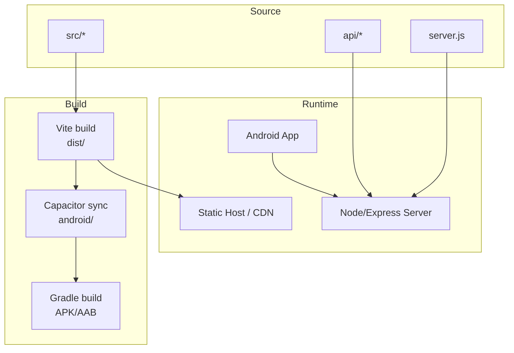
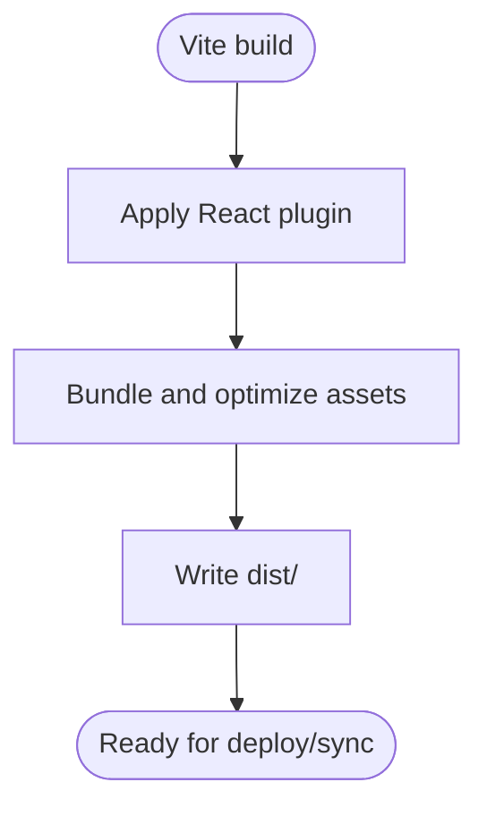
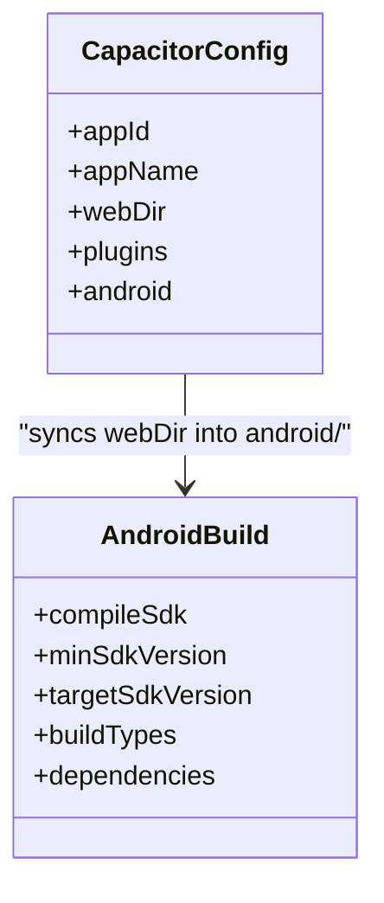
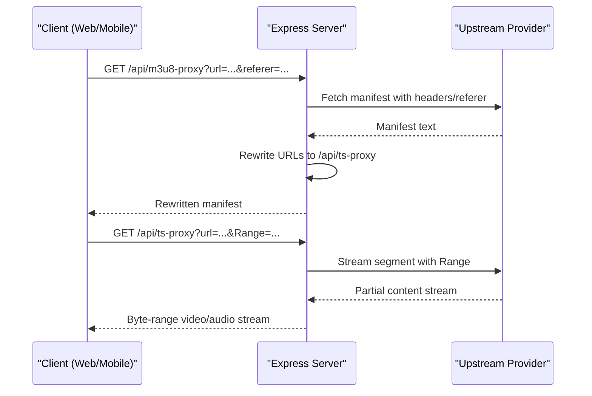
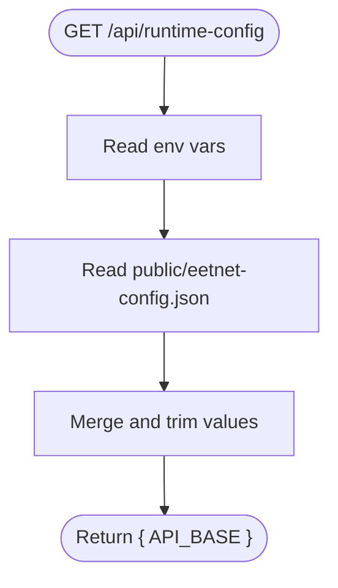
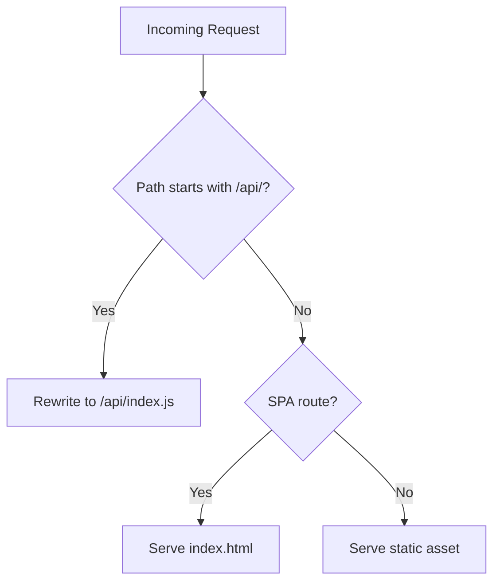
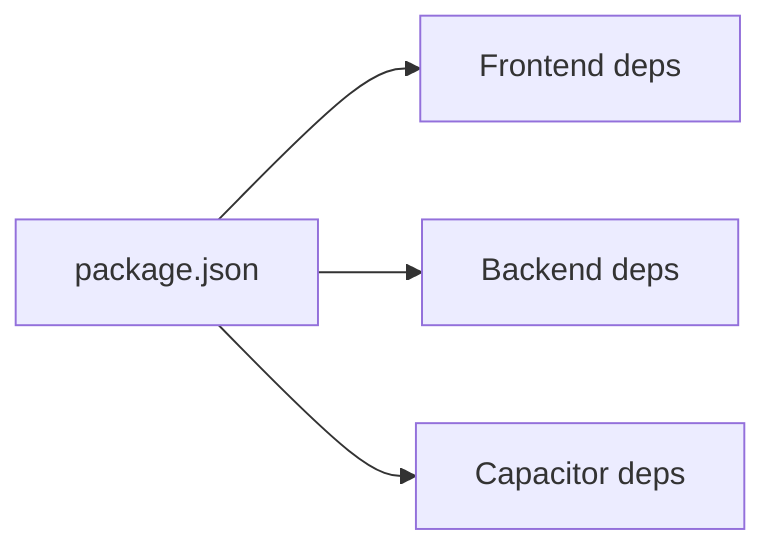

# Multi-Platform Build Strategy

<cite>
**Referenced Files in This Document**
- [package.json](file://package.json)
- [vite.config.js](file://vite.config.js)
- [capacitor.config.json](file://capacitor.config.json)
- [android/app/build.gradle](file://android/app/build.gradle)
- [android/build.gradle](file://android/build.gradle)
- [android/gradle.properties](file://android/gradle.properties)
- [android/app/capacitor.build.gradle](file://android/app/capacitor.build.gradle)
- [server.js](file://server.js)
- [api/index.js](file://api/index.js)
- [api/runtime-config.js](file://api/runtime-config.js)
- [vercel.json](file://vercel.json)
</cite>

## Table of Contents
1. [Introduction](#introduction)
2. [Project Structure](#project-structure)
3. [Core Components](#core-components)
4. [Architecture Overview](#architecture-overview)
5. [Detailed Component Analysis](#detailed-component-analysis)
6. [Dependency Analysis](#dependency-analysis)
7. [Performance Considerations](#performance-considerations)
8. [Troubleshooting Guide](#troubleshooting-guide)
9. [Conclusion](#conclusion)

## Introduction
This document explains the multi-platform build strategy that coordinates building for web, mobile (Android via Capacitor), and server environments. It covers shared dependencies management, environment-specific configurations, cross-platform asset handling, CI/CD considerations, caching strategies, parallel build optimizations, platform-specific optimizations, conditional compilation, deployment targets, and how to maintain consistency while leveraging platform-specific features.

## Project Structure
The project uses a single codebase with Vite for the web frontend, Node/Express for the backend API, and Capacitor to wrap the built web assets into an Android app. The same source tree produces:
- Web: A static site under dist/ served by Vite or any static host.
- Mobile: An Android APK/AAB produced by Gradle using Capacitor’s generated native wrapper around the dist/ output.
- Server: A Node.js Express application exposing APIs and proxies for streaming and images.



**Diagram sources**
- [vite.config.js:1-23](file://vite.config.js#L1-L23)
- [capacitor.config.json:1-32](file://capacitor.config.json#L1-L32)
- [android/app/build.gradle:1-55](file://android/app/build.gradle#L1-L55)
- [server.js:1-800](file://server.js#L1-L800)

**Section sources**
- [package.json:1-45](file://package.json#L1-L45)
- [vite.config.js:1-23](file://vite.config.js#L1-L23)
- [capacitor.config.json:1-32](file://capacitor.config.json#L1-L32)
- [android/app/build.gradle:1-55](file://android/app/build.gradle#L1-L55)

## Core Components
- Frontend build tooling: Vite with React plugin, dev server proxy configuration for local development.
- Mobile wrapper: Capacitor config points to the web build directory and configures splash screen, status bar, and keyboard behavior for Android.
- Android build: Gradle scripts define compile SDK, min/target SDK versions, release build type, and Capacitor plugin integration.
- Backend server: Express app provides APIs, image proxies, HLS/M3U8 and TS segment proxies, subtitle proxy, and health endpoints.
- Deployment: Vercel rewrites route /api/* to the serverless handler; runtime configuration endpoint exposes API base URL to clients.

Key responsibilities:
- Shared dependencies are declared in package.json for both web and server.
- Environment variables drive runtime behavior on the server and can be injected into the client via a runtime config endpoint.
- Cross-platform assets are centralized under public/ and packaged into the Android app through Capacitor.

**Section sources**
- [package.json:14-43](file://package.json#L14-L43)
- [vite.config.js:5-22](file://vite.config.js#L5-L22)
- [capacitor.config.json:1-32](file://capacitor.config.json#L1-L32)
- [android/app/build.gradle:3-25](file://android/app/build.gradle#L3-L25)
- [server.js:1-800](file://server.js#L1-L800)
- [vercel.json:1-22](file://vercel.json#L1-L22)

## Architecture Overview
The system builds once from a common source tree and deploys across platforms:
- Web: Vite compiles src/ into optimized static assets under dist/. These assets are served by a static host or CDN.
- Mobile: Capacitor copies dist/ into the Android project and generates native wrappers. Gradle builds the final Android artifact.
- Server: The Express server runs as a standalone process or serverless function, providing APIs and media proxies.

```mermaid
sequenceDiagram
participant Dev as "Developer"
participant Vite as "Vite"
participant Cap as "Capacitor"
participant Gradle as "Gradle"
participant Web as "Web Host"
participant And as "Android App"
participant Srv as "Server"
Dev->>Vite : Run build
Vite-->>Dev : Output dist/
Dev->>Cap : Sync webDir to android/
Cap-->>Gradle : Generate Android project
Gradle-->>And : Build APK/AAB
Dev->>Srv : Deploy server code
And->>Srv : Call /api/* at runtime
Web->>Srv : Call /api/* at runtime
```

**Diagram sources**
- [vite.config.js:5-22](file://vite.config.js#L5-L22)
- [capacitor.config.json:1-32](file://capacitor.config.json#L1-L32)
- [android/app/build.gradle:1-55](file://android/app/build.gradle#L1-L55)
- [server.js:1-800](file://server.js#L1-L800)

## Detailed Component Analysis

### Web Build (Vite)
- Uses React plugin and defines a dev server proxy to forward specific paths to external services and the local backend during development.
- Production builds produce static assets under dist/, which are consumed by both web hosting and the Android app via Capacitor.



**Diagram sources**
- [vite.config.js:1-23](file://vite.config.js#L1-L23)

**Section sources**
- [vite.config.js:5-22](file://vite.config.js#L5-L22)
- [package.json:6-12](file://package.json#L6-L12)

### Mobile Build (Capacitor + Android/Gradle)
- Capacitor is configured to use dist/ as the webDir and sets platform-specific options like splash screen, status bar, and keyboard behavior.
- Gradle defines compile/target SDKs, release build type, and includes Capacitor plugins. The Android module integrates Cordova plugins if present.



**Diagram sources**
- [capacitor.config.json:1-32](file://capacitor.config.json#L1-L32)
- [android/app/build.gradle:1-55](file://android/app/build.gradle#L1-L55)

**Section sources**
- [capacitor.config.json:1-32](file://capacitor.config.json#L1-L32)
- [android/app/build.gradle:3-25](file://android/app/build.gradle#L3-L25)
- [android/build.gradle:1-30](file://android/build.gradle#L1-L30)
- [android/gradle.properties:10-23](file://android/gradle.properties#L10-L23)
- [android/app/capacitor.build.gradle:1-25](file://android/app/capacitor.build.gradle#L1-L25)

### Server Runtime (Express)
- Provides APIs for health, episode metadata, and media proxies (images, subtitles, HLS manifests, and TS segments).
- Proxies handle CORS, referer/origin requirements, range requests for efficient streaming, and provider-specific header adjustments.
- Supports Vercel serverless by normalizing request URLs and exporting the app instance.



**Diagram sources**
- [server.js:235-393](file://server.js#L235-L393)

**Section sources**
- [server.js:1-800](file://server.js#L1-L800)
- [api/index.js:1-4](file://api/index.js#L1-L4)

### Runtime Configuration and Environment Variables
- The server exposes a runtime configuration endpoint that reads from environment variables and a static JSON file to determine the API base URL for clients.
- This enables consistent client behavior across environments without rebuilding.



**Diagram sources**
- [api/runtime-config.js:1-25](file://api/runtime-config.js#L1-L25)

**Section sources**
- [api/runtime-config.js:1-25](file://api/runtime-config.js#L1-L25)

### Deployment Targets and Routing
- Vercel configuration rewrites /api/* to the serverless handler and ensures index.html is not cached aggressively.
- Static assets are served directly; SPA routing falls back to index.html for client-side routes.



**Diagram sources**
- [vercel.json:1-22](file://vercel.json#L1-L22)

**Section sources**
- [vercel.json:1-22](file://vercel.json#L1-L22)

## Dependency Analysis
Shared dependencies are managed centrally in package.json:
- Frontend dependencies include React ecosystem and UI libraries.
- Server dependencies include Express, HTTP client libraries, and scraping utilities.
- Capacitor packages enable native feature access from the web layer when running on Android.



**Diagram sources**
- [package.json:14-43](file://package.json#L14-L43)

**Section sources**
- [package.json:14-43](file://package.json#L14-L43)

## Performance Considerations
- Caching strategies:
  - Image proxy caches responses with short TTLs to reduce upstream load.
  - Episode metadata and catalog data are cached in-memory with time-to-live windows to minimize repeated network calls.
  - HLS manifest and segment proxies preserve Range headers to avoid full downloads and improve startup times.
- Parallelism:
  - Android Gradle supports parallel execution; ensure org.gradle.parallel=true in CI for faster builds.
  - Vite build is inherently fast due to modern bundling; consider enabling incremental builds in CI caches.
- Streaming efficiency:
  - Range requests and partial content passthrough reduce bandwidth and latency for video playback.
  - Referer/Origin normalization avoids provider blocks and reduces retries.

[No sources needed since this section provides general guidance]

## Troubleshooting Guide
Common issues and where to look:
- CORS and origin mismatches:
  - Ensure the server’s CORS settings allow the client origin and that proxies set appropriate Access-Control-Allow-Origin headers.
- HLS playback failures:
  - Verify that /api/m3u8-proxy rewrites nested playlist and segment URLs correctly and that /api/ts-proxy forwards Range headers.
- Provider blocks:
  - Adjust User-Agent, Referer, and Origin headers in the proxy logic to match provider expectations.
- Android build errors:
  - Confirm compileSdk, minSdkVersion, targetSdkVersion, and Java compatibility align with installed tools.
  - Check Capacitor plugin integrations and version compatibility.

**Section sources**
- [server.js:150-393](file://server.js#L150-L393)
- [android/app/build.gradle:3-25](file://android/app/build.gradle#L3-L25)
- [android/app/capacitor.build.gradle:1-25](file://android/app/capacitor.build.gradle#L1-L25)

## Conclusion
This multi-platform strategy leverages a single source tree to deliver web, mobile, and server experiences efficiently:
- Vite builds a performant web bundle consumed by both web hosts and the Android app.
- Capacitor bridges the web bundle into a native Android app with platform-specific configurations.
- The Express server centralizes media proxies and APIs, ensuring consistent behavior across platforms.
- Environment-driven configuration and runtime endpoints decouple deployments from code changes.
Adopting the recommended caching, parallelization, and platform-specific optimizations will improve build times, runtime performance, and reliability across all targets.