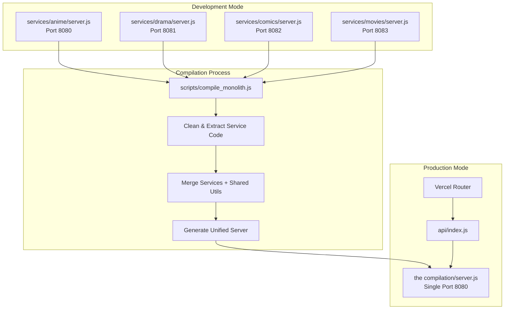
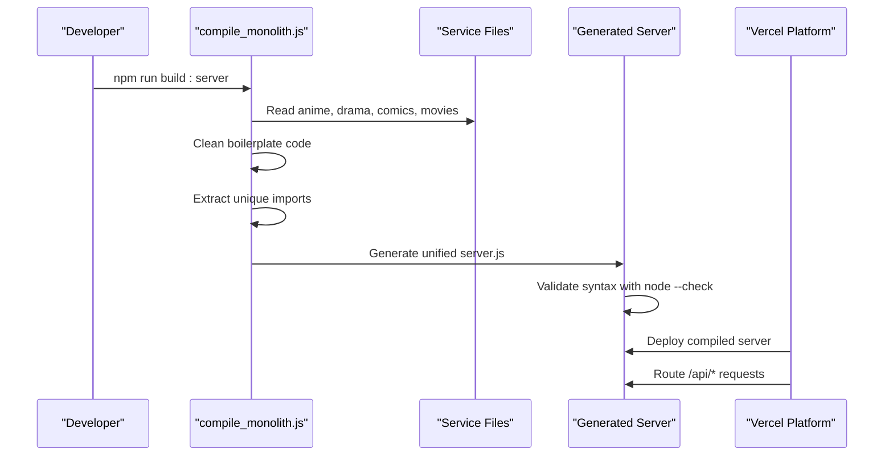
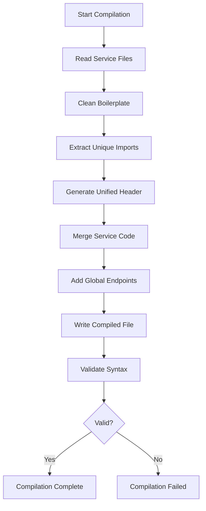
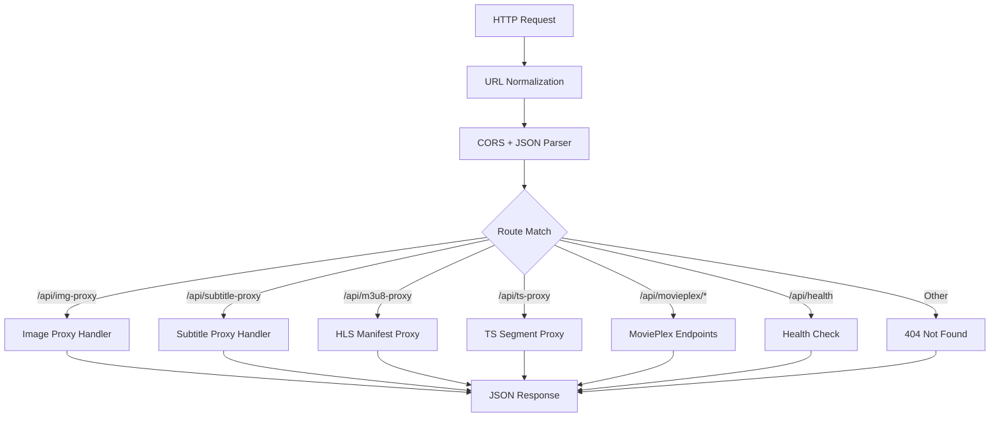
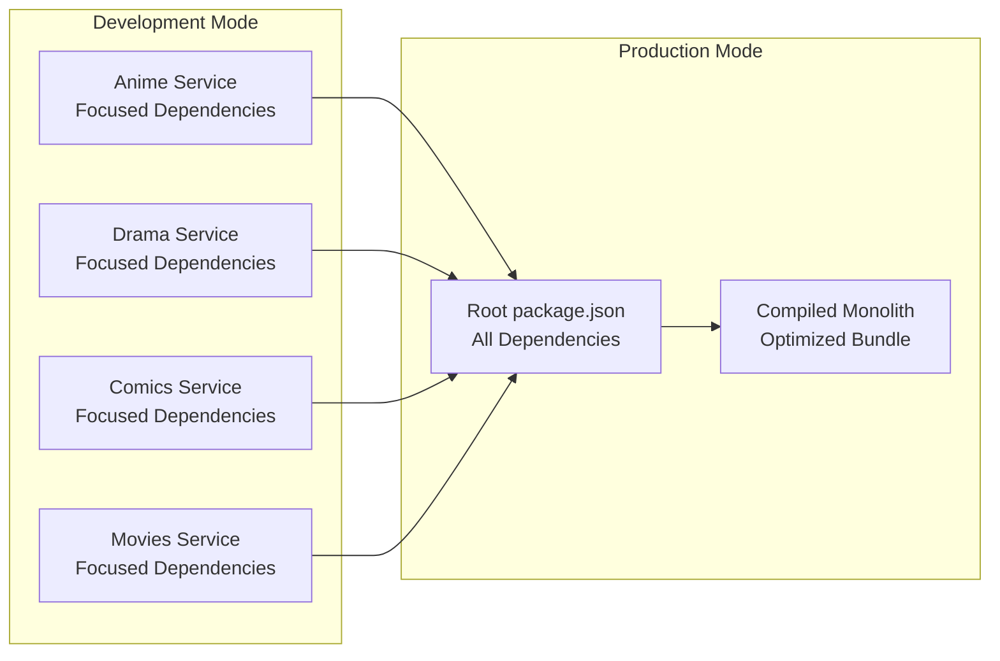

# Server Build Process

<cite>
**Referenced Files in This Document**
- [server.js](file://server.js)
- [scripts/compile_monolith.js](file://scripts/compile_monolith.js)
- [the compilation/server.js](file://the compilation/server.js)
- [services/anime/server.js](file://services/anime/server.js)
- [services/drama/server.js](file://services/drama/server.js)
- [services/comics/server.js](file://services/comics/server.js)
- [services/movies/server.js](file://services/movies/server.js)
- [api/index.js](file://api/index.js)
- [api/runtime-config.js](file://api/runtime-config.js)
- [vercel.json](file://vercel.json)
- [package.json](file://package.json)
- [vite.config.js](file://vite.config.js)
- [public/eetnet-config.json](file://public/eetnet-config.json)
- [src/runtimeConfig.js](file://src/runtimeConfig.js)
- [src/main.jsx](file://src/main.jsx)
- [scripts/test_all_services.js](file://scripts/test_all_services.js)
- [scripts/audit_services.js](file://scripts/audit_services.js)
</cite>

## Update Summary
**Changes Made**
- Added comprehensive documentation for the new automated monolith compilation system via `scripts/compile_monolith.js`
- Updated build process architecture to reflect both microservices development and compiled monolith deployment modes
- Enhanced section on service organization showing how four independent services (anime, drama, comics, movies) are combined into a unified server
- Added new diagrams illustrating the compilation pipeline and dual deployment strategies
- Updated package.json scripts to document the new build commands

## Table of Contents
1. [Introduction](#introduction)
2. [Project Structure](#project-structure)
3. [Core Components](#core-components)
4. [Architecture Overview](#architecture-overview)
5. [Monolith Compilation System](#monolith-compilation-system)
6. [Detailed Component Analysis](#detailed-component-analysis)
7. [Dependency Analysis](#dependency-analysis)
8. [Performance Considerations](#performance-considerations)
9. [Troubleshooting Guide](#troubleshooting-guide)
10. [Conclusion](#conclusion)
11. [Appendices](#appendices)

## Introduction
This document explains the Node.js server build process for this project, focusing on the new automated compilation system that combines four independent microservices into a unified monolith server. The system supports both microservices development mode (running separate servers for anime, drama, comics, and movies) and compiled monolith deployment mode (single server with all services). It details how Express.js applications are organized as modular services, the compilation pipeline that merges them into a high-performance monolith, API endpoint bundling, runtime configuration management, and Vercel serverless deployment integration.

## Project Structure
The backend now operates in two distinct modes:

**Microservices Development Mode:**
- Four independent Express applications in `services/{anime,drama,comics,movies}/server.js`
- Each service runs on its own port (8080-8083) during development
- Individual testing and debugging capabilities per service

**Compiled Monolith Deployment Mode:**
- Single unified server generated by `scripts/compile_monolith.js`
- All four services combined into `the compilation/server.js`
- Shared middleware, utilities, and global health endpoints
- Optimized for production deployment

**Diagram sources**
- [scripts/compile_monolith.js:31-43](file://scripts/compile_monolith.js#L31-L43)
- [scripts/compile_monolith.js:193-246](file://scripts/compile_monolith.js#L193-L246)
- [the compilation/server.js:1-46](file://the compilation/server.js#L1-L46)

**Section sources**
- [scripts/compile_monolith.js:31-43](file://scripts/compile_monolith.js#L31-L43)
- [services/anime/server.js:1-25](file://services/anime/server.js#L1-L25)
- [services/drama/server.js:1-26](file://services/drama/server.js#L1-L26)
- [services/comics/server.js:1-26](file://services/comics/server.js#L1-L26)
- [services/movies/server.js:1-25](file://services/movies/server.js#L1-L25)

## Core Components
- **Monolith Compiler**: `scripts/compile_monolith.js` - Automated compilation system that reads, cleans, and merges four microservices into a unified server
- **Service Modules**: Independent Express applications in `services/` directory, each handling specific content types
- **Unified Output**: Generated monolith server at `the compilation/server.js` with shared middleware and global endpoints
- **Vercel Adapter**: `api/index.js` re-exports the Express app for serverless deployment
- **Runtime Configuration**: `api/runtime-config.js` serves dynamic configuration from environment variables or static files
- **Development Proxy**: Vite proxies `/api` requests to local Node server during development

Key responsibilities:
- Environment-driven configuration via process.env and static files
- Centralized CORS and JSON parsing middleware
- Streaming proxies for HLS manifests and segments to bypass CORS and handle range requests
- Provider integrations for anime, drama, manga, and movies content
- Automated service compilation and validation

**Section sources**
- [scripts/compile_monolith.js:1-260](file://scripts/compile_monolith.js#L1-L260)
- [api/index.js:1-4](file://api/index.js#L1-L4)
- [api/runtime-config.js:4-24](file://api/runtime-config.js#L4-L24)
- [vite.config.js:7-21](file://vite.config.js#L7-L21)

## Architecture Overview
The system now supports dual deployment strategies:

**Development Workflow:**
- Run individual services on separate ports for isolated development
- Use test suite to validate all services simultaneously
- Debug each service independently with focused logging

**Production Workflow:**
- Compile all services into single optimized server
- Deploy unified application to Vercel or other platforms
- Benefit from shared resources and reduced memory footprint

**Diagram sources**
- [scripts/compile_monolith.js:24-43](file://scripts/compile_monolith.js#L24-L43)
- [scripts/compile_monolith.js:251-259](file://scripts/compile_monolith.js#L251-L259)
- [package.json:6-13](file://package.json#L6-L13)

## Monolith Compilation System

### Automated Compilation Pipeline
The `scripts/compile_monolith.js` script implements a sophisticated compilation system that transforms four independent microservices into a single, optimized server:

**Step 1: Service Discovery and Reading**
- Scans `services/` directory for anime, drama, comics, and movies modules
- Reads each service's server.js file and validates existence
- Stores source code for processing

**Step 2: Code Cleaning and Normalization**
- Removes service-specific boilerplate (Express initialization, middleware setup)
- Strips duplicate imports and conflicting configurations
- Preserves service-specific routes and business logic
- Adds module headers for identification

**Step 3: Unified Header Generation**
- Creates shared Express application instance
- Configures global middleware (CORS, JSON parsing, URL normalization)
- Establishes common utility functions (publicHost, safeOrigin, streamProxyHeaders)
- Sets up shared caching mechanisms

**Step 4: Service Integration**
- Merges cleaned service code sequentially
- Maintains route isolation while sharing infrastructure
- Generates unified health and status endpoints
- Adds comprehensive error handling

**Step 5: Validation and Output**
- Writes compiled server to `the compilation/server.js`
- Runs syntax validation using `node --check`
- Provides detailed compilation statistics

**Diagram sources**
- [scripts/compile_monolith.js:24-43](file://scripts/compile_monolith.js#L24-L43)
- [scripts/compile_monolith.js:57-122](file://scripts/compile_monolith.js#L57-L122)
- [scripts/compile_monolith.js:124-191](file://scripts/compile_monolith.js#L124-L191)
- [scripts/compile_monolith.js:193-246](file://scripts/compile_monolith.js#L193-L246)
- [scripts/compile_monolith.js:248-259](file://scripts/compile_monolith.js#L248-L259)

### Service Organization
Each service maintains independence while contributing to the unified server:

**Anime Service** (`services/anime/server.js`)
- Anime streaming providers (HiAnime, AnimeKai, AnimeUnity)
- Episode metadata and search functionality
- HLS streaming proxy integration

**Drama Service** (`services/drama/server.js`)
- Drama catalog and search via KissKH
- Episode streaming resolution
- Subtitle support and HLS proxy

**Comics Service** (`services/comics/server.js`)
- Manga/manhwa/manhua catalog from ComicK
- Webtoon integration with AniList
- Chapter reading and image proxy

**Movies Service** (`services/movies/server.js`)
- MoviePlex integration with TMDB poster enhancement
- NetMirror streaming service integration
- Catalog building and thumbnail generation

**Section sources**
- [scripts/compile_monolith.js:31-43](file://scripts/compile_monolith.js#L31-L43)
- [scripts/compile_monolith.js:57-122](file://scripts/compile_monolith.js#L57-L122)
- [scripts/compile_monolith.js:193-246](file://scripts/compile_monolith.js#L193-L246)

## Detailed Component Analysis

### Express Application Entry Point (server.js)
The original standalone server continues to function as a complete Express application with all features integrated:

- Initializes Express, sets trust proxy, reads PORT and provider base URLs from environment variables
- Applies CORS middleware using CORS_ORIGIN and parses JSON bodies
- Normalizes request URLs for Vercel serverless by prefixing non-/api paths with /api
- Provides utility functions for computing public host, unwrapping nested proxy URLs, and generating safe headers for stream proxies
- Implements multiple route groups including image proxies, subtitle proxies, HLS manifest proxies, TS segment proxies, and provider integrations
- Starts listening only when not running under VERCEL environment

**Diagram sources**
- [server.js:22-28](file://server.js#L22-L28)
- [server.js:152-199](file://server.js#L152-L199)
- [server.js:235-256](file://server.js#L235-L256)
- [server.js:263-345](file://server.js#L263-L345)
- [server.js:354-393](file://server.js#L354-L393)

**Section sources**
- [server.js:10-21](file://server.js#L10-L21)
- [server.js:22-28](file://server.js#L22-L28)
- [server.js:152-199](file://server.js#L152-L199)
- [server.js:235-256](file://server.js#L235-L256)
- [server.js:263-345](file://server.js#L263-L345)
- [server.js:354-393](file://server.js#L354-L393)
- [server.js:715-735](file://server.js#L715-L735)

### Monolith Compiler (scripts/compile_monolith.js)
The compilation system provides sophisticated code transformation capabilities:

**Code Cleaning Functionality**
- Removes service-specific Express initialization and middleware setup
- Strips duplicate imports and conflicting configurations
- Preserves service-specific routes and business logic
- Adds clear module headers for identification

**Unified Server Generation**
- Creates shared Express application with global middleware
- Integrates all four services into single routing tree
- Generates comprehensive health and status endpoints
- Implements unified error handling and logging

**Validation and Quality Assurance**
- Validates syntax using Node.js built-in checker
- Provides detailed compilation statistics and progress reporting
- Ensures output file integrity before completion

**Section sources**
- [scripts/compile_monolith.js:57-122](file://scripts/compile_monolith.js#L57-L122)
- [scripts/compile_monolith.js:124-191](file://scripts/compile_monolith.js#L124-L191)
- [scripts/compile_monolith.js:193-246](file://scripts/compile_monolith.js#L193-L246)
- [scripts/compile_monolith.js:248-259](file://scripts/compile_monolith.js#L248-L259)

### Vercel Adapter (api/index.js)
- Imports the Express app from server.js and re-exports it as the default module
- Enables Vercel to treat the entire Express app as a serverless function
- Supports both standalone server and compiled monolith deployments

**Section sources**
- [api/index.js:1-4](file://api/index.js#L1-L4)

### Runtime Configuration Endpoint (api/runtime-config.js)
- Reads a static configuration file from public/eetnet-config.json if present
- Resolves API_BASE from environment variables with defined precedence
- Returns JSON with no-store cache control to ensure fresh values per request

**Section sources**
- [api/runtime-config.js:4-24](file://api/runtime-config.js#L4-L24)
- [public/eetnet-config.json:1-4](file://public/eetnet-config.json#L1-L4)

### Frontend Runtime Config Loader
- Loads runtime configuration at startup by fetching /api/runtime-config and falling back to /eetnet-config.json
- Determines the final API base URL considering query overrides, environment variables, static config, and platform-specific logic
- Stores the resolved configuration globally for use by API clients

**Section sources**
- [src/main.jsx:6-14](file://src/main.jsx#L6-L14)
- [src/runtimeConfig.js:82-130](file://src/runtimeConfig.js#L82-L130)

## Dependency Analysis
The system maintains clean dependency separation between development and production modes:

**Development Dependencies:**
- Individual service packages with focused dependencies
- Testing utilities for service validation
- Development server with hot reloading

**Production Dependencies:**
- Unified dependency set in root package.json
- Optimized for single-process deployment
- Shared middleware and utilities

**Diagram sources**
- [package.json:15-36](file://package.json#L15-L36)
- [scripts/compile_monolith.js:45-55](file://scripts/compile_monolith.js#L45-L55)

**Section sources**
- [package.json:15-36](file://package.json#L15-L36)
- [scripts/compile_monolith.js:45-55](file://scripts/compile_monolith.js#L45-L55)

## Performance Considerations
The monolith compilation system provides several performance optimizations:

**Memory Efficiency:**
- Single Node.js process instead of four separate processes
- Shared module instances reduce memory overhead
- Consolidated caching mechanisms prevent redundant data storage

**Network Optimization:**
- Unified proxy handlers reduce connection pooling overhead
- Shared HTTPS agents minimize SSL/TLS handshake costs
- Consolidated rate limiting and request throttling

**Startup Performance:**
- Pre-compiled server eliminates runtime compilation overhead
- Optimized module loading reduces cold start time
- Efficient route registration improves request handling speed

**Caching Strategies:**
- In-memory caches for frequently accessed data
- TTL-based expiration for dynamic content
- Hierarchical caching from service-level to global level

[No sources needed since this section provides general guidance]

## Troubleshooting Guide
Common issues and strategies for both development and production modes:

**Compilation Issues:**
- Missing service files trigger explicit error messages
- Syntax validation catches errors before deployment
- Detailed logging shows compilation progress and file sizes

**Service Conflicts:**
- Port conflicts detected during individual service development
- Route conflicts identified during compilation process
- Environment variable conflicts resolved through precedence rules

**Runtime Errors:**
- Unified error handler captures and logs all exceptions
- Service-specific error contexts preserved in error messages
- Health endpoints provide service status monitoring

**Debugging Tips:**
- Use individual service ports for targeted debugging
- Leverage compilation output for production troubleshooting
- Monitor health endpoints for service availability
- Check console logs for provider-specific tags like [M3U8-PROXY], [TS-PROXY], [JIKAN], [ANIMEKAI]

**Section sources**
- [scripts/compile_monolith.js:37-43](file://scripts/compile_monolith.js#L37-L43)
- [scripts/compile_monolith.js:251-259](file://scripts/compile_monolith.js#L251-L259)
- [server.js:152-199](file://server.js#L152-L199)
- [server.js:235-256](file://server.js#L235-L256)
- [server.js:263-345](file://server.js#L263-L345)
- [server.js:354-393](file://server.js#L354-L393)
- [server.js:715-735](file://server.js#L715-L735)

## Conclusion
The enhanced server build process now provides a flexible architecture supporting both microservices development and compiled monolith deployment. The automated compilation system transforms four independent Express applications into a single, optimized server while maintaining service isolation during development. This approach offers the best of both worlds: granular development experience with independent service testing and streamlined production deployment with unified resource management.

The system successfully addresses the challenges of managing multiple services while providing clear upgrade paths from development to production. The compilation process ensures code quality through validation, maintains service boundaries while enabling resource sharing, and provides comprehensive monitoring and debugging capabilities across both deployment modes.

## Appendices

### Build and Run Commands
**Development Mode:**
- Start individual services: `node services/{anime,drama,comics,movies}/server.js`
- Test all services: `node scripts/test_all_services.js`
- Audit service structure: `node scripts/audit_services.js`

**Production Mode:**
- Compile monolith: `npm run build:server`
- Start compiled server: `npm start` or `npm run server`
- Deploy to Vercel: Standard Vercel deployment with api/index.js adapter

**Frontend Development:**
- Start dev server: `npm run dev`
- Build static assets: `npm run build`
- Preview production build: `npm run preview`

**Section sources**
- [package.json:6-13](file://package.json#L6-L13)
- [scripts/test_all_services.js:47-123](file://scripts/test_all_services.js#L47-L123)
- [scripts/audit_services.js:4-25](file://scripts/audit_services.js#L4-L25)
- [vite.config.js:7-21](file://vite.config.js#L7-L21)
- [vercel.json:16-20](file://vercel.json#L16-L20)

### Service Endpoints Reference
**Anime Service:**
- `/api/health` - Service health check
- `/api/anilist` - GraphQL proxy for AniList
- `/api/info/:anilistId` - Anime metadata
- `/api/gogoanime/watch` - AnimeKai streaming
- `/api/hianime/watch` - HiAnime streaming
- `/api/watch/:episodeId` - AnimeUnity fallback

**Drama Service:**
- `/api/health` - Service health check
- `/api/drama/home` - Drama catalog
- `/api/drama/list` - Drama search
- `/api/drama/info/:dramaId` - Drama details
- `/api/drama/stream/:episodeId` - Episode streaming

**Comics Service:**
- `/api/health` - Service health check
- `/api/manga/home` - Manga catalog
- `/api/manga/category/:type` - Category browsing
- `/api/webtoon/home` - Webtoon catalog
- `/api/manga/read/:chapterId` - Chapter reading

**Movies Service:**
- `/api/health` - Service health check
- `/api/movies/home` - Movie catalog
- `/api/movieplex/catalog` - MoviePlex integration
- `/api/movieplex/stream` - Stream resolution
- `/api/netmirror/search` - NetMirror search

**Section sources**
- [services/anime/server.js:505-800](file://services/anime/server.js#L505-L800)
- [services/drama/server.js:85-411](file://services/drama/server.js#L85-L411)
- [services/comics/server.js:275-788](file://services/comics/server.js#L275-L788)
- [services/movies/server.js:536-800](file://services/movies/server.js#L536-L800)