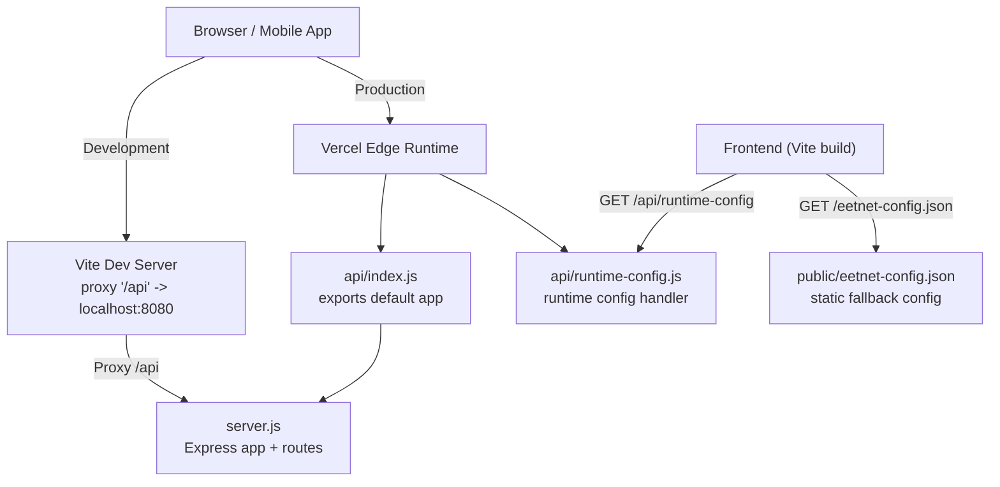
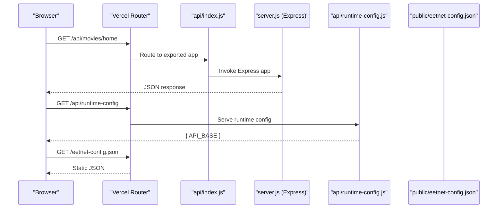
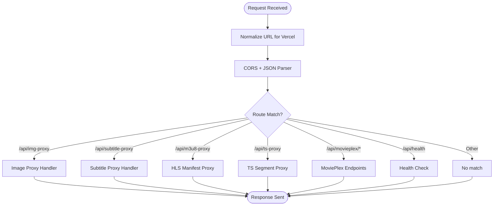
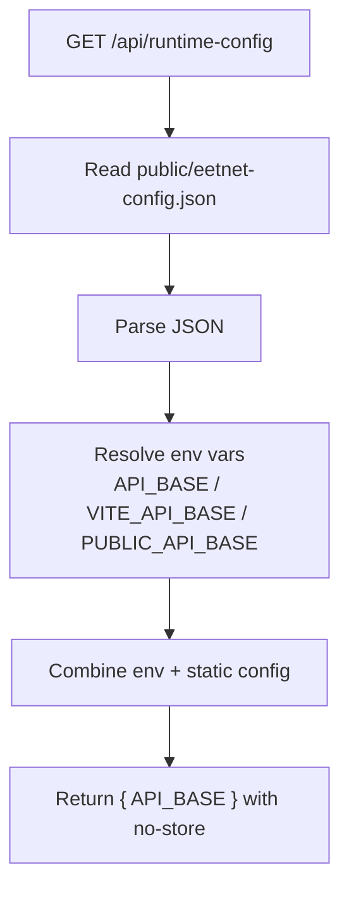
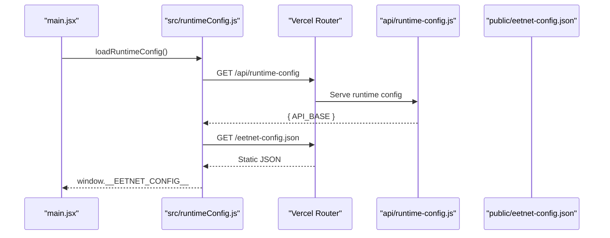
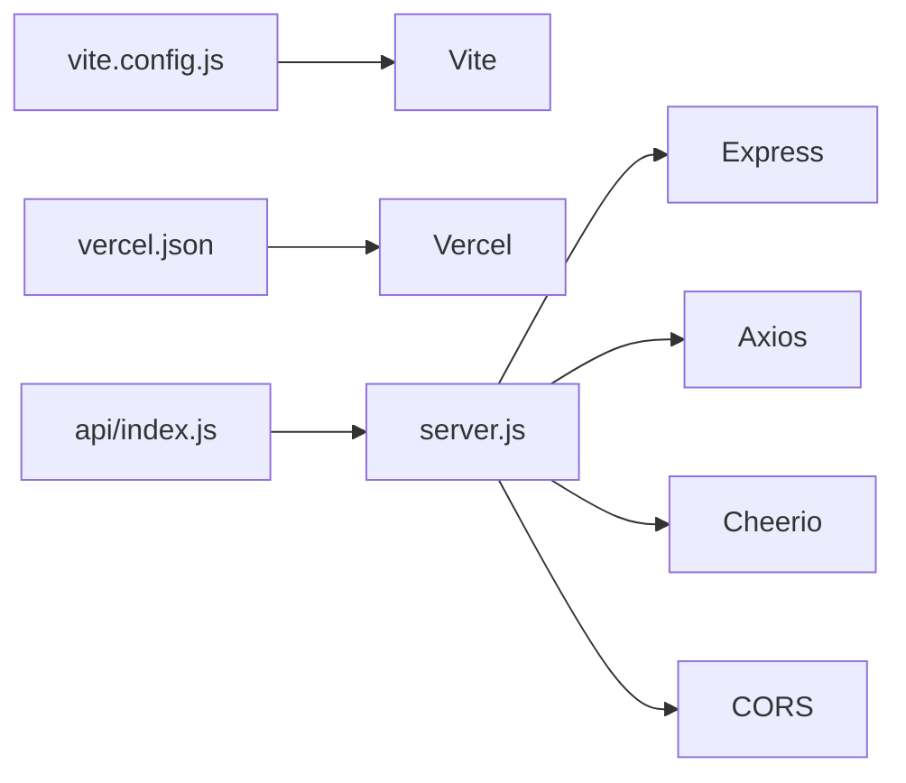

# Server Build Process

<cite>
**Referenced Files in This Document**
- [server.js](file://server.js)
- [api/index.js](file://api/index.js)
- [api/runtime-config.js](file://api/runtime-config.js)
- [vercel.json](file://vercel.json)
- [package.json](file://package.json)
- [vite.config.js](file://vite.config.js)
- [public/eetnet-config.json](file://public/eetnet-config.json)
- [src/runtimeConfig.js](file://src/runtimeConfig.js)
- [src/main.jsx](file://src/main.jsx)
</cite>

## Table of Contents
1. [Introduction](#introduction)
2. [Project Structure](#project-structure)
3. [Core Components](#core-components)
4. [Architecture Overview](#architecture-overview)
5. [Detailed Component Analysis](#detailed-component-analysis)
6. [Dependency Analysis](#dependency-analysis)
7. [Performance Considerations](#performance-considerations)
8. [Troubleshooting Guide](#troubleshooting-guide)
9. [Conclusion](#conclusion)
10. [Appendices](#appendices)

## Introduction
This document explains the Node.js server build process for this project, focusing on how Express.js is compiled and served, how API endpoints are organized, and how runtime configuration is managed across development and production. It also details the serverless deployment pipeline for the api/ directory with Vercel, including environment variable handling, production optimizations, error handling strategies, and debugging approaches.

## Project Structure
The backend is a single-file Express application that exports an app instance. The api/ directory provides a thin adapter for Vercel serverless functions and a runtime configuration endpoint. The frontend uses Vite to build static assets and proxies /api requests during development to the local Node server.

**Diagram sources**
- [server.js:1-28](file://server.js#L1-L28)
- [api/index.js:1-4](file://api/index.js#L1-L4)
- [api/runtime-config.js:1-25](file://api/runtime-config.js#L1-L25)
- [vercel.json:1-22](file://vercel.json#L1-L22)
- [vite.config.js:7-21](file://vite.config.js#L7-L21)
- [public/eetnet-config.json:1-4](file://public/eetnet-config.json#L1-L4)
- [src/runtimeConfig.js:82-130](file://src/runtimeConfig.js#L82-L130)

**Section sources**
- [server.js:1-28](file://server.js#L1-L28)
- [api/index.js:1-4](file://api/index.js#L1-L4)
- [vercel.json:16-20](file://vercel.json#L16-L20)
- [vite.config.js:7-21](file://vite.config.js#L7-L21)
- [public/eetnet-config.json:1-4](file://public/eetnet-config.json#L1-L4)
- [src/runtimeConfig.js:82-130](file://src/runtimeConfig.js#L82-L130)

## Core Components
- Express application entry point: server.js defines middleware, routes, caching, streaming proxies, and provider integrations.
- Vercel adapter: api/index.js re-exports the Express app as the default export for Vercel serverless functions.
- Runtime configuration: api/runtime-config.js serves a JSON endpoint that resolves the API base URL from environment variables or a static file.
- Vite dev proxy: vite.config.js forwards /api calls to the local Node server during development.
- Frontend runtime config loader: src/runtimeConfig.js fetches runtime configuration at startup and determines the correct API base URL.

Key responsibilities:
- Environment-driven configuration via process.env and static files.
- Centralized CORS and JSON parsing middleware.
- Streaming proxies for HLS manifests and segments to bypass CORS and handle range requests.
- Provider integrations for anime, drama, manga, and movies content.

**Section sources**
- [server.js:10-21](file://server.js#L10-L21)
- [api/index.js:1-4](file://api/index.js#L1-L4)
- [api/runtime-config.js:4-24](file://api/runtime-config.js#L4-L24)
- [vite.config.js:7-21](file://vite.config.js#L7-L21)
- [src/runtimeConfig.js:82-130](file://src/runtimeConfig.js#L82-L130)

## Architecture Overview
The system runs in two modes:

- Development mode:
  - Vite dev server proxies /api to http://localhost:8080 where server.js listens.
  - Frontend loads runtime config from /api/runtime-config and falls back to /eetnet-config.json if needed.

- Production mode (Vercel):
  - Vercel routes /api/* to api/index.js, which exports the Express app.
  - Vercel rewrites /api/runtime-config to api/runtime-config.js.
  - Static assets are served from the Vite build; index.html is served for SPA routing.

**Diagram sources**
- [vercel.json:16-20](file://vercel.json#L16-L20)
- [api/index.js:1-4](file://api/index.js#L1-L4)
- [api/runtime-config.js:4-24](file://api/runtime-config.js#L4-L24)
- [public/eetnet-config.json:1-4](file://public/eetnet-config.json#L1-L4)
- [server.js:3610-3629](file://server.js#L3610-L3629)

## Detailed Component Analysis

### Express Application Entry Point (server.js)
- Initializes Express, sets trust proxy, reads PORT and provider base URLs from environment variables.
- Applies CORS middleware using CORS_ORIGIN and parses JSON bodies.
- Normalizes request URLs for Vercel serverless by prefixing non-/api paths with /api.
- Provides utility functions for computing public host, unwrapping nested proxy URLs, and generating safe headers for stream proxies.
- Implements multiple route groups:
  - Image proxy endpoints to bypass hotlink restrictions.
  - Subtitle proxy for VTT files.
  - HLS manifest proxy (/api/m3u8-proxy) that rewrites sub-playlists and segment URLs through the server.
  - TS segment proxy (/api/ts-proxy) that streams video/audio segments with Range header support.
  - AnimeKai scraper helpers and Jikan episode metadata proxy.
  - Health check endpoint exposing service status and configuration summary.
  - MoviePlex integration endpoints for catalog, stream resolution, and post info.
- Starts listening only when not running under VERCEL environment.

**Diagram sources**
- [server.js:22-28](file://server.js#L22-L28)
- [server.js:152-199](file://server.js#L152-L199)
- [server.js:235-256](file://server.js#L235-L256)
- [server.js:263-345](file://server.js#L263-L345)
- [server.js:354-393](file://server.js#L354-L393)
- [server.js:3402-3512](file://server.js#L3402-L3512)
- [server.js:715-735](file://server.js#L715-L735)

**Section sources**
- [server.js:10-21](file://server.js#L10-L21)
- [server.js:22-28](file://server.js#L22-L28)
- [server.js:152-199](file://server.js#L152-L199)
- [server.js:235-256](file://server.js#L235-L256)
- [server.js:263-345](file://server.js#L263-L345)
- [server.js:354-393](file://server.js#L354-L393)
- [server.js:3402-3512](file://server.js#L3402-L3512)
- [server.js:715-735](file://server.js#L715-L735)
- [server.js:3610-3629](file://server.js#L3610-L3629)

### Vercel Adapter (api/index.js)
- Imports the Express app from server.js and re-exports it as the default module.
- Enables Vercel to treat the entire Express app as a serverless function.

**Section sources**
- [api/index.js:1-4](file://api/index.js#L1-L4)

### Runtime Configuration Endpoint (api/runtime-config.js)
- Reads a static configuration file from public/eetnet-config.json if present.
- Resolves API_BASE from environment variables with a defined precedence:
  - process.env.API_BASE
  - process.env.VITE_API_BASE
  - process.env.PUBLIC_API_BASE
  - staticApiBase from eetnet-config.json
- Returns JSON with no-store cache control to ensure fresh values per request.

**Diagram sources**
- [api/runtime-config.js:4-24](file://api/runtime-config.js#L4-L24)
- [public/eetnet-config.json:1-4](file://public/eetnet-config.json#L1-L4)

**Section sources**
- [api/runtime-config.js:4-24](file://api/runtime-config.js#L4-L24)
- [public/eetnet-config.json:1-4](file://public/eetnet-config.json#L1-L4)

### Vite Development Proxy and Build
- During development, Vite proxies /api requests to http://localhost:8080 so the frontend can call relative API paths without configuring a separate base URL.
- The build script produces static assets; the server serves these assets alongside API routes in production deployments.

**Section sources**
- [vite.config.js:7-21](file://vite.config.js#L7-L21)
- [package.json:6-13](file://package.json#L6-L13)

### Frontend Runtime Config Loader
- Loads runtime configuration at startup by fetching /api/runtime-config and falling back to /eetnet-config.json.
- Determines the final API base URL considering query overrides, environment variables, static config, and platform-specific logic (e.g., stripping localhost URLs on Vercel).
- Stores the resolved configuration globally for use by API clients.

**Diagram sources**
- [src/main.jsx:6-14](file://src/main.jsx#L6-L14)
- [src/runtimeConfig.js:82-130](file://src/runtimeConfig.js#L82-L130)
- [api/runtime-config.js:4-24](file://api/runtime-config.js#L4-L24)
- [public/eetnet-config.json:1-4](file://public/eetnet-config.json#L1-L4)

**Section sources**
- [src/main.jsx:6-14](file://src/main.jsx#L6-L14)
- [src/runtimeConfig.js:82-130](file://src/runtimeConfig.js#L82-L130)

## Dependency Analysis
- Express is used to create the HTTP server and define routes.
- Axios performs outbound HTTP requests to external providers and APIs.
- Cheerio parses HTML for scraping provider pages.
- CORS enables cross-origin requests based on configured origin.
- Vite builds the frontend and proxies API calls in development.
- Vercel configuration routes API requests to the serverless adapter and serves static assets.

**Diagram sources**
- [server.js:1-21](file://server.js#L1-L21)
- [vite.config.js:7-21](file://vite.config.js#L7-L21)
- [vercel.json:16-20](file://vercel.json#L16-L20)
- [api/index.js:1-4](file://api/index.js#L1-L4)

**Section sources**
- [server.js:1-21](file://server.js#L1-L21)
- [vite.config.js:7-21](file://vite.config.js#L7-L21)
- [vercel.json:16-20](file://vercel.json#L16-L20)
- [api/index.js:1-4](file://api/index.js#L1-L4)

## Performance Considerations
- In-memory caches reduce repeated network calls:
  - Anime episode list cache for HiAnime.
  - Title search and stream result caches with TTLs.
  - Jikan episode metadata cache.
  - MoviePlex catalog cache with periodic rebuilds.
- Streaming proxies optimize playback:
  - HLS manifest rewriting ensures browser-only communicates with the backend.
  - TS segment proxy forwards Range headers for efficient byte-range streaming.
- Caching headers:
  - Image proxy sets long-lived cache headers.
  - Subtitle proxy sets moderate cache headers.
  - Runtime config endpoint disables caching to always return fresh values.
- Timeout and retry strategies:
  - Axios timeouts prevent hanging requests.
  - Selective retries for protected endpoints (e.g., StreamIndia) improve resilience.

[No sources needed since this section provides general guidance]

## Troubleshooting Guide
Common issues and strategies:
- Missing url parameters:
  - Image, subtitle, and HLS proxies validate required query parameters and return appropriate errors.
- External provider failures:
  - Scrapers log warnings/errors and fall back to alternative providers or cached data.
  - MoviePlex endpoints return structured error responses when stream resolution fails.
- CORS and proxy loops:
  - Public host computation uses forwarded headers to avoid misconfigured origins.
  - Unwrap functions resolve nested proxy URLs to prevent infinite loops.
- Debugging tips:
  - Use the health endpoint to inspect service status, uptime, and configuration.
  - Inspect console logs for provider-specific tags like [M3U8-PROXY], [TS-PROXY], [JIKAN], [ANIMEKAI].
  - Verify environment variables for API_BASE and provider bases.

**Section sources**
- [server.js:152-199](file://server.js#L152-L199)
- [server.js:235-256](file://server.js#L235-L256)
- [server.js:263-345](file://server.js#L263-L345)
- [server.js:354-393](file://server.js#L354-L393)
- [server.js:715-735](file://server.js#L715-L735)
- [server.js:3478-3508](file://server.js#L3478-L3508)

## Conclusion
The server is a cohesive Express application that centralizes API endpoints, streaming proxies, and provider integrations. The Vercel adapter enables seamless serverless deployment while preserving the same runtime behavior. Runtime configuration is flexible and prioritizes environment variables and static files to support both development and production environments. Caching, streaming optimization, and robust error handling contribute to reliable performance under varying conditions.

[No sources needed since this section summarizes without analyzing specific files]

## Appendices

### Build and Run Commands
- Development:
  - Start frontend dev server with proxy to local backend.
  - Run Node server locally on configured port.
- Production:
  - Build frontend assets with Vite.
  - Deploy to Vercel; router maps /api/* to the exported Express app.

**Section sources**
- [package.json:6-13](file://package.json#L6-L13)
- [vite.config.js:7-21](file://vite.config.js#L7-L21)
- [vercel.json:16-20](file://vercel.json#L16-L20)