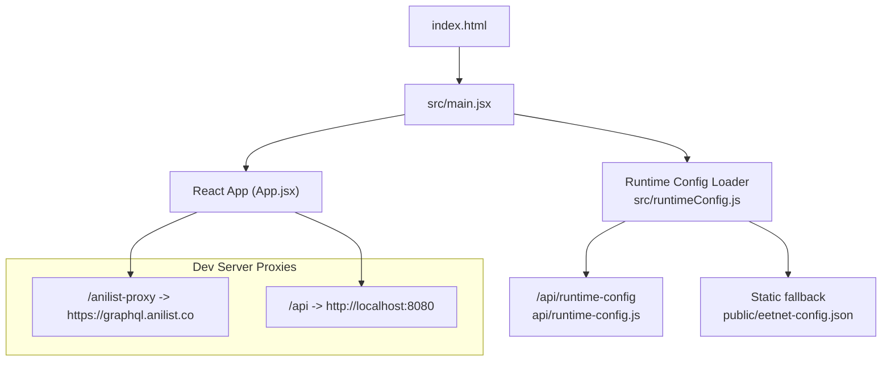
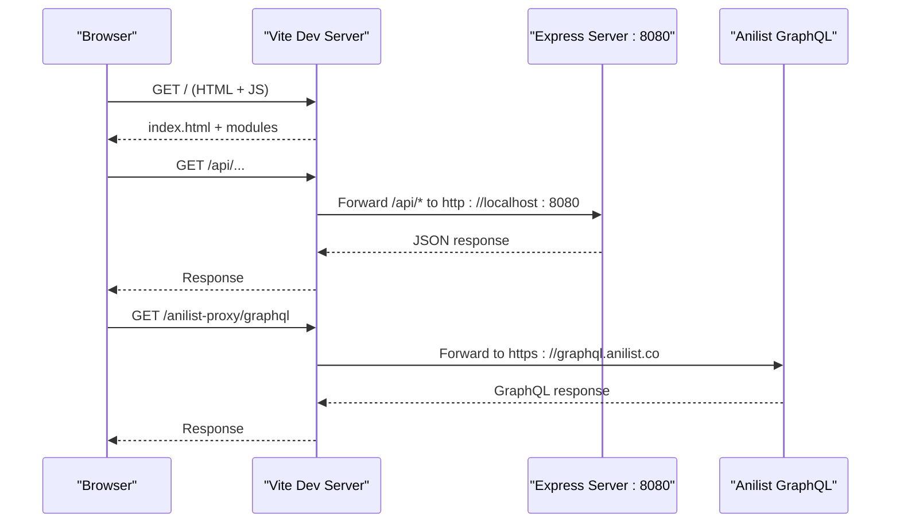
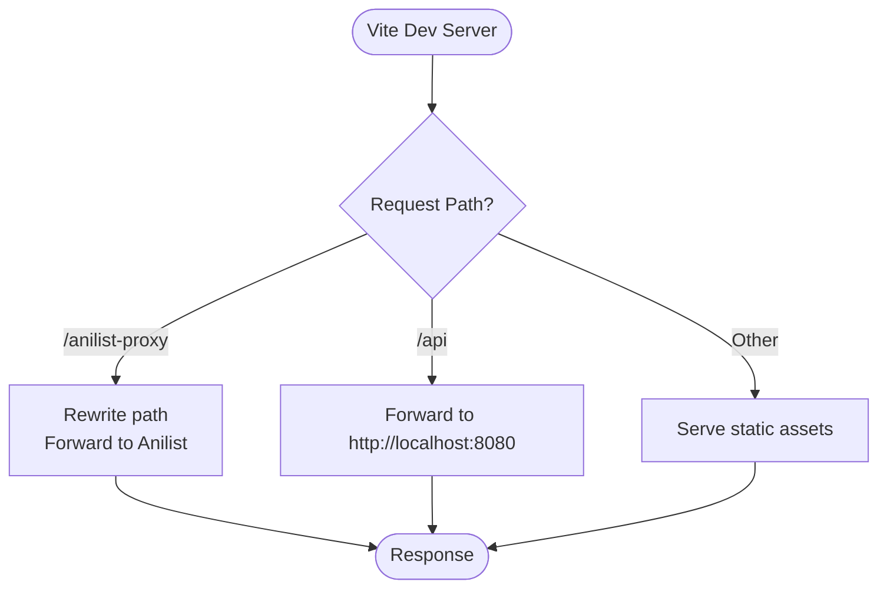
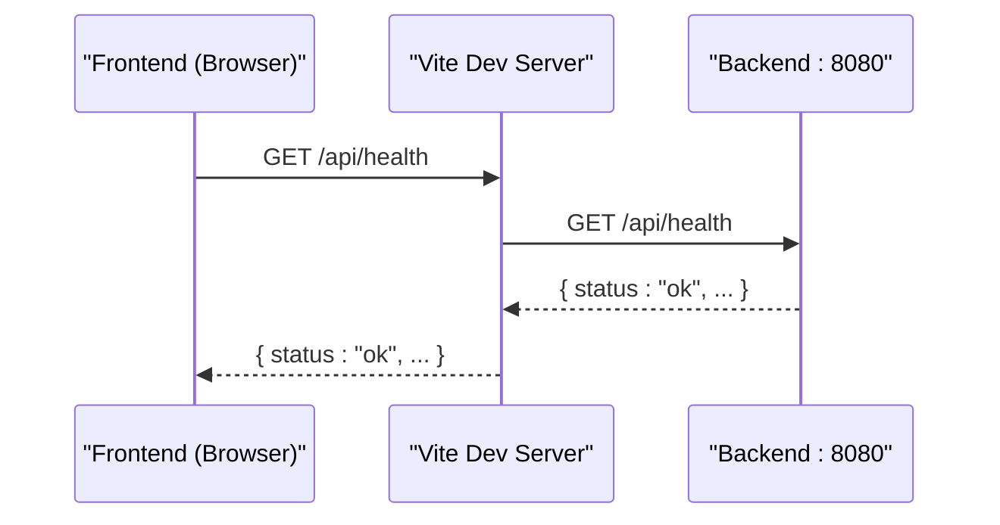
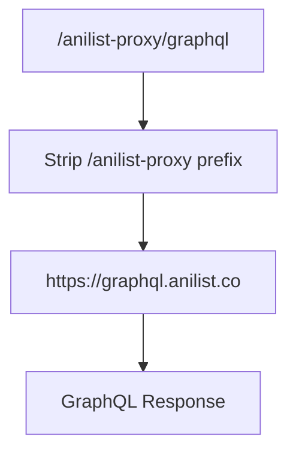
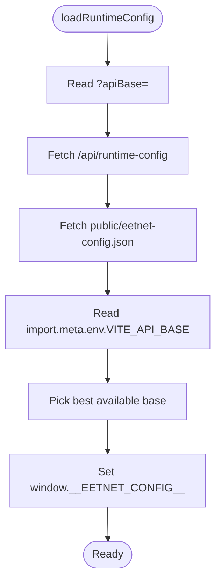
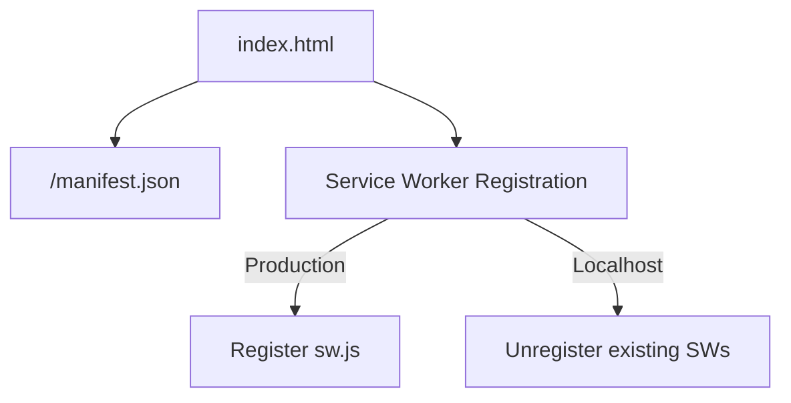
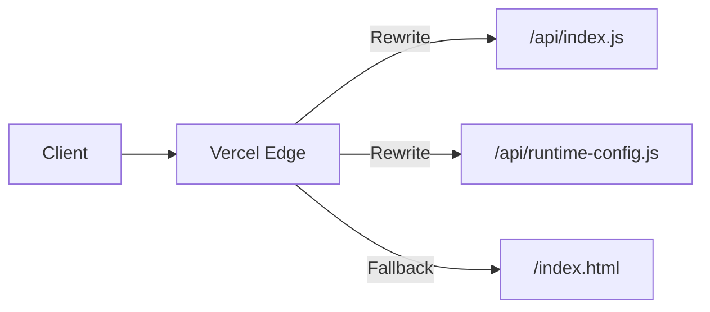
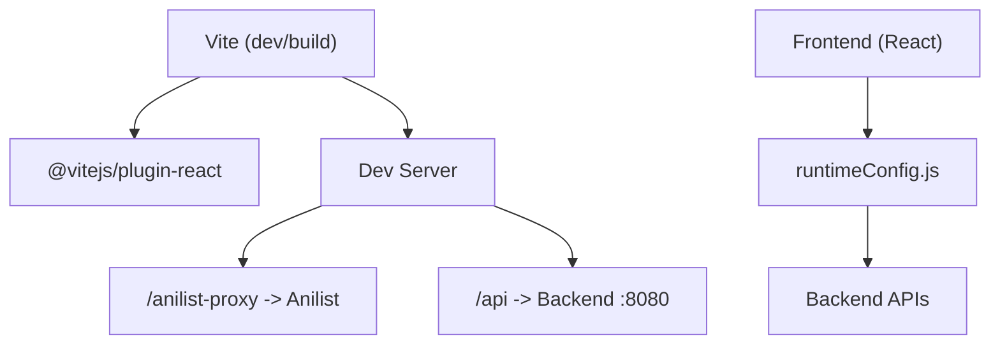

# Web Build Configuration

<cite>
**Referenced Files in This Document**
- [vite.config.js](file://vite.config.js)
- [package.json](file://package.json)
- [index.html](file://index.html)
- [src/main.jsx](file://src/main.jsx)
- [src/runtimeConfig.js](file://src/runtimeConfig.js)
- [api/runtime-config.js](file://api/runtime-config.js)
- [server.js](file://server.js)
- [vercel.json](file://vercel.json)
</cite>

## Table of Contents
1. [Introduction](#introduction)
2. [Project Structure](#project-structure)
3. [Core Components](#core-components)
4. [Architecture Overview](#architecture-overview)
5. [Detailed Component Analysis](#detailed-component-analysis)
6. [Dependency Analysis](#dependency-analysis)
7. [Performance Considerations](#performance-considerations)
8. [Troubleshooting Guide](#troubleshooting-guide)
9. [Conclusion](#conclusion)

## Introduction
This document explains the web build configuration for a Vite-based React application, focusing on:
- React plugin setup
- Development server configuration and proxy rules for Anilist GraphQL API and backend API forwarding to localhost:8080 (for mobile/LAN device compatibility)
- Asset processing and PWA support
- Bundle optimization and development workflow
- Environment-specific configurations and runtime API base resolution
- Troubleshooting common Vite build issues and performance tips

## Project Structure
The project uses Vite as the build tool with a minimal configuration that enables:
- React via the official plugin
- A dev server with proxy rules for external APIs and local backend
- A static HTML entry that bootstraps the React app and registers a service worker for PWA behavior

**Diagram sources**
- [vite.config.js:5-21](file://vite.config.js#L5-L21)
- [index.html:23-25](file://index.html#L23-L25)
- [src/main.jsx:6-13](file://src/main.jsx#L6-L13)
- [src/runtimeConfig.js:82-129](file://src/runtimeConfig.js#L82-L129)
- [api/runtime-config.js:4-23](file://api/runtime-config.js#L4-L23)

**Section sources**
- [vite.config.js:1-22](file://vite.config.js#L1-L22)
- [package.json:6-12](file://package.json#L6-L12)
- [index.html:1-45](file://index.html#L1-L45)

## Core Components
- Vite configuration:
  - Enables React plugin
  - Configures dev server proxies for Anilist and backend API
- Entry point:
  - index.html loads the module script from src/main.jsx
  - Registers service worker conditionally based on environment
- Runtime configuration:
  - Resolves API base URL at runtime using multiple sources and environments
- Backend:
  - Express server on port 8080 provides APIs and media proxies

Key responsibilities:
- Dev server proxies eliminate CORS and allow relative /api calls during development
- Runtime config ensures correct API base across local dev, LAN/mobile, and production deployments
- PWA manifest and service worker registration enable offline-like experiences

**Section sources**
- [vite.config.js:5-21](file://vite.config.js#L5-L21)
- [index.html:14-42](file://index.html#L14-L42)
- [src/runtimeConfig.js:82-129](file://src/runtimeConfig.js#L82-L129)
- [server.js:10-20](file://server.js#L10-L20)

## Architecture Overview
The development workflow uses Vite’s dev server to serve the frontend and proxy requests:
- /anilist-proxy forwards GraphQL queries to Anilist
- /api forwards all backend API calls to the local Express server on port 8080

In production (Vercel), rewrites route /api/* to serverless functions and /api/runtime-config to a handler that reads environment variables.

**Diagram sources**
- [vite.config.js:7-20](file://vite.config.js#L7-L20)
- [server.js:10-20](file://server.js#L10-L20)

**Section sources**
- [vite.config.js:7-20](file://vite.config.js#L7-L20)
- [server.js:10-20](file://server.js#L10-L20)

## Detailed Component Analysis

### Vite Configuration and React Plugin
- React plugin is enabled to compile JSX and optimize React builds.
- Dev server proxies:
  - /anilist-proxy -> https://graphql.anilist.co with origin rewriting
  - /api -> http://localhost:8080 for backend API forwarding
- These proxies ensure:
  - No CORS errors when calling Anilist or backend during development
  - Mobile/LAN devices can access the dev server and have /api calls forwarded to the local backend without needing VITE_API_BASE set in the browser

**Diagram sources**
- [vite.config.js:7-20](file://vite.config.js#L7-L20)

**Section sources**
- [vite.config.js:1-22](file://vite.config.js#L1-L22)

### Development Server Proxy for Backend API (localhost:8080)
- All /api requests are proxied to the local backend running on port 8080.
- This allows:
  - Relative API paths in the frontend to work seamlessly
  - Mobile/LAN devices to reach the dev server and have API calls forwarded to the backend without extra configuration
- The backend exposes health checks, image proxies, subtitle proxies, HLS manifests, and segment streaming endpoints

**Diagram sources**
- [vite.config.js:16-19](file://vite.config.js#L16-L19)
- [server.js:715-735](file://server.js#L715-L735)

**Section sources**
- [vite.config.js:14-19](file://vite.config.js#L14-L19)
- [server.js:715-735](file://server.js#L715-L735)

### Anilist GraphQL Proxy
- Requests to /anilist-proxy are rewritten and forwarded to https://graphql.anilist.co.
- changeOrigin ensures the target sees the original host header, avoiding certain provider restrictions.

**Diagram sources**
- [vite.config.js:9-13](file://vite.config.js#L9-L13)

**Section sources**
- [vite.config.js:9-13](file://vite.config.js#L9-L13)

### Runtime API Base Resolution
- The frontend resolves the API base at runtime using a priority chain:
  1. Query parameter override (?apiBase=)
  2. /api/runtime-config endpoint (reads environment variables on the server)
  3. Static fallback file (public/eetnet-config.json)
  4. Build-time env var (import.meta.env.VITE_API_BASE)
  5. Localhost auto-detection for development
- On Vercel production, localhost values are stripped to avoid misconfiguration.

**Diagram sources**
- [src/runtimeConfig.js:82-129](file://src/runtimeConfig.js#L82-L129)
- [api/runtime-config.js:4-23](file://api/runtime-config.js#L4-L23)

**Section sources**
- [src/runtimeConfig.js:82-129](file://src/runtimeConfig.js#L82-L129)
- [api/runtime-config.js:4-23](file://api/runtime-config.js#L4-L23)

### Asset Processing and PWA Setup
- index.html includes:
  - Meta tags for SEO and caching control
  - PWA manifest link and theme colors
  - Conditional service worker registration (disabled on localhost; registered in production)
- Assets are served by Vite during development and optimized during build.

**Diagram sources**
- [index.html:14-42](file://index.html#L14-L42)

**Section sources**
- [index.html:14-42](file://index.html#L14-L42)

### Production Deployment (Vercel)
- vercel.json defines headers and rewrites:
  - /api/* routes to serverless function index
  - /api/runtime-config routes to runtime-config handler
  - SPA fallback to index.html for client-side routing

**Diagram sources**
- [vercel.json:1-21](file://vercel.json#L1-L21)

**Section sources**
- [vercel.json:1-21](file://vercel.json#L1-L21)

## Dependency Analysis
- Vite and React plugin are dev dependencies used only during development/build.
- The frontend depends on runtime configuration to determine the API base.
- The backend runs independently on port 8080 and is proxied during development.

**Diagram sources**
- [package.json:36-43](file://package.json#L36-L43)
- [vite.config.js:5-20](file://vite.config.js#L5-L20)
- [src/runtimeConfig.js:82-129](file://src/runtimeConfig.js#L82-L129)

**Section sources**
- [package.json:36-43](file://package.json#L36-L43)
- [vite.config.js:5-20](file://vite.config.js#L5-L20)

## Performance Considerations
- Use Vite’s built-in optimizations:
  - Code splitting via dynamic imports (e.g., lazy loading App)
  - Efficient asset handling and caching
- Keep proxy rules minimal and targeted to reduce overhead
- For production:
  - Ensure proper cache headers for static assets
  - Use CDN-friendly URLs and avoid unnecessary redirects
- Avoid heavy libraries in critical paths; prefer tree-shaking and selective imports

[No sources needed since this section provides general guidance]

## Troubleshooting Guide
Common Vite build and development issues:

- Proxy not working for /api:
  - Ensure the backend is running on port 8080
  - Verify Vite dev server proxy targets localhost:8080
  - Check network tab for 404/502 responses indicating upstream failures

- CORS errors when calling Anilist:
  - Use /anilist-proxy instead of direct calls to graphql.anilist.co
  - Confirm rewrite rule strips the prefix correctly

- Service Worker conflicts in development:
  - On localhost, existing service workers are unregistered automatically
  - In production, ensure sw.js is accessible and properly configured

- Runtime API base misconfiguration:
  - Check /api/runtime-config returns expected API_BASE
  - Validate public/eetnet-config.json if used as fallback
  - Confirm VITE_API_BASE is set appropriately for your environment

- Build fails due to environment variables:
  - Ensure required VITE_* variables are present in .env files for local builds
  - On Vercel, configure environment variables in the dashboard

- Mobile/LAN device cannot reach backend:
  - During development, use Vite dev server proxy so relative /api calls work
  - Alternatively, set VITE_API_BASE to the device-accessible URL for production builds

**Section sources**
- [vite.config.js:7-20](file://vite.config.js#L7-L20)
- [src/runtimeConfig.js:82-129](file://src/runtimeConfig.js#L82-L129)
- [index.html:26-42](file://index.html#L26-L42)
- [vercel.json:1-21](file://vercel.json#L1-L21)

## Conclusion
This Vite-based web build configuration provides a streamlined development experience with:
- React plugin for modern JSX support
- Robust proxying for Anilist and backend APIs
- Flexible runtime API base resolution for local, LAN, and production environments
- PWA support with conditional service worker registration
- Production-ready deployment settings via Vercel rewrites and headers

By following the guidelines and troubleshooting steps above, you can maintain a reliable development workflow and optimize performance across environments.