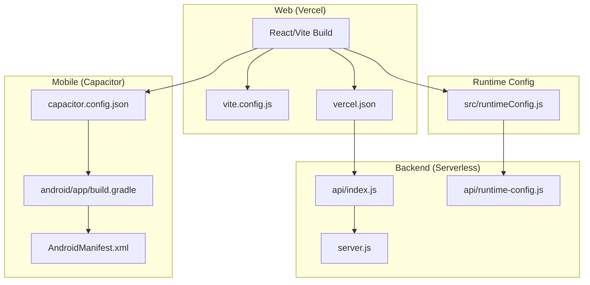
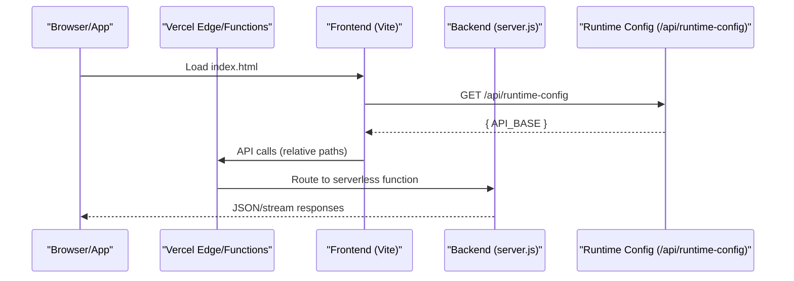
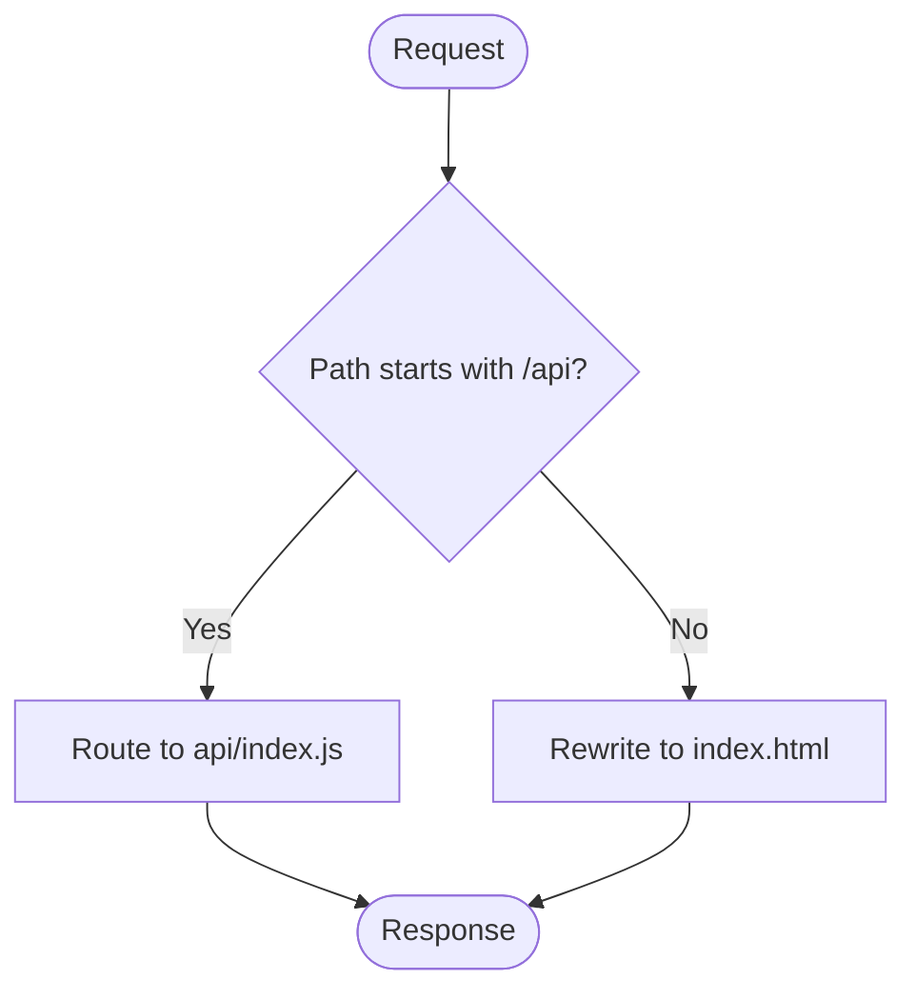
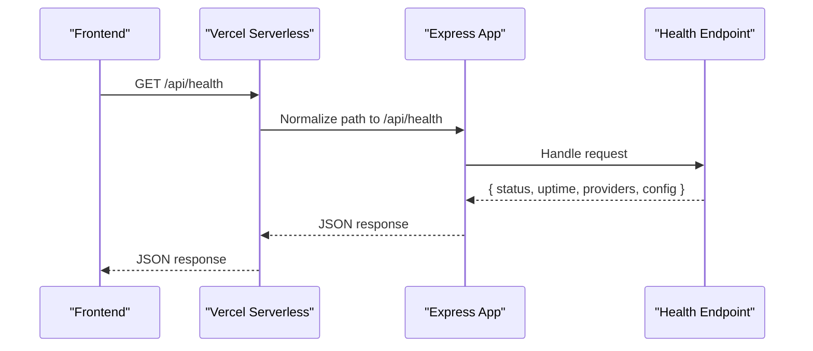
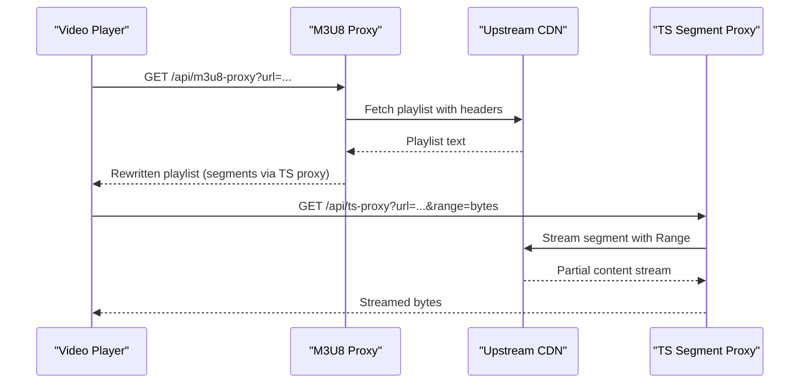
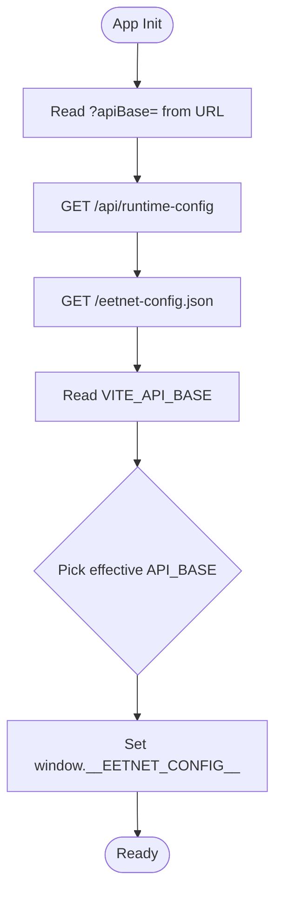
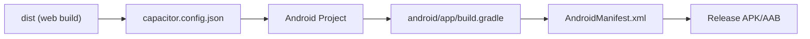
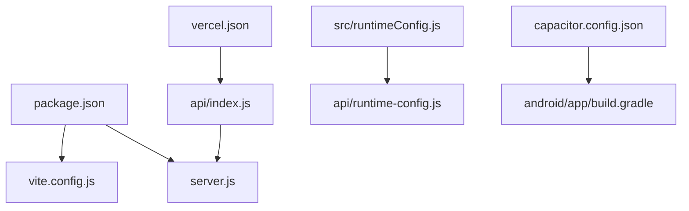

# Deployment & DevOps

<cite>
**Referenced Files in This Document**
- [package.json](file://package.json)
- [vite.config.js](file://vite.config.js)
- [vercel.json](file://vercel.json)
- [server.js](file://server.js)
- [api/index.js](file://api/index.js)
- [api/runtime-config.js](file://api/runtime-config.js)
- [src/runtimeConfig.js](file://src/runtimeConfig.js)
- [capacitor.config.json](file://capacitor.config.json)
- [android/app/build.gradle](file://android/app/build.gradle)
- [android/gradle.properties](file://android/gradle.properties)
- [android/app/src/main/AndroidManifest.xml](file://android/app/src/main/AndroidManifest.xml)
</cite>

## Table of Contents
1. Introduction
2. Project Structure
3. Core Components
4. Architecture Overview
5. Detailed Component Analysis
6. Dependency Analysis
7. Performance Considerations
8. Troubleshooting Guide
9. Conclusion

## Introduction
This document provides comprehensive deployment and DevOps guidance for Project Anime, covering:
- Web application deployment to Vercel with serverless functions
- Native Android app distribution using Capacitor
- Environment configuration management across environments
- Build processes and CI/CD pipeline setup
- Monitoring, logging, error tracking, and performance monitoring strategies
- Scaling, load balancing, and caching considerations for high traffic
- Backup and disaster recovery procedures
- Security best practices and compliance considerations
- Troubleshooting common deployment issues and production optimization techniques

## Project Structure
Project Anime is a React + Vite frontend with a Node/Express backend that runs as Vercel Serverless Functions and can also run standalone. The mobile app is built via Capacitor, embedding the web build into an Android shell.

Key elements:
- Frontend build tooling and dev proxy are defined in the Vite config
- Vercel routing and headers are configured for SPA rewrites and API routing
- Backend Express server exposes streaming proxies, metadata endpoints, and health checks
- Runtime configuration resolves the API base URL dynamically at runtime
- Capacitor config defines the native Android app settings and splash/status bar behavior
- Android Gradle configuration defines app identity, SDK versions, and release build options

**Diagram sources**
- [vite.config.js:1-23](file://vite.config.js#L1-L23)
- [vercel.json:1-22](file://vercel.json#L1-L22)
- [server.js:1-30](file://server.js#L1-L30)
- [api/index.js:1-4](file://api/index.js#L1-L4)
- [api/runtime-config.js:1-25](file://api/runtime-config.js#L1-L25)
- [src/runtimeConfig.js:1-163](file://src/runtimeConfig.js#L1-L163)
- [capacitor.config.json:1-32](file://capacitor.config.json#L1-L32)
- [android/app/build.gradle:1-55](file://android/app/build.gradle#L1-L55)
- [android/app/src/main/AndroidManifest.xml:1-42](file://android/app/src/main/AndroidManifest.xml#L1-L42)

**Section sources**
- [package.json:1-45](file://package.json#L1-L45)
- [vite.config.js:1-23](file://vite.config.js#L1-L23)
- [vercel.json:1-22](file://vercel.json#L1-L22)
- [capacitor.config.json:1-32](file://capacitor.config.json#L1-L32)
- [android/app/build.gradle:1-55](file://android/app/build.gradle#L1-L55)
- [android/gradle.properties:1-23](file://android/gradle.properties#L1-L23)
- [android/app/src/main/AndroidManifest.xml:1-42](file://android/app/src/main/AndroidManifest.xml#L1-L42)

## Core Components
- Vite-based web app with React and dev proxy for local API calls
- Express server exposing streaming proxies, metadata endpoints, and health check
- Vercel configuration for SPA routing and API function mapping
- Runtime configuration loader that resolves API base URL from multiple sources
- Capacitor configuration for Android packaging and native UI behavior
- Android build configuration for app identity, SDK targets, and release builds

**Section sources**
- [package.json:6-13](file://package.json#L6-L13)
- [vite.config.js:7-21](file://vite.config.js#L7-L21)
- [vercel.json:1-22](file://vercel.json#L1-L22)
- [server.js:10-20](file://server.js#L10-L20)
- [src/runtimeConfig.js:82-129](file://src/runtimeConfig.js#L82-L129)
- [capacitor.config.json:1-32](file://capacitor.config.json#L1-L32)
- [android/app/build.gradle:3-25](file://android/app/build.gradle#L3-L25)

## Architecture Overview
The system deploys a static web app to Vercel with serverless functions for backend logic. The frontend resolves the API base URL at runtime to connect to either the deployed serverless functions or a separate backend service. For mobile, the same web build is embedded in a Capacitor Android app.

**Diagram sources**
- [vercel.json:16-20](file://vercel.json#L16-L20)
- [api/index.js:1-4](file://api/index.js#L1-L4)
- [api/runtime-config.js:4-24](file://api/runtime-config.js#L4-L24)
- [src/runtimeConfig.js:82-129](file://src/runtimeConfig.js#L82-L129)
- [server.js:10-20](file://server.js#L10-L20)

## Detailed Component Analysis

### Web Deployment on Vercel
- Static assets are served by Vercel; SPA routing is handled via rewrites to index.html
- All non-API routes fall back to index.html for client-side routing
- API routes are proxied to the Express server via serverless functions
- Cache-Control headers ensure fresh content for root and index.html

**Diagram sources**
- [vercel.json:16-20](file://vercel.json#L16-L20)

**Section sources**
- [vercel.json:1-22](file://vercel.json#L1-L22)
- [api/index.js:1-4](file://api/index.js#L1-L4)

### Backend Serverless Functions (Express)
- Express app is exported as a default handler for Vercel serverless functions
- CORS is enabled based on environment variable
- Request URL normalization ensures all requests hit /api/* inside serverless
- Health endpoint returns service status, uptime, provider info, and configuration summary

**Diagram sources**
- [api/index.js:1-4](file://api/index.js#L1-L4)
- [server.js:22-28](file://server.js#L22-L28)
- [server.js:715-735](file://server.js#L715-L735)

**Section sources**
- [api/index.js:1-4](file://api/index.js#L1-L4)
- [server.js:10-20](file://server.js#L10-L20)
- [server.js:22-28](file://server.js#L22-L28)
- [server.js:715-735](file://server.js#L715-L735)

### Streaming Proxies and HLS Handling
- M3U8 manifest proxy fetches playlists and rewrites segment URLs to go through the backend
- TS segment proxy streams video segments with Range header support for efficient playback
- Subtitle proxy serves VTT files without CORS restrictions
- Image proxy bypasses hotlink protection and sets cache headers

**Diagram sources**
- [server.js:263-345](file://server.js#L263-L345)
- [server.js:354-393](file://server.js#L354-L393)

**Section sources**
- [server.js:235-256](file://server.js#L235-L256)
- [server.js:263-345](file://server.js#L263-L345)
- [server.js:354-393](file://server.js#L354-L393)
- [server.js:153-199](file://server.js#L153-L199)

### Runtime Configuration Management
- Frontend loads runtime config from /api/runtime-config, then falls back to static config and build-time env
- Supports emergency override via query parameter without persisting to storage
- On Vercel, localhost values are stripped to prevent misconfiguration
- In Capacitor APK, if no API base is found, a fallback tunnel is used

**Diagram sources**
- [src/runtimeConfig.js:82-129](file://src/runtimeConfig.js#L82-L129)
- [api/runtime-config.js:4-24](file://api/runtime-config.js#L4-L24)

**Section sources**
- [src/runtimeConfig.js:1-163](file://src/runtimeConfig.js#L1-L163)
- [api/runtime-config.js:1-25](file://api/runtime-config.js#L1-L25)

### Mobile App Distribution (Capacitor Android)
- Capacitor config points to the web build directory and configures splash screen, status bar, and keyboard behavior
- Android manifest declares permissions and activity configuration
- Gradle build defines application ID, SDK versions, and release build options

**Diagram sources**
- [capacitor.config.json:1-32](file://capacitor.config.json#L1-L32)
- [android/app/build.gradle:3-25](file://android/app/build.gradle#L3-L25)
- [android/app/src/main/AndroidManifest.xml:1-42](file://android/app/src/main/AndroidManifest.xml#L1-L42)

**Section sources**
- [capacitor.config.json:1-32](file://capacitor.config.json#L1-L32)
- [android/app/build.gradle:1-55](file://android/app/build.gradle#L1-L55)
- [android/gradle.properties:1-23](file://android/gradle.properties#L1-L23)
- [android/app/src/main/AndroidManifest.xml:1-42](file://android/app/src/main/AndroidManifest.xml#L1-L42)

## Dependency Analysis
- Frontend depends on Vite for building and dev server proxy configuration
- Backend depends on Express, Axios, Cheerio, and Consumet extensions for scraping and streaming
- Vercel configuration maps API routes to serverless functions and handles SPA routing
- Capacitor config ties the web build to the Android project and controls native UI behavior

**Diagram sources**
- [package.json:1-45](file://package.json#L1-L45)
- [vite.config.js:1-23](file://vite.config.js#L1-L23)
- [vercel.json:1-22](file://vercel.json#L1-L22)
- [server.js:1-20](file://server.js#L1-L20)
- [src/runtimeConfig.js:1-163](file://src/runtimeConfig.js#L1-L163)
- [api/index.js:1-4](file://api/index.js#L1-L4)
- [api/runtime-config.js:1-25](file://api/runtime-config.js#L1-L25)
- [capacitor.config.json:1-32](file://capacitor.config.json#L1-L32)
- [android/app/build.gradle:1-55](file://android/app/build.gradle#L1-L55)

**Section sources**
- [package.json:14-43](file://package.json#L14-L43)
- [vite.config.js:7-21](file://vite.config.js#L7-L21)
- [vercel.json:16-20](file://vercel.json#L16-L20)
- [server.js:1-20](file://server.js#L1-L20)

## Performance Considerations
- Use Range header support for HLS segments to avoid downloading full files per segment
- Set appropriate Cache-Control headers for images and subtitles to reduce bandwidth
- Leverage in-memory caches for episode lists and stream data to reduce upstream calls
- Configure CORS origin to restrict cross-origin access in production
- Ensure Vercel rewrites do not interfere with asset caching; keep assets under assets/ for optimal caching

[No sources needed since this section provides general guidance]

## Troubleshooting Guide
Common deployment issues and resolutions:
- API connectivity failures in mobile: verify runtime config resolution and ensure API_BASE is set correctly in Vercel environment variables or static config
- CORS errors: confirm CORS_ORIGIN is set appropriately and that requests originate from allowed domains
- HLS playback failures: check m3u8 and ts proxy endpoints for correct rewriting and Range header forwarding
- SPA routing errors: ensure Vercel rewrites route all non-API paths to index.html
- Android build issues: validate applicationId, minSdkVersion, targetSdkVersion, and presence of required plugins

**Section sources**
- [src/runtimeConfig.js:82-129](file://src/runtimeConfig.js#L82-L129)
- [api/runtime-config.js:4-24](file://api/runtime-config.js#L4-L24)
- [server.js:19-20](file://server.js#L19-L20)
- [server.js:263-345](file://server.js#L263-L345)
- [vercel.json:16-20](file://vercel.json#L16-L20)
- [android/app/build.gradle:6-25](file://android/app/build.gradle#L6-L25)

## Conclusion
Project Anime’s deployment strategy combines a Vercel-hosted static frontend with serverless backend functions and a Capacitor-based Android app. Environment configuration is resolved at runtime to support flexible deployments across web and mobile. The backend includes robust streaming proxies and caching to handle high-traffic scenarios. By following the outlined CI/CD, monitoring, security, and troubleshooting practices, teams can maintain reliable production operations and scale effectively.

[No sources needed since this section summarizes without analyzing specific files]