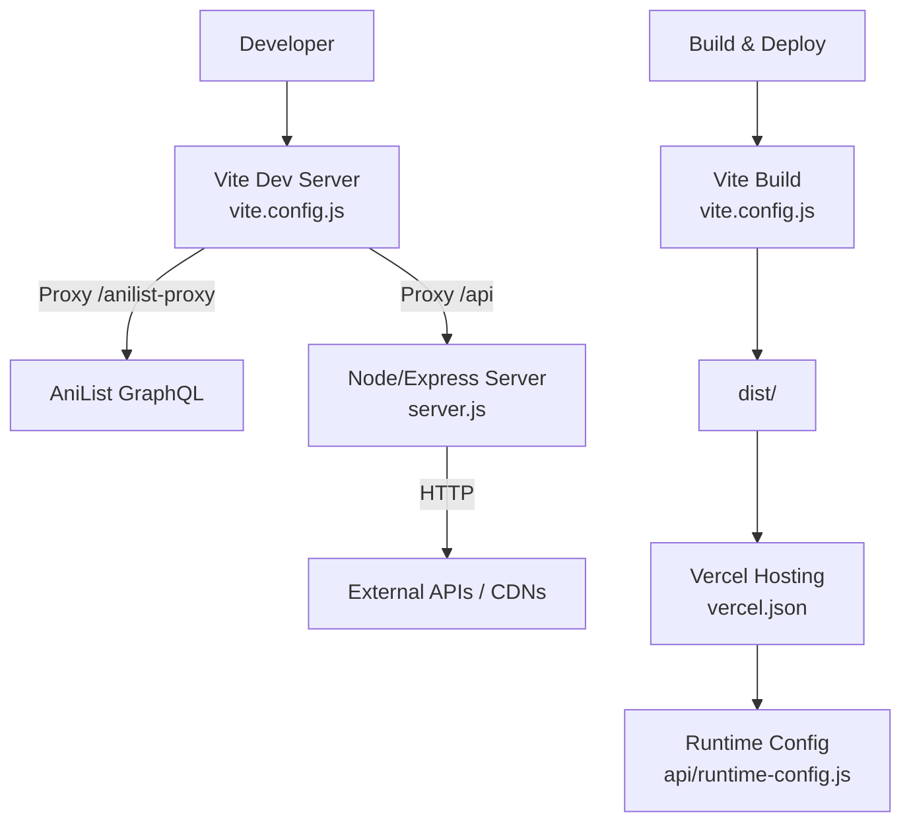
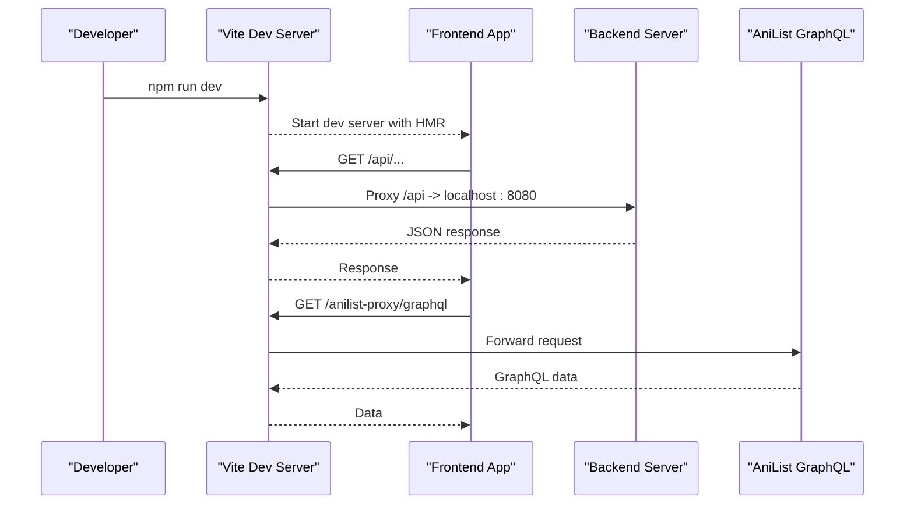
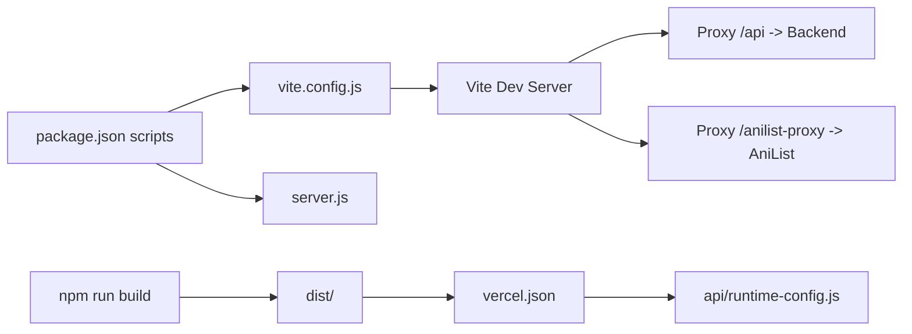

# Build Scripts and Development Workflow

<cite>
**Referenced Files in This Document**
- [package.json](file://package.json)
- [vite.config.js](file://vite.config.js)
- [server.js](file://server.js)
- [vercel.json](file://vercel.json)
- [README.md](file://README.md)
- [.env.example](file://.env.example)
- [src/runtimeConfig.js](file://src/runtimeConfig.js)
- [api/runtime-config.js](file://api/runtime-config.js)
</cite>

## Table of Contents
1. [Introduction](#introduction)
2. [Project Structure](#project-structure)
3. [Core Components](#core-components)
4. [Architecture Overview](#architecture-overview)
5. [Detailed Component Analysis](#detailed-component-analysis)
6. [Dependency Analysis](#dependency-analysis)
7. [Performance Considerations](#performance-considerations)
8. [Troubleshooting Guide](#troubleshooting-guide)
9. [Conclusion](#conclusion)
10. [Appendices](#appendices)

## Introduction
This document explains the build scripts and development workflow for the project, focusing on npm scripts defined in package.json and Vite configuration in vite.config.js. It covers how to run the development server, create production builds, preview outputs, lint code, and start the backend server. It also details environment-specific behavior (local vs. Vercel), proxying rules, and how runtime configuration is resolved at runtime. Guidance is provided for customizing the build process and adding new development workflows.

## Project Structure
The project uses a modern React + Vite frontend with a Node/Express backend. The root contains:
- Frontend build and dev tooling via Vite
- A local backend server for scraping/proxying content
- Vercel deployment configuration for hosting the frontend and serverless functions
- Environment variables for local and production configuration

**Diagram sources**
- [vite.config.js:1-23](file://vite.config.js#L1-L23)
- [server.js:1-30](file://server.js#L1-L30)
- [vercel.json:1-22](file://vercel.json#L1-L22)
- [api/runtime-config.js:1-25](file://api/runtime-config.js#L1-L25)

**Section sources**
- [package.json:1-45](file://package.json#L1-L45)
- [vite.config.js:1-23](file://vite.config.js#L1-L23)
- [README.md:87-128](file://README.md#L87-L128)

## Core Components
- npm scripts:
  - Development server: runs Vite dev server with HMR and proxy rules
  - Production build: compiles assets into dist/
  - Preview: serves the built output locally
  - Linting: runs oxlint
  - Backend server: starts the Express API server
- Vite configuration:
  - React plugin enabled
  - Dev server proxies:
    - /anilist-proxy to AniList GraphQL endpoint
    - /api to local backend on port 8080
- Environment handling:
  - Local .env supports VITE_API_BASE and other variables
  - Runtime config resolves API base dynamically at runtime for production

**Section sources**
- [package.json:6-13](file://package.json#L6-L13)
- [vite.config.js:5-21](file://vite.config.js#L5-L21)
- [.env.example:6-11](file://.env.example#L6-L11)
- [src/runtimeConfig.js:1-163](file://src/runtimeConfig.js#L1-L163)

## Architecture Overview
The development workflow integrates Vite’s dev server with a local backend via proxy rules. In production, Vite builds static assets that are deployed to Vercel. Vercel rewrites routes to serve the SPA and exposes a serverless function for runtime configuration.

**Diagram sources**
- [vite.config.js:7-21](file://vite.config.js#L7-L21)
- [server.js:1-30](file://server.js#L1-L30)

## Detailed Component Analysis

### npm Scripts
- dev: Starts Vite dev server for hot-reloading frontend development
- build: Produces optimized production assets in dist/
- preview: Serves the built output locally for testing
- lint: Runs oxlint for code quality checks
- server/start: Starts the Node/Express backend server

These scripts enable a complete local development loop: run the backend, then the frontend dev server, which proxies API calls to the backend.

**Section sources**
- [package.json:6-13](file://package.json#L6-L13)

### Vite Configuration
- Plugins: React plugin is enabled for JSX support
- Dev server proxy:
  - /anilist-proxy forwards to https://graphql.anilist.co with origin rewriting
  - /api forwards to http://localhost:8080 so mobile/LAN clients can use relative paths during development
- No additional optimization settings are configured; Vite defaults apply

Customization tips:
- Add more proxy targets for other services
- Configure server options like host/port if needed
- Integrate plugins for CSS preprocessors or asset optimization

**Section sources**
- [vite.config.js:1-23](file://vite.config.js#L1-L23)

### Backend Server Integration
- The backend listens on PORT (default 8080) and enables CORS based on CORS_ORIGIN
- It normalizes URLs to ensure all requests go through /api when running on Vercel
- Provides health check and various proxy endpoints for streaming and images

During development, Vite proxies /api to this server, enabling seamless local integration without changing frontend URLs.

**Section sources**
- [server.js:1-30](file://server.js#L1-L30)
- [server.js:715-735](file://server.js#L715-L735)

### Environment Variables and Runtime Configuration
- Local development:
  - .env supports VITE_API_BASE pointing to the backend (e.g., http://localhost:8080)
  - Other variables include Supabase credentials and TMDB key
- Production (Vercel):
  - VITE_API_BASE is set in Vercel environment variables
  - Runtime config endpoint reads from environment variables and a static JSON file to provide the current API base without redeployments
  - Vercel rewrites route /api/runtime-config to a serverless handler that returns the resolved API base

This approach avoids stale build-time values and allows dynamic updates to the backend URL.

**Section sources**
- [.env.example:6-11](file://.env.example#L6-L11)
- [src/runtimeConfig.js:1-163](file://src/runtimeConfig.js#L1-L163)
- [api/runtime-config.js:1-25](file://api/runtime-config.js#L1-L25)
- [vercel.json:16-20](file://vercel.json#L16-L20)

### Vercel Deployment Configuration
- Headers: Disables caching for index.html and root path to ensure fresh loads
- Rewrites:
  - Routes /api/runtime-config to the serverless function
  - Routes /api/* to the serverless handler
  - Fallback rewrite to index.html for SPA routing

This ensures the frontend works correctly as a single-page application and that runtime configuration is always fetched fresh.

**Section sources**
- [vercel.json:1-22](file://vercel.json#L1-L22)

## Dependency Analysis
The build and dev workflow depends on:
- Vite and React plugin for building and serving the frontend
- Express and related packages for the backend server
- Vercel configuration for deployment and runtime behavior

**Diagram sources**
- [package.json:6-13](file://package.json#L6-L13)
- [vite.config.js:5-21](file://vite.config.js#L5-L21)
- [server.js:1-30](file://server.js#L1-L30)
- [vercel.json:16-20](file://vercel.json#L16-L20)
- [api/runtime-config.js:1-25](file://api/runtime-config.js#L1-L25)

**Section sources**
- [package.json:14-43](file://package.json#L14-L43)
- [vite.config.js:1-23](file://vite.config.js#L1-L23)

## Performance Considerations
- Use Vite’s default optimizations for production builds (code splitting, minification)
- Keep proxy rules minimal to reduce overhead during development
- Ensure backend endpoints return appropriate headers for caching where applicable
- Avoid unnecessary network calls in dev by leveraging local resources

[No sources needed since this section provides general guidance]

## Troubleshooting Guide
Common issues and resolutions:
- API base mismatch:
  - Ensure VITE_API_BASE points to the correct backend URL in local .env or Vercel environment
  - Use the runtime config endpoint to verify the resolved API base in production
- Proxy failures:
  - Confirm Vite dev server proxies are configured for /api and /anilist-proxy
  - Check backend availability on port 8080
- Caching problems:
  - Vercel disables caching for index.html and root path; clear browser cache if needed
  - Use query parameter override ?apiBase= for temporary debugging

**Section sources**
- [src/runtimeConfig.js:1-163](file://src/runtimeConfig.js#L1-L163)
- [vercel.json:1-14](file://vercel.json#L1-L14)
- [README.md:151-160](file://README.md#L151-L160)

## Conclusion
The project’s build and development workflow centers around Vite for fast development and optimized production builds, with a Node/Express backend providing API and streaming proxies. Environment variables and runtime configuration ensure flexibility across local and production environments. Customizing the build process involves extending Vite configuration and adding npm scripts as needed.

[No sources needed since this section summarizes without analyzing specific files]

## Appendices

### How to Customize the Build Process
- Add new Vite plugins:
  - Import and register plugins in vite.config.js under the plugins array
- Extend proxy rules:
  - Add new entries under server.proxy to forward requests to other services
- Create new npm scripts:
  - Define commands in package.json scripts for tasks like testing, linting, or deployment automation

**Section sources**
- [vite.config.js:5-21](file://vite.config.js#L5-L21)
- [package.json:6-13](file://package.json#L6-L13)

### Adding New Development Workflows
- Example: Add a test script
  - Install a testing framework and add a script like "test": "your-test-runner"
- Example: Add a lint-staged hook
  - Configure pre-commit hooks to run linters before commits
- Example: Add environment-specific builds
  - Use Vite’s mode system to load different configs per environment

[No sources needed since this section provides general guidance]