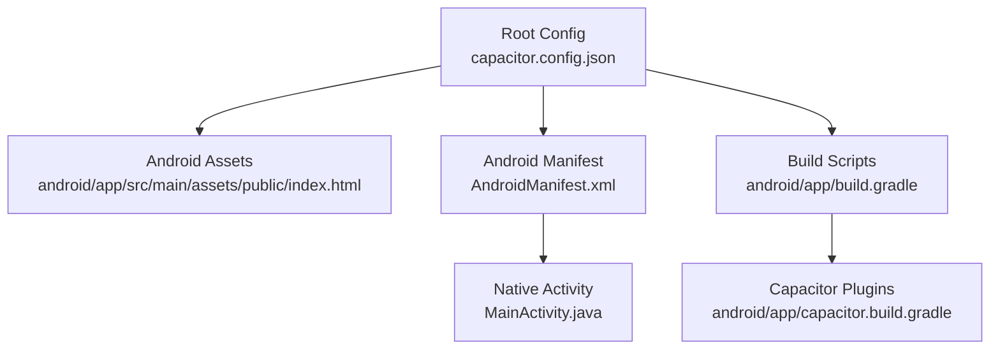
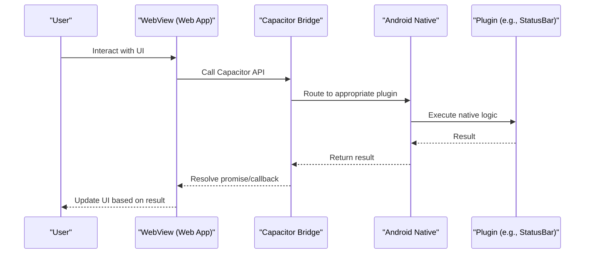
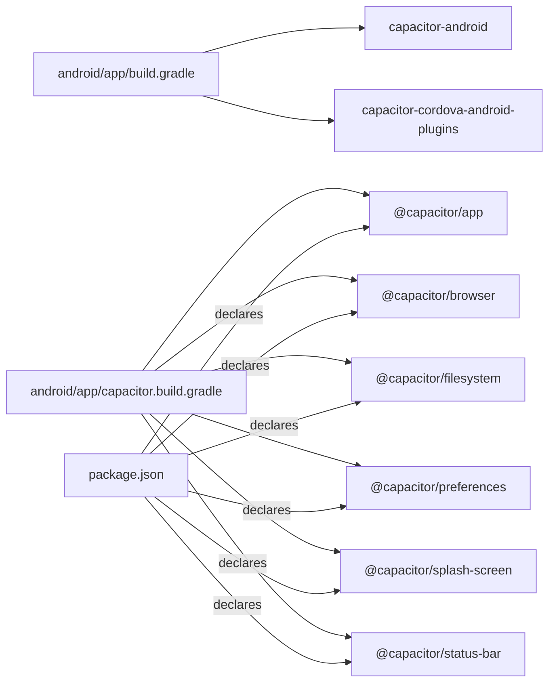

# Capacitor Mobile App Configuration

<cite>
**Referenced Files in This Document**
- [capacitor.config.json](file://capacitor.config.json)
- [AndroidManifest.xml](file://android/app/src/main/AndroidManifest.xml)
- [build.gradle](file://android/app/build.gradle)
- [capacitor.build.gradle](file://android/app/capacitor.build.gradle)
- [MainActivity.java](file://android/app/src/main/java/com/eetnet/app/MainActivity.java)
- [strings.xml](file://android/app/src/main/res/values/strings.xml)
- [styles.xml](file://android/app/src/main/res/values/styles.xml)
- [config.xml](file://android/app/src/main/res/xml/config.xml)
- [index.html](file://android/app/src/main/assets/public/index.html)
- [package.json](file://package.json)
- [gradle.properties](file://android/gradle.properties)
</cite>

## Table of Contents
1. [Introduction](#introduction)
2. [Project Structure](#project-structure)
3. [Core Components](#core-components)
4. [Architecture Overview](#architecture-overview)
5. [Detailed Component Analysis](#detailed-component-analysis)
6. [Dependency Analysis](#dependency-analysis)
7. [Performance Considerations](#performance-considerations)
8. [Troubleshooting Guide](#troubleshooting-guide)
9. [Conclusion](#conclusion)
10. [Appendices](#appendices)

## Introduction
This document explains how the project is configured as a Capacitor mobile app for Android. It covers:
- The main Capacitor configuration (app metadata, plugins, and web assets)
- Android-specific settings (manifest, permissions, native app properties)
- How Capacitor bridges web content with native device capabilities
- How to build an Android APK using the provided Gradle setup

## Project Structure
At a high level:
- Root-level capacitor.config.json defines app identity, plugin options, and platform-specific behavior.
- The android directory contains the generated Android project that packages your built web assets into an APK.
- Web assets are served from the dist folder during development and packaged under android/app/src/main/assets/public when building for Android.

**Diagram sources**
- [capacitor.config.json:1-32](file://capacitor.config.json#L1-L32)
- [AndroidManifest.xml:1-42](file://android/app/src/main/AndroidManifest.xml#L1-L42)
- [build.gradle:1-55](file://android/app/build.gradle#L1-L55)
- [capacitor.build.gradle:1-25](file://android/app/capacitor.build.gradle#L1-L25)
- [MainActivity.java:1-6](file://android/app/src/main/java/com/eetnet/app/MainActivity.java#L1-L6)
- [index.html:1-46](file://android/app/src/main/assets/public/index.html#L1-L46)

**Section sources**
- [capacitor.config.json:1-32](file://capacitor.config.json#L1-L32)
- [package.json:1-45](file://package.json#L1-L45)

## Core Components
- App identity and web source:
  - Application ID and name define the Android package and display name.
  - Web directory points to the compiled output used by Capacitor.
- Plugin configuration:
  - Splash screen, status bar, and keyboard behaviors are set via plugin options.
- Android runtime behavior:
  - Mixed content, input capture, and bridge mode are controlled per-platform.

Key configuration locations:
- Root config: [capacitor.config.json:1-32](file://capacitor.config.json#L1-L32)
- Android assets config (synchronized copy): [android/app/src/main/assets/capacitor.config.json:1-32](file://android/app/src/main/assets/capacitor.config.json#L1-L32)

**Section sources**
- [capacitor.config.json:1-32](file://capacitor.config.json#L1-L32)
- [android/app/src/main/assets/capacitor.config.json:1-32](file://android/app/src/main/assets/capacitor.config.json#L1-L32)

## Architecture Overview
Capacitor wraps your web application inside a native Android WebView. The native activity hosts the WebView and exposes native APIs through Capacitor plugins. Your web code calls Capacitor JavaScript APIs, which bridge to native implementations.

**Diagram sources**
- [MainActivity.java:1-6](file://android/app/src/main/java/com/eetnet/app/MainActivity.java#L1-L6)
- [capacitor.build.gradle:11-18](file://android/app/capacitor.build.gradle#L11-L18)
- [AndroidManifest.xml:12-25](file://android/app/src/main/AndroidManifest.xml#L12-L25)

## Detailed Component Analysis

### Capacitor Root Configuration
- App metadata:
  - Application ID and app name define the Android package and launcher label.
- Web assets:
  - Web directory points to the build output folder used by Capacitor.
- Plugin options:
  - Splash screen: duration, auto-hide, background color, resource name, immersive/fullscreen modes.
  - Status bar: style, background color, overlay behavior.
  - Keyboard: resize strategy, style, full-screen behavior.
- Android runtime flags:
  - Mixed content allowed, input capture disabled, modern bridge enabled.

Where to find these:
- [capacitor.config.json:1-32](file://capacitor.config.json#L1-L32)

Best practices:
- Keep root and Android asset copies synchronized by running the standard Capacitor sync/update commands after changes.
- Ensure splash images exist at the expected resource names referenced by the splash plugin.

**Section sources**
- [capacitor.config.json:1-32](file://capacitor.config.json#L1-L32)
- [android/app/src/main/assets/capacitor.config.json:1-32](file://android/app/src/main/assets/capacitor.config.json#L1-L32)

### Android Manifest and Permissions
- Main activity:
  - Declares the entry point activity with launch mode and theme.
  - Registers intent filters for launching the app.
- File provider:
  - Provides secure file URIs for sharing or accessing files within the app sandbox.
- Permissions:
  - Internet permission is declared for network access.

Where to find these:
- [AndroidManifest.xml:12-25](file://android/app/src/main/AndroidManifest.xml#L12-L25)
- [AndroidManifest.xml:27-35](file://android/app/src/main/AndroidManifest.xml#L27-L35)
- [AndroidManifest.xml:38-41](file://android/app/src/main/AndroidManifest.xml#L38-L41)

Notes:
- If your app needs additional hardware features (camera, storage, etc.), add corresponding permissions and feature declarations in the manifest.
- The file provider paths are defined separately for granular control over accessible directories.

**Section sources**
- [AndroidManifest.xml:12-25](file://android/app/src/main/AndroidManifest.xml#L12-L25)
- [AndroidManifest.xml:27-35](file://android/app/src/main/AndroidManifest.xml#L27-L35)
- [AndroidManifest.xml:38-41](file://android/app/src/main/AndroidManifest.xml#L38-L41)

### Build Configuration and Dependencies
- Application namespace and versioning:
  - Namespace matches the app ID; version code and name are set here.
- Build types:
  - Release build includes ProGuard rules; minification can be toggled.
- Repositories and dependencies:
  - Includes Capacitor core and selected plugins.
  - Applies Capacitor’s generated build script.
- Optional Google Services:
  - Conditionally applies Google services plugin if configuration exists.

Where to find these:
- [build.gradle:3-24](file://android/app/build.gradle#L3-L24)
- [build.gradle:27-43](file://android/app/build.gradle#L27-L43)
- [build.gradle:45-55](file://android/app/build.gradle#L45-L55)

**Section sources**
- [build.gradle:3-24](file://android/app/build.gradle#L3-L24)
- [build.gradle:27-43](file://android/app/build.gradle#L27-L43)
- [build.gradle:45-55](file://android/app/build.gradle#L45-L55)

### Capacitor Plugins Integration
- Enabled plugins include app lifecycle, browser, filesystem, preferences, splash screen, and status bar.
- These are added via the generated Capacitor build script and correspond to npm packages installed in the project.

Where to find these:
- [capacitor.build.gradle:11-18](file://android/app/capacitor.build.gradle#L11-L18)
- [package.json:14-23](file://package.json#L14-L23)

Notes:
- Adding a new plugin typically involves installing its npm package and ensuring it is included in the generated build script after running the update command.

**Section sources**
- [capacitor.build.gradle:11-18](file://android/app/capacitor.build.gradle#L11-L18)
- [package.json:14-23](file://package.json#L14-L23)

### Native Activity and Theme
- MainActivity extends the Capacitor base activity, enabling WebView hosting and plugin bridging.
- Themes define the app appearance and splash behavior.
- Strings define app name and title used by the launcher and activity.

Where to find these:
- [MainActivity.java:1-6](file://android/app/src/main/java/com/eetnet/app/MainActivity.java#L1-L6)
- [styles.xml:4-21](file://android/app/src/main/res/values/styles.xml#L4-L21)
- [strings.xml:1-8](file://android/app/src/main/res/values/strings.xml#L1-L8)

**Section sources**
- [MainActivity.java:1-6](file://android/app/src/main/java/com/eetnet/app/MainActivity.java#L1-L6)
- [styles.xml:4-21](file://android/app/src/main/res/values/styles.xml#L4-L21)
- [strings.xml:1-8](file://android/app/src/main/res/values/strings.xml#L1-L8)

### Web Assets and PWA Setup
- The web app is built into a dist folder and then copied into the Android assets directory for packaging.
- The bundled index.html includes meta tags for viewport, caching, PWA manifest link, and service worker registration.

Where to find these:
- [index.html:1-46](file://android/app/src/main/assets/public/index.html#L1-L46)

Notes:
- Ensure your build process outputs to the correct webDir so Capacitor can bundle it into the APK.
- Service Worker registration is conditional for local debugging and production use.

**Section sources**
- [index.html:1-46](file://android/app/src/main/assets/public/index.html#L1-L46)

### Cordova Compatibility Layer (Optional)
- A minimal config.xml allows Cordova-based plugins to operate if needed.
- Access origin is set broadly to allow loading resources from any origin.

Where to find these:
- [config.xml:1-6](file://android/app/src/main/res/xml/config.xml#L1-L6)

**Section sources**
- [config.xml:1-6](file://android/app/src/main/res/xml/config.xml#L1-L6)

## Dependency Analysis
The Android build depends on Capacitor core and several plugins. These are pulled in via Gradle projects and npm packages.

**Diagram sources**
- [build.gradle:33-43](file://android/app/build.gradle#L33-L43)
- [capacitor.build.gradle:11-18](file://android/app/capacitor.build.gradle#L11-L18)
- [package.json:14-23](file://package.json#L14-L23)

**Section sources**
- [build.gradle:33-43](file://android/app/build.gradle#L33-L43)
- [capacitor.build.gradle:11-18](file://android/app/capacitor.build.gradle#L11-L18)
- [package.json:14-23](file://package.json#L14-L23)

## Performance Considerations
- Use release builds with minification enabled for smaller APKs and better performance.
- Avoid unnecessary plugins to reduce startup time and memory footprint.
- Configure splash screen to minimize perceived load time.
- Ensure web assets are optimized (minified CSS/JS, image compression).

[No sources needed since this section provides general guidance]

## Troubleshooting Guide
- Mixed content errors:
  - Verify mixed content is allowed in the Capacitor Android configuration if you must load HTTP resources.
- Network issues:
  - Confirm internet permission is declared in the manifest.
- File sharing failures:
  - Check file provider configuration and paths to ensure the correct directories are exposed.
- Build errors:
  - Ensure all required plugins are installed and the generated build scripts are up to date.
  - Review Gradle properties and Java compatibility settings.

Where to check:
- Mixed content flag: [capacitor.config.json:26-30](file://capacitor.config.json#L26-L30)
- Internet permission: [AndroidManifest.xml:38-41](file://android/app/src/main/AndroidManifest.xml#L38-L41)
- File provider paths: [file_paths.xml:1-5](file://android/app/src/main/res/xml/file_paths.xml#L1-L5)
- Gradle Java version: [capacitor.build.gradle:3-8](file://android/app/capacitor.build.gradle#L3-L8)
- Gradle JVM args: [gradle.properties:10-12](file://android/gradle.properties#L10-L12)

**Section sources**
- [capacitor.config.json:26-30](file://capacitor.config.json#L26-L30)
- [AndroidManifest.xml:38-41](file://android/app/src/main/AndroidManifest.xml#L38-L41)
- [file_paths.xml:1-5](file://android/app/src/main/res/xml/file_paths.xml#L1-L5)
- [capacitor.build.gradle:3-8](file://android/app/capacitor.build.gradle#L3-L8)
- [gradle.properties:10-12](file://android/gradle.properties#L10-L12)

## Conclusion
This project uses Capacitor to wrap a web application into a native Android app. The root configuration defines app identity, plugin behavior, and platform flags. The Android module declares the native activity, permissions, and build settings, while Capacitor plugins provide access to device features. Follow the steps below to build and run the app on Android devices.

[No sources needed since this section summarizes without analyzing specific files]

## Appendices

### Build Process for Android APK
- Build the web assets:
  - Run the project’s build script to generate the dist folder.
- Sync with Capacitor:
  - Use the Capacitor CLI to copy assets and update the Android project.
- Build the APK:
  - Use Gradle to assemble a release APK.

References:
- Build script location: [package.json:6-12](file://package.json#L6-L12)
- Android build entry: [build.gradle:1-55](file://android/app/build.gradle#L1-55)

[No sources needed since this section provides general guidance]

### Bridging Web Content with Native Capabilities
- The native activity hosts the WebView and delegates plugin calls to Capacitor modules.
- Plugins like status bar, splash screen, and filesystem are wired via Gradle dependencies and invoked from web code through Capacitor APIs.

References:
- Activity class: [MainActivity.java:1-6](file://android/app/src/main/java/com/eetnet/app/MainActivity.java#L1-L6)
- Plugin dependencies: [capacitor.build.gradle:11-18](file://android/app/capacitor.build.gradle#L11-L18)

**Section sources**
- [MainActivity.java:1-6](file://android/app/src/main/java/com/eetnet/app/MainActivity.java#L1-L6)
- [capacitor.build.gradle:11-18](file://android/app/capacitor.build.gradle#L11-L18)