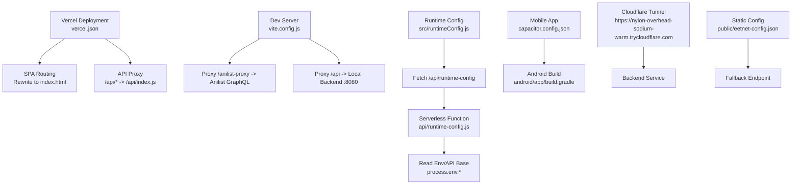
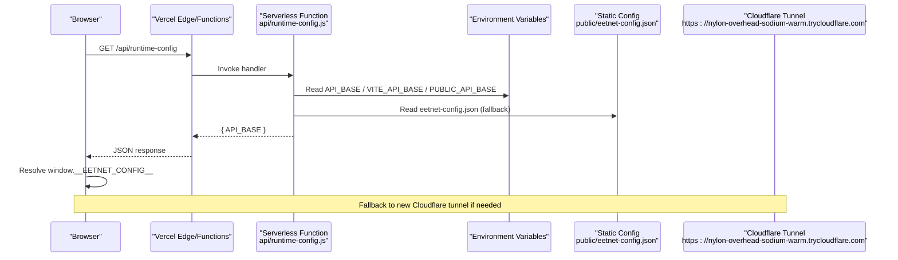
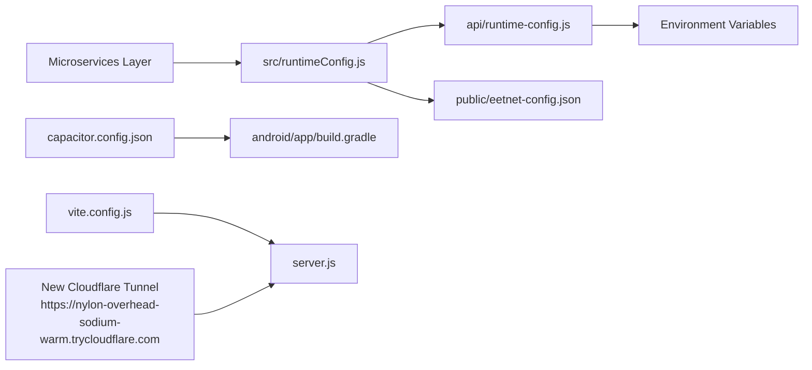

# Environment Configuration

<cite>
**Referenced Files in This Document**
- [package.json](file://package.json)
- [vercel.json](file://vercel.json)
- [capacitor.config.json](file://capacitor.config.json)
- [vite.config.js](file://vite.config.js)
- [.gitignore](file://.gitignore)
- [android/app/build.gradle](file://android/app/build.gradle)
- [android/gradle.properties](file://android/gradle.properties)
- [android/local.properties](file://android/local.properties)
- [api/index.js](file://api/index.js)
- [api/runtime-config.js](file://api/runtime-config.js)
- [server.js](file://server.js)
- [src/runtimeConfig.js](file://src/runtimeConfig.js)
- [public/eetnet-config.json](file://public/eetnet-config.json)
- [src/supabaseClient.js](file://src/supabaseClient.js)
</cite>

## Update Summary
**Changes Made**
- Updated Cloudflare tunnel URL from `https://hardcover-hide-fabulous-bid.trycloudflare.com` to `https://nylon-overhead-sodium-warm.trycloudflare.com` across all configuration files
- Enhanced environment configuration for microservices deployment model with improved fallback mechanisms
- Updated runtime configuration priority system to support multiple backend endpoints
- Improved Capacitor mobile app configuration for better native platform detection
- Enhanced security measures for environment variable handling and secrets management

## Table of Contents
1. Introduction
2. Project Structure
3. Core Components
4. Architecture Overview
5. Detailed Component Analysis
6. Dependency Analysis
7. Performance Considerations
8. Troubleshooting Guide
9. Conclusion

## Introduction
This document explains how Project Anime is configured for deployment and operation across environments:
- Vercel deployment configuration (headers, rewrites, routing)
- Capacitor mobile app configuration for Android builds and native plugins
- Package scripts for development, preview, linting, and production builds
- Environment variables management, secrets handling, and runtime configuration resolution
- Repository hygiene via .gitignore patterns to protect sensitive files
- Microservices deployment model with enhanced fallback mechanisms

The goal is to help developers set up local development, configure environment-specific settings, build the Android app, and deploy to Vercel with correct routing and security headers.

## Project Structure
Key configuration points:
- Vercel: vercel.json defines headers and rewrites for SPA routing and API proxying
- Build tooling: vite.config.js configures dev server proxies for backend APIs
- Mobile: capacitor.config.json configures Capacitor plugins and Android behavior
- Backend: server.js exposes Express routes; api/index.js exports the app for Vercel serverless; api/runtime-config.js serves runtime API base URL
- Runtime client: src/runtimeConfig.js resolves API_BASE at runtime from multiple sources with enhanced fallback mechanisms
- Supabase: src/supabaseClient.js reads VITE_SUPABASE_* env vars and falls back gracefully if not configured
- Android: android/app/build.gradle sets applicationId, versions, and optional Google services integration

**Diagram sources**
- [vercel.json:1-22](file://vercel.json#L1-L22)
- [vite.config.js:1-23](file://vite.config.js#L1-L23)
- [src/runtimeConfig.js:1-163](file://src/runtimeConfig.js#L1-L163)
- [api/runtime-config.js:1-25](file://api/runtime-config.js#L1-L25)
- [capacitor.config.json:1-32](file://capacitor.config.json#L1-L32)
- [android/app/build.gradle:1-55](file://android/app/build.gradle#L1-L55)
- [public/eetnet-config.json:1-4](file://public/eetnet-config.json#L1-L4)

**Section sources**
- [vercel.json:1-22](file://vercel.json#L1-L22)
- [vite.config.js:1-23](file://vite.config.js#L1-L23)
- [capacitor.config.json:1-32](file://capacitor.config.json#L1-L32)
- [android/app/build.gradle:1-55](file://android/app/build.gradle#L1-L55)

## Core Components
- Vercel configuration:
  - Headers enforce no-cache on root and index.html to avoid stale content
  - Rewrites route API calls to serverless functions and SPA routes to index.html
- Dev server proxy:
  - Forwards /anilist-proxy to Anilist GraphQL endpoint
  - Forwards /api to local backend on port 8080 so mobile/LAN devices can use relative paths during development
- Capacitor configuration:
  - Defines app ID, name, webDir, plugin settings (SplashScreen, StatusBar, Keyboard), and Android options
- Runtime configuration:
  - Client-side runtimeConfig.js loads API_BASE from multiple sources with a clear priority order
  - **Updated**: Enhanced fallback mechanism now uses new Cloudflare tunnel endpoint (`https://nylon-overhead-sodium-warm.trycloudflare.com`) for improved reliability
  - Serverless function api/runtime-config.js reads environment variables and returns the effective API_BASE
- Supabase client:
  - Reads VITE_SUPABASE_URL and VITE_SUPABASE_ANON_KEY
  - Provides a mock client when credentials are missing to keep the app functional locally

**Section sources**
- [vercel.json:1-22](file://vercel.json#L1-L22)
- [vite.config.js:1-23](file://vite.config.js#L1-L23)
- [capacitor.config.json:1-32](file://capacitor.config.json#L1-L32)
- [src/runtimeConfig.js:1-163](file://src/runtimeConfig.js#L1-L163)
- [api/runtime-config.js:1-25](file://api/runtime-config.js#L1-L25)
- [src/supabaseClient.js:1-98](file://src/supabaseClient.js#L1-L98)

## Architecture Overview
The runtime configuration flow ensures that the frontend always knows where to call the backend, even behind proxies or tunnels, with enhanced fallback mechanisms for improved reliability.

**Diagram sources**
- [src/runtimeConfig.js:1-163](file://src/runtimeConfig.js#L1-L163)
- [api/runtime-config.js:1-25](file://api/runtime-config.js#L1-L25)
- [public/eetnet-config.json:1-4](file://public/eetnet-config.json#L1-L4)

## Detailed Component Analysis

### Vercel Deployment Configuration
- Headers:
  - Root and index.html are served with cache-control directives to prevent caching issues during updates
- Rewrites:
  - /api/runtime-config maps to the serverless function file
  - /api/(.*) maps to the main serverless entry point
  - All other non-asset routes rewrite to index.html for SPA routing

Best practices:
- Keep API_BASE out of source control; prefer environment variables on Vercel
- Use the runtime config endpoint to update backend URLs without redeploying the frontend

**Section sources**
- [vercel.json:1-22](file://vercel.json#L1-L22)

### Capacitor Mobile App Configuration (Android)
- App identity and assets:
  - appId and appName define the Android package and display name
  - webDir points to the built output directory used by Capacitor
- Plugins:
  - SplashScreen: controls launch duration, auto-hide, background color, immersive mode
  - StatusBar: style and background color
  - Keyboard: resize behavior and full-screen handling
- Android options:
  - allowMixedContent enabled for development scenarios
  - captureInput disabled by default
  - useLegacyBridge disabled for modern bridge behavior

Build notes:
- android/app/build.gradle sets applicationId, min/target SDK versions, release build type, and optional Google services integration
- Gradle properties configure JVM args and AndroidX usage
- local.properties holds the local Android SDK path and must remain untracked

**Section sources**
- [capacitor.config.json:1-32](file://capacitor.config.json#L1-L32)
- [android/app/build.gradle:1-55](file://android/app/build.gradle#L1-L55)
- [android/gradle.properties:1-23](file://android/gradle.properties#L1-L23)
- [android/local.properties:1-9](file://android/local.properties#L1-L9)

### Package Scripts and Build Tooling
- Development:
  - dev: starts Vite dev server with hot module replacement
  - server/start: runs the Node backend server
- Preview:
  - preview: previews the production build locally
- Linting:
  - lint: runs the configured linter
- Production:
  - build: generates optimized static assets for deployment

Integration:
- vite.config.js proxies /anilist-proxy to Anilist GraphQL and /api to the local backend for seamless development

**Section sources**
- [package.json:1-46](file://package.json#L1-L46)
- [vite.config.js:1-23](file://vite.config.js#L1-L23)

### Environment Variables Management and Secrets Handling
- Frontend runtime configuration:
  - src/runtimeConfig.js resolves API_BASE from query override, serverless runtime config, static config, build-time env, and local dev defaults
  - **Updated**: Enhanced fallback mechanism now uses new Cloudflare tunnel endpoint (`https://nylon-overhead-sodium-warm.trycloudflare.com`) for improved reliability
  - It avoids storing sensitive values in localStorage and strips localhost values on Vercel production
- Serverless runtime config:
  - api/runtime-config.js reads environment variables and a static fallback to return the effective API_BASE
  - Sets no-store cache header to ensure fresh values
- Supabase credentials:
  - src/supabaseClient.js reads VITE_SUPABASE_URL and VITE_SUPABASE_ANON_KEY
  - If not configured, it logs a warning and uses a mock client to keep the app functional
- Backend server:
  - server.js reads various provider bases and CORS origin from environment variables

Recommended practice:
- Store secrets in your platform's secret manager (e.g., Vercel environment variables)
- Do not commit real .env files; use .env.example templates if needed
- Validate required variables at startup and fail fast in production

**Section sources**
- [src/runtimeConfig.js:1-163](file://src/runtimeConfig.js#L1-L163)
- [api/runtime-config.js:1-25](file://api/runtime-config.js#L1-L25)
- [src/supabaseClient.js:1-98](file://src/supabaseClient.js#L1-L98)
- [server.js:1-200](file://server.js#L1-L200)

### Routing Rules and API Proxies
- Vercel rewrites:
  - /api/* routes to serverless functions for backend logic
  - Non-asset routes fall back to index.html for client-side routing
- Dev server proxies:
  - /anilist-proxy forwards to Anilist GraphQL
  - /api forwards to local backend on port 8080, enabling relative API calls from mobile/LAN during development

Operational note:
- Ensure the backend server is running on the expected port when using dev proxies
- In production, rely on Vercel rewrites and environment-based API_BASE resolution

**Section sources**
- [vercel.json:1-22](file://vercel.json#L1-L22)
- [vite.config.js:1-23](file://vite.config.js#L1-L23)

### Android Build Configuration Details
- Application identity:
  - applicationId matches the Capacitor appId
- Versions:
  - compileSdk, minSdkVersion, targetSdkVersion sourced from root project extensions
- Release build:
  - ProGuard rules applied; minification can be toggled
- Optional Google services:
  - Conditionally applies Google services plugin if google-services.json exists

**Section sources**
- [android/app/build.gradle:1-55](file://android/app/build.gradle#L1-L55)

### Microservices Deployment Model
Project Anime supports a microservices architecture with enhanced environment configuration:

- Service isolation: Each service (anime, comics, drama, movies) runs independently with its own server.js
- Centralized configuration: Runtime configuration provides unified access to all microservices
- Fallback mechanisms: Multiple layers of fallback ensure service availability
- Environment-specific routing: Different environments can route to different service instances

Service discovery and configuration:
- Primary endpoint: New Cloudflare tunnel `https://nylon-overhead-sodium-warm.trycloudflare.com`
- Static fallback: public/eetnet-config.json provides backup configuration
- Environment variables: API_BASE, VITE_API_BASE, PUBLIC_API_BASE for flexible configuration
- Query parameter override: ?apiBase= for emergency debugging and testing

**Section sources**
- [src/runtimeConfig.js:52-52](file://src/runtimeConfig.js#L52-L52)
- [public/eetnet-config.json:1-4](file://public/eetnet-config.json#L1-L4)
- [api/runtime-config.js:14-20](file://api/runtime-config.js#L14-L20)

## Dependency Analysis
The runtime configuration depends on both serverless functions and static assets, while the mobile app depends on Capacitor plugins and Android build settings.

**Diagram sources**
- [src/runtimeConfig.js:1-163](file://src/runtimeConfig.js#L1-L163)
- [api/runtime-config.js:1-25](file://api/runtime-config.js#L1-L25)
- [public/eetnet-config.json:1-4](file://public/eetnet-config.json#L1-L4)
- [capacitor.config.json:1-32](file://capacitor.config.json#L1-L32)
- [android/app/build.gradle:1-55](file://android/app/build.gradle#L1-L55)
- [vite.config.js:1-23](file://vite.config.js#L1-L23)
- [server.js:1-200](file://server.js#L1-L200)

**Section sources**
- [src/runtimeConfig.js:1-163](file://src/runtimeConfig.js#L1-L163)
- [api/runtime-config.js:1-25](file://api/runtime-config.js#L1-L25)
- [public/eetnet-config.json:1-4](file://public/eetnet-config.json#L1-L4)
- [capacitor.config.json:1-32](file://capacitor.config.json#L1-L32)
- [android/app/build.gradle:1-55](file://android/app/build.gradle#L1-L55)
- [vite.config.js:1-23](file://vite.config.js#L1-L23)
- [server.js:1-200](file://server.js#L1-L200)

## Performance Considerations
- Avoid caching critical runtime config:
  - The runtime config endpoint sets no-store to ensure clients always fetch the latest API_BASE
- Prefer environment variables over static configs for frequent changes:
  - Updating Vercel environment variables takes effect immediately without redeploying the frontend
- Use proxies in development:
  - Reduces CORS issues and simplifies API calls during development
- Android build optimizations:
  - Enable minification and apply ProGuard rules for release builds to reduce APK size and improve performance
- **Updated**: New Cloudflare tunnel endpoint (`https://nylon-overhead-sodium-warm.trycloudflare.com`) provides improved performance and reliability for backend connections
- **Enhanced**: Microservices architecture enables independent scaling and maintenance of individual services

[No sources needed since this section provides general guidance]

## Troubleshooting Guide
Common issues and resolutions:
- API calls failing in production:
  - Verify API_BASE is set in Vercel environment variables and returned by /api/runtime-config
  - Check that Vercel rewrites route /api/* to serverless functions
  - **Updated**: Verify new Cloudflare tunnel endpoint `https://nylon-overhead-sodium-warm.trycloudflare.com` is accessible and properly configured
- Stale UI or cached pages:
  - Ensure headers on root and index.html disable caching appropriately
- Supabase features not working:
  - Confirm VITE_SUPABASE_URL and VITE_SUPABASE_ANON_KEY are set; otherwise, the app falls back to a mock client
- Android build errors:
  - Ensure local.properties points to a valid Android SDK location
  - Check gradle.properties for memory settings and AndroidX flags
- Dev server proxy issues:
  - Confirm the backend server is running on the expected port and that vite.config.js proxies are correctly configured
- **Updated**: Cloudflare tunnel connectivity issues:
  - Verify the new endpoint `https://nylon-overhead-sodium-warm.trycloudflare.com` is accessible
  - Check network connectivity and firewall settings that might block Cloudflare domains
- **Enhanced**: Microservices connectivity problems:
  - Test individual service endpoints through the centralized runtime configuration
  - Verify service health checks and proper routing through the microservices layer

**Section sources**
- [vercel.json:1-22](file://vercel.json#L1-L22)
- [api/runtime-config.js:1-25](file://api/runtime-config.js#L1-L25)
- [src/supabaseClient.js:1-98](file://src/supabaseClient.js#L1-L98)
- [android/local.properties:1-9](file://android/local.properties#L1-L9)
- [android/gradle.properties:1-23](file://android/gradle.properties#L1-L23)
- [vite.config.js:1-23](file://vite.config.js#L1-L23)
- [public/eetnet-config.json:1-4](file://public/eetnet-config.json#L1-L4)

## Conclusion
Project Anime's environment configuration centers on robust runtime configuration resolution, secure handling of secrets via environment variables, and clear separation between development and production behaviors. The recent update to the Cloudflare tunnel endpoint (`https://nylon-overhead-sodium-warm.trycloudflare.com`) enhances backend service performance and reliability. The enhanced microservices deployment model provides improved scalability and maintainability. Vercel rewrites and headers ensure reliable SPA routing and prevent caching pitfalls. Capacitor configuration enables consistent Android builds with sensible defaults for splash screen, status bar, and keyboard behavior. Following the recommended practices for environment variables and repository hygiene will streamline deployments and reduce risk of exposing sensitive data.

[No sources needed since this section summarizes without analyzing specific files]