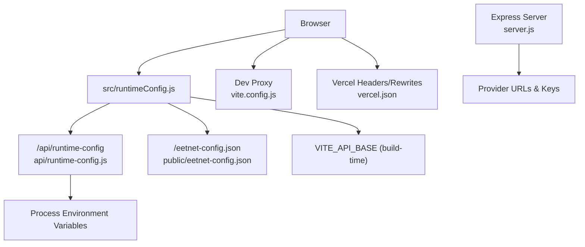
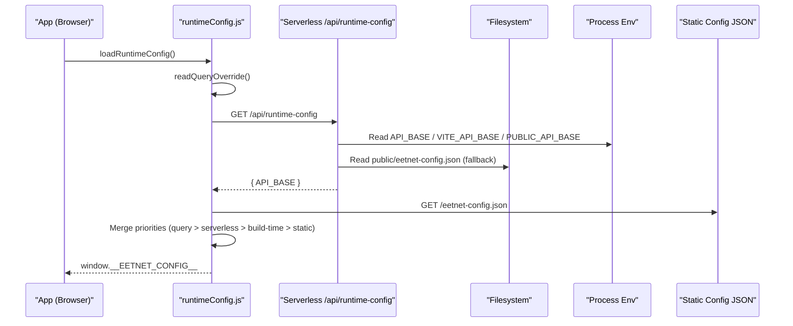
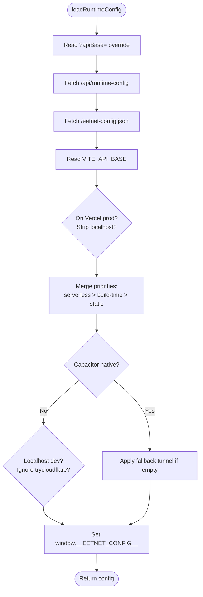
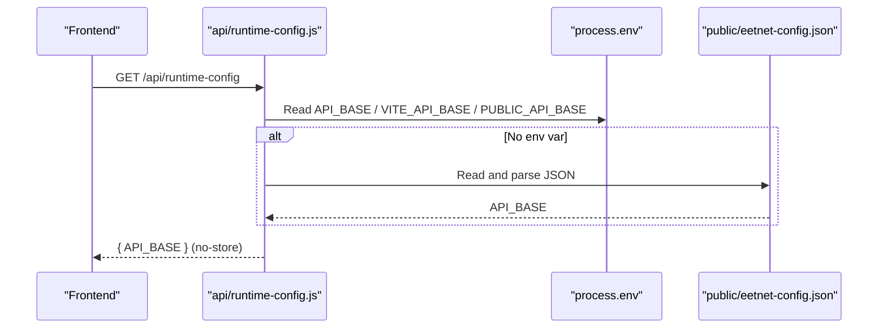
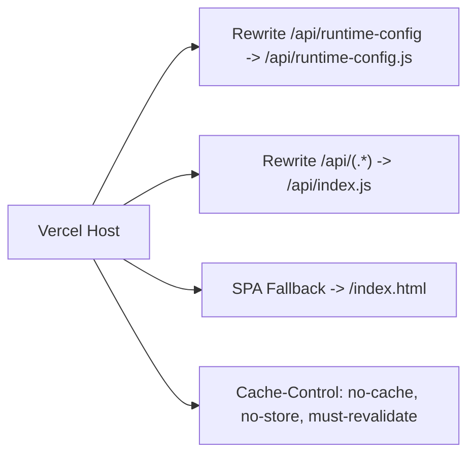
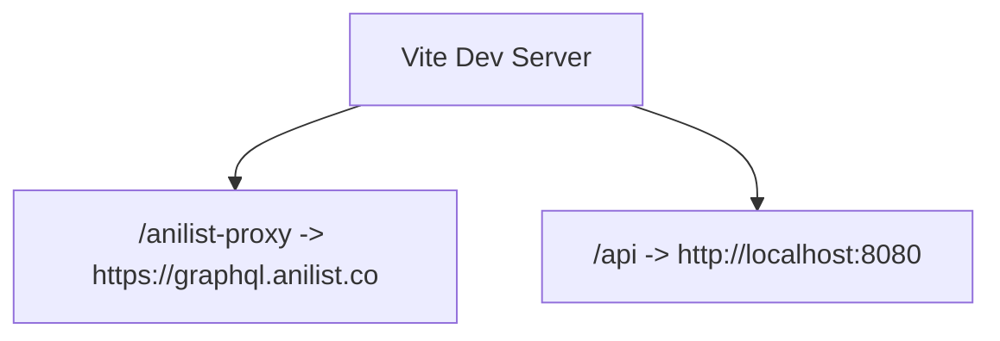
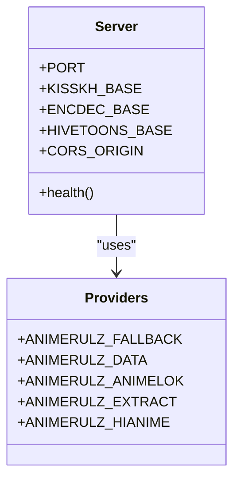
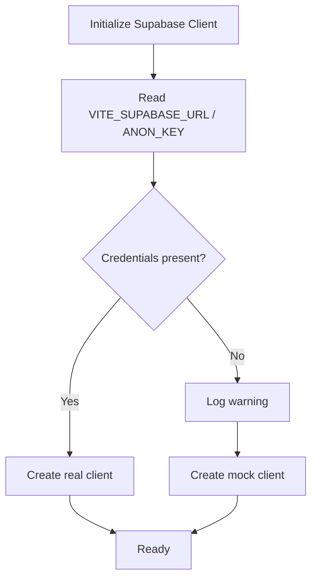
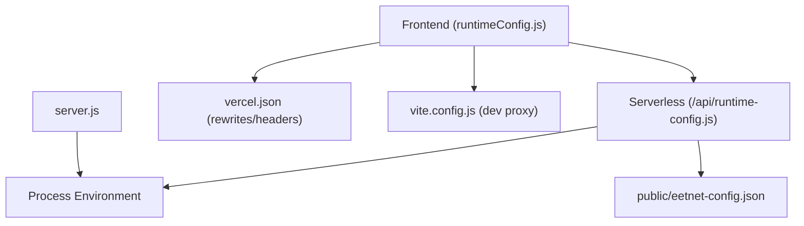

# Environment Variables and Secrets Management

<cite>
**Referenced Files in This Document**
- [src/runtimeConfig.js](file://src/runtimeConfig.js)
- [api/runtime-config.js](file://api/runtime-config.js)
- [.gitignore](file://.gitignore)
- [vercel.json](file://vercel.json)
- [public/eetnet-config.json](file://public/eetnet-config.json)
- [vite.config.js](file://vite.config.js)
- [server.js](file://server.js)
- [package.json](file://package.json)
- [src/supabaseClient.js](file://src/supabaseClient.js)
</cite>

## Table of Contents
1. [Introduction](#introduction)
2. [Project Structure](#project-structure)
3. [Core Components](#core-components)
4. [Architecture Overview](#architecture-overview)
5. [Detailed Component Analysis](#detailed-component-analysis)
6. [Dependency Analysis](#dependency-analysis)
7. [Performance Considerations](#performance-considerations)
8. [Troubleshooting Guide](#troubleshooting-guide)
9. [Conclusion](#conclusion)
10. [Appendices](#appendices)

## Introduction
This document explains how Project Anime manages runtime configuration and secrets across environments. It focuses on:
- How the frontend resolves its API base at runtime via src/runtimeConfig.js
- How the serverless endpoint api/runtime-config.js reads environment variables to serve runtime config
- How .gitignore protects sensitive files like environment variables, API keys, and credentials
- Best practices for managing secrets across development, staging, and production
- How to safely add new environment variables without leaking secrets

## Project Structure
Environment-related configuration spans both client and server:
- Client-side runtime resolution lives in src/runtimeConfig.js
- Serverless runtime config endpoint lives in api/runtime-config.js
- Static fallback configuration is served from public/eetnet-config.json
- Vercel routing and headers are configured in vercel.json
- Development proxy behavior is defined in vite.config.js
- Backend server uses process.env for provider endpoints and secrets in server.js
- Supabase client initialization uses VITE_SUPABASE_* env vars in src/supabaseClient.js
- Sensitive files are excluded by .gitignore

**Diagram sources**
- [src/runtimeConfig.js:82-129](file://src/runtimeConfig.js#L82-L129)
- [api/runtime-config.js:4-24](file://api/runtime-config.js#L4-L24)
- [public/eetnet-config.json:1-4](file://public/eetnet-config.json#L1-L4)
- [vite.config.js:7-21](file://vite.config.js#L7-L21)
- [vercel.json:1-21](file://vercel.json#L1-L21)
- [server.js:12-19](file://server.js#L12-L19)

**Section sources**
- [src/runtimeConfig.js:1-163](file://src/runtimeConfig.js#L1-L163)
- [api/runtime-config.js:1-25](file://api/runtime-config.js#L1-L25)
- [.gitignore:1-31](file://.gitignore#L1-L31)
- [vercel.json:1-22](file://vercel.json#L1-L22)
- [public/eetnet-config.json:1-4](file://public/eetnet-config.json#L1-L4)
- [vite.config.js:1-23](file://vite.config.js#L1-L23)
- [server.js:12-19](file://server.js#L12-L19)
- [package.json:6-12](file://package.json#L6-L12)
- [src/supabaseClient.js:4-6](file://src/supabaseClient.js#L4-L6)

## Core Components
- Runtime config loader (client): Resolves API base using a strict priority chain that supports emergency overrides, serverless config, static fallback, build-time env, and local dev defaults.
- Runtime config endpoint (serverless): Reads environment variables and serves a fresh JSON payload with no-store caching.
- Static fallback config: A JSON file under public/ used as a low-priority fallback when env vars are not set.
- Vercel configuration: Rewrites /api routes and sets cache-control headers to ensure runtime config freshness.
- Dev server proxy: Forwards /api requests to the local backend during development so mobile/LAN devices can use relative paths.
- Backend server: Uses process.env for provider endpoints and secrets; exposes health info including configured providers.
- Supabase client: Initializes only when VITE_SUPABASE_URL and VITE_SUPABASE_ANON_KEY are present; otherwise falls back to a mock client.

**Section sources**
- [src/runtimeConfig.js:16-163](file://src/runtimeConfig.js#L16-L163)
- [api/runtime-config.js:4-24](file://api/runtime-config.js#L4-L24)
- [public/eetnet-config.json:1-4](file://public/eetnet-config.json#L1-L4)
- [vercel.json:1-21](file://vercel.json#L1-L21)
- [vite.config.js:7-21](file://vite.config.js#L7-L21)
- [server.js:12-19](file://server.js#L12-L19)
- [src/supabaseClient.js:4-46](file://src/supabaseClient.js#L4-L46)

## Architecture Overview
The runtime configuration flow ensures that the application always has a valid API base for each environment while keeping secrets out of the repository.

**Diagram sources**
- [src/runtimeConfig.js:82-129](file://src/runtimeConfig.js#L82-L129)
- [api/runtime-config.js:4-24](file://api/runtime-config.js#L4-L24)
- [public/eetnet-config.json:1-4](file://public/eetnet-config.json#L1-L4)

## Detailed Component Analysis

### Client Runtime Configuration (src/runtimeConfig.js)
Key behaviors:
- Priority order: query override, serverless endpoint, build-time env, static config, local dev default.
- Emergency override via URL parameter for quick testing without redeploy.
- Strips localhost values in production to avoid misconfiguration.
- Detects Capacitor native platform to apply appropriate defaults.
- Exposes helpers to get API base and build full API URLs.

**Diagram sources**
- [src/runtimeConfig.js:37-129](file://src/runtimeConfig.js#L37-L129)

**Section sources**
- [src/runtimeConfig.js:16-163](file://src/runtimeConfig.js#L16-L163)

### Serverless Runtime Config Endpoint (api/runtime-config.js)
Key behaviors:
- Reads environment variables in order: API_BASE, VITE_API_BASE, PUBLIC_API_BASE.
- Falls back to reading public/eetnet-config.json if no env var is set.
- Returns JSON with Cache-Control: no-store to prevent CDN caching.

**Diagram sources**
- [api/runtime-config.js:4-24](file://api/runtime-config.js#L4-L24)
- [public/eetnet-config.json:1-4](file://public/eetnet-config.json#L1-L4)

**Section sources**
- [api/runtime-config.js:1-25](file://api/runtime-config.js#L1-L25)
- [public/eetnet-config.json:1-4](file://public/eetnet-config.json#L1-L4)

### Vercel Routing and Headers (vercel.json)
Key behaviors:
- Rewrites /api/runtime-config to the serverless handler.
- Sets cache-control headers to ensure index.html and root are not cached aggressively.
- Routes other /api/* to the main server entry.

**Diagram sources**
- [vercel.json:1-21](file://vercel.json#L1-L21)

**Section sources**
- [vercel.json:1-22](file://vercel.json#L1-L22)

### Development Proxy (vite.config.js)
Key behaviors:
- Proxies /anilist-proxy to external GraphQL endpoint.
- Proxies /api to local backend (localhost:8080), enabling relative API calls during development.

**Diagram sources**
- [vite.config.js:7-21](file://vite.config.js#L7-L21)

**Section sources**
- [vite.config.js:1-23](file://vite.config.js#L1-L23)

### Backend Server Environment Usage (server.js)
Key behaviors:
- Reads provider endpoints and CORS settings from process.env.
- Exposes health endpoint reporting configured providers and ports.
- Uses environment variables for third-party API keys where applicable.

**Diagram sources**
- [server.js:12-19](file://server.js#L12-L19)
- [server.js:748-752](file://server.js#L748-L752)

**Section sources**
- [server.js:12-19](file://server.js#L12-L19)
- [server.js:748-752](file://server.js#L748-L752)

### Supabase Client Initialization (src/supabaseClient.js)
Key behaviors:
- Reads VITE_SUPABASE_URL and VITE_SUPABASE_ANON_KEY from environment.
- If missing, logs a warning and initializes a mock client to prevent runtime errors.
- Integrates with custom storage adapter for Capacitor preferences and localStorage.

**Diagram sources**
- [src/supabaseClient.js:4-46](file://src/supabaseClient.js#L4-L46)

**Section sources**
- [src/supabaseClient.js:1-98](file://src/supabaseClient.js#L1-L98)

## Dependency Analysis
- The frontend depends on the serverless endpoint for runtime configuration and on static JSON as a fallback.
- The serverless endpoint depends on environment variables and optionally on a static JSON file.
- Vercel rewrites ensure the correct handlers are invoked for runtime config and API routes.
- The dev server proxies API calls to the local backend, decoupling frontend from absolute URLs during development.
- The backend server depends on environment variables for provider endpoints and secrets.

**Diagram sources**
- [src/runtimeConfig.js:82-129](file://src/runtimeConfig.js#L82-L129)
- [api/runtime-config.js:4-24](file://api/runtime-config.js#L4-L24)
- [vercel.json:1-21](file://vercel.json#L1-L21)
- [vite.config.js:7-21](file://vite.config.js#L7-L21)
- [server.js:12-19](file://server.js#L12-L19)

**Section sources**
- [src/runtimeConfig.js:82-129](file://src/runtimeConfig.js#L82-L129)
- [api/runtime-config.js:4-24](file://api/runtime-config.js#L4-L24)
- [vercel.json:1-21](file://vercel.json#L1-L21)
- [vite.config.js:7-21](file://vite.config.js#L7-L21)
- [server.js:12-19](file://server.js#L12-L19)

## Performance Considerations
- The serverless endpoint returns no-store headers to avoid stale runtime config from CDNs.
- Static config fetch includes cache-busting parameters to ensure updates propagate quickly.
- In Capacitor native builds, fetch avoids cache-busting headers to work reliably with local files.
- Dev proxy reduces network overhead by forwarding API calls locally instead of requiring absolute URLs.

[No sources needed since this section provides general guidance]

## Troubleshooting Guide
Common issues and resolutions:
- API calls fail due to missing or incorrect API base:
  - Verify the runtime config endpoint returns a valid API_BASE.
  - Ensure environment variables are set correctly in your deployment platform.
  - Use the query override temporarily to test connectivity without redeploying.
- Stale configuration in production:
  - Confirm Vercel headers disable aggressive caching for index.html and root.
  - Check that the serverless endpoint is reachable and returns fresh data.
- Localhost vs production mismatches:
  - On Vercel, localhost values are stripped to prevent accidental usage of dev URLs.
  - In Capacitor APK, a fallback tunnel is applied if no API base is configured.
- Supabase features disabled:
  - If VITE_SUPABASE_URL and VITE_SUPABASE_ANON_KEY are missing, the app falls back to a mock client; configure these variables to enable cloud sync and authentication.

**Section sources**
- [src/runtimeConfig.js:91-129](file://src/runtimeConfig.js#L91-L129)
- [api/runtime-config.js:14-23](file://api/runtime-config.js#L14-L23)
- [vercel.json:1-14](file://vercel.json#L1-L14)
- [src/supabaseClient.js:21-46](file://src/supabaseClient.js#L21-L46)

## Conclusion
Project Anime implements a robust, multi-layered approach to runtime configuration and secrets management:
- Frontend resolves API base dynamically with clear priorities and safe defaults.
- Serverless endpoint centralizes environment variable access and prevents caching issues.
- Static JSON provides a deployable fallback for environments without env vars.
- Vercel configuration ensures proper routing and cache control.
- Development proxy simplifies local development and LAN testing.
- Backend server relies on environment variables for provider endpoints and secrets.
- Supabase integration gracefully degrades when credentials are absent.

Adhering to the best practices outlined below will help maintain secure and reliable deployments across all environments.

[No sources needed since this section summarizes without analyzing specific files]

## Appendices

### Best Practices for Managing Secrets Across Environments
- Never commit secrets to version control:
  - Ensure .env, .env.local, and environment-specific files are ignored by .gitignore.
  - Avoid committing API keys, tokens, or provider URLs directly into source code.
- Use environment variables per environment:
  - Set API_BASE, VITE_API_BASE, and PUBLIC_API_BASE in your deployment platform’s environment settings.
  - Configure provider endpoints and keys via process.env in the backend.
- Prefer runtime config over build-time secrets:
  - Use /api/runtime-config to update API_BASE without redeploying.
  - Keep public/eetnet-config.json as a low-priority fallback for non-secret configuration.
- Validate and sanitize inputs:
  - The runtime config loader trims and cleans API_BASE values to prevent malformed URLs.
- Test with query overrides:
  - Use ?apiBase= to quickly validate different backends without changing configuration files.
- Protect sensitive files:
  - Rely on .gitignore patterns to exclude logs, editor directories, and environment files.
- Document required variables:
  - Maintain an example file (e.g., .env.example) listing required variables without actual secrets.

**Section sources**
- [.gitignore:10-18](file://.gitignore#L10-L18)
- [api/runtime-config.js:14-23](file://api/runtime-config.js#L14-L23)
- [src/runtimeConfig.js:16-21](file://src/runtimeConfig.js#L16-L21)
- [vercel.json:1-21](file://vercel.json#L1-L21)

### How to Add New Environment Variables Safely
Steps:
1. Identify where the variable is used:
   - Frontend: import.meta.env.VITE_*.
   - Backend: process.env.*.
   - Serverless endpoint: process.env.*.
2. Update the relevant modules to read the new variable:
   - For runtime config, extend the priority chain in src/runtimeConfig.js if needed.
   - For serverless endpoint, include the new variable in api/runtime-config.js if it affects runtime config.
3. Configure the variable in your deployment platform:
   - Set the environment variable in Vercel dashboard or CI/CD pipeline.
4. Provide a safe fallback:
   - Ensure the application behaves gracefully if the variable is missing.
5. Test across environments:
   - Use dev proxy for local testing.
   - Use query overrides for quick validation in production-like environments.
6. Update documentation:
   - Record the new variable in project docs and examples.

**Section sources**
- [src/runtimeConfig.js:82-129](file://src/runtimeConfig.js#L82-L129)
- [api/runtime-config.js:14-23](file://api/runtime-config.js#L14-L23)
- [server.js:12-19](file://server.js#L12-L19)
- [src/supabaseClient.js:4-6](file://src/supabaseClient.js#L4-L6)