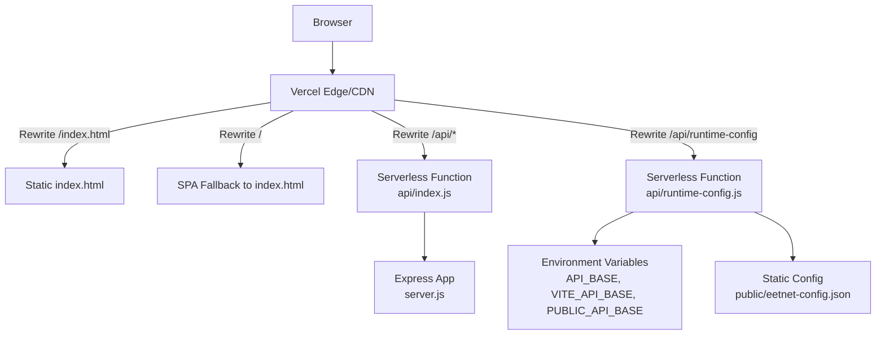
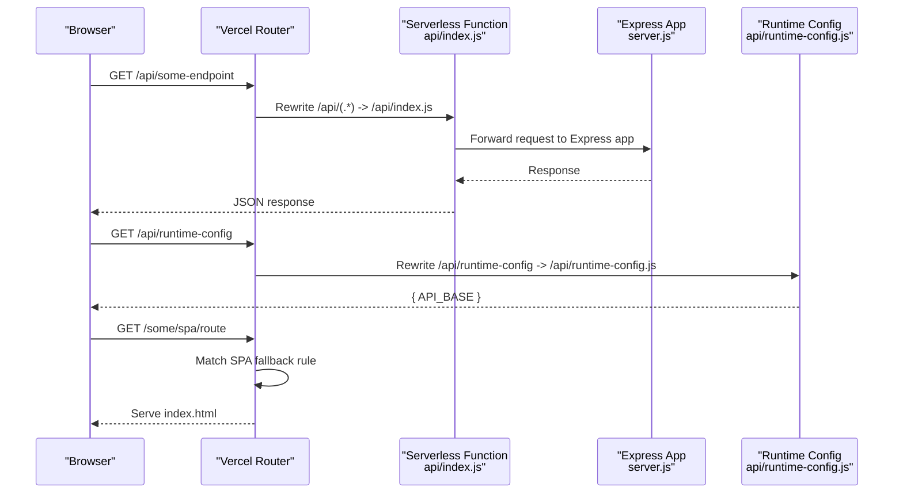
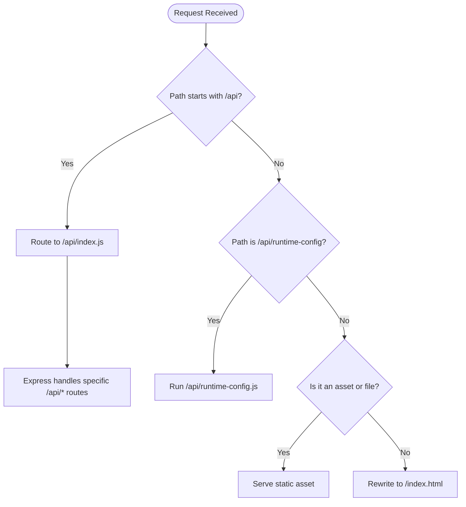
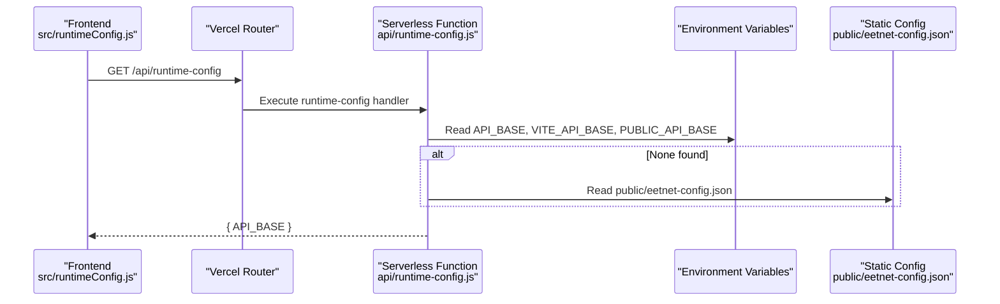
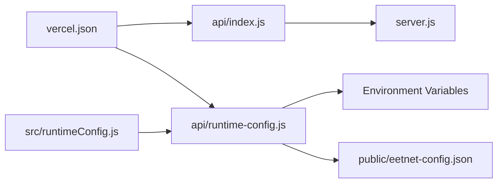

# Vercel Deployment Configuration

<cite>
**Referenced Files in This Document**
- [vercel.json](file://vercel.json)
- [api/index.js](file://api/index.js)
- [api/runtime-config.js](file://api/runtime-config.js)
- [src/runtimeConfig.js](file://src/runtimeConfig.js)
- [public/eetnet-config.json](file://public/eetnet-config.json)
- [server.js](file://server.js)
- [package.json](file://package.json)
</cite>

## Table of Contents
1. [Introduction](#introduction)
2. [Project Structure](#project-structure)
3. [Core Components](#core-components)
4. [Architecture Overview](#architecture-overview)
5. [Detailed Component Analysis](#detailed-component-analysis)
6. [Dependency Analysis](#dependency-analysis)
7. [Performance Considerations](#performance-considerations)
8. [Troubleshooting Guide](#troubleshooting-guide)
9. [Conclusion](#conclusion)

## Introduction
This document explains how Project Anime is configured for deployment on Vercel, focusing on:
- Cache-Control headers to prevent stale index.html and root path caching
- Rewrites that route API calls to serverless functions, expose a runtime configuration endpoint, and enable single-page application (SPA) routing by falling back to index.html
- How these configurations work together to serve static assets, run serverless functions, and handle client-side routes on Vercel

## Project Structure
The deployment relies on a small set of files:
- vercel.json defines HTTP headers and URL rewrites for Vercel
- api/index.js exports the Express app as a serverless function handler
- api/runtime-config.js exposes a serverless endpoint that returns the current API base URL from environment variables or a static config file
- src/runtimeConfig.js resolves the API base at runtime with a clear priority chain and cache-busting behavior
- public/eetnet-config.json provides a static fallback for the API base
- server.js implements the backend logic behind /api/* endpoints
- package.json contains build and start scripts used during development and preview

**Diagram sources**
- [vercel.json:1-21](file://vercel.json#L1-L21)
- [api/index.js:1-4](file://api/index.js#L1-L4)
- [api/runtime-config.js:1-25](file://api/runtime-config.js#L1-L25)
- [server.js:1-30](file://server.js#L1-L30)

**Section sources**
- [vercel.json:1-21](file://vercel.json#L1-L21)
- [api/index.js:1-4](file://api/index.js#L1-L4)
- [api/runtime-config.js:1-25](file://api/runtime-config.js#L1-L25)
- [server.js:1-30](file://server.js#L1-L30)
- [package.json:1-13](file://package.json#L1-L13)

## Core Components
- Headers configuration ensures that index.html and the root path are never cached by CDNs or browsers, preventing stale app shells after deployments.
- Rewrites configure:
  - A dedicated runtime configuration endpoint at /api/runtime-config
  - All /api/* requests to be handled by the serverless function exported from api/index.js
  - Any non-asset, non-file path to fall back to index.html for SPA routing
- The runtime configuration flow reads environment variables first, then falls back to a static JSON file, ensuring flexible configuration without redeployments when possible.

**Section sources**
- [vercel.json:1-21](file://vercel.json#L1-L21)
- [api/runtime-config.js:1-25](file://api/runtime-config.js#L1-L25)
- [src/runtimeConfig.js:1-163](file://src/runtimeConfig.js#L1-L163)
- [public/eetnet-config.json:1-4](file://public/eetnet-config.json#L1-L4)

## Architecture Overview
The Vercel deployment combines static hosting and serverless functions:
- Static assets (JS, CSS, images) are served directly from the build output
- API routes are routed to serverless functions via rewrites
- SPA routes are handled by serving index.html for unmatched paths
- Runtime configuration is fetched at startup to determine the API base URL dynamically

**Diagram sources**
- [vercel.json:16-20](file://vercel.json#L16-L20)
- [api/index.js:1-4](file://api/index.js#L1-L4)
- [api/runtime-config.js:1-25](file://api/runtime-config.js#L1-L25)
- [server.js:22-28](file://server.js#L22-L28)

## Detailed Component Analysis

### Headers Configuration
- Purpose: Prevent caching of index.html and root path responses to avoid stale app shells after updates.
- Behavior:
  - For /index.html, set Cache-Control to no-cache, no-store, must-revalidate
  - For /, set the same strict cache-control policy
- Impact: Ensures users always receive the latest HTML shell, while other static assets can still benefit from long-lived caching strategies defined elsewhere.

**Section sources**
- [vercel.json:2-14](file://vercel.json#L2-L14)

### Rewrites Configuration
- /api/runtime-config:
  - Maps to the serverless function api/runtime-config.js
  - Returns the effective API base URL based on environment variables and a static config file
  - Sets Cache-Control to no-store to ensure fresh values per request
- /api/(.*):
  - Routes all API requests to the serverless function api/index.js
  - The function exports the Express app, enabling serverless execution of backend routes
- SPA fallback:
  - Any path that does not match assets or files is rewritten to /index.html
  - Enables client-side routing to work correctly on Vercel

**Diagram sources**
- [vercel.json:16-20](file://vercel.json#L16-L20)
- [api/index.js:1-4](file://api/index.js#L1-L4)
- [api/runtime-config.js:1-25](file://api/runtime-config.js#L1-L25)

**Section sources**
- [vercel.json:16-20](file://vercel.json#L16-L20)
- [api/index.js:1-4](file://api/index.js#L1-L4)
- [api/runtime-config.js:1-25](file://api/runtime-config.js#L1-L25)

### Runtime Configuration Endpoint
- Endpoint: /api/runtime-config
- Behavior:
  - Reads environment variables in order: API_BASE, VITE_API_BASE, PUBLIC_API_BASE
  - Falls back to a static file public/eetnet-config.json if present
  - Normalizes the value by trimming whitespace and removing trailing slashes
  - Responds with JSON containing the resolved API_BASE
  - Sets Cache-Control to no-store to avoid caching runtime configuration
- Integration:
  - The frontend fetches this endpoint at startup to determine the API base
  - Uses cache-busting query parameters to bypass CDN caches where applicable
  - On Vercel production, local development URLs are stripped to prevent misconfiguration

**Diagram sources**
- [api/runtime-config.js:1-25](file://api/runtime-config.js#L1-L25)
- [src/runtimeConfig.js:82-100](file://src/runtimeConfig.js#L82-L100)
- [public/eetnet-config.json:1-4](file://public/eetnet-config.json#L1-L4)

**Section sources**
- [api/runtime-config.js:1-25](file://api/runtime-config.js#L1-L25)
- [src/runtimeConfig.js:1-163](file://src/runtimeConfig.js#L1-L163)
- [public/eetnet-config.json:1-4](file://public/eetnet-config.json#L1-L4)

### Serverless Function Export
- The serverless function handler is exported from api/index.js
- It imports and exports the Express app from server.js
- Vercel executes this function for any /api/* requests due to the rewrite rule
- The Express app includes middleware to normalize URLs for serverless environments

**Section sources**
- [api/index.js:1-4](file://api/index.js#L1-L4)
- [server.js:1-30](file://server.js#L1-L30)

### SPA Routing Fallback
- Any request that does not match an asset or file is rewritten to /index.html
- This enables client-side routing to manage navigation without server-side page loads
- Combined with strict cache control on index.html, ensures the latest shell is always loaded

**Section sources**
- [vercel.json:16-20](file://vercel.json#L16-L20)

## Dependency Analysis
- vercel.json depends on:
  - api/index.js for handling /api/* routes
  - api/runtime-config.js for exposing runtime configuration
  - server.js for implementing backend logic
  - public/eetnet-config.json as a static fallback for API base configuration
- Frontend runtime configuration depends on:
  - Environment variables set in Vercel dashboard
  - Static config file for fallback scenarios
  - Cache-busting techniques to avoid stale values

**Diagram sources**
- [vercel.json:1-21](file://vercel.json#L1-L21)
- [api/index.js:1-4](file://api/index.js#L1-L4)
- [api/runtime-config.js:1-25](file://api/runtime-config.js#L1-L25)
- [server.js:1-30](file://server.js#L1-L30)
- [src/runtimeConfig.js:1-163](file://src/runtimeConfig.js#L1-L163)
- [public/eetnet-config.json:1-4](file://public/eetnet-config.json#L1-L4)

**Section sources**
- [vercel.json:1-21](file://vercel.json#L1-L21)
- [api/index.js:1-4](file://api/index.js#L1-L4)
- [api/runtime-config.js:1-25](file://api/runtime-config.js#L1-L25)
- [server.js:1-30](file://server.js#L1-L30)
- [src/runtimeConfig.js:1-163](file://src/runtimeConfig.js#L1-L163)
- [public/eetnet-config.json:1-4](file://public/eetnet-config.json#L1-L4)

## Performance Considerations
- Strict cache control on index.html prevents stale app shells but may increase initial load time; consider using versioned filenames for JS/CSS to leverage long-term caching
- Runtime configuration endpoint uses no-store to ensure fresh values, which is appropriate for dynamic configuration but should not be overused for high-frequency endpoints
- Asset caching strategy should be managed separately to optimize performance for static resources

[No sources needed since this section provides general guidance]

## Troubleshooting Guide
- If API calls fail on Vercel:
  - Verify that /api/* requests are being rewritten to the serverless function
  - Check that environment variables are set correctly in the Vercel dashboard
  - Ensure the runtime configuration endpoint returns a valid API base
- If SPA routes break:
  - Confirm that non-asset paths are rewritten to index.html
  - Clear browser cache to ensure the latest index.html is loaded
- If runtime configuration is stale:
  - Check that the runtime configuration endpoint sets no-store cache control
  - Verify that the frontend uses cache-busting when fetching configuration

**Section sources**
- [vercel.json:16-20](file://vercel.json#L16-L20)
- [api/runtime-config.js:22-24](file://api/runtime-config.js#L22-L24)
- [src/runtimeConfig.js:82-100](file://src/runtimeConfig.js#L82-L100)

## Conclusion
Project Anime’s Vercel deployment configuration uses targeted headers and rewrites to:
- Prevent caching issues with index.html and root paths
- Route API calls to serverless functions for scalable backend processing
- Expose a runtime configuration endpoint for dynamic API base resolution
- Enable SPA routing by falling back to index.html for unmatched paths

This setup allows efficient static asset serving, serverless function deployment, and robust client-side routing on the Vercel platform.

[No sources needed since this section summarizes without analyzing specific files]