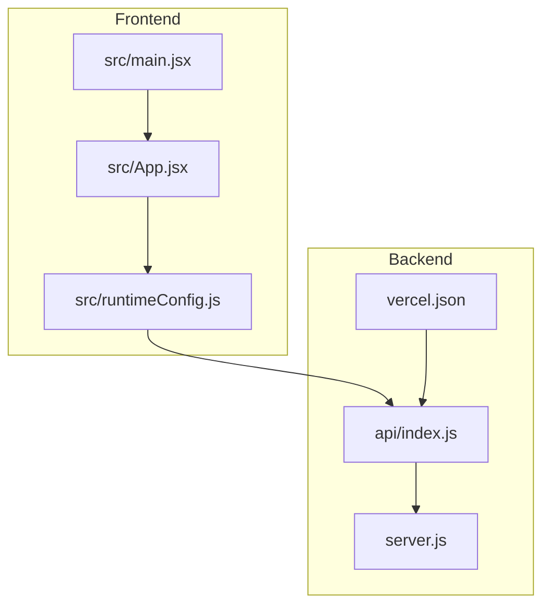
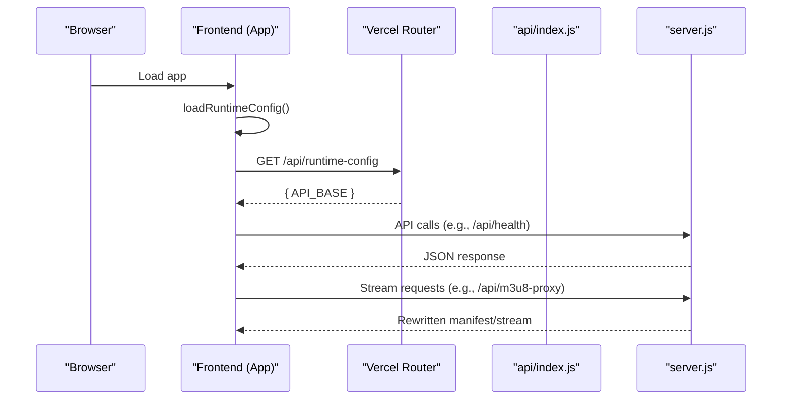
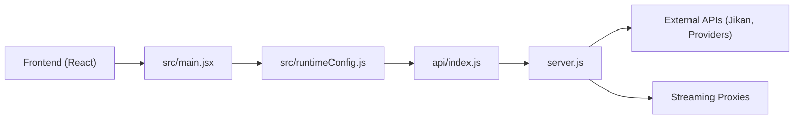

# Monitoring & Logging

<cite>
**Referenced Files in This Document**
- [server.js](file://server.js)
- [api/index.js](file://api/index.js)
- [vercel.json](file://vercel.json)
- [package.json](file://package.json)
- [src/main.jsx](file://src/main.jsx)
- [src/runtimeConfig.js](file://src/runtimeConfig.js)
- [src/supabaseClient.js](file://src/supabaseClient.js)
</cite>

## Table of Contents
1. [Introduction](#introduction)
2. [Project Structure](#project-structure)
3. [Core Components](#core-components)
4. [Architecture Overview](#architecture-overview)
5. [Detailed Component Analysis](#detailed-component-analysis)
6. [Dependency Analysis](#dependency-analysis)
7. [Performance Considerations](#performance-considerations)
8. [Troubleshooting Guide](#troubleshooting-guide)
9. [Conclusion](#conclusion)
10. [Appendices](#appendices)

## Introduction
This document provides comprehensive monitoring and logging guidance for Project Anime, focusing on:
- Server-side logging strategies using Express.js middleware patterns
- Request/response logging and error tracking
- Client-side monitoring including JavaScript error tracking, performance metrics collection, and user behavior analytics
- Database query monitoring, API response time tracking, and resource utilization monitoring
- Log aggregation strategies, log rotation policies, and alerting mechanisms
- Setting up monitoring dashboards, creating custom metrics, and implementing health check endpoints for production environments

The codebase currently uses console-based logs and a basic health endpoint. The recommendations below build on these foundations to introduce structured logging, request timing, error tracking, and observability best practices suitable for production.

## Project Structure
Project Anime is a Node/Express backend with a React frontend. The server exposes streaming proxies, metadata endpoints, and a health check. The frontend loads runtime configuration and renders the application shell.

**Diagram sources**
- [server.js:1-30](file://server.js#L1-L30)
- [api/index.js:1-4](file://api/index.js#L1-L4)
- [vercel.json:16-20](file://vercel.json#L16-L20)
- [src/main.jsx:6-14](file://src/main.jsx#L6-L14)
- [src/runtimeConfig.js:82-129](file://src/runtimeConfig.js#L82-L129)

**Section sources**
- [server.js:1-30](file://server.js#L1-L30)
- [api/index.js:1-4](file://api/index.js#L1-L4)
- [vercel.json:1-22](file://vercel.json#L1-L22)
- [src/main.jsx:1-15](file://src/main.jsx#L1-L15)
- [src/runtimeConfig.js:1-163](file://src/runtimeConfig.js#L1-L163)

## Core Components
- Express server initialization and middleware setup (CORS, JSON parsing, URL normalization)
- Streaming proxies for HLS manifests and segments
- Metadata and search endpoints
- Health check endpoint exposing service status and configuration
- Frontend runtime configuration loader that resolves API base dynamically

Key implementation highlights:
- Middleware chain includes CORS and JSON parsing; URL normalization ensures requests are routed under /api when needed.
- Proxies handle HLS manifest rewriting and segment streaming with proper headers and range support.
- Health endpoint returns service uptime, public host, and provider configuration.

**Section sources**
- [server.js:10-28](file://server.js#L10-L28)
- [server.js:235-345](file://server.js#L235-L345)
- [server.js:354-393](file://server.js#L354-L393)
- [server.js:715-735](file://server.js#L715-L735)

## Architecture Overview
The runtime flow involves the frontend resolving the API base via runtime config, then calling backend endpoints. The backend processes requests through middleware and routes, returning responses or proxying external streams.

**Diagram sources**
- [src/runtimeConfig.js:82-129](file://src/runtimeConfig.js#L82-L129)
- [vercel.json:16-20](file://vercel.json#L16-L20)
- [api/index.js:1-4](file://api/index.js#L1-L4)
- [server.js:715-735](file://server.js#L715-L735)
- [server.js:263-345](file://server.js#L263-L345)

## Detailed Component Analysis

### Server-Side Logging Strategy
Current state:
- Console logs are used throughout handlers for debugging and operational visibility.
- No centralized logger or structured format is implemented.

Recommended strategy:
- Introduce a structured logging utility that outputs JSON lines with fields like timestamp, level, method, path, statusCode, durationMs, userId (if available), and message.
- Wrap request handling with middleware to capture:
  - Incoming request details (method, path, headers like User-Agent, Referer)
  - Response status and duration
  - Errors with stack traces and context
- Use log levels (info, warn, error) consistently across handlers.

Implementation pattern:
- Add an Express middleware early in the chain to start timers and attach a response hook to compute duration and emit structured logs.
- Centralize error logging in a global error handler that captures unhandled exceptions and returns consistent error responses.

Example integration points:
- Place middleware after CORS and JSON parsing but before route handlers.
- Ensure streaming endpoints (HLS proxies) do not buffer large payloads; log only metadata and avoid capturing full stream bodies.

**Section sources**
- [server.js:10-28](file://server.js#L10-L28)
- [server.js:235-345](file://server.js#L235-L345)
- [server.js:354-393](file://server.js#L354-L393)

### Request/Response Logging
To track API response times and request volumes:
- Measure request duration from start to finish using process.hrtime or Date.now().
- Attach durationMs and statusCode to each log line.
- For high-throughput endpoints (proxies), sample logs to reduce overhead.

Guidelines:
- Avoid logging sensitive data (tokens, cookies).
- Normalize paths and mask dynamic IDs where appropriate.
- Include correlation IDs per request to trace across services.

**Section sources**
- [server.js:263-345](file://server.js#L263-L345)
- [server.js:354-393](file://server.js#L354-L393)

### Error Tracking
Current state:
- Handlers use console.error for failures and return error responses.
- No global error handler is present.

Recommended approach:
- Implement a global error-handling middleware that catches thrown errors and unhandled promise rejections.
- Capture error type, message, stack, and contextual metadata (request path, user agent, client IP if available).
- Emit structured error logs and respond with standardized error payloads.

Integration points:
- Register error middleware at the end of the Express pipeline.
- Wrap async route handlers with try/catch blocks to ensure consistent error handling.

**Section sources**
- [server.js:235-345](file://server.js#L235-L345)
- [server.js:354-393](file://server.js#L354-L393)

### Client-Side Monitoring
Current state:
- Frontend uses console.log/warn for runtime configuration and lifecycle events.
- No dedicated error tracking or performance metrics collection is implemented.

Recommendations:
- JavaScript error tracking:
  - Install a lightweight error reporter (e.g., Sentry) and initialize it early in main.jsx.
  - Capture unhandled promise rejections and window.onerror.
- Performance metrics:
  - Use Performance API to measure navigation timing, resource loading, and long tasks.
  - Report key metrics (FCP, LCP, TTFB) to your analytics backend.
- User behavior analytics:
  - Track page views, feature usage, and interactions via an analytics SDK or custom beacon.
  - Respect privacy settings and provide opt-out controls.

Integration points:
- Initialize monitoring in src/main.jsx before rendering App.
- Use src/runtimeConfig.js to gate telemetry based on environment or feature flags.

**Section sources**
- [src/main.jsx:6-14](file://src/main.jsx#L6-L14)
- [src/runtimeConfig.js:82-129](file://src/runtimeConfig.js#L82-L129)

### Database Query Monitoring
Current state:
- Supabase client is used conditionally; a mock client is provided when credentials are missing.
- No explicit query monitoring or instrumentation is present.

Recommendations:
- If using Supabase, enable query logging in development and consider adding tracing for critical queries.
- Wrap database calls with timing and error logging to detect slow queries and failures.
- In production, rely on platform-level database logs and set alerts for error rates and latency spikes.

**Section sources**
- [src/supabaseClient.js:41-61](file://src/supabaseClient.js#L41-L61)

### API Response Time Tracking
Current state:
- No built-in response time tracking exists.

Recommendations:
- Add request duration measurement in middleware.
- Export metrics (e.g., Prometheus histograms) for HTTP request durations by route and status code.
- Set SLOs and alert on p95/p99 latency thresholds.

**Section sources**
- [server.js:263-345](file://server.js#L263-L345)
- [server.js:354-393](file://server.js#L354-L393)

### Resource Utilization Monitoring
Current state:
- No resource monitoring is implemented.

Recommendations:
- Monitor Node.js memory and CPU usage via process metrics and OS-level tools.
- Use APM solutions to visualize resource consumption and identify bottlenecks.
- Configure alerts for memory leaks or high CPU usage.

[No sources needed since this section provides general guidance]

### Log Aggregation Strategies
- Ship structured logs to a centralized system (e.g., CloudWatch, Datadog, ELK).
- Use log levels and tags to filter and route logs.
- Correlate logs with request IDs across frontend and backend.

[No sources needed since this section provides general guidance]

### Log Rotation Policies
- Rotate logs by size and/or time to prevent disk exhaustion.
- Compress rotated logs and retain according to compliance requirements.
- Ensure streaming endpoints do not write excessive logs that could impact throughput.

[No sources needed since this section provides general guidance]

### Alerting Mechanisms
- Define alerts for:
  - Error rate spikes (HTTP 5xx)
  - Latency SLO breaches (p95/p99)
  - Service health check failures
  - External dependency failures (e.g., Jikan, CDN timeouts)
- Route alerts to incident channels (Slack, PagerDuty).

[No sources needed since this section provides general guidance]

### Monitoring Dashboards
- Build dashboards showing:
  - Request volume and error rates by route
  - Response time percentiles
  - Upstream provider success/failure rates
  - Resource utilization (CPU, memory)
- Include panels for streaming proxy performance and HLS segment retrieval.

[No sources needed since this section provides general guidance]

### Custom Metrics
- Define custom metrics for:
  - Provider selection outcomes (primary/secondary/fallback)
  - Cache hit/miss ratios
  - Stream resolution and retry counts
- Expose metrics via a metrics endpoint or push to a metrics collector.

[No sources needed since this section provides general guidance]

### Health Check Endpoints
Current state:
- A health endpoint exists that returns service status, uptime, public host, port, CORS origin, providers, and configuration origins.

Recommendations:
- Expand health checks to include:
  - Dependency health (external APIs, databases)
  - Disk space and memory thresholds
  - Queue lengths or worker statuses
- Return detailed status codes (200 OK, 503 Unavailable) based on dependency states.

**Section sources**
- [server.js:715-735](file://server.js#L715-L735)

## Dependency Analysis
The backend depends on Express, Axios, Cheerio, and Consumet extensions. The frontend depends on React, HLS.js, and Supabase. Vercel routing directs /api calls to the serverless function entry point.

**Diagram sources**
- [src/main.jsx:6-14](file://src/main.jsx#L6-L14)
- [src/runtimeConfig.js:82-129](file://src/runtimeConfig.js#L82-L129)
- [api/index.js:1-4](file://api/index.js#L1-L4)
- [server.js:263-345](file://server.js#L263-L345)

**Section sources**
- [package.json:14-35](file://package.json#L14-L35)
- [vercel.json:16-20](file://vercel.json#L16-L20)
- [api/index.js:1-4](file://api/index.js#L1-L4)
- [server.js:1-30](file://server.js#L1-L30)

## Performance Considerations
- Streaming proxies must preserve Range headers and avoid buffering entire files to minimize latency and bandwidth.
- Use caching for metadata and catalog data to reduce upstream calls.
- Sample logs for high-frequency endpoints to reduce I/O overhead.
- Monitor memory usage to prevent leaks in long-running processes.

[No sources needed since this section provides general guidance]

## Troubleshooting Guide
Common issues and diagnostics:
- Missing API_BASE:
  - Frontend will log warnings and attempt fallbacks; verify runtime config resolution.
- External API failures:
  - Check upstream availability and timeouts; review error logs for specific messages.
- Streaming issues:
  - Validate referer and origin headers; inspect rewritten manifest URLs.
- Health check failures:
  - Inspect dependencies and environment variables; confirm CORS and port configuration.

Actionable steps:
- Enable structured logging and correlate errors with request IDs.
- Use the health endpoint to validate service readiness.
- Review logs for repeated errors and set alerts for recurring patterns.

**Section sources**
- [src/runtimeConfig.js:82-129](file://src/runtimeConfig.js#L82-L129)
- [server.js:715-735](file://server.js#L715-L735)

## Conclusion
Project Anime’s current logging relies on console statements and a basic health endpoint. To achieve production-grade observability:
- Implement structured logging with request/response timing and error tracking.
- Add client-side error monitoring and performance metrics.
- Instrument database queries and external API calls.
- Centralize logs, rotate them appropriately, and configure alerting.
- Expand health checks and build dashboards for real-time insights.

These enhancements will improve reliability, speed up troubleshooting, and provide actionable insights into system performance and user experience.

[No sources needed since this section summarizes without analyzing specific files]

## Appendices

### Health Endpoint Reference
- Endpoint: GET /api/health
- Returns:
  - status: string indicating service health
  - service: identifier
  - startedAt: ISO timestamp of server start
  - uptimeSeconds: integer seconds since start
  - publicBase: computed public host
  - port: numeric port
  - corsOrigin: configured CORS origin
  - providers: list of supported providers
  - config: provider base URLs

**Section sources**
- [server.js:715-735](file://server.js#L715-L735)

### Runtime Configuration Resolution
- Priority order:
  - Query param override (?apiBase=)
  - /api/runtime-config (reads env vars)
  - Static config file (/eetnet-config.json)
  - Build-time env (VITE_API_BASE)
  - Local dev auto-detect
- Ensures correct API base across environments and native platforms.

**Section sources**
- [src/runtimeConfig.js:1-163](file://src/runtimeConfig.js#L1-L163)