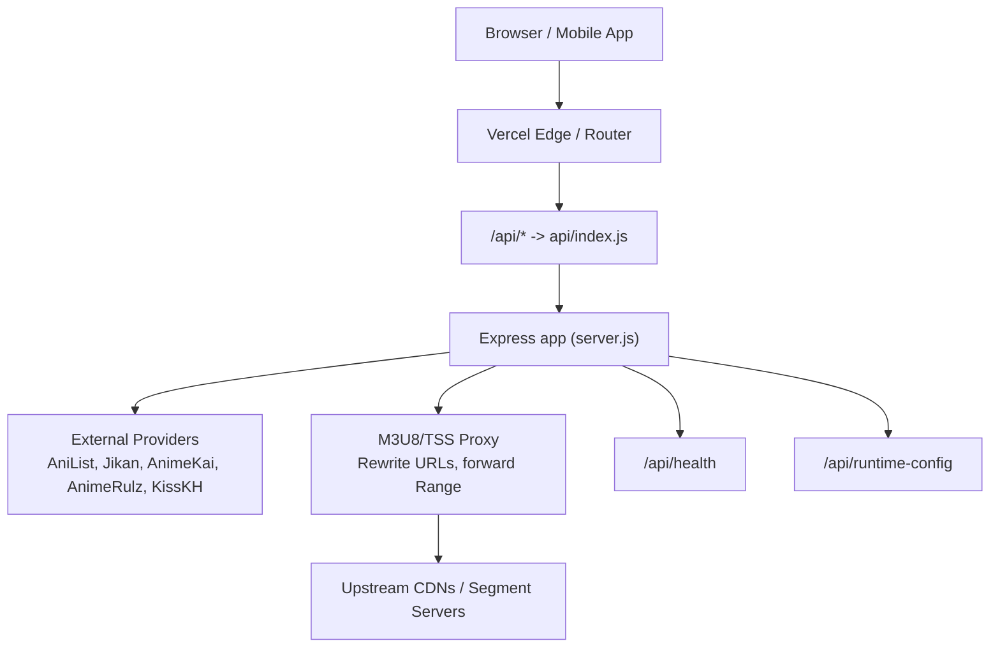
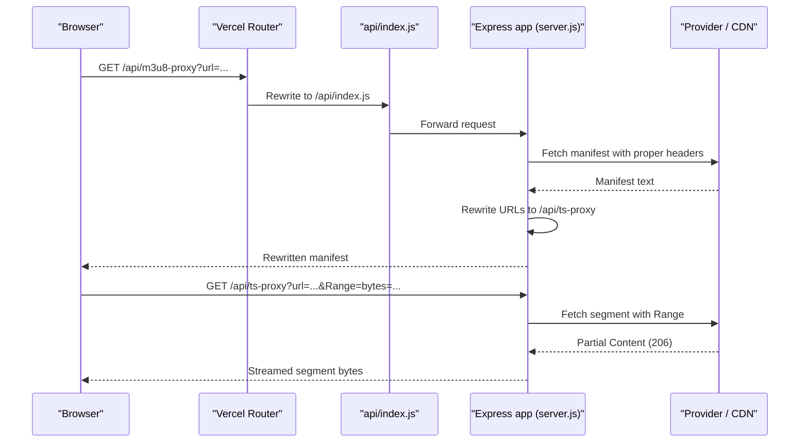
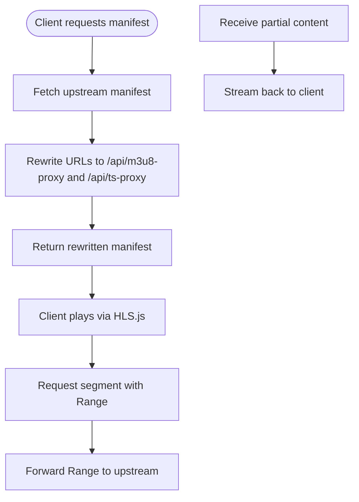
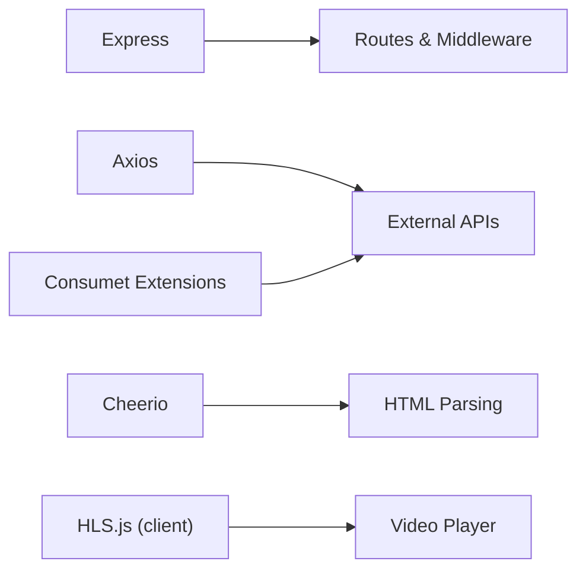

# Scaling & Performance

<cite>
**Referenced Files in This Document**
- [server.js](file://server.js)
- [api/index.js](file://api/index.js)
- [api/runtime-config.js](file://api/runtime-config.js)
- [package.json](file://package.json)
- [vercel.json](file://vercel.json)
- [proxy.py](file://proxy.py)
- [src/components/VideoPlayer.jsx](file://src/components/VideoPlayer.jsx)
- [src/utils/sessionRestore.js](file://src/utils/sessionRestore.js)
</cite>

## Table of Contents
1. [Introduction](#introduction)
2. [Project Structure](#project-structure)
3. [Core Components](#core-components)
4. [Architecture Overview](#architecture-overview)
5. [Detailed Component Analysis](#detailed-component-analysis)
6. [Dependency Analysis](#dependency-analysis)
7. [Performance Considerations](#performance-considerations)
8. [Troubleshooting Guide](#troubleshooting-guide)
9. [Conclusion](#conclusion)
10. [Appendices](#appendices)

## Introduction
This document provides a comprehensive scaling and performance guide for Project Anime’s Express.js backend and streaming pipeline. It covers horizontal and vertical scaling strategies, load balancing, session management, caching (in-memory, CDN, browser), database considerations (connection pooling and query optimization), video streaming optimization (HLS segment handling, adaptive bitrate, bandwidth control), monitoring and bottleneck identification, and memory/resource management for high-traffic scenarios.

## Project Structure
The backend is a single-process Express application that:
- Normalizes routes for serverless environments
- Proxies and rewrites HLS manifests and segments to bypass CORS and referrer restrictions
- Caches metadata and stream resolution results in process memory
- Exposes health and runtime configuration endpoints
- Integrates with external providers via HTTP clients

**Diagram sources**
- [vercel.json:16-20](file://vercel.json#L16-L20)
- [api/index.js:1-4](file://api/index.js#L1-L4)
- [server.js:22-28](file://server.js#L22-L28)
- [server.js:263-393](file://server.js#L263-L393)
- [server.js:715-735](file://server.js#L715-L735)
- [api/runtime-config.js:4-24](file://api/runtime-config.js#L4-L24)

**Section sources**
- [vercel.json:1-22](file://vercel.json#L1-L22)
- [api/index.js:1-4](file://api/index.js#L1-L4)
- [server.js:22-28](file://server.js#L22-L28)

## Core Components
- Express app initialization and middleware: trust proxy, CORS, JSON parsing, URL normalization for serverless routing
- HLS manifest and segment proxies: rewrite provider URLs to go through the backend; forward Range headers for efficient streaming
- In-memory caches: Map-based TTL caches for anime episode lists, stream resolutions, Jikan episodes, AniList GraphQL responses, and movie home data
- Provider integrations: AnimeKai, AnimeRulz, AniList, Jikan, KissKH (via optional relay)
- Health and runtime config endpoints for deployment diagnostics

Key implementation references:
- Route normalization and public host detection
- M3U8 and TS proxies with header forwarding and range support
- Multiple TTL-based caches for metadata and streams
- External provider calls with timeouts and retries

**Section sources**
- [server.js:10-20](file://server.js#L10-L20)
- [server.js:22-36](file://server.js#L22-L36)
- [server.js:263-393](file://server.js#L263-L393)
- [server.js:413-425](file://server.js#L413-L425)
- [server.js:1161-1200](file://server.js#L1161-L1200)
- [server.js:3514-3608](file://server.js#L3514-L3608)

## Architecture Overview
The system uses an in-process cache layer and a streaming proxy to centralize access to third-party content while controlling headers, referers, and byte-range requests. Deployment targets include standalone Node processes and Vercel serverless functions.

**Diagram sources**
- [vercel.json:16-20](file://vercel.json#L16-L20)
- [api/index.js:1-4](file://api/index.js#L1-L4)
- [server.js:263-393](file://server.js#L263-L393)

## Detailed Component Analysis

### Express Backend Scaling and Load Balancing
- Horizontal scaling:
  - Run multiple instances behind a reverse proxy or load balancer (e.g., Nginx, Cloudflare Load Balancer). The app trusts proxies and derives the public base URL from forwarded headers, making it suitable for multi-instance deployments.
  - Stateless design: No in-process session state tied to specific instances; client-side session persistence is used instead.
- Vertical scaling:
  - Increase CPU/RAM per instance to handle more concurrent streams and larger in-memory caches.
  - Tune Node.js heap size if needed for large caches or heavy media processing.
- Serverless considerations:
  - Vercel rewrites all non-API routes to index.html and routes /api/* to a single handler. Ensure cold start times are acceptable and consider keeping warm instances if possible.
  - Use environment variables to configure CORS and provider bases.

Operational notes:
- Trust proxy and public host derivation ensure correct URLs when behind proxies or tunnels.
- CORS is configurable via environment variable.

**Section sources**
- [server.js:10-20](file://server.js#L10-L20)
- [server.js:22-36](file://server.js#L22-L36)
- [vercel.json:16-20](file://vercel.json#L16-L20)
- [package.json:6-12](file://package.json#L6-L12)

### Session Management
- Client-side session persistence:
  - The frontend saves and restores app state locally, including navigation and video progress, with expiration policies.
- Server-side sessions:
  - Not implemented; the backend is stateless regarding user sessions. Authentication, if added, should use tokens stored on the client and validated server-side without relying on in-process session stores.

Recommendations:
- For authenticated features, implement JWT or similar token-based auth with short-lived access tokens and refresh flows.
- If server-side sessions are required, use Redis-backed sessions to enable horizontal scaling.

**Section sources**
- [src/utils/sessionRestore.js:1-55](file://src/utils/sessionRestore.js#L1-L55)

### Caching Strategies
- In-memory caches (process-scoped):
  - Anime episode lists, stream resolutions, Jikan episodes, AniList GraphQL responses, and movie home data are cached using Maps with TTLs.
  - Benefits: Reduced latency and fewer upstream calls.
  - Limitations: Cache is lost on process restart; not shared across instances.
- CDN integration:
  - Image proxy sets long-lived cache headers for images.
  - Subtitle proxy sets moderate cache headers for VTT files.
  - HLS segments rely on upstream CDN behavior; the backend forwards Accept-Ranges and relevant headers to preserve caching semantics.
- Browser caching:
  - Vercel headers disable aggressive caching for root and index.html to ensure fresh app code.
  - Static assets can be configured with immutable caching where appropriate.

TTL guidelines:
- Short TTLs for dynamic stream resolution (minutes)
- Medium TTLs for catalog and metadata (hours)
- Longer TTLs for static images and subtitles (days)

**Section sources**
- [server.js:227-228](file://server.js#L227-L228)
- [server.js:413-425](file://server.js#L413-L425)
- [server.js:1161-1162](file://server.js#L1161-L1162)
- [server.js:1620-1627](file://server.js#L1620-L1627)
- [server.js:186-188](file://server.js#L186-L188)
- [server.js:248-251](file://server.js#L248-L251)
- [vercel.json:1-14](file://vercel.json#L1-L14)

### Database Scaling Considerations
- Current state:
  - The backend does not connect to a relational database; it primarily scrapes and proxies content from external APIs.
- Recommendations if adding a database:
  - Connection pooling: Use a pool manager (e.g., pg.Pool) sized to match concurrency and CPU cores.
  - Query optimization:
    - Index frequently filtered columns (e.g., anilistId, slug).
    - Use pagination and limit clauses to avoid large result sets.
    - Prefer read replicas for analytics or heavy reads.
  - Caching layer:
    - Add Redis for cross-process caching to share results across instances.
  - Write patterns:
    - Batch writes and use background jobs for heavy transformations.

[No sources needed since this section provides general guidance]

### Video Streaming Optimization
- HLS manifest rewriting:
  - The backend rewrites playlist entries to route through its own proxy, ensuring CORS compliance and controlled referer/origin headers.
- Byte-range streaming:
  - The segment proxy forwards Range headers so only requested segments are fetched, enabling fast startup and efficient bandwidth usage.
- Adaptive bitrate:
  - The frontend detects quality levels from the manifest and exposes controls; HLS.js handles automatic adaptation based on network conditions.
- Bandwidth management:
  - Configure HLS.js buffer sizes and retry settings to balance startup time and resilience.
  - Use upstream CDN caching for segments to reduce origin load.

**Diagram sources**
- [server.js:263-393](file://server.js#L263-L393)
- [src/components/VideoPlayer.jsx:178-282](file://src/components/VideoPlayer.jsx#L178-L282)

**Section sources**
- [server.js:263-393](file://server.js#L263-L393)
- [src/components/VideoPlayer.jsx:178-282](file://src/components/VideoPlayer.jsx#L178-L282)

### Monitoring and Bottleneck Identification
- Health endpoint:
  - Provides service status, uptime, public base URL, port, CORS origin, and provider configuration summary.
- Logging:
  - Console logs capture errors and warnings for proxies and provider calls; integrate structured logging for production.
- Metrics:
  - Add request timing, error rates, and cache hit ratios.
  - Monitor memory usage and GC pauses for long-running processes.
- Tools:
  - Use APM tools (e.g., OpenTelemetry, Prometheus + Grafana) to track latency, throughput, and resource utilization.
  - For Vercel, leverage platform metrics and custom logs.

**Section sources**
- [server.js:715-735](file://server.js#L715-L735)

### Memory Management and Resource Cleanup
- In-memory caches:
  - TTL-based eviction prevents unbounded growth; ensure TTLs align with data volatility.
  - Consider LRU maps or external caches (Redis) for multi-instance deployments.
- Streams and connections:
  - Properly pipe upstream streams to responses; ensure timeouts and error handling prevent leaks.
  - Close or destroy HLS instances on component unmount to free resources.
- Garbage collection tuning:
  - Monitor heap usage; adjust Node.js flags (e.g., --max-old-space-size) if necessary.
  - Avoid holding large buffers in memory; prefer streaming where possible.

**Section sources**
- [server.js:227-228](file://server.js#L227-L228)
- [server.js:413-425](file://server.js#L413-L425)
- [server.js:354-393](file://server.js#L354-L393)
- [src/components/VideoPlayer.jsx:279-282](file://src/components/VideoPlayer.jsx#L279-L282)

## Dependency Analysis
The backend depends on:
- Express for routing and middleware
- Axios for HTTP requests with timeouts and agents
- Cheerio for HTML parsing
- Consumet extensions for standardized provider access
- HLS.js on the client for adaptive streaming

**Diagram sources**
- [package.json:14-34](file://package.json#L14-L34)
- [server.js:1-9](file://server.js#L1-L9)
- [src/components/VideoPlayer.jsx:178-282](file://src/components/VideoPlayer.jsx#L178-L282)

**Section sources**
- [package.json:14-34](file://package.json#L14-L34)
- [server.js:1-9](file://server.js#L1-L9)

## Performance Considerations
- Horizontal scaling:
  - Deploy multiple instances behind a load balancer; keep the app stateless.
  - Use a shared cache (Redis) if cross-instance caching is needed.
- Vertical scaling:
  - Allocate sufficient CPU and memory for concurrent streams and scraping workloads.
- Caching:
  - Extend TTLs for stable data; invalidate aggressively for volatile data.
  - Leverage CDN caching for segments and images.
- Streaming:
  - Ensure Range header forwarding is enabled; validate upstream support for 206 Partial Content.
  - Tune HLS.js buffer and retry settings for your target networks.
- Rate limiting:
  - Implement rate limits at the gateway or within the app to protect upstream providers.
- Error handling:
  - Graceful degradation when providers fail; fallback chains are already present for some flows.

[No sources needed since this section provides general guidance]

## Troubleshooting Guide
- Common issues:
  - 403 Forbidden from upstream due to missing or incorrect headers: Ensure User-Agent, Referer, and Origin are set appropriately.
  - CORS blocks: Use the provided proxies to normalize origins and headers.
  - Slow startup: Verify Range header forwarding and upstream 206 support.
  - Cache misses: Check TTLs and ensure keys are consistent.
- Diagnostics:
  - Use /api/health to verify service status and configuration.
  - Inspect console logs for proxy errors and provider failures.
  - Validate Vercel headers and rewrites if serving via serverless.

**Section sources**
- [server.js:715-735](file://server.js#L715-L735)
- [server.js:263-393](file://server.js#L263-L393)
- [vercel.json:1-20](file://vercel.json#L1-L20)

## Conclusion
Project Anime’s backend is optimized for streaming-centric workloads with robust HLS proxying, in-memory caching, and provider abstraction. For high-traffic scaling, adopt horizontal scaling with stateless instances, shared caching via Redis, and CDN integration. Monitor performance closely, tune HLS buffering, and ensure proper header handling to maintain reliability and speed.

[No sources needed since this section summarizes without analyzing specific files]

## Appendices

### Environment and Configuration
- CORS_ORIGIN: Controls allowed origins for CORS.
- PORT: Server listening port (default 8080).
- KISSKH_BASE, ENCDEC_BASE, HIVETOONS_BASE: Provider base URLs; can point to relays for trusted IPs.
- ANIMERULZ_*: Base URLs for AnimeRulz services.
- VERCEL: Indicates serverless environment to skip direct listen.

**Section sources**
- [server.js:15-19](file://server.js#L15-L19)
- [server.js:748-753](file://server.js#L748-L753)
- [server.js:3610-3628](file://server.js#L3610-L3628)

### Optional Relay for Provider Access
- A Python-based relay can be used to route requests through a trusted IP when providers block cloud/datacenter addresses.

**Section sources**
- [proxy.py:1-36](file://proxy.py#L1-L36)