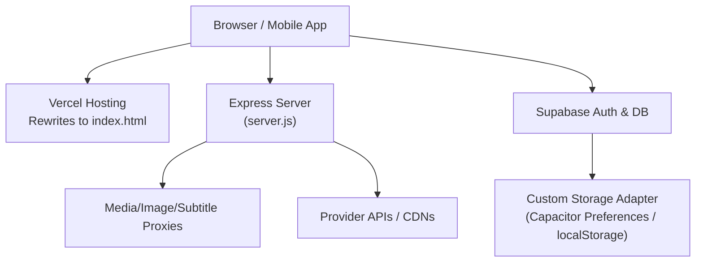
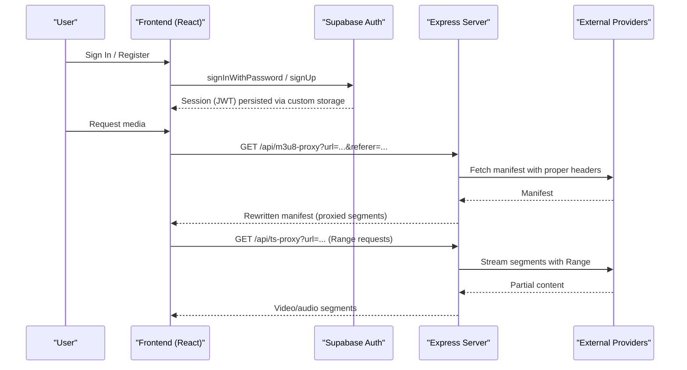
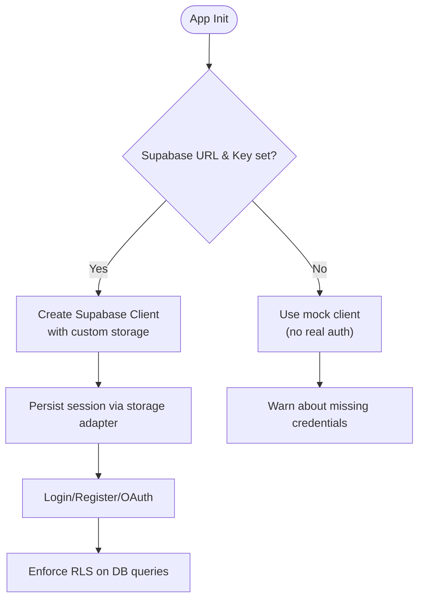
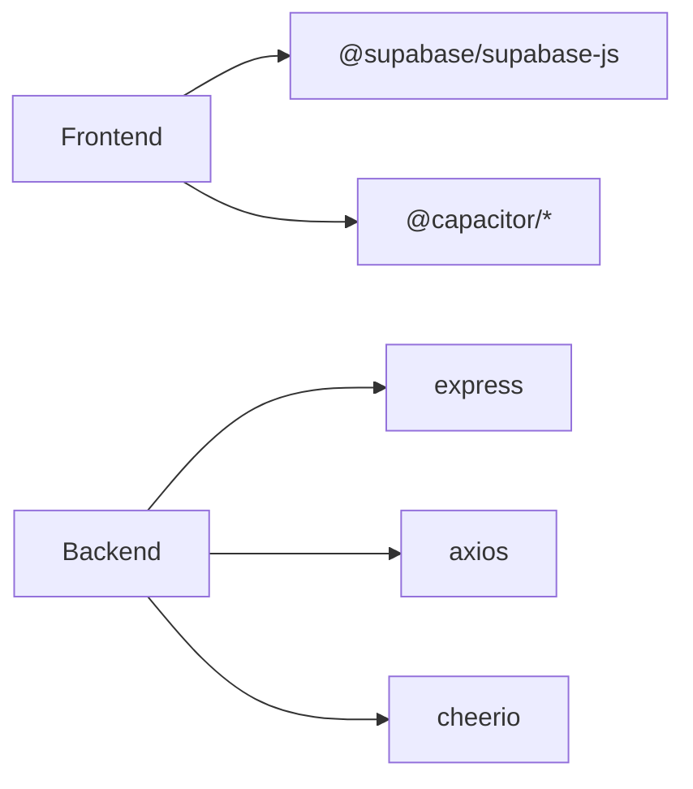

# Security & Compliance

<cite>
**Referenced Files in This Document**
- [supabaseClient.js](file://src/supabaseClient.js)
- [AuthModal.jsx](file://src/components/AuthModal.jsx)
- [storage.js](file://src/utils/storage.js)
- [server.js](file://server.js)
- [vercel.json](file://vercel.json)
- [package.json](file://package.json)
- [capacitor.config.json](file://capacitor.config.json)
- [build.gradle](file://android/app/build.gradle)
- [proguard-rules.pro](file://android/app/proguard-rules.pro)
</cite>

## Table of Contents
1. Introduction
2. Project Structure
3. Core Components
4. Architecture Overview
5. Detailed Component Analysis
6. Dependency Analysis
7. Performance Considerations
8. Troubleshooting Guide
9. Conclusion
10. Appendices

## Introduction
This document provides comprehensive security and compliance guidance for Project Anime, focusing on authentication and authorization with Supabase, session management, CORS configuration, input validation, data protection, secure API design, vulnerability scanning, GDPR-related privacy controls, and mobile app security considerations. It maps findings directly to the repository’s codebase and highlights areas that require hardening or additional implementation.

## Project Structure
Project Anime is a hybrid application:
- Frontend: React + Vite SPA served from Vercel (rewrites configured).
- Backend: Express server handling proxies for media streams, image proxying, subtitle proxying, and metadata fetching.
- Mobile: Capacitor-based Android wrapper around the web build.
- Authentication: Supabase JS client integrated into the frontend with custom storage adapter.

**Diagram sources**
- [server.js:1-28](file://server.js#L1-L28)
- [vercel.json:1-21](file://vercel.json#L1-L21)
- [supabaseClient.js:1-39](file://src/supabaseClient.js#L1-L39)
- [storage.js:1-71](file://src/utils/storage.js#L1-L71)

**Section sources**
- [server.js:1-28](file://server.js#L1-L28)
- [vercel.json:1-21](file://vercel.json#L1-L21)

## Core Components
- Authentication and Session Management: Supabase client initialized with environment variables; custom storage adapter persists sessions across app restarts on both web and native platforms.
- Authorization: Relies on Supabase Row Level Security policies defined in the Supabase project (not present in this repo).
- CORS: Configured via Express cors middleware using an environment variable; default allows all origins in development.
- Input Validation: Basic client-side validation in auth forms; server validates required query parameters for proxy endpoints.
- Data Protection: TLS enforced by HTTPS at hosting layer; backend disables TLS verification for specific scraping targets (security risk).
- Secure API Design: Proxies normalize URLs, enforce referer/origin headers, and handle HLS segment streaming with range requests.
- Mobile Security: Capacitor config includes mixed content allowance; ProGuard rules are present but minification disabled in release builds.

**Section sources**
- [supabaseClient.js:1-39](file://src/supabaseClient.js#L1-L39)
- [AuthModal.jsx:121-187](file://src/components/AuthModal.jsx#L121-L187)
- [storage.js:1-71](file://src/utils/storage.js#L1-L71)
- [server.js:1-28](file://server.js#L1-L28)
- [server.js:201-203](file://server.js#L201-L203)
- [capacitor.config.json:26-30](file://capacitor.config.json#L26-L30)
- [build.gradle:19-24](file://android/app/build.gradle#L19-L24)

## Architecture Overview
The application uses a client-server model where the frontend authenticates users via Supabase and calls backend proxies to access third-party media providers securely. The backend normalizes requests, manages caching, and handles streaming protocols like HLS.

**Diagram sources**
- [AuthModal.jsx:121-187](file://src/components/AuthModal.jsx#L121-L187)
- [supabaseClient.js:26-39](file://src/supabaseClient.js#L26-L39)
- [server.js:263-345](file://server.js#L263-L345)
- [server.js:354-393](file://server.js#L354-L393)

## Detailed Component Analysis

### Authentication and Authorization (Supabase)
- Client initialization reads environment variables and creates a Supabase client with auto-refresh tokens, persistent sessions, and URL-based session detection.
- Custom storage adapter integrates Capacitor Preferences on native platforms and falls back to localStorage on web.
- Auth modal implements login, registration, and OAuth flows (Google, Discord), with user-friendly error mapping and rate-limit handling.
- Authorization enforcement is delegated to Supabase RLS policies; ensure policies restrict row-level access based on user roles and ownership.

**Diagram sources**
- [supabaseClient.js:1-39](file://src/supabaseClient.js#L1-L39)
- [storage.js:1-71](file://src/utils/storage.js#L1-L71)
- [AuthModal.jsx:121-187](file://src/components/AuthModal.jsx#L121-L187)

**Section sources**
- [supabaseClient.js:1-39](file://src/supabaseClient.js#L1-L39)
- [AuthModal.jsx:121-187](file://src/components/AuthModal.jsx#L121-L187)
- [storage.js:1-71](file://src/utils/storage.js#L1-L71)

### CORS Configuration
- Express enables CORS using an environment variable; default allows all origins, which is acceptable only in development.
- For production, restrict allowed origins to known domains and consider enabling credentials if needed.

**Section sources**
- [server.js:1-28](file://server.js#L1-L28)

### CSRF Protection
- No explicit CSRF middleware is implemented. Since the app primarily uses token-based auth (Supabase JWT) and stateless API calls, CSRF risk is mitigated by not relying on cookie-based sessions for sensitive operations.
- If cookies are used for any stateful operations, implement CSRF tokens or SameSite cookie attributes.

[No sources needed since this section provides general guidance]

### Input Validation Strategies
- Frontend: Email format checks, password confirmation, minimum length, and strength feedback.
- Backend: Proxy endpoints validate presence of required query parameters (e.g., url, referer) and sanitize inputs before use.

**Section sources**
- [AuthModal.jsx:121-187](file://src/components/AuthModal.jsx#L121-L187)
- [server.js:235-256](file://server.js#L235-L256)
- [server.js:263-269](file://server.js#L263-L269)
- [server.js:354-360](file://server.js#L354-L360)

### Data Encryption at Rest and in Transit
- In transit: HTTPS is enforced by hosting layers (Vercel) and backend proxies; however, the backend disables TLS verification for certain scraping targets, which introduces risk.
- At rest: Sensitive data stored in browser/local storage or Capacitor Preferences; no encryption is applied to stored tokens or user data.

Recommendations:
- Avoid disabling TLS verification; use trusted certificates and avoid NODE_TLS_REJECT_UNAUTHORIZED.
- Encrypt sensitive local storage values using platform-provided secure storage (e.g., Android Keystore-backed solutions) rather than plain JSON.

**Section sources**
- [server.js:201-203](file://server.js#L201-L203)
- [storage.js:1-71](file://src/utils/storage.js#L1-L71)

### Secure API Endpoint Design
- Proxies normalize URLs, enforce referer/origin headers, and handle HLS manifests and segments safely.
- Image and subtitle proxies add CORS headers and cache control for performance.
- Health endpoint exposes service status and configuration details; ensure it does not leak sensitive information in production.

**Section sources**
- [server.js:152-199](file://server.js#L152-L199)
- [server.js:235-256](file://server.js#L235-L256)
- [server.js:263-345](file://server.js#L263-L345)
- [server.js:354-393](file://server.js#L354-L393)
- [server.js:715-735](file://server.js#L715-L735)

### Vulnerability Scanning Procedures
- Use dependency scanning tools (e.g., npm audit, GitHub Dependabot) to identify vulnerable packages.
- Integrate static analysis and linting (oxlint) into CI pipelines.
- Regularly update dependencies and review third-party libraries for security advisories.

[No sources needed since this section provides general guidance]

### GDPR Compliance Measures
- User consent and data minimization: Collect only necessary personal data; provide clear privacy notices.
- Data subject rights: Implement mechanisms for users to export, correct, or delete their data via Supabase admin tools or custom endpoints.
- Data retention: Define retention policies for logs, caches, and user data; purge expired tokens and temporary files.

[No sources needed since this section provides general guidance]

### User Data Privacy Controls
- Allow users to sign out and clear sessions; ensure storage adapter supports clearing all keys.
- Provide UI to manage preferences and revoke OAuth permissions where applicable.

**Section sources**
- [storage.js:55-70](file://src/utils/storage.js#L55-L70)
- [AuthModal.jsx:121-187](file://src/components/AuthModal.jsx#L121-L187)

### Data Retention Policies
- Cache TTLs are implemented for various data types (e.g., episodes, stream data); ensure these align with retention policies.
- Log rotation and cleanup should be configured on the backend to prevent unbounded growth.

**Section sources**
- [server.js:413-425](file://server.js#L413-L425)
- [server.js:753-789](file://server.js#L753-L789)

### Security Audit Procedures
- Conduct periodic audits of authentication flows, CORS settings, and proxy behaviors.
- Review environment variables and secrets management practices; ensure no secrets are committed to the repository.
- Validate that health endpoints do not expose sensitive configuration in production.

**Section sources**
- [server.js:715-735](file://server.js#L715-L735)
- [vercel.json:1-21](file://vercel.json#L1-L21)

### Penetration Testing Guidelines
- Test for open CORS misconfigurations, insecure defaults, and exposed endpoints.
- Validate HLS proxy behavior against malformed inputs and edge cases.
- Assess mobile app surface for mixed content and WebView security settings.

[No sources needed since this section provides general guidance]

### Incident Response Protocols
- Define procedures for detecting and responding to authentication failures, rate limiting, and provider outages.
- Maintain logging and alerting for critical errors in proxy handlers and auth flows.
- Establish rollback strategies for configuration changes (e.g., CORS, TLS settings).

[No sources needed since this section provides general guidance]

### Mobile App Security Considerations
- Code Obfuscation: ProGuard rules exist but minification is disabled in release builds; enable minification and obfuscation to reduce reverse engineering risk.
- Certificate Pinning: Not implemented; consider pinning to trusted certificates for sensitive API calls if direct connections are made from the app.
- Secure Storage: Use platform secure storage (Android Keystore) for sensitive tokens instead of plain JSON in preferences.
- Mixed Content: Capacitor config allows mixed content; disable this in production to enforce HTTPS-only loading.

**Section sources**
- [build.gradle:19-24](file://android/app/build.gradle#L19-L24)
- [proguard-rules.pro:1-22](file://android/app/proguard-rules.pro#L1-L22)
- [capacitor.config.json:26-30](file://capacitor.config.json#L26-L30)

## Dependency Analysis
Key dependencies include Express, Axios, Cheerio, Supabase JS, and Capacitor plugins. Ensure versions are up-to-date and audited regularly.

**Diagram sources**
- [package.json:14-35](file://package.json#L14-L35)

**Section sources**
- [package.json:14-35](file://package.json#L14-L35)

## Performance Considerations
- HLS streaming benefits from range requests and caching; ensure proxies preserve Accept-Ranges and Content-Range headers.
- Cache TTLs reduce redundant external calls; tune TTLs based on provider stability and content freshness requirements.
- Avoid unnecessary redirects and nested proxy loops; unwrap proxy URLs to prevent infinite redirections.

**Section sources**
- [server.js:263-345](file://server.js#L263-L345)
- [server.js:354-393](file://server.js#L354-L393)

## Troubleshooting Guide
Common issues and resolutions:
- Missing Supabase credentials: Application falls back to mock client; configure environment variables to enable real auth.
- Rate limiting: Handle Supabase rate limit errors gracefully; prompt users to retry after a delay.
- Provider blocks: Adjust User-Agent, Referer, and Origin headers; use trusted relays if cloud IPs are blocked.
- Mixed content warnings: Disable mixed content in Capacitor config for production builds.

**Section sources**
- [supabaseClient.js:21-46](file://src/supabaseClient.js#L21-L46)
- [AuthModal.jsx:6-37](file://src/components/AuthModal.jsx#L6-L37)
- [server.js:74-92](file://server.js#L74-L92)
- [capacitor.config.json:26-30](file://capacitor.config.json#L26-L30)

## Conclusion
Project Anime integrates Supabase for authentication and leverages a robust backend proxy system for media streaming. While several security measures are in place, there are opportunities to strengthen the implementation, particularly around TLS verification, mobile app hardening, and strict CORS policies. Adopting the recommendations outlined will enhance security posture and compliance readiness.

## Appendices

### Environment Variables and Secrets Management
- Ensure VITE_SUPABASE_URL and VITE_SUPABASE_ANON_KEY are set securely.
- Configure CORS_ORIGIN to restrict allowed origins in production.
- Avoid committing secrets to version control; use secret managers or environment-specific configurations.

[No sources needed since this section provides general guidance]

### Mobile Build Hardening Checklist
- Enable minification and obfuscation in release builds.
- Disable mixed content in production.
- Implement certificate pinning for sensitive endpoints.
- Store sensitive data using platform secure storage.

**Section sources**
- [build.gradle:19-24](file://android/app/build.gradle#L19-L24)
- [proguard-rules.pro:1-22](file://android/app/proguard-rules.pro#L1-L22)
- [capacitor.config.json:26-30](file://capacitor.config.json#L26-L30)