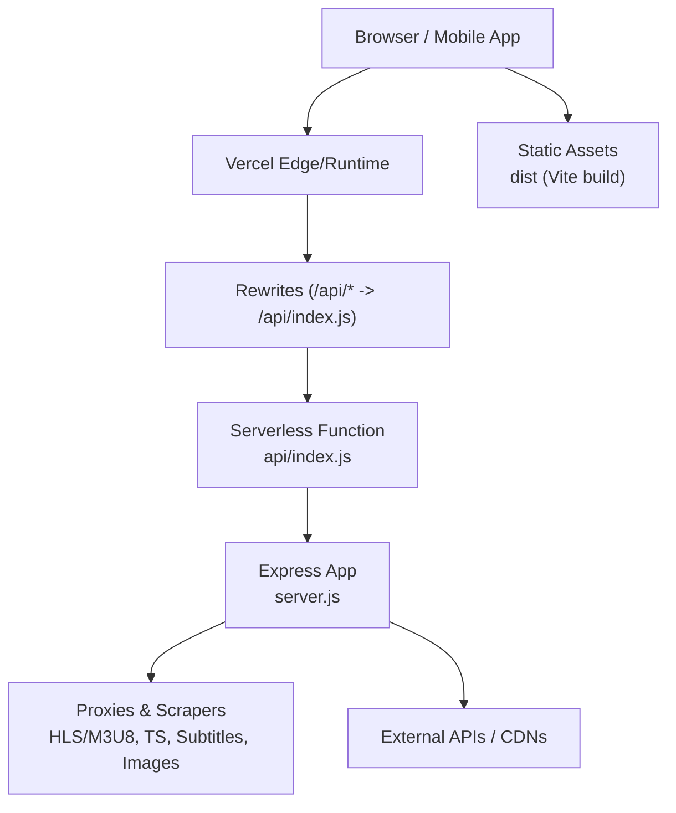
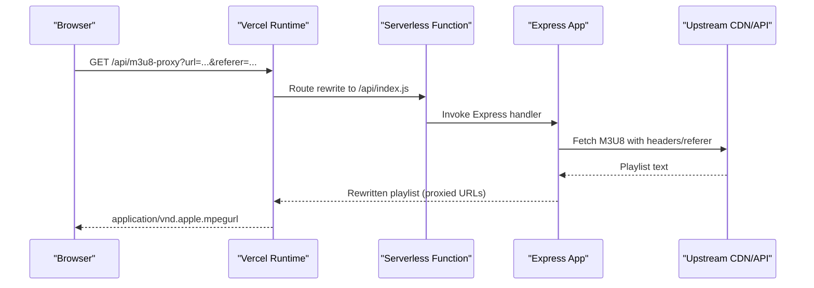
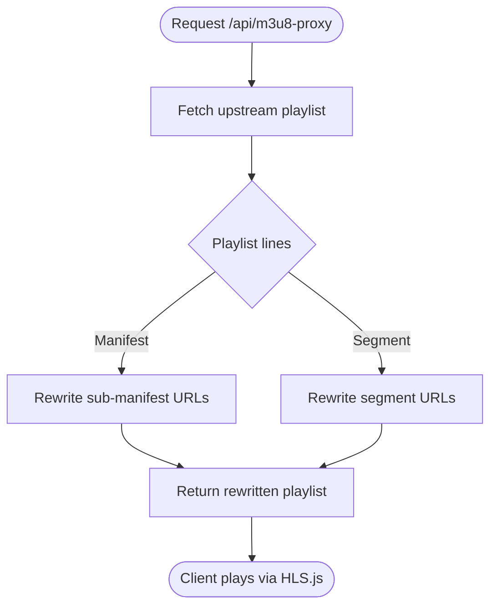
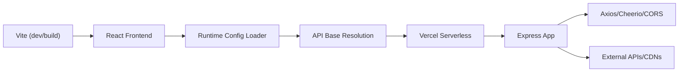

# Troubleshooting Deployment

<cite>
**Referenced Files in This Document**
- [package.json](file://package.json)
- [vercel.json](file://vercel.json)
- [vite.config.js](file://vite.config.js)
- [server.js](file://server.js)
- [api/index.js](file://api/index.js)
- [api/runtime-config.js](file://api/runtime-config.js)
- [src/runtimeConfig.js](file://src/runtimeConfig.js)
- [capacitor.config.json](file://capacitor.config.json)
- [android/app/build.gradle](file://android/app/build.gradle)
- [android/gradle.properties](file://android/gradle.properties)
- [android/app/src/main/AndroidManifest.xml](file://android/app/src/main/AndroidManifest.xml)
</cite>

## Table of Contents
1. Introduction
2. Project Structure
3. Core Components
4. Architecture Overview
5. Detailed Component Analysis
6. Dependency Analysis
7. Performance Considerations
8. Troubleshooting Guide
9. Conclusion
10. Appendices

## Introduction
This document provides a comprehensive troubleshooting guide for deploying and operating Project Anime on Vercel and Android (Capacitor). It focuses on common build failures, runtime errors, environment variable issues, serverless debugging, cold start optimization, memory limits, mobile app build/signing problems, store submission challenges, network connectivity, CORS, and API integration issues. It includes step-by-step debugging procedures, log analysis techniques, recovery strategies, diagnostic commands, monitoring queries, and escalation procedures.

## Project Structure
Project Anime is a Vite + React frontend with an Express-based Node.js backend exposed as Vercel Serverless Functions via rewrites. The Android app is built with Capacitor and Gradle. Key configuration points:
- Vite dev proxy forwards /api to a local backend during development.
- Vercel rewrites route /api/* to the serverless entry that exports the Express app.
- Runtime config endpoint serves API_BASE from environment variables or a static file.
- Android app packaging uses Capacitor and Gradle with explicit JVM args.

**Diagram sources**
- [vercel.json:16-20](file://vercel.json#L16-L20)
- [api/index.js:1-4](file://api/index.js#L1-L4)
- [server.js:1-28](file://server.js#L1-L28)

**Section sources**
- [package.json:6-12](file://package.json#L6-L12)
- [vercel.json:1-21](file://vercel.json#L1-L21)
- [vite.config.js:7-21](file://vite.config.js#L7-L21)

## Core Components
- Vite Frontend Build and Dev Proxy:
  - Development proxies /anilist-proxy and /api to local services.
  - Production builds output static assets served by Vercel.
- Vercel Serverless Entry:
  - Rewrites route /api/* to api/index.js which exports the Express app.
- Express Backend:
  - CORS middleware, JSON parsing, URL normalization for Vercel.
  - Image proxy, subtitle proxy, HLS manifest proxy, TS segment proxy.
  - Health check and provider integrations.
- Runtime Configuration:
  - Frontend loads runtime config from /api/runtime-config and falls back to static config or env.
  - Serverless runtime-config reads API_BASE from environment or public/eetnet-config.json.
- Android/Capacitor:
  - Capacitor config defines webDir, plugins, and Android options.
  - Gradle build settings and JVM args for memory.

**Section sources**
- [vite.config.js:7-21](file://vite.config.js#L7-L21)
- [vercel.json:16-20](file://vercel.json#L16-L20)
- [api/index.js:1-4](file://api/index.js#L1-L4)
- [server.js:1-28](file://server.js#L1-L28)
- [api/runtime-config.js:4-24](file://api/runtime-config.js#L4-L24)
- [src/runtimeConfig.js:82-129](file://src/runtimeConfig.js#L82-L129)
- [capacitor.config.json:1-31](file://capacitor.config.json#L1-L31)
- [android/app/build.gradle:19-24](file://android/app/build.gradle#L19-L24)
- [android/gradle.properties:10-12](file://android/gradle.properties#L10-L12)

## Architecture Overview
The deployment architecture routes client requests through Vercel to serverless functions that run the Express app. The backend proxies media streams and metadata while handling CORS and headers. The frontend resolves the API base at runtime to support dynamic environments without redeployments.

**Diagram sources**
- [vercel.json:16-20](file://vercel.json#L16-L20)
- [api/index.js:1-4](file://api/index.js#L1-L4)
- [server.js:263-345](file://server.js#L263-L345)

## Detailed Component Analysis

### Vercel Build and Routing
- Build scripts are defined in package.json; production build runs vite build.
- Vercel rewrites ensure /api/* routes to the serverless function and SPA fallbacks to index.html.
- Headers disable caching for root and index.html to avoid stale app state.

Common issues and fixes:
- Build fails due to missing dependencies or incompatible Node version: verify engine compatibility and install dependencies before deploy.
- Routes not hitting backend: confirm vercel.json rewrites and that /api/index.js exports the Express app.
- Stale HTML causing old behavior: ensure Cache-Control headers are set for root and index.html.

**Section sources**
- [package.json:6-12](file://package.json#L6-L12)
- [vercel.json:1-21](file://vercel.json#L1-L21)
- [api/index.js:1-4](file://api/index.js#L1-L4)

### Express Serverless Function
- CORS is enabled with configurable origin; JSON body parsing is applied.
- URL normalization ensures non-/api paths are prefixed for Vercel routing.
- Health endpoint exposes service status, uptime, and configuration hints.

Common issues and fixes:
- CORS errors: set CORS_ORIGIN appropriately; verify browser origin matches allowed origin.
- 404 on endpoints: ensure request path starts with /api; use health check to validate server readiness.
- Memory spikes: monitor logs for large payloads or unbounded caches; tune upstream timeouts and streaming.

**Section sources**
- [server.js:1-28](file://server.js#L1-L28)
- [server.js:715-735](file://server.js#L715-L735)

### HLS and Media Streaming Proxies
- M3U8 proxy fetches playlists, rewrites nested manifests and segments to proxied URLs, and handles referer/origin requirements.
- TS proxy forwards Range headers for byte-range playback, preserving Accept-Ranges and content metadata.
- Subtitle proxy serves VTT files with CORS headers.

Common issues and fixes:
- Playback stalls or fails: check rewritten URLs in the playlist; ensure referer/origin headers match upstream expectations.
- 403 Forbidden: verify User-Agent and Referer; some providers block default clients.
- High bandwidth usage: confirm Range header forwarding; avoid full-file downloads.

**Diagram sources**
- [server.js:263-345](file://server.js#L263-L345)
- [server.js:354-393](file://server.js#L354-L393)

**Section sources**
- [server.js:235-256](file://server.js#L235-L256)
- [server.js:263-345](file://server.js#L263-L345)
- [server.js:354-393](file://server.js#L354-L393)

### Runtime Configuration
- Frontend loads runtime config from /api/runtime-config and falls back to static config or environment variables.
- Serverless runtime-config reads API_BASE from environment variables or a static file and returns it to the client.
- Local development auto-detects localhost:8080; production strips localhost values on Vercel.

Common issues and fixes:
- API calls fail with wrong base: inspect resolved API_BASE in console; verify environment variables on Vercel.
- Stale config cached: ensure no-store headers on runtime-config; clear browser cache if needed.
- Capacitor APK defaults: when running in native platform, empty API_BASE falls back to a configured tunnel.

**Section sources**
- [src/runtimeConfig.js:82-129](file://src/runtimeConfig.js#L82-L129)
- [api/runtime-config.js:4-24](file://api/runtime-config.js#L4-L24)

### Android/Capacitor Build and Signing
- Capacitor config sets webDir to dist, plugin options, and Android-specific flags.
- Gradle build types include release configuration with minification and ProGuard rules.
- JVM args configure memory for Gradle daemon.

Common issues and fixes:
- Build fails due to memory: increase org.gradle.jvmargs if out-of-memory occurs.
- Signing errors: ensure keystore and signing configs are present; align applicationId and package names.
- Store submission issues: verify minSdkVersion/targetSdkVersion, permissions, and metadata; test signed APK thoroughly.

**Section sources**
- [capacitor.config.json:1-31](file://capacitor.config.json#L1-L31)
- [android/app/build.gradle:19-24](file://android/app/build.gradle#L19-L24)
- [android/gradle.properties:10-12](file://android/gradle.properties#L10-L12)
- [android/app/src/main/AndroidManifest.xml:38-41](file://android/app/src/main/AndroidManifest.xml#L38-L41)

## Dependency Analysis
Key runtime dependencies include Express, Axios, Cheerio, CORS, and Capacitor packages. Dev dependencies include Vite and React tooling.

**Diagram sources**
- [package.json:14-42](file://package.json#L14-L42)
- [vercel.json:16-20](file://vercel.json#L16-L20)
- [server.js:1-20](file://server.js#L1-L20)

**Section sources**
- [package.json:14-42](file://package.json#L14-L42)

## Performance Considerations
- Cold Starts:
  - Keep serverless payload small; avoid heavy initialization per request.
  - Use streaming for large responses (TS proxy already streams).
  - Prefer relative /api paths on Vercel to leverage edge routing.
- Memory Limits:
  - Monitor heap usage; reduce in-process caches or TTLs if necessary.
  - Tune upstream timeouts and max redirects to prevent long-lived connections.
- Network Efficiency:
  - Ensure Range header forwarding for HLS segments to avoid full downloads.
  - Use image and subtitle proxies sparingly; cache where appropriate.

[No sources needed since this section provides general guidance]

## Troubleshooting Guide

### Vercel Build Failures
Symptoms:
- Build error during vite build or dependency resolution.
- Missing modules or incompatible Node version.

Steps:
- Verify Node version compatibility and engines in package.json.
- Run npm ci locally to reproduce the exact dependency tree.
- Check Vercel build logs for specific module errors.

Recovery:
- Pin dependency versions and lockfile integrity.
- Remove unnecessary native dependencies if they cause build issues.

**Section sources**
- [package.json:6-12](file://package.json#L6-L12)
- [package.json:14-42](file://package.json#L14-L42)

### Vercel Runtime Errors
Symptoms:
- 5xx responses from /api endpoints.
- CORS errors in browser console.
- Health endpoint returns unexpected values.

Steps:
- Call /api/health to verify service status and configuration.
- Inspect server logs for stack traces and warnings.
- Validate CORS_ORIGIN and request origins.

Recovery:
- Adjust CORS settings and ensure proper headers.
- Normalize request paths to /api/* if using SPA routing.

**Section sources**
- [server.js:1-28](file://server.js#L1-L28)
- [server.js:715-735](file://server.js#L715-L735)

### Environment Variable Issues
Symptoms:
- API calls point to wrong base URL.
- Runtime config returns empty API_BASE.

Steps:
- Check /api/runtime-config response for resolved API_BASE.
- Confirm environment variables are set in Vercel dashboard.
- Ensure no-store headers on runtime-config to avoid caching.

Recovery:
- Update API_BASE in Vercel environment variables.
- For static fallback, update public/eetnet-config.json and redeploy.

**Section sources**
- [api/runtime-config.js:4-24](file://api/runtime-config.js#L4-L24)
- [src/runtimeConfig.js:82-129](file://src/runtimeConfig.js#L82-L129)
- [vercel.json:1-21](file://vercel.json#L1-L21)

### Debugging Serverless Functions
Techniques:
- Use /api/health to probe availability and configuration.
- Add structured logging around critical paths (probes, retries, errors).
- Test endpoints directly via curl or browser with correct headers.

Commands:
- curl https://your-domain/api/health
- curl -H "Origin: https://your-domain" https://your-domain/api/img-proxy?url=https://example.com/image.jpg

Recovery:
- If cold start latency is high, consider warming strategies or reducing initialization overhead.

**Section sources**
- [server.js:715-735](file://server.js#L715-L735)
- [server.js:153-199](file://server.js#L153-L199)

### Cold Start Optimization
Guidance:
- Minimize top-level imports and heavy computations.
- Use streaming responses for large payloads.
- Avoid synchronous I/O in hot paths.

Monitoring:
- Track first-byte latency and total duration in Vercel analytics.
- Log startup time and warm-up indicators.

[No sources needed since this section provides general guidance]

### Memory Limit Troubleshooting
Symptoms:
- Out-of-memory crashes or throttling.
- Slow responses due to garbage collection.

Steps:
- Reduce in-memory caches or set TTLs.
- Stream large responses instead of buffering.
- Increase memory allocation if supported by your hosting plan.

Recovery:
- Refactor data processing to chunked/streaming patterns.
- Profile heap usage and remove leaks.

[No sources needed since this section provides general guidance]

### Mobile App Build Failures
Symptoms:
- Gradle build errors or out-of-memory.
- Capacator sync fails.

Steps:
- Increase org.gradle.jvmargs if memory issues occur.
- Ensure Capacitor CLI and Android SDK are installed and compatible.
- Clean build artifacts and rebuild.

Recovery:
- Update Gradle wrapper and dependencies.
- Validate AndroidManifest permissions and capabilities.

**Section sources**
- [android/gradle.properties:10-12](file://android/gradle.properties#L10-L12)
- [android/app/build.gradle:19-24](file://android/app/build.gradle#L19-L24)
- [android/app/src/main/AndroidManifest.xml:38-41](file://android/app/src/main/AndroidManifest.xml#L38-L41)

### Signing Problems
Symptoms:
- Signed APK fails to install or submit.
- Signature mismatch errors.

Steps:
- Verify keystore presence and passwords.
- Align applicationId across project files.
- Generate aligned APK/AAB and test installation.

Recovery:
- Re-sign with consistent keystore; ensure release build type uses correct signing config.

**Section sources**
- [android/app/build.gradle:19-24](file://android/app/build.gradle#L19-L24)

### Store Submission Challenges
Symptoms:
- Rejection due to policy violations or missing metadata.
- Runtime crashes on device.

Steps:
- Review Google Play policies; ensure privacy policy and permissions are declared.
- Test on multiple devices and OS versions.
- Validate minSdkVersion and targetSdkVersion compliance.

Recovery:
- Fix policy violations; update app metadata; resubmit after addressing feedback.

**Section sources**
- [android/app/build.gradle:6-12](file://android/app/build.gradle#L6-L12)
- [android/app/src/main/AndroidManifest.xml:38-41](file://android/app/src/main/AndroidManifest.xml#L38-L41)

### Network Connectivity Issues
Symptoms:
- Requests fail with network errors.
- Mixed content blocked on Android.

Steps:
- Enable allowMixedContent in Capacitor config if required for testing.
- Verify DNS and firewall rules; ensure upstream domains are reachable.
- Use proxies or tunnels for local development.

Recovery:
- Update Capacitor config and rebuild; adjust network policies as needed.

**Section sources**
- [capacitor.config.json:26-30](file://capacitor.config.json#L26-L30)

### CORS Errors
Symptoms:
- Blocked requests due to cross-origin restrictions.
- Preflight failures.

Steps:
- Set CORS_ORIGIN to allowlist trusted origins.
- Ensure Access-Control-Allow-Origin headers are present on responses.
- Validate Origin and Referer headers for upstream providers.

Recovery:
- Adjust CORS settings; add necessary headers; test with curl and browser.

**Section sources**
- [server.js:19-20](file://server.js#L19-L20)
- [server.js:186-188](file://server.js#L186-L188)
- [server.js:248-250](file://server.js#L248-L250)
- [server.js:338-340](file://server.js#L338-L340)

### API Integration Problems
Symptoms:
- Provider endpoints return 403 or 502.
- Incorrect season/episode mapping.

Steps:
- Inspect logs for provider-specific errors and retries.
- Validate headers (User-Agent, Referer, Origin) required by providers.
- Use health endpoint to confirm backend readiness.

Recovery:
- Update headers and retry logic; adjust timeouts; handle provider changes gracefully.

**Section sources**
- [server.js:74-92](file://server.js#L74-L92)
- [server.js:108-148](file://server.js#L108-L148)
- [server.js:401-411](file://server.js#L401-L411)

### Step-by-Step Debugging Procedures
- Reproduce locally:
  - Run dev server and proxy /api to local backend.
  - Use browser dev tools to inspect network requests and responses.
- Validate endpoints:
  - Call /api/health and key /api/* endpoints with curl.
- Analyze logs:
  - Check server logs for errors and warnings.
  - Focus on proxy-related logs for HLS/TS/subtitle flows.
- Isolate issues:
  - Disable caching; clear cookies/local storage.
  - Test with different browsers/devices.

**Section sources**
- [vite.config.js:7-21](file://vite.config.js#L7-L21)
- [server.js:715-735](file://server.js#L715-L735)

### Log Analysis Techniques
- Search for tags like [M3U8-PROXY], [TS-PROXY], [SUBTITLE-PROXY], [EXTRACT], [ANIMEKAI].
- Identify repeated errors and upstream status codes.
- Correlate timestamps with user sessions to pinpoint affected requests.

**Section sources**
- [server.js:122-148](file://server.js#L122-L148)
- [server.js:190-195](file://server.js#L190-L195)
- [server.js:253-255](file://server.js#L253-L255)
- [server.js:342-344](file://server.js#L342-L344)
- [server.js:390-392](file://server.js#L390-L392)

### Recovery Strategies for Failed Deployments
- Rollback to last known good commit.
- Temporarily disable problematic features or routes.
- Use static fallback for runtime config if environment variables are misconfigured.

[No sources needed since this section provides general guidance]

### Diagnostic Commands
- Health check:
  - curl https://your-domain/api/health
- Image proxy:
  - curl -H "Origin: https://your-domain" https://your-domain/api/img-proxy?url=https://example.com/image.jpg
- Runtime config:
  - curl https://your-domain/api/runtime-config

**Section sources**
- [server.js:715-735](file://server.js#L715-L735)
- [server.js:153-199](file://server.js#L153-L199)
- [api/runtime-config.js:4-24](file://api/runtime-config.js#L4-L24)

### Monitoring Queries
- Track error rates for /api/* endpoints.
- Monitor first-byte latency and total duration for serverless functions.
- Alert on 5xx responses and timeout events.

[No sources needed since this section provides general guidance]

### Escalation Procedures
- If issues persist after local reproduction and log analysis:
  - Gather request IDs, timestamps, and affected endpoints.
  - Provide environment variable snapshots (redacted secrets).
  - Include curl outputs and browser network logs.
- Engage platform support with detailed context and steps to reproduce.

[No sources needed since this section provides general guidance]

## Conclusion
This guide covers the most common deployment and runtime issues for Project Anime on Vercel and Android. By following the diagnostic steps, analyzing logs, and applying the recommended fixes, most issues can be resolved efficiently. For complex cases, escalate with comprehensive context and reproducible evidence.

## Appendices

### Quick Reference: Key Files and Roles
- vercel.json: Routing and headers for Vercel deployment.
- api/index.js: Exports Express app for serverless functions.
- server.js: Core backend logic including proxies and health checks.
- src/runtimeConfig.js: Frontend runtime configuration loader.
- capacitor.config.json: Capacitor app configuration.
- android/app/build.gradle: Android build configuration.
- android/gradle.properties: Gradle JVM arguments.

**Section sources**
- [vercel.json:1-21](file://vercel.json#L1-L21)
- [api/index.js:1-4](file://api/index.js#L1-L4)
- [server.js:1-28](file://server.js#L1-L28)
- [src/runtimeConfig.js:82-129](file://src/runtimeConfig.js#L82-L129)
- [capacitor.config.json:1-31](file://capacitor.config.json#L1-L31)
- [android/app/build.gradle:19-24](file://android/app/build.gradle#L19-L24)
- [android/gradle.properties:10-12](file://android/gradle.properties#L10-L12)