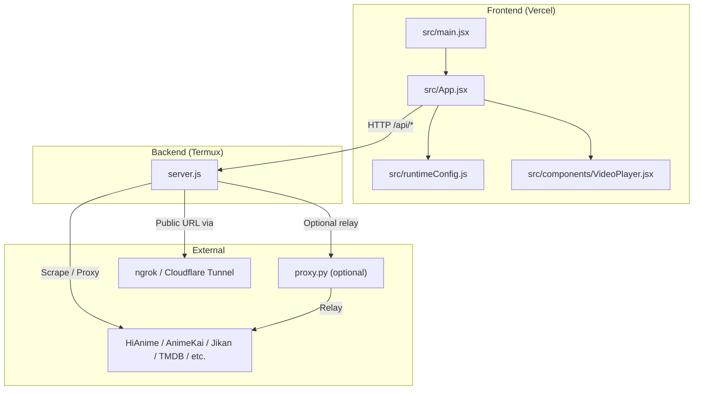
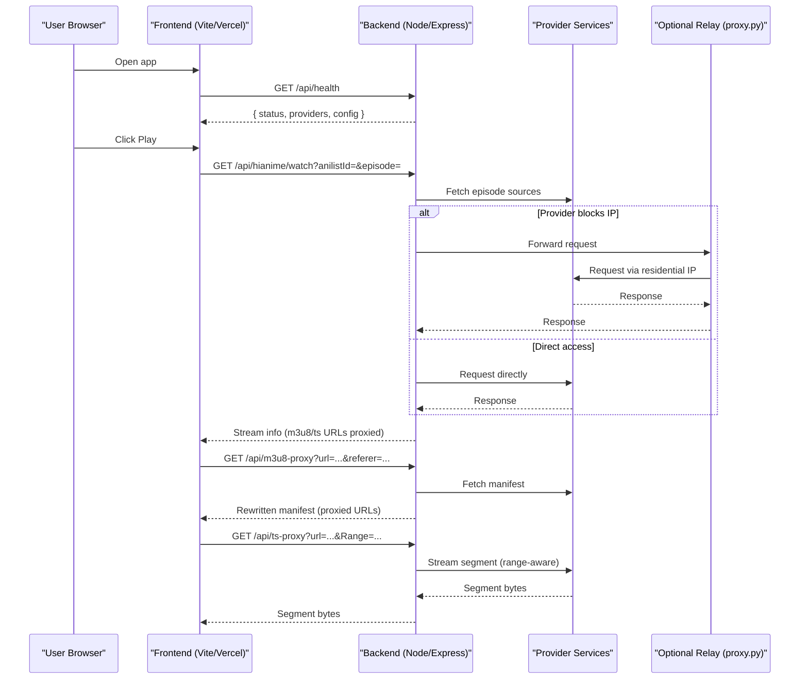
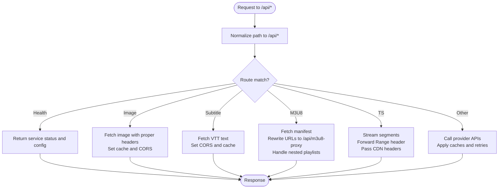
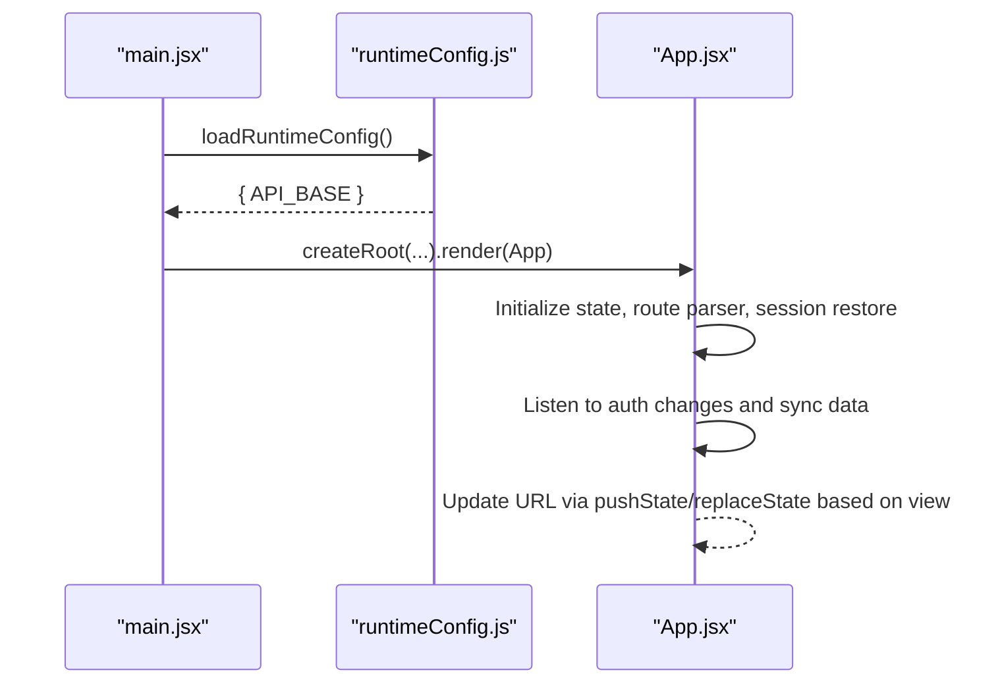
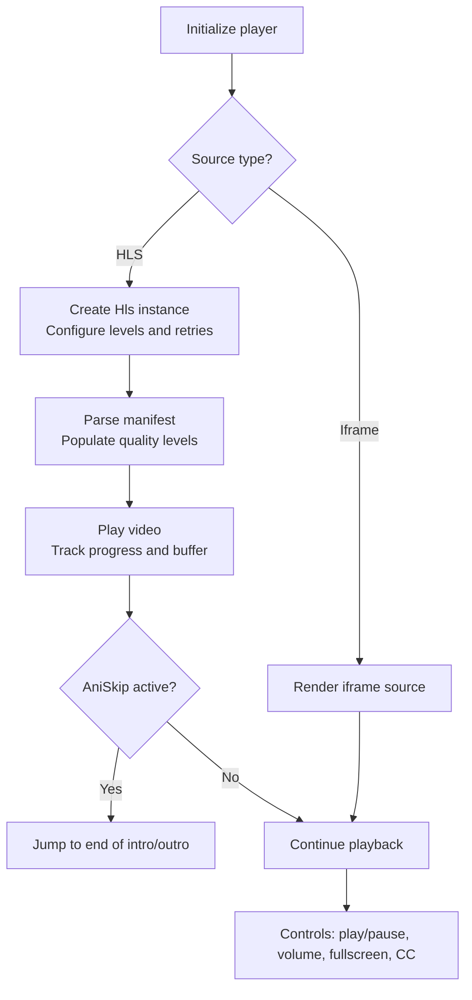
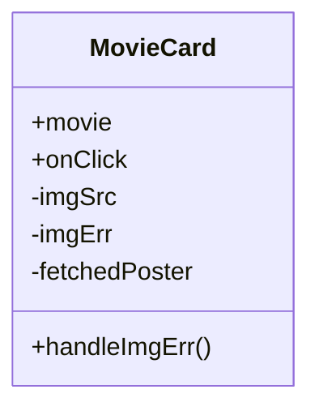
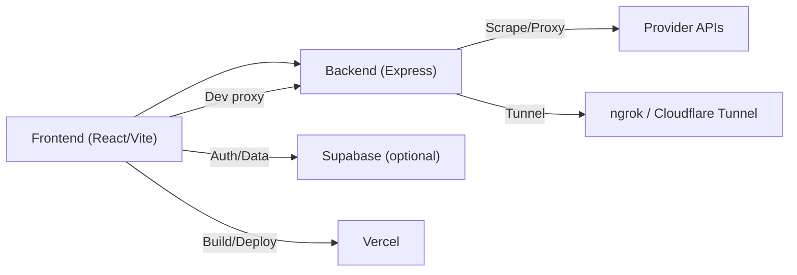

# Developer Guide

<cite>
**Referenced Files in This Document**
- [package.json](file://package.json)
- [.oxlintrc.json](file://.oxlintrc.json)
- [README.md](file://README.md)
- [vite.config.js](file://vite.config.js)
- [server.js](file://server.js)
- [src/main.jsx](file://src/main.jsx)
- [src/App.jsx](file://src/App.jsx)
- [src/runtimeConfig.js](file://src/runtimeConfig.js)
- [src/supabaseClient.js](file://src/supabaseClient.js)
- [src/components/VideoPlayer.jsx](file://src/components/VideoPlayer.jsx)
- [src/features/movie/components/MovieCard.jsx](file://src/features/movie/components/MovieCard.jsx)
- [vercel.json](file://vercel.json)
</cite>

## Table of Contents
1. Introduction
2. Project Structure
3. Core Components
4. Architecture Overview
5. Detailed Component Analysis
6. Dependency Analysis
7. Performance Considerations
8. Troubleshooting Guide
9. Conclusion
10. Appendices

## Introduction
This guide explains how to contribute to Project Anime, a Netflix-style streaming aggregator for anime, Asian dramas, and manhwa (webtoons). It covers the development workflow, code standards enforced by Oxlint, coding conventions, commit message guidelines, project structure and naming conventions, testing strategy, debugging techniques, and tooling setup. It also provides guidance for adding new features, extending functionality while maintaining backward compatibility, contribution and pull request workflows, and examples for common tasks such as adding content providers and creating UI components. Finally, it includes performance optimization techniques, security considerations, and best practices for code quality.

## Project Structure
The project is split into a frontend (React + Vite) and a backend (Node.js/Express scraper and stream proxy). The frontend runs on Vercel; the backend runs on an Android phone via Termux and is exposed through a public tunnel.

Key directories and files:
- src/: React application entrypoints, feature modules, shared components, utilities, and runtime configuration.
- server.js: Express backend with API routes, HLS/TS proxies, image proxies, subtitle proxy, and provider integrations.
- vite.config.js: Vite dev server with proxy rules for /api and external services.
- vercel.json: Vercel rewrites and headers for runtime config and SPA routing.
- package.json: Scripts, dependencies, and devDependencies including Oxlint.
- .oxlintrc.json: Oxlint rules for React and OXC plugins.
- README.md: Setup instructions for backend on Termux, frontend on Vercel, environment variables, and troubleshooting.

**Diagram sources**
- [src/main.jsx:1-15](file://src/main.jsx#L1-L15)
- [src/App.jsx:1-120](file://src/App.jsx#L1-L120)
- [src/runtimeConfig.js:1-163](file://src/runtimeConfig.js#L1-L163)
- [src/components/VideoPlayer.jsx:1-120](file://src/components/VideoPlayer.jsx#L1-L120)
- [server.js:1-120](file://server.js#L1-L120)

**Section sources**
- [README.md:1-160](file://README.md#L1-L160)
- [package.json:1-45](file://package.json#L1-L45)
- [vite.config.js:1-23](file://vite.config.js#L1-L23)
- [vercel.json:1-21](file://vercel.json#L1-L21)

## Core Components
- Frontend bootstrap: main.jsx initializes runtime config then mounts App under StrictMode.
- Application shell: App.jsx manages routing state, sections (anime, drama, movies, manhwa, manga), media playback, playlists, subscriptions, and sync with Supabase or local storage.
- Runtime configuration: runtimeConfig.js resolves API base dynamically with priority: query override, Vercel serverless endpoint, static JSON fallback, build-time env, and local dev detection.
- Backend server: server.js exposes APIs for health, episodes, image/subtitle/HLS/TS proxies, and provider-specific endpoints. It normalizes URLs behind tunnels and handles CORS.

Development scripts and tools:
- npm run dev: Start Vite dev server with proxy to backend.
- npm run build: Build production assets for Vercel.
- npm run lint: Run Oxlint to enforce code standards.
- npm run server/start: Run backend locally or on device.

Code standards:
- Oxlint configured with React rules and OXC plugin. Rules include enforcing React hooks usage and controlling exported components.

Naming conventions:
- Feature folders follow a feature-based layout: src/features/<feature>/components and src/features/<feature>/api.
- Shared UI components live under src/components.
- Utilities under src/utils.
- Environment-driven configuration via runtimeConfig.js and Vite env vars.

**Section sources**
- [src/main.jsx:1-15](file://src/main.jsx#L1-L15)
- [src/App.jsx:1-120](file://src/App.jsx#L1-L120)
- [src/runtimeConfig.js:1-163](file://src/runtimeConfig.js#L1-L163)
- [server.js:1-120](file://server.js#L1-L120)
- [package.json:1-45](file://package.json#L1-L45)
- [.oxlintrc.json:1-9](file://.oxlintrc.json#L1-L9)

## Architecture Overview
The app uses a decoupled architecture:
- Frontend communicates with backend over HTTP using a resolved API base.
- Backend scrapes and proxies content from multiple providers, rewriting HLS manifests and segments so browsers only talk to the backend’s public URL.
- Optional Python relay can be used when providers block datacenter IPs.
- Public exposure is handled by ngrok or Cloudflare Tunnel.

**Diagram sources**
- [server.js:235-393](file://server.js#L235-L393)
- [server.js:715-735](file://server.js#L715-L735)
- [vite.config.js:1-23](file://vite.config.js#L1-L23)
- [README.md:14-160](file://README.md#L14-L160)

## Detailed Component Analysis

### Backend API and Proxies (server.js)
Responsibilities:
- Normalize incoming requests to /api paths for Vercel serverless compatibility.
- Provide health check exposing service status, providers, and configuration.
- Image proxy to bypass CORS and hotlink restrictions.
- Subtitle proxy to serve VTT without CORS issues.
- HLS manifest proxy that rewrites playlist entries and nested references.
- TS segment proxy that forwards Range headers for efficient streaming.
- Provider integrations and caching for search and episode data.

**Diagram sources**
- [server.js:22-28](file://server.js#L22-L28)
- [server.js:152-199](file://server.js#L152-L199)
- [server.js:235-256](file://server.js#L235-L256)
- [server.js:263-345](file://server.js#L263-L345)
- [server.js:354-393](file://server.js#L354-L393)
- [server.js:715-735](file://server.js#L715-L735)

**Section sources**
- [server.js:1-120](file://server.js#L1-L120)
- [server.js:152-393](file://server.js#L152-L393)
- [server.js:715-735](file://server.js#L715-L735)

### Frontend Bootstrap and Routing (main.jsx, App.jsx)
Responsibilities:
- Load runtime configuration before mounting the app.
- Manage view state and browser history for deep linking and back navigation.
- Coordinate feature views (anime, drama, movies, manhwa, manga) and playback.
- Persist sessions and restore last viewed state across app restarts.
- Integrate authentication and cloud sync via Supabase or local storage.

**Diagram sources**
- [src/main.jsx:1-15](file://src/main.jsx#L1-L15)
- [src/runtimeConfig.js:82-129](file://src/runtimeConfig.js#L82-L129)
- [src/App.jsx:240-445](file://src/App.jsx#L240-L445)

**Section sources**
- [src/main.jsx:1-15](file://src/main.jsx#L1-L15)
- [src/App.jsx:240-445](file://src/App.jsx#L240-L445)
- [src/runtimeConfig.js:1-163](file://src/runtimeConfig.js#L1-L163)

### Video Player (VideoPlayer.jsx)
Responsibilities:
- Manage HLS playback with Hls.js, quality selection, audio tracks, subtitles, and controls.
- Fetch AniSkip intervals to auto-skip intros/outros.
- Handle errors, buffering, seek steps, and preview scrubbing.

**Diagram sources**
- [src/components/VideoPlayer.jsx:1-120](file://src/components/VideoPlayer.jsx#L1-L120)
- [src/components/VideoPlayer.jsx:148-200](file://src/components/VideoPlayer.jsx#L148-L200)

**Section sources**
- [src/components/VideoPlayer.jsx:1-120](file://src/components/VideoPlayer.jsx#L1-L120)

### Movie Card (MovieCard.jsx)
Responsibilities:
- Display movie tiles with lazy loading images.
- Fallback to dynamic poster fetch via backend if initial image fails.
- Provide hover effects and rating badges.

**Diagram sources**
- [src/features/movie/components/MovieCard.jsx:1-166](file://src/features/movie/components/MovieCard.jsx#L1-L166)

**Section sources**
- [src/features/movie/components/MovieCard.jsx:1-166](file://src/features/movie/components/MovieCard.jsx#L1-L166)

## Dependency Analysis
- Frontend depends on React, Vite, Hls.js, Lucide icons, and optional Supabase client.
- Backend depends on Express, Axios, Cheerio, and Consumet extensions for metadata and providers.
- Vite dev server proxies /api to local backend and /anilist-proxy to GraphQL endpoint.
- Vercel rewrites route /api/* to serverless functions and serves SPA fallback.

**Diagram sources**
- [package.json:14-43](file://package.json#L14-L43)
- [vite.config.js:1-23](file://vite.config.js#L1-L23)
- [vercel.json:1-21](file://vercel.json#L1-L21)
- [server.js:1-20](file://server.js#L1-L20)

**Section sources**
- [package.json:14-43](file://package.json#L14-L43)
- [vite.config.js:1-23](file://vite.config.js#L1-L23)
- [vercel.json:1-21](file://vercel.json#L1-L21)
- [server.js:1-20](file://server.js#L1-L20)

## Performance Considerations
- Use HLS proxy to rewrite manifests and segments so browsers only communicate with the backend, reducing CORS and mixed-content issues.
- Forward Range headers in TS proxy to enable byte-range streaming for fast startup and low bandwidth usage.
- Cache provider responses and episode lists to reduce repeated scraping.
- Prefer lazy loading images and on-demand poster fetching to minimize initial payload.
- Configure Hls.js with appropriate retry and buffer settings to handle flaky networks.
- Avoid sending unnecessary headers (e.g., Accept-Language) to prevent WAF blocks from providers.

[No sources needed since this section provides general guidance]

## Troubleshooting Guide
Common issues and resolutions:
- Empty drama/manhwa content: Backend down or stale VITE_API_BASE on Vercel. Restart backend chain and redeploy frontend with current URL.
- Video won’t play but metadata loads: Video CDN may block backend IP; route video through the same relay as KissKH.
- 403 from tunnel: Tunnel provider challenging datacenter IP; use a tunnel without challenges or named Cloudflare Tunnel with Bot Fight Mode off.
- Image loading failures: Ensure image proxy is reachable and headers are correct; verify CORS settings.
- Subtitles not loading: Confirm subtitle proxy returns correct Content-Type and CORS headers.

Operational checks:
- Use /api/health to verify backend status, providers, and configuration.
- Validate runtime config resolution via console logs and network requests.

**Section sources**
- [README.md:144-160](file://README.md#L144-L160)
- [server.js:715-735](file://server.js#L715-L735)

## Conclusion
Project Anime combines a modern React frontend with a flexible Node.js backend that scrapes and proxies streaming content. By following the development workflow, adhering to Oxlint standards, and leveraging the provided tools and configurations, contributors can add new features, extend providers, and maintain high code quality. The architecture supports robust streaming via HLS proxies, resilient provider integration, and smooth user experiences across web and native platforms.

[No sources needed since this section summarizes without analyzing specific files]

## Appendices

### Development Workflow
- Install dependencies: npm install
- Start backend: node server.js (or deploy on Termux)
- Start frontend: npm run dev (proxies /api to localhost:8080)
- Lint code: npm run lint (Oxlint)
- Build for production: npm run build (outputs dist/)
- Deploy frontend to Vercel with environment variables set

**Section sources**
- [README.md:111-129](file://README.md#L111-L129)
- [package.json:6-13](file://package.json#L6-L13)

### Code Standards and Commit Messages
- Enforce React hooks and export rules via Oxlint configuration.
- Keep commits focused and descriptive; reference affected features and routes.
- Follow conventional commit messages (e.g., feat: add m3u8 proxy rewrite, fix: resolve HLS range headers).

**Section sources**
- [.oxlintrc.json:1-9](file://.oxlintrc.json#L1-L9)

### Adding New Content Providers
Steps:
- Add backend route(s) in server.js for discovery and watch endpoints.
- Implement scraping or API calls with proper headers and referers.
- Integrate with existing cache layers and error handling.
- Expose normalized data to frontend via consistent API contracts.
- Test with /api/health and manual requests; ensure proxies work for streams.

**Section sources**
- [server.js:235-393](file://server.js#L235-L393)
- [server.js:715-735](file://server.js#L715-L735)

### Creating UI Components
Guidelines:
- Place reusable components under src/components.
- Feature-specific components under src/features/<feature>/components.
- Use functional components with clear props and state management.
- Leverage runtimeConfig.apiUrl for API calls to avoid hardcoding bases.

**Section sources**
- [src/runtimeConfig.js:149-153](file://src/runtimeConfig.js#L149-L153)
- [src/features/movie/components/MovieCard.jsx:1-166](file://src/features/movie/components/MovieCard.jsx#L1-L166)

### Maintaining Backward Compatibility
- Preserve existing API contracts; version endpoints if necessary.
- Avoid breaking changes in response shapes; add fields instead of removing them.
- Test proxies and routes thoroughly to ensure old clients continue working.

[No sources needed since this section provides general guidance]

### Contribution Process and Pull Requests
- Create a feature branch from main.
- Implement changes with tests and lint checks passing.
- Open a pull request with a clear description and linked issues.
- Ensure environment variables and deployment configs are updated if needed.
- Request reviews focusing on correctness, performance, and security.

[No sources needed since this section provides general guidance]

### Security Considerations
- Validate and sanitize inputs to proxies to prevent open redirects or injection.
- Restrict CORS_ORIGIN to trusted origins in production.
- Avoid logging sensitive headers or tokens.
- Use HTTPS and secure tunneling for backend exposure.

**Section sources**
- [server.js:19-20](file://server.js#L19-L20)
- [README.md:76-84](file://README.md#L76-L84)

### Best Practices for Code Quality
- Adhere to Oxlint rules and keep React hooks usage correct.
- Modularize logic into small, testable units.
- Use consistent naming and folder structures per feature.
- Document new routes and components inline where appropriate.

**Section sources**
- [.oxlintrc.json:1-9](file://.oxlintrc.json#L1-L9)
- [package.json:6-13](file://package.json#L6-L13)