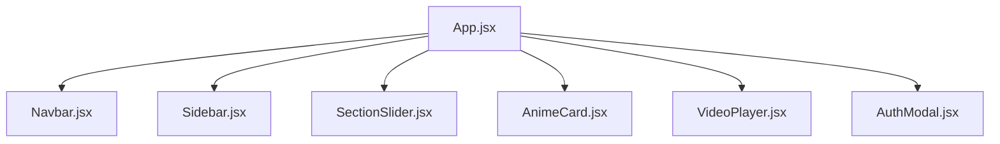
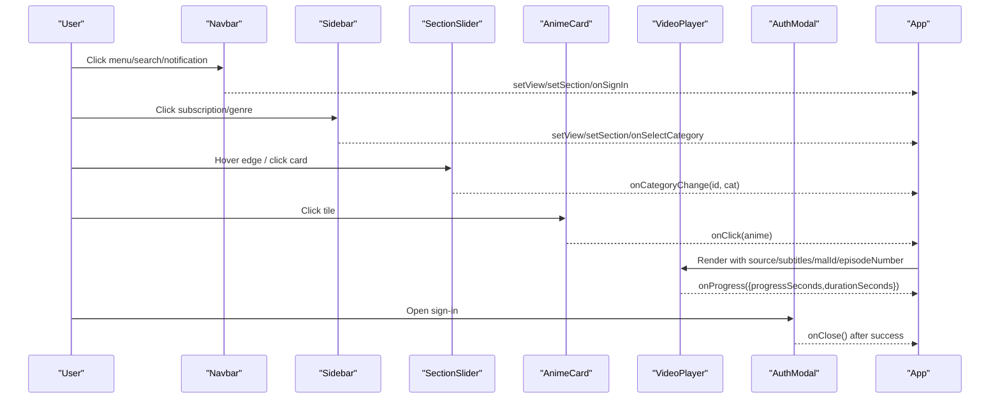
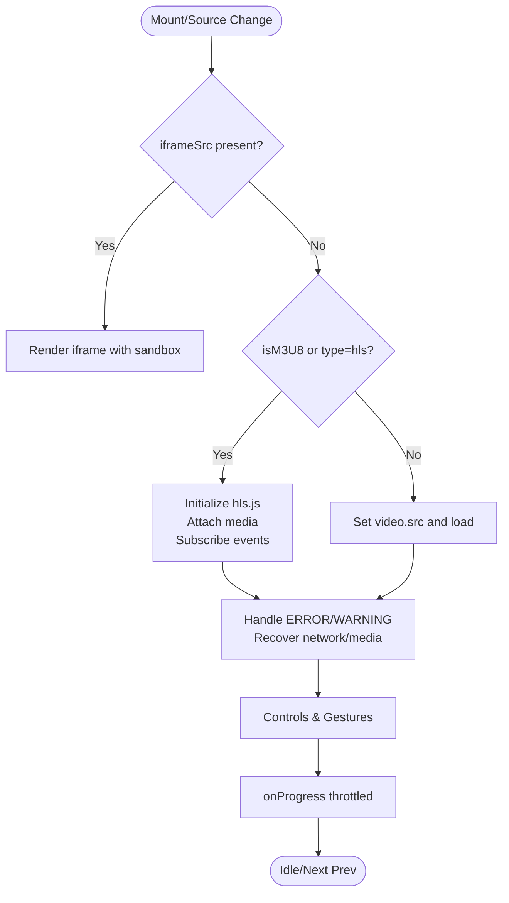
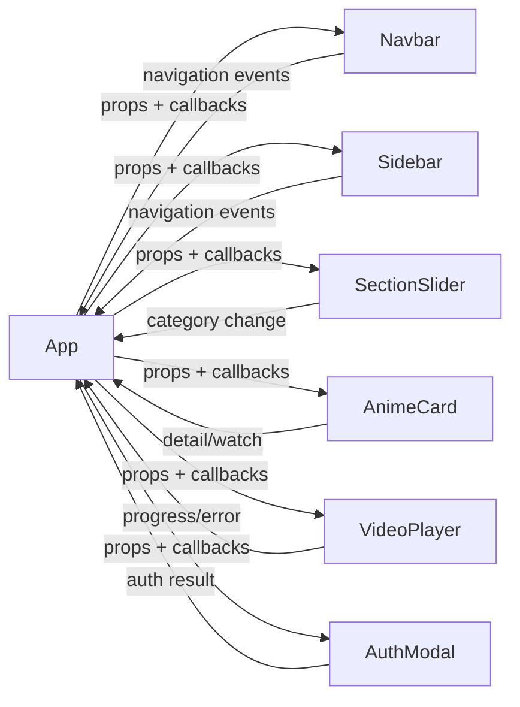

# Component Library

<cite>
**Referenced Files in This Document**
- [VideoPlayer.jsx](file://src/components/VideoPlayer.jsx)
- [Navbar.jsx](file://src/components/Navbar.jsx)
- [Sidebar.jsx](file://src/components/Sidebar.jsx)
- [SectionSlider.jsx](file://src/components/SectionSlider.jsx)
- [SectionSlider.css](file://src/components/SectionSlider.css)
- [AuthModal.jsx](file://src/components/AuthModal.jsx)
- [AnimeCard.jsx](file://src/features/anime/components/AnimeCard.jsx)
- [App.jsx](file://src/App.jsx)
</cite>

## Table of Contents
1. [Introduction](#introduction)
2. [Project Structure](#project-structure)
3. [Core Components](#core-components)
4. [Architecture Overview](#architecture-overview)
5. [Detailed Component Analysis](#detailed-component-analysis)
6. [Dependency Analysis](#dependency-analysis)
7. [Performance Considerations](#performance-considerations)
8. [Troubleshooting Guide](#troubleshooting-guide)
9. [Conclusion](#conclusion)

## Introduction
This document provides comprehensive documentation for Project Anime’s reusable component library. It covers the core components VideoPlayer, Navbar, Sidebar, SectionSlider, AuthModal, and AnimeCard. For each component, we describe props interfaces, event handling patterns, customization options, composition hierarchy, styling approach (CSS modules and responsive design), usage examples, and performance considerations such as lazy loading, memoization, and optimization techniques used throughout the library.

## Project Structure
The component library lives under src/components and is consumed by the application entry point src/App.jsx. Feature-specific UIs live under src/features/* and are composed with these shared components. The App orchestrates navigation, state, and integration between components.

**Diagram sources**
- [App.jsx:3-8](file://src/App.jsx#L3-L8)

**Section sources**
- [App.jsx:3-8](file://src/App.jsx#L3-L8)

## Core Components
- VideoPlayer: A robust media player supporting HLS via hls.js, native HLS fallback, subtitles, quality selection, audio track switching, skip intro/end via AniSkip, keyboard shortcuts, touch gestures, fullscreen/picture-in-picture, and progress reporting.
- Navbar: Top navigation with search, notifications, profile dropdown, mobile drawer, and bottom nav on small screens. Integrates auth flows and sidebar toggling.
- Sidebar: Left-side navigation with sections, subscriptions, user actions, and expandable genre submenus; supports mini mode.
- SectionSlider: Edge-triggered glassmorphism panel to switch anime categories/genres with animated cards and accessibility features.
- AuthModal: Sign-in/sign-up modal with email/password, social OAuth (Google/Discord), password strength indicator, and error normalization.
- AnimeCard: Media tile displaying cover/banner, rating or episode count, Hindi badge, hover overlay, and click-to-navigate behavior.

**Section sources**
- [VideoPlayer.jsx:5-20](file://src/components/VideoPlayer.jsx#L5-L20)
- [Navbar.jsx:243-256](file://src/components/Navbar.jsx#L243-L256)
- [Sidebar.jsx:75-86](file://src/components/Sidebar.jsx#L75-L86)
- [SectionSlider.jsx:80-86](file://src/components/SectionSlider.jsx#L80-L86)
- [AuthModal.jsx:93-105](file://src/components/AuthModal.jsx#L93-L105)
- [AnimeCard.jsx:5-16](file://src/features/anime/components/AnimeCard.jsx#L5-L16)

## Architecture Overview
The application uses a top-down composition model:
- App holds global state (views, active section, selected items, playlists, history) and passes callbacks to components.
- Navbar and Sidebar provide navigation and user actions that update App state.
- SectionSlider emits category changes that influence content rendering.
- AnimeCard triggers detail/watch views via onClick handlers passed from App.
- VideoPlayer renders episodes with rich controls and reports progress back to App.
- AuthModal integrates with Supabase and updates App’s auth state.

**Diagram sources**
- [App.jsx:2038-2060](file://src/App.jsx#L2038-L2060)
- [SectionSlider.jsx:122-131](file://src/components/SectionSlider.jsx#L122-L131)
- [VideoPlayer.jsx:321-332](file://src/components/VideoPlayer.jsx#L321-L332)
- [AuthModal.jsx:122-165](file://src/components/AuthModal.jsx#L122-L165)

## Detailed Component Analysis

### VideoPlayer
Purpose:
- Play video streams (HLS via hls.js, native HLS, direct MP4) and embedded iframes.
- Provide advanced playback controls, quality/audio track selection, CC toggle, skip intro/end, keyboard shortcuts, and touch gestures.
- Report playback progress to parent.

Props interface:
- source: object containing url, isM3U8/type, iframeSrc, preferredAudioLang/audioMode, error.
- poster: string URL for poster image.
- subtitles: array of {url, lang, label, default}.
- malId: number/string for AniSkip integration.
- episodeNumber: number for AniSkip integration.
- title, type: display metadata.
- onProgress: callback invoked with {progressSeconds, durationSeconds}.
- onNextEpisode, onPrevEpisode: optional navigation callbacks.
- hasNextEpisode, hasPrevEpisode: booleans to enable/disable navigation buttons.
- onError: callback for fatal errors.
- className: additional CSS classes.

Event handling patterns:
- Playback events: play, pause, waiting, canplay, timeupdate, durationchange.
- User interactions: play/pause, mute/volume, fullscreen, picture-in-picture, seek, double-tap gestures, keyboard shortcuts.
- Quality/Audio menus: open/close via refs and outside-click detection.
- Skip Intro/End: fetches skip times via AniSkip API and detects active window during playback.

Customization options:
- Seek step cycling persisted in localStorage.
- Preferred audio language auto-selection when available.
- Iframe fallback with sandbox attributes and labels.

Performance considerations:
- Uses useRef for DOM references and mutable flags to avoid re-renders.
- Debounced/throttled progress reporting to reduce parent updates.
- Conditional HLS setup and cleanup on unmount/source change.
- Canvas-based scrubbing preview avoids heavy operations.

Usage example (from App):
- Renders VideoPlayer with source, subtitles, malId, episodeNumber, and onProgress handler.

**Section sources**
- [VideoPlayer.jsx:5-20](file://src/components/VideoPlayer.jsx#L5-L20)
- [VideoPlayer.jsx:94-146](file://src/components/VideoPlayer.jsx#L94-L146)
- [VideoPlayer.jsx:149-282](file://src/components/VideoPlayer.jsx#L149-L282)
- [VideoPlayer.jsx:284-332](file://src/components/VideoPlayer.jsx#L284-L332)
- [VideoPlayer.jsx:350-450](file://src/components/VideoPlayer.jsx#L350-L450)
- [VideoPlayer.jsx:506-542](file://src/components/VideoPlayer.jsx#L506-L542)
- [VideoPlayer.jsx:544-585](file://src/components/VideoPlayer.jsx#L544-L585)
- [VideoPlayer.jsx:587-659](file://src/components/VideoPlayer.jsx#L587-L659)
- [App.jsx:3732-3760](file://src/App.jsx#L3732-L3760)

#### VideoPlayer Flowchart

**Diagram sources**
- [VideoPlayer.jsx:149-282](file://src/components/VideoPlayer.jsx#L149-L282)
- [VideoPlayer.jsx:321-332](file://src/components/VideoPlayer.jsx#L321-L332)

### Navbar
Purpose:
- Provide header with logo, search, notifications, profile dropdown, and mobile drawer/bottom nav.
- Handle authentication prompts and navigation state changes.

Props interface:
- onSearch: callback for search input changes/submit.
- activeView, setView: current view and setter.
- onHome: navigate to home.
- activeSection: current major section (anime, movies, manga, drama).
- user: authenticated user object.
- onSignIn, onSignOut: auth callbacks.
- onToggleSidebar: toggle sidebar mini/full.
- notifications: array of notification objects.
- onSelectNotification: handle notification click.
- setSection: setter for active section.

Event handling patterns:
- Search input debounced via immediate onChange and submit handler.
- Notifications dropdown toggles and marks read via onSelectNotification.
- Profile dropdown toggles and navigates to watchlist/history.
- Mobile drawer opens/closes with backdrop and scroll lock.

Customization options:
- Mobile vs desktop layouts with conditional rendering.
- Badge counts for unread notifications.
- Drawer item active states based on activeView.

Usage example (from App):
- Passes user, notifications, and navigation callbacks to Navbar.

**Section sources**
- [Navbar.jsx:243-256](file://src/components/Navbar.jsx#L243-L256)
- [Navbar.jsx:286-311](file://src/components/Navbar.jsx#L286-L311)
- [Navbar.jsx:313-511](file://src/components/Navbar.jsx#L313-L511)
- [App.jsx:2038-2060](file://src/App.jsx#L2038-L2060)

### Sidebar
Purpose:
- Left navigation with Home, Subscriptions, You, Explore sections.
- Expandable genres submenu under Anime.
- Mini mode for compact icon-only layout.

Props interface:
- activeView, setView: current view and setter.
- setSection: setter for active section.
- user: authenticated user object.
- onSignIn: prompt sign-in.
- mini: boolean to toggle mini mode.
- subscriptions: list of subscribed titles with metadata.
- activeCategory: current genre/category filter.
- onSelectCategory: callback when selecting a genre.
- onSelectSubscription: callback for subscription clicks.

Event handling patterns:
- Navigation via setView/setSection and scrollTo(0,0).
- Genre selection either calls onSelectCategory or defaults to navigating to anime/hindi.
- Subscription list shows new indicators and expands/collapses more items.

Customization options:
- Show more/less for subscriptions and explore sections.
- Expandable Anime submenu with genre quick links.

Usage example (from App):
- Receives user, subscriptions, and navigation callbacks.

**Section sources**
- [Sidebar.jsx:75-86](file://src/components/Sidebar.jsx#L75-L86)
- [Sidebar.jsx:92-117](file://src/components/Sidebar.jsx#L92-L117)
- [Sidebar.jsx:118-286](file://src/components/Sidebar.jsx#L118-L286)
- [App.jsx:2055-2060](file://src/App.jsx#L2055-L2060)

### SectionSlider
Purpose:
- Edge-triggered slide-out panel to switch anime categories/genres with frosted glass UI.
- Provides accessible dialog-like behavior and keyboard support.

Props interface:
- activeCategory: currently selected category id.
- onCategoryChange: callback receiving (id, categoryObject).

Event handling patterns:
- Hotzone hover opens panel; Escape key closes it.
- Outside click closes panel.
- Category card click pushes history and invokes onCategoryChange.

Customization options:
- Animated cards with accent colors per category.
- Active indicator bar and checkmark.

Styling approach:
- Uses a dedicated CSS file with glassmorphism effects, transitions, and responsive rules.

Usage example (from App):
- Listens to onCategoryChange to update active category and render content accordingly.

**Section sources**
- [SectionSlider.jsx:80-86](file://src/components/SectionSlider.jsx#L80-L86)
- [SectionSlider.jsx:87-131](file://src/components/SectionSlider.jsx#L87-L131)
- [SectionSlider.jsx:133-227](file://src/components/SectionSlider.jsx#L133-L227)
- [SectionSlider.css:1-362](file://src/components/SectionSlider.css#L1-L362)
- [App.jsx:1768-1780](file://src/App.jsx#L1768-L1780)

### AuthModal
Purpose:
- Modal for sign-in and sign-up with email/password and social OAuth (Google, Discord).
- Password strength indicator and normalized error messages.

Props interface:
- onClose: callback to close the modal.

State and events:
- Tabs for login/register with form validation.
- Social OAuth redirects handled via Supabase client.
- Overlay click and Escape key close the modal.

Customization options:
- Toggle password visibility fields.
- Strength bar segments and color-coded labels.

Integration points:
- Uses supabaseClient for authentication.
- Updates App’s auth state via onClose and external state management.

Usage example (from App):
- Conditionally rendered when showAuthModal is true; closed via onClose.

**Section sources**
- [AuthModal.jsx:93-105](file://src/components/AuthModal.jsx#L93-L105)
- [AuthModal.jsx:122-187](file://src/components/AuthModal.jsx#L122-L187)
- [AuthModal.jsx:194-419](file://src/components/AuthModal.jsx#L194-L419)
- [App.jsx:227-228](file://src/App.jsx#L227-L228)
- [App.jsx:2325-2325](file://src/App.jsx#L2325-L2325)

### AnimeCard
Purpose:
- Tile component for anime entries showing cover/banner, rating or episode count, Hindi badge, and hover overlay.

Props interface:
- anime: object with title, coverImage, bannerImage, rating, type, genres, hasHindiDub, japaneseTitle, episodes, totalEpisodes.
- onClick: callback to navigate to detail/watch view.

Event handling patterns:
- Image error fallback to placeholder.
- Click triggers navigation via onClick.

Customization options:
- Hindi badge visibility based on dub availability.
- Rating vs episode count display logic.

Usage example (from App):
- Used within lists to render anime tiles with onClick handlers.

**Section sources**
- [AnimeCard.jsx:5-16](file://src/features/anime/components/AnimeCard.jsx#L5-L16)
- [AnimeCard.jsx:17-63](file://src/features/anime/components/AnimeCard.jsx#L17-L63)
- [App.jsx:3185-3195](file://src/App.jsx#L3185-L3195)
- [App.jsx:4138-4148](file://src/App.jsx#L4138-L4148)

## Dependency Analysis
Components communicate primarily through props and callbacks:
- App manages global state and passes data down to components.
- Navbar and Sidebar emit navigation events to update App’s view and section.
- SectionSlider emits category changes to influence content rendering.
- AnimeCard triggers detail/watch flows via onClick.
- VideoPlayer reports progress and handles complex media logic internally.
- AuthModal integrates with Supabase and signals completion via onClose.

**Diagram sources**
- [App.jsx:3-8](file://src/App.jsx#L3-L8)
- [SectionSlider.jsx:122-131](file://src/components/SectionSlider.jsx#L122-L131)
- [VideoPlayer.jsx:321-332](file://src/components/VideoPlayer.jsx#L321-L332)
- [AuthModal.jsx:122-187](file://src/components/AuthModal.jsx#L122-L187)

**Section sources**
- [App.jsx:3-8](file://src/App.jsx#L3-L8)
- [SectionSlider.jsx:122-131](file://src/components/SectionSlider.jsx#L122-L131)
- [VideoPlayer.jsx:321-332](file://src/components/VideoPlayer.jsx#L321-L332)
- [AuthModal.jsx:122-187](file://src/components/AuthModal.jsx#L122-L187)

## Performance Considerations
- Lazy loading: Images use loading="lazy" to defer offscreen images.
- Memoization: VideoPlayer uses useCallback for frequently called handlers (e.g., triggerTopToast, resetControlsTimeout) to minimize re-renders.
- Throttling: Progress reporting is throttled to reduce frequent parent updates.
- Efficient state updates: Refs store mutable values (e.g., dragging, last reported time) to avoid unnecessary re-renders.
- Conditional rendering: Iframe path bypasses HLS setup when not needed.
- Resource cleanup: HLS instance destroyed on source change/unmount to prevent memory leaks.
- Accessibility: Keyboard shortcuts and Escape key handling improve usability without extra overhead.

[No sources needed since this section provides general guidance]

## Troubleshooting Guide
Common issues and resolutions:
- HLS errors: Fatal network/media errors trigger recovery attempts; if exhausted, an error message is shown and onError is called.
- No playable source: When streamUrl is missing or invalid, an error state is set and buffering stops.
- Browser compatibility: Non-HLS paths fall back to direct MP4; unsupported browsers receive a user-facing message.
- Auth errors: Error messages are normalized to friendly text; rate limiting shows a wait message.
- Session restore: App restores previous session on launch; ensure storage APIs are available.

**Section sources**
- [VideoPlayer.jsx:244-282](file://src/components/VideoPlayer.jsx#L244-L282)
- [VideoPlayer.jsx:171-176](file://src/components/VideoPlayer.jsx#L171-L176)
- [AuthModal.jsx:6-37](file://src/components/AuthModal.jsx#L6-L37)
- [App.jsx:240-278](file://src/App.jsx#L240-L278)

## Conclusion
The Project Anime component library offers a cohesive set of reusable UI primitives designed for media-rich experiences. Components communicate through clear prop/callback contracts, enabling flexible composition and maintainable code. Styling leverages modern CSS techniques including glassmorphism and responsive patterns. Performance optimizations like lazy loading, memoization, and efficient state management ensure smooth user interactions across devices.

[No sources needed since this section summarizes without analyzing specific files]