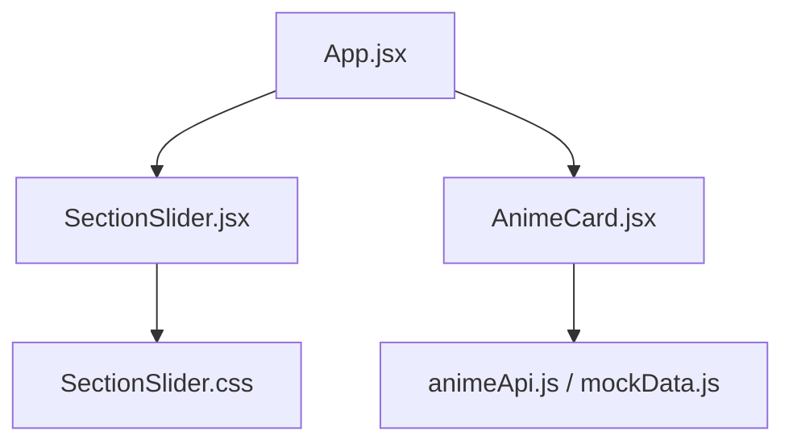
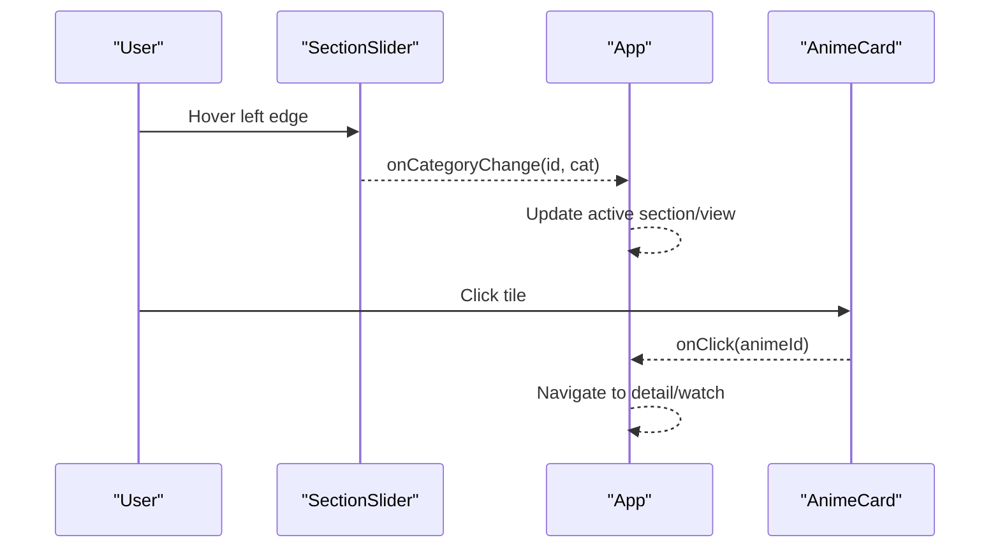
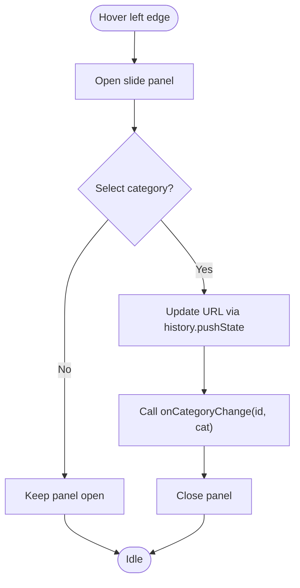
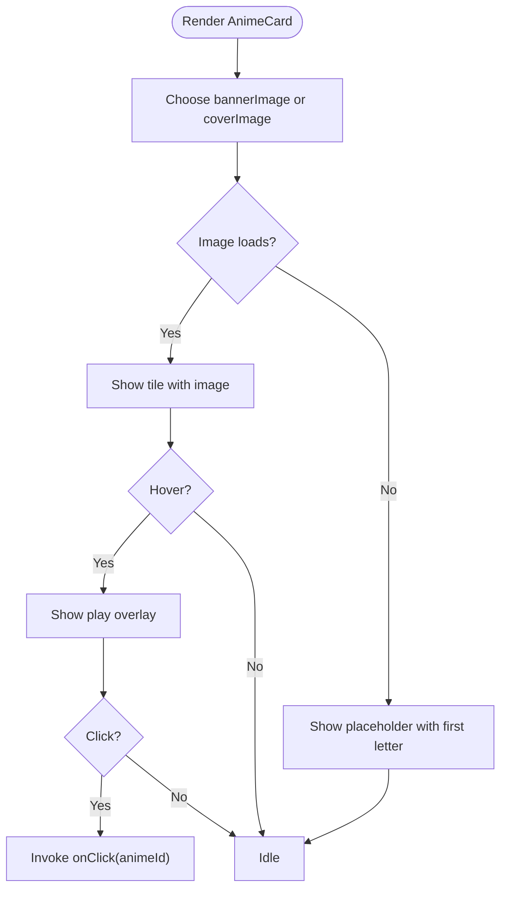
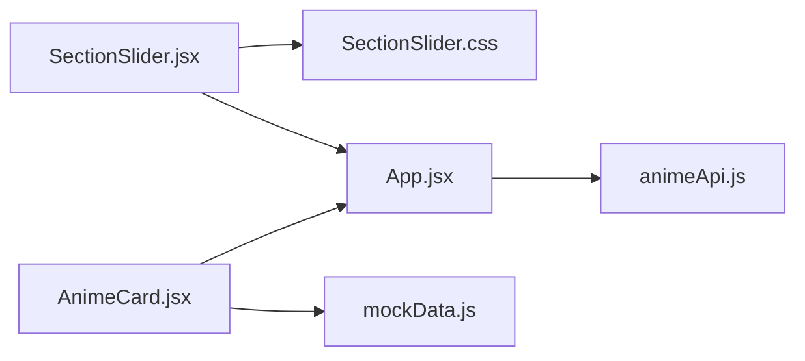

# Content Display Components

<cite>
**Referenced Files in This Document**
- [SectionSlider.jsx](file://src/components/SectionSlider.jsx)
- [SectionSlider.css](file://src/components/SectionSlider.css)
- [AnimeCard.jsx](file://src/features/anime/components/AnimeCard.jsx)
- [AnimeCard re-export](file://src/components/AnimeCard.jsx)
- [App.jsx](file://src/App.jsx)
- [animeApi.js](file://src/features/anime/api/animeApi.js)
- [mockData.js](file://src/mockData.js)
</cite>

## Table of Contents
1. Introduction
2. Project Structure
3. Core Components
4. Architecture Overview
5. Detailed Component Analysis
6. Dependency Analysis
7. Performance Considerations
8. Troubleshooting Guide
9. Conclusion

## Introduction
This document provides comprehensive documentation for two content display components: SectionSlider and AnimeCard. It explains how SectionSlider exposes category navigation via a left-edge slide panel, and how AnimeCard renders anime metadata with image handling and hover interactions. It also covers prop interfaces, styling customization, performance considerations (including lazy loading and caching), and usage examples showing data binding and event handling within the application.

## Project Structure
The components are implemented as React functional components:
- SectionSlider is a side navigation panel that opens from the left edge to switch categories.
- AnimeCard displays an anime tile with cover/banner images, rating or episode count, genre text, and optional Hindi dub badge.

**Diagram sources**
- [App.jsx](file://src/App.jsx)
- [SectionSlider.jsx](file://src/components/SectionSlider.jsx)
- [AnimeCard.jsx](file://src/features/anime/components/AnimeCard.jsx)
- [animeApi.js](file://src/features/anime/api/animeApi.js)
- [mockData.js](file://src/mockData.js)
- [SectionSlider.css](file://src/components/SectionSlider.css)

**Section sources**
- [SectionSlider.jsx:80-226](file://src/components/SectionSlider.jsx#L80-L226)
- [AnimeCard.jsx:5-62](file://src/features/anime/components/AnimeCard.jsx#L5-L62)
- [App.jsx:5-6](file://src/App.jsx#L5-L6)

## Core Components
- SectionSlider: A glassmorphic slide-in panel triggered by hovering the left edge. It lists predefined categories, highlights the active one, updates browser history, and emits an onCategoryChange callback.
- AnimeCard: A tile component that shows title, genres, rating or episode count, and a Hindi badge when applicable. It handles image errors gracefully and triggers an onClick handler.

Key responsibilities:
- SectionSlider manages open/close state, keyboard accessibility (Escape), backdrop click-to-close, and category selection.
- AnimeCard formats metadata, chooses banner or cover image, and applies lazy loading for images.

**Section sources**
- [SectionSlider.jsx:80-226](file://src/components/SectionSlider.jsx#L80-L226)
- [AnimeCard.jsx:5-62](file://src/features/anime/components/AnimeCard.jsx#L5-L62)

## Architecture Overview
The app composes these components under a central view layer:
- App imports both components and passes data and handlers down.
- SectionSlider communicates category changes back to App via onCategoryChange.
- AnimeCard receives an anime object and an onClick handler; it delegates navigation to the parent.

**Diagram sources**
- [SectionSlider.jsx:122-131](file://src/components/SectionSlider.jsx#L122-L131)
- [AnimeCard.jsx:18-18](file://src/features/anime/components/AnimeCard.jsx#L18-L18)
- [App.jsx:3185-3190](file://src/App.jsx#L3185-L3190)
- [App.jsx:4138-4142](file://src/App.jsx#L4138-L4142)

## Detailed Component Analysis

### SectionSlider
- Purpose: Provide quick access to anime sections/categories via a left-edge slide panel.
- Interaction model:
  - Invisible hotzone on the left edge opens the panel on mouse enter.
  - A visible tab hint indicates the panel’s presence and hides when open.
  - Backdrop overlay closes the panel when clicked outside.
  - Escape key closes the panel.
  - Category buttons update URL via history.pushState and call onCategoryChange.
- Data model: Internal ANIME_CATEGORIES array defines id, label, path, icon, sub, desc, color.
- Styling: Glassmorphism panel, animated entry, hover effects, active indicator bar, custom scrollbar, mobile width adjustment at 768px breakpoint.

Prop interface:
- activeCategory: string — currently selected category id (default 'topanime')
- onCategoryChange: function(id, category) — invoked on category selection

Accessibility:
- role="dialog" and aria-label on panel
- Keyboard support via Escape

Responsive behavior:
- Panel width adjusts on small screens via media query at 768px.

Performance notes:
- Lightweight DOM; no virtualization needed due to fixed small list.
- Uses CSS transitions for smooth animations.

Usage example:
- In App, pass activeCategory and onCategoryChange to handle navigation and view updates.

**Section sources**
- [SectionSlider.jsx:5-78](file://src/components/SectionSlider.jsx#L5-L78)
- [SectionSlider.jsx:80-131](file://src/components/SectionSlider.jsx#L80-L131)
- [SectionSlider.jsx:133-226](file://src/components/SectionSlider.jsx#L133-L226)
- [SectionSlider.css:6-106](file://src/components/SectionSlider.css#L6-L106)
- [SectionSlider.css:187-215](file://src/components/SectionSlider.css#L187-L215)
- [SectionSlider.css:217-340](file://src/components/SectionSlider.css#L217-L340)
- [SectionSlider.css:356-361](file://src/components/SectionSlider.css#L356-L361)

#### SectionSlider interaction flow

**Diagram sources**
- [SectionSlider.jsx:109-131](file://src/components/SectionSlider.jsx#L109-L131)

### AnimeCard
- Purpose: Render an anime tile with rich metadata and interactive feedback.
- Metadata display:
  - Title and genres (first two joined with a separator).
  - Rating badge if available; otherwise episode count derived from totalEpisodes or episodes array length.
  - Optional Hindi dub badge based on hasHindiDub or helper check.
- Image optimization:
  - Chooses bannerImage over coverImage for hero-like presentation.
  - Uses native lazy loading via loading="lazy".
  - Handles image load errors by displaying a placeholder with first letter of title.
- Hover effects:
  - Overlay with play icon appears on hover.
- Click handling:
  - Button element with onClick passed from parent to navigate to detail or watch view.

Prop interface:
- anime: object — must include at least:
  - title: string
  - coverImage: string
  - bannerImage: string
  - rating: string | number
  - type: string
  - genres: string[]
  - hasHindiDub: boolean
  - japaneseTitle: string
  - episodes: any[] | null
  - totalEpisodes: number | null
- onClick: function(animeId) — invoked when tile is clicked

Styling:
- Tile classes integrate with existing grid layouts and hover overlays.
- Badge positioning uses absolute positioning for top-right corner.

Integration with content APIs:
- AnimeCard itself is presentational; data comes from App which fetches via animeApi and mockData utilities.
- Hindi availability can be determined using helpers in mockData.

Usage example:
- Rendered inside grids in App with items.map(...), passing item.id to onClick.

**Section sources**
- [AnimeCard.jsx:5-62](file://src/features/anime/components/AnimeCard.jsx#L5-L62)
- [AnimeCard re-export:1-1](file://src/components/AnimeCard.jsx#L1-L1)
- [App.jsx:3185-3190](file://src/App.jsx#L3185-L3190)
- [App.jsx:4138-4142](file://src/App.jsx#L4138-L4142)

#### AnimeCard rendering logic

**Diagram sources**
- [AnimeCard.jsx:18-59](file://src/features/anime/components/AnimeCard.jsx#L18-L59)

## Dependency Analysis
- SectionSlider depends on:
  - lucide-react icons for category visuals
  - SectionSlider.css for layout and animations
  - App for routing and state management via props
- AnimeCard depends on:
  - lucide-react icons for play and star
  - mockData helpers for Hindi availability checks
  - App for data and navigation

**Diagram sources**
- [SectionSlider.jsx:1-3](file://src/components/SectionSlider.jsx#L1-L3)
- [AnimeCard.jsx:1-3](file://src/features/anime/components/AnimeCard.jsx#L1-L3)
- [animeApi.js:1-19](file://src/features/anime/api/animeApi.js#L1-L19)
- [mockData.js:1-64](file://src/mockData.js#L1-L64)
- [App.jsx:5-6](file://src/App.jsx#L5-L6)

**Section sources**
- [animeApi.js:1-19](file://src/features/anime/api/animeApi.js#L1-L19)
- [mockData.js:1-64](file://src/mockData.js#L1-L64)
- [App.jsx:5-6](file://src/App.jsx#L5-L6)

## Performance Considerations
- Lazy loading:
  - Images use loading="lazy" to defer offscreen image requests.
  - Error fallback prevents broken image layout shifts.
- Caching:
  - mockData includes in-memory caches for AniList queries and Hindi availability checks to reduce network calls.
- Virtual scrolling:
  - Not implemented in these components. For very large lists, consider virtualization at the parent level (e.g., windowing libraries) to render only visible tiles.
- Animations:
  - CSS transitions used for panel and card interactions; avoid heavy JS-driven animations to keep main thread responsive.
- Event handling:
  - Debounced search and throttled operations are handled at the App level; ensure similar patterns for large datasets.

[No sources needed since this section provides general guidance]

## Troubleshooting Guide
Common issues and resolutions:
- Slide panel does not close:
  - Ensure Escape key listener is attached and backdrop click handler is active.
  - Verify refs for panel and hotzone are correctly bound.
- Category change not reflected:
  - Confirm onCategoryChange is provided and App updates state accordingly.
  - Check that history.pushState succeeds and routes are handled by your router.
- Image not showing:
  - Validate bannerImage/coverImage URLs.
  - Inspect onError handler to confirm placeholder appears.
- Hindi badge not appearing:
  - Ensure hasHindiDub or helper functions return true for the given title/japaneseTitle.
  - Verify async availability checks have completed before rendering.

**Section sources**
- [SectionSlider.jsx:87-107](file://src/components/SectionSlider.jsx#L87-L107)
- [SectionSlider.jsx:122-131](file://src/components/SectionSlider.jsx#L122-L131)
- [AnimeCard.jsx:20-31](file://src/features/anime/components/AnimeCard.jsx#L20-L31)
- [mockData.js:26-64](file://src/mockData.js#L26-L64)

## Conclusion
SectionSlider and AnimeCard provide a cohesive content browsing experience:
- SectionSlider offers intuitive category navigation with accessible interactions and responsive design.
- AnimeCard presents rich metadata with robust image handling and clear affordances for interaction.
Together, they integrate seamlessly with the app’s data layer and routing to deliver a performant, user-friendly anime browsing interface.

[No sources needed since this section summarizes without analyzing specific files]