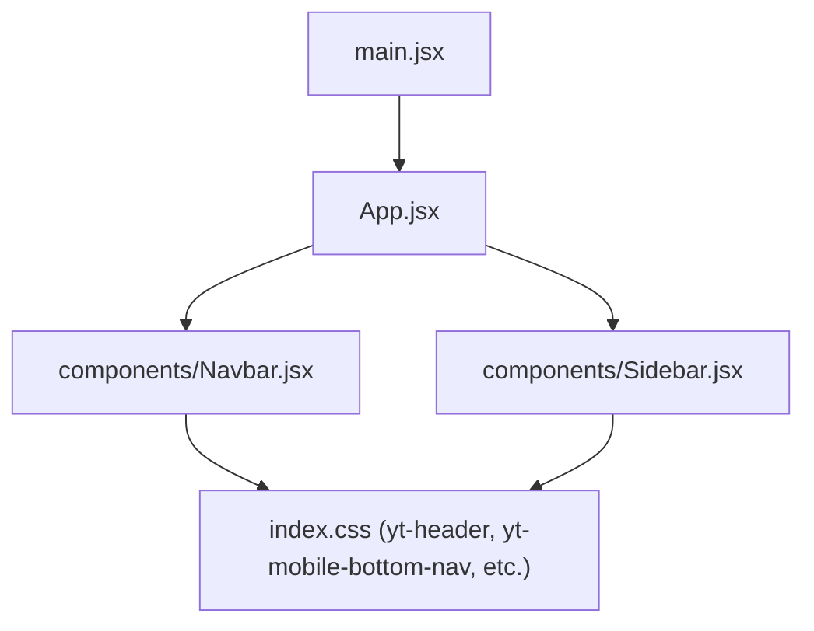
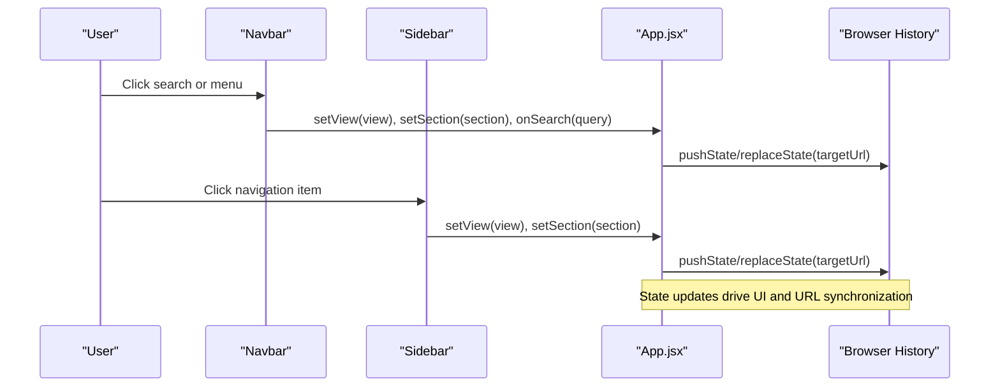
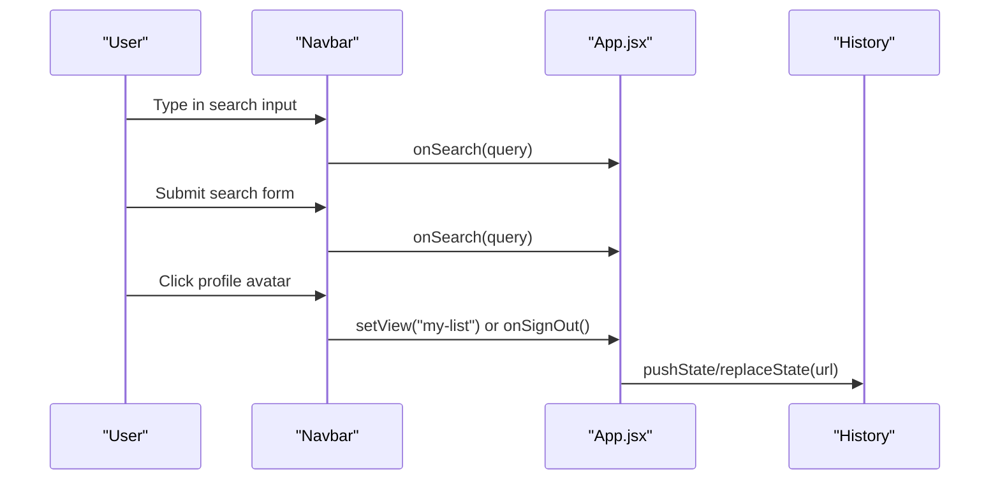
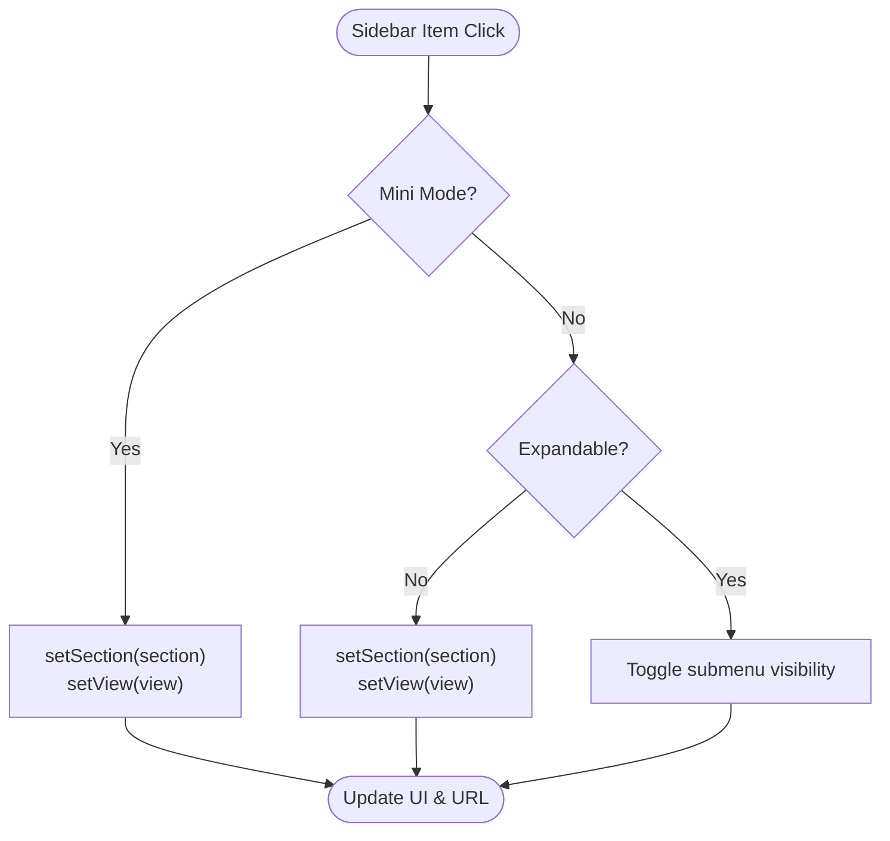
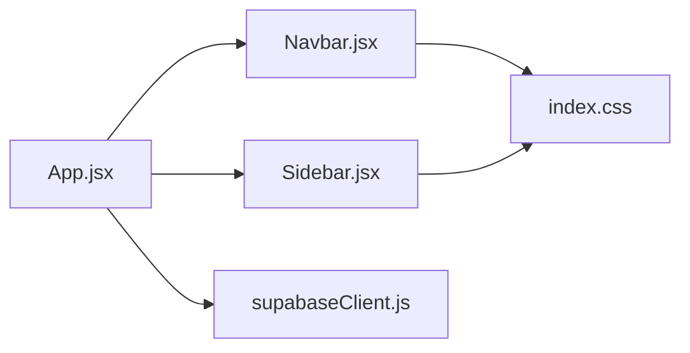

# Navigation Components

<cite>
**Referenced Files in This Document**
- [Navbar.jsx](file://src/components/Navbar.jsx)
- [Sidebar.jsx](file://src/components/Sidebar.jsx)
- [index.css](file://src/index.css)
- [App.jsx](file://src/App.jsx)
- [main.jsx](file://src/main.jsx)
</cite>

## Table of Contents
1. [Introduction](#introduction)
2. [Project Structure](#project-structure)
3. [Core Components](#core-components)
4. [Architecture Overview](#architecture-overview)
5. [Detailed Component Analysis](#detailed-component-analysis)
6. [Dependency Analysis](#dependency-analysis)
7. [Performance Considerations](#performance-considerations)
8. [Troubleshooting Guide](#troubleshooting-guide)
9. [Conclusion](#conclusion)
10. [Appendices](#appendices)

## Introduction
This document provides comprehensive documentation for the navigation components: Navbar and Sidebar. It explains responsive behavior, search functionality, authentication integration, routing integration, collapsible menu structure, active state management, mobile responsiveness, prop interfaces, event handlers, styling customization options, accessibility considerations, and cross-browser compatibility.

## Project Structure
The navigation system is composed of two primary React components:
- Navbar: A fixed top header with search, notifications, profile/sign-in, and a mobile drawer/bottom nav.
- Sidebar: A left-side navigation panel with sections like Home, Subscriptions, You, Explore (Anime, Comics, Drama, Movies), and expandable submenus.

These components are integrated into the application root via App.jsx and rendered by main.jsx. Styling is centralized in index.css using CSS variables and responsive rules.

**Diagram sources**
- [main.jsx:6-13](file://src/main.jsx#L6-L13)
- [App.jsx:1-10](file://src/App.jsx#L1-L10)
- [Navbar.jsx:243-512](file://src/components/Navbar.jsx#L243-L512)
- [Sidebar.jsx:75-286](file://src/components/Sidebar.jsx#L75-L286)
- [index.css:10580-11200](file://src/index.css#L10580-L11200)

**Section sources**
- [main.jsx:6-13](file://src/main.jsx#L6-L13)
- [App.jsx:1-10](file://src/App.jsx#L1-L10)

## Core Components
- Navbar
  - Fixed header with three zones: left (menu/logo), center (search bar + mic), right (mobile search trigger, notifications, profile/sign-in).
  - Mobile behaviors: slide-in drawer, bottom navigation bar, expandable full-width search overlay.
  - Integrates with app state to navigate views and sections; supports sign-in/sign-out flows.
- Sidebar
  - Left-side navigation with sections: Home, Subscriptions, You (user-specific items), Explore (Anime with expandable genres, Comics, Drama, Movies).
  - Collapsible mini mode for compact icon-only layout.
  - Active state highlighting based on current view; expandable submenus for Anime genres.

Key responsibilities:
- Routing: Both components call setView/setSection to update application state, which drives URL changes via history API in App.jsx.
- Authentication: Conditional rendering of user profile, sign-in prompts, and protected routes (e.g., watch history, playlists).
- Search: Real-time input handling and submission callbacks; mobile-specific search UX.
- Notifications: Dropdown with unread badge and categorized items.

**Section sources**
- [Navbar.jsx:243-512](file://src/components/Navbar.jsx#L243-L512)
- [Sidebar.jsx:75-286](file://src/components/Sidebar.jsx#L75-L286)
- [index.css:10580-11200](file://src/index.css#L10580-L11200)

## Architecture Overview
The navigation components are controlled by the root App component, which maintains global state for view, section, user session, and routing. The components communicate through props and callbacks rather than direct coupling.

**Diagram sources**
- [Navbar.jsx:286-311](file://src/components/Navbar.jsx#L286-L311)
- [Sidebar.jsx:92-108](file://src/components/Sidebar.jsx#L92-L108)
- [App.jsx:322-445](file://src/App.jsx#L322-L445)

## Detailed Component Analysis

### Navbar
Responsibilities:
- Responsive header with desktop search and mobile drawer/bottom nav.
- Search input with real-time callback and submit handler.
- Notification dropdown with unread count and categorized items.
- Profile dropdown with account actions and sign-out.
- Sign-in prompt when user is not authenticated.

Prop interface:
- onSearch: function(query) — invoked on input change and form submit.
- activeView: string — current view name used for highlighting.
- setView: function(view) — navigates to specified view.
- onHome: function — navigates to home.
- activeSection: string — tracks major content section (anime/movies/etc.).
- user: object | null — Supabase user session data.
- onSignIn: function — triggers sign-in flow.
- onSignOut: function — triggers sign-out flow.
- onToggleSidebar: function — toggles sidebar visibility on desktop.
- notifications: array — list of notification objects with read status and metadata.
- onSelectNotification: function(n) — handles notification selection.
- setSection: function(section) — sets the active content section.

Event handlers:
- handleSearchSubmit(e): prevents default and calls onSearch with current query.
- handleInputChange(e): updates local search value and calls onSearch with typed value.
- handleMenuClick(): opens mobile drawer or toggles sidebar depending on device type.
- Profile dropdown actions: navigate to My Watchlist, Watch History, or sign out.

Mobile behaviors:
- Drawer: slides from left with backdrop; locks body scroll while open; closes on outside tap.
- Bottom nav: fixed at bottom on small screens with icons for Home, Anime, Movies, Comics, Drama, You.
- Expandable search: replaces header center with a full-width search bar on mobile.

Accessibility:
- Buttons have aria-label attributes for screen readers.
- Profile dropdown uses role="menu".
- Keyboard focus styles are provided via CSS variables and transitions.

Cross-browser compatibility:
- Uses standard CSS properties and transitions; avoids vendor-specific features except where necessary (e.g., scrollbar hiding).
- Backdrop blur and filters are widely supported; fallbacks exist for older browsers.

Styling customization:
- Theme variables defined in :root (colors, spacing, typography, shadows).
- Header height and sidebar widths are CSS variables for easy theming.
- Hover states and active states use consistent transition timings.

Integration with routing:
- setView and setSection update App state, which pushes/replaces browser history entries to maintain clean URLs.

Integration with authentication:
- If user is not logged in, certain navigation items (history, playlists, liked videos) trigger sign-in.
- Profile dropdown shows user info and sign-out option when authenticated.

**Section sources**
- [Navbar.jsx:5-170](file://src/components/Navbar.jsx#L5-L170)
- [Navbar.jsx:194-241](file://src/components/Navbar.jsx#L194-L241)
- [Navbar.jsx:243-512](file://src/components/Navbar.jsx#L243-L512)
- [index.css:10580-11200](file://src/index.css#L10580-L11200)
- [App.jsx:322-445](file://src/App.jsx#L322-L445)

#### Navbar Sequence Diagram

**Diagram sources**
- [Navbar.jsx:286-311](file://src/components/Navbar.jsx#L286-L311)
- [App.jsx:322-445](file://src/App.jsx#L322-L445)

### Sidebar
Responsibilities:
- Primary navigation with sections: Home, Subscriptions, You, Explore.
- Collapsible mini mode for compact icon-only layout.
- Expandable submenu under Anime for quick genre access and Hindi Dubs.
- Active state highlighting based on current view.
- Subscription list with new episode indicators and “show more” toggle.

Prop interface:
- activeView: string — current view name for active highlighting.
- setView: function(view) — navigates to specified view.
- setSection: function(section) — sets the active content section.
- user: object | null — Supabase user session data.
- onSignIn: function — triggers sign-in flow.
- mini: boolean — toggles compact icon-only mode.
- subscriptions: array — list of subscribed channels/media with cover images and new indicators.
- activeCategory: string — current category filter within Anime.
- onSelectCategory: function(category) — optional custom handler for category selection.
- onSelectSubscription: function(sub) — optional custom handler for subscription selection.

Collapsible behavior:
- Mini mode reduces width and hides labels; items become centered icons with tooltips.
- Anime submenu expands/collapses via chevron button; displays Hindi Dubs and genre links.

Active state management:
- Items compare their target view against activeView to apply active class.
- For grouped views (e.g., movies/detail/watch), multiple view names are checked.

Mobile responsiveness:
- On small screens, sidebar is hidden; bottom navigation takes over.
- Drawer in Navbar provides mobile navigation alternative.

Styling customization:
- Uses CSS variables for colors, spacing, and transitions.
- Section labels, dividers, and show-more buttons styled consistently.

Integration with routing:
- Calls setView and setSection to update App state and URL via history API.

Integration with authentication:
- “You” section shows user-specific items only when user is present; otherwise prompts sign-in.

**Section sources**
- [Sidebar.jsx:33-59](file://src/components/Sidebar.jsx#L33-L59)
- [Sidebar.jsx:75-286](file://src/components/Sidebar.jsx#L75-L286)
- [index.css:10811-11020](file://src/index.css#L10811-L11020)
- [App.jsx:322-445](file://src/App.jsx#L322-L445)

#### Sidebar Flowchart

**Diagram sources**
- [Sidebar.jsx:92-108](file://src/components/Sidebar.jsx#L92-L108)
- [Sidebar.jsx:219-266](file://src/components/Sidebar.jsx#L219-L266)

## Dependency Analysis
Component relationships:
- App.jsx imports and renders Navbar and Sidebar, passing shared state and handlers.
- Navbar depends on App’s setView, setSection, user, and auth callbacks.
- Sidebar depends on App’s setView, setSection, user, and optional category/subscription handlers.
- Both components rely on index.css for consistent styling and responsive behavior.

External dependencies:
- Lucide icons used throughout both components.
- Supabase client used in App.jsx for authentication state changes and data sync.

Potential circular dependencies:
- None observed; components communicate via props and callbacks without importing each other.

Integration points:
- Browser history API used in App.jsx to synchronize UI state with URLs.
- Supabase auth listener updates user state across components.

**Diagram sources**
- [App.jsx:1-10](file://src/App.jsx#L1-L10)
- [Navbar.jsx:243-512](file://src/components/Navbar.jsx#L243-L512)
- [Sidebar.jsx:75-286](file://src/components/Sidebar.jsx#L75-L286)
- [index.css:10580-11200](file://src/index.css#L10580-L11200)

**Section sources**
- [App.jsx:1-10](file://src/App.jsx#L1-L10)
- [Navbar.jsx:243-512](file://src/components/Navbar.jsx#L243-L512)
- [Sidebar.jsx:75-286](file://src/components/Sidebar.jsx#L75-L286)
- [index.css:10580-11200](file://src/index.css#L10580-L11200)

## Performance Considerations
- Avoid unnecessary re-renders by memoizing expensive computations if needed (e.g., filtering notifications).
- Use CSS variables for theme changes to minimize style recalculations.
- Debounce search input if server-side queries are performed to reduce network requests.
- Lazy-load heavy components beyond the viewport if applicable.
- Minimize DOM manipulations in mobile drawer by leveraging CSS transforms and transitions.

[No sources needed since this section provides general guidance]

## Troubleshooting Guide
Common issues and resolutions:
- Search not triggering: Ensure onSearch prop is passed correctly and form submit handler prevents default.
- Sidebar not updating active state: Verify activeView comparisons include all relevant view names for grouped sections.
- Mobile drawer not closing: Check event listeners for touchstart/mousedown and ensure refs are attached properly.
- Notifications badge incorrect: Confirm unreadCount calculation filters notifications by read status.
- Auth state not reflecting: Verify Supabase auth listener is initialized and user state is updated in App.jsx.

**Section sources**
- [Navbar.jsx:286-311](file://src/components/Navbar.jsx#L286-L311)
- [Navbar.jsx:395-464](file://src/components/Navbar.jsx#L395-L464)
- [Sidebar.jsx:92-108](file://src/components/Sidebar.jsx#L92-L108)
- [App.jsx:592-622](file://src/App.jsx#L592-L622)

## Conclusion
The Navbar and Sidebar components provide a robust, responsive navigation system integrated with application routing and authentication. They support desktop and mobile experiences, offer accessible interactions, and are customizable via CSS variables. Proper prop usage and event handling ensure seamless navigation and state synchronization across the application.

[No sources needed since this section summarizes without analyzing specific files]

## Appendices

### Prop Interfaces Summary
- Navbar props: onSearch, activeView, setView, onHome, activeSection, user, onSignIn, onSignOut, onToggleSidebar, notifications, onSelectNotification, setSection.
- Sidebar props: activeView, setView, setSection, user, onSignIn, mini, subscriptions, activeCategory, onSelectCategory, onSelectSubscription.

**Section sources**
- [Navbar.jsx:243-256](file://src/components/Navbar.jsx#L243-L256)
- [Sidebar.jsx:75-86](file://src/components/Sidebar.jsx#L75-L86)

### Accessibility Checklist
- All interactive elements have appropriate roles and labels.
- Focus management ensures keyboard navigation works.
- Color contrast meets WCAG guidelines using CSS variables.
- Screen reader-friendly text and alt attributes for images.

**Section sources**
- [Navbar.jsx:331-351](file://src/components/Navbar.jsx#L331-L351)
- [Navbar.jsx:468-499](file://src/components/Navbar.jsx#L468-L499)
- [index.css:10580-11200](file://src/index.css#L10580-L11200)

### Cross-Browser Compatibility Notes
- CSS transitions and transforms are widely supported.
- Backdrop filters may degrade gracefully on older browsers.
- Scrollbar hiding uses vendor prefixes where necessary.
- JavaScript APIs (History, localStorage) are standard and well-supported.

**Section sources**
- [index.css:10580-11200](file://src/index.css#L10580-L11200)