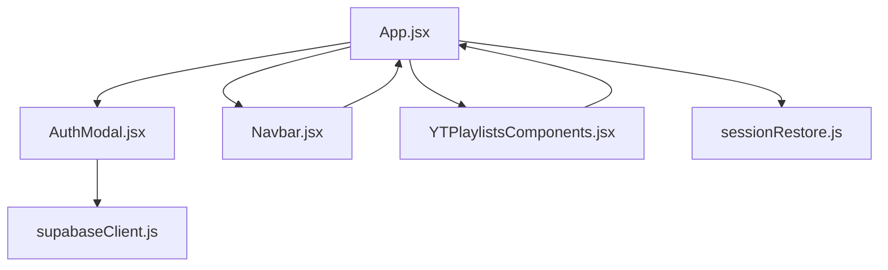
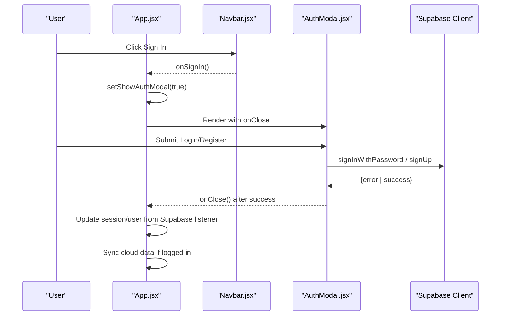
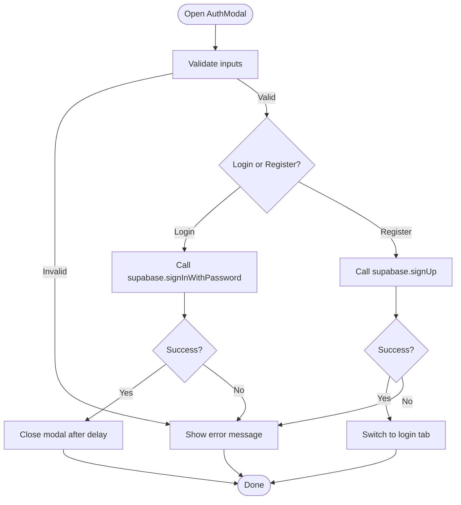
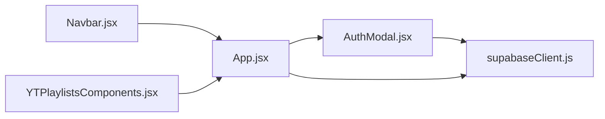

# UI Modal Components

<cite>
**Referenced Files in This Document**
- [AuthModal.jsx](file://src/components/AuthModal.jsx)
- [supabaseClient.js](file://src/supabaseClient.js)
- [App.jsx](file://src/App.jsx)
- [YTPlaylistsComponents.jsx](file://src/components/YTPlaylistsComponents.jsx)
- [Navbar.jsx](file://src/components/Navbar.jsx)
- [sessionRestore.js](file://src/utils/sessionRestore.js)
</cite>

## Table of Contents
1. [Introduction](#introduction)
2. [Project Structure](#project-structure)
3. [Core Components](#core-components)
4. [Architecture Overview](#architecture-overview)
5. [Detailed Component Analysis](#detailed-component-analysis)
6. [Dependency Analysis](#dependency-analysis)
7. [Performance Considerations](#performance-considerations)
8. [Troubleshooting Guide](#troubleshooting-guide)
9. [Conclusion](#conclusion)
10. [Appendices](#appendices)

## Introduction
This document explains the modal UI system with a focus on the authentication modal and related modals used across the application. It covers form handling, validation, Supabase integration, session management, overlay behavior, focus management, keyboard navigation, accessibility, prop interfaces, event patterns, and how to implement custom modals while keeping state consistent throughout the app.

## Project Structure
The modal system is composed of:
- AuthModal: A full-screen dialog for sign-in, sign-up, and social login via Supabase.
- Playlist-related modals: Save-to-playlist and create-playlist dialogs.
- App-level orchestration: State and lifecycle for showing/hiding modals and syncing sessions.
- Navigation components: Entry points that trigger the auth modal when users are not authenticated.

**Diagram sources**
- [App.jsx:51-235](file://src/App.jsx#L51-L235)
- [AuthModal.jsx:92-194](file://src/components/AuthModal.jsx#L92-L194)
- [YTPlaylistsComponents.jsx:7-150](file://src/components/YTPlaylistsComponents.jsx#L7-L150)
- [Navbar.jsx:243-512](file://src/components/Navbar.jsx#L243-L512)
- [supabaseClient.js:1-98](file://src/supabaseClient.js#L1-L98)
- [sessionRestore.js:17-55](file://src/utils/sessionRestore.js#L17-L55)

**Section sources**
- [App.jsx:51-235](file://src/App.jsx#L51-L235)
- [AuthModal.jsx:92-194](file://src/components/AuthModal.jsx#L92-L194)
- [YTPlaylistsComponents.jsx:7-150](file://src/components/YTPlaylistsComponents.jsx#L7-L150)
- [Navbar.jsx:243-512](file://src/components/Navbar.jsx#L243-L512)
- [supabaseClient.js:1-98](file://src/supabaseClient.js#L1-L98)
- [sessionRestore.js:17-55](file://src/utils/sessionRestore.js#L17-L55)

## Core Components
- AuthModal: Handles email/password sign-in/sign-up, password strength feedback, social OAuth (Google/Discord), overlay click-to-close, Escape key close, and user-friendly error messages.
- SaveToPlaylistModal and CreatePlaylistModal: Lightweight overlays for saving media to playlists or creating new ones.
- App.jsx: Owns showAuthModal state, subscribes to Supabase auth changes, triggers sync, and renders modals conditionally.
- Navbar.jsx: Provides entry points to open the AuthModal when unauthenticated actions are attempted.

Key responsibilities:
- Form validation and UX feedback within each modal.
- Secure calls to Supabase for authentication and OAuth.
- Centralized session synchronization and local storage fallback.
- Accessible overlays with proper roles and keyboard support.

**Section sources**
- [AuthModal.jsx:92-419](file://src/components/AuthModal.jsx#L92-L419)
- [YTPlaylistsComponents.jsx:7-150](file://src/components/YTPlaylistsComponents.jsx#L7-L150)
- [App.jsx:224-235](file://src/App.jsx#L224-L235)
- [Navbar.jsx:119-131](file://src/components/Navbar.jsx#L119-L131)

## Architecture Overview
The modal architecture follows a top-down pattern:
- App holds global auth state and controls visibility of modals.
- AuthModal performs authentication flows and communicates results back to App via callbacks.
- Supabase client provides persistent sessions and OAuth flows.
- Other modals (playlist-related) are self-contained and communicate via props.

**Diagram sources**
- [Navbar.jsx:119-131](file://src/components/Navbar.jsx#L119-L131)
- [App.jsx:224-235](file://src/App.jsx#L224-L235)
- [AuthModal.jsx:122-187](file://src/components/AuthModal.jsx#L122-L187)
- [supabaseClient.js:26-39](file://src/supabaseClient.js#L26-L39)

## Detailed Component Analysis

### AuthModal
Responsibilities:
- Tabbed interface for Sign In and Create Account.
- Local validation and user feedback.
- Supabase authentication (email/password and OAuth).
- Overlay behavior and keyboard support.
- Accessibility attributes for dialogs and tabs.

Form handling and validation:
- Required fields enforced before submission.
- Password confirmation checked during registration.
- Password strength indicator guides users toward stronger passwords.

Supabase integration:
- Uses signInWithPassword and signUp for email/password flows.
- Uses signInWithOAuth for Google and Discord providers with redirect handling.
- Error messages are normalized into friendly text.

Overlay and keyboard behavior:
- Clicking outside the modal closes it.
- Pressing Escape closes the modal.
- Dialog role and aria-modal ensure screen readers treat it as a modal.

Accessibility:
- Tabs use role="tablist", role="tab", and aria-selected.
- Inputs have labels and autocomplete attributes.
- Buttons have descriptive aria-labels where needed.

Integration with App:
- Receives onClose callback to hide itself.
- On successful login, App’s auth listener updates session and triggers sync.

**Diagram sources**
- [AuthModal.jsx:122-187](file://src/components/AuthModal.jsx#L122-L187)
- [AuthModal.jsx:107-112](file://src/components/AuthModal.jsx#L107-L112)
- [AuthModal.jsx:189-195](file://src/components/AuthModal.jsx#L189-L195)

**Section sources**
- [AuthModal.jsx:6-54](file://src/components/AuthModal.jsx#L6-L54)
- [AuthModal.jsx:92-194](file://src/components/AuthModal.jsx#L92-L194)
- [AuthModal.jsx:195-419](file://src/components/AuthModal.jsx#L195-L419)

### SaveToPlaylistModal and CreatePlaylistModal
Responsibilities:
- SaveToPlaylistModal: Toggles items into Watch Later, Liked videos, or custom playlists; supports creating a new playlist.
- CreatePlaylistModal: Simple form to create a new playlist with title validation.

Behavior:
- Backdrop click closes the modal.
- Content click does not propagate to backdrop.
- Minimal state inside modal; all persistence handled by parent.

Accessibility:
- Clear headings and buttons.
- Focus management delegated to parent via autoFocus on input.

**Section sources**
- [YTPlaylistsComponents.jsx:7-150](file://src/components/YTPlaylistsComponents.jsx#L7-L150)

### App.jsx Modal Orchestration
Responsibilities:
- Holds showAuthModal state and passes onClose to AuthModal.
- Subscribes to Supabase auth state changes to update session/user and trigger sync.
- Renders AuthModal conditionally based on state.

Event handling:
- Triggers AuthModal from Navbar and other places when user attempts protected actions.
- Closes modal on successful authentication flow completion.

Session management:
- Listens to onAuthStateChange to keep UI in sync with Supabase.
- Syncs watch history and watchlist between local storage and cloud when user logs in.

**Section sources**
- [App.jsx:224-235](file://src/App.jsx#L224-L235)
- [App.jsx:592-622](file://src/App.jsx#L592-L622)
- [App.jsx:624-725](file://src/App.jsx#L624-L725)

### Navbar Integration
Responsibilities:
- Provides Sign In button and drawer actions that open AuthModal when user is not authenticated.
- Prevents access to protected sections until signed in.

Entry points:
- Drawer “Sign in” button.
- Protected navigation routes that call onSignIn when user is null.

**Section sources**
- [Navbar.jsx:119-131](file://src/components/Navbar.jsx#L119-L131)
- [Navbar.jsx:29-39](file://src/components/Navbar.jsx#L29-L39)

## Dependency Analysis
- AuthModal depends on Supabase client for authentication and OAuth.
- App.jsx depends on Supabase client for session subscription and data sync.
- Navbar.jsx triggers AuthModal via props passed from App.jsx.
- Playlist modals depend on parent-provided handlers and lists.

**Diagram sources**
- [AuthModal.jsx:1-4](file://src/components/AuthModal.jsx#L1-L4)
- [App.jsx:11-18](file://src/App.jsx#L11-L18)
- [Navbar.jsx:243-512](file://src/components/Navbar.jsx#L243-L512)
- [YTPlaylistsComponents.jsx:1-2](file://src/components/YTPlaylistsComponents.jsx#L1-L2)
- [supabaseClient.js:1-98](file://src/supabaseClient.js#L1-L98)

**Section sources**
- [AuthModal.jsx:1-4](file://src/components/AuthModal.jsx#L1-L4)
- [App.jsx:11-18](file://src/App.jsx#L11-L18)
- [Navbar.jsx:243-512](file://src/components/Navbar.jsx#L243-L512)
- [YTPlaylistsComponents.jsx:1-2](file://src/components/YTPlaylistsComponents.jsx#L1-L2)
- [supabaseClient.js:1-98](file://src/supabaseClient.js#L1-L98)

## Performance Considerations
- Avoid unnecessary re-renders by keeping modal state at the component level where appropriate (e.g., playlist modals manage their own small states).
- Use Supabase’s built-in session persistence and auto-refresh token to minimize manual session handling overhead.
- Debounce or throttle heavy operations if extending modals with network requests beyond auth.
- Keep overlay content minimal to reduce layout thrashing on mobile devices.

[No sources needed since this section provides general guidance]

## Troubleshooting Guide
Common issues and resolutions:
- Supabase credentials not configured: The client falls back to a mock implementation; social logins will alert that configuration is required. Ensure environment variables are set correctly.
- Rate limiting errors: Friendly messages guide users to wait before retrying.
- Email confirmation required: Registration may require email confirmation before sign-in; handle accordingly in UI.
- Invalid credentials: Provide clear error messages and prevent repeated rapid submissions by disabling submit buttons during loading.

Where to look:
- Error normalization and messaging logic in AuthModal.
- Supabase client initialization and mock fallback.
- App-level auth state change listener for session updates.

**Section sources**
- [AuthModal.jsx:6-37](file://src/components/AuthModal.jsx#L6-L37)
- [supabaseClient.js:21-95](file://src/supabaseClient.js#L21-L95)
- [App.jsx:592-622](file://src/App.jsx#L592-L622)

## Conclusion
The modal system centers around a robust AuthModal integrated with Supabase for secure authentication and seamless session management. App.jsx orchestrates modal visibility and session synchronization, while Navbar provides intuitive entry points. Playlist modals offer focused tasks with minimal complexity. Together, they deliver an accessible, responsive, and maintainable modal experience.

[No sources needed since this section summarizes without analyzing specific files]

## Appendices

### Prop Interfaces and Customization Examples
- AuthModal
  - Props: onClose (function) — called on successful sign-in or explicit close.
  - Usage example path: [App.jsx:2325](file://src/App.jsx#L2325)
- SaveToPlaylistModal
  - Props: isOpen, onClose, targetMedia, customPlaylists, watchLater, likedVideos, onToggleWatchLater, onToggleLiked, onToggleCustomPlaylist, onCreateNewPlaylistClick.
  - Usage example path: [YTPlaylistsComponents.jsx:7-18](file://src/components/YTPlaylistsComponents.jsx#L7-L18)
- CreatePlaylistModal
  - Props: isOpen, onClose, onCreate(title).
  - Usage example path: [YTPlaylistsComponents.jsx:105-150](file://src/components/YTPlaylistsComponents.jsx#L105-L150)

### Implementing a Custom Modal
Steps:
- Create a modal component with a backdrop and content container.
- Manage visibility via a boolean prop (isOpen) and pass onClose to dismiss.
- Add accessibility attributes: role="dialog", aria-modal="true", and aria-label.
- Handle Escape key to close and overlay click to close.
- Keep internal state minimal; delegate data and side effects to parent.

Reference patterns:
- Overlay and close behavior: [AuthModal.jsx:189-195](file://src/components/AuthModal.jsx#L189-L195)
- Keyboard close: [AuthModal.jsx:107-112](file://src/components/AuthModal.jsx#L107-L112)
- Backdrop click: [YTPlaylistsComponents.jsx:27-28](file://src/components/YTPlaylistsComponents.jsx#L27-L28)

### Handling Form Submissions
Patterns:
- Validate inputs before submission.
- Disable submit button during async operations.
- Display user-friendly status messages.
- On success, close modal or switch tabs as appropriate.

References:
- Validation and submission: [AuthModal.jsx:122-165](file://src/components/AuthModal.jsx#L122-L165)
- Status messages: [AuthModal.jsx:228-234](file://src/components/AuthModal.jsx#L228-L234)

### Managing Modal State Throughout the Application
- Centralize modal visibility in App.jsx to avoid scattered state.
- Pass callbacks down to child components to control opening/closing.
- Use Supabase auth listeners to update UI state consistently.

References:
- Modal state and rendering: [App.jsx:224-235](file://src/App.jsx#L224-L235)
- Auth listener and sync: [App.jsx:592-622](file://src/App.jsx#L592-L622)

### Session Management and Persistence
- Supabase client persists sessions using a custom storage adapter compatible with Capacitor and localStorage.
- App listens to auth state changes and syncs local and cloud data upon login/logout.
- Session restore utilities help resume app state after restarts.

References:
- Supabase client setup: [supabaseClient.js:1-98](file://src/supabaseClient.js#L1-L98)
- Session restore helpers: [sessionRestore.js:17-55](file://src/utils/sessionRestore.js#L17-L55)