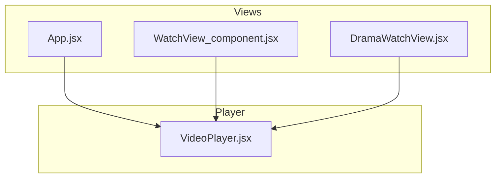
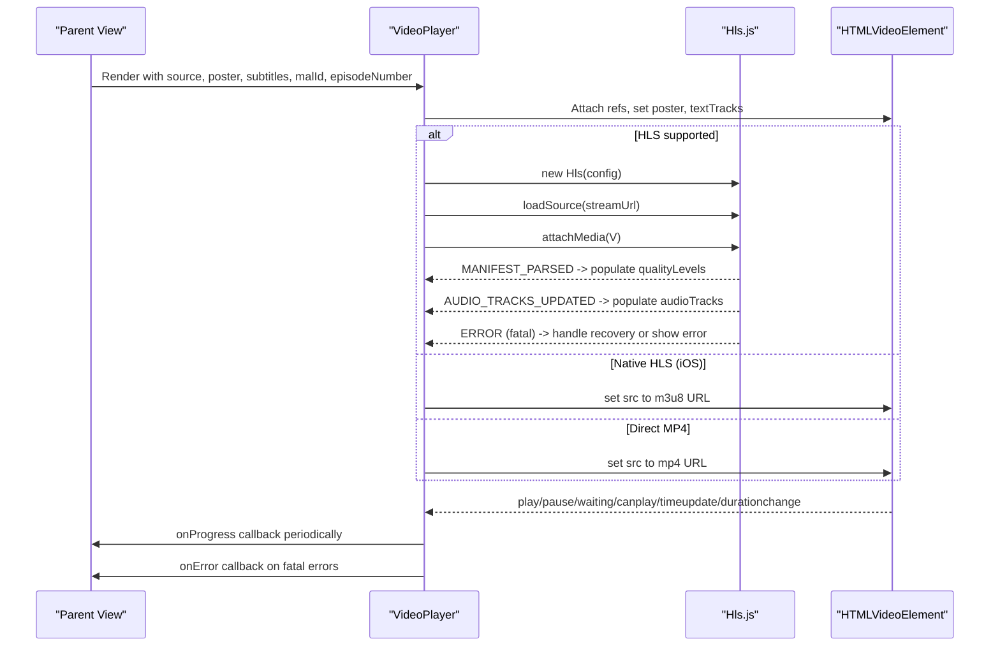
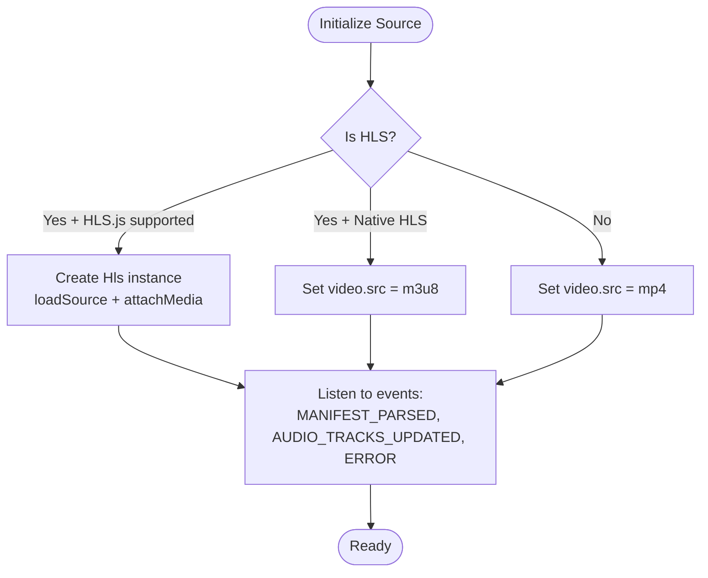
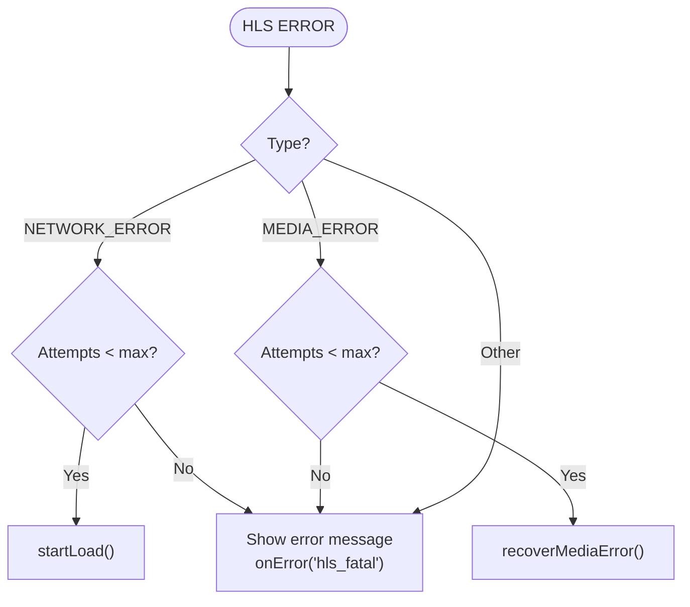
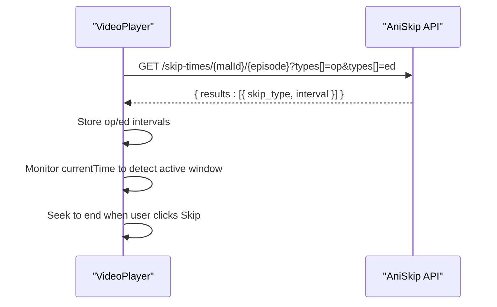
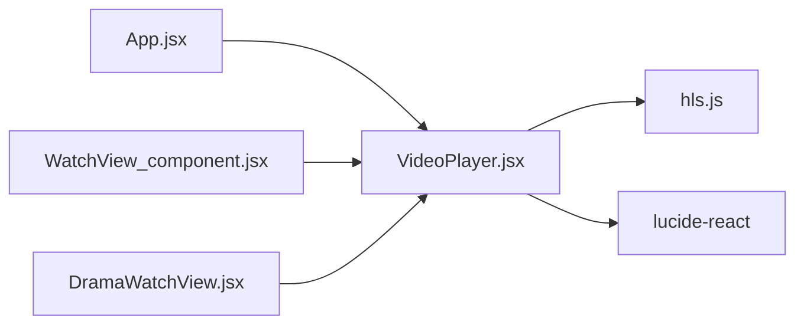

# VideoPlayer Component

<cite>
**Referenced Files in This Document**
- [VideoPlayer.jsx](file://src/components/VideoPlayer.jsx)
- [App.jsx](file://src/App.jsx)
- [WatchView_component.jsx](file://src/WatchView_component.jsx)
- [DramaWatchView.jsx](file://src/features/drama/components/DramaWatchView.jsx)
</cite>

## Table of Contents
1. [Introduction](#introduction)
2. [Project Structure](#project-structure)
3. [Core Components](#core-components)
4. [Architecture Overview](#architecture-overview)
5. [Detailed Component Analysis](#detailed-component-analysis)
6. [Dependency Analysis](#dependency-analysis)
7. [Performance Considerations](#performance-considerations)
8. [Troubleshooting Guide](#troubleshooting-guide)
9. [Conclusion](#conclusion)
10. [Appendices](#appendices)

## Introduction
This document provides comprehensive documentation for the VideoPlayer component, a sophisticated HLS.js-based video streaming player used across the application’s anime, drama, and movie features. It explains all props, stream initialization and fallbacks, subtitle handling, quality selection, audio track switching, AniSkip integration, picture-in-picture mode, fullscreen with auto-rotation, keyboard shortcuts, touch gestures, timeline scrubbing with preview thumbnails, buffer management, and error handling. It also includes usage examples from real views and guidance on integrating with feature modules.

## Project Structure
The VideoPlayer is implemented as a single React component and consumed by multiple watch views:
- Core implementation: src/components/VideoPlayer.jsx
- Usage in main app view: src/App.jsx
- Usage in legacy watch view: src/WatchView_component.jsx
- Usage in drama watch view: src/features/drama/components/DramaWatchView.jsx



**Diagram sources**
- [App.jsx:3720-3744](file://src/App.jsx#L3720-L3744)
- [WatchView_component.jsx:268-285](file://src/WatchView_component.jsx#L268-L285)
- [DramaWatchView.jsx:52-60](file://src/features/drama/components/DramaWatchView.jsx#L52-L60)
- [VideoPlayer.jsx:5-20](file://src/components/VideoPlayer.jsx#L5-L20)

**Section sources**
- [VideoPlayer.jsx:1-20](file://src/components/VideoPlayer.jsx#L1-L20)
- [App.jsx:3720-3744](file://src/App.jsx#L3720-L3744)
- [WatchView_component.jsx:268-285](file://src/WatchView_component.jsx#L268-L285)
- [DramaWatchView.jsx:52-60](file://src/features/drama/components/DramaWatchView.jsx#L52-L60)

## Core Components
- Player engine: HLS.js for adaptive streaming; native HLS path for iOS Safari; direct MP4 playback for non-HLS sources.
- UI layer: Custom controls overlay with play/pause, volume, seek bar, quality/audio menus, PiP, fullscreen, CC toggle, episode navigation, skip intro/ending button, and ripple feedback.
- State management: Local React state for playback status, buffering, time, duration, volume, mute, fullscreen, subtitles, quality levels, audio tracks, skip windows, and errors.

Key responsibilities:
- Initialize and manage HLS instance lifecycle
- Handle media events (play, pause, waiting, canplay, timeupdate, durationchange)
- Manage subtitles (textTracks) and CC toggle
- Provide quality selection and audio track switching
- Integrate AniSkip to detect and skip opening/ending segments
- Expose episode navigation callbacks and progress reporting
- Support advanced UX: PiP, fullscreen with auto-rotation, keyboard shortcuts, touch double-tap gestures, timeline scrubbing with preview thumbnails, and buffer visualization

**Section sources**
- [VideoPlayer.jsx:148-282](file://src/components/VideoPlayer.jsx#L148-L282)
- [VideoPlayer.jsx:284-332](file://src/components/VideoPlayer.jsx#L284-L332)
- [VideoPlayer.jsx:390-442](file://src/components/VideoPlayer.jsx#L390-L442)
- [VideoPlayer.jsx:506-521](file://src/components/VideoPlayer.jsx#L506-L521)
- [VideoPlayer.jsx:544-585](file://src/components/VideoPlayer.jsx#L544-L585)
- [VideoPlayer.jsx:587-659](file://src/components/VideoPlayer.jsx#L587-L659)
- [VideoPlayer.jsx:671-693](file://src/components/VideoPlayer.jsx#L671-L693)

## Architecture Overview
The component follows a clear separation between media engine (HLS.js or native), event-driven state updates, and a custom control surface.



**Diagram sources**
- [VideoPlayer.jsx:148-282](file://src/components/VideoPlayer.jsx#L148-L282)
- [VideoPlayer.jsx:294-332](file://src/components/VideoPlayer.jsx#L294-L332)

## Detailed Component Analysis

### Props API
- source: Object containing:
  - url: Stream URL (HLS m3u8 or direct MP4)
  - iframeSrc: If present, renders an embedded player instead of native controls
  - isM3U8: Boolean hint that the URL is HLS (used when not detected automatically)
  - type: String 'hls' to force HLS path
  - preferredAudioLang: Preferred audio language code (e.g., 'hin')
  - audioMode: When 'hindi', defaults preferredAudioLang to Hindi
  - error: Optional provider error string surfaced in UI
- poster: Image URL shown before playback starts
- subtitles: Array of { url, lang, label, default } for <track> elements
- malId: MAL ID used to fetch AniSkip intervals
- episodeNumber: Episode number used to fetch AniSkip intervals
- title: Displayed in some contexts (not required by player logic)
- type: Content type passed through (not required by player logic)
- onProgress: Callback invoked with { progressSeconds, durationSeconds }
- onNextEpisode: Callback invoked when next episode is requested
- onPrevEpisode: Callback invoked when previous episode is requested
- hasNextEpisode: Boolean controlling availability of next episode button
- hasPrevEpisode: Boolean controlling availability of previous episode button
- onError: Callback invoked on fatal stream errors
- className: Additional CSS class applied to the player wrapper

Notes:
- If source.iframeSrc is provided, the component renders an iframe player and bypasses HLS logic.
- Subtitles are mounted as <track> elements and toggled via CC button.
- Episode navigation buttons call provided callbacks only when enabled.

**Section sources**
- [VideoPlayer.jsx:5-20](file://src/components/VideoPlayer.jsx#L5-L20)
- [VideoPlayer.jsx:88-92](file://src/components/VideoPlayer.jsx#L88-L92)
- [VideoPlayer.jsx:671-693](file://src/components/VideoPlayer.jsx#L671-L693)
- [VideoPlayer.jsx:734-743](file://src/components/VideoPlayer.jsx#L734-L743)
- [VideoPlayer.jsx:889-916](file://src/components/VideoPlayer.jsx#L889-L916)

### HLS Stream Initialization and Fallbacks
- Detection: The component detects HLS if source.isM3U8, source.type === 'hls', or URL contains 'm3u8'.
- HLS.js path: Initializes Hls with tuned buffer and retry settings, attaches media, loads source, and listens to manifest and audio track events.
- Native HLS path: For iOS Safari, sets video.src directly to the m3u8 URL.
- Direct MP4 path: For non-HLS URLs, sets video.src to the direct file.
- No support path: Shows an error message if HLS is required but unsupported.



**Diagram sources**
- [VideoPlayer.jsx:148-282](file://src/components/VideoPlayer.jsx#L148-L282)

**Section sources**
- [VideoPlayer.jsx:148-282](file://src/components/VideoPlayer.jsx#L148-L282)

### Quality Selection
- On manifest parse, available levels are extracted and sorted by height.
- Auto mode is represented by index -1; selecting a specific level sets currentLevel.
- UI shows “Auto” or selected resolution with HD tag for 1080p+.

```mermaid
sequenceDiagram
participant VP as "VideoPlayer"
participant HLS as "Hls.js"
VP->>HLS : MANIFEST_PARSED handler
HLS-->>VP : data.levels[]
VP->>VP : Set qualityLevels, currentQuality=-1
User clicks quality menu
VP->>HLS : currentLevel = selected index
HLS-->>VP : Switch to selected quality
```

**Diagram sources**
- [VideoPlayer.jsx:198-210](file://src/components/VideoPlayer.jsx#L198-L210)
- [VideoPlayer.jsx:506-513](file://src/components/VideoPlayer.jsx#L506-L513)

**Section sources**
- [VideoPlayer.jsx:198-210](file://src/components/VideoPlayer.jsx#L198-L210)
- [VideoPlayer.jsx:506-513](file://src/components/VideoPlayer.jsx#L506-L513)

### Audio Track Switching
- On AUDIO_TRACKS_UPDATED, tracks are mapped to index/name/lang and stored.
- Auto-selection prefers preferredAudioLang or Hindi if available.
- UI exposes a menu to switch tracks; changes update HLS audioTrack and local state.

```mermaid
sequenceDiagram
participant VP as "VideoPlayer"
participant HLS as "Hls.js"
HLS-->>VP : AUDIO_TRACKS_UPDATED
VP->>VP : Set audioTracks, currentAudioTrack
VP->>HLS : audioTrack = preferred index (if found)
User selects track
VP->>HLS : audioTrack = selected index
```

**Diagram sources**
- [VideoPlayer.jsx:212-237](file://src/components/VideoPlayer.jsx#L212-L237)
- [VideoPlayer.jsx:515-521](file://src/components/VideoPlayer.jsx#L515-L521)

**Section sources**
- [VideoPlayer.jsx:212-237](file://src/components/VideoPlayer.jsx#L212-L237)
- [VideoPlayer.jsx:515-521](file://src/components/VideoPlayer.jsx#L515-L521)

### Subtitle Handling
- Subtitles are provided as an array and rendered as <track> elements under the video.
- CC toggle enables/disables textTracks via mode 'showing'/'hidden'.
- Default track can be specified per subtitle entry.

**Section sources**
- [VideoPlayer.jsx:284-292](file://src/components/VideoPlayer.jsx#L284-L292)
- [VideoPlayer.jsx:734-743](file://src/components/VideoPlayer.jsx#L734-L743)
- [VideoPlayer.jsx:940-948](file://src/components/VideoPlayer.jsx#L940-L948)

### Episode Navigation and Progress
- Previous/Next episode buttons call onPrevEpisode/onNextEpisode when enabled.
- onProgress is called periodically with progressSeconds and durationSeconds, throttled to avoid excessive calls.

**Section sources**
- [VideoPlayer.jsx:889-916](file://src/components/VideoPlayer.jsx#L889-L916)
- [VideoPlayer.jsx:321-332](file://src/components/VideoPlayer.jsx#L321-L332)

### Error Handling
- Fatal HLS errors trigger recovery attempts for network and media errors up to configured limits.
- If recovery fails, an error message is displayed and onError is invoked.
- Provider-level errors can be surfaced via source.error.



**Diagram sources**
- [VideoPlayer.jsx:244-261](file://src/components/VideoPlayer.jsx#L244-L261)

**Section sources**
- [VideoPlayer.jsx:244-261](file://src/components/VideoPlayer.jsx#L244-L261)

### Advanced Features

#### AniSkip Integration (Intro/Ending Skip)
- Fetches skip intervals from api.aniskip.com using malId and episodeNumber.
- Displays markers on the timeline and a floating “Skip Intro/Ending” button during active windows.
- Clicking the button seeks to the end of the active window.



**Diagram sources**
- [VideoPlayer.jsx:94-146](file://src/components/VideoPlayer.jsx#L94-L146)
- [VideoPlayer.jsx:774-789](file://src/components/VideoPlayer.jsx#L774-L789)

**Section sources**
- [VideoPlayer.jsx:94-146](file://src/components/VideoPlayer.jsx#L94-L146)
- [VideoPlayer.jsx:774-789](file://src/components/VideoPlayer.jsx#L774-L789)

#### Picture-in-Picture Mode
- Toggles PiP via requestPictureInPicture and exitPictureInPicture.

**Section sources**
- [VideoPlayer.jsx:433-442](file://src/components/VideoPlayer.jsx#L433-L442)

#### Fullscreen with Auto-Rotation
- Enters/exits fullscreen with standard and prefixed APIs.
- Locks orientation to landscape on enter when device is portrait (no-op on unsupported browsers).

**Section sources**
- [VideoPlayer.jsx:390-431](file://src/components/VideoPlayer.jsx#L390-L431)

#### Keyboard Shortcuts
- Space/K/Backspace: Play/Pause
- M: Mute/Unmute
- F: Toggle fullscreen
- ArrowLeft/Right: Seek backward/forward by configurable step
- ArrowUp/Down: Volume increase/decrease
- C: Toggle subtitles
- Q: Open quality menu

**Section sources**
- [VideoPlayer.jsx:544-585](file://src/components/VideoPlayer.jsx#L544-L585)

#### Touch Gestures for Mobile
- Double-tap left side: rewind by seekStep
- Double-tap right side: forward by seekStep
- Single tap: toggle controls visibility

**Section sources**
- [VideoPlayer.jsx:452-504](file://src/components/VideoPlayer.jsx#L452-L504)

#### Timeline Scrubbing with Preview Thumbnails
- Dragging the timeline seeks to the target time.
- Hovering over the timeline shows a tooltip with a canvas-rendered frame and time label.
- Buffer percent is visualized on the timeline.

**Section sources**
- [VideoPlayer.jsx:587-659](file://src/components/VideoPlayer.jsx#L587-L659)
- [VideoPlayer.jsx:816-884](file://src/components/VideoPlayer.jsx#L816-L884)

#### Buffer Management
- HLS configuration sets buffer lengths and retry policies for robustness.
- Buffer percent is computed from video.buffered ranges and displayed on the timeline.

**Section sources**
- [VideoPlayer.jsx:186-195](file://src/components/VideoPlayer.jsx#L186-L195)
- [VideoPlayer.jsx:300-315](file://src/components/VideoPlayer.jsx#L300-L315)

### Iframe Fallback
When source.iframeSrc is provided, the component renders an iframe with appropriate attributes and disables native controls.

**Section sources**
- [VideoPlayer.jsx:88-92](file://src/components/VideoPlayer.jsx#L88-L92)
- [VideoPlayer.jsx:671-693](file://src/components/VideoPlayer.jsx#L671-L693)

## Dependency Analysis
- External library: hls.js for adaptive streaming.
- Icons: lucide-react icons used in controls.
- Consumed by multiple views which supply source objects and callbacks.



**Diagram sources**
- [VideoPlayer.jsx:1-3](file://src/components/VideoPlayer.jsx#L1-L3)
- [App.jsx:3720-3744](file://src/App.jsx#L3720-L3744)
- [WatchView_component.jsx:268-285](file://src/WatchView_component.jsx#L268-L285)
- [DramaWatchView.jsx:52-60](file://src/features/drama/components/DramaWatchView.jsx#L52-L60)

**Section sources**
- [VideoPlayer.jsx:1-3](file://src/components/VideoPlayer.jsx#L1-L3)
- [App.jsx:3720-3744](file://src/App.jsx#L3720-L3744)
- [WatchView_component.jsx:268-285](file://src/WatchView_component.jsx#L268-L285)
- [DramaWatchView.jsx:52-60](file://src/features/drama/components/DramaWatchView.jsx#L52-L60)

## Performance Considerations
- Adaptive streaming: HLS.js manages bitrate and segment loading; tune buffer length and retries based on network conditions.
- Event throttling: onProgress is throttled to reduce overhead while still providing timely updates.
- Canvas preview: Uses a hidden video element to draw frames only on hover; cross-origin restrictions are handled gracefully.
- Orientation lock: Only attempted when entering fullscreen and device is portrait; no-op otherwise to avoid unnecessary work.
- Menu closures: Quality and audio menus close on outside click to prevent stale overlays.

[No sources needed since this section provides general guidance]

## Troubleshooting Guide
Common issues and resolutions:
- Stream fails to load: Check source.url validity and CORS policy; verify HLS support in browser.
- Network errors: Automatic retries are attempted; ensure stable connectivity.
- Media errors: Recovery routine attempts to resume playback; if repeated failures occur, reinitialize the player by changing the source prop.
- No subtitles visible: Ensure subtitles array is provided and at least one track has default or enable CC.
- Quality menu empty: Manifest must contain multiple levels; verify server returns valid HLS variants.
- Audio track not switching: Confirm multi-audio tracks exist in the stream and preferredAudioLang matches available languages.

**Section sources**
- [VideoPlayer.jsx:244-261](file://src/components/VideoPlayer.jsx#L244-L261)
- [VideoPlayer.jsx:284-292](file://src/components/VideoPlayer.jsx#L284-L292)
- [VideoPlayer.jsx:198-210](file://src/components/VideoPlayer.jsx#L198-L210)
- [VideoPlayer.jsx:212-237](file://src/components/VideoPlayer.jsx#L212-L237)

## Conclusion
The VideoPlayer component offers a robust, feature-rich streaming experience built on HLS.js with thoughtful fallbacks and a polished UI. It supports quality selection, audio track switching, subtitle toggling, AniSkip integration, PiP, fullscreen with auto-rotation, keyboard shortcuts, mobile gestures, timeline scrubbing with preview thumbnails, and resilient error handling. Its clean props interface makes it easy to integrate into different feature modules and customize behavior via callbacks.

[No sources needed since this section summarizes without analyzing specific files]

## Appendices

### Usage Examples

#### Basic Implementation (Anime/Movie)
- Pass source object with url and optional flags; provide poster, subtitles, and episode metadata for AniSkip.
- Wire episode navigation callbacks and progress reporting.

Example references:
- [App.jsx:3720-3744](file://src/App.jsx#L3720-L3744)
- [WatchView_component.jsx:268-285](file://src/WatchView_component.jsx#L268-L285)

#### Drama Integration
- Construct source with url, isM3U8 flag, and error field; pass subtitles array.

Example reference:
- [DramaWatchView.jsx:52-60](file://src/features/drama/components/DramaWatchView.jsx#L52-L60)

#### Custom Styling
- Apply className to the player wrapper to theme controls and layout.

Example reference:
- [App.jsx:3720-3744](file://src/App.jsx#L3720-L3744)

#### Event Handling Patterns
- onProgress: Use for analytics or syncing external progress trackers.
- onError: Handle fatal errors and display user-friendly messages.
- Episode navigation: Implement handlers to load next/previous episodes and update source accordingly.

Example references:
- [VideoPlayer.jsx:321-332](file://src/components/VideoPlayer.jsx#L321-L332)
- [VideoPlayer.jsx:244-261](file://src/components/VideoPlayer.jsx#L244-L261)
- [VideoPlayer.jsx:889-916](file://src/components/VideoPlayer.jsx#L889-L916)