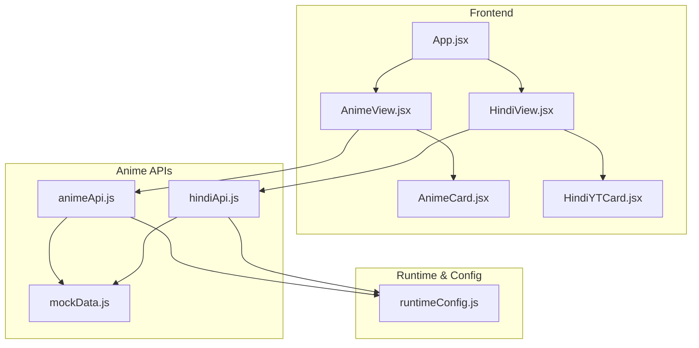
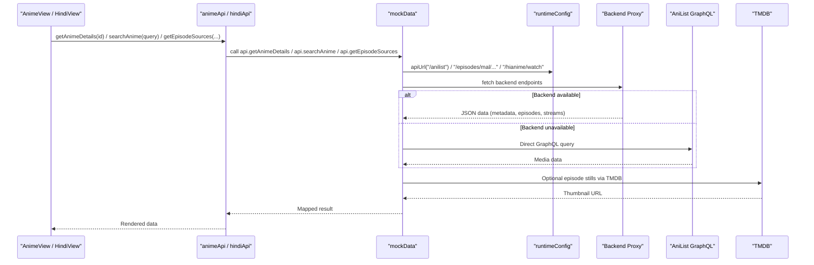
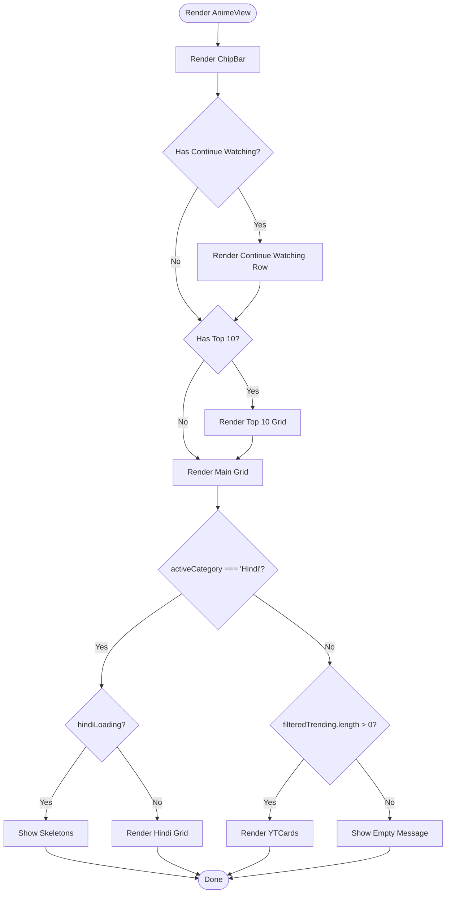
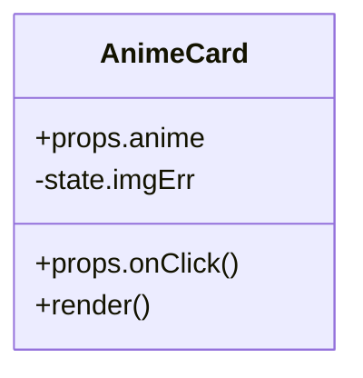
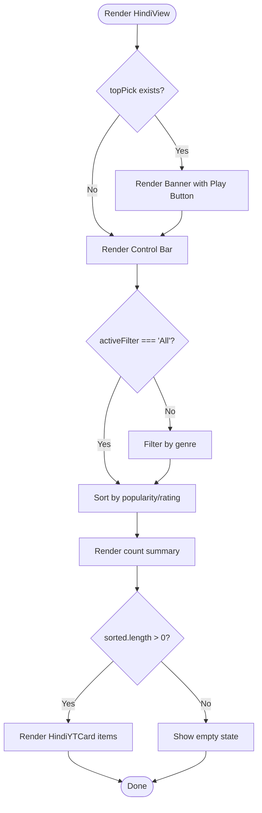
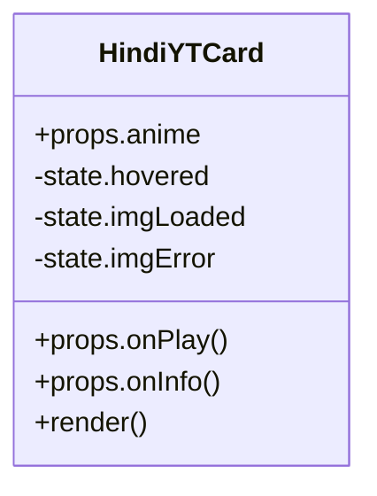
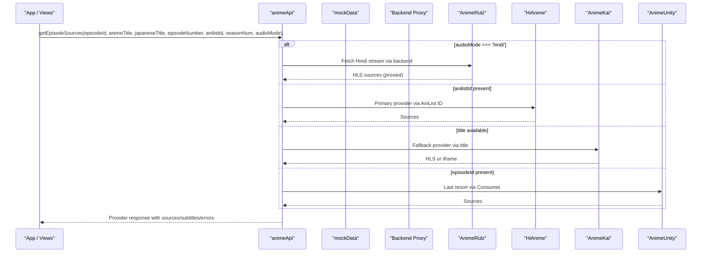
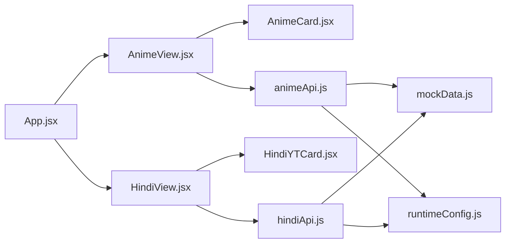

# Anime Feature Module

<cite>
**Referenced Files in This Document**
- [animeApi.js](file://src/features/anime/api/animeApi.js)
- [AnimeCard.jsx](file://src/features/anime/components/AnimeCard.jsx)
- [AnimeView.jsx](file://src/features/anime/components/AnimeView.jsx)
- [hindiApi.js](file://src/features/anime/hindi/api/hindiApi.js)
- [HindiView.jsx](file://src/features/anime/hindi/components/HindiView.jsx)
- [HindiYTCard.jsx](file://src/features/anime/hindi/components/HindiYTCard.jsx)
- [mockData.js](file://src/mockData.js)
- [runtimeConfig.js](file://src/runtimeConfig.js)
- [App.jsx](file://src/App.jsx)
- [README.md](file://README.md)
</cite>

## Table of Contents
1. [Introduction](#introduction)
2. [Project Structure](#project-structure)
3. [Core Components](#core-components)
4. [Architecture Overview](#architecture-overview)
5. [Detailed Component Analysis](#detailed-component-analysis)
6. [Dependency Analysis](#dependency-analysis)
7. [Performance Considerations](#performance-considerations)
8. [Troubleshooting Guide](#troubleshooting-guide)
9. [Conclusion](#conclusion)

## Introduction
This document explains the Anime feature module, focusing on:
- Multi-provider anime streaming and search
- Episode management and quality selection
- Hindi dubbed content with YouTube-style integration
- API layer architecture for fetching from multiple sources
- Error handling strategies and fallback mechanisms
- Component structure for AnimeCard and AnimeView (props, events, state)
- Hindi-specific implementation including playlist-like catalog and playback flow
- Performance optimizations and caching strategies for large libraries

The module integrates a frontend React application with a backend proxy that aggregates streaming providers and metadata sources. It supports both standard anime browsing and a dedicated Hindi dubbed section.

## Project Structure
The Anime feature is organized under src/features/anime with subfolders for API, components, and a Hindi-specific area. The main app wires these features together and manages global state for viewing, searching, and playback.

**Diagram sources**
- [App.jsx:1-200](file://src/App.jsx#L1-L200)
- [AnimeView.jsx:1-151](file://src/features/anime/components/AnimeView.jsx#L1-L151)
- [AnimeCard.jsx:1-63](file://src/features/anime/components/AnimeCard.jsx#L1-L63)
- [HindiView.jsx:1-131](file://src/features/anime/hindi/components/HindiView.jsx#L1-L131)
- [HindiYTCard.jsx:1-75](file://src/features/anime/hindi/components/HindiYTCard.jsx#L1-L75)
- [animeApi.js:1-20](file://src/features/anime/api/animeApi.js#L1-L20)
- [hindiApi.js:1-132](file://src/features/anime/hindi/api/hindiApi.js#L1-L132)
- [mockData.js:1-800](file://src/mockData.js#L1-L800)
- [runtimeConfig.js:1-163](file://src/runtimeConfig.js#L1-L163)

**Section sources**
- [App.jsx:1-200](file://src/App.jsx#L1-L200)
- [AnimeView.jsx:1-151](file://src/features/anime/components/AnimeView.jsx#L1-L151)
- [AnimeCard.jsx:1-63](file://src/features/anime/components/AnimeCard.jsx#L1-L63)
- [HindiView.jsx:1-131](file://src/features/anime/hindi/components/HindiView.jsx#L1-L131)
- [HindiYTCard.jsx:1-75](file://src/features/anime/hindi/components/HindiYTCard.jsx#L1-L75)
- [animeApi.js:1-20](file://src/features/anime/api/animeApi.js#L1-L20)
- [hindiApi.js:1-132](file://src/features/anime/hindi/api/hindiApi.js#L1-L132)
- [mockData.js:1-800](file://src/mockData.js#L1-L800)
- [runtimeConfig.js:1-163](file://src/runtimeConfig.js#L1-L163)

## Core Components
- AnimeView: Displays chips for filtering (All, genres, Hindi Dub), Continue Watching row, Top 10, and trending grid. Uses YTCard for tiles and handles loading skeletons and empty states.
- AnimeCard: Renders a tile with cover/banner image, rating or episode count, genre text, and optional Hindi badge. Handles image error fallbacks.
- HindiView: Dedicated Hindi dubbed page with banner, genre chips, sort controls, and a grid of HindiYTCard items. Supports skeleton UI while loading.
- HindiYTCard: YouTube-style card with thumbnail, episode count, Hindi audio badge, hover overlay play button, and stats.

Key props and events:
- AnimeView props include activeCategory, featured, filteredTrending, top10Famous, callbacks like onAnimeClick, onStartWatching, watchHistory, hindiLoading.
- AnimeCard props include anime object and onClick handler; displays title, images, rating or episodes, and Hindi availability.
- HindiView props include hindiAnime list, onAnimeClick, onStartWatching, isLoading.
- HindiYTCard props include anime item, onPlay, onInfo.

State management:
- AnimeView uses local state for category filter and renders sections based on props.
- HindiView maintains activeFilter and sortBy locally to filter and sort the provided hindiAnime list.
- Cards manage image load/error states internally.

**Section sources**
- [AnimeView.jsx:1-151](file://src/features/anime/components/AnimeView.jsx#L1-L151)
- [AnimeCard.jsx:1-63](file://src/features/anime/components/AnimeCard.jsx#L1-L63)
- [HindiView.jsx:1-131](file://src/features/anime/hindi/components/HindiView.jsx#L1-L131)
- [HindiYTCard.jsx:1-75](file://src/features/anime/hindi/components/HindiYTCard.jsx#L1-L75)

## Architecture Overview
The Anime feature uses a layered architecture:
- UI Layer: React components (AnimeView, AnimeCard, HindiView, HindiYTCard) render data and handle user interactions.
- API Layer: animeApi.js re-exports core methods from mockData.js and includes Hindi utilities. hindiApi.js provides Hindi-specific catalog and availability checks.
- Data Providers: mockData.js implements multi-source fetching via AniList GraphQL, backend proxies, TMDB for thumbnails, and provider-specific endpoints for streaming.
- Runtime Configuration: runtimeConfig.js resolves API base URLs dynamically and exposes apiUrl helper for consistent endpoint construction.

**Diagram sources**
- [animeApi.js:1-20](file://src/features/anime/api/animeApi.js#L1-L20)
- [hindiApi.js:1-132](file://src/features/anime/hindi/api/hindiApi.js#L1-L132)
- [mockData.js:321-800](file://src/mockData.js#L321-L800)
- [runtimeConfig.js:149-153](file://src/runtimeConfig.js#L149-L153)

**Section sources**
- [animeApi.js:1-20](file://src/features/anime/api/animeApi.js#L1-L20)
- [hindiApi.js:1-132](file://src/features/anime/hindi/api/hindiApi.js#L1-L132)
- [mockData.js:1-800](file://src/mockData.js#L1-L800)
- [runtimeConfig.js:1-163](file://src/runtimeConfig.js#L1-L163)

## Detailed Component Analysis

### AnimeView
- Responsibilities:
  - ChipBar filters by All, genres, and Hindi Dub.
  - Continue Watching row aggregates history across media types and shows progress bars.
  - Top 10 section displays popular titles with rank badges.
  - Main grid renders trending or filtered results using YTCard.
  - Shows skeletons during loading and empty state when no results are found.
- Props:
  - activeFeatured, featured, activeCategory, filteredTrending, top10Famous
  - setActiveCategory, onAnimeClick, onStartWatching, watchHistory, onHistoryItemClick, onDramaClick, onManhwaClick, hindiLoading
- Events:
  - onAnimeClick navigates to detail view
  - onStartWatching starts playback for an anime at specified episode
- State:
  - Local rendering logic for categories and continue watching aggregation

**Diagram sources**
- [AnimeView.jsx:19-151](file://src/features/anime/components/AnimeView.jsx#L19-L151)

**Section sources**
- [AnimeView.jsx:1-151](file://src/features/anime/components/AnimeView.jsx#L1-L151)

### AnimeCard
- Responsibilities:
  - Display anime tile with cover/banner image, rating or episode count, genre text, and optional Hindi badge.
  - Handle image errors gracefully with placeholder fallback.
- Props:
  - anime: { title, coverImage, bannerImage, rating, type, genres, hasHindiDub, japaneseTitle, episodes, totalEpisodes }
  - onClick: navigate to detail or start watching
- State:
  - imgErr to track image load failures

**Diagram sources**
- [AnimeCard.jsx:1-63](file://src/features/anime/components/AnimeCard.jsx#L1-L63)

**Section sources**
- [AnimeCard.jsx:1-63](file://src/features/anime/components/AnimeCard.jsx#L1-L63)

### HindiView
- Responsibilities:
  - Provide a dedicated Hindi dubbed experience with banner, genre chips, sorting, and grid.
  - Show skeletons while loading and empty state if no matches.
- Props:
  - hindiAnime: array of anime objects with Hindi metadata
  - onAnimeClick, onStartWatching
  - isLoading: boolean to trigger skeleton UI
- State:
  - activeFilter: current genre filter
  - sortBy: 'popular' or 'rating'

**Diagram sources**
- [HindiView.jsx:1-131](file://src/features/anime/hindi/components/HindiView.jsx#L1-L131)

**Section sources**
- [HindiView.jsx:1-131](file://src/features/anime/hindi/components/HindiView.jsx#L1-L131)

### HindiYTCard
- Responsibilities:
  - YouTube-style card displaying thumbnail, episode count, Hindi audio badge, hover overlay play button, and stats.
  - Manage image load and error states.
- Props:
  - anime: { bannerImage, coverImage, thumbnail, genres, totalEpisodes, episodesCount, rating, popularity, type }
  - onPlay: start playback
  - onInfo: open detail view
- State:
  - hovered, imgLoaded, imgError

**Diagram sources**
- [HindiYTCard.jsx:1-75](file://src/features/anime/hindi/components/HindiYTCard.jsx#L1-L75)

**Section sources**
- [HindiYTCard.jsx:1-75](file://src/features/anime/hindi/components/HindiYTCard.jsx#L1-L75)

### API Layer and Multi-Provider Streaming
- animeApi.js:
  - Re-exports core methods from mockData.js and includes Hindi availability helpers and Hindi catalog retrieval.
- hindiApi.js:
  - Provides checkHindiDub and hasHindiDub for per-anime language availability with in-memory cache and TTL.
  - Implements getHindiAnimeList to fetch Hindi catalog from backend, batch queries to AniList, and fallback to popular AniList list if backend returns no items.
- mockData.js:
  - Implements fetchAniList with in-memory cache and fallback chain: backend proxy → direct AniList → dev proxy.
  - Maps AniList media to card/detail formats and resolves episode thumbnails via AniList streamingEpisodes → TMDB → banner/cover fallback.
  - Provides searchAnime with auto-correct spelling fallback.
  - Implements getEpisodeSources with provider prioritization:
    - AnimeRulz (Hindi): HLS streams with proxy for CORS and headers
    - HiAnime (Primary): deterministic lookup via AniList ID
    - AnimeKai (Fallback): title-based search with HLS or iframe fallback
    - AnimeUnity (Last resort): Consumet-based endpoint
  - Includes error handling and structured responses indicating provider, type, sources, subtitles, and errors.

**Diagram sources**
- [animeApi.js:1-20](file://src/features/anime/api/animeApi.js#L1-L20)
- [mockData.js:632-800](file://src/mockData.js#L632-L800)

**Section sources**
- [animeApi.js:1-20](file://src/features/anime/api/animeApi.js#L1-L20)
- [hindiApi.js:1-132](file://src/features/anime/hindi/api/hindiApi.js#L1-L132)
- [mockData.js:321-800](file://src/mockData.js#L321-L800)

## Dependency Analysis
- App.jsx imports AnimeView and HindiView and wires global state for anime browsing, search, and playback.
- AnimeView depends on ChipBar and YTCard from App-level components and uses mockData for formatting utilities.
- AnimeCard depends on mockData for Hindi availability checks and lucide icons.
- HindiView and HindiYTCard depend on mockData for view formatting and lucide icons.
- animeApi.js depends on mockData and hindiApi for Hindi catalog and availability.
- hindiApi.js depends on runtimeConfig for API base resolution and mockData for AniList queries and mapping.
- runtimeConfig provides dynamic API base resolution and apiUrl helper used throughout.

**Diagram sources**
- [App.jsx:1-200](file://src/App.jsx#L1-L200)
- [AnimeView.jsx:1-151](file://src/features/anime/components/AnimeView.jsx#L1-L151)
- [AnimeCard.jsx:1-63](file://src/features/anime/components/AnimeCard.jsx#L1-L63)
- [HindiView.jsx:1-131](file://src/features/anime/hindi/components/HindiView.jsx#L1-L131)
- [HindiYTCard.jsx:1-75](file://src/features/anime/hindi/components/HindiYTCard.jsx#L1-L75)
- [animeApi.js:1-20](file://src/features/anime/api/animeApi.js#L1-L20)
- [hindiApi.js:1-132](file://src/features/anime/hindi/api/hindiApi.js#L1-L132)
- [mockData.js:1-800](file://src/mockData.js#L1-L800)
- [runtimeConfig.js:1-163](file://src/runtimeConfig.js#L1-L163)

**Section sources**
- [App.jsx:1-200](file://src/App.jsx#L1-L200)
- [animeApi.js:1-20](file://src/features/anime/api/animeApi.js#L1-L20)
- [hindiApi.js:1-132](file://src/features/anime/hindi/api/hindiApi.js#L1-L132)
- [mockData.js:1-800](file://src/mockData.js#L1-L800)
- [runtimeConfig.js:1-163](file://src/runtimeConfig.js#L1-L163)

## Performance Considerations
- In-memory caching:
  - AniList queries cached with TTL to reduce network calls and rate limiting impact.
  - Hindi availability checks cached per AniList ID with TTL to avoid repeated backend requests.
  - TMDB episode thumbnails cached per title/season/episode key.
- Batched and chunked fetching:
  - Hindi catalog batches IDs into chunks and processes concurrently with delays to balance throughput and responsiveness.
  - Results streamed via onBatch callback for progressive rendering.
- Fallback chains:
  - Backend proxy → direct AniList → dev proxy ensures resilience.
  - Episode details prioritize Jikan/MAL, then backend provider, then generated placeholders.
  - Episode sources prioritize AnimeRulz (Hindi), HiAnime, AnimeKai, AnimeUnity.
- Image optimization:
  - Lazy loading and error fallbacks prevent broken images and improve perceived performance.
- Sorting and filtering:
  - Client-side sorting by popularity or rating reduces server load for Hindi view.

[No sources needed since this section provides general guidance]

## Troubleshooting Guide
- Backend configuration issues:
  - If API_BASE is not resolved, relative paths are used; ensure runtime config loads correctly.
  - On Vercel, relative /api paths hit serverless functions; ensure environment variables are set.
- Provider unavailability:
  - AnimeRulz may return unavailable; fallback to other providers automatically.
  - HiAnime may fail; fallback to AnimeKai or AnimeUnity.
- Rate limiting:
  - AniList 429 responses serve cached data or null fallback; consider reducing request frequency.
- Network errors:
  - Errors are logged and handled gracefully; UI shows skeletons or empty states.
- Video playback:
  - HLS streams proxied through backend to avoid CORS issues; ensure m3u8-proxy endpoints are reachable.

**Section sources**
- [runtimeConfig.js:155-163](file://src/runtimeConfig.js#L155-L163)
- [mockData.js:122-149](file://src/mockData.js#L122-L149)
- [mockData.js:632-800](file://src/mockData.js#L632-L800)

## Conclusion
The Anime feature module provides a robust, multi-provider streaming experience with strong fallback mechanisms, efficient caching, and a polished UI for both standard anime and Hindi dubbed content. The API layer abstracts complexity behind clean interfaces, while components remain focused on presentation and user interaction. Performance optimizations ensure smooth browsing even with large libraries, and error handling strategies maintain usability under varying network conditions.