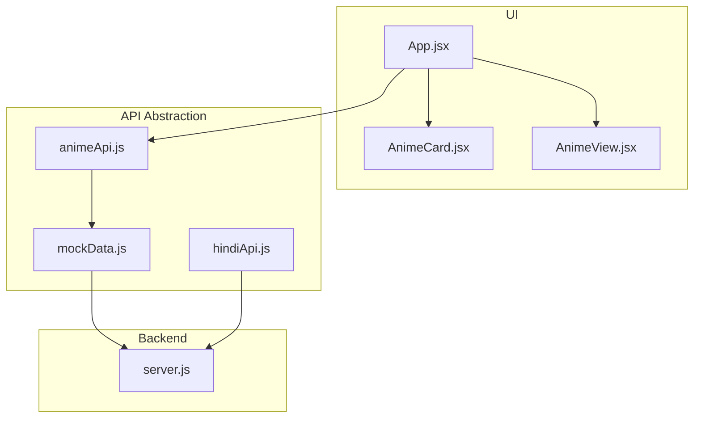
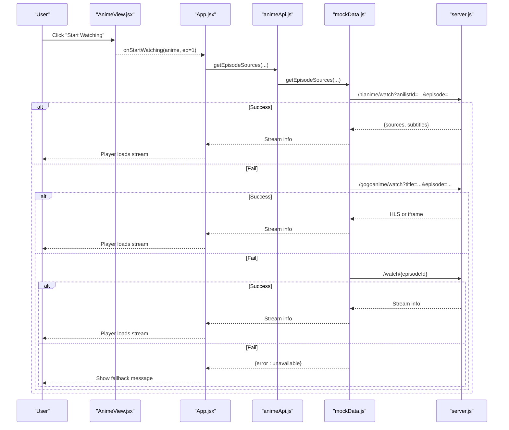
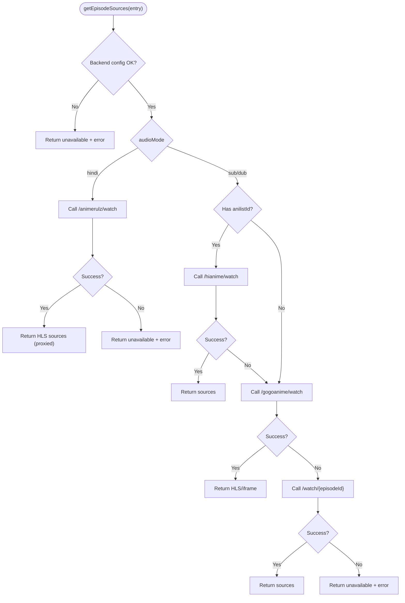
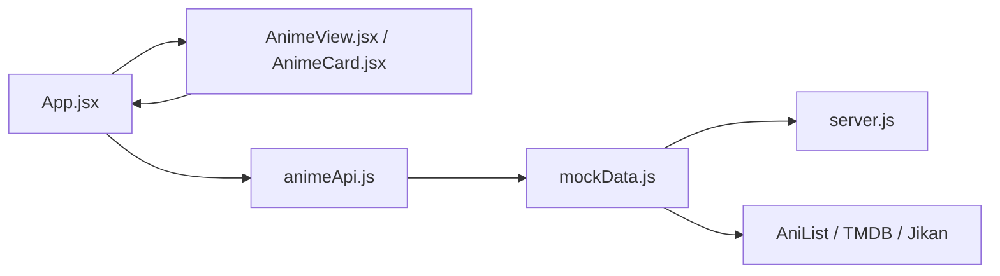

# Core Anime Streaming

<cite>
**Referenced Files in This Document**
- [animeApi.js](file://src/features/anime/api/animeApi.js)
- [AnimeCard.jsx](file://src/features/anime/components/AnimeCard.jsx)
- [AnimeView.jsx](file://src/features/anime/components/AnimeView.jsx)
- [mockData.js](file://src/mockData.js)
- [App.jsx](file://src/App.jsx)
- [hindiApi.js](file://src/features/anime/hindi/api/hindiApi.js)
- [server.js](file://server.js)
</cite>

## Table of Contents
1. Introduction
2. Project Structure
3. Core Components
4. Architecture Overview
5. Detailed Component Analysis
6. Dependency Analysis
7. Performance Considerations
8. Troubleshooting Guide
9. Conclusion

## Introduction
This document explains the core anime streaming functionality, focusing on:
- Multi-provider anime API implementation for search, catalog browsing, and episode management
- The AnimeCard component structure (props, styling, interactions)
- The AnimeView component for displaying anime details, episode lists, and quality selection options
- Provider abstraction patterns, error handling strategies, and fallback mechanisms
- Caching strategies for large libraries and performance optimizations for smooth browsing

## Project Structure
The anime feature is organized under src/features/anime with a clear separation between UI components and API abstractions. The main application orchestrates data fetching, routing, and playback state.

**Diagram sources**
- [AnimeCard.jsx:1-63](file://src/features/anime/components/AnimeCard.jsx#L1-L63)
- [AnimeView.jsx:1-151](file://src/features/anime/components/AnimeView.jsx#L1-L151)
- [animeApi.js:1-20](file://src/features/anime/api/animeApi.js#L1-L20)
- [mockData.js:321-630](file://src/mockData.js#L321-L630)
- [hindiApi.js:1-132](file://src/features/anime/hindi/api/hindiApi.js#L1-L132)
- [server.js:1604-1618](file://server.js#L1604-L1618)

**Section sources**
- [AnimeCard.jsx:1-63](file://src/features/anime/components/AnimeCard.jsx#L1-L63)
- [AnimeView.jsx:1-151](file://src/features/anime/components/AnimeView.jsx#L1-L151)
- [animeApi.js:1-20](file://src/features/anime/api/animeApi.js#L1-L20)
- [mockData.js:321-630](file://src/mockData.js#L321-L630)
- [hindiApi.js:1-132](file://src/features/anime/hindi/api/hindiApi.js#L1-L132)
- [server.js:1604-1618](file://server.js#L1604-L1618)

## Core Components
- AnimeCard: A tile-style card that displays an anime’s cover/banner, rating or episode count, genre preview, and a Hindi badge when available. It handles image load errors gracefully and triggers navigation via onClick.
- AnimeView: A sectioned view with chip filters (All, genres, Hindi Dub), Continue Watching row, Top 10 row, and a main grid for trending/Hindi content. It supports skeleton loading and empty states.
- animeApi: A thin re-export layer that delegates to mockData.js for all anime operations (search, catalogs, details, episodes).
- mockData.js: Central provider orchestration for AniList metadata, Jikan/Consumet backend endpoints, and multi-provider episode source resolution with robust fallbacks.
- hindiApi.js: Specialized helpers for AnimeRulz Hindi dub availability checks and batched catalog loading with caching.

Key responsibilities:
- Search: Query AniList via fetchAniList with in-memory caching; auto-correct common misspellings.
- Catalog browsing: Trending, top 10, new & popular, genre lists, TV shows, movies.
- Episode management: Fetch episode lists from Jikan/backend; generate placeholders if needed; resolve streaming sources across providers.

**Section sources**
- [AnimeCard.jsx:1-63](file://src/features/anime/components/AnimeCard.jsx#L1-L63)
- [AnimeView.jsx:1-151](file://src/features/anime/components/AnimeView.jsx#L1-L151)
- [animeApi.js:1-20](file://src/features/anime/api/animeApi.js#L1-L20)
- [mockData.js:321-630](file://src/mockData.js#L321-L630)
- [hindiApi.js:1-132](file://src/features/anime/hindi/api/hindiApi.js#L1-L132)

## Architecture Overview
The system uses a layered architecture:
- UI Layer: App.jsx composes views and manages global state (selected anime, current episode, audio mode).
- Feature Layer: AnimeCard and AnimeView render localized sections and handle user interactions.
- API Abstraction: animeApi.js exposes a stable interface backed by mockData.js.
- Providers:
  - Metadata: AniList GraphQL via fetchAniList with server proxy and direct fallback.
  - Episodes: Jikan/MAL and backend endpoints for episode lists.
  - Streams: Multi-provider resolution (HiAnime primary, AnimeKai fallback, AnimeUnity last resort) with Hindi-specific path through AnimeRulz.

**Diagram sources**
- [AnimeView.jsx:119-127](file://src/features/anime/components/AnimeView.jsx#L119-L127)
- [App.jsx:1000-1008](file://src/App.jsx#L1000-L1008)
- [animeApi.js:4-17](file://src/features/anime/api/animeApi.js#L4-L17)
- [mockData.js:632-818](file://src/mockData.js#L632-L818)
- [server.js:1604-1618](file://server.js#L1604-L1618)

## Detailed Component Analysis

### AnimeCard Component
Purpose:
- Display a compact tile for an anime with cover/banner image, rating or episode count, genre preview, and optional Hindi badge.
- Handle image load failures with a placeholder.
- Trigger navigation via onClick prop.

Props:
- anime: object containing title, coverImage, bannerImage, rating, type, genres, hasHindiDub, japaneseTitle, episodes, totalEpisodes
- onClick: function invoked when the tile is clicked

Styling and UX:
- Uses shared CSS classes for tile layout and hover overlay.
- Lazy-loading images to improve performance.
- Shows a “Hindi” badge when available.
- Displays either rating or episode count in a badge.

Interactions:
- Click navigates to detail/watch flow via parent handler.

Error handling:
- Image onError sets a placeholder to avoid broken images.

**Section sources**
- [AnimeCard.jsx:1-63](file://src/features/anime/components/AnimeCard.jsx#L1-L63)

### AnimeView Component
Purpose:
- Provide a browsable anime hub with chip filters, continue watching, top 10, and main grid.
- Support skeleton loading and empty states.

Props:
- activeFeatured, featured, activeCategory, filteredTrending, top10Famous
- setActiveCategory, onAnimeClick, onStartWatching
- watchHistory, onHistoryItemClick, onDramaClick, onManhwaClick
- hindiLoading

Behavior:
- ChipBar drives category filtering (All, genres, Hindi Dub).
- Continue Watching aggregates recent items across media types with progress bars.
- Top 10 renders ranked cards.
- Main grid renders YTCard tiles for trending or Hindi content; falls back to skeletons while loading or shows empty state.

Integration:
- Delegates actions to App.jsx handlers for navigation and playback.

**Section sources**
- [AnimeView.jsx:1-151](file://src/features/anime/components/AnimeView.jsx#L1-L151)

### Multi-Provider Anime API
Responsibilities:
- Metadata: AniList queries with in-memory cache and TTL; server proxy first, then direct AniList, then dev proxy fallback.
- Episode lists: Prefer Jikan/MAL via backend; fallback to Consumet backend; finally generate numbered placeholders based on AniList counts.
- Streaming sources: Multi-provider chain with explicit fallbacks and language modes.

Search:
- searchAnime queries AniList with a MEDIA_FRAGMENT; includes auto-correction for common misspellings.

Catalog browsing:
- getAnimeList, getTop10Famous, getFeatured, getTVShows, getMovies, getNewAndPopular, getGenreList.

Episode management:
- getAnimeDetails resolves rich metadata and episode lists with pagination support.
- getEpisodePage lazy-loads additional pages for long-running series.

Streaming resolution:
- Primary: HiAnime via AniList ID for deterministic season/episode mapping.
- Fallback: AnimeKai/Gogo via title search with season parameter.
- Last resort: AnimeUnity via Consumet endpoint using episodeId.
- Hindi mode: AnimeRulz HLS streams proxied through backend; subtitles proxied to bypass CORS.

**Diagram sources**
- [mockData.js:632-818](file://src/mockData.js#L632-L818)

**Section sources**
- [mockData.js:321-630](file://src/mockData.js#L321-L630)
- [mockData.js:632-818](file://src/mockData.js#L632-L818)
- [server.js:1604-1618](file://server.js#L1604-L1618)

### Hindi Dub Integration
- Availability checks: In-memory cache with TTL to avoid repeated network calls.
- Catalog loading: Batched AniList queries with onBatch callbacks for progressive rendering; fallback to popular AniList list if backend catalog fails.
- Playback: Dedicated HLS path with proxy for subtitles and m3u8 streams.

**Section sources**
- [hindiApi.js:1-132](file://src/features/anime/hindi/api/hindiApi.js#L1-L132)
- [mockData.js:21-68](file://src/mockData.js#L21-L68)
- [mockData.js:376-463](file://src/mockData.js#L376-L463)

## Dependency Analysis
- App.jsx depends on:
  - Features: AnimeView, AnimeCard (via re-export), HindiView
  - APIs: mockData.js api surface
  - Utilities: storage, sessionRestore, nativeApp, runtimeConfig
- animeApi.js depends on mockData.js and hindiApi.js for specialized flows.
- mockData.js depends on:
  - Backend endpoints via runtimeConfig.apiUrl
  - External services: AniList GraphQL, TMDB (for episode thumbnails), Jikan/MAL (via backend)
- server.js provides:
  - Search endpoint (/api/search)
  - Proxy endpoints for streaming and subtitles
  - Provider integrations (HiAnime, AnimeKai/Gogo, AnimeUnity, AnimeRulz)

**Diagram sources**
- [App.jsx:1-800](file://src/App.jsx#L1-L800)
- [animeApi.js:1-20](file://src/features/anime/api/animeApi.js#L1-L20)
- [mockData.js:321-630](file://src/mockData.js#L321-L630)
- [server.js:1604-1618](file://server.js#L1604-L1618)

**Section sources**
- [App.jsx:1-800](file://src/App.jsx#L1-L800)
- [animeApi.js:1-20](file://src/features/anime/api/animeApi.js#L1-L20)
- [mockData.js:321-630](file://src/mockData.js#L321-L630)
- [server.js:1604-1618](file://server.js#L1604-L1618)

## Performance Considerations
- In-memory caching:
  - AniList responses cached with TTL to reduce redundant requests.
  - Hindi availability checks cached per AniList ID with 30-minute TTL.
  - TMDB episode stills cached to avoid repeated lookups.
- Progressive rendering:
  - Hindi catalog batches results via onBatch to show content quickly.
  - Skeleton loaders during initial loads to improve perceived performance.
- Network optimization:
  - Server proxy for AniList to leverage server-side caching and retries.
  - Debounced search to limit provider calls.
  - Lazy image loading and error fallbacks to prevent layout shifts.
- Large library handling:
  - Pagination for episode lists via getEpisodePage.
  - Genre/category rows loaded lazily on demand.

[No sources needed since this section provides general guidance]

## Troubleshooting Guide
Common issues and resolutions:
- No playable source found:
  - Occurs when all providers fail; check backend connectivity and provider status.
  - Verify audioMode and whether anilistId is provided for Hindi mode.
- Hindi dub not available:
  - Ensure anilistId exists; availability checks may be cached; retry after some time.
  - Backend catalog may be down; fallback will populate popular titles.
- Slow or missing thumbnails:
  - TMDB lookup may fail; system falls back to banner/cover images.
- Search returns no results:
  - Auto-correction may help; verify query spelling; try alternative terms.

Operational tips:
- Inspect console logs for provider call chains and errors.
- Confirm backend endpoints are reachable and configured correctly.
- Use browser network tab to validate HLS/subtitle proxies.

**Section sources**
- [mockData.js:632-818](file://src/mockData.js#L632-L818)
- [hindiApi.js:1-132](file://src/features/anime/hindi/api/hindiApi.js#L1-L132)
- [server.js:1604-1618](file://server.js#L1604-L1618)

## Conclusion
The anime streaming subsystem combines a robust API abstraction with resilient provider fallbacks, efficient caching, and responsive UI components. AnimeCard and AnimeView deliver a smooth browsing experience, while the multi-provider strategy ensures reliable playback even when primary sources fail. The design balances performance and reliability, making it suitable for large libraries and diverse user needs.

[No sources needed since this section summarizes without analyzing specific files]