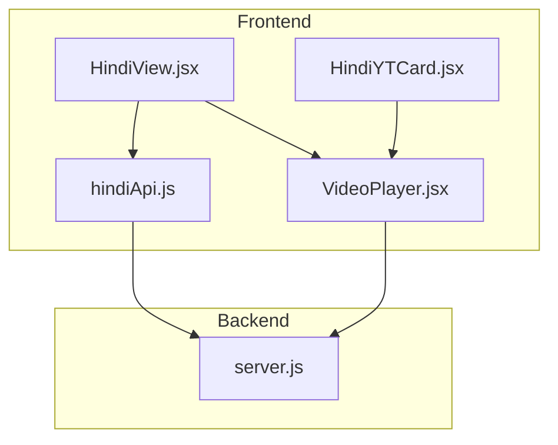
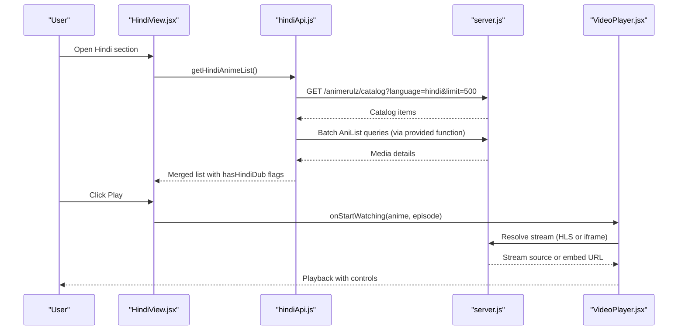
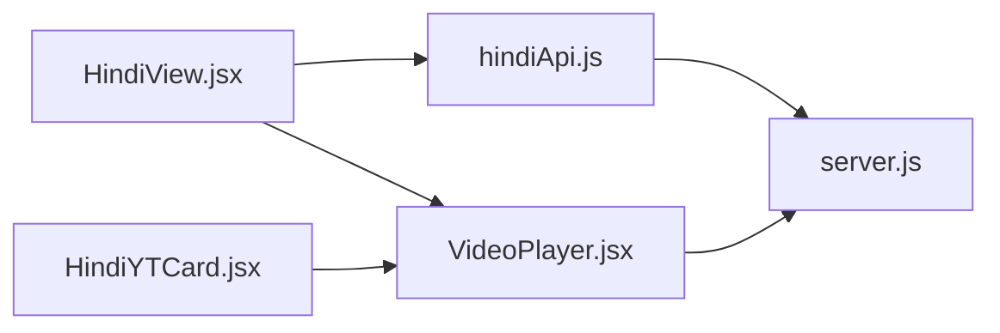

# Hindi Dubbed Content

<cite>
**Referenced Files in This Document**
- [hindiApi.js](file://src/features/anime/hindi/api/hindiApi.js)
- [HindiView.jsx](file://src/features/anime/hindi/components/HindiView.jsx)
- [HindiYTCard.jsx](file://src/features/anime/hindi/components/HindiYTCard.jsx)
- [VideoPlayer.jsx](file://src/components/VideoPlayer.jsx)
- [server.js](file://server.js)
- [mockData.js](file://src/mockData.js)
</cite>

## Table of Contents
1. [Introduction](#introduction)
2. [Project Structure](#project-structure)
3. [Core Components](#core-components)
4. [Architecture Overview](#architecture-overview)
5. [Detailed Component Analysis](#detailed-component-analysis)
6. [Dependency Analysis](#dependency-analysis)
7. [Performance Considerations](#performance-considerations)
8. [Troubleshooting Guide](#troubleshooting-guide)
9. [Conclusion](#conclusion)

## Introduction
This document explains the Hindi dubbed anime section, focusing on how the frontend surfaces and plays Hindi-dubbed content sourced via a backend that integrates with external streaming providers. It covers:
- The Hindi-specific API layer for catalog retrieval and availability checks
- The HindiView component for browsing and filtering Hindi dubbed series
- The HindiYTCard component for displaying cards with Hindi audio indicators
- Playback handling through a unified VideoPlayer that supports HLS streams and embedded players
- Backend integration for resolving streams and metadata
- Error handling, caching strategies, and performance considerations

Note: While the feature is branded as “YouTube-based,” the current implementation resolves streams via a backend provider pipeline rather than direct YouTube playlist APIs. The UI patterns (cards, playlists, history) are styled to resemble a YouTube-like experience.

## Project Structure
The Hindi dubbed section is organized under the anime feature with dedicated API and components:
- API: hindiApi.js provides functions to check availability and fetch a Hindi catalog
- Components: HindiView.jsx renders the page with filters and sorting; HindiYTCard.jsx renders individual cards
- Playback: VideoPlayer.jsx handles HLS playback, quality/audio track selection, and embedded player fallbacks
- Backend: server.js implements endpoints to resolve streams and metadata from provider services
- Utilities: mockData.js includes helper logic for proxying HLS URLs and formatting view counts

**Diagram sources**
- [HindiView.jsx:1-130](file://src/features/anime/hindi/components/HindiView.jsx#L1-L130)
- [HindiYTCard.jsx:1-74](file://src/features/anime/hindi/components/HindiYTCard.jsx#L1-L74)
- [hindiApi.js:1-132](file://src/features/anime/hindi/api/hindiApi.js#L1-L132)
- [VideoPlayer.jsx:1-1043](file://src/components/VideoPlayer.jsx#L1-L1043)
- [server.js:746-967](file://server.js#L746-L967)

**Section sources**
- [HindiView.jsx:1-130](file://src/features/anime/hindi/components/HindiView.jsx#L1-L130)
- [HindiYTCard.jsx:1-74](file://src/features/anime/hindi/components/HindiYTCard.jsx#L1-L74)
- [hindiApi.js:1-132](file://src/features/anime/hindi/api/hindiApi.js#L1-L132)
- [VideoPlayer.jsx:1-1043](file://src/components/VideoPlayer.jsx#L1-L1043)
- [server.js:746-967](file://server.js#L746-L967)

## Core Components
- Hindi API (hindiApi.js):
  - Availability check per anime using AniList ID
  - Catalog fetcher that batches requests and merges with AniList data
  - In-memory cache for availability results with TTL
- HindiView (HindiView.jsx):
  - Genre filter chips and sort controls
  - Featured banner and grid rendering
  - Delegates playback via onStartWatching
- HindiYTCard (HindiYTCard.jsx):
  - Displays thumbnail, episode count badge, Hindi audio badge, rating, and popularity
  - Hover overlay play button triggers playback
- VideoPlayer (VideoPlayer.jsx):
  - HLS playback with quality and audio track selection
  - Embedded player fallback via iframeSrc
  - Controls, progress, skip intro/end markers, PiP, fullscreen

**Section sources**
- [hindiApi.js:1-132](file://src/features/anime/hindi/api/hindiApi.js#L1-L132)
- [HindiView.jsx:1-130](file://src/features/anime/hindi/components/HindiView.jsx#L1-L130)
- [HindiYTCard.jsx:1-74](file://src/features/anime/hindi/components/HindiYTCard.jsx#L1-L74)
- [VideoPlayer.jsx:1-1043](file://src/components/VideoPlayer.jsx#L1-L1043)

## Architecture Overview
The Hindi dubbed flow combines frontend browsing with backend stream resolution:

**Diagram sources**
- [hindiApi.js:47-131](file://src/features/anime/hindi/api/hindiApi.js#L47-L131)
- [server.js:746-967](file://server.js#L746-L967)
- [VideoPlayer.jsx:148-282](file://src/components/VideoPlayer.jsx#L148-L282)
- [VideoPlayer.jsx:671-693](file://src/components/VideoPlayer.jsx#L671-L693)

## Detailed Component Analysis

### Hindi API Layer
Responsibilities:
- Check if an anime has Hindi dub available by querying a backend endpoint
- Fetch a large Hindi catalog, batch AniList queries, merge metadata, and return sorted results
- Cache availability checks to reduce network calls

Key behaviors:
- Uses an in-memory Map to cache availability results with a 30-minute TTL
- Batches IDs into chunks and processes them concurrently with limited concurrency
- Falls back to popular AniList catalog when no items are returned

Error handling:
- Logs warnings on failures and returns empty arrays to keep UI responsive

**Section sources**
- [hindiApi.js:5-33](file://src/features/anime/hindi/api/hindiApi.js#L5-L33)
- [hindiApi.js:47-131](file://src/features/anime/hindi/api/hindiApi.js#L47-L131)

### HindiView Component
Responsibilities:
- Render a featured banner for the top pick
- Provide genre filter chips and sort dropdown (popular/rating)
- Display a grid of HindiYTCard components

User interactions:
- Filter by genre
- Sort by popularity or rating
- Start watching from banner or card

State management:
- Local state for activeFilter and sortBy
- Loading skeleton while fetching

**Section sources**
- [HindiView.jsx:5-44](file://src/features/anime/hindi/components/HindiView.jsx#L5-L44)
- [HindiView.jsx:46-129](file://src/features/anime/hindi/components/HindiView.jsx#L46-L129)

### HindiYTCard Component
Responsibilities:
- Show thumbnail with fallback placeholder
- Display episode count badge and Hindi audio badge
- Show rating and formatted popularity views
- Provide hover overlay play button

Image handling:
- Tracks load and error states to show fallback when images fail

**Section sources**
- [HindiYTCard.jsx:5-74](file://src/features/anime/hindi/components/HindiYTCard.jsx#L5-L74)

### Video Player and Playback Handling
Responsibilities:
- Initialize HLS playback with retry and recovery logic
- Detect and auto-select preferred audio tracks (including Hindi)
- Provide quality selection menu and audio track switching
- Support embedded player fallback via iframeSrc
- Implement timeline scrubbing, preview thumbnails, and skip intro/end markers

Playback modes:
- HLS: Uses HLS.js with robust error recovery and level detection
- Native HLS: For iOS Safari where supported
- Direct MP4: Non-HLS streams
- Iframe: External embeds (e.g., third-party players)

Quality and audio:
- Auto mode by default; user can select specific levels
- Audio track selection prioritizes Hindi when available

Error handling:
- Network and media errors trigger retries; fatal errors display messages
- No playable source shows an error state

**Section sources**
- [VideoPlayer.jsx:148-282](file://src/components/VideoPlayer.jsx#L148-L282)
- [VideoPlayer.jsx:506-527](file://src/components/VideoPlayer.jsx#L506-L527)
- [VideoPlayer.jsx:671-693](file://src/components/VideoPlayer.jsx#L671-L693)
- [VideoPlayer.jsx:813-1043](file://src/components/VideoPlayer.jsx#L813-L1043)

### Backend Integration and Metadata Resolution
Responsibilities:
- Serve endpoints for AnimeRulz catalog and availability
- Resolve streams for episodes with language preference
- Normalize catalog data and cache responses
- Proxy HLS URLs to enforce referer policies

Stream resolution strategy:
- Check availability via catalog lookup
- Use provider endpoints to extract language-specific HLS URLs
- Return structured sources with language labels and audio mode flags

Caching:
- In-memory caches for catalog, detail, episodes, and stream resolution with TTL

Headers:
- Provider APIs require browser-like headers to avoid 403 errors

**Section sources**
- [server.js:746-967](file://server.js#L746-L967)

### YouTube Playlist Integration and Metadata Extraction
Current state:
- The frontend does not directly call YouTube APIs or parse YouTube playlists
- The UI includes playlist-style components (save to playlist, watch later, history) but these manage local collections
- Playback uses HLS streams resolved via backend or embedded players

If YouTube integration is desired:
- Add a service to fetch playlist metadata (titles, thumbnails, durations)
- Map YouTube video IDs to internal media records
- Use the existing VideoPlayer’s iframe mode to embed YouTube videos when appropriate

[No sources needed since this section describes conceptual extension beyond current code]

## Dependency Analysis

- hindiApi.js depends on server.js endpoints for catalog and availability
- HindiView.jsx depends on hindiApi.js for data and VideoPlayer.jsx for playback
- HindiYTCard.jsx delegates playback to VideoPlayer.jsx via callbacks
- VideoPlayer.jsx depends on server.js for stream resolution and may use embedded players

**Diagram sources**
- [hindiApi.js:1-132](file://src/features/anime/hindi/api/hindiApi.js#L1-L132)
- [HindiView.jsx:1-130](file://src/features/anime/hindi/components/HindiView.jsx#L1-L130)
- [HindiYTCard.jsx:1-74](file://src/features/anime/hindi/components/HindiYTCard.jsx#L1-L74)
- [VideoPlayer.jsx:1-1043](file://src/components/VideoPlayer.jsx#L1-L1043)
- [server.js:746-967](file://server.js#L746-L967)

**Section sources**
- [hindiApi.js:1-132](file://src/features/anime/hindi/api/hindiApi.js#L1-L132)
- [HindiView.jsx:1-130](file://src/features/anime/hindi/components/HindiView.jsx#L1-L130)
- [HindiYTCard.jsx:1-74](file://src/features/anime/hindi/components/HindiYTCard.jsx#L1-L74)
- [VideoPlayer.jsx:1-1043](file://src/components/VideoPlayer.jsx#L1-L1043)
- [server.js:746-967](file://server.js#L746-L967)

## Performance Considerations
- Catalog batching: hindiApi.js splits IDs into chunks and processes multiple batches concurrently with small delays to avoid overwhelming the backend
- Caching:
  - Frontend in-memory cache for availability checks with 30-minute TTL
  - Backend caches for catalog, detail, episodes, and stream resolution with TTL
- Image loading: HindiYTCard handles image load and error states to prevent layout shifts and provide fallbacks
- HLS playback:
  - Retry logic for manifest and fragment loading
  - Auto audio track selection reduces manual steps
  - Quality menu allows users to balance bandwidth and quality
- Embedded players:
  - When using iframeSrc, consider sandbox attributes and referrer policies to minimize overhead and improve security

[No sources needed since this section provides general guidance derived from analyzed files]

## Troubleshooting Guide
Common issues and resolutions:
- No Hindi dubbed content found:
  - Verify backend catalog endpoint returns items
  - Check availability cache and clear if stale
  - Confirm AniList query function is correctly passed to hindiApi.js
- Streams unavailable:
  - Check backend logs for provider errors
  - Ensure required headers are set for provider APIs
  - Validate HLS URLs via proxy endpoint when necessary
- Playback errors:
  - HLS fatal errors: inspect network and CORS settings
  - No playable source: ensure stream resolution returns valid sources
  - Embedded player issues: verify iframeSrc and sandbox configuration
- Thumbnail failures:
  - HindiYTCard falls back to text placeholder; ensure upstream image URLs are valid

**Section sources**
- [hindiApi.js:19-33](file://src/features/anime/hindi/api/hindiApi.js#L19-L33)
- [VideoPlayer.jsx:244-261](file://src/components/VideoPlayer.jsx#L244-L261)
- [VideoPlayer.jsx:671-693](file://src/components/VideoPlayer.jsx#L671-L693)
- [server.js:746-967](file://server.js#L746-L967)

## Conclusion
The Hindi dubbed anime section provides a cohesive browsing and playback experience:
- HindiView and HindiYTCard deliver a clean interface with genre filters and Hindi audio indicators
- hindiApi.js efficiently retrieves and merges catalog data with AniList metadata
- VideoPlayer supports robust HLS playback, quality/audio selection, and embedded player fallbacks
- Backend integration ensures reliable stream resolution and metadata access with caching and proper headers

For future enhancements:
- Introduce direct YouTube playlist integration to enrich metadata and enable YouTube-based playback
- Expand caching strategies to include thumbnails and popular content
- Improve error messaging and recovery flows for edge cases

[No sources needed since this section summarizes without analyzing specific files]