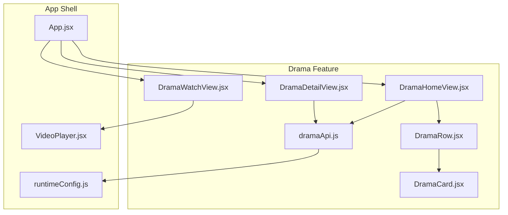
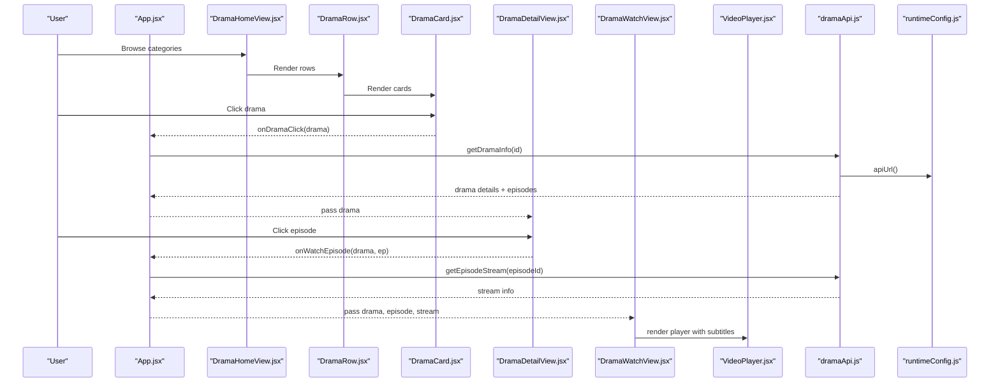
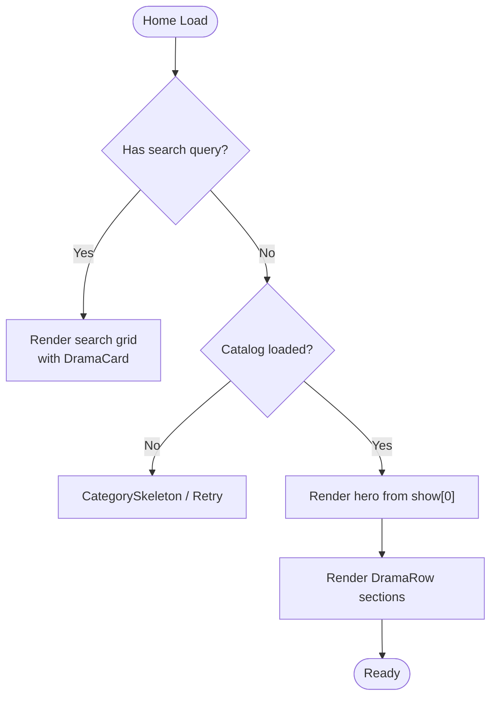
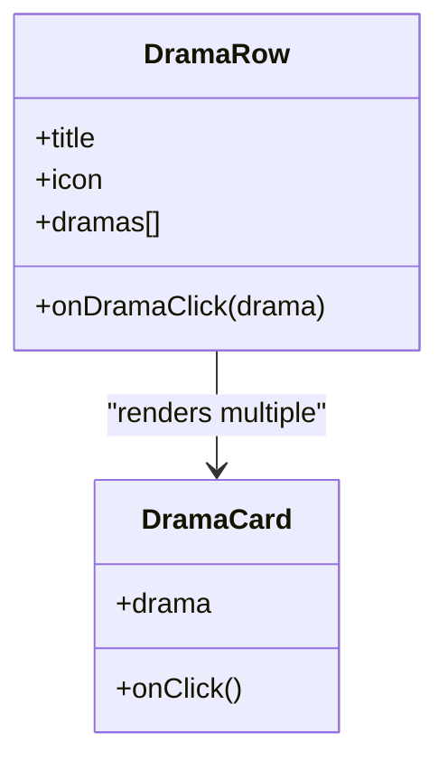
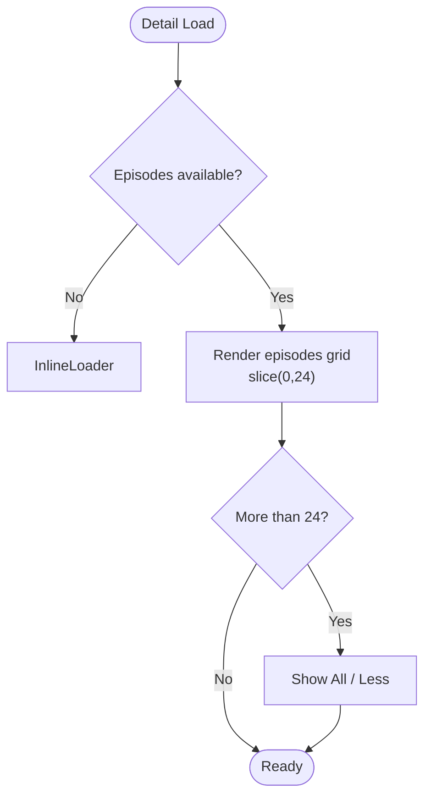
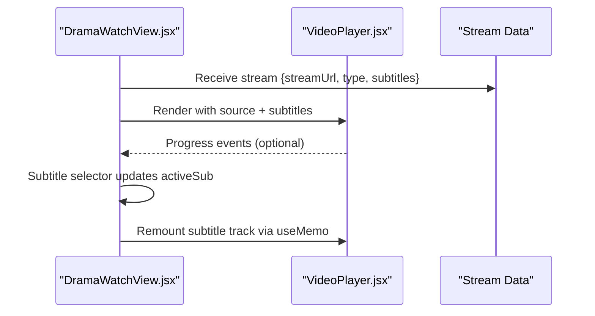
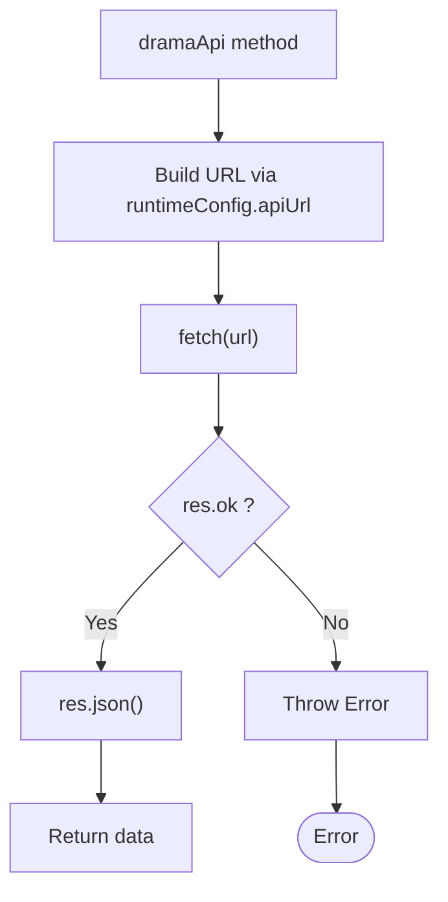
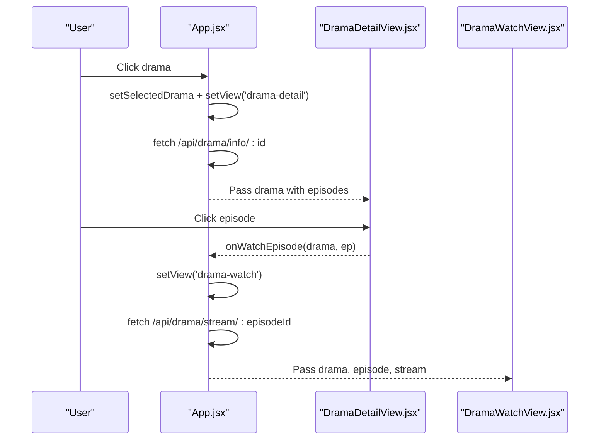
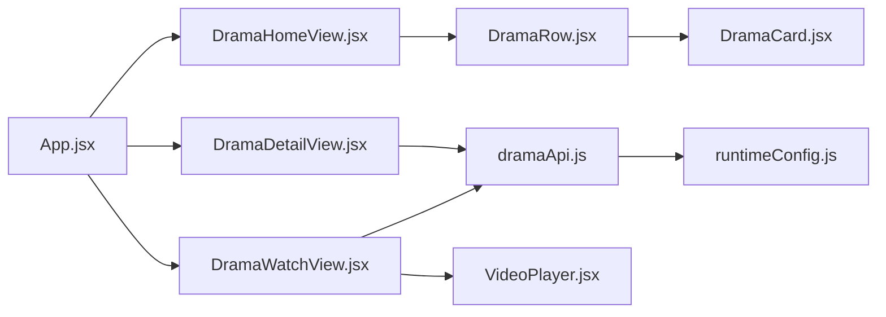

# Drama Feature Module

<cite>
**Referenced Files in This Document**
- [App.jsx](file://src/App.jsx)
- [dramaApi.js](file://src/features/drama/api/dramaApi.js)
- [DramaHomeView.jsx](file://src/features/drama/components/DramaHomeView.jsx)
- [DramaRow.jsx](file://src/features/drama/components/DramaRow.jsx)
- [DramaCard.jsx](file://src/features/drama/components/DramaCard.jsx)
- [DramaDetailView.jsx](file://src/features/drama/components/DramaDetailView.jsx)
- [DramaWatchView.jsx](file://src/features/drama/components/DramaWatchView.jsx)
- [VideoPlayer.jsx](file://src/components/VideoPlayer.jsx)
- [runtimeConfig.js](file://src/runtimeConfig.js)
</cite>

## Table of Contents
1. [Introduction](#introduction)
2. [Project Structure](#project-structure)
3. [Core Components](#core-components)
4. [Architecture Overview](#architecture-overview)
5. [Detailed Component Analysis](#detailed-component-analysis)
6. [Dependency Analysis](#dependency-analysis)
7. [Performance Considerations](#performance-considerations)
8. [Troubleshooting Guide](#troubleshooting-guide)
9. [Conclusion](#conclusion)

## Introduction
This document explains the Drama feature module that provides international drama series support (including Korean and Chinese content), a home view with featured and categorized rows, detailed series information, episode browsing, and an immersive watch view with subtitle selection and episode navigation. It also covers the reusable card and row components used to present dramas consistently across the app.

## Project Structure
The Drama feature is organized under src/features/drama with:
- API layer for fetching catalog, detail, stream, and search endpoints
- UI components for Home, Detail, Watch, Card, and Row
- Integration into the main App for routing, state management, and playback

**Diagram sources**
- [DramaHomeView.jsx:1-131](file://src/features/drama/components/DramaHomeView.jsx#L1-L131)
- [DramaRow.jsx:1-23](file://src/features/drama/components/DramaRow.jsx#L1-L23)
- [DramaCard.jsx:1-41](file://src/features/drama/components/DramaCard.jsx#L1-L41)
- [DramaDetailView.jsx:1-74](file://src/features/drama/components/DramaDetailView.jsx#L1-L74)
- [DramaWatchView.jsx:1-103](file://src/features/drama/components/DramaWatchView.jsx#L1-L103)
- [dramaApi.js:1-33](file://src/features/drama/api/dramaApi.js#L1-L33)
- [App.jsx:1835-1902](file://src/App.jsx#L1835-L1902)
- [VideoPlayer.jsx:1-800](file://src/components/VideoPlayer.jsx#L1-L800)
- [runtimeConfig.js:1-163](file://src/runtimeConfig.js#L1-L163)

**Section sources**
- [App.jsx:1835-1902](file://src/App.jsx#L1835-L1902)
- [dramaApi.js:1-33](file://src/features/drama/api/dramaApi.js#L1-L33)
- [DramaHomeView.jsx:1-131](file://src/features/drama/components/DramaHomeView.jsx#L1-L131)
- [DramaDetailView.jsx:1-74](file://src/features/drama/components/DramaDetailView.jsx#L1-L74)
- [DramaWatchView.jsx:1-103](file://src/features/drama/components/DramaWatchView.jsx#L1-L103)

## Core Components
- DramaHomeView: Displays a cinematic hero, search results, and categorized rows (Featured, Korean, Chinese, Top Rated, Recently Updated). Uses DramaRow and DramaCard.
- DramaRow: Renders a section header and a horizontal slider of DramaCard items.
- DramaCard: Presents a drama tile with thumbnail, title, country/status, episode count badge, and hover play overlay.
- DramaDetailView: Shows hero banner, synopsis, and an episodes grid with “Show All” pagination for large series.
- DramaWatchView: Embeds VideoPlayer, subtitle selector, and an episode list for quick navigation.
- dramaApi: Provides fetch wrappers for /drama/home, /drama/info/:id, /drama/stream/:episodeId, and /drama/search?q=...
- App integration: Routes, state, and data fetching for drama views; handles search, streaming, and URL sync.

**Section sources**
- [DramaHomeView.jsx:1-131](file://src/features/drama/components/DramaHomeView.jsx#L1-L131)
- [DramaRow.jsx:1-23](file://src/features/drama/components/DramaRow.jsx#L1-L23)
- [DramaCard.jsx:1-41](file://src/features/drama/components/DramaCard.jsx#L1-L41)
- [DramaDetailView.jsx:1-74](file://src/features/drama/components/DramaDetailView.jsx#L1-L74)
- [DramaWatchView.jsx:1-103](file://src/features/drama/components/DramaWatchView.jsx#L1-L103)
- [dramaApi.js:1-33](file://src/features/drama/api/dramaApi.js#L1-L33)
- [App.jsx:1835-1902](file://src/App.jsx#L1835-L1902)

## Architecture Overview
The Drama feature follows a unidirectional data flow:
- App manages routes and state for selected drama and episode
- Views request data via dramaApi or direct fetch calls using runtimeConfig
- Detail and Watch views render media metadata and player
- VideoPlayer handles HLS/MP4 playback, subtitles, quality, and progress reporting

**Diagram sources**
- [App.jsx:1835-1902](file://src/App.jsx#L1835-L1902)
- [DramaHomeView.jsx:1-131](file://src/features/drama/components/DramaHomeView.jsx#L1-L131)
- [DramaRow.jsx:1-23](file://src/features/drama/components/DramaRow.jsx#L1-L23)
- [DramaCard.jsx:1-41](file://src/features/drama/components/DramaCard.jsx#L1-L41)
- [DramaDetailView.jsx:1-74](file://src/features/drama/components/DramaDetailView.jsx#L1-L74)
- [DramaWatchView.jsx:1-103](file://src/features/drama/components/DramaWatchView.jsx#L1-L103)
- [dramaApi.js:1-33](file://src/features/drama/api/dramaApi.js#L1-L33)
- [runtimeConfig.js:1-163](file://src/runtimeConfig.js#L1-L163)

## Detailed Component Analysis

### Drama Home View
- Hero banner shows the first item from the catalog’s “show” array
- Search mode renders a grid of DramaCard results when query is provided
- Rows include Featured, Most Popular Korean, Most Popular Chinese, Top Rated, Recently Updated
- Error/loading states are handled with skeletons and retry actions

**Diagram sources**
- [DramaHomeView.jsx:1-131](file://src/features/drama/components/DramaHomeView.jsx#L1-L131)

**Section sources**
- [DramaHomeView.jsx:1-131](file://src/features/drama/components/DramaHomeView.jsx#L1-L131)

### Drama Row and Card
- DramaRow displays a titled section and maps dramas to DramaCard
- DramaCard supports lazy image loading, error fallback placeholder, episode count badge, and hover play indicator

**Diagram sources**
- [DramaRow.jsx:1-23](file://src/features/drama/components/DramaRow.jsx#L1-L23)
- [DramaCard.jsx:1-41](file://src/features/drama/components/DramaCard.jsx#L1-L41)

**Section sources**
- [DramaRow.jsx:1-23](file://src/features/drama/components/DramaRow.jsx#L1-L23)
- [DramaCard.jsx:1-41](file://src/features/drama/components/DramaCard.jsx#L1-L41)

### Drama Detail View
- Hero area includes back button, title, release year/country/status, and a Play Episode 1 action
- Synopsis section if description exists
- Episodes grid with “Show All” toggle for long series (initially shows up to 24 episodes)

**Diagram sources**
- [DramaDetailView.jsx:1-74](file://src/features/drama/components/DramaDetailView.jsx#L1-L74)

**Section sources**
- [DramaDetailView.jsx:1-74](file://src/features/drama/components/DramaDetailView.jsx#L1-L74)

### Drama Watch View
- Header shows back navigation and current episode number
- Player uses VideoPlayer with source URL, HLS flag, poster, and subtitles
- Subtitle selector allows toggling off or choosing a track; auto-selects default English when available
- Episode list shows up to 50 episodes with active highlighting and SUB badges

**Diagram sources**
- [DramaWatchView.jsx:1-103](file://src/features/drama/components/DramaWatchView.jsx#L1-L103)
- [VideoPlayer.jsx:1-800](file://src/components/VideoPlayer.jsx#L1-L800)

**Section sources**
- [DramaWatchView.jsx:1-103](file://src/features/drama/components/DramaWatchView.jsx#L1-L103)
- [VideoPlayer.jsx:1-800](file://src/components/VideoPlayer.jsx#L1-L800)

### API Layer and Runtime Configuration
- dramaApi exposes methods for home catalog, drama info, episode stream, and search
- All endpoints are prefixed with /api and resolved through runtimeConfig.apiUrl
- Errors throw descriptive messages for non-ok responses

**Diagram sources**
- [dramaApi.js:1-33](file://src/features/drama/api/dramaApi.js#L1-L33)
- [runtimeConfig.js:1-163](file://src/runtimeConfig.js#L1-L163)

**Section sources**
- [dramaApi.js:1-33](file://src/features/drama/api/dramaApi.js#L1-L33)
- [runtimeConfig.js:1-163](file://src/runtimeConfig.js#L1-L163)

### App Integration and Routing
- handleDramaClick navigates to drama-detail and fetches drama info
- startWatchingDrama navigates to drama-watch and fetches stream data
- handleDramaSearch queries /api/drama/search and normalizes response formats
- URL routing persists drama and episode state for deep links and history

**Diagram sources**
- [App.jsx:1835-1902](file://src/App.jsx#L1835-L1902)
- [DramaDetailView.jsx:1-74](file://src/features/drama/components/DramaDetailView.jsx#L1-L74)
- [DramaWatchView.jsx:1-103](file://src/features/drama/components/DramaWatchView.jsx#L1-L103)

**Section sources**
- [App.jsx:1835-1902](file://src/App.jsx#L1835-L1902)

## Dependency Analysis
- App.jsx orchestrates drama flows: routing, state, and data fetching
- DramaHomeView depends on DramaRow and DramaCard for consistent presentation
- DramaDetailView and DramaWatchView depend on dramaApi and runtimeConfig for data and URLs
- DramaWatchView composes VideoPlayer for playback and subtitle rendering
- dramaApi centralizes endpoint construction and error handling

**Diagram sources**
- [App.jsx:1835-1902](file://src/App.jsx#L1835-L1902)
- [DramaHomeView.jsx:1-131](file://src/features/drama/components/DramaHomeView.jsx#L1-L131)
- [DramaRow.jsx:1-23](file://src/features/drama/components/DramaRow.jsx#L1-L23)
- [DramaCard.jsx:1-41](file://src/features/drama/components/DramaCard.jsx#L1-L41)
- [DramaDetailView.jsx:1-74](file://src/features/drama/components/DramaDetailView.jsx#L1-L74)
- [DramaWatchView.jsx:1-103](file://src/features/drama/components/DramaWatchView.jsx#L1-L103)
- [dramaApi.js:1-33](file://src/features/drama/api/dramaApi.js#L1-L33)
- [runtimeConfig.js:1-163](file://src/runtimeConfig.js#L1-L163)
- [VideoPlayer.jsx:1-800](file://src/components/VideoPlayer.jsx#L1-L800)

**Section sources**
- [App.jsx:1835-1902](file://src/App.jsx#L1835-L1902)
- [dramaApi.js:1-33](file://src/features/drama/api/dramaApi.js#L1-L33)

## Performance Considerations
- Lazy image loading and error fallback in DramaCard reduce initial payload and improve perceived performance
- DramaDetailView paginates episodes by showing only the first 24 entries and offers a “Show All” toggle to avoid heavy DOM for very long series
- DramaWatchView limits the episode list to 50 items for smoother scrolling and interaction
- VideoPlayer uses HLS.js with buffering controls, quality detection, and recovery strategies to maintain smooth playback
- Runtime configuration resolves API base dynamically to avoid stale URLs and ensure correct backend routing

[No sources needed since this section provides general guidance]

## Troubleshooting Guide
- Catalog load failure: DramaHomeView shows an error message and a Retry button; verify backend availability and network connectivity
- Stream load failure: DramaWatchView displays an error message; check episode ID and backend stream endpoint
- Subtitles not appearing: Ensure stream returns subtitles array; DramaWatchView auto-selects default English if available
- Search returns empty: Confirm query parameter encoding and backend response shape; App normalizes both array and object-with-value formats

**Section sources**
- [DramaHomeView.jsx:1-131](file://src/features/drama/components/DramaHomeView.jsx#L1-L131)
- [DramaWatchView.jsx:1-103](file://src/features/drama/components/DramaWatchView.jsx#L1-L103)
- [App.jsx:1889-1902](file://src/App.jsx#L1889-L1902)

## Conclusion
The Drama feature module delivers a robust, user-friendly experience for browsing and watching international drama series. It organizes content through a home view with curated rows, presents detailed series information with manageable episode lists, and provides an immersive watch view with subtitle control and episode navigation. The modular design, clear API layer, and performance-conscious UI patterns make it scalable for large drama collections and easy to extend with additional languages and categories.