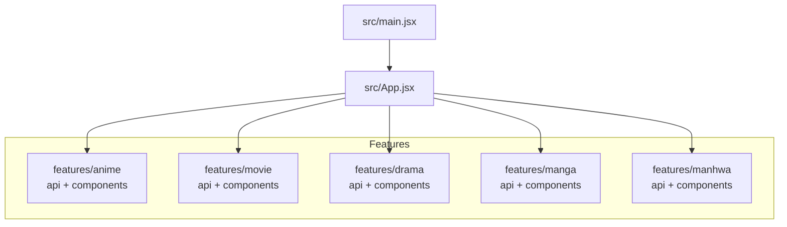
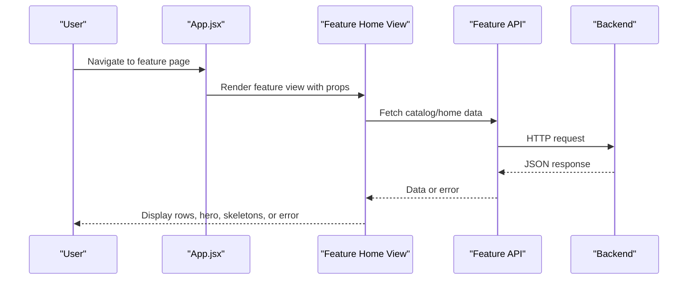
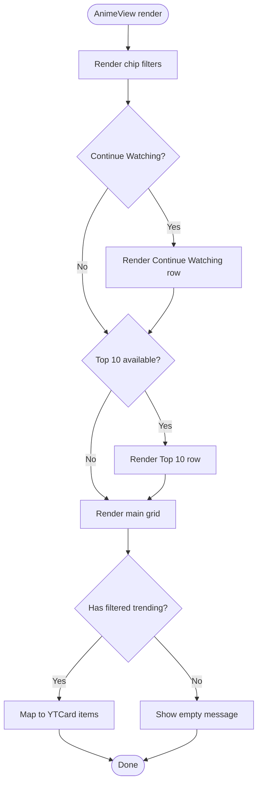
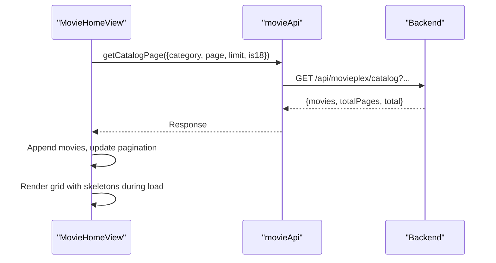
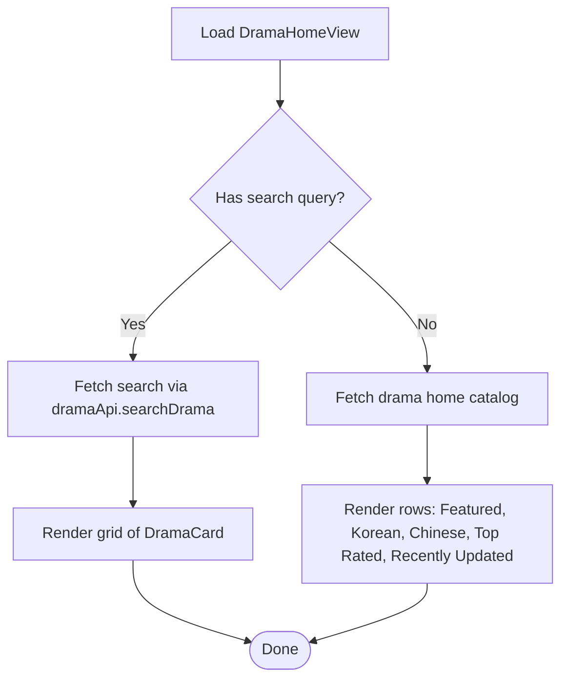
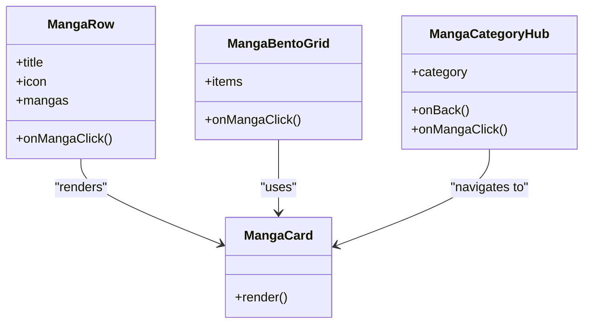
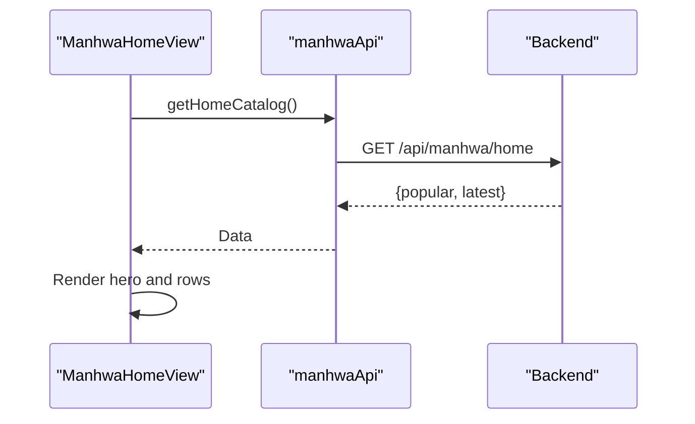
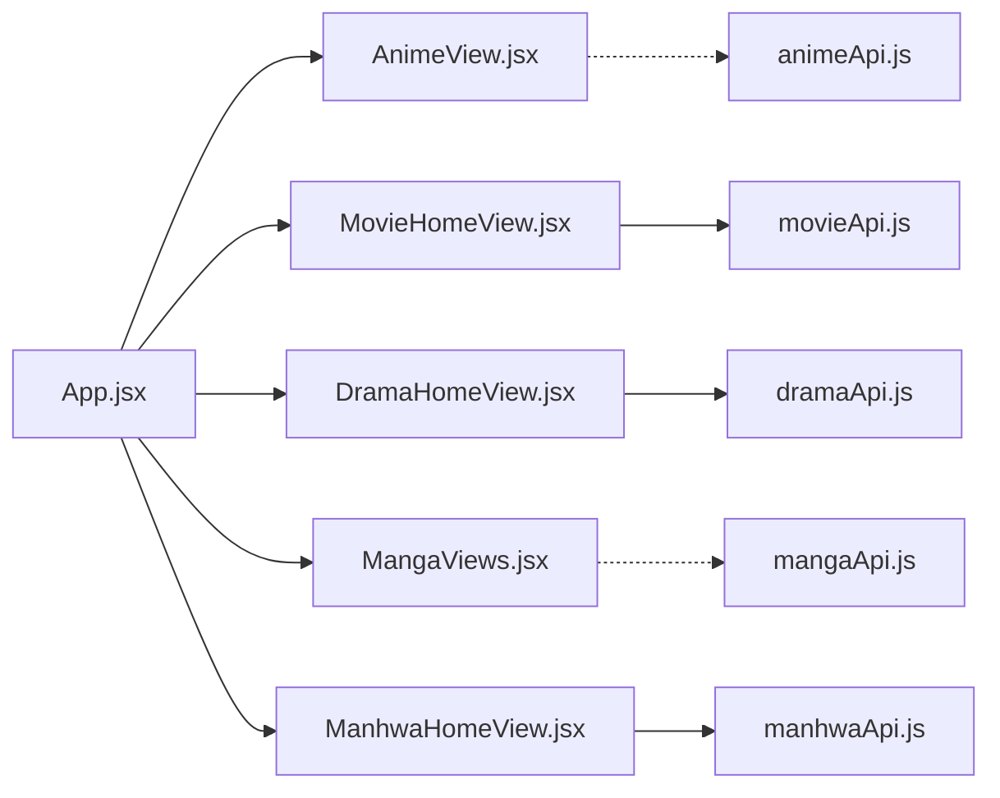

# Feature Modules

<cite>
**Referenced Files in This Document**
- [main.jsx](file://src/main.jsx)
- [App.jsx](file://src/App.jsx)
- [package.json](file://package.json)
- [animeApi.js](file://src/features/anime/api/animeApi.js)
- [AnimeView.jsx](file://src/features/anime/components/AnimeView.jsx)
- [movieApi.js](file://src/features/movie/api/movieApi.js)
- [MovieHomeView.jsx](file://src/features/movie/components/MovieHomeView.jsx)
- [dramaApi.js](file://src/features/drama/api/dramaApi.js)
- [DramaHomeView.jsx](file://src/features/drama/components/DramaHomeView.jsx)
- [mangaApi.js](file://src/features/manga/api/mangaApi.js)
- [MangaViews.jsx](file://src/features/manga/components/MangaViews.jsx)
- [manhwaApi.js](file://src/features/manhwa/api/manhwaApi.js)
- [ManhwaHomeView.jsx](file://src/features/manhwa/components/ManhwaHomeView.jsx)
</cite>

## Table of Contents
1. Introduction
2. Project Structure
3. Core Components
4. Architecture Overview
5. Detailed Component Analysis
6. Dependency Analysis
7. Performance Considerations
8. Troubleshooting Guide
9. Conclusion

## Introduction
This document explains Project Anime’s feature-based modular architecture. Each content type (anime, movies, dramas, manga, manhwa) is organized into self-contained modules with dedicated API layers and UI components. The application composes these features from a central App shell that manages routing, global state, and cross-feature interactions such as watch history, playlists, and subscriptions. Common patterns include consistent data fetching via feature-scoped APIs, uniform error handling, and reusable UI composition for lists, detail pages, and media consumption views.

## Project Structure
The project uses a feature-first layout under src/features, where each content type has its own api and components directories. A central App orchestrates navigation and shared concerns (history, auth sync, session restore). The entry point loads runtime configuration and mounts the App.

**Diagram sources**
- [main.jsx:1-15](file://src/main.jsx#L1-L15)
- [App.jsx:1-50](file://src/App.jsx#L1-L50)

**Section sources**
- [main.jsx:1-15](file://src/main.jsx#L1-L15)
- [App.jsx:1-50](file://src/App.jsx#L1-L50)
- [package.json:1-45](file://package.json#L1-L45)

## Core Components
- Feature API modules: Each feature exposes a small, focused API object that encapsulates backend calls and returns normalized results or throws errors. Examples include animeApi, movieApi, dramaApi, mangaApi, and manhwaApi.
- Feature UI views: Each feature provides home/detail/watch/read views composed from feature-specific cards and rows. For example, MovieHomeView, DramaHomeView, ManhwaHomeView, and MangaViews provide category browsing, hero banners, and grid/list layouts.
- App shell: Centralizes routing, view state, search, and cross-cutting features like watch history, playlists, and notifications. It imports feature views and wires them to navigation handlers.

Key responsibilities:
- Data fetching: Feature APIs handle HTTP requests and error propagation.
- UI composition: Views assemble cards, rows, skeletons, and empty/error states.
- Navigation: App maps URL paths to feature views and passes selected items down.

**Section sources**
- [animeApi.js:1-20](file://src/features/anime/api/animeApi.js#L1-L20)
- [movieApi.js:1-32](file://src/features/movie/api/movieApi.js#L1-L32)
- [dramaApi.js:1-33](file://src/features/drama/api/dramaApi.js#L1-L33)
- [mangaApi.js:1-29](file://src/features/manga/api/mangaApi.js#L1-L29)
- [manhwaApi.js:1-29](file://src/features/manhwa/api/manhwaApi.js#L1-L29)
- [AnimeView.jsx:1-151](file://src/features/anime/components/AnimeView.jsx#L1-L151)
- [MovieHomeView.jsx:1-608](file://src/features/movie/components/MovieHomeView.jsx#L1-L608)
- [DramaHomeView.jsx:1-131](file://src/features/drama/components/DramaHomeView.jsx#L1-L131)
- [MangaViews.jsx:1-200](file://src/features/manga/components/MangaViews.jsx#L1-L200)
- [ManhwaHomeView.jsx:1-65](file://src/features/manhwa/components/ManhwaHomeView.jsx#L1-L65)

## Architecture Overview
The system follows a feature-sliced architecture:
- Feature modules isolate domain logic, data access, and UI.
- App acts as an orchestrator, managing global state and routing while delegating feature-specific rendering to feature views.
- Shared utilities (e.g., runtime config, storage, device detection) are imported by both App and features as needed.

**Diagram sources**
- [App.jsx:500-590](file://src/App.jsx#L500-L590)
- [MovieHomeView.jsx:178-229](file://src/features/movie/components/MovieHomeView.jsx#L178-L229)
- [movieApi.js:5-29](file://src/features/movie/api/movieApi.js#L5-L29)

## Detailed Component Analysis

### Anime Module
- API layer: Wraps shared mockData functions and adds Hindi dub support via a separate API module. Exposes methods for details, episodes, franchises, TV shows, movies, new/popular, search, genres, episode pagination, and Hindi list retrieval.
- UI layer: AnimeView composes a chip filter bar, continue watching row, top 10 section, and main trending grid with skeleton loading and empty states. It integrates with App-provided callbacks for navigation and history.

Patterns:
- Data fetching via centralized API wrapper.
- UI composition using shared card and row primitives.
- Loading and empty states for better UX.

**Diagram sources**
- [AnimeView.jsx:18-147](file://src/features/anime/components/AnimeView.jsx#L18-L147)

**Section sources**
- [animeApi.js:1-20](file://src/features/anime/api/animeApi.js#L1-L20)
- [AnimeView.jsx:1-151](file://src/features/anime/components/AnimeView.jsx#L1-L151)

### Movies Module
- API layer: Provides endpoints for home catalog, paginated category catalog, movie info, and search. Uses runtime-configured base URL and standard fetch with error throwing on non-ok responses.
- UI layer: MovieHomeView includes a hero carousel, category pills, horizontal rows, and a paginated category grid with “load more.” It also supports admin-driven “Random Picks” persisted to Supabase with realtime updates.

Patterns:
- Paginated catalog loading with incremental append.
- Hero auto-rotation and category filtering.
- Admin-only dev mode for curating homepage picks.

**Diagram sources**
- [movieApi.js:5-29](file://src/features/movie/api/movieApi.js#L5-L29)
- [MovieHomeView.jsx:178-229](file://src/features/movie/components/MovieHomeView.jsx#L178-L229)

**Section sources**
- [movieApi.js:1-32](file://src/features/movie/api/movieApi.js#L1-L32)
- [MovieHomeView.jsx:1-608](file://src/features/movie/components/MovieHomeView.jsx#L1-L608)

### Dramas Module
- API layer: Offers home catalog, drama info, episode stream, and search. All endpoints use runtime-configured base URL and throw descriptive errors on failures.
- UI layer: DramaHomeView renders a cinematic hero, search results, and multiple categorized rows (featured, Korean, Chinese, top rated, recently updated). Includes skeletons and retry behavior.

Patterns:
- Consistent error handling with user-friendly fallbacks.
- Row-based browsing with icons and titles.
- Search overlay with loading indicators.

**Diagram sources**
- [dramaApi.js:5-30](file://src/features/drama/api/dramaApi.js#L5-L30)
- [DramaHomeView.jsx:21-125](file://src/features/drama/components/DramaHomeView.jsx#L21-L125)

**Section sources**
- [dramaApi.js:1-33](file://src/features/drama/api/dramaApi.js#L1-L33)
- [DramaHomeView.jsx:1-131](file://src/features/drama/components/DramaHomeView.jsx#L1-L131)

### Manga Module
- API layer: Provides home catalog, series info, chapter pages, and search. Uses runtime-configured base URL and throws errors on non-ok responses.
- UI layer: MangaViews exports multiple components including cards, rows, bento grids, category hubs, and readers. It supports browsing by format (manga/manhwa/manhua), genre filtering, and rich visual layouts.

Patterns:
- Rich visual presentation with bento grids and ranked showcases.
- Category hub with genre selection and dynamic data loading.
- Reader-ready structures for chapter pages.

**Diagram sources**
- [MangaViews.jsx:6-121](file://src/features/manga/components/MangaViews.jsx#L6-L121)
- [MangaViews.jsx:169-200](file://src/features/manga/components/MangaViews.jsx#L169-L200)

**Section sources**
- [mangaApi.js:1-29](file://src/features/manga/api/mangaApi.js#L1-L29)
- [MangaViews.jsx:1-200](file://src/features/manga/components/MangaViews.jsx#L1-L200)

### Manhwa Module
- API layer: Supplies home catalog, series info, chapter images, and search. Follows the same fetch-and-error pattern.
- UI layer: ManhwaHomeView presents a hero banner, search results, and rows for popular and latest updates. Uses skeletons and retry UI for robustness.

Patterns:
- Simple, clean home layout optimized for reading flow.
- Search overlay with loading and empty states.
- Row-based discovery for quick browsing.

**Diagram sources**
- [manhwaApi.js:5-25](file://src/features/manhwa/api/manhwaApi.js#L5-L25)
- [ManhwaHomeView.jsx:6-65](file://src/features/manhwa/components/ManhwaHomeView.jsx#L6-L65)

**Section sources**
- [manhwaApi.js:1-29](file://src/features/manhwa/api/manhwaApi.js#L1-L29)
- [ManhwaHomeView.jsx:1-65](file://src/features/manhwa/components/ManhwaHomeView.jsx#L1-L65)

## Dependency Analysis
- App depends on all feature views and shared utilities to orchestrate navigation and global state.
- Feature views depend on their respective API modules for data.
- API modules depend on runtime configuration for base URLs and may import shared helpers (e.g., checkHindiDub).

**Diagram sources**
- [App.jsx:19-49](file://src/App.jsx#L19-L49)
- [MovieHomeView.jsx:1-20](file://src/features/movie/components/MovieHomeView.jsx#L1-L20)
- [DramaHomeView.jsx:1-10](file://src/features/drama/components/DramaHomeView.jsx#L1-L10)
- [ManhwaHomeView.jsx:1-10](file://src/features/manhwa/components/ManhwaHomeView.jsx#L1-L10)
- [MangaViews.jsx:1-10](file://src/features/manga/components/MangaViews.jsx#L1-L10)
- [animeApi.js:1-20](file://src/features/anime/api/animeApi.js#L1-L20)
- [movieApi.js:1-32](file://src/features/movie/api/movieApi.js#L1-L32)
- [dramaApi.js:1-33](file://src/features/drama/api/dramaApi.js#L1-L33)
- [mangaApi.js:1-29](file://src/features/manga/api/mangaApi.js#L1-L29)
- [manhwaApi.js:1-29](file://src/features/manhwa/api/manhwaApi.js#L1-L29)

**Section sources**
- [App.jsx:19-49](file://src/App.jsx#L19-L49)
- [movieApi.js:1-32](file://src/features/movie/api/movieApi.js#L1-L32)
- [dramaApi.js:1-33](file://src/features/drama/api/dramaApi.js#L1-L33)
- [mangaApi.js:1-29](file://src/features/manga/api/mangaApi.js#L1-L29)
- [manhwaApi.js:1-29](file://src/features/manhwa/api/manhwaApi.js#L1-L29)

## Performance Considerations
- Pagination and infinite scroll:
  - Movies: Use paginated catalog endpoints and append results to avoid large initial payloads. Limit per-page size and implement “load more” to reduce memory pressure.
- Skeletons and progressive loading:
  - All features show skeletons during loading to improve perceived performance and prevent layout shifts.
- Image optimization:
  - Lazy-load images in cards and readers; prefer appropriately sized thumbnails and defer heavy assets until needed.
- State minimization:
  - Keep only necessary fields in component state; serialize minimal objects to browser history to reduce overhead.
- Caching strategies:
  - Cache catalog responses when appropriate; consider debouncing search inputs to reduce network churn.
- Bundle considerations:
  - Use dynamic imports for heavy features if needed; keep feature bundles isolated to minimize impact on other sections.

[No sources needed since this section provides general guidance]

## Troubleshooting Guide
Common issues and resolutions:
- Network errors:
  - Feature APIs throw descriptive errors on non-ok responses. Ensure backend endpoints are reachable and configured correctly via runtime config.
- Empty catalogs:
  - Views display retry buttons and informative messages. Verify backend data availability and refresh the page if necessary.
- Search not returning results:
  - Confirm query parameters are properly encoded and backend supports the search endpoint. Check for empty arrays returned by search APIs.
- Routing mismatches:
  - App parses URLs to set feature views. Ensure path segments match expected patterns for each feature.

**Section sources**
- [movieApi.js:5-29](file://src/features/movie/api/movieApi.js#L5-L29)
- [dramaApi.js:5-30](file://src/features/drama/api/dramaApi.js#L5-L30)
- [mangaApi.js:5-25](file://src/features/manga/api/mangaApi.js#L5-L25)
- [manhwaApi.js:5-25](file://src/features/manhwa/api/manhwaApi.js#L5-L25)
- [MovieHomeView.jsx:251-264](file://src/features/movie/components/MovieHomeView.jsx#L251-L264)
- [DramaHomeView.jsx:41-54](file://src/features/drama/components/DramaHomeView.jsx#L41-L54)
- [ManhwaHomeView.jsx:23-31](file://src/features/manhwa/components/ManhwaHomeView.jsx#L23-L31)

## Conclusion
Project Anime’s feature-based modular architecture cleanly separates concerns across content types. Each feature owns its API and UI, enabling independent development, testing, and scaling. The App shell coordinates navigation and shared functionality while preserving feature isolation. Following the documented patterns—consistent API design, robust error handling, and thoughtful UI composition—will streamline adding new content types and optimizing performance for large libraries.

[No sources needed since this section summarizes without analyzing specific files]