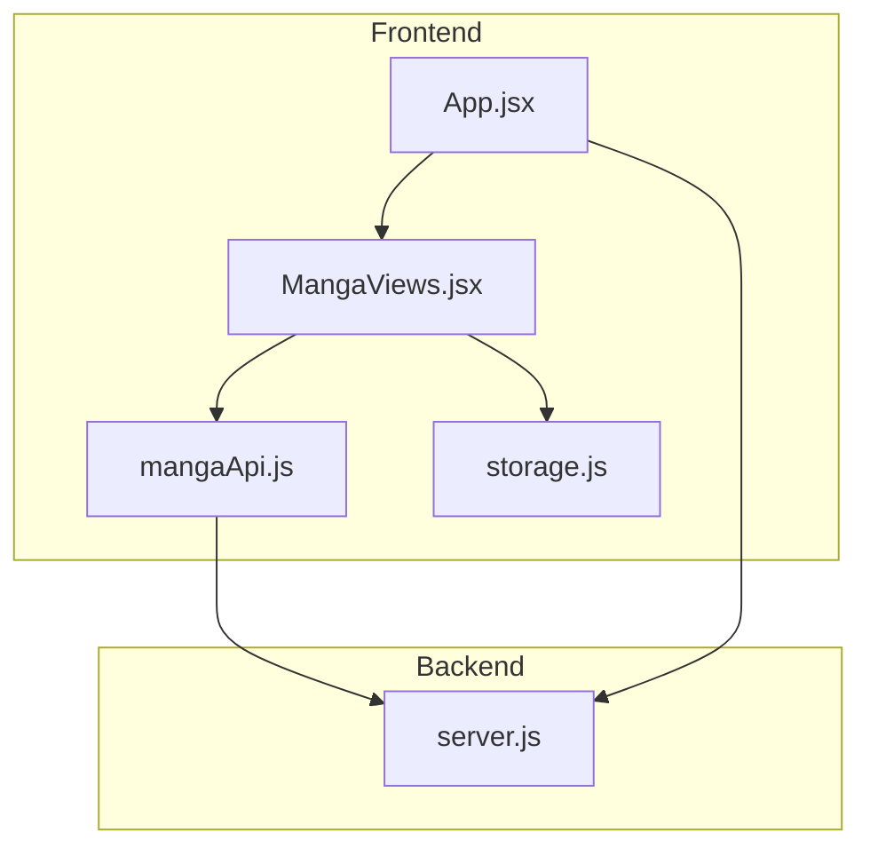
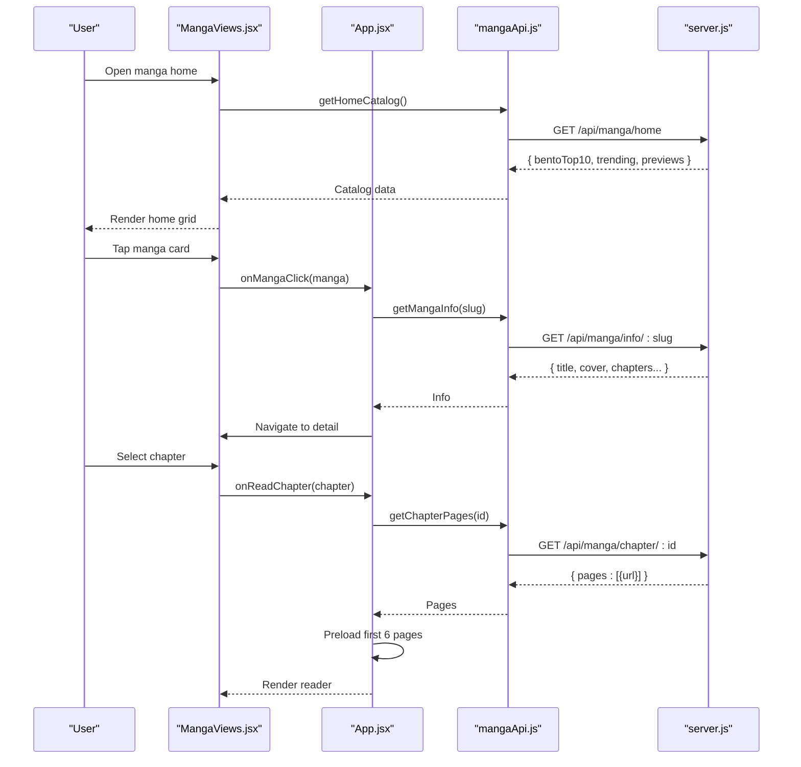
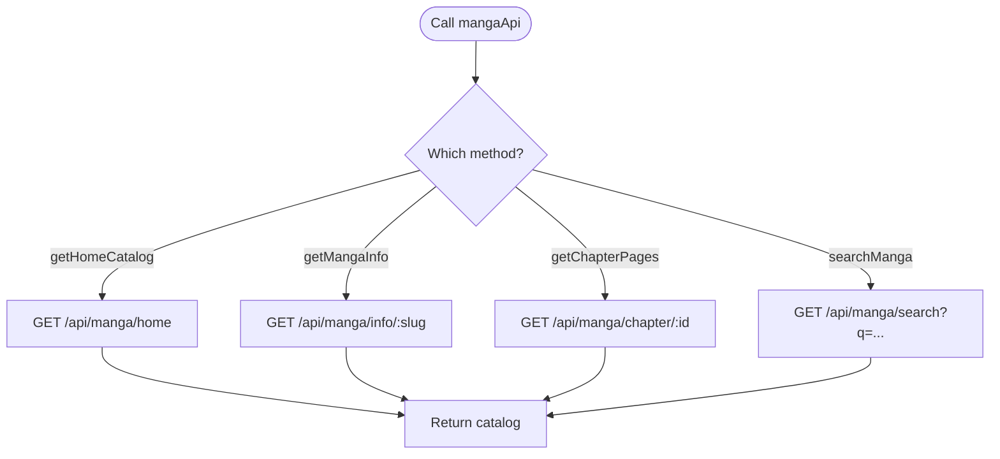
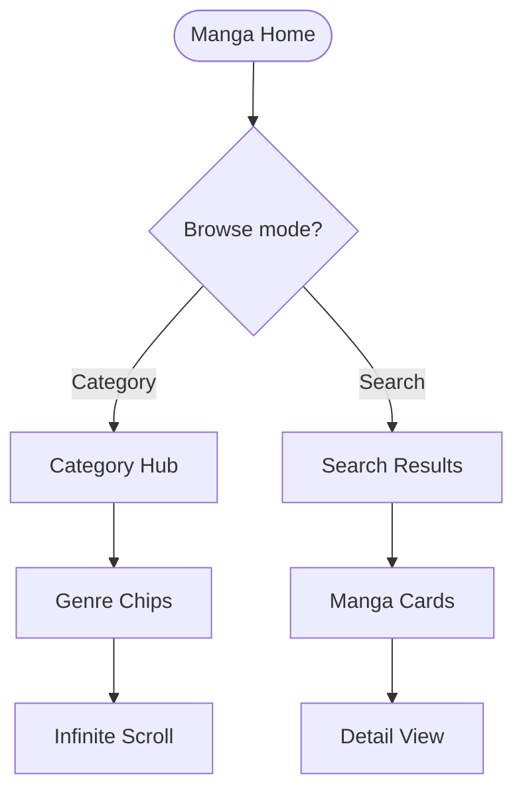
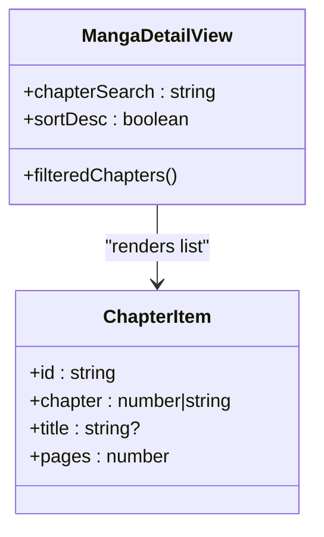
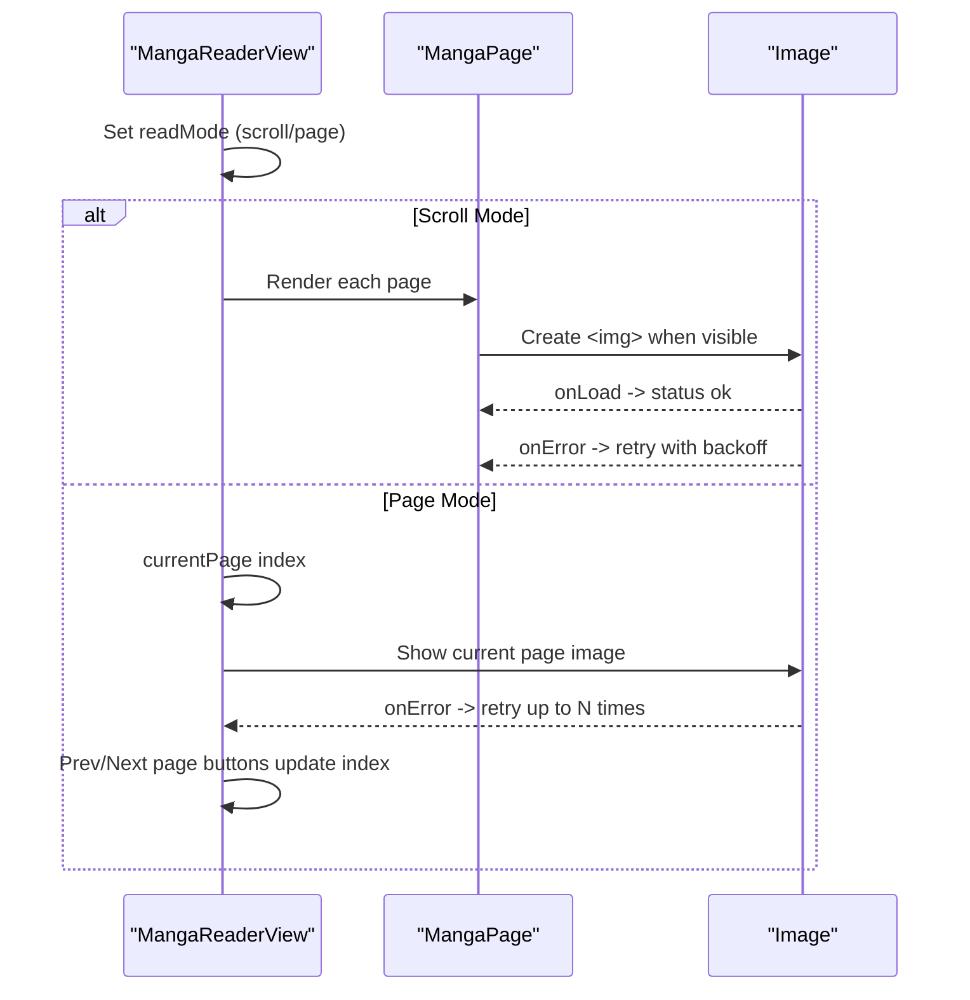
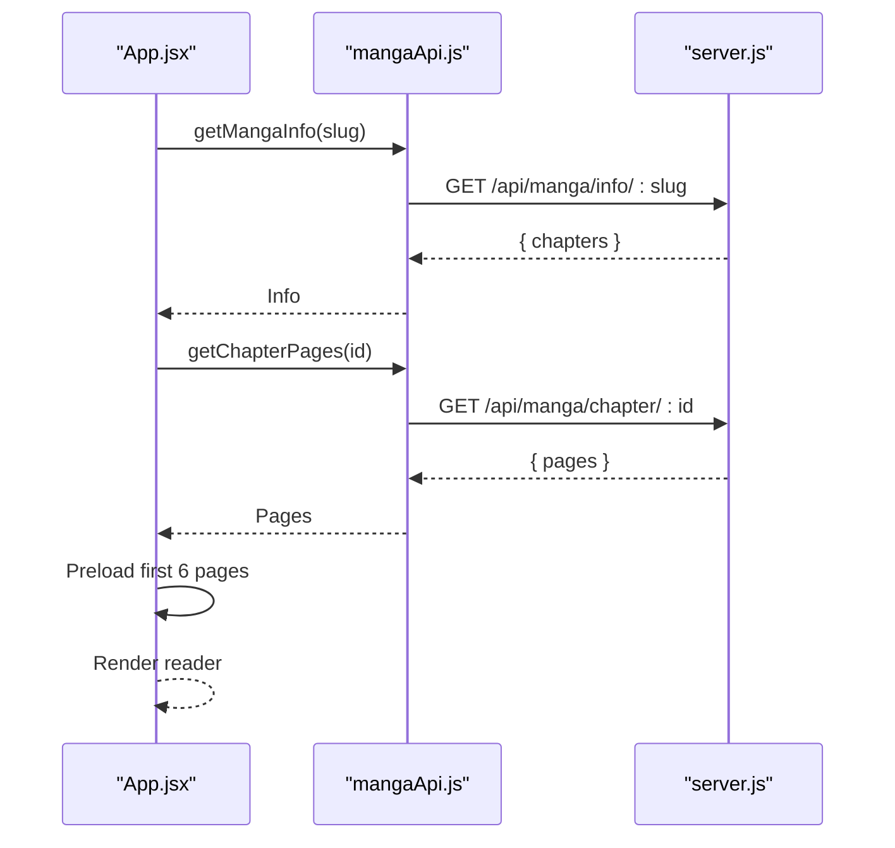
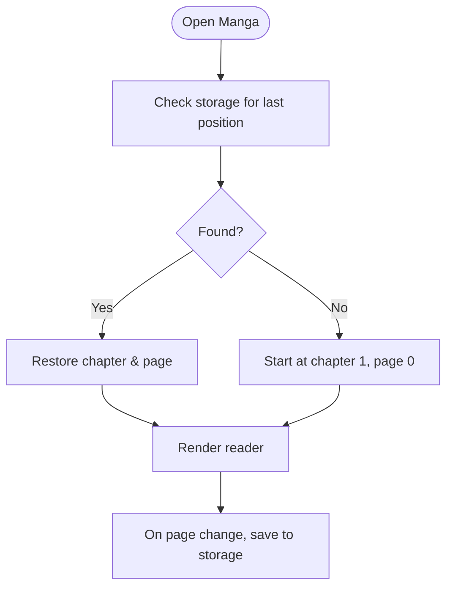
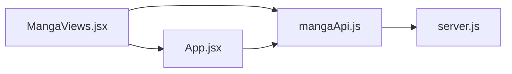

# Manga Feature Module

<cite>
**Referenced Files in This Document**
- [mangaApi.js](file://src/features/manga/api/mangaApi.js)
- [MangaViews.jsx](file://src/features/manga/components/MangaViews.jsx)
- [App.jsx](file://src/App.jsx)
- [storage.js](file://src/utils/storage.js)
- [server.js](file://server.js)
</cite>

## Table of Contents
1. Introduction
2. Project Structure
3. Core Components
4. Architecture Overview
5. Detailed Component Analysis
6. Dependency Analysis
7. Performance Considerations
8. Troubleshooting Guide
9. Conclusion

## Introduction
This document explains the Manga feature module, covering the reading interface, chapter management, API layer for fetching manga data and images, discovery features (search, categories, recommendations), offline storage strategy, image loading optimization, memory considerations, and user experience patterns for digital comic reading.

## Project Structure
The Manga module is organized into:
- API layer: a thin client that calls backend endpoints for catalog, info, chapters, and search.
- UI components: home views, category hubs, detail view with chapter list, and reader with scroll/page modes.
- App integration: orchestrates navigation, state, and preloading logic when entering the reader.
- Storage utility: provides persistent storage across web and native environments.
- Server routes: backend endpoints that aggregate and return manga data.

**Diagram sources**
- [App.jsx:1580-1639](file://src/App.jsx#L1580-L1639)
- [MangaViews.jsx:824-1032](file://src/features/manga/components/MangaViews.jsx#L824-L1032)
- [mangaApi.js:1-28](file://src/features/manga/api/mangaApi.js#L1-L28)
- [storage.js:1-71](file://src/utils/storage.js#L1-L71)
- [server.js:2385-2465](file://server.js#L2385-L2465)

**Section sources**
- [mangaApi.js:1-28](file://src/features/manga/api/mangaApi.js#L1-L28)
- [MangaViews.jsx:1-1038](file://src/features/manga/components/MangaViews.jsx#L1-L1038)
- [App.jsx:1580-1639](file://src/App.jsx#L1580-L1639)
- [storage.js:1-71](file://src/utils/storage.js#L1-L71)
- [server.js:2385-2465](file://server.js#L2385-L2465)

## Core Components
- API client: methods to fetch home catalog, manga info, chapter pages, and search results.
- Discovery UI: home grid, category hubs, genre browsing, and search results.
- Detail view: chapter list with search and sort.
- Reader: scroll mode (lazy-loaded pages) and page mode (single-page navigation).
- Storage: cross-platform persistence for app state or preferences.

Key responsibilities:
- mangaApi.js: HTTP calls to /api/manga/* endpoints.
- MangaViews.jsx: all manga-related React components including reader and discovery screens.
- App.jsx: orchestrates reading flow, chapter resolution, and page preloading.
- storage.js: unified set/get/remove/clear for native and web.
- server.js: backend aggregation and response shaping for manga endpoints.

**Section sources**
- [mangaApi.js:5-25](file://src/features/manga/api/mangaApi.js#L5-L25)
- [MangaViews.jsx:283-355](file://src/features/manga/components/MangaViews.jsx#L283-L355)
- [MangaViews.jsx:721-822](file://src/features/manga/components/MangaViews.jsx#L721-L822)
- [MangaViews.jsx:824-1032](file://src/features/manga/components/MangaViews.jsx#L824-L1032)
- [App.jsx:1580-1639](file://src/App.jsx#L1580-L1639)
- [storage.js:29-70](file://src/utils/storage.js#L29-L70)
- [server.js:2385-2465](file://server.js#L2385-L2465)

## Architecture Overview
The manga feature follows a layered architecture:
- Presentation layer (React components) handles user interactions and rendering.
- API layer abstracts network requests to backend endpoints.
- Backend aggregates data from external sources and returns normalized responses.
- Storage utility persists preferences or progress where needed.

**Diagram sources**
- [mangaApi.js:6-25](file://src/features/manga/api/mangaApi.js#L6-L25)
- [App.jsx:1580-1639](file://src/App.jsx#L1580-L1639)
- [server.js:2385-2465](file://server.js#L2385-L2465)

## Detailed Component Analysis

### API Layer
- Endpoints used by the frontend:
  - Home catalog: GET /api/manga/home
  - Manga info: GET /api/manga/info/:slug
  - Chapter pages: GET /api/manga/chapter/:id
  - Search: GET /api/manga/search?q=...
- Behavior:
  - Normalizes errors and returns JSON payloads.
  - Search gracefully returns empty arrays on failure.

**Diagram sources**
- [mangaApi.js:6-25](file://src/features/manga/api/mangaApi.js#L6-L25)
- [server.js:2385-2465](file://server.js#L2385-L2465)

**Section sources**
- [mangaApi.js:6-25](file://src/features/manga/api/mangaApi.js#L6-L25)
- [server.js:2654-2682](file://server.js#L2654-L2682)

### Discovery Features
- Home view:
  - Bento top-10 grid with hero card and ranked items.
  - Category cards to enter Manga/Manhwa/Manhua hubs.
  - Preview rows for trending and popular content.
- Category hubs:
  - Genre filter chips (All, Action, Fantasy, Romance, System, Isekai, Adventure, Drama, Sci-Fi).
  - Rows for Trending, Popular, Fan Favorites, Fresh Chapters.
  - Infinite scrolling with IntersectionObserver and deduplication.
- Search:
  - Real-time query updates results via search endpoint.
  - Empty states and loading indicators.

**Diagram sources**
- [MangaViews.jsx:283-355](file://src/features/manga/components/MangaViews.jsx#L283-L355)
- [MangaViews.jsx:449-546](file://src/features/manga/components/MangaViews.jsx#L449-L546)
- [MangaViews.jsx:548-633](file://src/features/manga/components/MangaViews.jsx#L548-L633)

**Section sources**
- [MangaViews.jsx:57-121](file://src/features/manga/components/MangaViews.jsx#L57-L121)
- [MangaViews.jsx:123-167](file://src/features/manga/components/MangaViews.jsx#L123-L167)
- [MangaViews.jsx:169-281](file://src/features/manga/components/MangaViews.jsx#L169-L281)
- [MangaViews.jsx:449-546](file://src/features/manga/components/MangaViews.jsx#L449-L546)
- [MangaViews.jsx:548-633](file://src/features/manga/components/MangaViews.jsx#L548-L633)
- [MangaViews.jsx:694-719](file://src/features/manga/components/MangaViews.jsx#L694-L719)

### Detail View and Chapter Management
- Displays manga metadata, status, rating, genres, description.
- Chapter list supports:
  - Text search by chapter number/title.
  - Sort order toggle (newest/oldest).
  - Click-to-read triggers reader flow.

**Diagram sources**
- [MangaViews.jsx:721-822](file://src/features/manga/components/MangaViews.jsx#L721-L822)

**Section sources**
- [MangaViews.jsx:721-822](file://src/features/manga/components/MangaViews.jsx#L721-L822)

### Reader Implementation
- Modes:
  - Scroll mode: vertical stream of pages with lazy loading via IntersectionObserver.
  - Page mode: single-page view with prev/next controls and counter.
- Navigation:
  - Previous/Next chapter buttons and chapter selector dropdown.
  - Auto-reset page index on chapter change.
- Image handling:
  - Lazy load per page; background retry with backoff on error.
  - Page-mode retry loop with error fallback UI.
- Progress tracking:
  - Current page index maintained in component state.
  - No explicit persisted progress in this file; can be integrated via storage utility.

**Diagram sources**
- [MangaViews.jsx:824-895](file://src/features/manga/components/MangaViews.jsx#L824-L895)
- [MangaViews.jsx:897-1032](file://src/features/manga/components/MangaViews.jsx#L897-L1032)

**Section sources**
- [MangaViews.jsx:824-895](file://src/features/manga/components/MangaViews.jsx#L824-L895)
- [MangaViews.jsx:897-1032](file://src/features/manga/components/MangaViews.jsx#L897-L1032)

### App Integration and Reading Flow
- When opening a manga to read:
  - Ensures chapters array exists; fetches full info if missing.
  - Resolves target chapter by number if necessary.
  - Fetches chapter pages and preloads first 6 images in parallel for faster initial render.
- Search integration:
  - Updates search query and results via API.

**Diagram sources**
- [App.jsx:1580-1639](file://src/App.jsx#L1580-L1639)
- [mangaApi.js:11-20](file://src/features/manga/api/mangaApi.js#L11-L20)
- [server.js:2385-2465](file://server.js#L2385-L2465)

**Section sources**
- [App.jsx:1580-1639](file://src/App.jsx#L1580-L1639)

### Offline Reading and Local Storage
- The storage utility provides:
  - Persistent key/value store using Capacitor Preferences on native platforms, falling back to localStorage on web.
  - Methods: set, get, remove, clear.
- Usage pattern for manga:
  - Persist last read chapter id and page index per manga.
  - On resume, restore position and optionally prefetch nearby pages.
- Note: The manga components do not currently persist reading progress; integrate via storage.js to enable offline continuity.

**Diagram sources**
- [storage.js:29-70](file://src/utils/storage.js#L29-L70)

**Section sources**
- [storage.js:1-71](file://src/utils/storage.js#L1-L71)

## Dependency Analysis
- Frontend dependencies:
  - MangaViews.jsx depends on App.jsx for navigation and state orchestration.
  - MangaViews.jsx uses mangaApi.js for data fetching.
  - App.jsx uses mangaApi.js directly for info and pages.
- Backend dependencies:
  - server.js exposes /api/manga/* endpoints and aggregates data.
- Coupling:
  - Low coupling between UI and API due to clear method boundaries.
  - App.jsx centralizes reading flow, reducing duplication in components.

**Diagram sources**
- [MangaViews.jsx:1-1038](file://src/features/manga/components/MangaViews.jsx#L1-L1038)
- [mangaApi.js:1-28](file://src/features/manga/api/mangaApi.js#L1-L28)
- [App.jsx:1580-1639](file://src/App.jsx#L1580-L1639)
- [server.js:2385-2465](file://server.js#L2385-L2465)

**Section sources**
- [MangaViews.jsx:1-1038](file://src/features/manga/components/MangaViews.jsx#L1-L1038)
- [mangaApi.js:1-28](file://src/features/manga/api/mangaApi.js#L1-L28)
- [App.jsx:1580-1639](file://src/App.jsx#L1580-L1639)
- [server.js:2385-2465](file://server.js#L2385-L2465)

## Performance Considerations
- Image loading:
  - Lazy loading via IntersectionObserver in scroll mode reduces initial bandwidth and improves perceived performance.
  - Background retries with exponential backoff improve resilience against transient failures.
  - Parallel preload of first 6 pages accelerates initial reader render.
- Memory management:
  - Avoid keeping large image objects in memory beyond viewport; rely on browser image caching and unmounting off-screen components.
  - Consider limiting concurrent image loads and clearing references when navigating away from reader.
- Network efficiency:
  - Use pagination and infinite scroll to avoid loading entire catalogs at once.
  - Deduplicate incoming items to prevent redundant renders.
- UX patterns:
  - Provide immediate feedback with skeletons/loaders during data fetches.
  - Offer both scroll and page modes to suit different devices and preferences.

[No sources needed since this section provides general guidance]

## Troubleshooting Guide
- Common issues:
  - Images fail to load:
    - Reader includes automatic retry with backoff; verify network connectivity and CORS policies.
    - In page mode, a retry button is available after repeated failures.
  - Chapter pages empty:
    - Ensure chapter id is valid and backend returns pages array.
    - Check console logs for fetch errors in App.jsx.
  - Search returns no results:
    - Verify query parameter encoding and backend search endpoint behavior.
- Diagnostics:
  - Inspect network tab for failed requests to /api/manga/*.
  - Confirm server routes are reachable and returning expected shapes.

**Section sources**
- [MangaViews.jsx:856-868](file://src/features/manga/components/MangaViews.jsx#L856-L868)
- [MangaViews.jsx:932-938](file://src/features/manga/components/MangaViews.jsx#L932-L938)
- [App.jsx:1633-1635](file://src/App.jsx#L1633-L1635)

## Conclusion
The Manga feature module provides a robust reading experience with flexible navigation modes, efficient image loading, and comprehensive discovery tools. The API layer cleanly separates concerns, while the reader integrates lazy loading and retry strategies for reliability. Integrating storage-based progress tracking will further enhance offline capabilities and user continuity.

[No sources needed since this section summarizes without analyzing specific files]