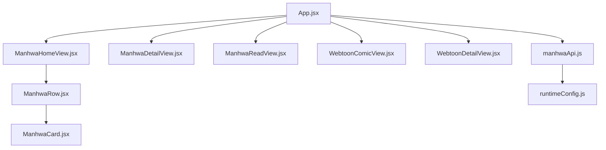
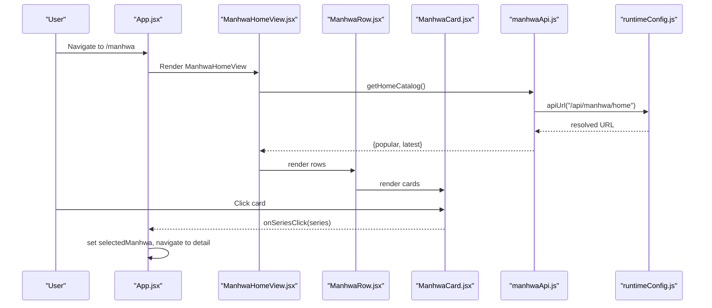
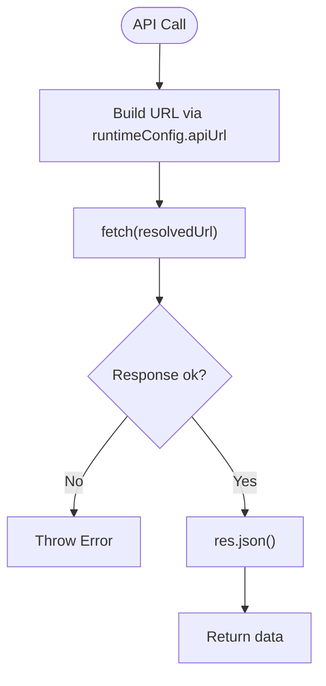
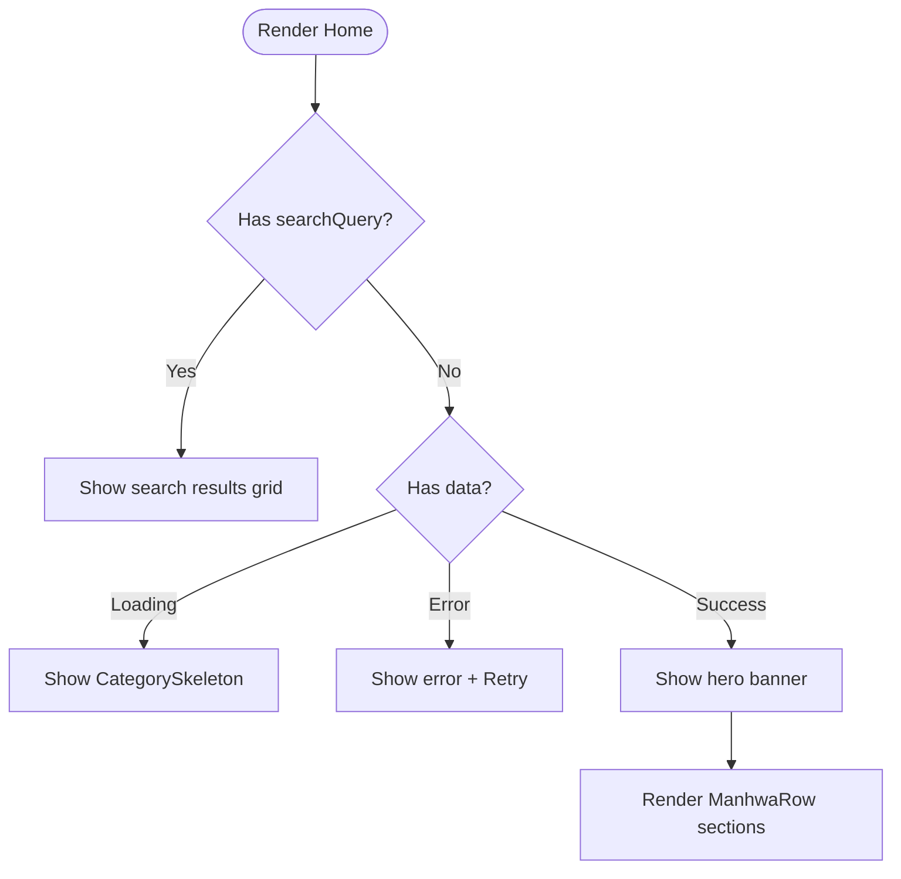
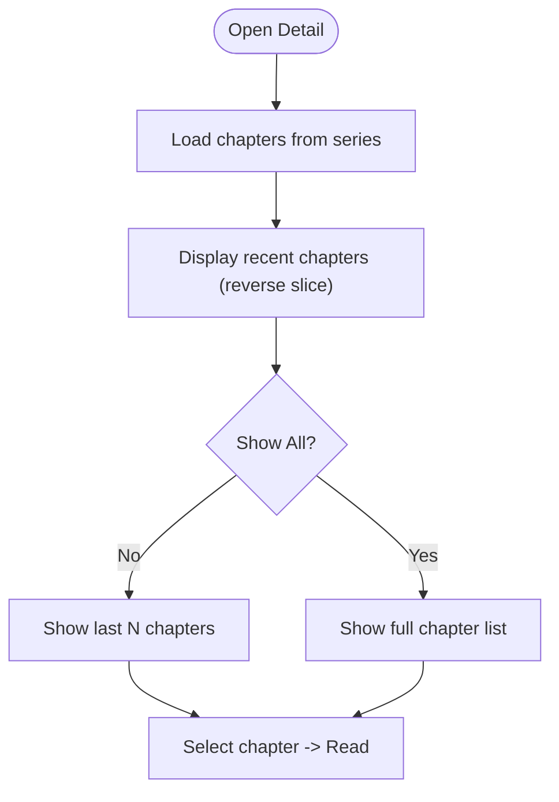
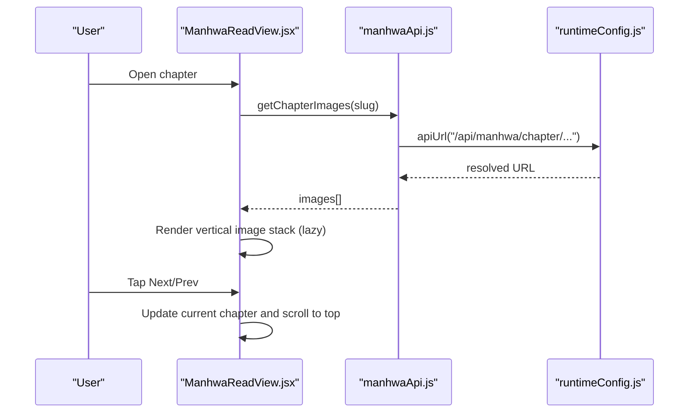
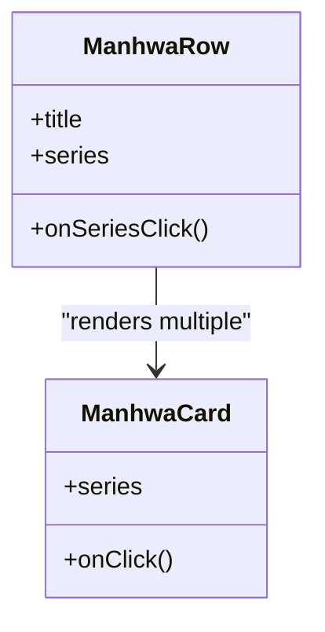
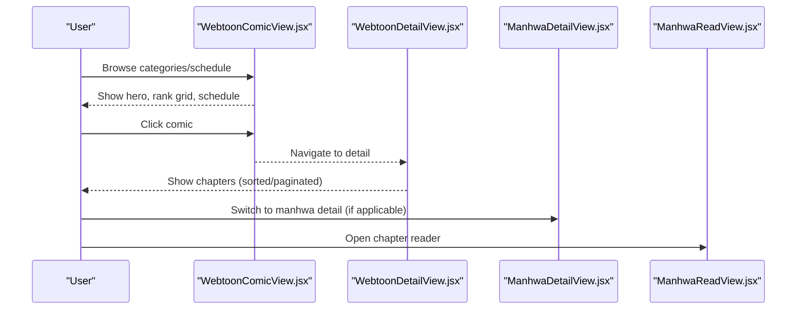
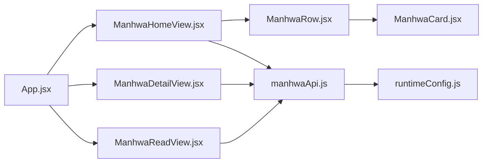

# Manhwa Feature Module

<cite>
**Referenced Files in This Document**
- [manhwaApi.js](file://src/features/manhwa/api/manhwaApi.js)
- [ManhwaHomeView.jsx](file://src/features/manhwa/components/ManhwaHomeView.jsx)
- [ManhwaDetailView.jsx](file://src/features/manhwa/components/ManhwaDetailView.jsx)
- [ManhwaReadView.jsx](file://src/features/manhwa/components/ManhwaReadView.jsx)
- [ManhwaCard.jsx](file://src/features/manhwa/components/ManhwaCard.jsx)
- [ManhwaRow.jsx](file://src/features/manhwa/components/ManhwaRow.jsx)
- [App.jsx](file://src/App.jsx)
- [runtimeConfig.js](file://src/runtimeConfig.js)
- [WebtoonComicView.jsx](file://src/components/WebtoonComicView.jsx)
- [WebtoonDetailView.jsx](file://src/components/WebtoonDetailView.jsx)
</cite>

## Table of Contents
1. [Introduction](#introduction)
2. [Project Structure](#project-structure)
3. [Core Components](#core-components)
4. [Architecture Overview](#architecture-overview)
5. [Detailed Component Analysis](#detailed-component-analysis)
6. [Dependency Analysis](#dependency-analysis)
7. [Performance Considerations](#performance-considerations)
8. [Troubleshooting Guide](#troubleshooting-guide)
9. [Conclusion](#conclusion)

## Introduction
This document describes the Manhwa feature module that powers a Korean webtoon reading experience with vertical scrolling and infinite scroll-like browsing. It covers:
- API layer for manhwa data retrieval, chapter management, and image serving
- Home view with featured content and category browsing
- Detail view with series information, genres, synopsis, and chapter listings
- Read view optimized for mobile reading with page navigation and progress-friendly UX
- Reusable UI components (card and row) for consistent presentation
- Performance optimizations for large image libraries and smooth mobile reading

## Project Structure
The manhwa feature is implemented as a set of React components under src/features/manhwa with an API client and integration into the main application routing and state.

**Diagram sources**
- [App.jsx:2278-2297](file://src/App.jsx#L2278-L2297)
- [ManhwaHomeView.jsx:1-65](file://src/features/manhwa/components/ManhwaHomeView.jsx#L1-L65)
- [ManhwaDetailView.jsx:1-111](file://src/features/manhwa/components/ManhwaDetailView.jsx#L1-L111)
- [ManhwaReadView.jsx:1-94](file://src/features/manhwa/components/ManhwaReadView.jsx#L1-L94)
- [ManhwaRow.jsx:1-19](file://src/features/manhwa/components/ManhwaRow.jsx#L1-L19)
- [ManhwaCard.jsx:1-33](file://src/features/manhwa/components/ManhwaCard.jsx#L1-L33)
- [WebtoonComicView.jsx:1-261](file://src/components/WebtoonComicView.jsx#L1-L261)
- [WebtoonDetailView.jsx:1-335](file://src/components/WebtoonDetailView.jsx#L1-L335)
- [manhwaApi.js:1-29](file://src/features/manhwa/api/manhwaApi.js#L1-L29)
- [runtimeConfig.js:1-163](file://src/runtimeConfig.js#L1-L163)

**Section sources**
- [App.jsx:177-188](file://src/App.jsx#L177-L188)
- [App.jsx:2278-2297](file://src/App.jsx#L2278-L2297)
- [manhwaApi.js:1-29](file://src/features/manhwa/api/manhwaApi.js#L1-L29)
- [runtimeConfig.js:1-163](file://src/runtimeConfig.js#L1-L163)

## Core Components
- API Layer: Centralized fetch calls to backend endpoints for home catalog, series info, chapter images, and search.
- Home View: Hero banner, popular/latest rows, and search results.
- Detail View: Series metadata, synopsis, and paginated chapter list.
- Read View: Vertical image stack with lazy loading, chapter navigation, and quick chapter picker.
- Card and Row: Reusable components for consistent display across rows and grids.

Key responsibilities:
- Data fetching and error handling are encapsulated in the API client.
- Views manage local state for loading, errors, and user interactions.
- Routing and state transitions are coordinated by the root App component.

**Section sources**
- [manhwaApi.js:5-25](file://src/features/manhwa/api/manhwaApi.js#L5-L25)
- [ManhwaHomeView.jsx:6-60](file://src/features/manhwa/components/ManhwaHomeView.jsx#L6-L60)
- [ManhwaDetailView.jsx:4-105](file://src/features/manhwa/components/ManhwaDetailView.jsx#L4-L105)
- [ManhwaReadView.jsx:4-88](file://src/features/manhwa/components/ManhwaReadView.jsx#L4-L88)
- [ManhwaCard.jsx:4-29](file://src/features/manhwa/components/ManhwaCard.jsx#L4-L29)
- [ManhwaRow.jsx:4-15](file://src/features/manhwa/components/ManhwaRow.jsx#L4-L15)

## Architecture Overview
The manhwa feature integrates with the app’s routing and state. The root App component holds manhwa-related state and renders the appropriate view based on the current route. The API client uses runtime configuration to resolve the base URL for all requests.

**Diagram sources**
- [App.jsx:2278-2297](file://src/App.jsx#L2278-L2297)
- [ManhwaHomeView.jsx:6-60](file://src/features/manhwa/components/ManhwaHomeView.jsx#L6-L60)
- [ManhwaRow.jsx:4-15](file://src/features/manhwa/components/ManhwaRow.jsx#L4-L15)
- [ManhwaCard.jsx:4-29](file://src/features/manhwa/components/ManhwaCard.jsx#L4-L29)
- [manhwaApi.js:5-10](file://src/features/manhwa/api/manhwaApi.js#L5-L10)
- [runtimeConfig.js:149-153](file://src/runtimeConfig.js#L149-L153)

## Detailed Component Analysis

### API Layer: manhwaApi.js
- Provides methods for:
  - getHomeCatalog: fetches featured and latest series
  - getSeriesInfo: retrieves series details by slug
  - getChapterImages: loads chapter pages by slug
  - searchManhwa: searches by query string
- Uses runtimeConfig.apiUrl to build absolute or relative URLs depending on environment.
- Throws descriptive errors on non-ok responses; returns JSON payloads.

**Diagram sources**
- [manhwaApi.js:5-25](file://src/features/manhwa/api/manhwaApi.js#L5-L25)
- [runtimeConfig.js:149-153](file://src/runtimeConfig.js#L149-L153)

**Section sources**
- [manhwaApi.js:1-29](file://src/features/manhwa/api/manhwaApi.js#L1-L29)
- [runtimeConfig.js:1-163](file://src/runtimeConfig.js#L1-L163)

### Home View: ManhwaHomeView.jsx
- Displays a hero banner using the first popular item.
- Renders two rows: Popular Now and Latest Updates via ManhwaRow.
- Supports search mode: shows results grid or “No results found” message.
- Handles loading skeletons and retry behavior on error.

**Diagram sources**
- [ManhwaHomeView.jsx:6-60](file://src/features/manhwa/components/ManhwaHomeView.jsx#L6-L60)

**Section sources**
- [ManhwaHomeView.jsx:1-65](file://src/features/manhwa/components/ManhwaHomeView.jsx#L1-L65)

### Detail View: ManhwaDetailView.jsx
- Shows series cover, title, genres, synopsis, and a “Read Chapter 1” button.
- Lists chapters with thumbnails, titles, dates, and a “Show All” toggle to avoid rendering very long lists at once.
- Uses lazy loading for chapter thumbnails to improve performance.

**Diagram sources**
- [ManhwaDetailView.jsx:4-105](file://src/features/manhwa/components/ManhwaDetailView.jsx#L4-L105)

**Section sources**
- [ManhwaDetailView.jsx:1-111](file://src/features/manhwa/components/ManhwaDetailView.jsx#L1-L111)

### Read View: ManhwaReadView.jsx
- Presents a vertical stack of chapter images with lazy loading for memory efficiency.
- Provides top and bottom navigation for previous/next chapters and returning to the chapter list.
- Includes a compact chapter picker grid for quick jumps.

**Diagram sources**
- [ManhwaReadView.jsx:4-88](file://src/features/manhwa/components/ManhwaReadView.jsx#L4-L88)
- [manhwaApi.js:16-20](file://src/features/manhwa/api/manhwaApi.js#L16-L20)
- [runtimeConfig.js:149-153](file://src/runtimeConfig.js#L149-L153)

**Section sources**
- [ManhwaReadView.jsx:1-94](file://src/features/manhwa/components/ManhwaReadView.jsx#L1-L94)

### UI Components: ManhwaCard.jsx and ManhwaRow.jsx
- ManhwaCard:
  - Displays cover image with fallback placeholder on error.
  - Shows a subtle overlay with “Read” label.
  - Emits onClick to navigate to detail.
- ManhwaRow:
  - Renders a horizontal section with a title and a slider of cards.
  - Delegates click handling to parent via onSeriesClick.

**Diagram sources**
- [ManhwaCard.jsx:4-29](file://src/features/manhwa/components/ManhwaCard.jsx#L4-L29)
- [ManhwaRow.jsx:4-15](file://src/features/manhwa/components/ManhwaRow.jsx#L4-L15)

**Section sources**
- [ManhwaCard.jsx:1-33](file://src/features/manhwa/components/ManhwaCard.jsx#L1-L33)
- [ManhwaRow.jsx:1-19](file://src/features/manhwa/components/ManhwaRow.jsx#L1-L19)

### Webtoon Integration: WebtoonComicView.jsx and WebtoonDetailView.jsx
- WebtoonComicView:
  - Loads trending/popular/featured data and weekly schedule.
  - Provides genre filtering and a hero carousel.
  - Bridges to detail view via onComicClick.
- WebtoonDetailView:
  - Fetches detailed info and chapters, supports sorting and pagination.
  - Offers a “First episode” CTA and stats sidebar.

**Diagram sources**
- [WebtoonComicView.jsx:27-87](file://src/components/WebtoonComicView.jsx#L27-L87)
- [WebtoonDetailView.jsx:5-96](file://src/components/WebtoonDetailView.jsx#L5-L96)
- [App.jsx:2278-2297](file://src/App.jsx#L2278-L2297)

**Section sources**
- [WebtoonComicView.jsx:1-261](file://src/components/WebtoonComicView.jsx#L1-L261)
- [WebtoonDetailView.jsx:1-335](file://src/components/WebtoonDetailView.jsx#L1-L335)

## Dependency Analysis
- App.jsx orchestrates views and routes for manhwa:
  - Maintains state for selected series, current chapter, images, and loading flags.
  - Maps routes like /manhwa, /manhwa/:slug, and /read/manhwa/:slug?ch=... to views.
- manhwaApi.js depends on runtimeConfig.apiUrl for URL resolution across environments.
- Views depend on each other through props and callbacks (e.g., onSeriesClick, onReadChapter).

**Diagram sources**
- [App.jsx:2278-2297](file://src/App.jsx#L2278-L2297)
- [manhwaApi.js:1-29](file://src/features/manhwa/api/manhwaApi.js#L1-L29)
- [runtimeConfig.js:149-153](file://src/runtimeConfig.js#L149-L153)

**Section sources**
- [App.jsx:177-188](file://src/App.jsx#L177-L188)
- [App.jsx:2278-2297](file://src/App.jsx#L2278-L2297)
- [manhwaApi.js:1-29](file://src/features/manhwa/api/manhwaApi.js#L1-L29)
- [runtimeConfig.js:1-163](file://src/runtimeConfig.js#L1-L163)

## Performance Considerations
- Image optimization:
  - Use lazy loading on images (cards, chapter thumbnails, reader pages) to reduce initial payload and memory usage.
  - Provide fallback placeholders when images fail to load to maintain layout stability.
- List rendering:
  - Limit initial chapter list size and offer “Show All” to avoid heavy DOM operations on large catalogs.
  - Pagination and sorting in WebtoonDetailView help manage large chapter sets.
- Network efficiency:
  - Centralize API calls in manhwaApi.js with clear error handling and JSON parsing.
  - Leverage runtimeConfig to ensure correct base URLs and avoid unnecessary redirects or cache issues.
- Mobile reading experience:
  - Vertical stacking of images in the reader provides a natural scroll flow.
  - Quick chapter navigation via top/bottom buttons and a compact chapter picker improves usability on small screens.
  - Scroll-to-top on chapter changes reduces disorientation.

[No sources needed since this section provides general guidance]

## Troubleshooting Guide
Common issues and resolutions:
- API failures:
  - Non-ok responses throw descriptive errors in manhwaApi.js; wrap calls with try/catch in views to show user-friendly messages and retry options.
- Missing images:
  - Cards and detail views handle onError to hide broken images and show placeholders. Ensure alt text and fallback styles are present.
- Empty chapters:
  - Detail and read views check for empty arrays and display helpful messages. Verify backend returns valid chapter slugs and image lists.
- Routing mismatches:
  - Confirm routes in App.jsx map correctly to views and that slugs are properly encoded/decoded when navigating between detail and read views.

**Section sources**
- [manhwaApi.js:6-25](file://src/features/manhwa/api/manhwaApi.js#L6-L25)
- [ManhwaHomeView.jsx:23-31](file://src/features/manhwa/components/ManhwaHomeView.jsx#L23-L31)
- [ManhwaDetailView.jsx:57-61](file://src/features/manhwa/components/ManhwaDetailView.jsx#L57-L61)
- [ManhwaReadView.jsx:32-40](file://src/features/manhwa/components/ManhwaReadView.jsx#L32-L40)

## Conclusion
The Manhwa feature module delivers a cohesive webtoon reading experience with robust API integration, efficient UI components, and mobile-first design patterns. By combining lazy-loaded images, controlled list rendering, and clear navigation flows, it balances performance and usability for large image libraries. The modular structure allows easy extension for additional features such as ratings, bookmarks, or advanced search filters while maintaining consistency across the app.

[No sources needed since this section summarizes without analyzing specific files]