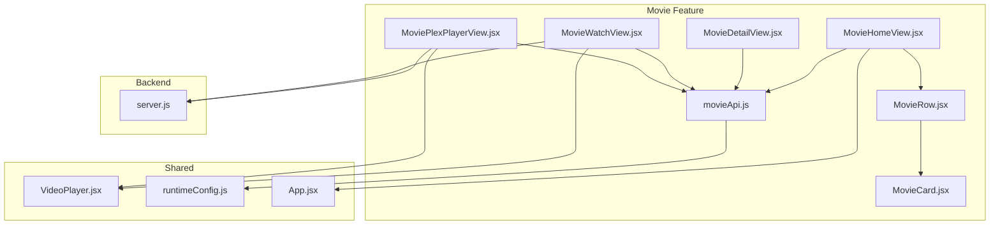
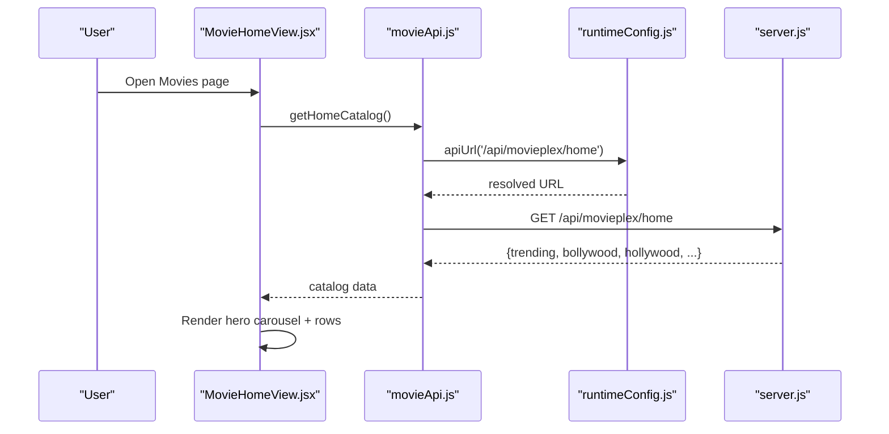
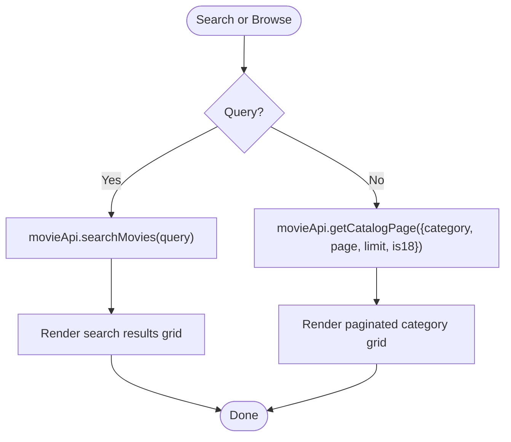
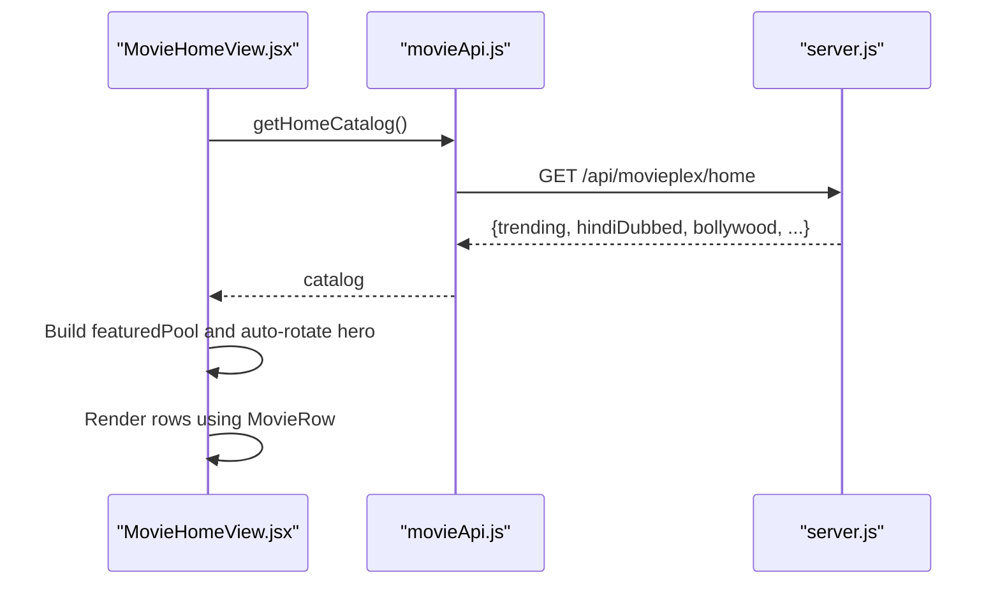
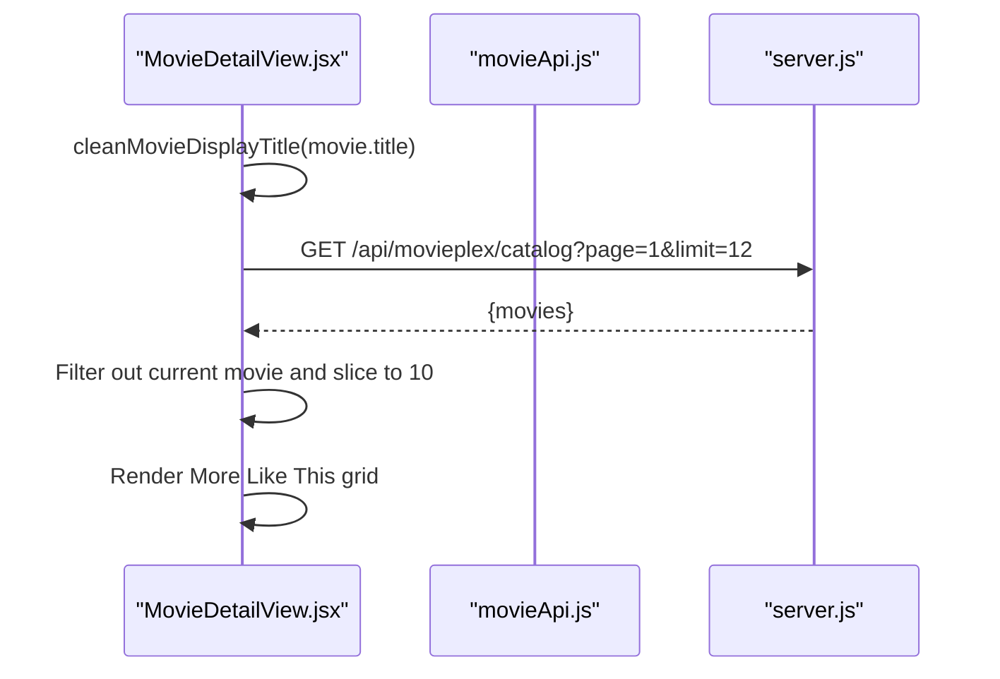
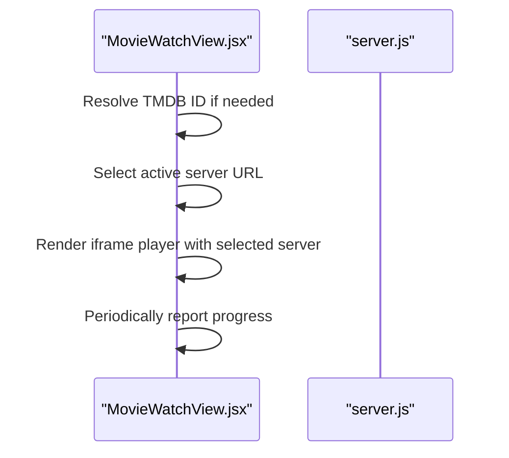
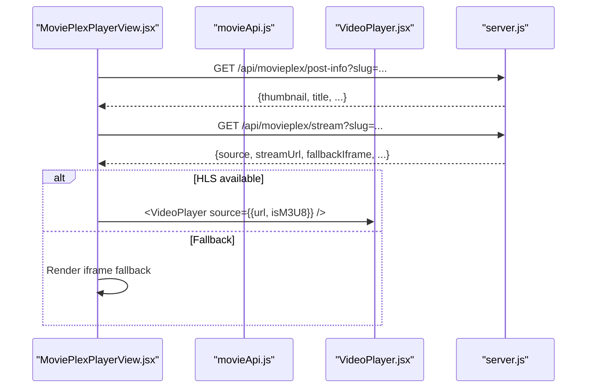
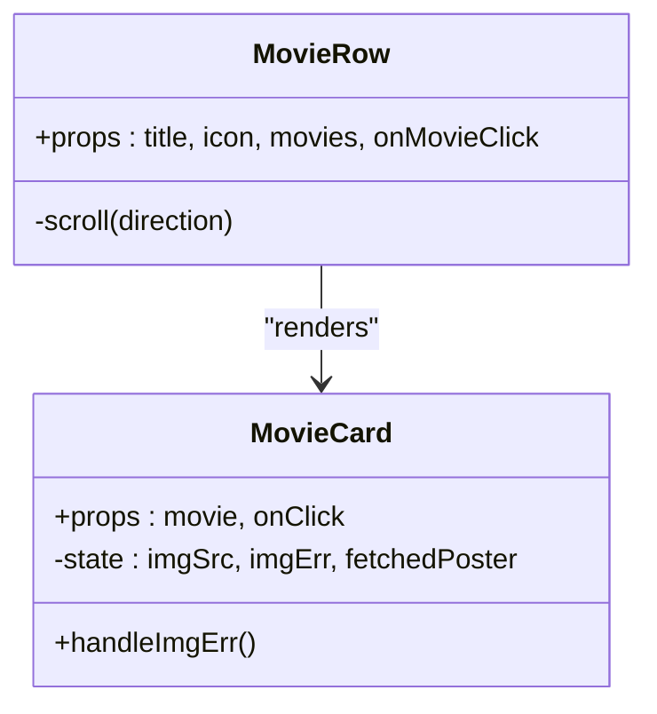
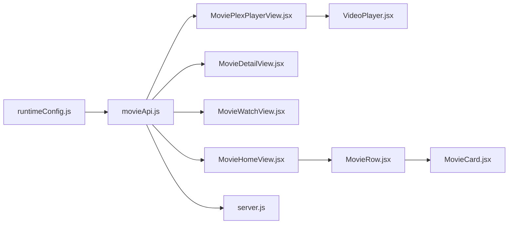

# Movie Feature Module

<cite>
**Referenced Files in This Document**
- [movieApi.js](file://src/features/movie/api/movieApi.js)
- [MovieHomeView.jsx](file://src/features/movie/components/MovieHomeView.jsx)
- [MovieDetailView.jsx](file://src/features/movie/components/MovieDetailView.jsx)
- [MovieWatchView.jsx](file://src/features/movie/components/MovieWatchView.jsx)
- [MoviePlexPlayerView.jsx](file://src/features/movie/components/MoviePlexPlayerView.jsx)
- [MovieRow.jsx](file://src/features/movie/components/MovieRow.jsx)
- [MovieCard.jsx](file://src/features/movie/components/MovieCard.jsx)
- [VideoPlayer.jsx](file://src/components/VideoPlayer.jsx)
- [runtimeConfig.js](file://src/runtimeConfig.js)
- [App.jsx](file://src/App.jsx)
- [server.js](file://server.js)
</cite>

## Table of Contents
1. Introduction
2. Project Structure
3. Core Components
4. Architecture Overview
5. Detailed Component Analysis
6. Dependency Analysis
7. Performance Considerations
8. Troubleshooting Guide
9. Conclusion

## Introduction
This document explains the Movie feature module, covering:
- Movie collection system with metadata management, genre categorization, and search
- Home view implementation with featured hero carousel and trending rows
- Detail view with synopsis, genres, and actions to watch or add to list
- Watch view with server selection and player integration
- Plex player integration for external streaming services
- UI components (MovieCard and MovieRow) for consistent presentation
- Performance considerations for large libraries and image optimization strategies

## Project Structure
The Movie feature is organized under src/features/movie with a clear separation between API calls and UI components:
- API layer: centralized endpoints for catalog, search, and movie info
- Views: home, detail, watch, and Plex player views
- Reusable components: card and row for consistent UI

**Diagram sources**
- [MovieHomeView.jsx:1-608](file://src/features/movie/components/MovieHomeView.jsx#L1-L608)
- [MovieDetailView.jsx:1-213](file://src/features/movie/components/MovieDetailView.jsx#L1-L213)
- [MovieWatchView.jsx:1-250](file://src/features/movie/components/MovieWatchView.jsx#L1-L250)
- [MoviePlexPlayerView.jsx:1-247](file://src/features/movie/components/MoviePlexPlayerView.jsx#L1-L247)
- [MovieRow.jsx:1-73](file://src/features/movie/components/MovieRow.jsx#L1-L73)
- [MovieCard.jsx:1-166](file://src/features/movie/components/MovieCard.jsx#L1-L166)
- [movieApi.js:1-32](file://src/features/movie/api/movieApi.js#L1-L32)
- [VideoPlayer.jsx:1-800](file://src/components/VideoPlayer.jsx#L1-L800)
- [runtimeConfig.js:1-163](file://src/runtimeConfig.js#L1-L163)
- [App.jsx:1-800](file://src/App.jsx#L1-L800)
- [server.js:2941-3489](file://server.js#L2941-L3489)

**Section sources**
- [MovieHomeView.jsx:1-608](file://src/features/movie/components/MovieHomeView.jsx#L1-L608)
- [movieApi.js:1-32](file://src/features/movie/api/movieApi.js#L1-L32)
- [runtimeConfig.js:1-163](file://src/runtimeConfig.js#L1-L163)

## Core Components
- Movie API: Centralized fetch functions for home catalog, paginated category catalog, movie info by slug, and search. Uses runtimeConfig.apiUrl to build absolute URLs.
- MovieHomeView: Displays hero carousel, category pills, horizontal rows, and a paginated grid for categories. Integrates search results and admin-driven Random Picks via Supabase.
- MovieDetailView: Full-bleed hero, synopsis, metadata sidebar (audio/dubbing, genres, quality), and “More Like This” recommendations.
- MovieWatchView: For non-Plex items, resolves TMDB IDs and renders an iframe-based player with multiple servers; tracks progress.
- MoviePlexPlayerView: For Plex items, fetches post-info and stream data, plays HLS via VideoPlayer, and falls back to external iframe when needed.
- MovieRow: Horizontal scrolling row with chevron navigation and capped item count for performance.
- MovieCard: Poster display with lazy loading, gradient placeholder, hover overlay, rating badge, and on-demand poster fetch fallback.

**Section sources**
- [movieApi.js:5-28](file://src/features/movie/api/movieApi.js#L5-L28)
- [MovieHomeView.jsx:22-63](file://src/features/movie/components/MovieHomeView.jsx#L22-L63)
- [MovieDetailView.jsx:31-52](file://src/features/movie/components/MovieDetailView.jsx#L31-L52)
- [MovieWatchView.jsx:30-81](file://src/features/movie/components/MovieWatchView.jsx#L30-L81)
- [MoviePlexPlayerView.jsx:30-70](file://src/features/movie/components/MoviePlexPlayerView.jsx#L30-L70)
- [MovieRow.jsx:5-69](file://src/features/movie/components/MovieRow.jsx#L5-L69)
- [MovieCard.jsx:4-28](file://src/features/movie/components/MovieCard.jsx#L4-L28)

## Architecture Overview
The Movie feature integrates with a backend that proxies MoviePlex content and provides endpoints for catalog, search, post info, and stream resolution. The frontend uses React components to render UI and stateful behaviors like pagination, search, and playback.

**Diagram sources**
- [MovieHomeView.jsx:22-48](file://src/features/movie/components/MovieHomeView.jsx#L22-L48)
- [movieApi.js:5-10](file://src/features/movie/api/movieApi.js#L5-L10)
- [runtimeConfig.js:149-153](file://src/runtimeConfig.js#L149-L153)
- [server.js:2941-3489](file://server.js#L2941-L3489)

## Detailed Component Analysis

### Movie Collection System: Metadata, Genres, Search
- Metadata management:
  - Post info endpoint returns thumbnail, banner, title, description, and other fields used across views.
  - Catalog endpoint returns movies with id, slug, categoryIds, and optional images; backend normalizes titles and enriches posters via TMDB when missing.
- Genre categorization:
  - Frontend maps human-readable categories to numeric IDs for backend queries.
  - Backend maintains a category map and supports filtering by category and 18+ flag.
- Search functionality:
  - Search endpoint accepts query parameter and returns matching movies; empty results are handled gracefully.

**Diagram sources**
- [movieApi.js:11-28](file://src/features/movie/api/movieApi.js#L11-L28)
- [MovieHomeView.jsx:177-229](file://src/features/movie/components/MovieHomeView.jsx#L177-L229)

**Section sources**
- [movieApi.js:5-28](file://src/features/movie/api/movieApi.js#L5-L28)
- [MovieHomeView.jsx:50-63](file://src/features/movie/components/MovieHomeView.jsx#L50-L63)
- [server.js:2946-2951](file://server.js#L2946-L2951)
- [server.js:3455-3475](file://server.js#L3455-L3475)

### Home View: Featured Hero and Trending Rows
- Hero carousel:
  - Auto-rotates through a curated pool (trending, Hindi dubbed, Bollywood).
  - Displays title, year, short description, and action buttons to play or view details.
- Category pills:
  - Switch between All (rows) and dedicated category grids with pagination.
- Rows:
  - Horizontal scrolling sections for trending, Hindi dubbed, Bollywood, Hollywood, web series, action, thriller, short films, romance.
- Admin Random Picks:
  - Developer-only mode to select movies from 18+ category and push them to a persistent Random Picks section visible to all users.

**Diagram sources**
- [MovieHomeView.jsx:22-48](file://src/features/movie/components/MovieHomeView.jsx#L22-L48)
- [movieApi.js:5-10](file://src/features/movie/api/movieApi.js#L5-L10)
- [server.js:2941-2951](file://server.js#L2941-L2951)

**Section sources**
- [MovieHomeView.jsx:33-48](file://src/features/movie/components/MovieHomeView.jsx#L33-L48)
- [MovieHomeView.jsx:389-441](file://src/features/movie/components/MovieHomeView.jsx#L389-L441)
- [MovieHomeView.jsx:443-557](file://src/features/movie/components/MovieHomeView.jsx#L443-L557)

### Movie Detail View: Synopsis, Cast, Streaming Options
- Synopsis and metadata:
  - Displays cleaned title, release year, match percentage, age rating, quality badges, audio/dubbing info, genres, and quality/format.
- Actions:
  - Play button navigates to watch view.
  - Add to My List toggles local watchlist state.
- Recommendations:
  - Fetches “More Like This” items and renders as cards.

**Diagram sources**
- [MovieDetailView.jsx:7-29](file://src/features/movie/components/MovieDetailView.jsx#L7-L29)
- [MovieDetailView.jsx:41-52](file://src/features/movie/components/MovieDetailView.jsx#L41-L52)

**Section sources**
- [MovieDetailView.jsx:31-52](file://src/features/movie/components/MovieDetailView.jsx#L31-L52)
- [MovieDetailView.jsx:89-179](file://src/features/movie/components/MovieDetailView.jsx#L89-L179)
- [MovieDetailView.jsx:182-205](file://src/features/movie/components/MovieDetailView.jsx#L182-L205)

### Watch View: Quality Selection and Player Integration
- Non-Plex flow:
  - Resolves TMDB ID if missing, then renders an iframe player with multiple server options.
  - Tracks progress periodically.
- Server selection:
  - Provides multiple embedded players (e.g., VidLink, VidSrc, 2Embed, SmashyStream, MultiEmbed).
  - Shows current source and guidance to switch if video fails to load.

**Diagram sources**
- [MovieWatchView.jsx:46-81](file://src/features/movie/components/MovieWatchView.jsx#L46-L81)
- [MovieWatchView.jsx:131-149](file://src/features/movie/components/MovieWatchView.jsx#L131-L149)

**Section sources**
- [MovieWatchView.jsx:30-81](file://src/features/movie/components/MovieWatchView.jsx#L30-L81)
- [MovieWatchView.jsx:131-149](file://src/features/movie/components/MovieWatchView.jsx#L131-L149)
- [MovieWatchView.jsx:151-243](file://src/features/movie/components/MovieWatchView.jsx#L151-L243)

### Plex Player Integration: External Streaming Services
- Plex flow:
  - Detects Plex items by slug/source and delegates to MoviePlexPlayerView.
  - Fetches post-info and stream data; plays HLS via VideoPlayer when available.
  - Falls back to external iframe player when HLS extraction fails or source requires it.
- Recommendations:
  - Loads additional movies below the player for continued browsing.

**Diagram sources**
- [MoviePlexPlayerView.jsx:30-70](file://src/features/movie/components/MoviePlexPlayerView.jsx#L30-L70)
- [MoviePlexPlayerView.jsx:107-188](file://src/features/movie/components/MoviePlexPlayerView.jsx#L107-L188)
- [VideoPlayer.jsx:148-282](file://src/components/VideoPlayer.jsx#L148-L282)
- [server.js:3478-3489](file://server.js#L3478-L3489)

**Section sources**
- [MoviePlexPlayerView.jsx:30-70](file://src/features/movie/components/MoviePlexPlayerView.jsx#L30-L70)
- [MoviePlexPlayerView.jsx:107-188](file://src/features/movie/components/MoviePlexPlayerView.jsx#L107-L188)
- [MoviePlexPlayerView.jsx:191-239](file://src/features/movie/components/MoviePlexPlayerView.jsx#L191-L239)

### Movie Card and Row Components: Consistent UI Presentation
- MovieCard:
  - Lazy-loaded poster with gradient placeholder based on title initial.
  - On error, attempts to fetch poster via post-info endpoint using slug.
  - Hover overlay with play label and rating badge.
- MovieRow:
  - Horizontal scroll with left/right chevrons.
  - Caps displayed items to improve performance.

**Diagram sources**
- [MovieCard.jsx:4-28](file://src/features/movie/components/MovieCard.jsx#L4-L28)
- [MovieRow.jsx:5-69](file://src/features/movie/components/MovieRow.jsx#L5-L69)

**Section sources**
- [MovieCard.jsx:4-28](file://src/features/movie/components/MovieCard.jsx#L4-L28)
- [MovieCard.jsx:75-147](file://src/features/movie/components/MovieCard.jsx#L75-L147)
- [MovieRow.jsx:5-69](file://src/features/movie/components/MovieRow.jsx#L5-L69)

## Dependency Analysis
- Frontend dependencies:
  - movieApi depends on runtimeConfig.apiUrl for base URL resolution.
  - Views depend on movieApi for data fetching and on shared components for rendering.
  - VideoPlayer handles HLS playback and fallbacks; used by Plex player view.
- Backend dependencies:
  - server.js implements MoviePlex proxy endpoints for home, catalog, post-info, and stream resolution.
  - Category mapping and 18+ detection are enforced server-side.

**Diagram sources**
- [runtimeConfig.js:149-153](file://src/runtimeConfig.js#L149-L153)
- [movieApi.js:1-32](file://src/features/movie/api/movieApi.js#L1-L32)
- [MovieHomeView.jsx:1-608](file://src/features/movie/components/MovieHomeView.jsx#L1-L608)
- [MovieDetailView.jsx:1-213](file://src/features/movie/components/MovieDetailView.jsx#L1-L213)
- [MovieWatchView.jsx:1-250](file://src/features/movie/components/MovieWatchView.jsx#L1-L250)
- [MoviePlexPlayerView.jsx:1-247](file://src/features/movie/components/MoviePlexPlayerView.jsx#L1-L247)
- [VideoPlayer.jsx:1-800](file://src/components/VideoPlayer.jsx#L1-L800)
- [server.js:2941-3489](file://server.js#L2941-L3489)

**Section sources**
- [runtimeConfig.js:1-163](file://src/runtimeConfig.js#L1-L163)
- [movieApi.js:1-32](file://src/features/movie/api/movieApi.js#L1-L32)
- [server.js:2941-3489](file://server.js#L2941-L3489)

## Performance Considerations
- Large library handling:
  - Paginated category grids with “Load More” to avoid rendering hundreds of items at once.
  - Horizontal rows cap displayed items to reduce DOM size.
- Image optimization:
  - Lazy loading on posters; gradient placeholders while images load.
  - On-demand poster fetch via post-info when initial image fails.
- Playback efficiency:
  - HLS.js configured with retry policies and buffer tuning for robust streaming.
  - Automatic fallback to external iframe when HLS extraction fails.
- Network requests:
  - Centralized API helpers ensure consistent URL building and error handling.
  - Backend caching and TTL for catalog builds to reduce repeated scraping.

[No sources needed since this section provides general guidance]

## Troubleshooting Guide
- No movies loaded:
  - Check network responses from /api/movieplex/home and /api/movieplex/catalog.
  - Verify runtimeConfig.base URL resolution and environment configuration.
- Images not showing:
  - Ensure movie objects include coverImage/thumbnail; fallback logic will attempt post-info fetch.
  - Confirm CORS and CDN availability for poster URLs.
- Stream unavailable:
  - In Plex player, check stream endpoint response for errors; use external player fallback if provided.
  - For non-Plex players, try switching servers to find a working embed.
- Category pagination issues:
  - Validate category ID mapping and is18 flag usage in requests.
  - Inspect backend catalog endpoint for correct pagination parameters.

**Section sources**
- [MovieHomeView.jsx:177-229](file://src/features/movie/components/MovieHomeView.jsx#L177-L229)
- [MovieCard.jsx:15-26](file://src/features/movie/components/MovieCard.jsx#L15-L26)
- [MoviePlexPlayerView.jsx:49-60](file://src/features/movie/components/MoviePlexPlayerView.jsx#L49-L60)
- [VideoPlayer.jsx:244-261](file://src/components/VideoPlayer.jsx#L244-L261)
- [server.js:3478-3489](file://server.js#L3478-L3489)

## Conclusion
The Movie feature module provides a comprehensive streaming experience with robust metadata management, categorized browsing, search, and flexible playback options. It balances rich UI with performance-conscious patterns such as pagination, lazy loading, and HLS streaming with fallbacks. The architecture cleanly separates concerns between API, views, and shared components, enabling maintainability and scalability for large media libraries.

[No sources needed since this section summarizes without analyzing specific files]