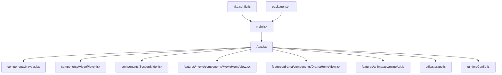
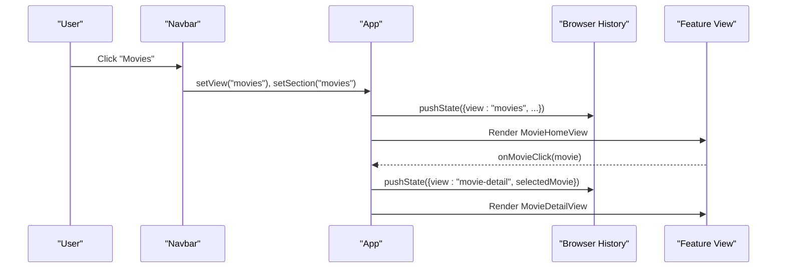
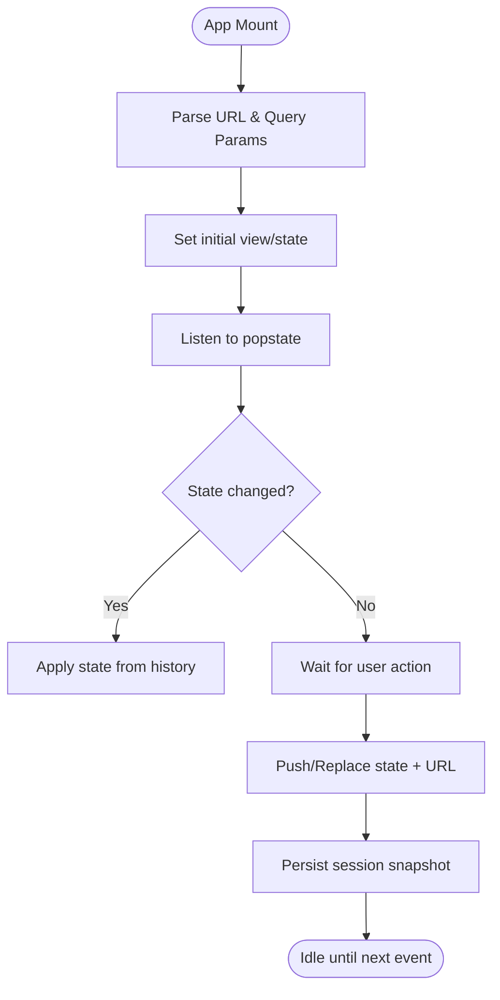
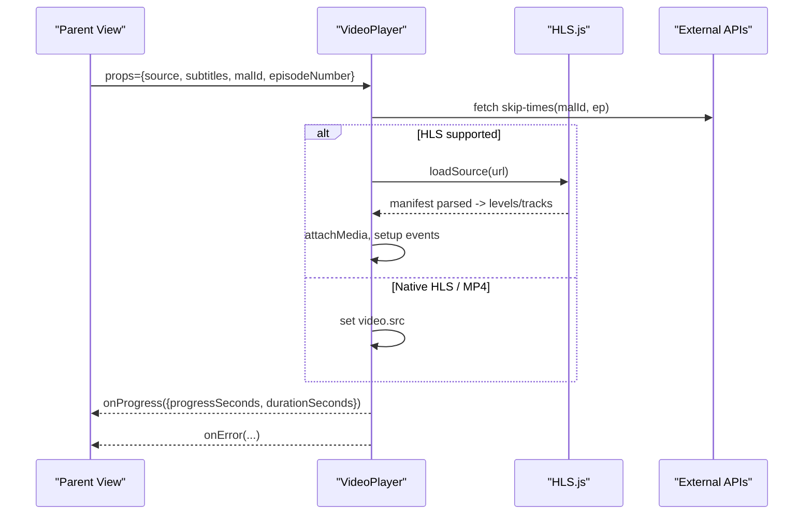
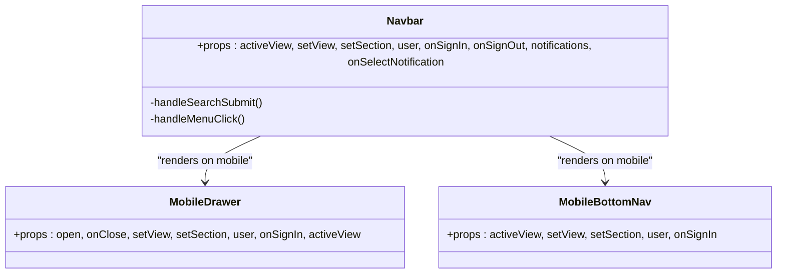
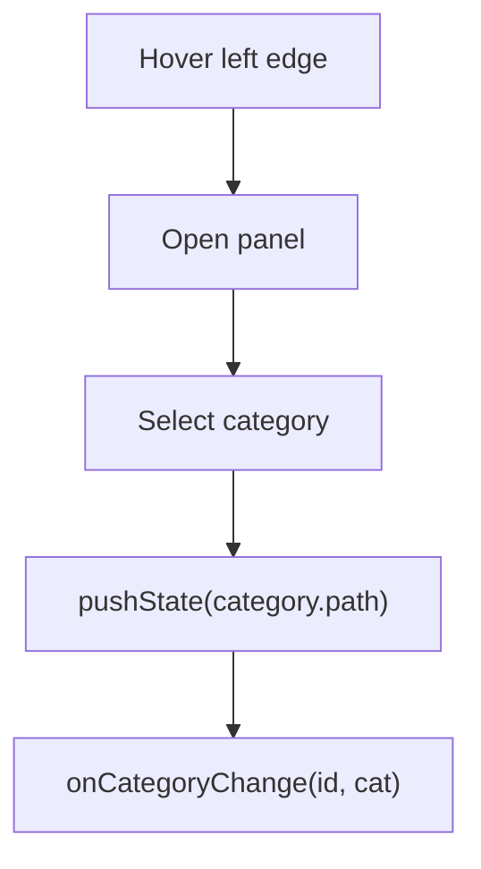
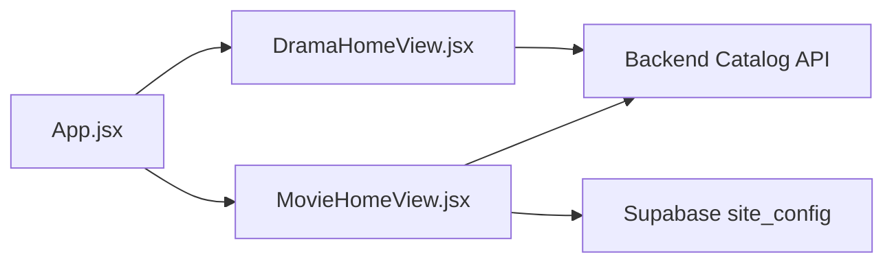
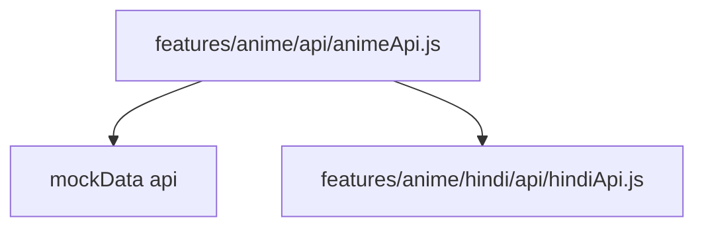
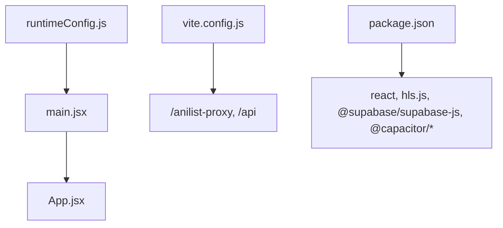

# Frontend Architecture

<cite>
**Referenced Files in This Document**
- [main.jsx](file://src/main.jsx)
- [App.jsx](file://src/App.jsx)
- [Navbar.jsx](file://src/components/Navbar.jsx)
- [VideoPlayer.jsx](file://src/components/VideoPlayer.jsx)
- [SectionSlider.jsx](file://src/components/SectionSlider.jsx)
- [MovieHomeView.jsx](file://src/features/movie/components/MovieHomeView.jsx)
- [DramaHomeView.jsx](file://src/features/drama/components/DramaHomeView.jsx)
- [animeApi.js](file://src/features/anime/api/animeApi.js)
- [storage.js](file://src/utils/storage.js)
- [runtimeConfig.js](file://src/runtimeConfig.js)
- [vite.config.js](file://vite.config.js)
- [package.json](file://package.json)
</cite>

## Table of Contents
1. Introduction
2. Project Structure
3. Core Components
4. Architecture Overview
5. Detailed Component Analysis
6. Dependency Analysis
7. Performance Considerations
8. Troubleshooting Guide
9. Conclusion

## Introduction
This document explains the frontend architecture of Project Anime’s React application. It focuses on a feature-based modular organization where each content type (anime, movies, dramas, manhwa, manga) owns its API layer, components, and state management. It also documents the component hierarchy from the root App down to reusable UI elements like VideoPlayer, Navbar, and SectionSlider; the routing strategy using browser history; state persistence with React hooks and local storage; styling approach; composition patterns; and performance techniques such as code splitting and lazy loading.

## Project Structure
The application is organized around features:
- src/features/<feature>/api: Feature-specific API clients or wrappers
- src/features/<feature>/components: Feature screens and sub-components
- src/components: Shared UI components (e.g., VideoPlayer, Navbar, SectionSlider)
- src/utils: Cross-cutting utilities (storage, runtime config, device detection)
- src/App.jsx: Orchestrates views, routing, and global state
- src/main.jsx: Bootstraps the app with dynamic import of App

**Diagram sources**
- [main.jsx:1-15](file://src/main.jsx#L1-L15)
- [App.jsx:1-50](file://src/App.jsx#L1-L50)
- [vite.config.js:1-23](file://vite.config.js#L1-L23)
- [package.json:1-45](file://package.json#L1-L45)

**Section sources**
- [main.jsx:1-15](file://src/main.jsx#L1-L15)
- [App.jsx:1-50](file://src/App.jsx#L1-L50)
- [vite.config.js:1-23](file://vite.config.js#L1-L23)
- [package.json:1-45](file://package.json#L1-L45)

## Core Components
- App: Central orchestrator for view state, navigation, data fetching, and cross-feature coordination. Manages routes via browser history and persists session state.
- Navbar: Global header with search, notifications, profile menu, and mobile drawer/bottom nav. Bridges user actions back to App view changes.
- VideoPlayer: Reusable media player supporting HLS, native HLS, MP4, subtitles, quality/audio track selection, skip intro/end, fullscreen/PiP, keyboard shortcuts, and progress reporting.
- SectionSlider: Genre/category selector that updates URL and triggers category change callbacks.

These components are composed by App and feature views to render end-to-end experiences.

**Section sources**
- [App.jsx:51-120](file://src/App.jsx#L51-L120)
- [Navbar.jsx:243-325](file://src/components/Navbar.jsx#L243-L325)
- [VideoPlayer.jsx:1-120](file://src/components/VideoPlayer.jsx#L1-L120)
- [SectionSlider.jsx:80-131](file://src/components/SectionSlider.jsx#L80-L131)

## Architecture Overview
The app uses a single-page architecture driven by internal view state and browser history rather than a client router library. App maintains a view string (e.g., home, anime, movies, drama-detail, watch) and pushes/pops history entries to keep URLs clean and shareable. Feature modules encapsulate their own data flows and UI, while shared components provide cross-cutting behavior.

**Diagram sources**
- [App.jsx:322-445](file://src/App.jsx#L322-L445)
- [Navbar.jsx:29-39](file://src/components/Navbar.jsx#L29-L39)
- [MovieHomeView.jsx:1-21](file://src/features/movie/components/MovieHomeView.jsx#L1-L21)

## Detailed Component Analysis

### App: Routing, State, and Session Management
- View routing: Maintains a view string and serializes relevant state into history entries. On mount, parses current URL to restore the correct view and data.
- History synchronization: Uses pushState/replaceState to update URLs based on view transitions and data changes. Handles popstate to navigate back/forward.
- Session restoration: Saves/restores partial app state (selected items, episodes, chapters) across sessions using utility functions.
- Data orchestration: Coordinates feature-specific data fetching and displays loading/error states through shared UI primitives.

**Diagram sources**
- [App.jsx:280-320](file://src/App.jsx#L280-L320)
- [App.jsx:322-445](file://src/App.jsx#L322-L445)
- [App.jsx:480-590](file://src/App.jsx#L480-L590)

**Section sources**
- [App.jsx:280-445](file://src/App.jsx#L280-L445)
- [App.jsx:480-590](file://src/App.jsx#L480-L590)

### VideoPlayer: Media Playback and Controls
- Source handling: Supports HLS via hls.js, native HLS (iOS), direct MP4, and iframe fallbacks.
- Quality and audio tracks: Enumerates available levels and audio tracks; allows switching at runtime.
- Subtitles: Renders text tracks and toggles CC visibility.
- Interaction: Play/pause, seek, volume, fullscreen, picture-in-picture, double-tap gestures, keyboard shortcuts.
- Progress reporting: Emits periodic progress events to parent for history/sync.
- Skip segments: Fetches skip times from an external API and offers skip buttons when applicable.

**Diagram sources**
- [VideoPlayer.jsx:148-282](file://src/components/VideoPlayer.jsx#L148-L282)
- [VideoPlayer.jsx:284-332](file://src/components/VideoPlayer.jsx#L284-L332)
- [VideoPlayer.jsx:544-585](file://src/components/VideoPlayer.jsx#L544-L585)

**Section sources**
- [VideoPlayer.jsx:1-120](file://src/components/VideoPlayer.jsx#L1-L120)
- [VideoPlayer.jsx:148-282](file://src/components/VideoPlayer.jsx#L148-L282)
- [VideoPlayer.jsx:284-332](file://src/components/VideoPlayer.jsx#L284-L332)
- [VideoPlayer.jsx:544-585](file://src/components/VideoPlayer.jsx#L544-L585)

### Navbar: Navigation, Search, and Mobile UX
- Desktop/mobile variants: Provides a top header with search, notifications, and profile; on mobile, opens a slide-in drawer or bottom nav.
- Navigation: Calls setView/setSection to switch features and scrolls to top.
- Notifications: Displays unread counts and dropdown list; supports marking/selecting notifications.
- Profile: Shows avatar, sign-in/sign-out, and quick links to personal sections.

**Diagram sources**
- [Navbar.jsx:243-325](file://src/components/Navbar.jsx#L243-L325)
- [Navbar.jsx:5-170](file://src/components/Navbar.jsx#L5-L170)
- [Navbar.jsx:194-241](file://src/components/Navbar.jsx#L194-L241)

**Section sources**
- [Navbar.jsx:243-325](file://src/components/Navbar.jsx#L243-L325)
- [Navbar.jsx:5-170](file://src/components/Navbar.jsx#L5-L170)
- [Navbar.jsx:194-241](file://src/components/Navbar.jsx#L194-L241)

### SectionSlider: Category Selection
- Presents genre cards with icons and descriptions.
- Updates URL via pushState and notifies parent via callback.
- Uses a glassmorphism panel with hover hotzone for easy access.

**Diagram sources**
- [SectionSlider.jsx:80-131](file://src/components/SectionSlider.jsx#L80-L131)
- [SectionSlider.jsx:133-227](file://src/components/SectionSlider.jsx#L133-L227)

**Section sources**
- [SectionSlider.jsx:80-131](file://src/components/SectionSlider.jsx#L80-L131)
- [SectionSlider.jsx:133-227](file://src/components/SectionSlider.jsx#L133-L227)

### Feature Modules: Movies and Dramas
- Movies Home: Displays hero carousel, category pills, horizontal rows, and a paginated grid for categories. Integrates with backend catalog endpoints and Supabase-backed “Random Picks.”
- Drama Home: Hero banner, search results, and categorized rows (Korean, Chinese, Top Rated, Recently Updated).

**Diagram sources**
- [MovieHomeView.jsx:1-21](file://src/features/movie/components/MovieHomeView.jsx#L1-L21)
- [MovieHomeView.jsx:73-115](file://src/features/movie/components/MovieHomeView.jsx#L73-L115)
- [MovieHomeView.jsx:177-229](file://src/features/movie/components/MovieHomeView.jsx#L177-L229)
- [DramaHomeView.jsx:1-21](file://src/features/drama/components/DramaHomeView.jsx#L1-L21)

**Section sources**
- [MovieHomeView.jsx:1-21](file://src/features/movie/components/MovieHomeView.jsx#L1-L21)
- [MovieHomeView.jsx:73-115](file://src/features/movie/components/MovieHomeView.jsx#L73-L115)
- [MovieHomeView.jsx:177-229](file://src/features/movie/components/MovieHomeView.jsx#L177-L229)
- [DramaHomeView.jsx:1-21](file://src/features/drama/components/DramaHomeView.jsx#L1-L21)

### API Layer Pattern: Feature-scoped Clients
Each feature exposes a small API wrapper module that centralizes calls to shared or feature-specific services. For example, the anime API re-exports methods from a shared data source and adds Hindi-specific helpers.

**Diagram sources**
- [animeApi.js:1-20](file://src/features/anime/api/animeApi.js#L1-L20)

**Section sources**
- [animeApi.js:1-20](file://src/features/anime/api/animeApi.js#L1-L20)

## Dependency Analysis
- Runtime configuration: The app loads runtime config before mounting, resolving API base from query params, serverless endpoint, static JSON, build-time env, or local dev defaults.
- Build tooling: Vite provides React plugin and dev server proxy for GraphQL and API endpoints.
- Dependencies: React 19, hls.js for streaming, Supabase client for auth and realtime, Capacitor plugins for native capabilities.

**Diagram sources**
- [runtimeConfig.js:82-129](file://src/runtimeConfig.js#L82-L129)
- [main.jsx:1-15](file://src/main.jsx#L1-L15)
- [vite.config.js:1-23](file://vite.config.js#L1-L23)
- [package.json:14-35](file://package.json#L14-L35)

**Section sources**
- [runtimeConfig.js:82-129](file://src/runtimeConfig.js#L82-L129)
- [main.jsx:1-15](file://src/main.jsx#L1-L15)
- [vite.config.js:1-23](file://vite.config.js#L1-L23)
- [package.json:14-35](file://package.json#L14-L35)

## Performance Considerations
- Code splitting and lazy loading: The root entry dynamically imports App after runtime config resolves, reducing initial bundle size and deferring heavy logic until needed.
- Efficient rendering: Feature views use memoization and pagination (e.g., movie category grid) to avoid re-renders and large DOM trees.
- Streaming optimization: HLS.js configured with retry policies and worker enabled; native HLS path used on iOS Safari.
- Local storage and preferences: Persistent settings (e.g., seek step, playlists, history) stored via a unified storage utility that prefers Capacitor Preferences on native platforms and falls back to localStorage on web.
- Network efficiency: Proxies in dev reduce CORS issues; runtime config avoids stale URLs and supports emergency overrides.

[No sources needed since this section provides general guidance]

## Troubleshooting Guide
- No playable source: VideoPlayer surfaces an error message when no stream URL is provided or when HLS fails after retries. Check source prop and network availability.
- HLS errors: Fatal errors trigger recovery attempts; if they persist, the player shows an error and stops buffering. Verify stream URL and CORS headers.
- Configuration issues: If API_BASE is not resolved, requests may fail. Use ?apiBase= for debugging or verify /api/runtime-config and static config availability.
- Storage limits: LocalStorage can be full or blocked; storage utility gracefully falls back or ignores errors. Clear storage if necessary.

**Section sources**
- [VideoPlayer.jsx:244-282](file://src/components/VideoPlayer.jsx#L244-L282)
- [runtimeConfig.js:82-129](file://src/runtimeConfig.js#L82-L129)
- [storage.js:29-70](file://src/utils/storage.js#L29-L70)

## Conclusion
Project Anime’s frontend follows a clear, scalable pattern: feature modules encapsulate domain logic and UI, shared components deliver consistent UX, and App coordinates routing and state. The combination of browser history-based routing, robust media playback, persistent storage, and runtime configuration enables a responsive, maintainable, and performant experience across web and native platforms.