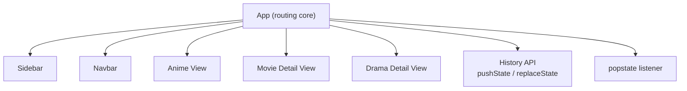
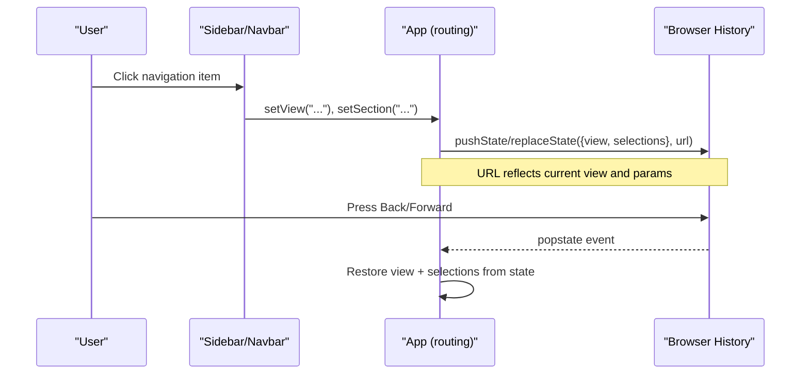
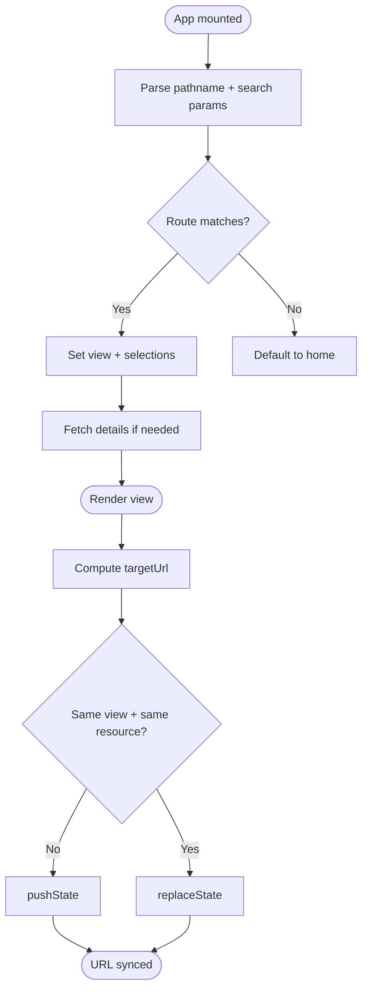
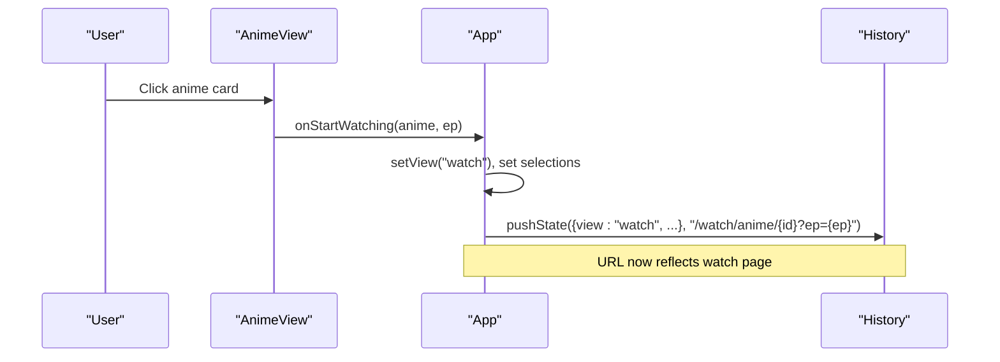
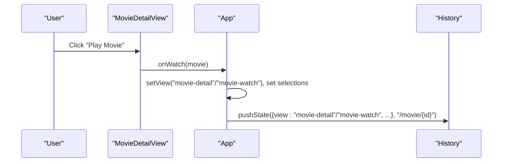
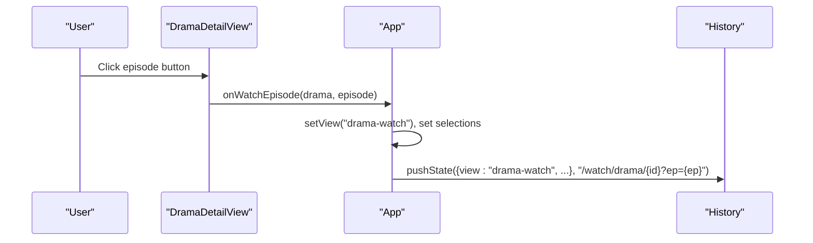
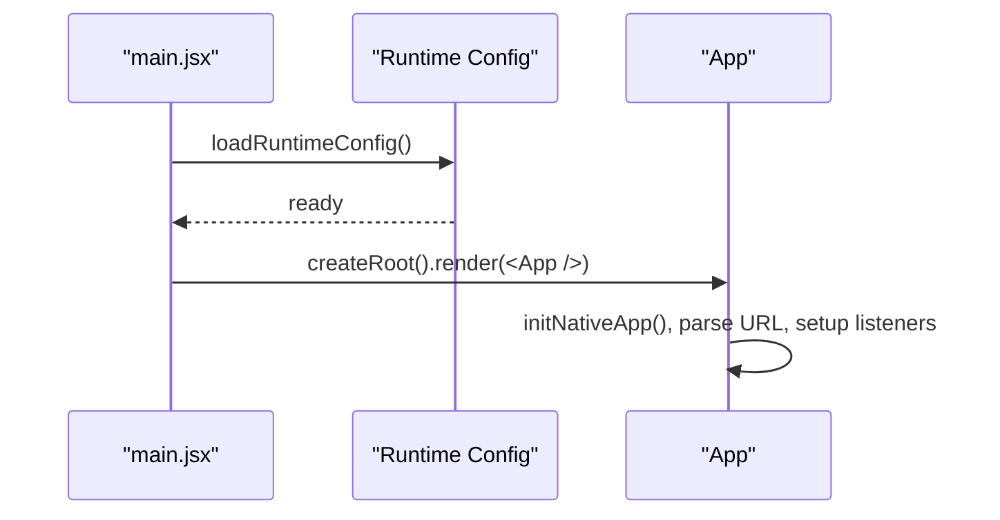

# Routing & Navigation

<cite>
**Referenced Files in This Document**
- [App.jsx](file://src/App.jsx)
- [Navbar.jsx](file://src/components/Navbar.jsx)
- [Sidebar.jsx](file://src/components/Sidebar.jsx)
- [AnimeView.jsx](file://src/features/anime/components/AnimeView.jsx)
- [MovieDetailView.jsx](file://src/features/movie/components/MovieDetailView.jsx)
- [DramaDetailView.jsx](file://src/features/drama/components/DramaDetailView.jsx)
- [main.jsx](file://src/main.jsx)
</cite>

## Table of Contents
1. [Introduction](#introduction)
2. [Project Structure](#project-structure)
3. [Core Components](#core-components)
4. [Architecture Overview](#architecture-overview)
5. [Detailed Component Analysis](#detailed-component-analysis)
6. [Dependency Analysis](#dependency-analysis)
7. [Performance Considerations](#performance-considerations)
8. [Troubleshooting Guide](#troubleshooting-guide)
9. [Conclusion](#conclusion)
10. [Appendices](#appendices)

## Introduction
This document explains Project Anime’s custom routing and navigation system, which is built on top of the browser History API rather than a traditional client-side router. The application maintains a single “view” state that determines which feature to render (home, anime, movies, dramas, manga/manhwa), while synchronizing the URL path and query parameters with the current view and selected content. It also covers how the sidebar and navbar coordinate with this routing system, how deep links are supported, and how mobile navigation patterns behave.

## Project Structure
The routing logic is centralized in the root App component, which:
- Maintains the active view and related selection state (e.g., selected anime, episode, drama, manhwa).
- Parses incoming URLs on initial load to set the correct view and data.
- Updates the browser history (push or replace) as the user navigates.
- Listens for popstate events to handle back/forward navigation.

Navigation UI components (Sidebar and Navbar) call into the App’s view setters to change routes programmatically. Feature-specific views (anime, movie, drama) trigger route changes via callbacks passed down from App.

**Diagram sources**
- [App.jsx:280-445](file://src/App.jsx#L280-L445)
- [App.jsx:503-590](file://src/App.jsx#L503-L590)
- [Navbar.jsx:29-39](file://src/components/Navbar.jsx#L29-L39)
- [Sidebar.jsx:92-96](file://src/components/Sidebar.jsx#L92-L96)

**Section sources**
- [App.jsx:280-445](file://src/App.jsx#L280-L445)
- [App.jsx:503-590](file://src/App.jsx#L503-L590)
- [Navbar.jsx:29-39](file://src/components/Navbar.jsx#L29-L39)
- [Sidebar.jsx:92-96](file://src/components/Sidebar.jsx#L92-L96)

## Core Components
- App (routing core): Holds view state, parses URLs, updates history, handles popstate, and renders feature views based on the current view.
- Sidebar: Provides persistent navigation across desktop/tablet; calls setView/setSection to navigate.
- Navbar: Provides top-level actions and a mobile drawer/bottom nav; also calls setView/setSection.
- Feature Views: Anime, Movie, Drama detail/watch/read views respond to user actions by invoking App-provided handlers that update the view and URL.

Key responsibilities:
- URL-to-view mapping on initial load and direct links.
- View-to-URL synchronization using pushState/replaceState.
- Back/Forward handling via popstate.
- Mobile drawer/bottom nav integration.

**Section sources**
- [App.jsx:280-445](file://src/App.jsx#L280-L445)
- [App.jsx:503-590](file://src/App.jsx#L503-L590)
- [Navbar.jsx:29-39](file://src/components/Navbar.jsx#L29-L39)
- [Sidebar.jsx:92-96](file://src/components/Sidebar.jsx#L92-L96)

## Architecture Overview
The routing architecture uses a single source of truth (the view state) and keeps the URL in sync with it. When the user navigates:
- The view changes.
- A clean URL path is computed from the current view and selections.
- The browser history is updated with pushState or replaceState depending on whether we are updating the same page vs. navigating to a new one.
- On back/forward, popstate restores the previous view and selections.

**Diagram sources**
- [App.jsx:280-445](file://src/App.jsx#L280-L445)
- [App.jsx:503-590](file://src/App.jsx#L503-L590)
- [Navbar.jsx:29-39](file://src/components/Navbar.jsx#L29-L39)
- [Sidebar.jsx:92-96](file://src/components/Sidebar.jsx#L92-L96)

## Detailed Component Analysis

### Custom Router in App
- State-driven routing: The app maintains a view string and associated selection states (selectedAnime, currentEpisode, selectedDrama, dramaEpisode, selectedManhwa, currentManhwaChapter, selectedMovie, comicCategory).
- URL computation: Based on the current view and selections, a target URL is constructed. Examples include:
  - Anime detail: /anime/{id}
  - Anime watch: /watch/anime/{id}?ep={number}
  - Drama detail: /drama/{id}
  - Drama watch: /watch/drama/{id}?ep={number}
  - Manhwa detail: /manhwa/{slug}
  - Manhwa read: /read/manhwa/{slug}?ch={chapter}
  - Movie detail: /movie/{id}
  - Section pages: /movies, /dramas, /manhwa, /comic, /tv-shows, /new-popular, /my-list, /hindi, /
- History management: Uses pushState for new navigations and replaceState when updating the same page (e.g., changing episodes or categories without creating a new history entry).
- Deep linking: On mount, the app parses window.location.pathname and search params to set the correct view and fetch necessary data.
- Back/Forward: A popstate listener restores the previous view and selections from the history state.

**Diagram sources**
- [App.jsx:280-445](file://src/App.jsx#L280-L445)
- [App.jsx:503-590](file://src/App.jsx#L503-L590)

**Section sources**
- [App.jsx:280-445](file://src/App.jsx#L280-L445)
- [App.jsx:503-590](file://src/App.jsx#L503-L590)

### URL Structure and Parameter Handling
- Anime detail: /anime/{id}
- Anime watch: /watch/anime/{id}?ep={number}
- Drama detail: /drama/{id}
- Drama watch: /watch/drama/{id}?ep={number}
- Manhwa detail: /manhwa/{slug}
- Manhwa read: /read/manhwa/{slug}?ch={chapter}
- Movie detail: /movie/{id}
- Sections: /movies, /dramas, /manhwa, /comic, /tv-shows, /new-popular, /my-list, /hindi, /

Examples of programmatic navigation:
- From AnimeView or other list views, clicking an item triggers a handler that sets the view to detail or watch and updates the URL accordingly.
- From MovieDetailView, pressing Play transitions to the watch flow and updates the URL.
- From DramaDetailView, selecting an episode navigates to the drama-watch view with the episode parameter.

Deep linking support:
- On initial load, the app reads the current URL and sets the appropriate view and data. For example, a direct link to /watch/anime/{id}?ep={number} will open the watch view for that episode.

Back/Forward handling:
- The popstate listener restores the previous view and selections from the history state, ensuring consistent behavior when users use browser navigation controls.

**Section sources**
- [App.jsx:280-445](file://src/App.jsx#L280-L445)
- [App.jsx:503-590](file://src/App.jsx#L503-L590)
- [MovieDetailView.jsx:108-122](file://src/features/movie/components/MovieDetailView.jsx#L108-L122)
- [DramaDetailView.jsx:23-30](file://src/features/drama/components/DramaDetailView.jsx#L23-L30)

### Sidebar and Navbar Coordination
- Sidebar:
  - Calls setView and setSection to navigate between sections (anime, comics, drama, movies).
  - Supports expandable submenus (e.g., Anime genres) and quick navigation to specific categories like Hindi dubs.
- Navbar:
  - On desktop, toggles the sidebar.
  - On mobile, opens a slide-in drawer with navigation items and a bottom tab bar for primary sections.
  - Both components ultimately call the same setView/setSection functions provided by App, keeping routing consistent across devices.

Mobile navigation patterns:
- Drawer menu provides full navigation access on small screens.
- Bottom tab bar offers quick access to Home, Anime, Movies, Comics, Drama, and You sections.
- Tapping items scrolls to top and updates the view and URL consistently.

**Section sources**
- [Sidebar.jsx:92-96](file://src/components/Sidebar.jsx#L92-L96)
- [Sidebar.jsx:218-273](file://src/components/Sidebar.jsx#L218-L273)
- [Navbar.jsx:29-39](file://src/components/Navbar.jsx#L29-L39)
- [Navbar.jsx:194-241](file://src/components/Navbar.jsx#L194-L241)
- [Navbar.jsx:305-325](file://src/components/Navbar.jsx#L305-L325)

### Feature-Specific Flows

#### Anime Flow
- List to detail/watch:
  - Users click an anime card to go to detail or start watching.
  - The view transitions to detail or watch, and the URL updates to /anime/{id} or /watch/anime/{id}?ep={number}.
- Genre/category navigation:
  - Selecting a genre updates the view to genre and pushes a URL like /anime/{genre}.

**Diagram sources**
- [AnimeView.jsx:121-126](file://src/features/anime/components/AnimeView.jsx#L121-L126)
- [App.jsx:382-445](file://src/App.jsx#L382-L445)

**Section sources**
- [AnimeView.jsx:121-126](file://src/features/anime/components/AnimeView.jsx#L121-L126)
- [App.jsx:382-445](file://src/App.jsx#L382-L445)

#### Movie Flow
- Detail to watch:
  - From MovieDetailView, pressing Play triggers navigation to the watch flow and updates the URL to /movie/{id} or the appropriate watch URL.
- Recommendations:
  - “More Like This” cards allow quick navigation to related movies, updating the view and URL.

**Diagram sources**
- [MovieDetailView.jsx:108-122](file://src/features/movie/components/MovieDetailView.jsx#L108-L122)
- [App.jsx:382-445](file://src/App.jsx#L382-L445)

**Section sources**
- [MovieDetailView.jsx:108-122](file://src/features/movie/components/MovieDetailView.jsx#L108-L122)
- [App.jsx:382-445](file://src/App.jsx#L382-L445)

#### Drama Flow
- Detail to watch:
  - From DramaDetailView, selecting an episode navigates to the drama-watch view and updates the URL to /watch/drama/{id}?ep={number}.
- Smart routing:
  - If a drama result appears to be an anime title, the app can redirect to the anime player instead.

**Diagram sources**
- [DramaDetailView.jsx:23-30](file://src/features/drama/components/DramaDetailView.jsx#L23-L30)
- [App.jsx:382-445](file://src/App.jsx#L382-L445)

**Section sources**
- [DramaDetailView.jsx:23-30](file://src/features/drama/components/DramaDetailView.jsx#L23-L30)
- [App.jsx:382-445](file://src/App.jsx#L382-L445)

### Entry Point and Initialization
- The application bootstraps by loading runtime configuration and then rendering the App component.
- App initializes native app handlers (back button, pause/resume) and sets up session restoration and deep link handling.

**Diagram sources**
- [main.jsx:6-13](file://src/main.jsx#L6-L13)
- [App.jsx:240-278](file://src/App.jsx#L240-L278)
- [App.jsx:503-590](file://src/App.jsx#L503-L590)

**Section sources**
- [main.jsx:6-13](file://src/main.jsx#L6-L13)
- [App.jsx:240-278](file://src/App.jsx#L240-L278)
- [App.jsx:503-590](file://src/App.jsx#L503-L590)

## Dependency Analysis
- App depends on:
  - Browser History API for routing (pushState, replaceState, popstate).
  - Feature components for rendering views and triggering navigation via callbacks.
  - Sidebar and Navbar for user-initiated navigation.
- Sidebar and Navbar depend on:
  - Props from App (setView, setSection) to perform navigation.
- Feature views depend on:
  - Callbacks from App to transition to detail/watch/read views and update URLs.

Potential coupling:
- Tight coupling exists between App’s view state and URL computation; any new view must update both the URL mapping and the initial parser to support deep links.
- Feature components rely on correctly named callbacks; mismatches can break navigation flows.

External dependencies:
- Supabase for auth/session sync (indirectly affects navigation via sign-in/sign-out flows).
- Native app bridge for Android back button handling.

**Section sources**
- [App.jsx:280-445](file://src/App.jsx#L280-L445)
- [App.jsx:503-590](file://src/App.jsx#L503-L590)
- [Navbar.jsx:29-39](file://src/components/Navbar.jsx#L29-L39)
- [Sidebar.jsx:92-96](file://src/components/Sidebar.jsx#L92-L96)

## Performance Considerations
- Use replaceState for same-page updates (e.g., switching episodes or categories) to avoid unnecessary history entries.
- Debounce search inputs to reduce network requests during typing.
- Lazy-load section content only when the corresponding view becomes active to minimize initial load time.
- Preload critical resources (e.g., first few manga pages) before rendering readers to improve perceived performance.

[No sources needed since this section provides general guidance]

## Troubleshooting Guide
Common issues and resolutions:
- Deep link not working:
  - Ensure the initial URL parser includes the new route pattern and sets the correct view and selections.
  - Verify that the target URL computation in the effect matches the parser.
- Back/Forward not restoring state:
  - Confirm that popstate listener restores all relevant fields from the history state.
  - Check that pushState/replaceState payloads include necessary selection data.
- Mobile drawer not navigating:
  - Ensure drawer items call setView and setSection properly and scroll to top after navigation.
- Session restore conflicts:
  - Validate that session restoration only applies when the current URL is the root path and a valid restored view exists.

**Section sources**
- [App.jsx:280-445](file://src/App.jsx#L280-L445)
- [App.jsx:503-590](file://src/App.jsx#L503-L590)
- [Navbar.jsx:29-39](file://src/components/Navbar.jsx#L29-L39)

## Conclusion
Project Anime implements a robust, lightweight routing system centered around React state and the browser History API. By maintaining a single view state and synchronizing it with clean URLs, the app supports deep linking, back/forward navigation, and responsive navigation patterns across desktop and mobile. The Sidebar and Navbar provide consistent navigation experiences, while feature components trigger route changes through well-defined callbacks. Extending the system involves updating both the URL computation and the initial parser to ensure seamless deep linking and history management.

[No sources needed since this section summarizes without analyzing specific files]

## Appendices

### Supported Routes Summary
- Home: /
- Anime listing: /anime
- Anime detail: /anime/{id}
- Anime watch: /watch/anime/{id}?ep={number}
- TV shows: /tv-shows
- Movies listing: /movies
- Movie detail: /movie/{id}
- Dramas listing: /dramas
- Drama detail: /drama/{id}
- Drama watch: /watch/drama/{id}?ep={number}
- Manhwa listing: /manhwa
- Manhwa detail: /manhwa/{slug}
- Manhwa read: /read/manhwa/{slug}?ch={chapter}
- Manga/comic listing: /comic or /manga
- Manga detail: /comic/title/{id}
- Manga reader: /read/comic/{id}?ch={chapter}
- New popular: /new-popular
- My list: /my-list
- Hindi dubs: /hindi

**Section sources**
- [App.jsx:382-445](file://src/App.jsx#L382-L445)
- [App.jsx:503-590](file://src/App.jsx#L503-L590)