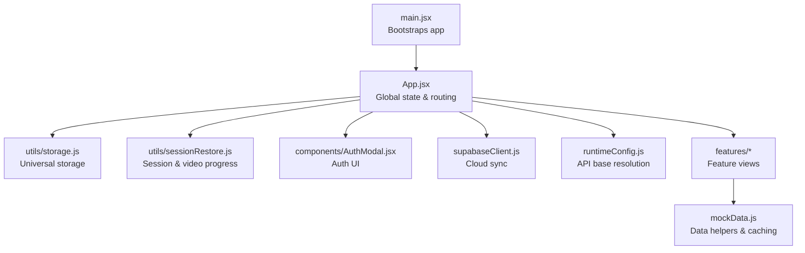
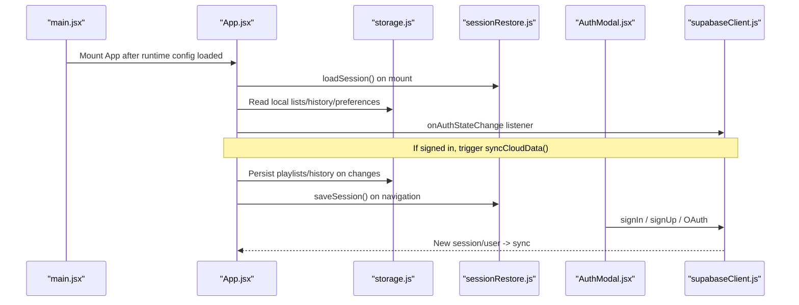
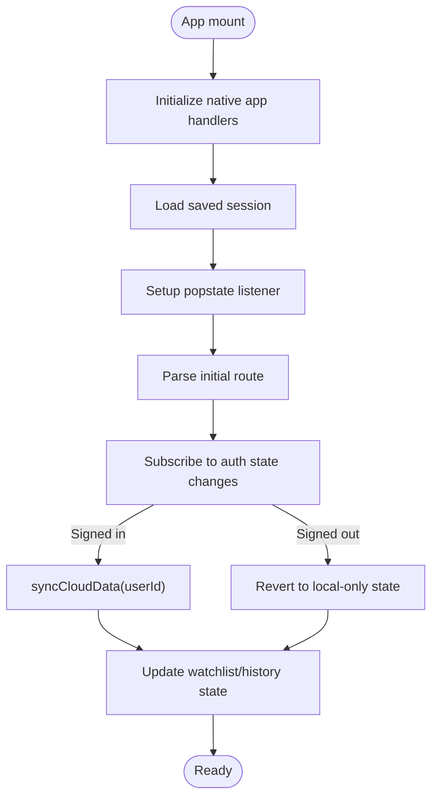
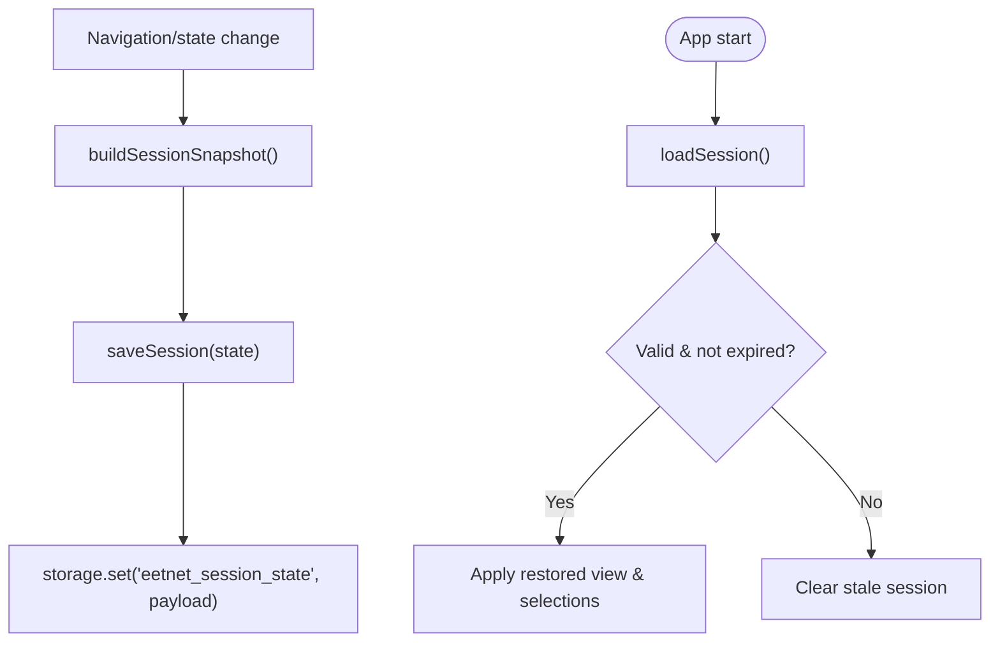
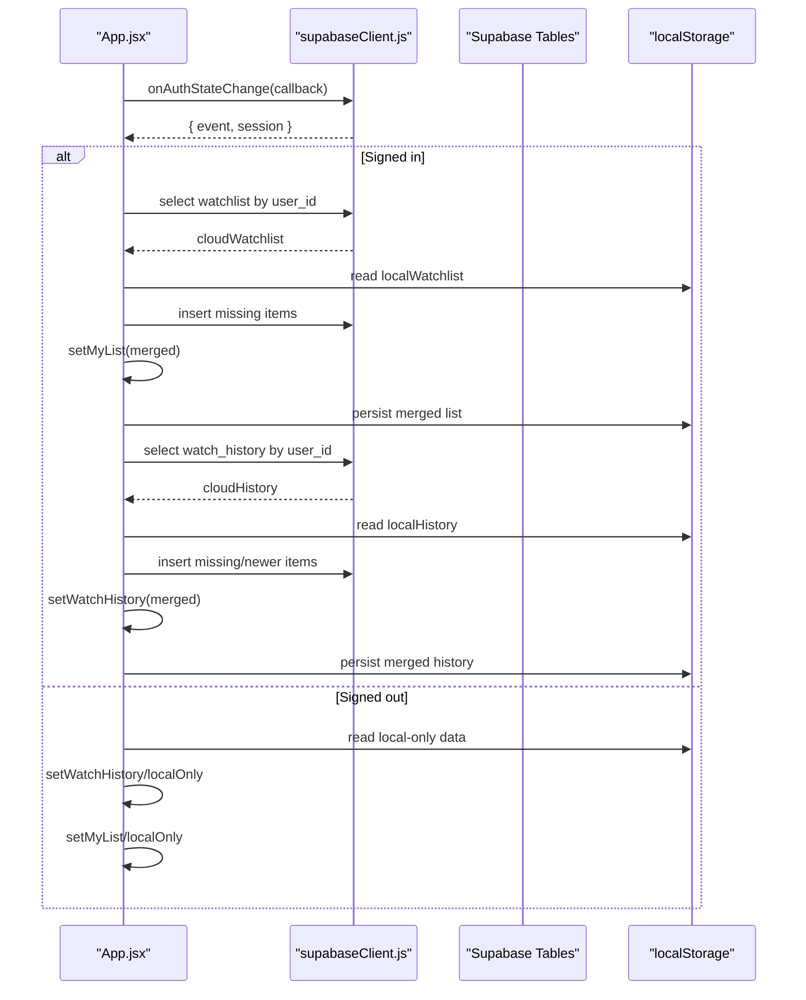
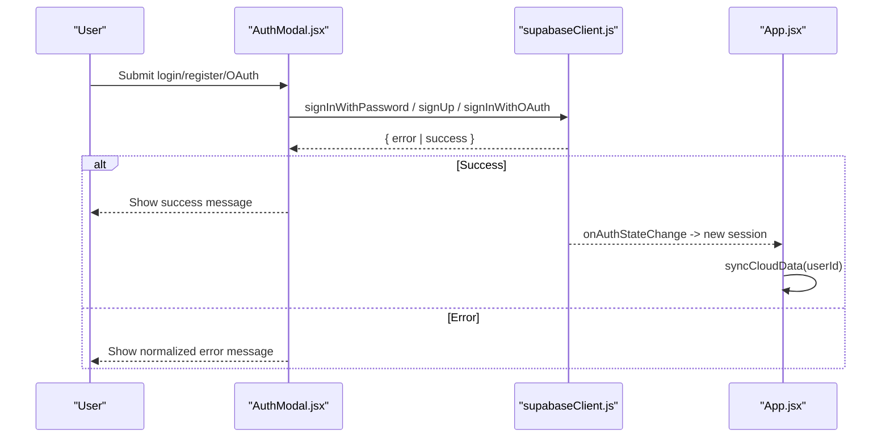
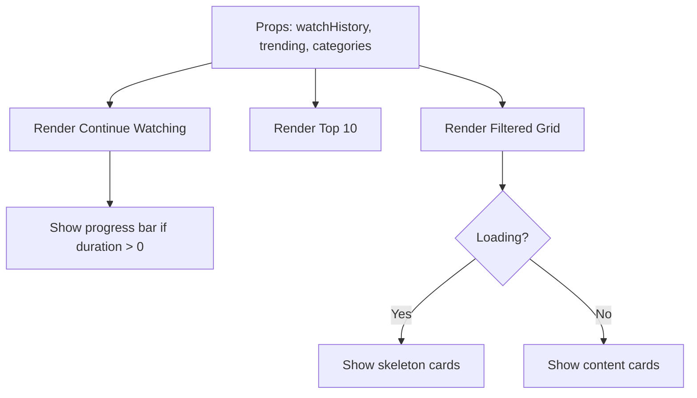
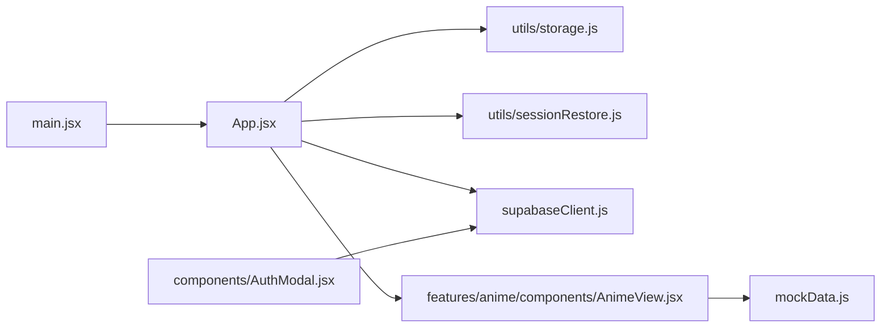

# State Management

<cite>
**Referenced Files in This Document**
- [main.jsx](file://src/main.jsx)
- [App.jsx](file://src/App.jsx)
- [AuthModal.jsx](file://src/components/AuthModal.jsx)
- [supabaseClient.js](file://src/supabaseClient.js)
- [storage.js](file://src/utils/storage.js)
- [sessionRestore.js](file://src/utils/sessionRestore.js)
- [runtimeConfig.js](file://src/runtimeConfig.js)
- [AnimeView.jsx](file://src/features/anime/components/AnimeView.jsx)
- [mockData.js](file://src/mockData.js)
</cite>

## Table of Contents
1. Introduction
2. Project Structure
3. Core Components
4. Architecture Overview
5. Detailed Component Analysis
6. Dependency Analysis
7. Performance Considerations
8. Troubleshooting Guide
9. Conclusion

## Introduction
This document explains the state management architecture for Project Anime’s React application. It covers global state orchestration from the main App component, local storage patterns for persistent user data (watch history, playlists, preferences), session restoration across browser sessions, and cloud synchronization with Supabase. It also includes examples of state updates, persistence strategies, error handling approaches, and performance considerations such as state optimization, memory management, and efficient re-rendering.

## Project Structure
At a high level:
- Application bootstrap loads runtime configuration and mounts the root App component.
- App.jsx is the central state hub managing routing views, authentication, cross-feature data sharing, and sync with cloud storage.
- A universal storage abstraction supports both Capacitor Preferences (native) and localStorage (web).
- Session utilities persist and restore app state and video playback progress.
- Supabase client provides authenticated cloud sync when configured; otherwise, it gracefully falls back to local-only behavior.
- Feature components consume shared state via props or context-like patterns orchestrated by App.

**Diagram sources**
- [main.jsx:6-13](file://src/main.jsx#L6-L13)
- [App.jsx:51-445](file://src/App.jsx#L51-L445)
- [storage.js:29-70](file://src/utils/storage.js#L29-L70)
- [sessionRestore.js:17-95](file://src/utils/sessionRestore.js#L17-L95)
- [supabaseClient.js:1-98](file://src/supabaseClient.js#L1-L98)
- [runtimeConfig.js:82-153](file://src/runtimeConfig.js#L82-L153)
- [AnimeView.jsx:45-149](file://src/features/anime/components/AnimeView.jsx#L45-L149)
- [mockData.js:79-150](file://src/mockData.js#L79-L150)

**Section sources**
- [main.jsx:6-13](file://src/main.jsx#L6-L13)
- [App.jsx:51-445](file://src/App.jsx#L51-L445)

## Core Components
- Global state orchestrator (App.jsx):
  - Manages view routing, active section, selected media, episode/chapter selection, search states, loading flags, and feature-specific data sets.
  - Persists navigation state to the browser history and to a session store for restoration.
  - Initializes auth listeners and triggers cloud sync on sign-in/sign-out.
  - Provides handlers for playlists, liked videos, watch later, and custom playlists with immediate local persistence.
- Universal storage (storage.js):
  - Abstracts Capacitor Preferences vs localStorage with JSON serialization and robust fallbacks.
- Session restoration (sessionRestore.js):
  - Saves full app session snapshots and per-media video progress with expiration policies.
- Supabase integration (supabaseClient.js):
  - Configures a real client when credentials are present; otherwise returns a mock client that prevents runtime errors and keeps the app functional locally.
- Auth modal (AuthModal.jsx):
  - Handles login/register and OAuth flows, normalizes error messages, and integrates with Supabase auth.
- Runtime config (runtimeConfig.js):
  - Resolves API base URL from multiple sources without using localStorage, ensuring consistent backend calls.

**Section sources**
- [App.jsx:51-445](file://src/App.jsx#L51-L445)
- [storage.js:29-70](file://src/utils/storage.js#L29-L70)
- [sessionRestore.js:17-95](file://src/utils/sessionRestore.js#L17-L95)
- [supabaseClient.js:1-98](file://src/supabaseClient.js#L1-L98)
- [AuthModal.jsx:121-187](file://src/components/AuthModal.jsx#L121-L187)
- [runtimeConfig.js:82-153](file://src/runtimeConfig.js#L82-L153)

## Architecture Overview
The application uses a centralized state model at the App component, with side effects coordinating persistence and cloud sync. Navigation state is mirrored into the browser history and a session store so users can resume exactly where they left off. Data features read from APIs and cache results in-memory, while user-generated lists and history are persisted locally and optionally synced to the cloud when authenticated.

**Diagram sources**
- [main.jsx:6-13](file://src/main.jsx#L6-L13)
- [App.jsx:240-278](file://src/App.jsx#L240-L278)
- [App.jsx:592-622](file://src/App.jsx#L592-L622)
- [App.jsx:624-725](file://src/App.jsx#L624-L725)
- [sessionRestore.js:17-48](file://src/utils/sessionRestore.js#L17-L48)
- [storage.js:29-70](file://src/utils/storage.js#L29-L70)
- [AuthModal.jsx:121-187](file://src/components/AuthModal.jsx#L121-L187)
- [supabaseClient.js:1-98](file://src/supabaseClient.js#L1-L98)

## Detailed Component Analysis

### Global State Orchestrator (App.jsx)
Responsibilities:
- View routing and active section management.
- Selection state for anime, movies, dramas, manhwa, manga, and chapters.
- Search and category filters with loading indicators.
- Playlists, liked videos, watch later, subscriptions, notifications.
- Watch history and watchlist state with local persistence and cloud sync.
- Browser history mirroring and session snapshotting.
- Native app lifecycle hooks for saving session on pause.

Key behaviors:
- On mount, initialize native app handlers and attempt to restore last session if applicable.
- Listen to popstate to update state from browser history.
- Push/push-replace state into history based on view transitions and data identity checks.
- Subscribe to Supabase auth changes; on sign-in, merge local and cloud data; on sign-out, revert to local-only state.
- Persist playlists and history immediately to localStorage on every change.

**Diagram sources**
- [App.jsx:240-278](file://src/App.jsx#L240-L278)
- [App.jsx:280-320](file://src/App.jsx#L280-L320)
- [App.jsx:322-445](file://src/App.jsx#L322-L445)
- [App.jsx:592-622](file://src/App.jsx#L592-L622)
- [App.jsx:624-725](file://src/App.jsx#L624-L725)

**Section sources**
- [App.jsx:51-445](file://src/App.jsx#L51-L445)
- [App.jsx:592-725](file://src/App.jsx#L592-L725)

### Local Storage Patterns
Patterns used:
- Lists and preferences stored under prefixed keys (e.g., liked videos, watch later, playlists, subscriptions, notifications).
- Immediate persistence on state changes using JSON serialization.
- Universal storage abstraction ensures compatibility across web and native environments.

Examples:
- Toggle like/watch later/custom playlist items and persist updated arrays to localStorage.
- Load initial values from localStorage with safe parsing and fallbacks.

**Section sources**
- [App.jsx:86-161](file://src/App.jsx#L86-L161)
- [App.jsx:727-800](file://src/App.jsx#L727-L800)
- [storage.js:29-70](file://src/utils/storage.js#L29-L70)

### Session Restoration Mechanism
Mechanism:
- Save full app session snapshots on navigation and meaningful state changes.
- Expiration policy for sessions older than a threshold.
- Per-media video progress saved separately with its own expiration and smart restore logic (skip near-completed items).
- On app start, attempt to restore previous session if conditions match (e.g., not home view and direct root path).

**Diagram sources**
- [sessionRestore.js:17-48](file://src/utils/sessionRestore.js#L17-L48)
- [sessionRestore.js:57-95](file://src/utils/sessionRestore.js#L57-L95)
- [App.jsx:240-278](file://src/App.jsx#L240-L278)
- [App.jsx:322-445](file://src/App.jsx#L322-L445)

**Section sources**
- [sessionRestore.js:17-95](file://src/utils/sessionRestore.js#L17-L95)
- [App.jsx:240-278](file://src/App.jsx#L240-L278)
- [App.jsx:322-445](file://src/App.jsx#L322-L445)

### Supabase Integration for Cloud Synchronization
Integration details:
- Client initialization reads environment variables and configures persistent auth storage via the universal storage adapter.
- When credentials are missing, a mock client is provided to keep the app functional offline.
- On auth state change, the app triggers a sync routine that merges local watchlist and history with cloud records, uploading local-only items and updating UI state accordingly.

**Diagram sources**
- [supabaseClient.js:1-98](file://src/supabaseClient.js#L1-L98)
- [App.jsx:592-622](file://src/App.jsx#L592-L622)
- [App.jsx:624-725](file://src/App.jsx#L624-L725)

**Section sources**
- [supabaseClient.js:1-98](file://src/supabaseClient.js#L1-L98)
- [App.jsx:592-725](file://src/App.jsx#L592-L725)

### Authentication Flow and Error Handling
Flow:
- Users authenticate via email/password or OAuth providers through the AuthModal.
- Errors are normalized into human-readable messages, including rate limiting and invalid credentials.
- Successful authentication triggers a redirect back to the app, where the auth state change listener runs sync routines.

**Diagram sources**
- [AuthModal.jsx:121-187](file://src/components/AuthModal.jsx#L121-L187)
- [supabaseClient.js:1-98](file://src/supabaseClient.js#L1-L98)
- [App.jsx:592-622](file://src/App.jsx#L592-L622)

**Section sources**
- [AuthModal.jsx:121-187](file://src/components/AuthModal.jsx#L121-L187)
- [App.jsx:592-622](file://src/App.jsx#L592-L622)

### Data Consumption and Rendering (AnimeView Example)
Behavior:
- Receives shared state via props (e.g., watch history, trending, categories).
- Renders “Continue Watching” row using watch history entries with type badges and progress bars.
- Displays top 10 and filtered content rows with skeleton loaders during loading states.

**Diagram sources**
- [AnimeView.jsx:45-149](file://src/features/anime/components/AnimeView.jsx#L45-L149)

**Section sources**
- [AnimeView.jsx:45-149](file://src/features/anime/components/AnimeView.jsx#L45-L149)

## Dependency Analysis
High-level dependencies:
- main.jsx depends on runtimeConfig and mounts App.
- App depends on storage, sessionRestore, supabaseClient, and feature components.
- AuthModal depends on supabaseClient for auth operations.
- Feature components depend on shared state passed down from App and may use mockData helpers for API interactions and caching.

**Diagram sources**
- [main.jsx:6-13](file://src/main.jsx#L6-L13)
- [App.jsx:51-445](file://src/App.jsx#L51-L445)
- [storage.js:29-70](file://src/utils/storage.js#L29-L70)
- [sessionRestore.js:17-95](file://src/utils/sessionRestore.js#L17-L95)
- [supabaseClient.js:1-98](file://src/supabaseClient.js#L1-L98)
- [AnimeView.jsx:45-149](file://src/features/anime/components/AnimeView.jsx#L45-L149)
- [mockData.js:79-150](file://src/mockData.js#L79-L150)

**Section sources**
- [main.jsx:6-13](file://src/main.jsx#L6-L13)
- [App.jsx:51-445](file://src/App.jsx#L51-L445)
- [AnimeView.jsx:45-149](file://src/features/anime/components/AnimeView.jsx#L45-L149)
- [mockData.js:79-150](file://src/mockData.js#L79-L150)

## Performance Considerations
- State minimization in session snapshots: Only essential identifiers and titles are persisted to reduce storage size and improve load times.
- Expiration policies: Sessions and video progress have age limits to avoid stale data and unnecessary restores.
- In-memory caching: API responses (e.g., AniList queries) are cached in memory with TTLs to reduce network requests and handle rate limits gracefully.
- Conditional rendering and skeletons: Loading states prevent layout shifts and provide responsive feedback.
- Efficient history updates: Replace vs push decisions minimize duplicate history entries and reduce navigation overhead.
- Graceful fallbacks: When Supabase is unconfigured, the app continues to function using local storage only, avoiding runtime errors.

[No sources needed since this section provides general guidance]

## Troubleshooting Guide
Common issues and strategies:
- Missing Supabase credentials: The app logs a warning and uses a mock client; ensure environment variables are set to enable cloud sync and social logins.
- Rate limiting during auth: Errors are normalized to friendly messages prompting users to wait before retrying.
- Session restore failures: Stale or corrupted sessions are cleared automatically based on expiration thresholds.
- Storage capacity issues: Universal storage catches exceptions and falls back to alternative storage mechanisms when available.

**Section sources**
- [supabaseClient.js:21-98](file://src/supabaseClient.js#L21-L98)
- [AuthModal.jsx:6-37](file://src/components/AuthModal.jsx#L6-L37)
- [sessionRestore.js:32-48](file://src/utils/sessionRestore.js#L32-L48)
- [storage.js:29-70](file://src/utils/storage.js#L29-L70)

## Conclusion
Project Anime’s state management centers around a single source of truth in the App component, with robust persistence via a universal storage layer and optional cloud synchronization through Supabase. Session restoration ensures continuity across browser sessions, while careful caching and conditional rendering maintain performance. Authentication integrates seamlessly with error normalization and graceful fallbacks, enabling a resilient user experience whether online or offline.