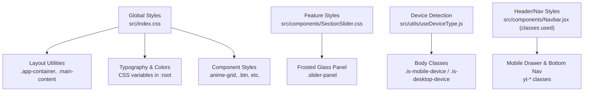
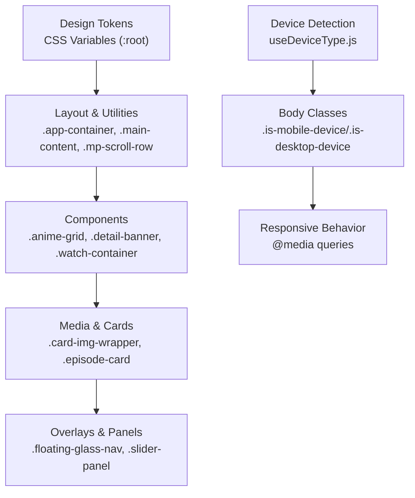
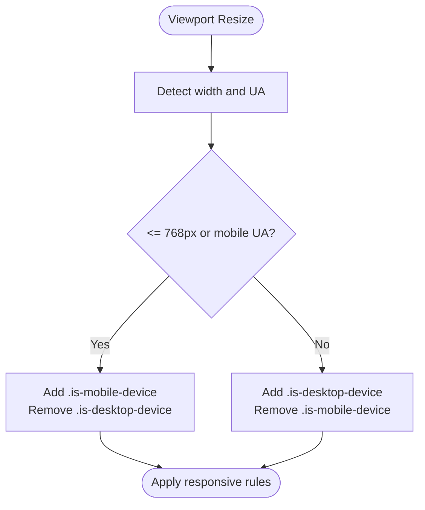
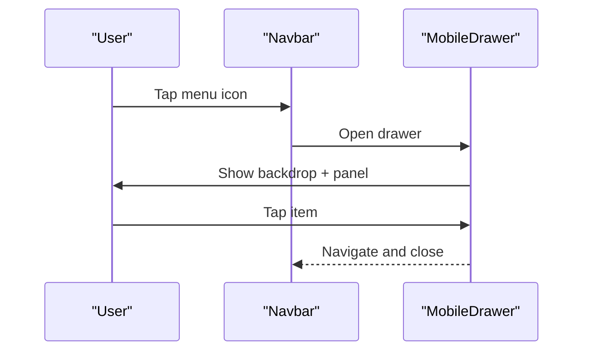
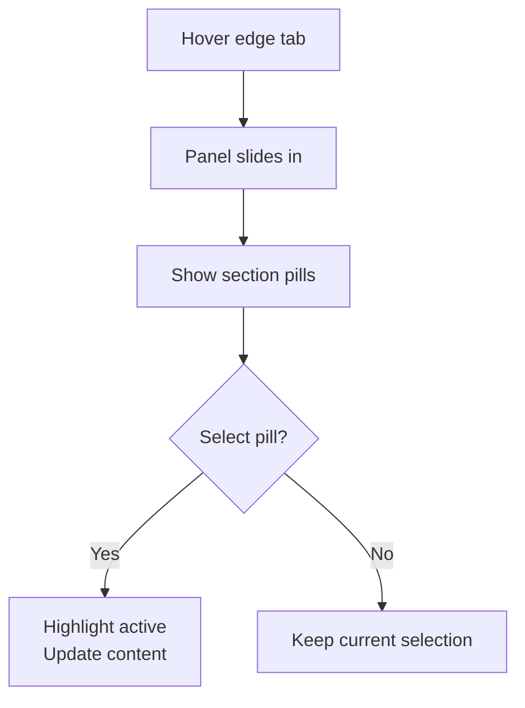
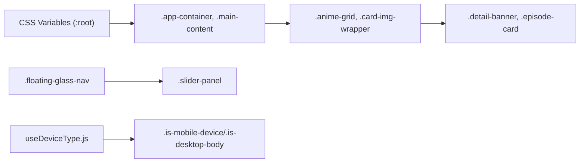

# Styling & Theming

<cite>
**Referenced Files in This Document**
- [index.css](file://src/index.css)
- [App.css](file://src/App.css)
- [SectionSlider.css](file://src/components/SectionSlider.css)
- [useDeviceType.js](file://src/utils/useDeviceType.js)
- [Navbar.jsx](file://src/components/Navbar.jsx)
</cite>

## Table of Contents
1. [Introduction](#introduction)
2. [Project Structure](#project-structure)
3. [Core Components](#core-components)
4. [Architecture Overview](#architecture-overview)
5. [Detailed Component Analysis](#detailed-component-analysis)
6. [Dependency Analysis](#dependency-analysis)
7. [Performance Considerations](#performance-considerations)
8. [Troubleshooting Guide](#troubleshooting-guide)
9. [Conclusion](#conclusion)
10. [Appendices](#appendices)

## Introduction
This document explains the styling and theming system for Project Anime’s frontend. It covers global styles, component-specific styles, responsive design patterns, color scheme implementation, typography system, spacing conventions, dark/light theme application, and guidelines for creating new styled components while maintaining consistency. It also addresses performance considerations for CSS delivery and runtime style calculations.

## Project Structure
The styling is organized into:
- Global design tokens and base styles in a central stylesheet
- Feature/component-specific styles in dedicated files
- Utility classes for common layout and interaction patterns
- Device-aware behavior via a custom hook that toggles body classes

**Diagram sources**
- [index.css:3-51](file://src/index.css#L3-L51)
- [index.css:121-176](file://src/index.css#L121-L176)
- [SectionSlider.css:84-106](file://src/components/SectionSlider.css#L84-L106)
- [useDeviceType.js:22-45](file://src/utils/useDeviceType.js#L22-L45)
- [Navbar.jsx:327-509](file://src/components/Navbar.jsx#L327-L509)

**Section sources**
- [index.css:3-51](file://src/index.css#L3-L51)
- [index.css:121-176](file://src/index.css#L121-L176)
- [SectionSlider.css:84-106](file://src/components/SectionSlider.css#L84-L106)
- [useDeviceType.js:22-45](file://src/utils/useDeviceType.js#L22-L45)
- [Navbar.jsx:327-509](file://src/components/Navbar.jsx#L327-L509)

## Core Components
- Design tokens and base layer:
  - Centralized CSS variables define colors, shadows, typography, transitions, and layout dimensions.
  - Global resets and body defaults establish consistent baseline behavior.
- Layout utilities:
  - Application container, header offset, sidebar offsets, and immersive mode adjustments.
  - Responsive breakpoints adjust margins and padding for smaller screens.
- UI primitives:
  - Buttons, chips, hover surfaces, and glass-like containers with consistent transitions and focus states.
- Media and cards:
  - Grids and card layouts with aspect ratios, badges, ratings, and hover effects.
- Navigation and overlays:
  - Frosted glass panels, slide-in drawers, and mobile bottom navigation using utility classes.

**Section sources**
- [index.css:3-51](file://src/index.css#L3-L51)
- [index.css:121-176](file://src/index.css#L121-L176)
- [index.css:178-227](file://src/index.css#L178-L227)
- [index.css:800-924](file://src/index.css#L800-L924)
- [SectionSlider.css:84-106](file://src/components/SectionSlider.css#L84-L106)
- [Navbar.jsx:327-509](file://src/components/Navbar.jsx#L327-L509)

## Architecture Overview
The styling architecture follows a layered approach:
- Layer 1: Global tokens and base styles (colors, typography, spacing, transitions)
- Layer 2: Layout and utility classes (containers, grids, scroll rows, hover surfaces)
- Layer 3: Feature/component styles (cards, detail pages, watch view, slider panel)
- Layer 4: Device-aware behaviors (body classes from device detection)

**Diagram sources**
- [index.css:3-51](file://src/index.css#L3-L51)
- [index.css:121-176](file://src/index.css#L121-L176)
- [index.css:80-117](file://src/index.css#L80-L117)
- [SectionSlider.css:84-106](file://src/components/SectionSlider.css#L84-L106)
- [useDeviceType.js:22-45](file://src/utils/useDeviceType.js#L22-L45)

## Detailed Component Analysis

### Color Scheme Implementation
- Dark theme default:
  - Background layers use progressively lighter tones to create depth.
  - Text uses primary, secondary, and muted variants for hierarchy.
  - Accent colors provide brand identity and interactive highlights.
  - Borders and hover states are defined with subtle transparency for contrast.
- Shadows and glows:
  - Small, medium, and large shadows standardize elevation.
  - Accent glow enhances primary actions and focus states.

Practical usage:
- Use background tokens for surfaces and cards.
- Apply text tokens for headings, body copy, and metadata.
- Style interactive elements with accent gradients and hover variants.
- Leverage shadow tokens for modals, panels, and elevated content.

**Section sources**
- [index.css:3-51](file://src/index.css#L3-L51)
- [index.css:178-227](file://src/index.css#L178-L227)

### Typography System
- Font stack:
  - Sans-serif font family with system fallbacks for performance and readability.
  - Consistent line height and smoothing settings across the app.
- Scale and weight:
  - Headings use heavier weights and tighter letter-spacing.
  - Body text uses regular weights with comfortable line-height.
- Transitions:
  - Fast, normal, and slow transition tokens ensure consistent motion timing.

Guidelines:
- Prefer semantic HTML and apply token-driven styles via classes.
- Maintain consistent heading hierarchy and spacing between sections.
- Use transition tokens for hover/focus animations to keep interactions smooth.

**Section sources**
- [index.css:3-51](file://src/index.css#L3-L51)

### Spacing Conventions
- Horizontal scrolling rows:
  - Uniform gap and snap behavior for carousels and lists.
  - Item sizing adapts at small breakpoints for better fit on narrow screens.
- Grid gaps:
  - Card grids use consistent gaps that tighten on mobile.
- Padding and margins:
  - Containers and sections scale down padding on smaller screens.

Examples:
- Use row utilities for horizontal lists with consistent spacing.
- Adjust grid columns and gaps via media queries for mobile-first responsiveness.

**Section sources**
- [index.css:80-117](file://src/index.css#L80-L117)
- [index.css:800-811](file://src/index.css#L800-L811)

### Responsive Design Patterns
- Breakpoints:
  - Common thresholds include small (around 640px), medium (768px), and large (1024px).
- Mobile-first:
  - Base styles target small screens; enhancements added for larger views.
- Sidebar and main content:
  - Main content margin adjusts based on sidebar state and screen size.
  - Immersive views remove sidebar offset for full-width experiences.
- Device classes:
  - Body classes toggle based on device type to conditionally style or hide features.

**Diagram sources**
- [useDeviceType.js:22-45](file://src/utils/useDeviceType.js#L22-L45)

**Section sources**
- [index.css:163-176](file://src/index.css#L163-L176)
- [index.css:1016-1023](file://src/index.css#L1016-L1023)
- [index.css:1188-1192](file://src/index.css#L1188-L1192)
- [useDeviceType.js:22-45](file://src/utils/useDeviceType.js#L22-L45)

### Dark/Light Theme Implementation
- Current implementation:
  - Default theme is dark with YouTube-inspired palette and accents.
  - All colors, borders, and backgrounds are driven by CSS variables.
- Extending to light theme:
  - Create an alternate set of variables under a different scope (e.g., a class on root or body).
  - Override tokens such as background, text, border, and accent values.
  - Ensure sufficient contrast for accessibility in both themes.
- Applying themes:
  - Toggle a class on the root element to switch variable sets.
  - Persist user preference in storage and apply on load.

Best practices:
- Keep all visual tokens in variables for easy swapping.
- Avoid hard-coded colors in components; reference tokens only.
- Test both themes for readability and contrast compliance.

**Section sources**
- [index.css:3-51](file://src/index.css#L3-L51)

### Creating New Styled Components
Guidelines:
- Use existing utility classes where possible (e.g., hover surfaces, chips, scroll rows).
- Define component-specific styles in feature/component CSS files to maintain cohesion.
- Follow naming conventions:
  - BEM-like structure for clarity (e.g., block__element--modifier).
  - Prefix with feature name when necessary to avoid collisions.
- Maintain consistency:
  - Reuse tokens for colors, spacing, and transitions.
  - Align interactions (hover, focus, active) with established patterns.

Example references:
- Button styles and hover states
- Chip styles and active states
- Card grids and image wrappers

**Section sources**
- [index.css:178-227](file://src/index.css#L178-L227)
- [index.css:800-924](file://src/index.css#L800-L924)

### Extending Existing Styles
- Hover and focus:
  - Extend hover states with consistent transitions and subtle background changes.
  - Ensure focus-visible outlines for keyboard accessibility.
- Overlays and panels:
  - Use backdrop blur and semi-transparent backgrounds for glass effects.
  - Animate transforms for open/close states with easing curves.

References:
- Floating navbar and glassmorphism
- Slide-in panel with frosted backdrop

**Section sources**
- [index.css:341-443](file://src/index.css#L341-L443)
- [SectionSlider.css:84-106](file://src/components/SectionSlider.css#L84-L106)

### Navbar and Mobile Navigation
- Header structure:
  - Left section with menu and logo
  - Center search form with input and submit button
  - Right section with notifications, profile dropdown, and sign-in
- Mobile drawer:
  - Backdrop overlay and slide-in panel with sections for navigation
  - Locks body scroll when open and closes on outside tap
- Bottom navigation:
  - Icon-based tabs for quick access to key sections

**Diagram sources**
- [Navbar.jsx:327-509](file://src/components/Navbar.jsx#L327-L509)
- [Navbar.jsx:45-170](file://src/components/Navbar.jsx#L45-L170)

**Section sources**
- [Navbar.jsx:45-170](file://src/components/Navbar.jsx#L45-L170)
- [Navbar.jsx:327-509](file://src/components/Navbar.jsx#L327-L509)

### Section Slider Panel
- Frosted glass panel:
  - Uses backdrop blur and gradient backgrounds for modern aesthetics.
  - Includes header, section pills, and card list with entry animations.
- Interaction:
  - Edge trigger zone and tab hint guide users to open the panel.
  - Active states highlight current selection with accent colors.

**Diagram sources**
- [SectionSlider.css:16-65](file://src/components/SectionSlider.css#L16-L65)
- [SectionSlider.css:147-185](file://src/components/SectionSlider.css#L147-L185)

**Section sources**
- [SectionSlider.css:16-65](file://src/components/SectionSlider.css#L16-L65)
- [SectionSlider.css:84-106](file://src/components/SectionSlider.css#L84-L106)
- [SectionSlider.css:147-185](file://src/components/SectionSlider.css#L147-L185)

## Dependency Analysis
Styling dependencies flow from global tokens to specific components:
- Global tokens influence all components through CSS variables.
- Layout utilities affect multiple components like grids and rows.
- Feature styles remain scoped to their respective components.
- Device detection influences body classes which can alter layout behavior.

**Diagram sources**
- [index.css:3-51](file://src/index.css#L3-L51)
- [index.css:121-176](file://src/index.css#L121-L176)
- [index.css:800-924](file://src/index.css#L800-L924)
- [SectionSlider.css:84-106](file://src/components/SectionSlider.css#L84-L106)
- [useDeviceType.js:22-45](file://src/utils/useDeviceType.js#L22-L45)

**Section sources**
- [index.css:3-51](file://src/index.css#L3-L51)
- [index.css:121-176](file://src/index.css#L121-L176)
- [index.css:800-924](file://src/index.css#L800-L924)
- [SectionSlider.css:84-106](file://src/components/SectionSlider.css#L84-L106)
- [useDeviceType.js:22-45](file://src/utils/useDeviceType.js#L22-L45)

## Performance Considerations
- CSS delivery:
  - Keep global styles centralized to minimize duplication.
  - Use utility classes to reduce per-component CSS bloat.
  - Avoid excessive nested selectors; prefer flat, scoped classes.
- Runtime style calculations:
  - Minimize inline styles; rely on CSS classes and variables.
  - Debounce resize handlers if adding dynamic classes frequently.
  - Use transform and opacity for animations to leverage GPU acceleration.
- Accessibility:
  - Ensure focus-visible outlines and adequate contrast in both themes.
  - Provide keyboard navigation for overlays and drawers.

[No sources needed since this section provides general guidance]

## Troubleshooting Guide
Common issues and resolutions:
- Inconsistent spacing:
  - Verify usage of utility classes for rows and grids; check breakpoint overrides.
- Theme mismatch:
  - Confirm CSS variables are applied at the correct scope; ensure no hard-coded colors override tokens.
- Mobile drawer not closing:
  - Check event listeners for outside taps and ensure backdrop has pointer events enabled.
- Sidebar overlap:
  - Validate main content margin adjustments based on sidebar state and screen size.

**Section sources**
- [index.css:163-176](file://src/index.css#L163-L176)
- [Navbar.jsx:45-170](file://src/components/Navbar.jsx#L45-L170)

## Conclusion
Project Anime’s styling system is built on a robust foundation of global tokens, utility classes, and scoped component styles. The dark theme is well-defined with clear tokens for colors, typography, and spacing. Responsive design follows mobile-first principles with consistent breakpoints and device-aware behaviors. Extending the system to support light themes and new components is straightforward by leveraging CSS variables and established patterns. Adhering to these guidelines ensures visual consistency, performance, and accessibility across the application.

[No sources needed since this section summarizes without analyzing specific files]

## Appendices

### Reference: Key CSS Variables and Tokens
- Backgrounds: primary, secondary, tertiary, card, hover
- Text: primary, secondary, muted
- Accents: primary, secondary, gradients, hover gradients
- Borders: default and hover
- Shadows: small, medium, large, glow
- Typography: font families, transitions
- Layout: sidebar widths, header height

Usage tips:
- Replace any hardcoded values with these tokens.
- Group related tokens logically in comments for maintainability.

**Section sources**
- [index.css:3-51](file://src/index.css#L3-L51)

### Reference: Utility Classes
- Surfaces and hover: yt-surface, yt-hover
- Chips: yt-chip, active state
- Glass: glass, glass-hover
- Scroll rows: mp-scroll-row, mp-scroll-item
- Skeleton loaders: mp-skeleton-card

**Section sources**
- [index.css:80-117](file://src/index.css#L80-L117)
- [index.css:178-227](file://src/index.css#L178-L227)

### Reference: Component Styles
- Hero and landing: clean-home-hero, clean-home-hero-content
- Navbar: floating-navbar-wrapper, floating-glass-nav
- Cards and grids: anime-grid, card-img-wrapper, card-badge, card-rating
- Detail page: detail-banner, detail-content, episodes-section
- Watch view: watch-container, player-area, sidebar-area

**Section sources**
- [index.css:229-340](file://src/index.css#L229-L340)
- [index.css:523-617](file://src/index.css#L523-L617)
- [index.css:800-924](file://src/index.css#L800-L924)
- [index.css:993-1180](file://src/index.css#L993-L1180)
- [index.css:1181-1200](file://src/index.css#L1181-L1200)