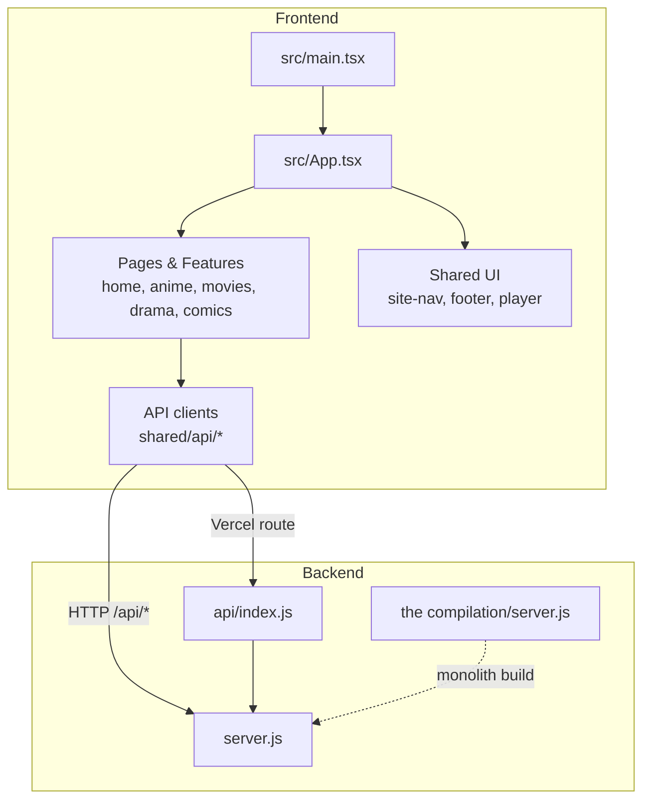
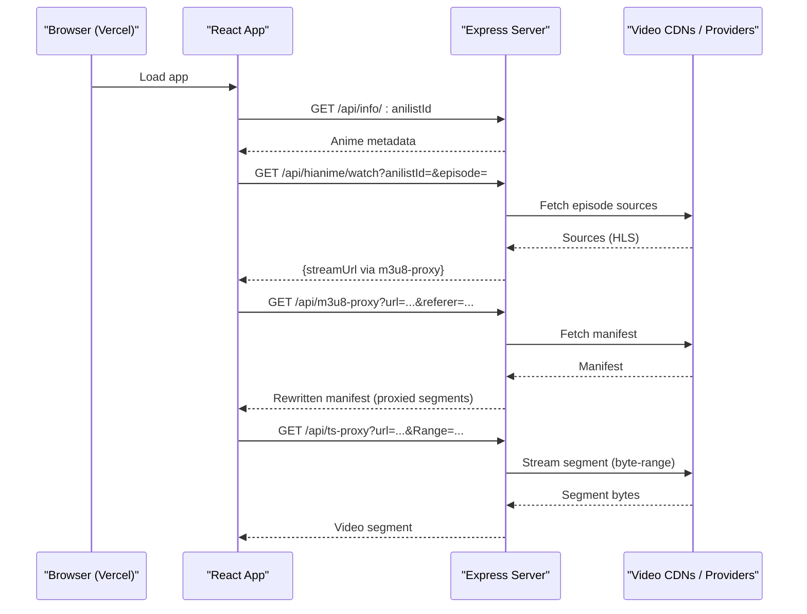
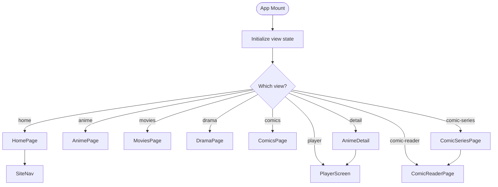
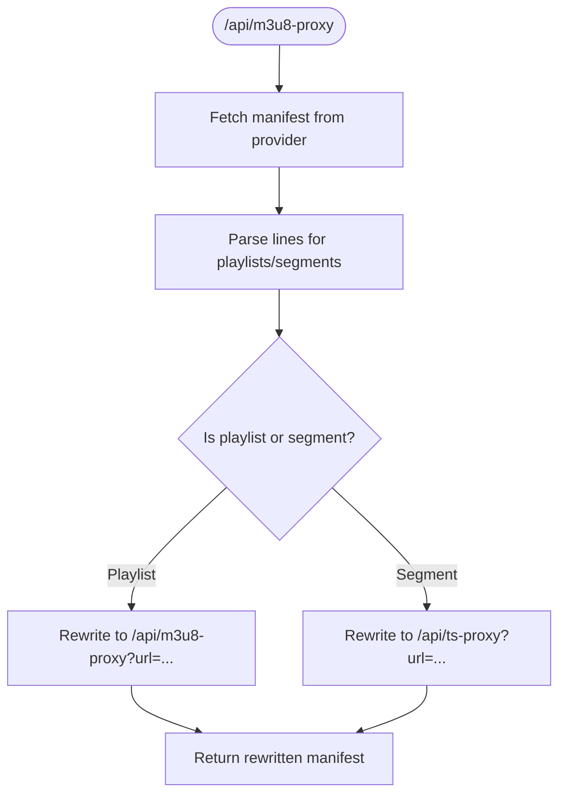
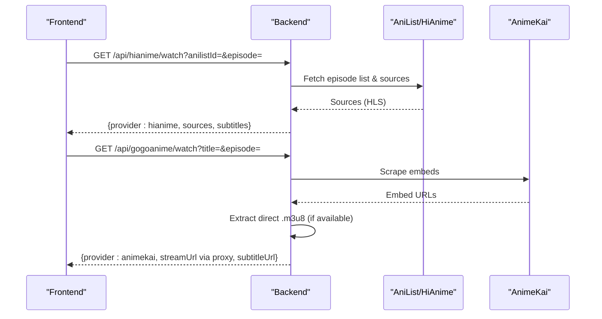
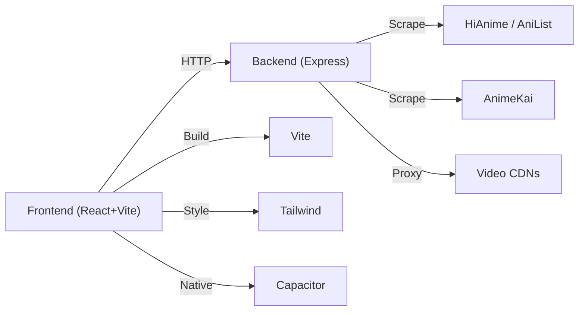

# Website Framework

<cite>
**Referenced Files in This Document**
- [package.json](file://package.json)
- [README.md](file://README.md)
- [vite.config.ts](file://vite.config.ts)
- [tailwind.config.ts](file://tailwind.config.ts)
- [capacitor.config.json](file://capacitor.config.json)
- [src/main.tsx](file://src/main.tsx)
- [src/App.tsx](file://src/App.tsx)
- [src/shared/components/site-nav.tsx](file://src/shared/components/site-nav.tsx)
- [src/pages/home/home-page.tsx](file://src/pages/home/home-page.tsx)
- [src/shared/api/config.ts](file://src/shared/api/config.ts)
- [server.js](file://server.js)
- [api/index.js](file://api/index.js)
- [the compilation/server.js](file://the compilation/server.js)
</cite>

## Table of Contents
1. [Introduction](#introduction)
2. [Project Structure](#project-structure)
3. [Core Components](#core-components)
4. [Architecture Overview](#architecture-overview)
5. [Detailed Component Analysis](#detailed-component-analysis)
6. [Dependency Analysis](#dependency-analysis)
7. [Performance Considerations](#performance-considerations)
8. [Troubleshooting Guide](#troubleshooting-guide)
9. [Conclusion](#conclusion)

## Introduction
This project is a Netflix-style streaming aggregator for anime, Asian dramas, and manhwa (webtoons). The frontend is a React + Vite application deployed on Vercel. The backend is a Node.js/Express server that scrapes content providers and proxies HLS streams to avoid CORS and mixed-content issues. It runs on an Android phone via Termux and is exposed publicly through a tunnel such as ngrok. The frontend communicates with the backend over HTTP using a build-time environment variable for the API base URL.

## Project Structure
At a high level:
- Frontend: React 19, Vite, Tailwind CSS, Lucide icons, optional Capacitor for mobile packaging.
- Backend: Express server with scraping and streaming proxy logic; also a compiled monolith combining multiple services.
- Configuration: Vite config, Tailwind theme, Capacitor app settings, package scripts.

**Diagram sources**
- [src/main.tsx:1-7](file://src/main.tsx#L1-L7)
- [src/App.tsx:1-174](file://src/App.tsx#L1-L174)
- [server.js:1-100](file://server.js#L1-L100)
- [the compilation/server.js:1-50](file://the compilation/server.js#L1-L50)
- [api/index.js:1-4](file://api/index.js#L1-L4)

**Section sources**
- [package.json:1-46](file://package.json#L1-L46)
- [README.md:1-160](file://README.md#L1-L160)
- [vite.config.ts:1-7](file://vite.config.ts#L1-L7)
- [tailwind.config.ts:1-50](file://tailwind.config.ts#L1-L50)
- [capacitor.config.json:1-32](file://capacitor.config.json#L1-L32)

## Core Components
- Application shell: mounts React root and renders App with global navigation state.
- Routing: simple view state in App drives page rendering (home, anime, movies, drama, comics, detail, player, comic series/reader).
- Navigation: SiteNav provides top-level links and active section highlighting.
- Home page: composes hero, marquee, trending rail, staff pick, and footer.
- API configuration: runtime fetches service endpoints from a JSON config or falls back to defaults.

Key responsibilities:
- App manages view transitions and passes data between pages (e.g., selected anime, episodes, chapters).
- SiteNav exposes navigation actions and highlights the current section.
- HomePage orchestrates feature-specific components and callbacks.
- Config abstraction centralizes API base URLs for different services.

**Section sources**
- [src/main.tsx:1-7](file://src/main.tsx#L1-L7)
- [src/App.tsx:17-174](file://src/App.tsx#L17-L174)
- [src/shared/components/site-nav.tsx:1-73](file://src/shared/components/site-nav.tsx#L1-L73)
- [src/pages/home/home-page.tsx:1-42](file://src/pages/home/home-page.tsx#L1-L42)
- [src/shared/api/config.ts:1-48](file://src/shared/api/config.ts#L1-L48)

## Architecture Overview
The system follows a client-server architecture:
- Browser (Vercel) calls backend APIs under /api.
- Backend normalizes routes, handles CORS, and proxies media requests.
- Streaming proxy rewrites HLS manifests and segments so browsers only talk to the backend’s public URL.
- Scrapers retrieve metadata and stream sources from external sites.

**Diagram sources**
- [server.js:235-393](file://server.js#L235-L393)
- [server.js:737-794](file://server.js#L737-L794)
- [the compilation/server.js:534-800](file://the compilation/server.js#L534-L800)

## Detailed Component Analysis

### Frontend Shell and Routing
- Root entry mounts React.StrictMode and renders App.
- App maintains view state and shared data (selected anime, episodes, dub selection, comic chapters).
- Conditional rendering selects the appropriate page component based on view.
- Navigation updates are centralized via navigate and open* helpers.

**Diagram sources**
- [src/main.tsx:1-7](file://src/main.tsx#L1-L7)
- [src/App.tsx:24-174](file://src/App.tsx#L24-L174)

**Section sources**
- [src/main.tsx:1-7](file://src/main.tsx#L1-L7)
- [src/App.tsx:24-174](file://src/App.tsx#L24-L174)

### Navigation
- SiteNav renders primary links and highlights the active section.
- Clicking a link triggers onNavigate to switch views.
- Section labels and colors adapt per active page.

**Section sources**
- [src/shared/components/site-nav.tsx:1-73](file://src/shared/components/site-nav.tsx#L1-L73)

### Home Page Composition
- HomePage composes DriftHero, poster marquee, trending rail, staff pick, and footer.
- Provides callbacks to open categories or specific anime details.

**Section sources**
- [src/pages/home/home-page.tsx:1-42](file://src/pages/home/home-page.tsx#L1-L42)

### API Configuration
- getApiConfig loads runtime configuration from /eetnet-config.json and caches it.
- Falls back to default service endpoints if the config file is unavailable.
- Provides both async and sync accessors for convenience.

**Section sources**
- [src/shared/api/config.ts:1-48](file://src/shared/api/config.ts#L1-L48)

### Backend: Streaming Proxy
- /api/m3u8-proxy fetches HLS manifests, resolves relative URLs, and rewrites them to use the backend’s proxy endpoints.
- /api/ts-proxy forwards byte-range requests to upstream CDNs for efficient streaming.
- Referer and Origin headers are set to satisfy provider protections.
- Public host is derived from X-Forwarded-* headers to keep rewritten URLs correct behind tunnels.

**Diagram sources**
- [server.js:263-345](file://server.js#L263-L345)
- [server.js:354-393](file://server.js#L354-L393)

**Section sources**
- [server.js:263-393](file://server.js#L263-L393)

### Backend: Anime Watch Flow
- /api/hianime/watch uses AniList ID to resolve season-correct episodes and returns HLS sources.
- /api/gogoanime/watch scrapes AnimeKai embeds, extracts direct .m3u8 when possible, and otherwise falls back to iframe.
- Results include proxied stream URLs via /api/m3u8-proxy and subtitle handling.

**Diagram sources**
- [server.js:737-794](file://server.js#L737-L794)
- [the compilation/server.js:624-749](file://the compilation/server.js#L624-L749)

**Section sources**
- [server.js:737-794](file://server.js#L737-L794)
- [the compilation/server.js:624-749](file://the compilation/server.js#L624-L749)

### Backend: Health and Info
- /api/health returns service status, uptime, configured providers, and public base URL.
- /api/info/:anilistId returns structured anime metadata via Consumet/Meta adapters.

**Section sources**
- [server.js:715-735](file://server.js#L715-L735)
- [the compilation/server.js:592-622](file://the compilation/server.js#L592-L622)

### Mobile Packaging (Capacitor)
- Capacitor config defines app identity, splash screen, status bar, keyboard behavior, and Android-specific options.
- WebDir points to the built output for native packaging.

**Section sources**
- [capacitor.config.json:1-32](file://capacitor.config.json#L1-L32)

## Dependency Analysis
- Frontend dependencies include React 19, Vite, Tailwind, and optional Capacitor plugins for native features.
- Backend depends on Express, Axios, Cheerio, and Consumet extensions for scraping and metadata.
- Build tooling: Vite for dev/build, Oxlint for linting, Sharp for image processing.

**Diagram sources**
- [package.json:15-44](file://package.json#L15-L44)
- [server.js:1-20](file://server.js#L1-L20)
- [vite.config.ts:1-7](file://vite.config.ts#L1-L7)
- [tailwind.config.ts:1-50](file://tailwind.config.ts#L1-L50)
- [capacitor.config.json:1-32](file://capacitor.config.json#L1-L32)

**Section sources**
- [package.json:1-46](file://package.json#L1-L46)

## Performance Considerations
- Streaming performance relies on byte-range requests forwarded by /api/ts-proxy, enabling fast startup and seeking without downloading entire files.
- Manifest rewriting ensures all assets go through the backend, avoiding CORS and mixed-content issues while allowing caching headers.
- In-memory caches reduce repeated network calls for episode lists and stream results.
- Referer and Origin header strategies help bypass provider protections and improve reliability.

[No sources needed since this section provides general guidance]

## Troubleshooting Guide
Common issues and mitigations:
- Empty drama/manhwa sections: backend may be down or VITE_API_BASE points to a stale tunnel URL. Restart the backend chain and redeploy the frontend with the current URL.
- Videos fail to play but metadata loads: video CDN may block the backend IP; route video through the same relay used for KissKH if necessary.
- Tunnel challenges (403): some tunnels challenge datacenter IPs; use a tunnel without Cloudflare-edge challenges or a named Cloudflare Tunnel with Bot Fight Mode off.
- Image loading failures: ensure /api/img-proxy is reachable and upstream images allow referer-based access.

Operational tips:
- Keep proxy.py (if used) on a separate port from the API server to avoid binding conflicts.
- Ensure CORS_ORIGIN allows your Vercel domain during development and production.
- Verify publicHost resolution behind tunnels by checking /api/health.

**Section sources**
- [README.md:144-160](file://README.md#L144-L160)
- [server.js:715-735](file://server.js#L715-L735)

## Conclusion
This framework combines a modern React/Vite frontend with a robust Node.js backend that scrapes content providers and proxies HLS streams. The design emphasizes reliability through careful header handling, manifest rewriting, and caching. Deployment targets include Vercel for the frontend and a mobile-hosted backend tunneled publicly. The modular structure supports adding new content types and providers while maintaining a consistent user experience across anime, movies, drama, and comics.